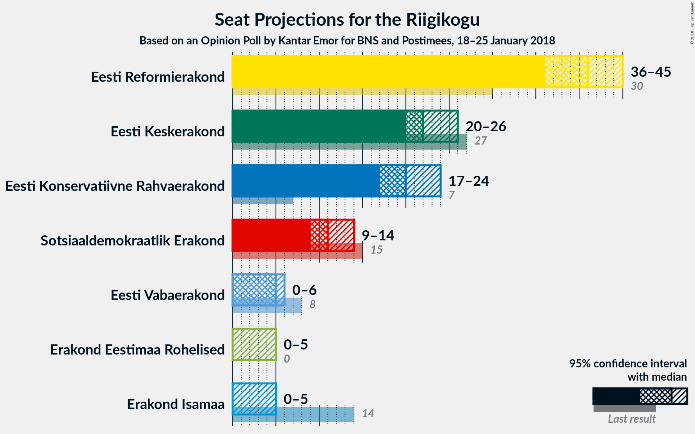
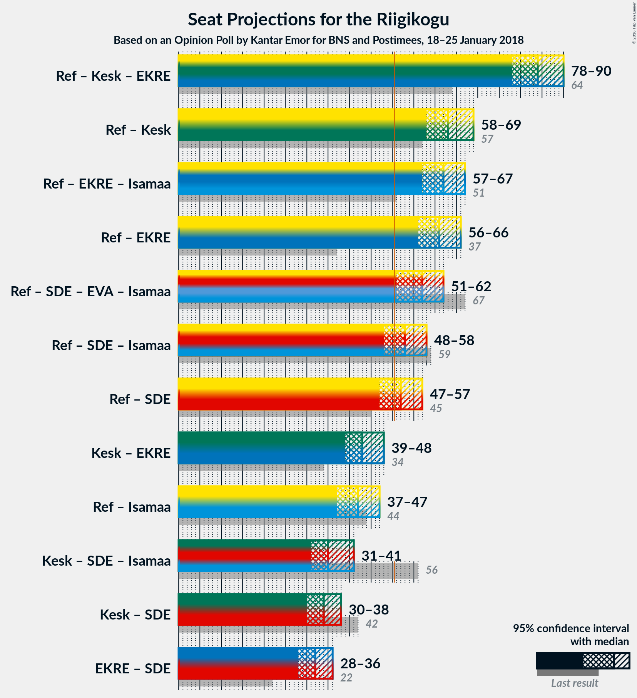

# Opinion Poll by Kantar Emor for BNS and Postimees, 18–25 January 2018

<a href="#voting-intentions">Voting Intentions</a> | <a href="#seats">Seats</a> | <a href="#coalitions">Coalitions</a> | <a href="#technical-information">Technical Information</a>

## Voting Intentions

### Confidence Intervals

| Party | Last Result | Poll Result | 80% Confidence Interval | 90% Confidence Interval | 95% Confidence Interval | 99% Confidence Interval |
|:-----:|:-----------:|:-----------:|:-----------------------:|:-----------------------:|:-----------------------:|:-----------------------:|
| Eesti Reformierakond | 27.7% | 34.2% | 32.4–36.1% |31.9–36.6% |31.5–37.1% |30.7–38.0% |
| Eesti Keskerakond | 24.8% | 20.5% | 19.0–22.1% |18.6–22.6% |18.2–23.0% |17.5–23.8% |
| Eesti Konservatiivne Rahvaerakond | 8.1% | 18.4% | 17.0–20.0% |16.6–20.4% |16.2–20.8% |15.6–21.6% |
| Sotsiaaldemokraatlik Erakond | 15.2% | 11.0% | 9.9–12.3% |9.6–12.7% |9.3–13.0% |8.8–13.7% |
| Eesti Vabaerakond | 8.7% | 5.4% | 4.6–6.4% |4.4–6.7% |4.2–6.9% |3.9–7.4% |
| Erakond Isamaa | 13.7% | 4.5% | 3.8–5.4% |3.6–5.7% |3.4–5.9% |3.1–6.4% |
| Erakond Eestimaa Rohelised | 0.9% | 4.5% | 3.8–5.4% |3.6–5.7% |3.4–5.9% |3.1–6.4% |

*Note:* The poll result column reflects the actual value used in the calculations. Published results may vary slightly, and in addition be rounded to fewer digits.

## Seats

### Confidence Intervals

| Party | Last Result | Median | 80% Confidence Interval | 90% Confidence Interval | 95% Confidence Interval | 99% Confidence Interval |
|:-----:|:-----------:|:------:|:-----------------------:|:-----------------------:|:-----------------------:|:-----------------------:|
| <a href="#eesti-reformierakond">Eesti Reformierakond</a> | 30 | 35 | 35–36 |35–37 |35–39 |33–40 |
| <a href="#eesti-keskerakond">Eesti Keskerakond</a> | 27 | 23 | 21–24 |21–24 |21–27 |21–27 |
| <a href="#eesti-konservatiivne-rahvaerakond">Eesti Konservatiivne Rahvaerakond</a> | 7 | 20 | 20–23 |19–23 |18–23 |18–24 |
| <a href="#sotsiaaldemokraatlik-erakond">Sotsiaaldemokraatlik Erakond</a> | 15 | 13 | 11–15 |10–15 |10–15 |9–15 |
| <a href="#eesti-vabaerakond">Eesti Vabaerakond</a> | 8 | 6 | 5–6 |5–6 |5–6 |0–7 |
| <a href="#erakond-isamaa">Erakond Isamaa</a> | 14 | 0 | 0 |0 |0 |0–5 |
| <a href="#erakond-eestimaa-rohelised">Erakond Eestimaa Rohelised</a> | 0 | 4 | 0–5 |0–5 |0–6 |0–6 |

### Eesti Reformierakond

*For a full overview of the results for this party, see the [Eesti Reformierakond](party-eestireformierakond.html) page.*

| Number of Seats | Probability | Accumulated | Special Marks |
|:---------------:|:-----------:|:-----------:|:-------------:|
| 30 | 0% | 100% | Last Result |
| 31 | 0% | 100% |  |
| 32 | 0% | 100% |  |
| 33 | 0.8% | 100% |  |
| 34 | 1.0% | 99.2% |  |
| 35 | 69% | 98% | Median |
| 36 | 24% | 30% |  |
| 37 | 3% | 6% |  |
| 38 | 0% | 3% |  |
| 39 | 1.1% | 3% |  |
| 40 | 1.3% | 2% |  |
| 41 | 0% | 0.3% |  |
| 42 | 0% | 0.3% |  |
| 43 | 0% | 0.3% |  |
| 44 | 0.1% | 0.3% |  |
| 45 | 0% | 0.2% |  |
| 46 | 0% | 0.2% |  |
| 47 | 0% | 0.2% |  |
| 48 | 0% | 0.2% |  |
| 49 | 0% | 0.2% |  |
| 50 | 0.1% | 0.2% |  |
| 51 | 0.1% | 0.1% | Majority |
| 52 | 0% | 0% |  |

### Eesti Keskerakond

*For a full overview of the results for this party, see the [Eesti Keskerakond](party-eestikeskerakond.html) page.*

| Number of Seats | Probability | Accumulated | Special Marks |
|:---------------:|:-----------:|:-----------:|:-------------:|
| 20 | 0.1% | 100% |  |
| 21 | 25% | 99.9% |  |
| 22 | 5% | 74% |  |
| 23 | 53% | 70% | Median |
| 24 | 14% | 17% |  |
| 25 | 0% | 3% |  |
| 26 | 0.1% | 3% |  |
| 27 | 3% | 3% | Last Result |
| 28 | 0% | 0% |  |

### Eesti Konservatiivne Rahvaerakond

*For a full overview of the results for this party, see the [Eesti Konservatiivne Rahvaerakond](party-eestikonservatiivnerahvaerakond.html) page.*

| Number of Seats | Probability | Accumulated | Special Marks |
|:---------------:|:-----------:|:-----------:|:-------------:|
| 7 | 0% | 100% | Last Result |
| 8 | 0% | 100% |  |
| 9 | 0% | 100% |  |
| 10 | 0% | 100% |  |
| 11 | 0% | 100% |  |
| 12 | 0% | 100% |  |
| 13 | 0% | 100% |  |
| 14 | 0% | 100% |  |
| 15 | 0% | 100% |  |
| 16 | 0% | 100% |  |
| 17 | 0.2% | 100% |  |
| 18 | 3% | 99.8% |  |
| 19 | 4% | 97% |  |
| 20 | 52% | 93% | Median |
| 21 | 14% | 41% |  |
| 22 | 8% | 27% |  |
| 23 | 17% | 19% |  |
| 24 | 1.4% | 1.4% |  |
| 25 | 0% | 0% |  |

### Sotsiaaldemokraatlik Erakond

*For a full overview of the results for this party, see the [Sotsiaaldemokraatlik Erakond](party-sotsiaaldemokraatlikerakond.html) page.*

| Number of Seats | Probability | Accumulated | Special Marks |
|:---------------:|:-----------:|:-----------:|:-------------:|
| 9 | 1.2% | 100% |  |
| 10 | 6% | 98.7% |  |
| 11 | 5% | 93% |  |
| 12 | 21% | 88% |  |
| 13 | 53% | 67% | Median |
| 14 | 0% | 14% |  |
| 15 | 14% | 14% | Last Result |
| 16 | 0% | 0% |  |

### Eesti Vabaerakond

*For a full overview of the results for this party, see the [Eesti Vabaerakond](party-eestivabaerakond.html) page.*

| Number of Seats | Probability | Accumulated | Special Marks |
|:---------------:|:-----------:|:-----------:|:-------------:|
| 0 | 2% | 100% |  |
| 1 | 0% | 98% |  |
| 2 | 0% | 98% |  |
| 3 | 0% | 98% |  |
| 4 | 0.1% | 98% |  |
| 5 | 32% | 98% |  |
| 6 | 64% | 66% | Median |
| 7 | 2% | 2% |  |
| 8 | 0% | 0% | Last Result |

### Erakond Isamaa

*For a full overview of the results for this party, see the [Erakond Isamaa](party-erakondisamaa.html) page.*

| Number of Seats | Probability | Accumulated | Special Marks |
|:---------------:|:-----------:|:-----------:|:-------------:|
| 0 | 98% | 100% | Median |
| 1 | 0% | 2% |  |
| 2 | 0% | 2% |  |
| 3 | 0% | 2% |  |
| 4 | 1.2% | 2% |  |
| 5 | 0.9% | 1.0% |  |
| 6 | 0.1% | 0.2% |  |
| 7 | 0% | 0% |  |
| 8 | 0% | 0% |  |
| 9 | 0% | 0% |  |
| 10 | 0% | 0% |  |
| 11 | 0% | 0% |  |
| 12 | 0% | 0% |  |
| 13 | 0% | 0% |  |
| 14 | 0% | 0% | Last Result |

### Erakond Eestimaa Rohelised

*For a full overview of the results for this party, see the [Erakond Eestimaa Rohelised](party-erakondeestimaarohelised.html) page.*

| Number of Seats | Probability | Accumulated | Special Marks |
|:---------------:|:-----------:|:-----------:|:-------------:|
| 0 | 18% | 100% | Last Result |
| 1 | 0% | 82% |  |
| 2 | 0% | 82% |  |
| 3 | 0% | 82% |  |
| 4 | 51% | 82% | Median |
| 5 | 26% | 31% |  |
| 6 | 5% | 5% |  |
| 7 | 0% | 0% |  |

## Coalitions

### Confidence Intervals

| Coalition | Last Result | Median | Majority? | 80% Confidence Interval | 90% Confidence Interval | 95% Confidence Interval | 99% Confidence Interval |
|:---------:|:-----------:|:------:|:---------:|:-----------------------:|:-----------------------:|:-----------------------:|:-----------------------:|
| Eesti Reformierakond – Eesti Keskerakond – Eesti Konservatiivne Rahvaerakond | 64 | 78 | 100% | 78–81 | 78–82 | 78–83 | 73–83 |
| Eesti Reformierakond – Eesti Keskerakond | 57 | 58 | 100% | 56–60 | 56–61 | 56–64 | 55–64 |
| Eesti Reformierakond – Eesti Konservatiivne Rahvaerakond – Erakond Isamaa | 51 | 55 | 100% | 55–58 | 55–58 | 55–59 | 55–60 |
| Eesti Reformierakond – Sotsiaaldemokraatlik Erakond – Eesti Vabaerakond – Erakond Isamaa | 67 | 54 | 98.6% | 52–56 | 52–56 | 52–56 | 49–56 |
| Eesti Reformierakond – Sotsiaaldemokraatlik Erakond – Erakond Isamaa | 59 | 48 | 14% | 47–51 | 46–51 | 46–51 | 46–51 |
| Eesti Reformierakond – Sotsiaaldemokraatlik Erakond | 45 | 48 | 14% | 47–51 | 46–51 | 46–51 | 44–51 |
| Eesti Reformierakond – Erakond Isamaa | 44 | 35 | 0.1% | 35–36 | 35–37 | 35–39 | 35–40 |
| Eesti Keskerakond – Sotsiaaldemokraatlik Erakond – Erakond Isamaa | 56 | 36 | 0% | 32–39 | 31–39 | 31–39 | 31–39 |

### Eesti Reformierakond – Eesti Keskerakond – Eesti Konservatiivne Rahvaerakond

| Number of Seats | Probability | Accumulated | Special Marks |
|:---------------:|:-----------:|:-----------:|:-------------:|
| 64 | 0% | 100% | Last Result |
| 65 | 0% | 100% |  |
| 66 | 0% | 100% |  |
| 67 | 0% | 100% |  |
| 68 | 0% | 100% |  |
| 69 | 0% | 100% |  |
| 70 | 0% | 100% |  |
| 71 | 0% | 100% |  |
| 72 | 0% | 100% |  |
| 73 | 0.8% | 100% |  |
| 74 | 1.0% | 99.2% |  |
| 75 | 0% | 98% |  |
| 76 | 0.2% | 98% |  |
| 77 | 0.4% | 98% |  |
| 78 | 51% | 98% | Median |
| 79 | 25% | 47% |  |
| 80 | 2% | 22% |  |
| 81 | 15% | 20% |  |
| 82 | 0.1% | 5% |  |
| 83 | 5% | 5% |  |
| 84 | 0.1% | 0.3% |  |
| 85 | 0% | 0.2% |  |
| 86 | 0% | 0.2% |  |
| 87 | 0.1% | 0.2% |  |
| 88 | 0% | 0.1% |  |
| 89 | 0% | 0.1% |  |
| 90 | 0.1% | 0.1% |  |
| 91 | 0% | 0% |  |

### Eesti Reformierakond – Eesti Keskerakond

| Number of Seats | Probability | Accumulated | Special Marks |
|:---------------:|:-----------:|:-----------:|:-------------:|
| 55 | 0.8% | 100% |  |
| 56 | 18% | 99.2% |  |
| 57 | 9% | 81% | Last Result |
| 58 | 51% | 73% | Median |
| 59 | 2% | 22% |  |
| 60 | 14% | 20% |  |
| 61 | 1.1% | 6% |  |
| 62 | 1.3% | 5% |  |
| 63 | 0% | 4% |  |
| 64 | 3% | 4% |  |
| 65 | 0.1% | 0.3% |  |
| 66 | 0% | 0.2% |  |
| 67 | 0% | 0.2% |  |
| 68 | 0% | 0.2% |  |
| 69 | 0% | 0.2% |  |
| 70 | 0.1% | 0.2% |  |
| 71 | 0% | 0.1% |  |
| 72 | 0.1% | 0.1% |  |
| 73 | 0% | 0% |  |

### Eesti Reformierakond – Eesti Konservatiivne Rahvaerakond – Erakond Isamaa

| Number of Seats | Probability | Accumulated | Special Marks |
|:---------------:|:-----------:|:-----------:|:-------------:|
| 51 | 0% | 100% | Last Result, Majority |
| 52 | 0% | 100% |  |
| 53 | 0% | 100% |  |
| 54 | 0.4% | 100% |  |
| 55 | 51% | 99.6% | Median |
| 56 | 5% | 49% |  |
| 57 | 14% | 44% |  |
| 58 | 27% | 30% |  |
| 59 | 0.8% | 3% |  |
| 60 | 1.5% | 2% |  |
| 61 | 0% | 0.4% |  |
| 62 | 0% | 0.4% |  |
| 63 | 0% | 0.4% |  |
| 64 | 0% | 0.4% |  |
| 65 | 0% | 0.4% |  |
| 66 | 0% | 0.3% |  |
| 67 | 0.2% | 0.3% |  |
| 68 | 0% | 0.2% |  |
| 69 | 0.1% | 0.1% |  |
| 70 | 0.1% | 0.1% |  |
| 71 | 0% | 0% |  |

### Eesti Reformierakond – Sotsiaaldemokraatlik Erakond – Eesti Vabaerakond – Erakond Isamaa

| Number of Seats | Probability | Accumulated | Special Marks |
|:---------------:|:-----------:|:-----------:|:-------------:|
| 49 | 1.4% | 100% |  |
| 50 | 0% | 98.6% |  |
| 51 | 0.4% | 98.6% | Majority |
| 52 | 22% | 98% |  |
| 53 | 3% | 77% |  |
| 54 | 51% | 73% | Median |
| 55 | 4% | 22% |  |
| 56 | 17% | 17% |  |
| 57 | 0.1% | 0.4% |  |
| 58 | 0.1% | 0.3% |  |
| 59 | 0% | 0.3% |  |
| 60 | 0% | 0.3% |  |
| 61 | 0% | 0.3% |  |
| 62 | 0.1% | 0.3% |  |
| 63 | 0.1% | 0.2% |  |
| 64 | 0.1% | 0.1% |  |
| 65 | 0% | 0% |  |
| 66 | 0% | 0% |  |
| 67 | 0% | 0% | Last Result |

### Eesti Reformierakond – Sotsiaaldemokraatlik Erakond – Erakond Isamaa

| Number of Seats | Probability | Accumulated | Special Marks |
|:---------------:|:-----------:|:-----------:|:-------------:|
| 46 | 5% | 100% |  |
| 47 | 20% | 95% |  |
| 48 | 51% | 75% | Median |
| 49 | 7% | 23% |  |
| 50 | 2% | 16% |  |
| 51 | 14% | 14% | Majority |
| 52 | 0% | 0.4% |  |
| 53 | 0% | 0.3% |  |
| 54 | 0% | 0.3% |  |
| 55 | 0% | 0.3% |  |
| 56 | 0% | 0.3% |  |
| 57 | 0% | 0.3% |  |
| 58 | 0% | 0.3% |  |
| 59 | 0% | 0.3% | Last Result |
| 60 | 0.1% | 0.3% |  |
| 61 | 0% | 0.2% |  |
| 62 | 0.1% | 0.1% |  |
| 63 | 0.1% | 0.1% |  |
| 64 | 0% | 0% |  |

### Eesti Reformierakond – Sotsiaaldemokraatlik Erakond

| Number of Seats | Probability | Accumulated | Special Marks |
|:---------------:|:-----------:|:-----------:|:-------------:|
| 44 | 1.0% | 100% |  |
| 45 | 0% | 99.0% | Last Result |
| 46 | 6% | 99.0% |  |
| 47 | 20% | 93% |  |
| 48 | 51% | 73% | Median |
| 49 | 6% | 21% |  |
| 50 | 1.1% | 15% |  |
| 51 | 14% | 14% | Majority |
| 52 | 0% | 0.3% |  |
| 53 | 0% | 0.3% |  |
| 54 | 0% | 0.3% |  |
| 55 | 0% | 0.3% |  |
| 56 | 0% | 0.2% |  |
| 57 | 0.1% | 0.2% |  |
| 58 | 0% | 0.2% |  |
| 59 | 0% | 0.2% |  |
| 60 | 0.1% | 0.2% |  |
| 61 | 0% | 0.1% |  |
| 62 | 0.1% | 0.1% |  |
| 63 | 0% | 0% |  |

### Eesti Reformierakond – Erakond Isamaa

| Number of Seats | Probability | Accumulated | Special Marks |
|:---------------:|:-----------:|:-----------:|:-------------:|
| 35 | 68% | 100% | Median |
| 36 | 23% | 32% |  |
| 37 | 3% | 8% |  |
| 38 | 2% | 5% |  |
| 39 | 1.3% | 3% |  |
| 40 | 1.3% | 2% |  |
| 41 | 0.1% | 0.5% |  |
| 42 | 0% | 0.4% |  |
| 43 | 0% | 0.3% |  |
| 44 | 0% | 0.3% | Last Result |
| 45 | 0% | 0.3% |  |
| 46 | 0% | 0.3% |  |
| 47 | 0% | 0.3% |  |
| 48 | 0% | 0.3% |  |
| 49 | 0% | 0.3% |  |
| 50 | 0.2% | 0.2% |  |
| 51 | 0.1% | 0.1% | Majority |
| 52 | 0% | 0% |  |

### Eesti Keskerakond – Sotsiaaldemokraatlik Erakond – Erakond Isamaa

| Number of Seats | Probability | Accumulated | Special Marks |
|:---------------:|:-----------:|:-----------:|:-------------:|
| 29 | 0% | 100% |  |
| 30 | 0.1% | 99.9% |  |
| 31 | 6% | 99.9% |  |
| 32 | 4% | 94% |  |
| 33 | 18% | 90% |  |
| 34 | 0.2% | 72% |  |
| 35 | 0% | 72% |  |
| 36 | 53% | 72% | Median |
| 37 | 0% | 19% |  |
| 38 | 2% | 19% |  |
| 39 | 17% | 17% |  |
| 40 | 0.1% | 0.2% |  |
| 41 | 0% | 0% |  |
| 42 | 0% | 0% |  |
| 43 | 0% | 0% |  |
| 44 | 0% | 0% |  |
| 45 | 0% | 0% |  |
| 46 | 0% | 0% |  |
| 47 | 0% | 0% |  |
| 48 | 0% | 0% |  |
| 49 | 0% | 0% |  |
| 50 | 0% | 0% |  |
| 51 | 0% | 0% | Majority |
| 52 | 0% | 0% |  |
| 53 | 0% | 0% |  |
| 54 | 0% | 0% |  |
| 55 | 0% | 0% |  |
| 56 | 0% | 0% | Last Result |

## Technical Information

### Opinion Poll

+ **Polling firm:** Kantar Emor
+ **Commissioner(s):** BNS and Postimees
+ **Fieldwork period:** 18–25 January 2018

### Calculations

+ **Sample size:** 1107
+ **Simulations done:** 1,024
+ **Error estimate:** 2.58%

