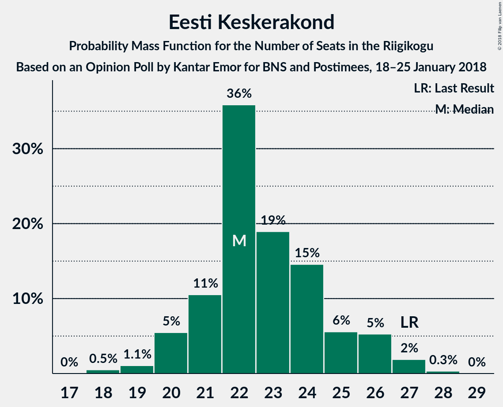

# Opinion Poll by Kantar Emor for BNS and Postimees, 18–25 January 2018

<a href="#voting-intentions">Voting Intentions</a> | <a href="#seats">Seats</a> | <a href="#coalitions">Coalitions</a> | <a href="#technical-information">Technical Information</a>

## Voting Intentions

### Confidence Intervals

| Party | Last Result | Poll Result | 80% Confidence Interval | 90% Confidence Interval | 95% Confidence Interval | 99% Confidence Interval |
|:-----:|:-----------:|:-----------:|:-----------------------:|:-----------------------:|:-----------------------:|:-----------------------:|
| Eesti Reformierakond | 27.7% | 34.2% | 32.4–36.1% |31.9–36.6% |31.5–37.1% |30.7–38.0% |
| Eesti Keskerakond | 24.8% | 20.5% | 19.0–22.1% |18.6–22.6% |18.2–23.0% |17.5–23.8% |
| Eesti Konservatiivne Rahvaerakond | 8.1% | 18.4% | 17.0–20.0% |16.6–20.4% |16.2–20.8% |15.6–21.6% |
| Sotsiaaldemokraatlik Erakond | 15.2% | 11.0% | 9.9–12.3% |9.6–12.7% |9.3–13.0% |8.8–13.7% |
| Eesti Vabaerakond | 8.7% | 5.4% | 4.6–6.4% |4.4–6.7% |4.2–6.9% |3.9–7.4% |
| Erakond Isamaa | 13.7% | 4.5% | 3.8–5.4% |3.6–5.7% |3.4–5.9% |3.1–6.4% |
| Erakond Eestimaa Rohelised | 0.9% | 4.5% | 3.8–5.4% |3.6–5.7% |3.4–5.9% |3.1–6.4% |

*Note:* The poll result column reflects the actual value used in the calculations. Published results may vary slightly, and in addition be rounded to fewer digits.

## Seats

### Confidence Intervals

| Party | Last Result | Median | 80% Confidence Interval | 90% Confidence Interval | 95% Confidence Interval | 99% Confidence Interval |
|:-----:|:-----------:|:------:|:-----------------------:|:-----------------------:|:-----------------------:|:-----------------------:|
| <a href="#eesti-reformierakond">Eesti Reformierakond</a> | 30 | 41 | 38–44 |37–44 |36–45 |35–47 |
| <a href="#eesti-keskerakond">Eesti Keskerakond</a> | 27 | 22 | 21–25 |20–26 |20–26 |18–27 |
| <a href="#eesti-konservatiivne-rahvaerakond">Eesti Konservatiivne Rahvaerakond</a> | 7 | 20 | 18–22 |18–23 |17–24 |16–25 |
| <a href="#sotsiaaldemokraatlik-erakond">Sotsiaaldemokraatlik Erakond</a> | 15 | 11 | 10–13 |9–13 |9–14 |8–15 |
| <a href="#eesti-vabaerakond">Eesti Vabaerakond</a> | 8 | 5 | 0–6 |0–6 |0–6 |0–7 |
| <a href="#erakond-isamaa">Erakond Isamaa</a> | 14 | 0 | 0–5 |0–5 |0–5 |0–6 |
| <a href="#erakond-eestimaa-rohelised">Erakond Eestimaa Rohelised</a> | 0 | 0 | 0–5 |0–5 |0–5 |0–6 |

### Eesti Reformierakond

*For a full overview of the results for this party, see the [Eesti Reformierakond](party-eestireformierakond.html) page.*

| Number of Seats | Probability | Accumulated | Special Marks |
|:---------------:|:-----------:|:-----------:|:-------------:|
| 30 | 0% | 100% | Last Result |
| 31 | 0% | 100% |  |
| 32 | 0% | 100% |  |
| 33 | 0% | 100% |  |
| 34 | 0.2% | 100% |  |
| 35 | 0.8% | 99.7% |  |
| 36 | 2% | 98.9% |  |
| 37 | 5% | 97% |  |
| 38 | 11% | 92% |  |
| 39 | 14% | 82% |  |
| 40 | 16% | 68% |  |
| 41 | 18% | 52% | Median |
| 42 | 13% | 34% |  |
| 43 | 10% | 22% |  |
| 44 | 7% | 11% |  |
| 45 | 3% | 5% |  |
| 46 | 1.0% | 2% |  |
| 47 | 0.5% | 0.6% |  |
| 48 | 0.1% | 0.1% |  |
| 49 | 0% | 0% |  |

### Eesti Keskerakond

*For a full overview of the results for this party, see the [Eesti Keskerakond](party-eestikeskerakond.html) page.*

| Number of Seats | Probability | Accumulated | Special Marks |
|:---------------:|:-----------:|:-----------:|:-------------:|
| 18 | 0.5% | 100% |  |
| 19 | 1.1% | 99.5% |  |
| 20 | 5% | 98% |  |
| 21 | 11% | 93% |  |
| 22 | 36% | 82% | Median |
| 23 | 19% | 47% |  |
| 24 | 15% | 28% |  |
| 25 | 6% | 13% |  |
| 26 | 5% | 8% |  |
| 27 | 2% | 2% | Last Result |
| 28 | 0.3% | 0.4% |  |
| 29 | 0% | 0% |  |

### Eesti Konservatiivne Rahvaerakond

*For a full overview of the results for this party, see the [Eesti Konservatiivne Rahvaerakond](party-eestikonservatiivnerahvaerakond.html) page.*

| Number of Seats | Probability | Accumulated | Special Marks |
|:---------------:|:-----------:|:-----------:|:-------------:|
| 7 | 0% | 100% | Last Result |
| 8 | 0% | 100% |  |
| 9 | 0% | 100% |  |
| 10 | 0% | 100% |  |
| 11 | 0% | 100% |  |
| 12 | 0% | 100% |  |
| 13 | 0% | 100% |  |
| 14 | 0% | 100% |  |
| 15 | 0.1% | 100% |  |
| 16 | 0.7% | 99.9% |  |
| 17 | 3% | 99.2% |  |
| 18 | 10% | 96% |  |
| 19 | 18% | 86% |  |
| 20 | 25% | 68% | Median |
| 21 | 21% | 43% |  |
| 22 | 13% | 22% |  |
| 23 | 6% | 9% |  |
| 24 | 2% | 3% |  |
| 25 | 0.5% | 0.6% |  |
| 26 | 0.1% | 0.1% |  |
| 27 | 0% | 0% |  |

### Sotsiaaldemokraatlik Erakond

*For a full overview of the results for this party, see the [Sotsiaaldemokraatlik Erakond](party-sotsiaaldemokraatlikerakond.html) page.*

| Number of Seats | Probability | Accumulated | Special Marks |
|:---------------:|:-----------:|:-----------:|:-------------:|
| 8 | 0.6% | 100% |  |
| 9 | 6% | 99.4% |  |
| 10 | 18% | 93% |  |
| 11 | 31% | 75% | Median |
| 12 | 30% | 44% |  |
| 13 | 11% | 14% |  |
| 14 | 3% | 3% |  |
| 15 | 0.5% | 0.5% | Last Result |
| 16 | 0% | 0% |  |

### Eesti Vabaerakond

*For a full overview of the results for this party, see the [Eesti Vabaerakond](party-eestivabaerakond.html) page.*

| Number of Seats | Probability | Accumulated | Special Marks |
|:---------------:|:-----------:|:-----------:|:-------------:|
| 0 | 26% | 100% |  |
| 1 | 0% | 74% |  |
| 2 | 0% | 74% |  |
| 3 | 0% | 74% |  |
| 4 | 9% | 74% |  |
| 5 | 48% | 65% | Median |
| 6 | 15% | 17% |  |
| 7 | 2% | 2% |  |
| 8 | 0.1% | 0.1% | Last Result |
| 9 | 0% | 0% |  |

### Erakond Isamaa

*For a full overview of the results for this party, see the [Erakond Isamaa](party-erakondisamaa.html) page.*

| Number of Seats | Probability | Accumulated | Special Marks |
|:---------------:|:-----------:|:-----------:|:-------------:|
| 0 | 75% | 100% | Median |
| 1 | 0% | 25% |  |
| 2 | 0% | 25% |  |
| 3 | 0% | 25% |  |
| 4 | 10% | 25% |  |
| 5 | 14% | 15% |  |
| 6 | 1.0% | 1.0% |  |
| 7 | 0% | 0% |  |
| 8 | 0% | 0% |  |
| 9 | 0% | 0% |  |
| 10 | 0% | 0% |  |
| 11 | 0% | 0% |  |
| 12 | 0% | 0% |  |
| 13 | 0% | 0% |  |
| 14 | 0% | 0% | Last Result |

### Erakond Eestimaa Rohelised

*For a full overview of the results for this party, see the [Erakond Eestimaa Rohelised](party-erakondeestimaarohelised.html) page.*

| Number of Seats | Probability | Accumulated | Special Marks |
|:---------------:|:-----------:|:-----------:|:-------------:|
| 0 | 75% | 100% | Last Result, Median |
| 1 | 0% | 25% |  |
| 2 | 0% | 25% |  |
| 3 | 0% | 25% |  |
| 4 | 11% | 25% |  |
| 5 | 13% | 14% |  |
| 6 | 1.1% | 1.1% |  |
| 7 | 0% | 0% |  |

## Coalitions

### Confidence Intervals

| Coalition | Last Result | Median | Majority? | 80% Confidence Interval | 90% Confidence Interval | 95% Confidence Interval | 99% Confidence Interval |
|:---------:|:-----------:|:------:|:---------:|:-----------------------:|:-----------------------:|:-----------------------:|:-----------------------:|
| Eesti Reformierakond – Eesti Keskerakond – Eesti Konservatiivne Rahvaerakond | 64 | 84 | 100% | 80–88 | 79–89 | 78–90 | 76–91 |
| Eesti Reformierakond – Eesti Keskerakond | 57 | 63 | 100% | 60–67 | 59–68 | 58–69 | 57–70 |
| Eesti Reformierakond – Eesti Konservatiivne Rahvaerakond – Erakond Isamaa | 51 | 62 | 100% | 58–66 | 58–66 | 57–67 | 55–69 |
| Eesti Reformierakond – Eesti Konservatiivne Rahvaerakond | 37 | 61 | 100% | 57–65 | 57–66 | 56–66 | 54–68 |
| Eesti Reformierakond – Sotsiaaldemokraatlik Erakond – Eesti Vabaerakond – Erakond Isamaa | 67 | 57 | 99.0% | 53–60 | 52–61 | 51–62 | 50–63 |
| Eesti Reformierakond – Sotsiaaldemokraatlik Erakond – Erakond Isamaa | 59 | 53 | 83% | 50–57 | 49–57 | 48–58 | 47–60 |
| Eesti Reformierakond – Sotsiaaldemokraatlik Erakond | 45 | 52 | 70% | 49–55 | 48–56 | 47–57 | 45–59 |
| Eesti Keskerakond – Eesti Konservatiivne Rahvaerakond | 34 | 43 | 0.1% | 40–46 | 39–47 | 39–48 | 37–49 |
| Eesti Reformierakond – Erakond Isamaa | 44 | 42 | 0% | 39–45 | 38–46 | 37–47 | 36–49 |
| Eesti Keskerakond – Sotsiaaldemokraatlik Erakond – Erakond Isamaa | 56 | 35 | 0% | 32–39 | 32–40 | 31–41 | 30–42 |
| Eesti Keskerakond – Sotsiaaldemokraatlik Erakond | 42 | 34 | 0% | 31–37 | 31–37 | 30–38 | 29–40 |
| Eesti Konservatiivne Rahvaerakond – Sotsiaaldemokraatlik Erakond | 22 | 32 | 0% | 29–34 | 28–35 | 28–36 | 27–37 |

### Eesti Reformierakond – Eesti Keskerakond – Eesti Konservatiivne Rahvaerakond

| Number of Seats | Probability | Accumulated | Special Marks |
|:---------------:|:-----------:|:-----------:|:-------------:|
| 64 | 0% | 100% | Last Result |
| 65 | 0% | 100% |  |
| 66 | 0% | 100% |  |
| 67 | 0% | 100% |  |
| 68 | 0% | 100% |  |
| 69 | 0% | 100% |  |
| 70 | 0% | 100% |  |
| 71 | 0% | 100% |  |
| 72 | 0% | 100% |  |
| 73 | 0% | 100% |  |
| 74 | 0.1% | 100% |  |
| 75 | 0.4% | 99.9% |  |
| 76 | 0.6% | 99.5% |  |
| 77 | 1.1% | 98.9% |  |
| 78 | 2% | 98% |  |
| 79 | 5% | 96% |  |
| 80 | 9% | 91% |  |
| 81 | 9% | 82% |  |
| 82 | 7% | 73% |  |
| 83 | 10% | 66% | Median |
| 84 | 18% | 56% |  |
| 85 | 16% | 38% |  |
| 86 | 7% | 22% |  |
| 87 | 4% | 16% |  |
| 88 | 3% | 12% |  |
| 89 | 5% | 9% |  |
| 90 | 3% | 4% |  |
| 91 | 0.8% | 0.9% |  |
| 92 | 0.1% | 0.1% |  |
| 93 | 0% | 0% |  |

### Eesti Reformierakond – Eesti Keskerakond

| Number of Seats | Probability | Accumulated | Special Marks |
|:---------------:|:-----------:|:-----------:|:-------------:|
| 55 | 0.1% | 100% |  |
| 56 | 0.3% | 99.8% |  |
| 57 | 0.8% | 99.5% | Last Result |
| 58 | 2% | 98.7% |  |
| 59 | 4% | 97% |  |
| 60 | 8% | 93% |  |
| 61 | 10% | 85% |  |
| 62 | 12% | 75% |  |
| 63 | 17% | 62% | Median |
| 64 | 11% | 45% |  |
| 65 | 12% | 34% |  |
| 66 | 9% | 22% |  |
| 67 | 6% | 12% |  |
| 68 | 4% | 7% |  |
| 69 | 1.4% | 3% |  |
| 70 | 1.0% | 1.3% |  |
| 71 | 0.3% | 0.3% |  |
| 72 | 0.1% | 0.1% |  |
| 73 | 0% | 0% |  |

### Eesti Reformierakond – Eesti Konservatiivne Rahvaerakond – Erakond Isamaa

| Number of Seats | Probability | Accumulated | Special Marks |
|:---------------:|:-----------:|:-----------:|:-------------:|
| 51 | 0% | 100% | Last Result, Majority |
| 52 | 0% | 100% |  |
| 53 | 0% | 100% |  |
| 54 | 0.1% | 100% |  |
| 55 | 0.4% | 99.9% |  |
| 56 | 1.0% | 99.4% |  |
| 57 | 3% | 98% |  |
| 58 | 6% | 96% |  |
| 59 | 8% | 90% |  |
| 60 | 8% | 82% |  |
| 61 | 15% | 74% | Median |
| 62 | 19% | 59% |  |
| 63 | 13% | 41% |  |
| 64 | 8% | 28% |  |
| 65 | 8% | 20% |  |
| 66 | 8% | 12% |  |
| 67 | 3% | 5% |  |
| 68 | 1.0% | 2% |  |
| 69 | 0.5% | 0.8% |  |
| 70 | 0.3% | 0.4% |  |
| 71 | 0% | 0% |  |

### Eesti Reformierakond – Eesti Konservatiivne Rahvaerakond

| Number of Seats | Probability | Accumulated | Special Marks |
|:---------------:|:-----------:|:-----------:|:-------------:|
| 37 | 0% | 100% | Last Result |
| 38 | 0% | 100% |  |
| 39 | 0% | 100% |  |
| 40 | 0% | 100% |  |
| 41 | 0% | 100% |  |
| 42 | 0% | 100% |  |
| 43 | 0% | 100% |  |
| 44 | 0% | 100% |  |
| 45 | 0% | 100% |  |
| 46 | 0% | 100% |  |
| 47 | 0% | 100% |  |
| 48 | 0% | 100% |  |
| 49 | 0% | 100% |  |
| 50 | 0% | 100% |  |
| 51 | 0% | 100% | Majority |
| 52 | 0.1% | 100% |  |
| 53 | 0.3% | 99.9% |  |
| 54 | 0.6% | 99.6% |  |
| 55 | 1.1% | 99.0% |  |
| 56 | 3% | 98% |  |
| 57 | 6% | 95% |  |
| 58 | 10% | 89% |  |
| 59 | 11% | 79% |  |
| 60 | 11% | 68% |  |
| 61 | 15% | 57% | Median |
| 62 | 17% | 43% |  |
| 63 | 10% | 26% |  |
| 64 | 4% | 15% |  |
| 65 | 4% | 11% |  |
| 66 | 4% | 7% |  |
| 67 | 2% | 2% |  |
| 68 | 0.5% | 0.7% |  |
| 69 | 0.2% | 0.2% |  |
| 70 | 0% | 0% |  |

### Eesti Reformierakond – Sotsiaaldemokraatlik Erakond – Eesti Vabaerakond – Erakond Isamaa

| Number of Seats | Probability | Accumulated | Special Marks |
|:---------------:|:-----------:|:-----------:|:-------------:|
| 48 | 0% | 100% |  |
| 49 | 0.2% | 99.9% |  |
| 50 | 0.7% | 99.7% |  |
| 51 | 2% | 99.0% | Majority |
| 52 | 3% | 97% |  |
| 53 | 5% | 95% |  |
| 54 | 6% | 90% |  |
| 55 | 11% | 83% |  |
| 56 | 14% | 72% |  |
| 57 | 16% | 58% | Median |
| 58 | 15% | 42% |  |
| 59 | 14% | 28% |  |
| 60 | 7% | 14% |  |
| 61 | 4% | 7% |  |
| 62 | 2% | 3% |  |
| 63 | 0.5% | 0.6% |  |
| 64 | 0.1% | 0.2% |  |
| 65 | 0% | 0% |  |
| 66 | 0% | 0% |  |
| 67 | 0% | 0% | Last Result |

### Eesti Reformierakond – Sotsiaaldemokraatlik Erakond – Erakond Isamaa

| Number of Seats | Probability | Accumulated | Special Marks |
|:---------------:|:-----------:|:-----------:|:-------------:|
| 45 | 0.1% | 100% |  |
| 46 | 0.3% | 99.9% |  |
| 47 | 0.8% | 99.6% |  |
| 48 | 3% | 98.8% |  |
| 49 | 4% | 96% |  |
| 50 | 9% | 92% |  |
| 51 | 12% | 83% | Majority |
| 52 | 13% | 71% | Median |
| 53 | 15% | 58% |  |
| 54 | 15% | 43% |  |
| 55 | 10% | 28% |  |
| 56 | 8% | 19% |  |
| 57 | 6% | 11% |  |
| 58 | 3% | 5% |  |
| 59 | 1.4% | 2% | Last Result |
| 60 | 0.5% | 0.7% |  |
| 61 | 0.2% | 0.2% |  |
| 62 | 0% | 0.1% |  |
| 63 | 0% | 0% |  |

### Eesti Reformierakond – Sotsiaaldemokraatlik Erakond

| Number of Seats | Probability | Accumulated | Special Marks |
|:---------------:|:-----------:|:-----------:|:-------------:|
| 44 | 0.1% | 100% |  |
| 45 | 0.4% | 99.9% | Last Result |
| 46 | 1.0% | 99.5% |  |
| 47 | 2% | 98.5% |  |
| 48 | 5% | 96% |  |
| 49 | 9% | 91% |  |
| 50 | 13% | 82% |  |
| 51 | 15% | 70% | Majority |
| 52 | 15% | 55% | Median |
| 53 | 13% | 40% |  |
| 54 | 12% | 27% |  |
| 55 | 7% | 16% |  |
| 56 | 4% | 9% |  |
| 57 | 3% | 5% |  |
| 58 | 1.4% | 2% |  |
| 59 | 0.4% | 0.6% |  |
| 60 | 0.1% | 0.1% |  |
| 61 | 0% | 0% |  |

### Eesti Keskerakond – Eesti Konservatiivne Rahvaerakond

| Number of Seats | Probability | Accumulated | Special Marks |
|:---------------:|:-----------:|:-----------:|:-------------:|
| 34 | 0% | 100% | Last Result |
| 35 | 0% | 100% |  |
| 36 | 0.1% | 100% |  |
| 37 | 0.5% | 99.9% |  |
| 38 | 2% | 99.4% |  |
| 39 | 4% | 98% |  |
| 40 | 7% | 93% |  |
| 41 | 11% | 86% |  |
| 42 | 18% | 75% | Median |
| 43 | 16% | 57% |  |
| 44 | 16% | 41% |  |
| 45 | 12% | 25% |  |
| 46 | 7% | 13% |  |
| 47 | 4% | 6% |  |
| 48 | 2% | 3% |  |
| 49 | 0.6% | 1.0% |  |
| 50 | 0.3% | 0.4% |  |
| 51 | 0.1% | 0.1% | Majority |
| 52 | 0% | 0% |  |

### Eesti Reformierakond – Erakond Isamaa

| Number of Seats | Probability | Accumulated | Special Marks |
|:---------------:|:-----------:|:-----------:|:-------------:|
| 34 | 0.1% | 100% |  |
| 35 | 0.3% | 99.9% |  |
| 36 | 0.9% | 99.7% |  |
| 37 | 2% | 98.8% |  |
| 38 | 6% | 97% |  |
| 39 | 9% | 90% |  |
| 40 | 12% | 81% |  |
| 41 | 18% | 69% | Median |
| 42 | 13% | 52% |  |
| 43 | 14% | 39% |  |
| 44 | 9% | 24% | Last Result |
| 45 | 7% | 15% |  |
| 46 | 5% | 8% |  |
| 47 | 2% | 3% |  |
| 48 | 0.6% | 1.3% |  |
| 49 | 0.6% | 0.7% |  |
| 50 | 0.1% | 0.1% |  |
| 51 | 0% | 0% | Majority |

### Eesti Keskerakond – Sotsiaaldemokraatlik Erakond – Erakond Isamaa

| Number of Seats | Probability | Accumulated | Special Marks |
|:---------------:|:-----------:|:-----------:|:-------------:|
| 28 | 0.1% | 100% |  |
| 29 | 0.4% | 99.9% |  |
| 30 | 2% | 99.5% |  |
| 31 | 3% | 98% |  |
| 32 | 5% | 95% |  |
| 33 | 15% | 90% | Median |
| 34 | 21% | 75% |  |
| 35 | 16% | 54% |  |
| 36 | 12% | 38% |  |
| 37 | 9% | 27% |  |
| 38 | 6% | 18% |  |
| 39 | 6% | 12% |  |
| 40 | 3% | 6% |  |
| 41 | 2% | 3% |  |
| 42 | 0.6% | 0.8% |  |
| 43 | 0.1% | 0.2% |  |
| 44 | 0% | 0.1% |  |
| 45 | 0% | 0% |  |
| 46 | 0% | 0% |  |
| 47 | 0% | 0% |  |
| 48 | 0% | 0% |  |
| 49 | 0% | 0% |  |
| 50 | 0% | 0% |  |
| 51 | 0% | 0% | Majority |
| 52 | 0% | 0% |  |
| 53 | 0% | 0% |  |
| 54 | 0% | 0% |  |
| 55 | 0% | 0% |  |
| 56 | 0% | 0% | Last Result |

### Eesti Keskerakond – Sotsiaaldemokraatlik Erakond

| Number of Seats | Probability | Accumulated | Special Marks |
|:---------------:|:-----------:|:-----------:|:-------------:|
| 28 | 0.1% | 100% |  |
| 29 | 1.0% | 99.8% |  |
| 30 | 4% | 98.8% |  |
| 31 | 7% | 95% |  |
| 32 | 9% | 88% |  |
| 33 | 19% | 80% | Median |
| 34 | 23% | 61% |  |
| 35 | 17% | 38% |  |
| 36 | 11% | 21% |  |
| 37 | 5% | 10% |  |
| 38 | 3% | 5% |  |
| 39 | 2% | 2% |  |
| 40 | 0.4% | 0.6% |  |
| 41 | 0.1% | 0.1% |  |
| 42 | 0% | 0% | Last Result |

### Eesti Konservatiivne Rahvaerakond – Sotsiaaldemokraatlik Erakond

| Number of Seats | Probability | Accumulated | Special Marks |
|:---------------:|:-----------:|:-----------:|:-------------:|
| 22 | 0% | 100% | Last Result |
| 23 | 0% | 100% |  |
| 24 | 0% | 100% |  |
| 25 | 0.1% | 100% |  |
| 26 | 0.4% | 99.9% |  |
| 27 | 2% | 99.5% |  |
| 28 | 4% | 98% |  |
| 29 | 9% | 93% |  |
| 30 | 16% | 84% |  |
| 31 | 19% | 69% | Median |
| 32 | 16% | 50% |  |
| 33 | 17% | 34% |  |
| 34 | 10% | 17% |  |
| 35 | 5% | 7% |  |
| 36 | 2% | 3% |  |
| 37 | 0.4% | 0.6% |  |
| 38 | 0.2% | 0.2% |  |
| 39 | 0% | 0% |  |

## Technical Information

### Opinion Poll

+ **Polling firm:** Kantar Emor
+ **Commissioner(s):** BNS and Postimees
+ **Fieldwork period:** 18–25 January 2018

### Calculations

+ **Sample size:** 1107
+ **Simulations done:** 1,048,576
+ **Error estimate:** 0.64%

