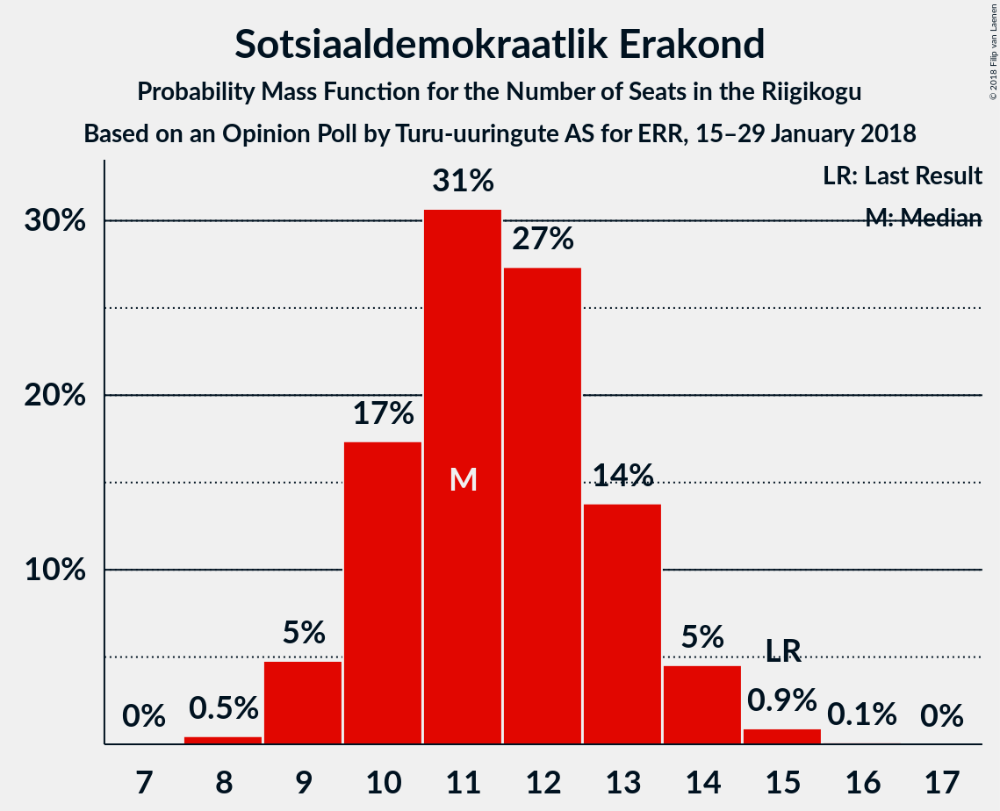

# Opinion Poll by Turu-uuringute AS for ERR, 15–29 January 2018

<a href="#voting-intentions">Voting Intentions</a> | <a href="#seats">Seats</a> | <a href="#coalitions">Coalitions</a> | <a href="#technical-information">Technical Information</a>

## Voting Intentions

### Confidence Intervals

| Party | Last Result | Poll Result | 80% Confidence Interval | 90% Confidence Interval | 95% Confidence Interval | 99% Confidence Interval |
|:-----:|:-----------:|:-----------:|:-----------------------:|:-----------------------:|:-----------------------:|:-----------------------:|
| Eesti Keskerakond | 24.8% | 27.0% | 25.3–28.9% |24.8–29.4% |24.4–29.9% |23.5–30.8% |
| Eesti Reformierakond | 27.7% | 26.0% | 24.3–27.9% |23.8–28.4% |23.4–28.8% |22.6–29.7% |
| Eesti Konservatiivne Rahvaerakond | 8.1% | 12.0% | 10.7–13.4% |10.4–13.8% |10.1–14.1% |9.5–14.8% |
| Sotsiaaldemokraatlik Erakond | 15.2% | 11.0% | 9.8–12.3% |9.5–12.7% |9.2–13.1% |8.6–13.7% |
| Erakond Isamaa | 13.7% | 5.0% | 4.2–6.0% |4.0–6.3% |3.8–6.5% |3.5–7.0% |
| Eesti Vabaerakond | 8.7% | 4.0% | 3.3–4.9% |3.1–5.2% |2.9–5.4% |2.6–5.9% |
| Erakond Eestimaa Rohelised | 0.9% | 4.0% | 3.3–4.9% |3.1–5.2% |2.9–5.4% |2.6–5.9% |

*Note:* The poll result column reflects the actual value used in the calculations. Published results may vary slightly, and in addition be rounded to fewer digits.

## Seats

### Confidence Intervals

| Party | Last Result | Median | 80% Confidence Interval | 90% Confidence Interval | 95% Confidence Interval | 99% Confidence Interval |
|:-----:|:-----------:|:------:|:-----------------------:|:-----------------------:|:-----------------------:|:-----------------------:|
| <a href="#eesti-keskerakond">Eesti Keskerakond</a> | 27 | 30 | 30 |29–30 |29–31 |29–37 |
| <a href="#eesti-reformierakond">Eesti Reformierakond</a> | 30 | 26 | 26–27 |26–28 |26–28 |26–30 |
| <a href="#eesti-konservatiivne-rahvaerakond">Eesti Konservatiivne Rahvaerakond</a> | 7 | 12 | 11–14 |11–14 |11–15 |11–15 |
| <a href="#sotsiaaldemokraatlik-erakond">Sotsiaaldemokraatlik Erakond</a> | 15 | 13 | 12–13 |12–13 |12–14 |11–14 |
| <a href="#erakond-isamaa">Erakond Isamaa</a> | 14 | 5 | 5 |5 |5 |0–5 |
| <a href="#eesti-vabaerakond">Eesti Vabaerakond</a> | 8 | 0 | 0 |0 |0 |0 |
| <a href="#erakond-eestimaa-rohelised">Erakond Eestimaa Rohelised</a> | 0 | 5 | 0–5 |0–5 |0–5 |0–5 |

### Eesti Keskerakond

*For a full overview of the results for this party, see the [Eesti Keskerakond](party-eestikeskerakond.html) page.*

| Number of Seats | Probability | Accumulated | Special Marks |
|:---------------:|:-----------:|:-----------:|:-------------:|
| 27 | 0% | 100% | Last Result |
| 28 | 0.2% | 100% |  |
| 29 | 10% | 99.8% |  |
| 30 | 86% | 90% | Median |
| 31 | 2% | 4% |  |
| 32 | 0.2% | 2% |  |
| 33 | 0% | 2% |  |
| 34 | 0.3% | 2% |  |
| 35 | 0.2% | 1.5% |  |
| 36 | 0.4% | 1.3% |  |
| 37 | 0.9% | 0.9% |  |
| 38 | 0% | 0% |  |

### Eesti Reformierakond

*For a full overview of the results for this party, see the [Eesti Reformierakond](party-eestireformierakond.html) page.*

| Number of Seats | Probability | Accumulated | Special Marks |
|:---------------:|:-----------:|:-----------:|:-------------:|
| 23 | 0.1% | 100% |  |
| 24 | 0% | 99.9% |  |
| 25 | 0% | 99.9% |  |
| 26 | 87% | 99.8% | Median |
| 27 | 7% | 13% |  |
| 28 | 6% | 6% |  |
| 29 | 0% | 0.6% |  |
| 30 | 0.3% | 0.6% | Last Result |
| 31 | 0.2% | 0.3% |  |
| 32 | 0% | 0.1% |  |
| 33 | 0% | 0.1% |  |
| 34 | 0% | 0.1% |  |
| 35 | 0% | 0.1% |  |
| 36 | 0% | 0.1% |  |
| 37 | 0% | 0% |  |

### Eesti Konservatiivne Rahvaerakond

*For a full overview of the results for this party, see the [Eesti Konservatiivne Rahvaerakond](party-eestikonservatiivnerahvaerakond.html) page.*

| Number of Seats | Probability | Accumulated | Special Marks |
|:---------------:|:-----------:|:-----------:|:-------------:|
| 7 | 0% | 100% | Last Result |
| 8 | 0% | 100% |  |
| 9 | 0% | 100% |  |
| 10 | 0.1% | 100% |  |
| 11 | 30% | 99.9% |  |
| 12 | 57% | 70% | Median |
| 13 | 2% | 12% |  |
| 14 | 6% | 11% |  |
| 15 | 5% | 5% |  |
| 16 | 0% | 0.1% |  |
| 17 | 0.1% | 0.1% |  |
| 18 | 0% | 0% |  |

### Sotsiaaldemokraatlik Erakond

*For a full overview of the results for this party, see the [Sotsiaaldemokraatlik Erakond](party-sotsiaaldemokraatlikerakond.html) page.*

| Number of Seats | Probability | Accumulated | Special Marks |
|:---------------:|:-----------:|:-----------:|:-------------:|
| 8 | 0.2% | 100% |  |
| 9 | 0% | 99.8% |  |
| 10 | 0.1% | 99.7% |  |
| 11 | 0.3% | 99.7% |  |
| 12 | 31% | 99.3% |  |
| 13 | 63% | 68% | Median |
| 14 | 5% | 5% |  |
| 15 | 0% | 0.1% | Last Result |
| 16 | 0% | 0.1% |  |
| 17 | 0% | 0% |  |

### Erakond Isamaa

*For a full overview of the results for this party, see the [Erakond Isamaa](party-erakondisamaa.html) page.*

| Number of Seats | Probability | Accumulated | Special Marks |
|:---------------:|:-----------:|:-----------:|:-------------:|
| 0 | 2% | 100% |  |
| 1 | 0% | 98% |  |
| 2 | 0% | 98% |  |
| 3 | 0% | 98% |  |
| 4 | 0.1% | 98% |  |
| 5 | 98% | 98% | Median |
| 6 | 0.3% | 0.3% |  |
| 7 | 0% | 0% |  |
| 8 | 0% | 0% |  |
| 9 | 0% | 0% |  |
| 10 | 0% | 0% |  |
| 11 | 0% | 0% |  |
| 12 | 0% | 0% |  |
| 13 | 0% | 0% |  |
| 14 | 0% | 0% | Last Result |

### Eesti Vabaerakond

*For a full overview of the results for this party, see the [Eesti Vabaerakond](party-eestivabaerakond.html) page.*

| Number of Seats | Probability | Accumulated | Special Marks |
|:---------------:|:-----------:|:-----------:|:-------------:|
| 0 | 99.9% | 100% | Median |
| 1 | 0% | 0.1% |  |
| 2 | 0% | 0.1% |  |
| 3 | 0% | 0.1% |  |
| 4 | 0% | 0.1% |  |
| 5 | 0.1% | 0.1% |  |
| 6 | 0% | 0% |  |
| 7 | 0% | 0% |  |
| 8 | 0% | 0% | Last Result |

### Erakond Eestimaa Rohelised

*For a full overview of the results for this party, see the [Erakond Eestimaa Rohelised](party-erakondeestimaarohelised.html) page.*

| Number of Seats | Probability | Accumulated | Special Marks |
|:---------------:|:-----------:|:-----------:|:-------------:|
| 0 | 13% | 100% | Last Result |
| 1 | 0% | 87% |  |
| 2 | 0% | 87% |  |
| 3 | 0% | 87% |  |
| 4 | 30% | 87% |  |
| 5 | 57% | 58% | Median |
| 6 | 0.3% | 0.3% |  |
| 7 | 0% | 0% |  |

## Coalitions

### Confidence Intervals

| Coalition | Last Result | Median | Majority? | 80% Confidence Interval | 90% Confidence Interval | 95% Confidence Interval | 99% Confidence Interval |
|:---------:|:-----------:|:------:|:---------:|:-----------------------:|:-----------------------:|:-----------------------:|:-----------------------:|
| Eesti Keskerakond – Eesti Reformierakond – Eesti Konservatiivne Rahvaerakond | 64 | 68 | 100% | 67–70 | 67–72 | 67–72 | 67–78 |
| Eesti Keskerakond – Eesti Reformierakond | 57 | 56 | 100% | 56 | 56–57 | 56–58 | 56–65 |
| Eesti Keskerakond – Sotsiaaldemokraatlik Erakond – Erakond Isamaa | 56 | 48 | 0.1% | 47–48 | 47–48 | 47–49 | 44–49 |
| Eesti Reformierakond – Eesti Konservatiivne Rahvaerakond – Erakond Isamaa | 51 | 43 | 0.1% | 42–45 | 42–46 | 42–48 | 40–48 |
| Eesti Reformierakond – Sotsiaaldemokraatlik Erakond – Erakond Isamaa – Eesti Vabaerakond | 67 | 44 | 0% | 43–45 | 43–45 | 43–47 | 39–47 |
| Eesti Reformierakond – Sotsiaaldemokraatlik Erakond – Erakond Isamaa | 59 | 44 | 0% | 43–45 | 43–45 | 43–47 | 39–47 |
| Eesti Reformierakond – Sotsiaaldemokraatlik Erakond | 45 | 39 | 0% | 38–40 | 38–42 | 38–42 | 38–42 |
| Eesti Reformierakond – Erakond Isamaa | 44 | 31 | 0% | 31–32 | 31–32 | 31–33 | 27–33 |

### Eesti Keskerakond – Eesti Reformierakond – Eesti Konservatiivne Rahvaerakond

| Number of Seats | Probability | Accumulated | Special Marks |
|:---------------:|:-----------:|:-----------:|:-------------:|
| 64 | 0% | 100% | Last Result |
| 65 | 0% | 100% |  |
| 66 | 0% | 100% |  |
| 67 | 30% | 100% |  |
| 68 | 56% | 70% | Median |
| 69 | 0% | 14% |  |
| 70 | 6% | 14% |  |
| 71 | 0.3% | 7% |  |
| 72 | 5% | 7% |  |
| 73 | 0.2% | 2% |  |
| 74 | 0.1% | 2% |  |
| 75 | 0% | 2% |  |
| 76 | 0.5% | 2% |  |
| 77 | 0.2% | 1.3% |  |
| 78 | 0.9% | 1.2% |  |
| 79 | 0.2% | 0.3% |  |
| 80 | 0% | 0.1% |  |
| 81 | 0% | 0.1% |  |
| 82 | 0% | 0% |  |

### Eesti Keskerakond – Eesti Reformierakond

| Number of Seats | Probability | Accumulated | Special Marks |
|:---------------:|:-----------:|:-----------:|:-------------:|
| 54 | 0.2% | 100% |  |
| 55 | 0% | 99.8% |  |
| 56 | 91% | 99.8% | Median |
| 57 | 5% | 9% | Last Result |
| 58 | 2% | 4% |  |
| 59 | 0.1% | 2% |  |
| 60 | 0% | 2% |  |
| 61 | 0% | 2% |  |
| 62 | 0.1% | 2% |  |
| 63 | 0.4% | 2% |  |
| 64 | 0.1% | 1.3% |  |
| 65 | 1.1% | 1.2% |  |
| 66 | 0% | 0.1% |  |
| 67 | 0% | 0% |  |

### Eesti Keskerakond – Sotsiaaldemokraatlik Erakond – Erakond Isamaa

| Number of Seats | Probability | Accumulated | Special Marks |
|:---------------:|:-----------:|:-----------:|:-------------:|
| 42 | 0.1% | 100% |  |
| 43 | 0.3% | 99.9% |  |
| 44 | 0.1% | 99.6% |  |
| 45 | 0.3% | 99.5% |  |
| 46 | 0.3% | 99.1% |  |
| 47 | 35% | 98.8% |  |
| 48 | 62% | 64% | Median |
| 49 | 2% | 3% |  |
| 50 | 0.1% | 0.2% |  |
| 51 | 0% | 0.1% | Majority |
| 52 | 0% | 0.1% |  |
| 53 | 0.1% | 0.1% |  |
| 54 | 0.1% | 0.1% |  |
| 55 | 0% | 0% |  |
| 56 | 0% | 0% | Last Result |

### Eesti Reformierakond – Eesti Konservatiivne Rahvaerakond – Erakond Isamaa

| Number of Seats | Probability | Accumulated | Special Marks |
|:---------------:|:-----------:|:-----------:|:-------------:|
| 40 | 0.6% | 100% |  |
| 41 | 1.0% | 99.4% |  |
| 42 | 30% | 98% |  |
| 43 | 56% | 68% | Median |
| 44 | 1.5% | 12% |  |
| 45 | 0.4% | 10% |  |
| 46 | 5% | 10% |  |
| 47 | 0% | 5% |  |
| 48 | 5% | 5% |  |
| 49 | 0.1% | 0.3% |  |
| 50 | 0.1% | 0.2% |  |
| 51 | 0% | 0.1% | Last Result, Majority |
| 52 | 0% | 0% |  |

### Eesti Reformierakond – Sotsiaaldemokraatlik Erakond – Erakond Isamaa – Eesti Vabaerakond

| Number of Seats | Probability | Accumulated | Special Marks |
|:---------------:|:-----------:|:-----------:|:-------------:|
| 38 | 0.3% | 100% |  |
| 39 | 0.4% | 99.7% |  |
| 40 | 0.9% | 99.3% |  |
| 41 | 0.2% | 98% |  |
| 42 | 0.2% | 98% |  |
| 43 | 30% | 98% |  |
| 44 | 57% | 68% | Median |
| 45 | 6% | 11% |  |
| 46 | 0% | 5% |  |
| 47 | 5% | 5% |  |
| 48 | 0% | 0.1% |  |
| 49 | 0% | 0.1% |  |
| 50 | 0% | 0.1% |  |
| 51 | 0% | 0% | Majority |
| 52 | 0% | 0% |  |
| 53 | 0% | 0% |  |
| 54 | 0% | 0% |  |
| 55 | 0% | 0% |  |
| 56 | 0% | 0% |  |
| 57 | 0% | 0% |  |
| 58 | 0% | 0% |  |
| 59 | 0% | 0% |  |
| 60 | 0% | 0% |  |
| 61 | 0% | 0% |  |
| 62 | 0% | 0% |  |
| 63 | 0% | 0% |  |
| 64 | 0% | 0% |  |
| 65 | 0% | 0% |  |
| 66 | 0% | 0% |  |
| 67 | 0% | 0% | Last Result |

### Eesti Reformierakond – Sotsiaaldemokraatlik Erakond – Erakond Isamaa

| Number of Seats | Probability | Accumulated | Special Marks |
|:---------------:|:-----------:|:-----------:|:-------------:|
| 37 | 0.1% | 100% |  |
| 38 | 0.4% | 99.9% |  |
| 39 | 0.4% | 99.6% |  |
| 40 | 0.9% | 99.2% |  |
| 41 | 0.2% | 98% |  |
| 42 | 0.2% | 98% |  |
| 43 | 30% | 98% |  |
| 44 | 57% | 68% | Median |
| 45 | 6% | 11% |  |
| 46 | 0% | 5% |  |
| 47 | 5% | 5% |  |
| 48 | 0% | 0.1% |  |
| 49 | 0% | 0.1% |  |
| 50 | 0% | 0.1% |  |
| 51 | 0% | 0% | Majority |
| 52 | 0% | 0% |  |
| 53 | 0% | 0% |  |
| 54 | 0% | 0% |  |
| 55 | 0% | 0% |  |
| 56 | 0% | 0% |  |
| 57 | 0% | 0% |  |
| 58 | 0% | 0% |  |
| 59 | 0% | 0% | Last Result |

### Eesti Reformierakond – Sotsiaaldemokraatlik Erakond

| Number of Seats | Probability | Accumulated | Special Marks |
|:---------------:|:-----------:|:-----------:|:-------------:|
| 35 | 0.1% | 100% |  |
| 36 | 0% | 99.9% |  |
| 37 | 0.1% | 99.9% |  |
| 38 | 30% | 99.8% |  |
| 39 | 57% | 70% | Median |
| 40 | 7% | 12% |  |
| 41 | 0.1% | 5% |  |
| 42 | 5% | 5% |  |
| 43 | 0% | 0.1% |  |
| 44 | 0% | 0.1% |  |
| 45 | 0% | 0.1% | Last Result |
| 46 | 0% | 0.1% |  |
| 47 | 0% | 0% |  |

### Eesti Reformierakond – Erakond Isamaa

| Number of Seats | Probability | Accumulated | Special Marks |
|:---------------:|:-----------:|:-----------:|:-------------:|
| 26 | 0.4% | 100% |  |
| 27 | 0.4% | 99.6% |  |
| 28 | 0.9% | 99.2% |  |
| 29 | 0.1% | 98% |  |
| 30 | 0.2% | 98% |  |
| 31 | 87% | 98% | Median |
| 32 | 6% | 11% |  |
| 33 | 5% | 5% |  |
| 34 | 0.1% | 0.3% |  |
| 35 | 0% | 0.2% |  |
| 36 | 0.1% | 0.2% |  |
| 37 | 0% | 0.1% |  |
| 38 | 0% | 0.1% |  |
| 39 | 0% | 0.1% |  |
| 40 | 0% | 0.1% |  |
| 41 | 0% | 0% |  |
| 42 | 0% | 0% |  |
| 43 | 0% | 0% |  |
| 44 | 0% | 0% | Last Result |

## Technical Information

### Opinion Poll

+ **Polling firm:** Turu-uuringute AS
+ **Commissioner(s):** ERR
+ **Fieldwork period:** 15–29 January 2018

### Calculations

+ **Sample size:** 1003
+ **Simulations done:** 1,024
+ **Error estimate:** 2.19%

