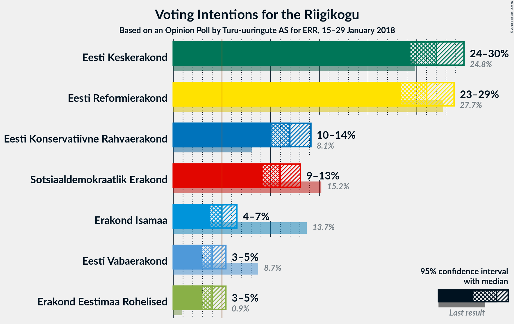
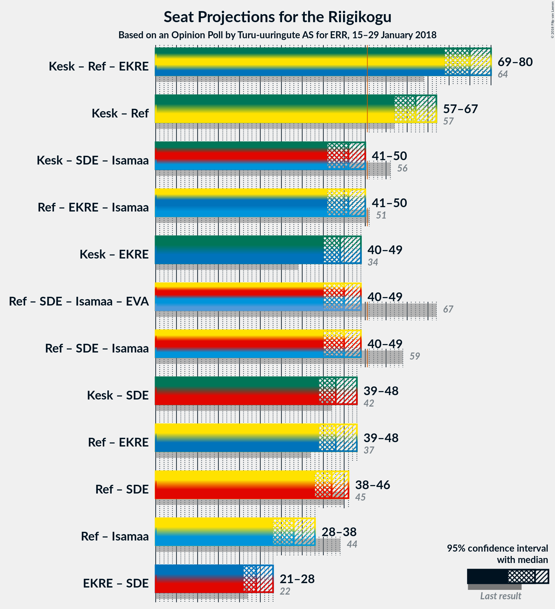

# Opinion Poll by Turu-uuringute AS for ERR, 15–29 January 2018

<a href="#voting-intentions">Voting Intentions</a> | <a href="#seats">Seats</a> | <a href="#coalitions">Coalitions</a> | <a href="#technical-information">Technical Information</a>

## Voting Intentions

### Confidence Intervals

| Party | Last Result | Poll Result | 80% Confidence Interval | 90% Confidence Interval | 95% Confidence Interval | 99% Confidence Interval |
|:-----:|:-----------:|:-----------:|:-----------------------:|:-----------------------:|:-----------------------:|:-----------------------:|
| Eesti Keskerakond | 24.8% | 27.0% | 25.3–28.9% |24.8–29.4% |24.4–29.9% |23.5–30.8% |
| Eesti Reformierakond | 27.7% | 26.0% | 24.3–27.9% |23.8–28.4% |23.4–28.8% |22.6–29.7% |
| Eesti Konservatiivne Rahvaerakond | 8.1% | 12.0% | 10.7–13.4% |10.4–13.8% |10.1–14.1% |9.5–14.8% |
| Sotsiaaldemokraatlik Erakond | 15.2% | 11.0% | 9.8–12.3% |9.5–12.7% |9.2–13.1% |8.6–13.7% |
| Erakond Isamaa | 13.7% | 5.0% | 4.2–6.0% |4.0–6.3% |3.8–6.5% |3.5–7.0% |
| Eesti Vabaerakond | 8.7% | 4.0% | 3.3–4.9% |3.1–5.2% |2.9–5.4% |2.6–5.9% |
| Erakond Eestimaa Rohelised | 0.9% | 4.0% | 3.3–4.9% |3.1–5.2% |2.9–5.4% |2.6–5.9% |

*Note:* The poll result column reflects the actual value used in the calculations. Published results may vary slightly, and in addition be rounded to fewer digits.

## Seats

### Confidence Intervals

| Party | Last Result | Median | 80% Confidence Interval | 90% Confidence Interval | 95% Confidence Interval | 99% Confidence Interval |
|:-----:|:-----------:|:------:|:-----------------------:|:-----------------------:|:-----------------------:|:-----------------------:|
| <a href="#eesti-keskerakond">Eesti Keskerakond</a> | 27 | 32 | 29–34 |28–35 |28–36 |27–37 |
| <a href="#eesti-reformierakond">Eesti Reformierakond</a> | 30 | 30 | 28–33 |27–34 |27–34 |26–36 |
| <a href="#eesti-konservatiivne-rahvaerakond">Eesti Konservatiivne Rahvaerakond</a> | 7 | 13 | 11–14 |11–15 |10–15 |10–16 |
| <a href="#sotsiaaldemokraatlik-erakond">Sotsiaaldemokraatlik Erakond</a> | 15 | 11 | 10–13 |9–14 |9–14 |9–15 |
| <a href="#erakond-isamaa">Erakond Isamaa</a> | 14 | 4 | 0–5 |0–6 |0–6 |0–7 |
| <a href="#eesti-vabaerakond">Eesti Vabaerakond</a> | 8 | 0 | 0 |0 |0–5 |0–5 |
| <a href="#erakond-eestimaa-rohelised">Erakond Eestimaa Rohelised</a> | 0 | 0 | 0 |0–5 |0–5 |0–5 |

### Eesti Keskerakond

*For a full overview of the results for this party, see the [Eesti Keskerakond](party-eestikeskerakond.html) page.*

| Number of Seats | Probability | Accumulated | Special Marks |
|:---------------:|:-----------:|:-----------:|:-------------:|
| 25 | 0.1% | 100% |  |
| 26 | 0.2% | 99.9% |  |
| 27 | 1.3% | 99.7% | Last Result |
| 28 | 4% | 98% |  |
| 29 | 6% | 95% |  |
| 30 | 18% | 88% |  |
| 31 | 18% | 71% |  |
| 32 | 17% | 53% | Median |
| 33 | 16% | 36% |  |
| 34 | 11% | 20% |  |
| 35 | 5% | 9% |  |
| 36 | 3% | 4% |  |
| 37 | 1.1% | 1.3% |  |
| 38 | 0.2% | 0.2% |  |
| 39 | 0.1% | 0.1% |  |
| 40 | 0% | 0% |  |

### Eesti Reformierakond

*For a full overview of the results for this party, see the [Eesti Reformierakond](party-eestireformierakond.html) page.*

| Number of Seats | Probability | Accumulated | Special Marks |
|:---------------:|:-----------:|:-----------:|:-------------:|
| 24 | 0.1% | 100% |  |
| 25 | 0.4% | 99.9% |  |
| 26 | 2% | 99.6% |  |
| 27 | 4% | 98% |  |
| 28 | 9% | 94% |  |
| 29 | 17% | 85% |  |
| 30 | 18% | 67% | Last Result, Median |
| 31 | 20% | 49% |  |
| 32 | 13% | 29% |  |
| 33 | 9% | 16% |  |
| 34 | 5% | 7% |  |
| 35 | 2% | 2% |  |
| 36 | 0.5% | 0.6% |  |
| 37 | 0.1% | 0.1% |  |
| 38 | 0% | 0% |  |

### Eesti Konservatiivne Rahvaerakond

*For a full overview of the results for this party, see the [Eesti Konservatiivne Rahvaerakond](party-eestikonservatiivnerahvaerakond.html) page.*

| Number of Seats | Probability | Accumulated | Special Marks |
|:---------------:|:-----------:|:-----------:|:-------------:|
| 7 | 0% | 100% | Last Result |
| 8 | 0% | 100% |  |
| 9 | 0.4% | 100% |  |
| 10 | 4% | 99.5% |  |
| 11 | 14% | 95% |  |
| 12 | 28% | 81% |  |
| 13 | 27% | 53% | Median |
| 14 | 17% | 26% |  |
| 15 | 7% | 9% |  |
| 16 | 2% | 2% |  |
| 17 | 0.3% | 0.3% |  |
| 18 | 0% | 0% |  |

### Sotsiaaldemokraatlik Erakond

*For a full overview of the results for this party, see the [Sotsiaaldemokraatlik Erakond](party-sotsiaaldemokraatlikerakond.html) page.*

| Number of Seats | Probability | Accumulated | Special Marks |
|:---------------:|:-----------:|:-----------:|:-------------:|
| 8 | 0.5% | 100% |  |
| 9 | 5% | 99.5% |  |
| 10 | 17% | 95% |  |
| 11 | 31% | 77% | Median |
| 12 | 27% | 47% |  |
| 13 | 14% | 19% |  |
| 14 | 5% | 6% |  |
| 15 | 0.9% | 1.0% | Last Result |
| 16 | 0.1% | 0.1% |  |
| 17 | 0% | 0% |  |

### Erakond Isamaa

*For a full overview of the results for this party, see the [Erakond Isamaa](party-erakondisamaa.html) page.*

| Number of Seats | Probability | Accumulated | Special Marks |
|:---------------:|:-----------:|:-----------:|:-------------:|
| 0 | 50% | 100% |  |
| 1 | 0% | 50% |  |
| 2 | 0% | 50% |  |
| 3 | 0% | 50% |  |
| 4 | 6% | 50% | Median |
| 5 | 35% | 44% |  |
| 6 | 8% | 9% |  |
| 7 | 0.7% | 0.7% |  |
| 8 | 0% | 0% |  |
| 9 | 0% | 0% |  |
| 10 | 0% | 0% |  |
| 11 | 0% | 0% |  |
| 12 | 0% | 0% |  |
| 13 | 0% | 0% |  |
| 14 | 0% | 0% | Last Result |

### Eesti Vabaerakond

*For a full overview of the results for this party, see the [Eesti Vabaerakond](party-eestivabaerakond.html) page.*

| Number of Seats | Probability | Accumulated | Special Marks |
|:---------------:|:-----------:|:-----------:|:-------------:|
| 0 | 96% | 100% | Median |
| 1 | 0% | 4% |  |
| 2 | 0% | 4% |  |
| 3 | 0% | 4% |  |
| 4 | 0% | 4% |  |
| 5 | 4% | 4% |  |
| 6 | 0.2% | 0.2% |  |
| 7 | 0% | 0% |  |
| 8 | 0% | 0% | Last Result |

### Erakond Eestimaa Rohelised

*For a full overview of the results for this party, see the [Erakond Eestimaa Rohelised](party-erakondeestimaarohelised.html) page.*

| Number of Seats | Probability | Accumulated | Special Marks |
|:---------------:|:-----------:|:-----------:|:-------------:|
| 0 | 93% | 100% | Last Result, Median |
| 1 | 0% | 7% |  |
| 2 | 0% | 7% |  |
| 3 | 0% | 7% |  |
| 4 | 2% | 7% |  |
| 5 | 5% | 5% |  |
| 6 | 0.2% | 0.2% |  |
| 7 | 0% | 0% |  |

## Coalitions

### Confidence Intervals

| Coalition | Last Result | Median | Majority? | 80% Confidence Interval | 90% Confidence Interval | 95% Confidence Interval | 99% Confidence Interval |
|:---------:|:-----------:|:------:|:---------:|:-----------------------:|:-----------------------:|:-----------------------:|:-----------------------:|
| Eesti Keskerakond – Eesti Reformierakond – Eesti Konservatiivne Rahvaerakond | 64 | 75 | 100% | 71–79 | 71–79 | 69–80 | 68–81 |
| Eesti Keskerakond – Eesti Reformierakond | 57 | 62 | 100% | 59–66 | 58–66 | 57–67 | 56–68 |
| Eesti Keskerakond – Sotsiaaldemokraatlik Erakond – Erakond Isamaa | 56 | 46 | 2% | 42–49 | 42–50 | 41–50 | 39–52 |
| Eesti Reformierakond – Eesti Konservatiivne Rahvaerakond – Erakond Isamaa | 51 | 46 | 2% | 42–49 | 41–50 | 41–50 | 39–52 |
| Eesti Keskerakond – Eesti Konservatiivne Rahvaerakond | 34 | 44 | 0.4% | 41–48 | 41–48 | 40–49 | 39–50 |
| Eesti Reformierakond – Sotsiaaldemokraatlik Erakond – Erakond Isamaa – Eesti Vabaerakond | 67 | 45 | 1.0% | 41–48 | 40–49 | 40–49 | 38–51 |
| Eesti Reformierakond – Sotsiaaldemokraatlik Erakond – Erakond Isamaa | 59 | 45 | 0.6% | 41–48 | 40–49 | 40–49 | 38–51 |
| Eesti Keskerakond – Sotsiaaldemokraatlik Erakond | 42 | 43 | 0.1% | 40–46 | 40–47 | 39–48 | 37–49 |
| Eesti Reformierakond – Eesti Konservatiivne Rahvaerakond | 37 | 43 | 0.1% | 40–46 | 39–47 | 39–48 | 37–49 |
| Eesti Reformierakond – Sotsiaaldemokraatlik Erakond | 45 | 42 | 0% | 39–45 | 38–46 | 38–46 | 36–48 |
| Eesti Reformierakond – Erakond Isamaa | 44 | 33 | 0% | 30–36 | 29–37 | 28–38 | 27–39 |
| Eesti Konservatiivne Rahvaerakond – Sotsiaaldemokraatlik Erakond | 22 | 24 | 0% | 22–26 | 21–27 | 21–28 | 20–29 |

### Eesti Keskerakond – Eesti Reformierakond – Eesti Konservatiivne Rahvaerakond

| Number of Seats | Probability | Accumulated | Special Marks |
|:---------------:|:-----------:|:-----------:|:-------------:|
| 64 | 0% | 100% | Last Result |
| 65 | 0% | 100% |  |
| 66 | 0.1% | 100% |  |
| 67 | 0.2% | 99.9% |  |
| 68 | 0.7% | 99.6% |  |
| 69 | 2% | 99.0% |  |
| 70 | 2% | 97% |  |
| 71 | 6% | 95% |  |
| 72 | 10% | 89% |  |
| 73 | 12% | 79% |  |
| 74 | 13% | 67% |  |
| 75 | 11% | 54% | Median |
| 76 | 12% | 43% |  |
| 77 | 10% | 31% |  |
| 78 | 10% | 20% |  |
| 79 | 8% | 11% |  |
| 80 | 2% | 3% |  |
| 81 | 0.8% | 1.0% |  |
| 82 | 0.2% | 0.2% |  |
| 83 | 0% | 0% |  |

### Eesti Keskerakond – Eesti Reformierakond

| Number of Seats | Probability | Accumulated | Special Marks |
|:---------------:|:-----------:|:-----------:|:-------------:|
| 54 | 0.1% | 100% |  |
| 55 | 0.3% | 99.9% |  |
| 56 | 0.9% | 99.6% |  |
| 57 | 2% | 98.7% | Last Result |
| 58 | 4% | 97% |  |
| 59 | 8% | 93% |  |
| 60 | 12% | 85% |  |
| 61 | 13% | 73% |  |
| 62 | 14% | 60% | Median |
| 63 | 12% | 46% |  |
| 64 | 14% | 34% |  |
| 65 | 9% | 20% |  |
| 66 | 7% | 11% |  |
| 67 | 3% | 5% |  |
| 68 | 1.4% | 2% |  |
| 69 | 0.3% | 0.4% |  |
| 70 | 0.1% | 0.1% |  |
| 71 | 0% | 0% |  |

### Eesti Keskerakond – Sotsiaaldemokraatlik Erakond – Erakond Isamaa

| Number of Seats | Probability | Accumulated | Special Marks |
|:---------------:|:-----------:|:-----------:|:-------------:|
| 38 | 0.1% | 100% |  |
| 39 | 0.4% | 99.8% |  |
| 40 | 0.9% | 99.4% |  |
| 41 | 3% | 98% |  |
| 42 | 5% | 95% |  |
| 43 | 9% | 90% |  |
| 44 | 13% | 81% |  |
| 45 | 14% | 68% |  |
| 46 | 13% | 54% |  |
| 47 | 16% | 41% | Median |
| 48 | 12% | 25% |  |
| 49 | 6% | 13% |  |
| 50 | 4% | 7% |  |
| 51 | 2% | 2% | Majority |
| 52 | 0.5% | 0.6% |  |
| 53 | 0.1% | 0.2% |  |
| 54 | 0% | 0% |  |
| 55 | 0% | 0% |  |
| 56 | 0% | 0% | Last Result |

### Eesti Reformierakond – Eesti Konservatiivne Rahvaerakond – Erakond Isamaa

| Number of Seats | Probability | Accumulated | Special Marks |
|:---------------:|:-----------:|:-----------:|:-------------:|
| 38 | 0.1% | 100% |  |
| 39 | 0.5% | 99.8% |  |
| 40 | 1.5% | 99.4% |  |
| 41 | 3% | 98% |  |
| 42 | 6% | 95% |  |
| 43 | 8% | 89% |  |
| 44 | 12% | 80% |  |
| 45 | 14% | 69% |  |
| 46 | 15% | 54% |  |
| 47 | 14% | 39% | Median |
| 48 | 13% | 25% |  |
| 49 | 6% | 12% |  |
| 50 | 4% | 6% |  |
| 51 | 1.4% | 2% | Last Result, Majority |
| 52 | 0.5% | 0.7% |  |
| 53 | 0.1% | 0.1% |  |
| 54 | 0% | 0% |  |

### Eesti Keskerakond – Eesti Konservatiivne Rahvaerakond

| Number of Seats | Probability | Accumulated | Special Marks |
|:---------------:|:-----------:|:-----------:|:-------------:|
| 34 | 0% | 100% | Last Result |
| 35 | 0% | 100% |  |
| 36 | 0% | 100% |  |
| 37 | 0.1% | 100% |  |
| 38 | 0.3% | 99.9% |  |
| 39 | 1.1% | 99.5% |  |
| 40 | 3% | 98% |  |
| 41 | 6% | 96% |  |
| 42 | 11% | 90% |  |
| 43 | 13% | 79% |  |
| 44 | 19% | 66% |  |
| 45 | 15% | 47% | Median |
| 46 | 14% | 32% |  |
| 47 | 7% | 18% |  |
| 48 | 6% | 10% |  |
| 49 | 3% | 4% |  |
| 50 | 0.9% | 1.3% |  |
| 51 | 0.3% | 0.4% | Majority |
| 52 | 0.1% | 0.1% |  |
| 53 | 0% | 0% |  |

### Eesti Reformierakond – Sotsiaaldemokraatlik Erakond – Erakond Isamaa – Eesti Vabaerakond

| Number of Seats | Probability | Accumulated | Special Marks |
|:---------------:|:-----------:|:-----------:|:-------------:|
| 37 | 0.1% | 100% |  |
| 38 | 0.4% | 99.9% |  |
| 39 | 1.2% | 99.4% |  |
| 40 | 3% | 98% |  |
| 41 | 6% | 95% |  |
| 42 | 10% | 89% |  |
| 43 | 12% | 80% |  |
| 44 | 14% | 68% |  |
| 45 | 16% | 54% | Median |
| 46 | 13% | 38% |  |
| 47 | 12% | 25% |  |
| 48 | 6% | 13% |  |
| 49 | 4% | 7% |  |
| 50 | 1.4% | 2% |  |
| 51 | 0.7% | 1.0% | Majority |
| 52 | 0.2% | 0.3% |  |
| 53 | 0.1% | 0.1% |  |
| 54 | 0% | 0% |  |
| 55 | 0% | 0% |  |
| 56 | 0% | 0% |  |
| 57 | 0% | 0% |  |
| 58 | 0% | 0% |  |
| 59 | 0% | 0% |  |
| 60 | 0% | 0% |  |
| 61 | 0% | 0% |  |
| 62 | 0% | 0% |  |
| 63 | 0% | 0% |  |
| 64 | 0% | 0% |  |
| 65 | 0% | 0% |  |
| 66 | 0% | 0% |  |
| 67 | 0% | 0% | Last Result |

### Eesti Reformierakond – Sotsiaaldemokraatlik Erakond – Erakond Isamaa

| Number of Seats | Probability | Accumulated | Special Marks |
|:---------------:|:-----------:|:-----------:|:-------------:|
| 37 | 0.2% | 100% |  |
| 38 | 0.6% | 99.8% |  |
| 39 | 2% | 99.2% |  |
| 40 | 4% | 98% |  |
| 41 | 6% | 94% |  |
| 42 | 10% | 88% |  |
| 43 | 12% | 77% |  |
| 44 | 14% | 65% |  |
| 45 | 16% | 51% | Median |
| 46 | 13% | 35% |  |
| 47 | 11% | 22% |  |
| 48 | 6% | 11% |  |
| 49 | 4% | 5% |  |
| 50 | 1.1% | 2% |  |
| 51 | 0.4% | 0.6% | Majority |
| 52 | 0.1% | 0.1% |  |
| 53 | 0% | 0% |  |
| 54 | 0% | 0% |  |
| 55 | 0% | 0% |  |
| 56 | 0% | 0% |  |
| 57 | 0% | 0% |  |
| 58 | 0% | 0% |  |
| 59 | 0% | 0% | Last Result |

### Eesti Keskerakond – Sotsiaaldemokraatlik Erakond

| Number of Seats | Probability | Accumulated | Special Marks |
|:---------------:|:-----------:|:-----------:|:-------------:|
| 36 | 0.1% | 100% |  |
| 37 | 0.5% | 99.9% |  |
| 38 | 1.2% | 99.4% |  |
| 39 | 3% | 98% |  |
| 40 | 7% | 95% |  |
| 41 | 11% | 88% |  |
| 42 | 16% | 77% | Last Result |
| 43 | 17% | 61% | Median |
| 44 | 15% | 43% |  |
| 45 | 12% | 29% |  |
| 46 | 8% | 16% |  |
| 47 | 5% | 9% |  |
| 48 | 2% | 3% |  |
| 49 | 0.7% | 1.0% |  |
| 50 | 0.2% | 0.3% |  |
| 51 | 0.1% | 0.1% | Majority |
| 52 | 0% | 0% |  |

### Eesti Reformierakond – Eesti Konservatiivne Rahvaerakond

| Number of Seats | Probability | Accumulated | Special Marks |
|:---------------:|:-----------:|:-----------:|:-------------:|
| 36 | 0.1% | 100% |  |
| 37 | 0.5% | 99.8% | Last Result |
| 38 | 1.3% | 99.4% |  |
| 39 | 4% | 98% |  |
| 40 | 7% | 95% |  |
| 41 | 12% | 88% |  |
| 42 | 16% | 76% |  |
| 43 | 17% | 60% | Median |
| 44 | 15% | 43% |  |
| 45 | 13% | 28% |  |
| 46 | 7% | 15% |  |
| 47 | 5% | 8% |  |
| 48 | 2% | 3% |  |
| 49 | 0.6% | 0.8% |  |
| 50 | 0.2% | 0.2% |  |
| 51 | 0.1% | 0.1% | Majority |
| 52 | 0% | 0% |  |

### Eesti Reformierakond – Sotsiaaldemokraatlik Erakond

| Number of Seats | Probability | Accumulated | Special Marks |
|:---------------:|:-----------:|:-----------:|:-------------:|
| 35 | 0.1% | 100% |  |
| 36 | 0.5% | 99.8% |  |
| 37 | 2% | 99.3% |  |
| 38 | 4% | 98% |  |
| 39 | 7% | 94% |  |
| 40 | 15% | 87% |  |
| 41 | 14% | 72% | Median |
| 42 | 19% | 57% |  |
| 43 | 14% | 39% |  |
| 44 | 12% | 25% |  |
| 45 | 7% | 13% | Last Result |
| 46 | 4% | 6% |  |
| 47 | 1.5% | 2% |  |
| 48 | 0.5% | 0.6% |  |
| 49 | 0.1% | 0.1% |  |
| 50 | 0% | 0% |  |

### Eesti Reformierakond – Erakond Isamaa

| Number of Seats | Probability | Accumulated | Special Marks |
|:---------------:|:-----------:|:-----------:|:-------------:|
| 26 | 0.2% | 100% |  |
| 27 | 0.8% | 99.8% |  |
| 28 | 2% | 98.9% |  |
| 29 | 6% | 97% |  |
| 30 | 8% | 91% |  |
| 31 | 12% | 83% |  |
| 32 | 12% | 70% |  |
| 33 | 13% | 58% |  |
| 34 | 15% | 45% | Median |
| 35 | 12% | 30% |  |
| 36 | 9% | 18% |  |
| 37 | 5% | 9% |  |
| 38 | 2% | 3% |  |
| 39 | 0.8% | 1.1% |  |
| 40 | 0.2% | 0.3% |  |
| 41 | 0.1% | 0.1% |  |
| 42 | 0% | 0% |  |
| 43 | 0% | 0% |  |
| 44 | 0% | 0% | Last Result |

### Eesti Konservatiivne Rahvaerakond – Sotsiaaldemokraatlik Erakond

| Number of Seats | Probability | Accumulated | Special Marks |
|:---------------:|:-----------:|:-----------:|:-------------:|
| 19 | 0.3% | 100% |  |
| 20 | 2% | 99.6% |  |
| 21 | 5% | 98% |  |
| 22 | 12% | 93% | Last Result |
| 23 | 19% | 81% |  |
| 24 | 22% | 63% | Median |
| 25 | 19% | 41% |  |
| 26 | 13% | 22% |  |
| 27 | 6% | 9% |  |
| 28 | 2% | 3% |  |
| 29 | 0.7% | 0.8% |  |
| 30 | 0.1% | 0.2% |  |
| 31 | 0% | 0% |  |

## Technical Information

### Opinion Poll

+ **Polling firm:** Turu-uuringute AS
+ **Commissioner(s):** ERR
+ **Fieldwork period:** 15–29 January 2018

### Calculations

+ **Sample size:** 1003
+ **Simulations done:** 1,048,576
+ **Error estimate:** 1.04%

