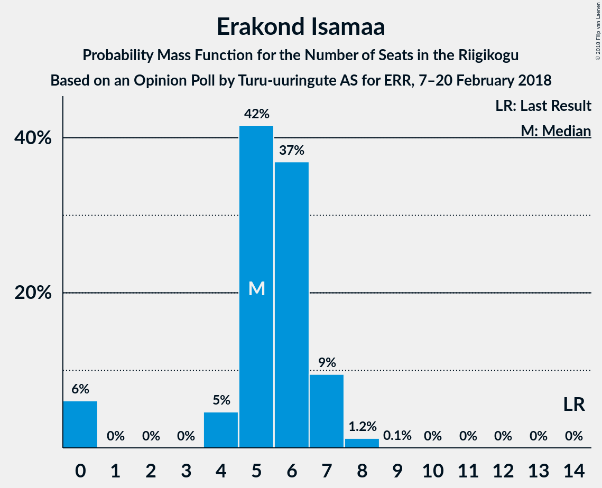

# Opinion Poll by Turu-uuringute AS for ERR, 7–20 February 2018

<a href="#voting-intentions">Voting Intentions</a> | <a href="#seats">Seats</a> | <a href="#coalitions">Coalitions</a> | <a href="#technical-information">Technical Information</a>

## Voting Intentions

### Confidence Intervals

| Party | Last Result | Poll Result | 80% Confidence Interval | 90% Confidence Interval | 95% Confidence Interval | 99% Confidence Interval |
|:-----:|:-----------:|:-----------:|:-----------------------:|:-----------------------:|:-----------------------:|:-----------------------:|
| Eesti Reformierakond | 27.7% | 27.0% | 25.3–28.9% |24.8–29.4% |24.4–29.8% |23.5–30.7% |
| Eesti Keskerakond | 24.8% | 27.0% | 25.3–28.9% |24.8–29.4% |24.4–29.8% |23.5–30.7% |
| Eesti Konservatiivne Rahvaerakond | 8.1% | 14.0% | 12.7–15.5% |12.3–16.0% |12.0–16.3% |11.4–17.1% |
| Sotsiaaldemokraatlik Erakond | 15.2% | 8.0% | 7.0–9.2% |6.7–9.6% |6.5–9.9% |6.0–10.5% |
| Erakond Isamaa | 13.7% | 6.0% | 5.2–7.1% |4.9–7.4% |4.7–7.7% |4.3–8.2% |
| Eesti Vabaerakond | 8.7% | 4.0% | 3.3–4.9% |3.1–5.1% |2.9–5.3% |2.6–5.8% |
| Erakond Eestimaa Rohelised | 0.9% | 3.0% | 2.4–3.8% |2.2–4.0% |2.1–4.2% |1.8–4.6% |

*Note:* The poll result column reflects the actual value used in the calculations. Published results may vary slightly, and in addition be rounded to fewer digits.

## Seats

### Confidence Intervals

| Party | Last Result | Median | 80% Confidence Interval | 90% Confidence Interval | 95% Confidence Interval | 99% Confidence Interval |
|:-----:|:-----------:|:------:|:-----------------------:|:-----------------------:|:-----------------------:|:-----------------------:|
| <a href="#eesti-reformierakond">Eesti Reformierakond</a> | 30 | 31 | 29–36 |29–36 |28–36 |26–38 |
| <a href="#eesti-keskerakond">Eesti Keskerakond</a> | 27 | 30 | 29–31 |29–31 |28–31 |27–31 |
| <a href="#eesti-konservatiivne-rahvaerakond">Eesti Konservatiivne Rahvaerakond</a> | 7 | 13 | 13–15 |13–15 |13–15 |12–15 |
| <a href="#sotsiaaldemokraatlik-erakond">Sotsiaaldemokraatlik Erakond</a> | 15 | 10 | 8–11 |8–11 |8–11 |8–11 |
| <a href="#erakond-isamaa">Erakond Isamaa</a> | 14 | 5 | 0–5 |0–6 |0–6 |0–7 |
| <a href="#eesti-vabaerakond">Eesti Vabaerakond</a> | 8 | 0 | 0–4 |0–4 |0–5 |0–6 |
| <a href="#erakond-eestimaa-rohelised">Erakond Eestimaa Rohelised</a> | 0 | 0 | 0 |0 |0 |0 |

### Eesti Reformierakond

*For a full overview of the results for this party, see the [Eesti Reformierakond](party-eestireformierakond.html) page.*

| Number of Seats | Probability | Accumulated | Special Marks |
|:---------------:|:-----------:|:-----------:|:-------------:|
| 24 | 0.2% | 100% |  |
| 25 | 0% | 99.8% |  |
| 26 | 1.1% | 99.8% |  |
| 27 | 0.9% | 98.7% |  |
| 28 | 0.3% | 98% |  |
| 29 | 10% | 97% |  |
| 30 | 3% | 88% | Last Result |
| 31 | 38% | 85% | Median |
| 32 | 4% | 47% |  |
| 33 | 26% | 43% |  |
| 34 | 3% | 17% |  |
| 35 | 1.3% | 13% |  |
| 36 | 11% | 12% |  |
| 37 | 0% | 1.2% |  |
| 38 | 1.2% | 1.2% |  |
| 39 | 0.1% | 0.1% |  |
| 40 | 0% | 0% |  |

### Eesti Keskerakond

*For a full overview of the results for this party, see the [Eesti Keskerakond](party-eestikeskerakond.html) page.*

| Number of Seats | Probability | Accumulated | Special Marks |
|:---------------:|:-----------:|:-----------:|:-------------:|
| 27 | 1.3% | 100% | Last Result |
| 28 | 2% | 98.7% |  |
| 29 | 20% | 97% |  |
| 30 | 60% | 76% | Median |
| 31 | 16% | 16% |  |
| 32 | 0.1% | 0.1% |  |
| 33 | 0% | 0% |  |

### Eesti Konservatiivne Rahvaerakond

*For a full overview of the results for this party, see the [Eesti Konservatiivne Rahvaerakond](party-eestikonservatiivnerahvaerakond.html) page.*

| Number of Seats | Probability | Accumulated | Special Marks |
|:---------------:|:-----------:|:-----------:|:-------------:|
| 7 | 0% | 100% | Last Result |
| 8 | 0% | 100% |  |
| 9 | 0% | 100% |  |
| 10 | 0% | 100% |  |
| 11 | 0% | 100% |  |
| 12 | 2% | 100% |  |
| 13 | 58% | 98% | Median |
| 14 | 14% | 40% |  |
| 15 | 26% | 26% |  |
| 16 | 0.1% | 0.1% |  |
| 17 | 0% | 0% |  |

### Sotsiaaldemokraatlik Erakond

*For a full overview of the results for this party, see the [Sotsiaaldemokraatlik Erakond](party-sotsiaaldemokraatlikerakond.html) page.*

| Number of Seats | Probability | Accumulated | Special Marks |
|:---------------:|:-----------:|:-----------:|:-------------:|
| 7 | 0.1% | 100% |  |
| 8 | 25% | 99.9% |  |
| 9 | 4% | 74% |  |
| 10 | 57% | 70% | Median |
| 11 | 14% | 14% |  |
| 12 | 0% | 0% |  |
| 13 | 0% | 0% |  |
| 14 | 0% | 0% |  |
| 15 | 0% | 0% | Last Result |

### Erakond Isamaa

*For a full overview of the results for this party, see the [Erakond Isamaa](party-erakondisamaa.html) page.*

| Number of Seats | Probability | Accumulated | Special Marks |
|:---------------:|:-----------:|:-----------:|:-------------:|
| 0 | 25% | 100% |  |
| 1 | 0% | 75% |  |
| 2 | 0% | 75% |  |
| 3 | 0% | 75% |  |
| 4 | 0% | 75% |  |
| 5 | 68% | 75% | Median |
| 6 | 5% | 8% |  |
| 7 | 2% | 2% |  |
| 8 | 0.4% | 0.4% |  |
| 9 | 0% | 0% |  |
| 10 | 0% | 0% |  |
| 11 | 0% | 0% |  |
| 12 | 0% | 0% |  |
| 13 | 0% | 0% |  |
| 14 | 0% | 0% | Last Result |

### Eesti Vabaerakond

*For a full overview of the results for this party, see the [Eesti Vabaerakond](party-eestivabaerakond.html) page.*

| Number of Seats | Probability | Accumulated | Special Marks |
|:---------------:|:-----------:|:-----------:|:-------------:|
| 0 | 85% | 100% | Median |
| 1 | 0% | 15% |  |
| 2 | 0% | 15% |  |
| 3 | 0% | 15% |  |
| 4 | 11% | 15% |  |
| 5 | 2% | 4% |  |
| 6 | 2% | 2% |  |
| 7 | 0% | 0% |  |
| 8 | 0% | 0% | Last Result |

### Erakond Eestimaa Rohelised

*For a full overview of the results for this party, see the [Erakond Eestimaa Rohelised](party-erakondeestimaarohelised.html) page.*

| Number of Seats | Probability | Accumulated | Special Marks |
|:---------------:|:-----------:|:-----------:|:-------------:|
| 0 | 100% | 100% | Last Result, Median |

## Coalitions

### Confidence Intervals

| Coalition | Last Result | Median | Majority? | 80% Confidence Interval | 90% Confidence Interval | 95% Confidence Interval | 99% Confidence Interval |
|:---------:|:-----------:|:------:|:---------:|:-----------------------:|:-----------------------:|:-----------------------:|:-----------------------:|
| Eesti Keskerakond – Eesti Reformierakond – Eesti Konservatiivne Rahvaerakond | 64 | 74 | 100% | 73–82 | 72–82 | 71–82 | 71–82 |
| Eesti Keskerakond – Eesti Reformierakond | 57 | 61 | 100% | 59–67 | 59–67 | 58–67 | 57–68 |
| Eesti Reformierakond – Eesti Konservatiivne Rahvaerakond – Erakond Isamaa | 51 | 49 | 35% | 48–51 | 48–52 | 47–53 | 45–53 |
| Eesti Reformierakond – Sotsiaaldemokraatlik Erakond – Erakond Isamaa – Eesti Vabaerakond | 67 | 46 | 0.5% | 44–48 | 44–49 | 44–50 | 41–51 |
| Eesti Reformierakond – Sotsiaaldemokraatlik Erakond – Erakond Isamaa | 59 | 46 | 0.3% | 41–48 | 41–48 | 41–50 | 39–50 |
| Eesti Keskerakond – Sotsiaaldemokraatlik Erakond – Erakond Isamaa | 56 | 45 | 0% | 38–46 | 38–46 | 38–46 | 38–47 |
| Eesti Reformierakond – Sotsiaaldemokraatlik Erakond | 45 | 41 | 0% | 40–44 | 39–44 | 37–44 | 35–46 |
| Eesti Reformierakond – Erakond Isamaa | 44 | 36 | 0% | 33–38 | 33–38 | 33–40 | 30–40 |

### Eesti Keskerakond – Eesti Reformierakond – Eesti Konservatiivne Rahvaerakond

| Number of Seats | Probability | Accumulated | Special Marks |
|:---------------:|:-----------:|:-----------:|:-------------:|
| 64 | 0% | 100% | Last Result |
| 65 | 0% | 100% |  |
| 66 | 0% | 100% |  |
| 67 | 0% | 100% |  |
| 68 | 0.1% | 100% |  |
| 69 | 0.1% | 99.9% |  |
| 70 | 0.3% | 99.9% |  |
| 71 | 3% | 99.6% |  |
| 72 | 3% | 96% |  |
| 73 | 10% | 94% |  |
| 74 | 36% | 84% | Median |
| 75 | 15% | 48% |  |
| 76 | 9% | 33% |  |
| 77 | 0.2% | 24% |  |
| 78 | 10% | 24% |  |
| 79 | 1.3% | 14% |  |
| 80 | 0% | 12% |  |
| 81 | 0.3% | 12% |  |
| 82 | 12% | 12% |  |
| 83 | 0% | 0.1% |  |
| 84 | 0% | 0.1% |  |
| 85 | 0.1% | 0.1% |  |
| 86 | 0% | 0% |  |

### Eesti Keskerakond – Eesti Reformierakond

| Number of Seats | Probability | Accumulated | Special Marks |
|:---------------:|:-----------:|:-----------:|:-------------:|
| 55 | 0.1% | 100% |  |
| 56 | 0.2% | 99.8% |  |
| 57 | 1.2% | 99.7% | Last Result |
| 58 | 3% | 98% |  |
| 59 | 10% | 95% |  |
| 60 | 0.8% | 85% |  |
| 61 | 38% | 84% | Median |
| 62 | 19% | 46% |  |
| 63 | 13% | 27% |  |
| 64 | 1.1% | 14% |  |
| 65 | 0.5% | 13% |  |
| 66 | 0.3% | 12% |  |
| 67 | 11% | 12% |  |
| 68 | 1.1% | 1.2% |  |
| 69 | 0% | 0.1% |  |
| 70 | 0.1% | 0.1% |  |
| 71 | 0% | 0% |  |

### Eesti Reformierakond – Eesti Konservatiivne Rahvaerakond – Erakond Isamaa

| Number of Seats | Probability | Accumulated | Special Marks |
|:---------------:|:-----------:|:-----------:|:-------------:|
| 44 | 0.1% | 100% |  |
| 45 | 1.2% | 99.9% |  |
| 46 | 0.1% | 98.7% |  |
| 47 | 2% | 98.6% |  |
| 48 | 21% | 96% |  |
| 49 | 38% | 76% | Median |
| 50 | 2% | 38% |  |
| 51 | 30% | 35% | Last Result, Majority |
| 52 | 2% | 5% |  |
| 53 | 3% | 3% |  |
| 54 | 0.1% | 0.3% |  |
| 55 | 0.2% | 0.2% |  |
| 56 | 0% | 0% |  |

### Eesti Reformierakond – Sotsiaaldemokraatlik Erakond – Erakond Isamaa – Eesti Vabaerakond

| Number of Seats | Probability | Accumulated | Special Marks |
|:---------------:|:-----------:|:-----------:|:-------------:|
| 41 | 0.6% | 100% |  |
| 42 | 0.8% | 99.4% |  |
| 43 | 1.0% | 98.6% |  |
| 44 | 12% | 98% |  |
| 45 | 20% | 86% |  |
| 46 | 38% | 66% | Median |
| 47 | 1.3% | 28% |  |
| 48 | 21% | 26% |  |
| 49 | 0.9% | 6% |  |
| 50 | 4% | 5% |  |
| 51 | 0.5% | 0.5% | Majority |
| 52 | 0% | 0% |  |
| 53 | 0% | 0% |  |
| 54 | 0% | 0% |  |
| 55 | 0% | 0% |  |
| 56 | 0% | 0% |  |
| 57 | 0% | 0% |  |
| 58 | 0% | 0% |  |
| 59 | 0% | 0% |  |
| 60 | 0% | 0% |  |
| 61 | 0% | 0% |  |
| 62 | 0% | 0% |  |
| 63 | 0% | 0% |  |
| 64 | 0% | 0% |  |
| 65 | 0% | 0% |  |
| 66 | 0% | 0% |  |
| 67 | 0% | 0% | Last Result |

### Eesti Reformierakond – Sotsiaaldemokraatlik Erakond – Erakond Isamaa

| Number of Seats | Probability | Accumulated | Special Marks |
|:---------------:|:-----------:|:-----------:|:-------------:|
| 38 | 0.3% | 100% |  |
| 39 | 1.0% | 99.7% |  |
| 40 | 0% | 98.7% |  |
| 41 | 12% | 98.7% |  |
| 42 | 2% | 87% |  |
| 43 | 1.2% | 85% |  |
| 44 | 12% | 84% |  |
| 45 | 9% | 72% |  |
| 46 | 38% | 63% | Median |
| 47 | 0.7% | 25% |  |
| 48 | 20% | 24% |  |
| 49 | 0.9% | 4% |  |
| 50 | 3% | 4% |  |
| 51 | 0.3% | 0.3% | Majority |
| 52 | 0% | 0% |  |
| 53 | 0% | 0% |  |
| 54 | 0% | 0% |  |
| 55 | 0% | 0% |  |
| 56 | 0% | 0% |  |
| 57 | 0% | 0% |  |
| 58 | 0% | 0% |  |
| 59 | 0% | 0% | Last Result |

### Eesti Keskerakond – Sotsiaaldemokraatlik Erakond – Erakond Isamaa

| Number of Seats | Probability | Accumulated | Special Marks |
|:---------------:|:-----------:|:-----------:|:-------------:|
| 38 | 12% | 100% |  |
| 39 | 12% | 88% |  |
| 40 | 2% | 77% |  |
| 41 | 0.1% | 74% |  |
| 42 | 1.5% | 74% |  |
| 43 | 0.3% | 73% |  |
| 44 | 16% | 72% |  |
| 45 | 41% | 56% | Median |
| 46 | 14% | 16% |  |
| 47 | 2% | 2% |  |
| 48 | 0.1% | 0.3% |  |
| 49 | 0% | 0.1% |  |
| 50 | 0.1% | 0.1% |  |
| 51 | 0% | 0% | Majority |
| 52 | 0% | 0% |  |
| 53 | 0% | 0% |  |
| 54 | 0% | 0% |  |
| 55 | 0% | 0% |  |
| 56 | 0% | 0% | Last Result |

### Eesti Reformierakond – Sotsiaaldemokraatlik Erakond

| Number of Seats | Probability | Accumulated | Special Marks |
|:---------------:|:-----------:|:-----------:|:-------------:|
| 33 | 0.2% | 100% |  |
| 34 | 0% | 99.8% |  |
| 35 | 0.9% | 99.8% |  |
| 36 | 0.8% | 98.9% |  |
| 37 | 1.1% | 98% |  |
| 38 | 0.5% | 97% |  |
| 39 | 3% | 97% |  |
| 40 | 9% | 94% |  |
| 41 | 48% | 85% | Median |
| 42 | 0.7% | 36% |  |
| 43 | 20% | 36% |  |
| 44 | 14% | 16% |  |
| 45 | 0.3% | 1.5% | Last Result |
| 46 | 1.1% | 1.2% |  |
| 47 | 0.1% | 0.1% |  |
| 48 | 0% | 0% |  |

### Eesti Reformierakond – Erakond Isamaa

| Number of Seats | Probability | Accumulated | Special Marks |
|:---------------:|:-----------:|:-----------:|:-------------:|
| 29 | 0.2% | 100% |  |
| 30 | 1.1% | 99.8% |  |
| 31 | 0% | 98.7% |  |
| 32 | 1.1% | 98.7% |  |
| 33 | 12% | 98% |  |
| 34 | 9% | 86% |  |
| 35 | 2% | 77% |  |
| 36 | 49% | 74% | Median |
| 37 | 4% | 26% |  |
| 38 | 17% | 22% |  |
| 39 | 0.1% | 4% |  |
| 40 | 4% | 4% |  |
| 41 | 0.1% | 0.4% |  |
| 42 | 0.2% | 0.3% |  |
| 43 | 0% | 0% |  |
| 44 | 0% | 0% | Last Result |

## Technical Information

### Opinion Poll

+ **Polling firm:** Turu-uuringute AS
+ **Commissioner(s):** ERR
+ **Fieldwork period:** 7–20 February 2018

### Calculations

+ **Sample size:** 1011
+ **Simulations done:** 1,024
+ **Error estimate:** 2.79%

