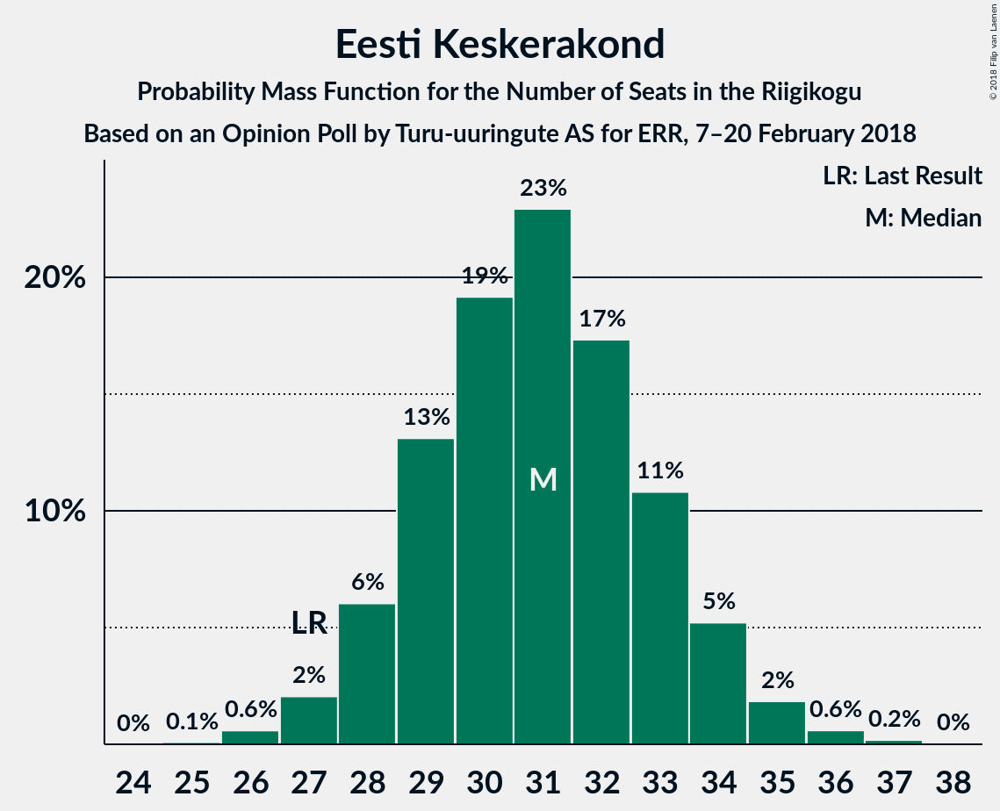
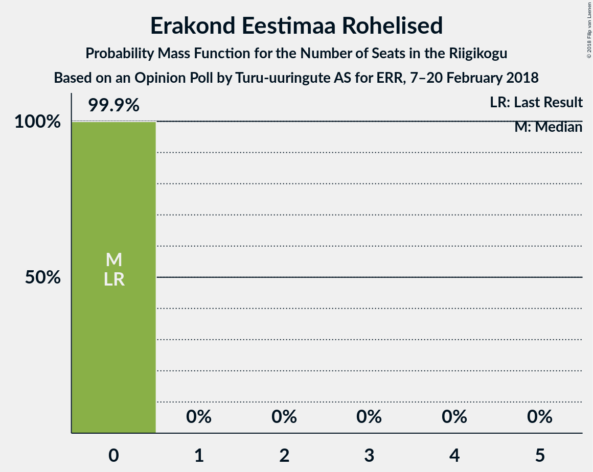

# Opinion Poll by Turu-uuringute AS for ERR, 7–20 February 2018

<a href="#voting-intentions">Voting Intentions</a> | <a href="#seats">Seats</a> | <a href="#coalitions">Coalitions</a> | <a href="#technical-information">Technical Information</a>

## Voting Intentions

### Confidence Intervals

| Party | Last Result | Poll Result | 80% Confidence Interval | 90% Confidence Interval | 95% Confidence Interval | 99% Confidence Interval |
|:-----:|:-----------:|:-----------:|:-----------------------:|:-----------------------:|:-----------------------:|:-----------------------:|
| Eesti Reformierakond | 27.7% | 27.0% | 25.3–28.9% |24.8–29.4% |24.4–29.8% |23.5–30.7% |
| Eesti Keskerakond | 24.8% | 27.0% | 25.3–28.9% |24.8–29.4% |24.4–29.8% |23.5–30.7% |
| Eesti Konservatiivne Rahvaerakond | 8.1% | 14.0% | 12.7–15.5% |12.3–16.0% |12.0–16.3% |11.4–17.1% |
| Sotsiaaldemokraatlik Erakond | 15.2% | 8.0% | 7.0–9.2% |6.7–9.6% |6.5–9.9% |6.0–10.5% |
| Erakond Isamaa | 13.7% | 6.0% | 5.2–7.1% |4.9–7.4% |4.7–7.7% |4.3–8.2% |
| Eesti Vabaerakond | 8.7% | 4.0% | 3.3–4.9% |3.1–5.1% |2.9–5.3% |2.6–5.8% |
| Erakond Eestimaa Rohelised | 0.9% | 3.0% | 2.4–3.8% |2.2–4.0% |2.1–4.2% |1.8–4.6% |

*Note:* The poll result column reflects the actual value used in the calculations. Published results may vary slightly, and in addition be rounded to fewer digits.

## Seats

### Confidence Intervals

| Party | Last Result | Median | 80% Confidence Interval | 90% Confidence Interval | 95% Confidence Interval | 99% Confidence Interval |
|:-----:|:-----------:|:------:|:-----------------------:|:-----------------------:|:-----------------------:|:-----------------------:|
| <a href="#eesti-reformierakond">Eesti Reformierakond</a> | 30 | 31 | 29–34 |28–34 |27–35 |27–36 |
| <a href="#eesti-keskerakond">Eesti Keskerakond</a> | 27 | 31 | 28–33 |28–34 |27–35 |26–36 |
| <a href="#eesti-konservatiivne-rahvaerakond">Eesti Konservatiivne Rahvaerakond</a> | 7 | 15 | 13–17 |13–17 |12–18 |12–19 |
| <a href="#sotsiaaldemokraatlik-erakond">Sotsiaaldemokraatlik Erakond</a> | 15 | 8 | 7–9 |6–10 |6–10 |5–11 |
| <a href="#erakond-isamaa">Erakond Isamaa</a> | 14 | 5 | 0–7 |0–7 |0–7 |0–8 |
| <a href="#eesti-vabaerakond">Eesti Vabaerakond</a> | 8 | 0 | 0 |0–4 |0–5 |0–5 |
| <a href="#erakond-eestimaa-rohelised">Erakond Eestimaa Rohelised</a> | 0 | 0 | 0 |0 |0 |0 |

### Eesti Reformierakond

*For a full overview of the results for this party, see the [Eesti Reformierakond](party-eestireformierakond.html) page.*

| Number of Seats | Probability | Accumulated | Special Marks |
|:---------------:|:-----------:|:-----------:|:-------------:|
| 25 | 0.1% | 100% |  |
| 26 | 0.4% | 99.9% |  |
| 27 | 2% | 99.5% |  |
| 28 | 5% | 97% |  |
| 29 | 8% | 92% |  |
| 30 | 17% | 83% | Last Result |
| 31 | 20% | 66% | Median |
| 32 | 19% | 46% |  |
| 33 | 12% | 27% |  |
| 34 | 11% | 15% |  |
| 35 | 2% | 4% |  |
| 36 | 1.1% | 1.3% |  |
| 37 | 0.1% | 0.2% |  |
| 38 | 0.1% | 0.1% |  |
| 39 | 0% | 0% |  |

### Eesti Keskerakond

*For a full overview of the results for this party, see the [Eesti Keskerakond](party-eestikeskerakond.html) page.*

| Number of Seats | Probability | Accumulated | Special Marks |
|:---------------:|:-----------:|:-----------:|:-------------:|
| 25 | 0.1% | 100% |  |
| 26 | 0.5% | 99.9% |  |
| 27 | 2% | 99.4% | Last Result |
| 28 | 8% | 97% |  |
| 29 | 16% | 89% |  |
| 30 | 19% | 74% |  |
| 31 | 21% | 55% | Median |
| 32 | 17% | 33% |  |
| 33 | 9% | 17% |  |
| 34 | 4% | 7% |  |
| 35 | 2% | 3% |  |
| 36 | 0.7% | 1.1% |  |
| 37 | 0.3% | 0.3% |  |
| 38 | 0.1% | 0.1% |  |
| 39 | 0% | 0% |  |

### Eesti Konservatiivne Rahvaerakond

*For a full overview of the results for this party, see the [Eesti Konservatiivne Rahvaerakond](party-eestikonservatiivnerahvaerakond.html) page.*

| Number of Seats | Probability | Accumulated | Special Marks |
|:---------------:|:-----------:|:-----------:|:-------------:|
| 7 | 0% | 100% | Last Result |
| 8 | 0% | 100% |  |
| 9 | 0% | 100% |  |
| 10 | 0% | 100% |  |
| 11 | 0.4% | 100% |  |
| 12 | 3% | 99.5% |  |
| 13 | 12% | 96% |  |
| 14 | 24% | 84% |  |
| 15 | 30% | 60% | Median |
| 16 | 20% | 30% |  |
| 17 | 6% | 10% |  |
| 18 | 3% | 4% |  |
| 19 | 0.7% | 0.7% |  |
| 20 | 0% | 0.1% |  |
| 21 | 0% | 0% |  |

### Sotsiaaldemokraatlik Erakond

*For a full overview of the results for this party, see the [Sotsiaaldemokraatlik Erakond](party-sotsiaaldemokraatlikerakond.html) page.*

| Number of Seats | Probability | Accumulated | Special Marks |
|:---------------:|:-----------:|:-----------:|:-------------:|
| 5 | 0.7% | 100% |  |
| 6 | 6% | 99.3% |  |
| 7 | 26% | 93% |  |
| 8 | 43% | 67% | Median |
| 9 | 18% | 24% |  |
| 10 | 5% | 6% |  |
| 11 | 0.8% | 0.8% |  |
| 12 | 0% | 0% |  |
| 13 | 0% | 0% |  |
| 14 | 0% | 0% |  |
| 15 | 0% | 0% | Last Result |

### Erakond Isamaa

*For a full overview of the results for this party, see the [Erakond Isamaa](party-erakondisamaa.html) page.*

| Number of Seats | Probability | Accumulated | Special Marks |
|:---------------:|:-----------:|:-----------:|:-------------:|
| 0 | 13% | 100% |  |
| 1 | 0% | 87% |  |
| 2 | 0% | 87% |  |
| 3 | 0% | 87% |  |
| 4 | 9% | 87% |  |
| 5 | 44% | 78% | Median |
| 6 | 16% | 34% |  |
| 7 | 15% | 17% |  |
| 8 | 2% | 2% |  |
| 9 | 0.1% | 0.1% |  |
| 10 | 0% | 0% |  |
| 11 | 0% | 0% |  |
| 12 | 0% | 0% |  |
| 13 | 0% | 0% |  |
| 14 | 0% | 0% | Last Result |

### Eesti Vabaerakond

*For a full overview of the results for this party, see the [Eesti Vabaerakond](party-eestivabaerakond.html) page.*

| Number of Seats | Probability | Accumulated | Special Marks |
|:---------------:|:-----------:|:-----------:|:-------------:|
| 0 | 94% | 100% | Median |
| 1 | 0% | 6% |  |
| 2 | 0% | 6% |  |
| 3 | 0% | 6% |  |
| 4 | 3% | 6% |  |
| 5 | 3% | 3% |  |
| 6 | 0.2% | 0.2% |  |
| 7 | 0% | 0% |  |
| 8 | 0% | 0% | Last Result |

### Erakond Eestimaa Rohelised

*For a full overview of the results for this party, see the [Erakond Eestimaa Rohelised](party-erakondeestimaarohelised.html) page.*

| Number of Seats | Probability | Accumulated | Special Marks |
|:---------------:|:-----------:|:-----------:|:-------------:|
| 0 | 99.9% | 100% | Last Result, Median |
| 1 | 0% | 0.1% |  |
| 2 | 0% | 0.1% |  |
| 3 | 0% | 0.1% |  |
| 4 | 0.1% | 0.1% |  |
| 5 | 0.1% | 0.1% |  |
| 6 | 0% | 0% |  |

## Coalitions

### Confidence Intervals

| Coalition | Last Result | Median | Majority? | 80% Confidence Interval | 90% Confidence Interval | 95% Confidence Interval | 99% Confidence Interval |
|:---------:|:-----------:|:------:|:---------:|:-----------------------:|:-----------------------:|:-----------------------:|:-----------------------:|
| Eesti Keskerakond – Eesti Reformierakond – Eesti Konservatiivne Rahvaerakond | 64 | 77 | 100% | 74–80 | 73–81 | 72–83 | 70–84 |
| Eesti Keskerakond – Eesti Reformierakond | 57 | 62 | 100% | 59–65 | 58–66 | 58–67 | 57–68 |
| Eesti Reformierakond – Eesti Konservatiivne Rahvaerakond – Erakond Isamaa | 51 | 51 | 60% | 48–53 | 47–54 | 47–55 | 45–56 |
| Eesti Keskerakond – Eesti Konservatiivne Rahvaerakond | 34 | 46 | 2% | 43–49 | 42–49 | 42–50 | 41–52 |
| Eesti Reformierakond – Eesti Konservatiivne Rahvaerakond | 37 | 46 | 2% | 43–49 | 42–50 | 41–50 | 40–51 |
| Eesti Keskerakond – Sotsiaaldemokraatlik Erakond – Erakond Isamaa | 56 | 44 | 0.1% | 41–46 | 40–47 | 39–48 | 37–49 |
| Eesti Reformierakond – Sotsiaaldemokraatlik Erakond – Erakond Isamaa – Eesti Vabaerakond | 67 | 45 | 0.1% | 42–47 | 40–48 | 39–48 | 38–50 |
| Eesti Reformierakond – Sotsiaaldemokraatlik Erakond – Erakond Isamaa | 59 | 44 | 0% | 41–47 | 40–47 | 39–48 | 38–49 |
| Eesti Keskerakond – Sotsiaaldemokraatlik Erakond | 42 | 39 | 0% | 36–41 | 36–42 | 35–43 | 34–45 |
| Eesti Reformierakond – Sotsiaaldemokraatlik Erakond | 45 | 39 | 0% | 36–42 | 35–42 | 35–43 | 33–44 |
| Eesti Reformierakond – Erakond Isamaa | 44 | 36 | 0% | 33–39 | 32–40 | 31–40 | 30–41 |
| Eesti Konservatiivne Rahvaerakond – Sotsiaaldemokraatlik Erakond | 22 | 23 | 0% | 20–25 | 20–25 | 19–26 | 18–27 |

### Eesti Keskerakond – Eesti Reformierakond – Eesti Konservatiivne Rahvaerakond

| Number of Seats | Probability | Accumulated | Special Marks |
|:---------------:|:-----------:|:-----------:|:-------------:|
| 64 | 0% | 100% | Last Result |
| 65 | 0% | 100% |  |
| 66 | 0% | 100% |  |
| 67 | 0% | 100% |  |
| 68 | 0% | 100% |  |
| 69 | 0% | 100% |  |
| 70 | 0.5% | 99.9% |  |
| 71 | 0.5% | 99.4% |  |
| 72 | 2% | 99.0% |  |
| 73 | 3% | 97% |  |
| 74 | 6% | 94% |  |
| 75 | 19% | 87% |  |
| 76 | 16% | 69% |  |
| 77 | 13% | 53% | Median |
| 78 | 17% | 39% |  |
| 79 | 5% | 22% |  |
| 80 | 8% | 17% |  |
| 81 | 5% | 9% |  |
| 82 | 1.2% | 4% |  |
| 83 | 2% | 3% |  |
| 84 | 0.9% | 1.0% |  |
| 85 | 0% | 0% |  |

### Eesti Keskerakond – Eesti Reformierakond

| Number of Seats | Probability | Accumulated | Special Marks |
|:---------------:|:-----------:|:-----------:|:-------------:|
| 55 | 0.1% | 100% |  |
| 56 | 0.3% | 99.8% |  |
| 57 | 1.3% | 99.6% | Last Result |
| 58 | 5% | 98% |  |
| 59 | 6% | 94% |  |
| 60 | 14% | 87% |  |
| 61 | 16% | 73% |  |
| 62 | 14% | 57% | Median |
| 63 | 17% | 43% |  |
| 64 | 11% | 26% |  |
| 65 | 7% | 15% |  |
| 66 | 4% | 8% |  |
| 67 | 2% | 4% |  |
| 68 | 2% | 2% |  |
| 69 | 0.1% | 0.3% |  |
| 70 | 0.1% | 0.2% |  |
| 71 | 0% | 0% |  |

### Eesti Reformierakond – Eesti Konservatiivne Rahvaerakond – Erakond Isamaa

| Number of Seats | Probability | Accumulated | Special Marks |
|:---------------:|:-----------:|:-----------:|:-------------:|
| 43 | 0.1% | 100% |  |
| 44 | 0.2% | 99.9% |  |
| 45 | 0.7% | 99.7% |  |
| 46 | 1.5% | 99.0% |  |
| 47 | 4% | 98% |  |
| 48 | 8% | 94% |  |
| 49 | 9% | 86% |  |
| 50 | 16% | 76% |  |
| 51 | 15% | 60% | Last Result, Median, Majority |
| 52 | 20% | 45% |  |
| 53 | 16% | 25% |  |
| 54 | 5% | 9% |  |
| 55 | 3% | 4% |  |
| 56 | 0.8% | 0.9% |  |
| 57 | 0.2% | 0.2% |  |
| 58 | 0% | 0% |  |

### Eesti Keskerakond – Eesti Konservatiivne Rahvaerakond

| Number of Seats | Probability | Accumulated | Special Marks |
|:---------------:|:-----------:|:-----------:|:-------------:|
| 34 | 0% | 100% | Last Result |
| 35 | 0% | 100% |  |
| 36 | 0% | 100% |  |
| 37 | 0% | 100% |  |
| 38 | 0% | 100% |  |
| 39 | 0.1% | 100% |  |
| 40 | 0.3% | 99.9% |  |
| 41 | 1.1% | 99.6% |  |
| 42 | 5% | 98.5% |  |
| 43 | 10% | 93% |  |
| 44 | 17% | 84% |  |
| 45 | 15% | 67% |  |
| 46 | 20% | 52% | Median |
| 47 | 15% | 32% |  |
| 48 | 7% | 18% |  |
| 49 | 7% | 11% |  |
| 50 | 2% | 4% |  |
| 51 | 0.9% | 2% | Majority |
| 52 | 0.8% | 1.1% |  |
| 53 | 0.2% | 0.3% |  |
| 54 | 0.1% | 0.1% |  |
| 55 | 0% | 0% |  |

### Eesti Reformierakond – Eesti Konservatiivne Rahvaerakond

| Number of Seats | Probability | Accumulated | Special Marks |
|:---------------:|:-----------:|:-----------:|:-------------:|
| 37 | 0% | 100% | Last Result |
| 38 | 0% | 100% |  |
| 39 | 0.1% | 100% |  |
| 40 | 0.4% | 99.8% |  |
| 41 | 2% | 99.4% |  |
| 42 | 4% | 97% |  |
| 43 | 5% | 93% |  |
| 44 | 12% | 88% |  |
| 45 | 15% | 77% |  |
| 46 | 13% | 62% | Median |
| 47 | 21% | 49% |  |
| 48 | 15% | 28% |  |
| 49 | 7% | 13% |  |
| 50 | 4% | 6% |  |
| 51 | 1.5% | 2% | Majority |
| 52 | 0.3% | 0.4% |  |
| 53 | 0.1% | 0.1% |  |
| 54 | 0% | 0% |  |

### Eesti Keskerakond – Sotsiaaldemokraatlik Erakond – Erakond Isamaa

| Number of Seats | Probability | Accumulated | Special Marks |
|:---------------:|:-----------:|:-----------:|:-------------:|
| 36 | 0% | 100% |  |
| 37 | 0.5% | 99.9% |  |
| 38 | 1.0% | 99.4% |  |
| 39 | 2% | 98% |  |
| 40 | 4% | 97% |  |
| 41 | 14% | 92% |  |
| 42 | 7% | 79% |  |
| 43 | 20% | 72% |  |
| 44 | 24% | 52% | Median |
| 45 | 10% | 29% |  |
| 46 | 12% | 19% |  |
| 47 | 3% | 7% |  |
| 48 | 2% | 3% |  |
| 49 | 0.7% | 1.0% |  |
| 50 | 0.2% | 0.2% |  |
| 51 | 0% | 0.1% | Majority |
| 52 | 0% | 0% |  |
| 53 | 0% | 0% |  |
| 54 | 0% | 0% |  |
| 55 | 0% | 0% |  |
| 56 | 0% | 0% | Last Result |

### Eesti Reformierakond – Sotsiaaldemokraatlik Erakond – Erakond Isamaa – Eesti Vabaerakond

| Number of Seats | Probability | Accumulated | Special Marks |
|:---------------:|:-----------:|:-----------:|:-------------:|
| 36 | 0.2% | 100% |  |
| 37 | 0.2% | 99.8% |  |
| 38 | 1.2% | 99.6% |  |
| 39 | 2% | 98% |  |
| 40 | 2% | 97% |  |
| 41 | 4% | 94% |  |
| 42 | 12% | 90% |  |
| 43 | 12% | 78% |  |
| 44 | 16% | 67% | Median |
| 45 | 23% | 51% |  |
| 46 | 11% | 27% |  |
| 47 | 11% | 17% |  |
| 48 | 4% | 5% |  |
| 49 | 1.0% | 2% |  |
| 50 | 0.4% | 0.5% |  |
| 51 | 0.1% | 0.1% | Majority |
| 52 | 0% | 0% |  |
| 53 | 0% | 0% |  |
| 54 | 0% | 0% |  |
| 55 | 0% | 0% |  |
| 56 | 0% | 0% |  |
| 57 | 0% | 0% |  |
| 58 | 0% | 0% |  |
| 59 | 0% | 0% |  |
| 60 | 0% | 0% |  |
| 61 | 0% | 0% |  |
| 62 | 0% | 0% |  |
| 63 | 0% | 0% |  |
| 64 | 0% | 0% |  |
| 65 | 0% | 0% |  |
| 66 | 0% | 0% |  |
| 67 | 0% | 0% | Last Result |

### Eesti Reformierakond – Sotsiaaldemokraatlik Erakond – Erakond Isamaa

| Number of Seats | Probability | Accumulated | Special Marks |
|:---------------:|:-----------:|:-----------:|:-------------:|
| 36 | 0.2% | 100% |  |
| 37 | 0.3% | 99.8% |  |
| 38 | 1.3% | 99.5% |  |
| 39 | 2% | 98% |  |
| 40 | 3% | 96% |  |
| 41 | 5% | 93% |  |
| 42 | 13% | 88% |  |
| 43 | 12% | 75% |  |
| 44 | 16% | 62% | Median |
| 45 | 23% | 47% |  |
| 46 | 10% | 24% |  |
| 47 | 11% | 14% |  |
| 48 | 3% | 4% |  |
| 49 | 0.8% | 1.0% |  |
| 50 | 0.2% | 0.2% |  |
| 51 | 0% | 0% | Majority |
| 52 | 0% | 0% |  |
| 53 | 0% | 0% |  |
| 54 | 0% | 0% |  |
| 55 | 0% | 0% |  |
| 56 | 0% | 0% |  |
| 57 | 0% | 0% |  |
| 58 | 0% | 0% |  |
| 59 | 0% | 0% | Last Result |

### Eesti Keskerakond – Sotsiaaldemokraatlik Erakond

| Number of Seats | Probability | Accumulated | Special Marks |
|:---------------:|:-----------:|:-----------:|:-------------:|
| 32 | 0% | 100% |  |
| 33 | 0.2% | 99.9% |  |
| 34 | 1.0% | 99.7% |  |
| 35 | 4% | 98.8% |  |
| 36 | 9% | 95% |  |
| 37 | 12% | 86% |  |
| 38 | 20% | 75% |  |
| 39 | 28% | 55% | Median |
| 40 | 9% | 27% |  |
| 41 | 11% | 19% |  |
| 42 | 4% | 7% | Last Result |
| 43 | 2% | 3% |  |
| 44 | 0.6% | 1.1% |  |
| 45 | 0.4% | 0.5% |  |
| 46 | 0.1% | 0.1% |  |
| 47 | 0% | 0% |  |

### Eesti Reformierakond – Sotsiaaldemokraatlik Erakond

| Number of Seats | Probability | Accumulated | Special Marks |
|:---------------:|:-----------:|:-----------:|:-------------:|
| 32 | 0.1% | 100% |  |
| 33 | 0.4% | 99.9% |  |
| 34 | 1.4% | 99.5% |  |
| 35 | 4% | 98% |  |
| 36 | 5% | 94% |  |
| 37 | 10% | 89% |  |
| 38 | 16% | 79% |  |
| 39 | 16% | 63% | Median |
| 40 | 21% | 47% |  |
| 41 | 9% | 27% |  |
| 42 | 13% | 17% |  |
| 43 | 4% | 5% |  |
| 44 | 0.7% | 1.0% |  |
| 45 | 0.2% | 0.3% | Last Result |
| 46 | 0% | 0% |  |

### Eesti Reformierakond – Erakond Isamaa

| Number of Seats | Probability | Accumulated | Special Marks |
|:---------------:|:-----------:|:-----------:|:-------------:|
| 28 | 0.1% | 100% |  |
| 29 | 0.4% | 99.9% |  |
| 30 | 0.8% | 99.5% |  |
| 31 | 2% | 98.8% |  |
| 32 | 3% | 97% |  |
| 33 | 7% | 94% |  |
| 34 | 9% | 87% |  |
| 35 | 14% | 78% |  |
| 36 | 15% | 64% | Median |
| 37 | 25% | 49% |  |
| 38 | 11% | 24% |  |
| 39 | 8% | 13% |  |
| 40 | 4% | 5% |  |
| 41 | 0.7% | 0.9% |  |
| 42 | 0.1% | 0.2% |  |
| 43 | 0% | 0% |  |
| 44 | 0% | 0% | Last Result |

### Eesti Konservatiivne Rahvaerakond – Sotsiaaldemokraatlik Erakond

| Number of Seats | Probability | Accumulated | Special Marks |
|:---------------:|:-----------:|:-----------:|:-------------:|
| 17 | 0.1% | 100% |  |
| 18 | 0.7% | 99.9% |  |
| 19 | 2% | 99.2% |  |
| 20 | 7% | 97% |  |
| 21 | 10% | 90% |  |
| 22 | 23% | 80% | Last Result |
| 23 | 23% | 57% | Median |
| 24 | 20% | 34% |  |
| 25 | 9% | 14% |  |
| 26 | 3% | 4% |  |
| 27 | 1.3% | 1.5% |  |
| 28 | 0.2% | 0.2% |  |
| 29 | 0% | 0% |  |

## Technical Information

### Opinion Poll

+ **Polling firm:** Turu-uuringute AS
+ **Commissioner(s):** ERR
+ **Fieldwork period:** 7–20 February 2018

### Calculations

+ **Sample size:** 1011
+ **Simulations done:** 131,072
+ **Error estimate:** 1.33%

