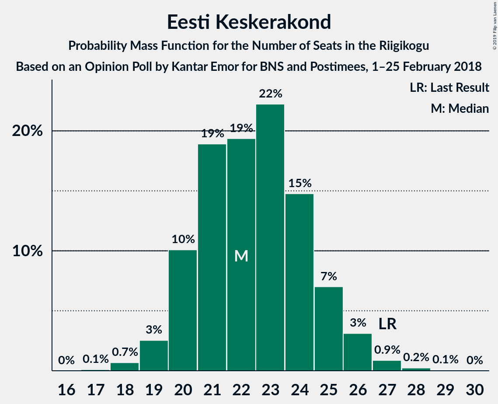
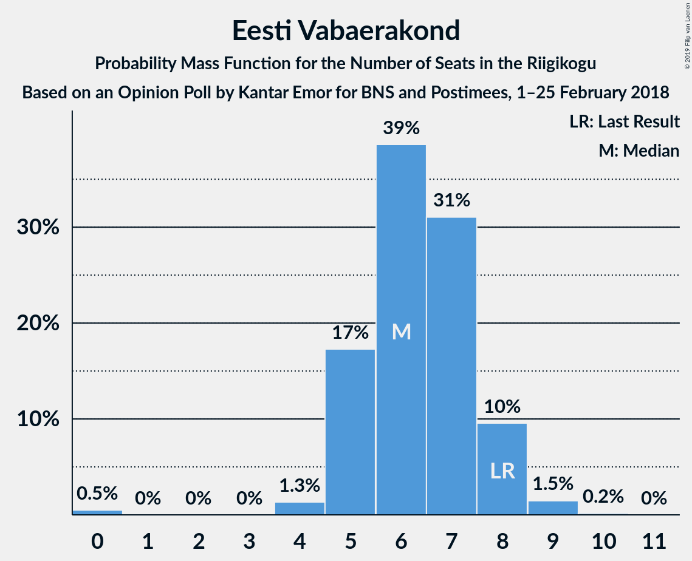
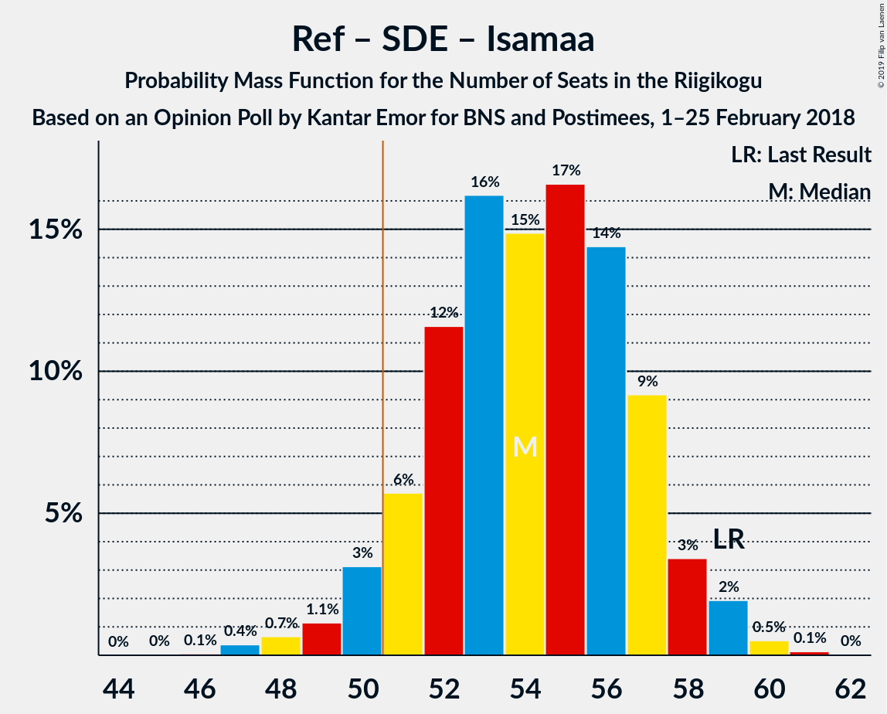

# Opinion Poll by Kantar Emor for BNS and Postimees, 1–25 February 2018

<a href="#voting-intentions">Voting Intentions</a> | <a href="#seats">Seats</a> | <a href="#coalitions">Coalitions</a> | <a href="#technical-information">Technical Information</a>

## Voting Intentions

### Confidence Intervals

| Party | Last Result | Poll Result | 80% Confidence Interval | 90% Confidence Interval | 95% Confidence Interval | 99% Confidence Interval |
|:-----:|:-----------:|:-----------:|:-----------------------:|:-----------------------:|:-----------------------:|:-----------------------:|
| Eesti Reformierakond | 27.7% | 33.9% | 31.9–36.0% |31.3–36.6% |30.8–37.1% |29.9–38.1% |
| Eesti Keskerakond | 24.8% | 20.9% | 19.3–22.8% |18.8–23.3% |18.4–23.8% |17.6–24.7% |
| Eesti Konservatiivne Rahvaerakond | 8.1% | 16.9% | 15.4–18.7% |15.0–19.1% |14.6–19.6% |13.9–20.4% |
| Sotsiaaldemokraatlik Erakond | 15.2% | 11.0% | 9.7–12.5% |9.4–12.9% |9.1–13.2% |8.5–14.0% |
| Eesti Vabaerakond | 8.7% | 7.0% | 6.0–8.2% |5.7–8.6% |5.5–8.9% |5.0–9.5% |
| Erakond Isamaa | 13.7% | 5.9% | 5.0–7.1% |4.8–7.4% |4.6–7.7% |4.2–8.3% |
| Erakond Eestimaa Rohelised | 0.9% | 4.0% | 3.3–5.0% |3.1–5.3% |2.9–5.5% |2.6–6.0% |

*Note:* The poll result column reflects the actual value used in the calculations. Published results may vary slightly, and in addition be rounded to fewer digits.

## Seats

### Confidence Intervals

| Party | Last Result | Median | 80% Confidence Interval | 90% Confidence Interval | 95% Confidence Interval | 99% Confidence Interval |
|:-----:|:-----------:|:------:|:-----------------------:|:-----------------------:|:-----------------------:|:-----------------------:|
| <a href="#eesti-reformierakond">Eesti Reformierakond</a> | 30 | 38 | 36–41 |35–42 |35–43 |34–44 |
| <a href="#eesti-keskerakond">Eesti Keskerakond</a> | 27 | 22 | 21–25 |20–26 |19–26 |18–27 |
| <a href="#eesti-konservatiivne-rahvaerakond">Eesti Konservatiivne Rahvaerakond</a> | 7 | 17 | 16–20 |15–20 |15–21 |14–22 |
| <a href="#sotsiaaldemokraatlik-erakond">Sotsiaaldemokraatlik Erakond</a> | 15 | 11 | 9–13 |9–13 |8–13 |8–14 |
| <a href="#eesti-vabaerakond">Eesti Vabaerakond</a> | 8 | 6 | 5–8 |5–8 |5–8 |4–9 |
| <a href="#erakond-isamaa">Erakond Isamaa</a> | 14 | 5 | 0–6 |0–7 |0–7 |0–7 |
| <a href="#erakond-eestimaa-rohelised">Erakond Eestimaa Rohelised</a> | 0 | 0 | 0–4 |0–4 |0–4 |0–5 |

### Eesti Reformierakond

*For a full overview of the results for this party, see the [Eesti Reformierakond](party-eestireformierakond.html) page.*

| Number of Seats | Probability | Accumulated | Special Marks |
|:---------------:|:-----------:|:-----------:|:-------------:|
| 30 | 0% | 100% | Last Result |
| 31 | 0% | 100% |  |
| 32 | 0.1% | 100% |  |
| 33 | 0.3% | 99.9% |  |
| 34 | 2% | 99.6% |  |
| 35 | 5% | 98% |  |
| 36 | 13% | 93% |  |
| 37 | 8% | 80% |  |
| 38 | 27% | 71% | Median |
| 39 | 18% | 45% |  |
| 40 | 13% | 26% |  |
| 41 | 6% | 13% |  |
| 42 | 3% | 7% |  |
| 43 | 3% | 4% |  |
| 44 | 0.7% | 0.8% |  |
| 45 | 0.1% | 0.1% |  |
| 46 | 0% | 0% |  |

### Eesti Keskerakond

*For a full overview of the results for this party, see the [Eesti Keskerakond](party-eestikeskerakond.html) page.*

| Number of Seats | Probability | Accumulated | Special Marks |
|:---------------:|:-----------:|:-----------:|:-------------:|
| 17 | 0.1% | 100% |  |
| 18 | 0.7% | 99.9% |  |
| 19 | 2% | 99.3% |  |
| 20 | 7% | 97% |  |
| 21 | 22% | 90% |  |
| 22 | 24% | 69% | Median |
| 23 | 21% | 45% |  |
| 24 | 14% | 24% |  |
| 25 | 4% | 10% |  |
| 26 | 5% | 6% |  |
| 27 | 1.0% | 1.1% | Last Result |
| 28 | 0.1% | 0.2% |  |
| 29 | 0.1% | 0.1% |  |
| 30 | 0% | 0% |  |

### Eesti Konservatiivne Rahvaerakond

*For a full overview of the results for this party, see the [Eesti Konservatiivne Rahvaerakond](party-eestikonservatiivnerahvaerakond.html) page.*

| Number of Seats | Probability | Accumulated | Special Marks |
|:---------------:|:-----------:|:-----------:|:-------------:|
| 7 | 0% | 100% | Last Result |
| 8 | 0% | 100% |  |
| 9 | 0% | 100% |  |
| 10 | 0% | 100% |  |
| 11 | 0% | 100% |  |
| 12 | 0% | 100% |  |
| 13 | 0.1% | 100% |  |
| 14 | 0.9% | 99.9% |  |
| 15 | 5% | 99.0% |  |
| 16 | 23% | 94% |  |
| 17 | 29% | 71% | Median |
| 18 | 21% | 43% |  |
| 19 | 9% | 22% |  |
| 20 | 9% | 13% |  |
| 21 | 3% | 4% |  |
| 22 | 0.5% | 0.7% |  |
| 23 | 0.1% | 0.2% |  |
| 24 | 0% | 0% |  |

### Sotsiaaldemokraatlik Erakond

*For a full overview of the results for this party, see the [Sotsiaaldemokraatlik Erakond](party-sotsiaaldemokraatlikerakond.html) page.*

| Number of Seats | Probability | Accumulated | Special Marks |
|:---------------:|:-----------:|:-----------:|:-------------:|
| 7 | 0.1% | 100% |  |
| 8 | 2% | 99.9% |  |
| 9 | 12% | 97% |  |
| 10 | 24% | 86% |  |
| 11 | 32% | 62% | Median |
| 12 | 20% | 30% |  |
| 13 | 9% | 10% |  |
| 14 | 1.3% | 1.5% |  |
| 15 | 0.1% | 0.2% | Last Result |
| 16 | 0% | 0% |  |

### Eesti Vabaerakond

*For a full overview of the results for this party, see the [Eesti Vabaerakond](party-eestivabaerakond.html) page.*

| Number of Seats | Probability | Accumulated | Special Marks |
|:---------------:|:-----------:|:-----------:|:-------------:|
| 0 | 0.4% | 100% |  |
| 1 | 0% | 99.6% |  |
| 2 | 0% | 99.6% |  |
| 3 | 0% | 99.6% |  |
| 4 | 1.0% | 99.6% |  |
| 5 | 16% | 98.6% |  |
| 6 | 39% | 83% | Median |
| 7 | 33% | 44% |  |
| 8 | 10% | 11% | Last Result |
| 9 | 0.9% | 1.0% |  |
| 10 | 0.1% | 0.1% |  |
| 11 | 0% | 0% |  |

### Erakond Isamaa

*For a full overview of the results for this party, see the [Erakond Isamaa](party-erakondisamaa.html) page.*

| Number of Seats | Probability | Accumulated | Special Marks |
|:---------------:|:-----------:|:-----------:|:-------------:|
| 0 | 10% | 100% |  |
| 1 | 0% | 90% |  |
| 2 | 0% | 90% |  |
| 3 | 0% | 90% |  |
| 4 | 6% | 90% |  |
| 5 | 44% | 84% | Median |
| 6 | 33% | 40% |  |
| 7 | 6% | 7% |  |
| 8 | 0.4% | 0.5% |  |
| 9 | 0% | 0% |  |
| 10 | 0% | 0% |  |
| 11 | 0% | 0% |  |
| 12 | 0% | 0% |  |
| 13 | 0% | 0% |  |
| 14 | 0% | 0% | Last Result |

### Erakond Eestimaa Rohelised

*For a full overview of the results for this party, see the [Erakond Eestimaa Rohelised](party-erakondeestimaarohelised.html) page.*

| Number of Seats | Probability | Accumulated | Special Marks |
|:---------------:|:-----------:|:-----------:|:-------------:|
| 0 | 85% | 100% | Last Result, Median |
| 1 | 0% | 15% |  |
| 2 | 0% | 15% |  |
| 3 | 0% | 15% |  |
| 4 | 13% | 15% |  |
| 5 | 2% | 2% |  |
| 6 | 0.1% | 0.1% |  |
| 7 | 0% | 0% |  |

## Coalitions

### Confidence Intervals

| Coalition | Last Result | Median | Majority? | 80% Confidence Interval | 90% Confidence Interval | 95% Confidence Interval | 99% Confidence Interval |
|:---------:|:-----------:|:------:|:---------:|:-----------------------:|:-----------------------:|:-----------------------:|:-----------------------:|
| Eesti Reformierakond – Eesti Keskerakond – Eesti Konservatiivne Rahvaerakond | 64 | 78 | 100% | 76–81 | 75–82 | 75–83 | 73–86 |
| Eesti Reformierakond – Eesti Keskerakond | 57 | 60 | 100% | 58–64 | 57–65 | 57–66 | 55–67 |
| Eesti Reformierakond – Eesti Konservatiivne Rahvaerakond – Erakond Isamaa | 51 | 61 | 100% | 59–64 | 57–65 | 57–65 | 56–66 |
| Eesti Reformierakond – Sotsiaaldemokraatlik Erakond – Eesti Vabaerakond – Erakond Isamaa | 67 | 61 | 100% | 58–63 | 57–64 | 56–64 | 55–66 |
| Eesti Reformierakond – Eesti Konservatiivne Rahvaerakond | 37 | 56 | 99.8% | 53–59 | 53–60 | 52–61 | 51–62 |
| Eesti Reformierakond – Sotsiaaldemokraatlik Erakond – Erakond Isamaa | 59 | 54 | 96% | 52–57 | 51–57 | 50–59 | 48–59 |
| Eesti Reformierakond – Sotsiaaldemokraatlik Erakond | 45 | 49 | 29% | 46–52 | 46–53 | 45–54 | 44–56 |
| Eesti Reformierakond – Erakond Isamaa | 44 | 44 | 0% | 41–46 | 40–47 | 39–48 | 37–49 |
| Eesti Keskerakond – Eesti Konservatiivne Rahvaerakond | 34 | 40 | 0% | 37–43 | 37–44 | 36–44 | 35–46 |
| Eesti Keskerakond – Sotsiaaldemokraatlik Erakond – Erakond Isamaa | 56 | 39 | 0% | 36–41 | 35–41 | 33–42 | 32–44 |
| Eesti Keskerakond – Sotsiaaldemokraatlik Erakond | 42 | 33 | 0% | 31–36 | 30–37 | 30–37 | 29–39 |
| Eesti Konservatiivne Rahvaerakond – Sotsiaaldemokraatlik Erakond | 22 | 28 | 0% | 26–31 | 25–32 | 25–32 | 24–33 |

### Eesti Reformierakond – Eesti Keskerakond – Eesti Konservatiivne Rahvaerakond

| Number of Seats | Probability | Accumulated | Special Marks |
|:---------------:|:-----------:|:-----------:|:-------------:|
| 64 | 0% | 100% | Last Result |
| 65 | 0% | 100% |  |
| 66 | 0% | 100% |  |
| 67 | 0% | 100% |  |
| 68 | 0% | 100% |  |
| 69 | 0% | 100% |  |
| 70 | 0% | 100% |  |
| 71 | 0% | 100% |  |
| 72 | 0.1% | 99.9% |  |
| 73 | 0.9% | 99.8% |  |
| 74 | 0.7% | 98.9% |  |
| 75 | 5% | 98% |  |
| 76 | 16% | 93% |  |
| 77 | 19% | 78% | Median |
| 78 | 18% | 58% |  |
| 79 | 15% | 40% |  |
| 80 | 9% | 25% |  |
| 81 | 8% | 16% |  |
| 82 | 4% | 9% |  |
| 83 | 2% | 5% |  |
| 84 | 1.2% | 2% |  |
| 85 | 0.7% | 1.2% |  |
| 86 | 0.4% | 0.5% |  |
| 87 | 0.1% | 0.1% |  |
| 88 | 0% | 0% |  |

### Eesti Reformierakond – Eesti Keskerakond

| Number of Seats | Probability | Accumulated | Special Marks |
|:---------------:|:-----------:|:-----------:|:-------------:|
| 53 | 0.1% | 100% |  |
| 54 | 0.1% | 99.9% |  |
| 55 | 0.5% | 99.9% |  |
| 56 | 1.4% | 99.4% |  |
| 57 | 4% | 98% | Last Result |
| 58 | 8% | 94% |  |
| 59 | 12% | 85% |  |
| 60 | 27% | 74% | Median |
| 61 | 11% | 47% |  |
| 62 | 14% | 35% |  |
| 63 | 9% | 21% |  |
| 64 | 6% | 12% |  |
| 65 | 2% | 7% |  |
| 66 | 3% | 5% |  |
| 67 | 2% | 2% |  |
| 68 | 0.1% | 0.2% |  |
| 69 | 0.1% | 0.2% |  |
| 70 | 0% | 0% |  |

### Eesti Reformierakond – Eesti Konservatiivne Rahvaerakond – Erakond Isamaa

| Number of Seats | Probability | Accumulated | Special Marks |
|:---------------:|:-----------:|:-----------:|:-------------:|
| 51 | 0% | 100% | Last Result, Majority |
| 52 | 0% | 100% |  |
| 53 | 0.1% | 100% |  |
| 54 | 0.1% | 99.9% |  |
| 55 | 0.2% | 99.8% |  |
| 56 | 0.5% | 99.6% |  |
| 57 | 6% | 99.1% |  |
| 58 | 3% | 93% |  |
| 59 | 12% | 90% |  |
| 60 | 26% | 78% | Median |
| 61 | 23% | 52% |  |
| 62 | 15% | 29% |  |
| 63 | 3% | 15% |  |
| 64 | 6% | 11% |  |
| 65 | 4% | 5% |  |
| 66 | 0.9% | 1.3% |  |
| 67 | 0.4% | 0.5% |  |
| 68 | 0% | 0.1% |  |
| 69 | 0% | 0% |  |

### Eesti Reformierakond – Sotsiaaldemokraatlik Erakond – Eesti Vabaerakond – Erakond Isamaa

| Number of Seats | Probability | Accumulated | Special Marks |
|:---------------:|:-----------:|:-----------:|:-------------:|
| 53 | 0.1% | 100% |  |
| 54 | 0.3% | 99.9% |  |
| 55 | 1.0% | 99.6% |  |
| 56 | 2% | 98.5% |  |
| 57 | 4% | 96% |  |
| 58 | 14% | 92% |  |
| 59 | 8% | 78% |  |
| 60 | 17% | 70% | Median |
| 61 | 21% | 53% |  |
| 62 | 13% | 32% |  |
| 63 | 10% | 19% |  |
| 64 | 7% | 9% |  |
| 65 | 2% | 2% |  |
| 66 | 0.5% | 0.6% |  |
| 67 | 0.1% | 0.1% | Last Result |
| 68 | 0% | 0% |  |

### Eesti Reformierakond – Eesti Konservatiivne Rahvaerakond

| Number of Seats | Probability | Accumulated | Special Marks |
|:---------------:|:-----------:|:-----------:|:-------------:|
| 37 | 0% | 100% | Last Result |
| 38 | 0% | 100% |  |
| 39 | 0% | 100% |  |
| 40 | 0% | 100% |  |
| 41 | 0% | 100% |  |
| 42 | 0% | 100% |  |
| 43 | 0% | 100% |  |
| 44 | 0% | 100% |  |
| 45 | 0% | 100% |  |
| 46 | 0% | 100% |  |
| 47 | 0% | 100% |  |
| 48 | 0% | 100% |  |
| 49 | 0.1% | 100% |  |
| 50 | 0.1% | 99.9% |  |
| 51 | 1.3% | 99.8% | Majority |
| 52 | 2% | 98% |  |
| 53 | 9% | 96% |  |
| 54 | 7% | 87% |  |
| 55 | 27% | 80% | Median |
| 56 | 27% | 53% |  |
| 57 | 8% | 26% |  |
| 58 | 3% | 18% |  |
| 59 | 9% | 15% |  |
| 60 | 3% | 5% |  |
| 61 | 2% | 3% |  |
| 62 | 0.3% | 0.6% |  |
| 63 | 0.2% | 0.3% |  |
| 64 | 0.1% | 0.1% |  |
| 65 | 0% | 0% |  |

### Eesti Reformierakond – Sotsiaaldemokraatlik Erakond – Erakond Isamaa

| Number of Seats | Probability | Accumulated | Special Marks |
|:---------------:|:-----------:|:-----------:|:-------------:|
| 46 | 0% | 100% |  |
| 47 | 0.3% | 99.9% |  |
| 48 | 0.3% | 99.7% |  |
| 49 | 0.9% | 99.4% |  |
| 50 | 2% | 98% |  |
| 51 | 5% | 96% | Majority |
| 52 | 14% | 91% |  |
| 53 | 15% | 76% |  |
| 54 | 16% | 61% | Median |
| 55 | 23% | 46% |  |
| 56 | 9% | 23% |  |
| 57 | 10% | 15% |  |
| 58 | 2% | 5% |  |
| 59 | 2% | 3% | Last Result |
| 60 | 0.2% | 0.3% |  |
| 61 | 0.1% | 0.1% |  |
| 62 | 0% | 0% |  |

### Eesti Reformierakond – Sotsiaaldemokraatlik Erakond

| Number of Seats | Probability | Accumulated | Special Marks |
|:---------------:|:-----------:|:-----------:|:-------------:|
| 42 | 0% | 100% |  |
| 43 | 0.2% | 99.9% |  |
| 44 | 1.2% | 99.8% |  |
| 45 | 2% | 98.6% | Last Result |
| 46 | 8% | 96% |  |
| 47 | 10% | 89% |  |
| 48 | 18% | 78% |  |
| 49 | 20% | 60% | Median |
| 50 | 11% | 40% |  |
| 51 | 10% | 29% | Majority |
| 52 | 13% | 19% |  |
| 53 | 1.1% | 6% |  |
| 54 | 3% | 5% |  |
| 55 | 0.4% | 2% |  |
| 56 | 1.5% | 2% |  |
| 57 | 0.1% | 0.1% |  |
| 58 | 0% | 0% |  |

### Eesti Reformierakond – Erakond Isamaa

| Number of Seats | Probability | Accumulated | Special Marks |
|:---------------:|:-----------:|:-----------:|:-------------:|
| 35 | 0.1% | 100% |  |
| 36 | 0.3% | 99.9% |  |
| 37 | 0.2% | 99.7% |  |
| 38 | 0.8% | 99.5% |  |
| 39 | 4% | 98.7% |  |
| 40 | 4% | 95% |  |
| 41 | 7% | 91% |  |
| 42 | 17% | 83% |  |
| 43 | 16% | 66% | Median |
| 44 | 27% | 50% | Last Result |
| 45 | 12% | 23% |  |
| 46 | 5% | 11% |  |
| 47 | 2% | 6% |  |
| 48 | 3% | 3% |  |
| 49 | 0.6% | 0.7% |  |
| 50 | 0.1% | 0.1% |  |
| 51 | 0% | 0% | Majority |

### Eesti Keskerakond – Eesti Konservatiivne Rahvaerakond

| Number of Seats | Probability | Accumulated | Special Marks |
|:---------------:|:-----------:|:-----------:|:-------------:|
| 33 | 0.1% | 100% |  |
| 34 | 0.2% | 99.9% | Last Result |
| 35 | 0.9% | 99.7% |  |
| 36 | 2% | 98.8% |  |
| 37 | 12% | 97% |  |
| 38 | 11% | 85% |  |
| 39 | 18% | 74% | Median |
| 40 | 22% | 56% |  |
| 41 | 13% | 34% |  |
| 42 | 7% | 21% |  |
| 43 | 9% | 14% |  |
| 44 | 3% | 5% |  |
| 45 | 1.1% | 2% |  |
| 46 | 0.9% | 1.2% |  |
| 47 | 0.2% | 0.3% |  |
| 48 | 0% | 0% |  |

### Eesti Keskerakond – Sotsiaaldemokraatlik Erakond – Erakond Isamaa

| Number of Seats | Probability | Accumulated | Special Marks |
|:---------------:|:-----------:|:-----------:|:-------------:|
| 30 | 0.1% | 100% |  |
| 31 | 0.2% | 99.9% |  |
| 32 | 2% | 99.8% |  |
| 33 | 1.3% | 98% |  |
| 34 | 1.1% | 97% |  |
| 35 | 3% | 96% |  |
| 36 | 12% | 93% |  |
| 37 | 15% | 80% |  |
| 38 | 14% | 65% | Median |
| 39 | 29% | 51% |  |
| 40 | 9% | 22% |  |
| 41 | 10% | 13% |  |
| 42 | 2% | 3% |  |
| 43 | 0.4% | 0.9% |  |
| 44 | 0.4% | 0.6% |  |
| 45 | 0.1% | 0.2% |  |
| 46 | 0% | 0% |  |
| 47 | 0% | 0% |  |
| 48 | 0% | 0% |  |
| 49 | 0% | 0% |  |
| 50 | 0% | 0% |  |
| 51 | 0% | 0% | Majority |
| 52 | 0% | 0% |  |
| 53 | 0% | 0% |  |
| 54 | 0% | 0% |  |
| 55 | 0% | 0% |  |
| 56 | 0% | 0% | Last Result |

### Eesti Keskerakond – Sotsiaaldemokraatlik Erakond

| Number of Seats | Probability | Accumulated | Special Marks |
|:---------------:|:-----------:|:-----------:|:-------------:|
| 27 | 0.2% | 100% |  |
| 28 | 0.3% | 99.8% |  |
| 29 | 2% | 99.5% |  |
| 30 | 4% | 98% |  |
| 31 | 15% | 94% |  |
| 32 | 9% | 79% |  |
| 33 | 27% | 70% | Median |
| 34 | 18% | 43% |  |
| 35 | 12% | 25% |  |
| 36 | 6% | 13% |  |
| 37 | 5% | 7% |  |
| 38 | 1.0% | 2% |  |
| 39 | 0.5% | 0.7% |  |
| 40 | 0.1% | 0.1% |  |
| 41 | 0% | 0% |  |
| 42 | 0% | 0% | Last Result |

### Eesti Konservatiivne Rahvaerakond – Sotsiaaldemokraatlik Erakond

| Number of Seats | Probability | Accumulated | Special Marks |
|:---------------:|:-----------:|:-----------:|:-------------:|
| 22 | 0% | 100% | Last Result |
| 23 | 0.3% | 100% |  |
| 24 | 2% | 99.7% |  |
| 25 | 4% | 98% |  |
| 26 | 12% | 94% |  |
| 27 | 17% | 81% |  |
| 28 | 16% | 64% | Median |
| 29 | 23% | 48% |  |
| 30 | 11% | 25% |  |
| 31 | 9% | 15% |  |
| 32 | 4% | 6% |  |
| 33 | 2% | 2% |  |
| 34 | 0.2% | 0.3% |  |
| 35 | 0.1% | 0.1% |  |
| 36 | 0% | 0% |  |

## Technical Information

### Opinion Poll

+ **Polling firm:** Kantar Emor
+ **Commissioner(s):** BNS and Postimees
+ **Fieldwork period:** 1–25 February 2018

### Calculations

+ **Sample size:** 874
+ **Simulations done:** 131,072
+ **Error estimate:** 1.97%

