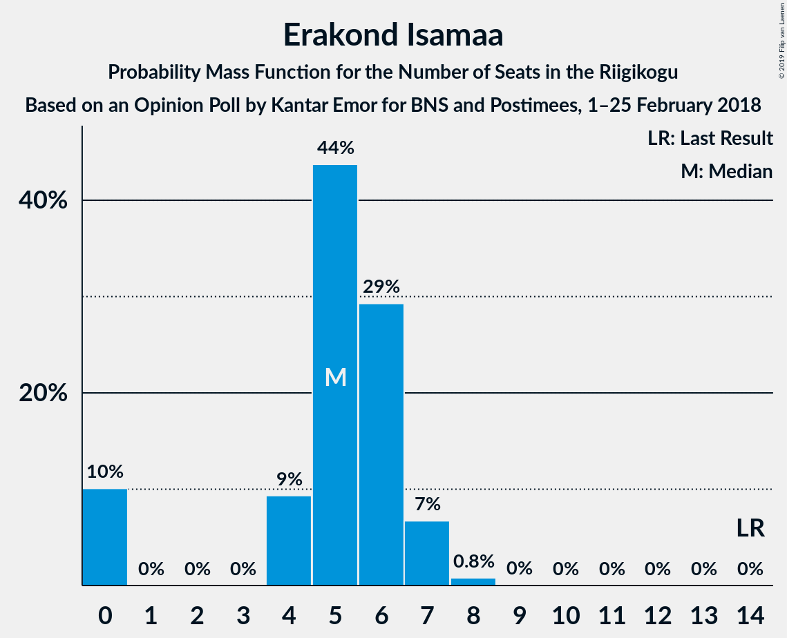
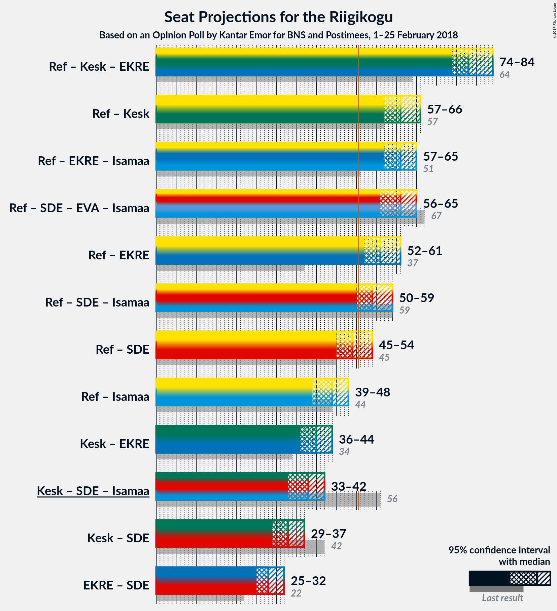
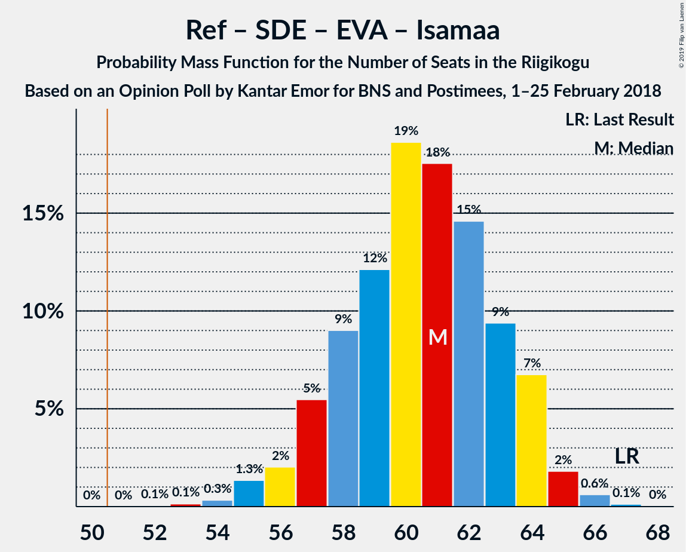

# Opinion Poll by Kantar Emor for BNS and Postimees, 1–25 February 2018

<a href="#voting-intentions">Voting Intentions</a> | <a href="#seats">Seats</a> | <a href="#coalitions">Coalitions</a> | <a href="#technical-information">Technical Information</a>

## Voting Intentions

### Confidence Intervals

| Party | Last Result | Poll Result | 80% Confidence Interval | 90% Confidence Interval | 95% Confidence Interval | 99% Confidence Interval |
|:-----:|:-----------:|:-----------:|:-----------------------:|:-----------------------:|:-----------------------:|:-----------------------:|
| Eesti Reformierakond | 27.7% | 33.9% | 31.9–36.0% |31.3–36.6% |30.8–37.1% |29.9–38.1% |
| Eesti Keskerakond | 24.8% | 20.9% | 19.3–22.8% |18.8–23.3% |18.4–23.8% |17.6–24.7% |
| Eesti Konservatiivne Rahvaerakond | 8.1% | 16.9% | 15.4–18.7% |15.0–19.1% |14.6–19.6% |13.9–20.4% |
| Sotsiaaldemokraatlik Erakond | 15.2% | 11.0% | 9.7–12.5% |9.4–12.9% |9.1–13.2% |8.5–14.0% |
| Eesti Vabaerakond | 8.7% | 7.0% | 6.0–8.2% |5.7–8.6% |5.5–8.9% |5.0–9.5% |
| Erakond Isamaa | 13.7% | 5.9% | 5.0–7.1% |4.8–7.4% |4.6–7.7% |4.2–8.3% |
| Erakond Eestimaa Rohelised | 0.9% | 4.0% | 3.3–5.0% |3.1–5.3% |2.9–5.5% |2.6–6.0% |

*Note:* The poll result column reflects the actual value used in the calculations. Published results may vary slightly, and in addition be rounded to fewer digits.

## Seats

### Confidence Intervals

| Party | Last Result | Median | 80% Confidence Interval | 90% Confidence Interval | 95% Confidence Interval | 99% Confidence Interval |
|:-----:|:-----------:|:------:|:-----------------------:|:-----------------------:|:-----------------------:|:-----------------------:|
| <a href="#eesti-reformierakond">Eesti Reformierakond</a> | 30 | 36 | 35–36 |35–37 |34–42 |33–43 |
| <a href="#eesti-keskerakond">Eesti Keskerakond</a> | 27 | 25 | 21–26 |21–26 |19–26 |18–26 |
| <a href="#eesti-konservatiivne-rahvaerakond">Eesti Konservatiivne Rahvaerakond</a> | 7 | 16 | 14–17 |14–18 |14–19 |14–21 |
| <a href="#sotsiaaldemokraatlik-erakond">Sotsiaaldemokraatlik Erakond</a> | 15 | 12 | 12–13 |11–13 |8–13 |7–16 |
| <a href="#eesti-vabaerakond">Eesti Vabaerakond</a> | 8 | 7 | 6–9 |6–9 |6–9 |6–9 |
| <a href="#erakond-isamaa">Erakond Isamaa</a> | 14 | 0 | 0–5 |0–6 |0–6 |0–7 |
| <a href="#erakond-eestimaa-rohelised">Erakond Eestimaa Rohelised</a> | 0 | 5 | 4–5 |0–5 |0–5 |0–5 |

### Eesti Reformierakond

*For a full overview of the results for this party, see the [Eesti Reformierakond](party-eestireformierakond.html) page.*

| Number of Seats | Probability | Accumulated | Special Marks |
|:---------------:|:-----------:|:-----------:|:-------------:|
| 30 | 0% | 100% | Last Result |
| 31 | 0% | 100% |  |
| 32 | 0.4% | 100% |  |
| 33 | 1.3% | 99.6% |  |
| 34 | 0.8% | 98% |  |
| 35 | 32% | 97% |  |
| 36 | 60% | 66% | Median |
| 37 | 2% | 6% |  |
| 38 | 0% | 4% |  |
| 39 | 0.1% | 4% |  |
| 40 | 1.1% | 4% |  |
| 41 | 0% | 3% |  |
| 42 | 2% | 3% |  |
| 43 | 0.4% | 0.5% |  |
| 44 | 0.1% | 0.2% |  |
| 45 | 0% | 0% |  |

### Eesti Keskerakond

*For a full overview of the results for this party, see the [Eesti Keskerakond](party-eestikeskerakond.html) page.*

| Number of Seats | Probability | Accumulated | Special Marks |
|:---------------:|:-----------:|:-----------:|:-------------:|
| 18 | 0.5% | 100% |  |
| 19 | 3% | 99.5% |  |
| 20 | 1.4% | 97% |  |
| 21 | 20% | 95% |  |
| 22 | 0.1% | 76% |  |
| 23 | 2% | 75% |  |
| 24 | 2% | 74% |  |
| 25 | 60% | 71% | Median |
| 26 | 11% | 11% |  |
| 27 | 0.1% | 0.1% | Last Result |
| 28 | 0% | 0% |  |

### Eesti Konservatiivne Rahvaerakond

*For a full overview of the results for this party, see the [Eesti Konservatiivne Rahvaerakond](party-eestikonservatiivnerahvaerakond.html) page.*

| Number of Seats | Probability | Accumulated | Special Marks |
|:---------------:|:-----------:|:-----------:|:-------------:|
| 7 | 0% | 100% | Last Result |
| 8 | 0% | 100% |  |
| 9 | 0% | 100% |  |
| 10 | 0% | 100% |  |
| 11 | 0% | 100% |  |
| 12 | 0% | 100% |  |
| 13 | 0.2% | 100% |  |
| 14 | 19% | 99.8% |  |
| 15 | 2% | 80% |  |
| 16 | 61% | 79% | Median |
| 17 | 11% | 18% |  |
| 18 | 2% | 6% |  |
| 19 | 3% | 5% |  |
| 20 | 0.1% | 1.3% |  |
| 21 | 1.1% | 1.3% |  |
| 22 | 0.1% | 0.1% |  |
| 23 | 0% | 0% |  |

### Sotsiaaldemokraatlik Erakond

*For a full overview of the results for this party, see the [Sotsiaaldemokraatlik Erakond](party-sotsiaaldemokraatlikerakond.html) page.*

| Number of Seats | Probability | Accumulated | Special Marks |
|:---------------:|:-----------:|:-----------:|:-------------:|
| 7 | 1.1% | 100% |  |
| 8 | 2% | 98.8% |  |
| 9 | 0.5% | 97% |  |
| 10 | 0.4% | 96% |  |
| 11 | 1.4% | 96% |  |
| 12 | 70% | 94% | Median |
| 13 | 23% | 24% |  |
| 14 | 0.2% | 1.2% |  |
| 15 | 0% | 1.1% | Last Result |
| 16 | 0.9% | 1.0% |  |
| 17 | 0.1% | 0.1% |  |
| 18 | 0% | 0% |  |

### Eesti Vabaerakond

*For a full overview of the results for this party, see the [Eesti Vabaerakond](party-eestivabaerakond.html) page.*

| Number of Seats | Probability | Accumulated | Special Marks |
|:---------------:|:-----------:|:-----------:|:-------------:|
| 0 | 0.1% | 100% |  |
| 1 | 0% | 99.9% |  |
| 2 | 0% | 99.9% |  |
| 3 | 0% | 99.9% |  |
| 4 | 0.1% | 99.9% |  |
| 5 | 0.1% | 99.8% |  |
| 6 | 12% | 99.8% |  |
| 7 | 62% | 88% | Median |
| 8 | 6% | 26% | Last Result |
| 9 | 20% | 20% |  |
| 10 | 0% | 0% |  |

### Erakond Isamaa

*For a full overview of the results for this party, see the [Erakond Isamaa](party-erakondisamaa.html) page.*

| Number of Seats | Probability | Accumulated | Special Marks |
|:---------------:|:-----------:|:-----------:|:-------------:|
| 0 | 71% | 100% | Median |
| 1 | 0% | 29% |  |
| 2 | 0% | 29% |  |
| 3 | 0% | 29% |  |
| 4 | 0% | 29% |  |
| 5 | 23% | 29% |  |
| 6 | 5% | 6% |  |
| 7 | 0.5% | 0.6% |  |
| 8 | 0.1% | 0.1% |  |
| 9 | 0% | 0% |  |
| 10 | 0% | 0% |  |
| 11 | 0% | 0% |  |
| 12 | 0% | 0% |  |
| 13 | 0% | 0% |  |
| 14 | 0% | 0% | Last Result |

### Erakond Eestimaa Rohelised

*For a full overview of the results for this party, see the [Erakond Eestimaa Rohelised](party-erakondeestimaarohelised.html) page.*

| Number of Seats | Probability | Accumulated | Special Marks |
|:---------------:|:-----------:|:-----------:|:-------------:|
| 0 | 9% | 100% | Last Result |
| 1 | 0% | 91% |  |
| 2 | 0% | 91% |  |
| 3 | 0% | 91% |  |
| 4 | 20% | 91% |  |
| 5 | 71% | 71% | Median |
| 6 | 0% | 0.1% |  |
| 7 | 0.1% | 0.1% |  |
| 8 | 0% | 0% |  |

## Coalitions

### Confidence Intervals

| Coalition | Last Result | Median | Majority? | 80% Confidence Interval | 90% Confidence Interval | 95% Confidence Interval | 99% Confidence Interval |
|:---------:|:-----------:|:------:|:---------:|:-----------------------:|:-----------------------:|:-----------------------:|:-----------------------:|
| Eesti Reformierakond – Eesti Keskerakond – Eesti Konservatiivne Rahvaerakond | 64 | 77 | 100% | 70–78 | 70–78 | 70–80 | 70–81 |
| Eesti Reformierakond – Eesti Konservatiivne Rahvaerakond – Erakond Isamaa | 51 | 52 | 100% | 52–54 | 52–58 | 52–66 | 52–67 |
| Eesti Reformierakond – Sotsiaaldemokraatlik Erakond – Eesti Vabaerakond – Erakond Isamaa | 67 | 55 | 100% | 53–62 | 53–62 | 53–63 | 53–65 |
| Eesti Reformierakond – Eesti Keskerakond | 57 | 61 | 100% | 56–61 | 56–61 | 56–61 | 55–61 |
| Eesti Reformierakond – Eesti Konservatiivne Rahvaerakond | 37 | 52 | 80% | 49–52 | 49–52 | 49–61 | 49–61 |
| Eesti Reformierakond – Sotsiaaldemokraatlik Erakond – Erakond Isamaa | 59 | 48 | 27% | 47–53 | 47–54 | 47–55 | 47–57 |
| Eesti Reformierakond – Sotsiaaldemokraatlik Erakond | 45 | 48 | 2% | 47–48 | 47–50 | 46–50 | 44–52 |
| Eesti Reformierakond – Erakond Isamaa | 44 | 36 | 0.1% | 35–40 | 35–41 | 35–47 | 35–47 |
| Eesti Keskerakond – Eesti Konservatiivne Rahvaerakond | 34 | 41 | 0% | 35–43 | 35–43 | 35–43 | 35–44 |
| Eesti Keskerakond – Sotsiaaldemokraatlik Erakond – Erakond Isamaa | 56 | 37 | 0% | 37–39 | 37–40 | 32–42 | 32–42 |
| Eesti Keskerakond – Sotsiaaldemokraatlik Erakond | 42 | 37 | 0% | 34–38 | 34–38 | 27–38 | 27–38 |
| Eesti Konservatiivne Rahvaerakond – Sotsiaaldemokraatlik Erakond | 22 | 28 | 0% | 27–29 | 27–29 | 27–29 | 27–35 |

### Eesti Reformierakond – Eesti Keskerakond – Eesti Konservatiivne Rahvaerakond

| Number of Seats | Probability | Accumulated | Special Marks |
|:---------------:|:-----------:|:-----------:|:-------------:|
| 64 | 0% | 100% | Last Result |
| 65 | 0% | 100% |  |
| 66 | 0% | 100% |  |
| 67 | 0% | 100% |  |
| 68 | 0% | 100% |  |
| 69 | 0.2% | 100% |  |
| 70 | 19% | 99.8% |  |
| 71 | 0.1% | 80% |  |
| 72 | 0% | 80% |  |
| 73 | 0.2% | 80% |  |
| 74 | 3% | 80% |  |
| 75 | 0.7% | 77% |  |
| 76 | 3% | 77% |  |
| 77 | 59% | 74% | Median |
| 78 | 11% | 15% |  |
| 79 | 0.5% | 4% |  |
| 80 | 2% | 4% |  |
| 81 | 1.2% | 1.4% |  |
| 82 | 0% | 0.2% |  |
| 83 | 0% | 0.1% |  |
| 84 | 0% | 0.1% |  |
| 85 | 0.1% | 0.1% |  |
| 86 | 0% | 0% |  |

### Eesti Reformierakond – Eesti Konservatiivne Rahvaerakond – Erakond Isamaa

| Number of Seats | Probability | Accumulated | Special Marks |
|:---------------:|:-----------:|:-----------:|:-------------:|
| 51 | 0% | 100% | Last Result, Majority |
| 52 | 71% | 100% | Median |
| 53 | 0% | 29% |  |
| 54 | 20% | 29% |  |
| 55 | 0% | 9% |  |
| 56 | 0% | 9% |  |
| 57 | 4% | 9% |  |
| 58 | 0.5% | 5% |  |
| 59 | 0% | 5% |  |
| 60 | 0.9% | 5% |  |
| 61 | 0.1% | 4% |  |
| 62 | 0% | 4% |  |
| 63 | 0% | 4% |  |
| 64 | 0% | 4% |  |
| 65 | 0% | 4% |  |
| 66 | 3% | 4% |  |
| 67 | 1.2% | 1.3% |  |
| 68 | 0.1% | 0.1% |  |
| 69 | 0% | 0% |  |

### Eesti Reformierakond – Sotsiaaldemokraatlik Erakond – Eesti Vabaerakond – Erakond Isamaa

| Number of Seats | Probability | Accumulated | Special Marks |
|:---------------:|:-----------:|:-----------:|:-------------:|
| 51 | 0% | 100% | Majority |
| 52 | 0% | 99.9% |  |
| 53 | 11% | 99.9% |  |
| 54 | 0% | 89% |  |
| 55 | 59% | 89% | Median |
| 56 | 0.4% | 30% |  |
| 57 | 2% | 30% |  |
| 58 | 1.4% | 28% |  |
| 59 | 0% | 27% |  |
| 60 | 2% | 27% |  |
| 61 | 0% | 25% |  |
| 62 | 21% | 25% |  |
| 63 | 3% | 4% |  |
| 64 | 0.3% | 0.8% |  |
| 65 | 0.5% | 0.5% |  |
| 66 | 0% | 0% |  |
| 67 | 0% | 0% | Last Result |

### Eesti Reformierakond – Eesti Keskerakond

| Number of Seats | Probability | Accumulated | Special Marks |
|:---------------:|:-----------:|:-----------:|:-------------:|
| 54 | 0.1% | 100% |  |
| 55 | 0.9% | 99.9% |  |
| 56 | 20% | 99.0% |  |
| 57 | 0% | 79% | Last Result |
| 58 | 4% | 79% |  |
| 59 | 0.1% | 75% |  |
| 60 | 1.2% | 75% |  |
| 61 | 74% | 74% | Median |
| 62 | 0% | 0.3% |  |
| 63 | 0% | 0.2% |  |
| 64 | 0% | 0.2% |  |
| 65 | 0.1% | 0.2% |  |
| 66 | 0% | 0.1% |  |
| 67 | 0% | 0.1% |  |
| 68 | 0% | 0% |  |

### Eesti Reformierakond – Eesti Konservatiivne Rahvaerakond

| Number of Seats | Probability | Accumulated | Special Marks |
|:---------------:|:-----------:|:-----------:|:-------------:|
| 37 | 0% | 100% | Last Result |
| 38 | 0% | 100% |  |
| 39 | 0% | 100% |  |
| 40 | 0% | 100% |  |
| 41 | 0% | 100% |  |
| 42 | 0% | 100% |  |
| 43 | 0% | 100% |  |
| 44 | 0% | 100% |  |
| 45 | 0% | 100% |  |
| 46 | 0% | 100% |  |
| 47 | 0.1% | 100% |  |
| 48 | 0% | 99.9% |  |
| 49 | 20% | 99.9% |  |
| 50 | 0% | 80% |  |
| 51 | 4% | 80% | Majority |
| 52 | 71% | 76% | Median |
| 53 | 0% | 5% |  |
| 54 | 0% | 5% |  |
| 55 | 0.9% | 5% |  |
| 56 | 0% | 4% |  |
| 57 | 0% | 4% |  |
| 58 | 0% | 4% |  |
| 59 | 0% | 4% |  |
| 60 | 0.1% | 4% |  |
| 61 | 4% | 4% |  |
| 62 | 0% | 0.1% |  |
| 63 | 0% | 0.1% |  |
| 64 | 0% | 0% |  |

### Eesti Reformierakond – Sotsiaaldemokraatlik Erakond – Erakond Isamaa

| Number of Seats | Probability | Accumulated | Special Marks |
|:---------------:|:-----------:|:-----------:|:-------------:|
| 45 | 0.1% | 100% |  |
| 46 | 0% | 99.9% |  |
| 47 | 11% | 99.9% |  |
| 48 | 59% | 89% | Median |
| 49 | 0.3% | 30% |  |
| 50 | 3% | 30% |  |
| 51 | 0.1% | 27% | Majority |
| 52 | 0.7% | 27% |  |
| 53 | 21% | 26% |  |
| 54 | 2% | 6% |  |
| 55 | 2% | 4% |  |
| 56 | 0% | 1.4% |  |
| 57 | 1.2% | 1.4% |  |
| 58 | 0% | 0.3% |  |
| 59 | 0.1% | 0.2% | Last Result |
| 60 | 0.1% | 0.1% |  |
| 61 | 0% | 0% |  |

### Eesti Reformierakond – Sotsiaaldemokraatlik Erakond

| Number of Seats | Probability | Accumulated | Special Marks |
|:---------------:|:-----------:|:-----------:|:-------------:|
| 42 | 0.3% | 100% |  |
| 43 | 0.1% | 99.6% |  |
| 44 | 1.3% | 99.5% |  |
| 45 | 0.1% | 98% | Last Result |
| 46 | 0.7% | 98% |  |
| 47 | 12% | 97% |  |
| 48 | 80% | 86% | Median |
| 49 | 0.1% | 6% |  |
| 50 | 4% | 5% |  |
| 51 | 0% | 2% | Majority |
| 52 | 1.3% | 2% |  |
| 53 | 0% | 0.3% |  |
| 54 | 0.1% | 0.2% |  |
| 55 | 0.1% | 0.1% |  |
| 56 | 0% | 0% |  |

### Eesti Reformierakond – Erakond Isamaa

| Number of Seats | Probability | Accumulated | Special Marks |
|:---------------:|:-----------:|:-----------:|:-------------:|
| 34 | 0% | 100% |  |
| 35 | 11% | 99.9% |  |
| 36 | 59% | 89% | Median |
| 37 | 2% | 30% |  |
| 38 | 0% | 29% |  |
| 39 | 2% | 29% |  |
| 40 | 20% | 27% |  |
| 41 | 3% | 7% |  |
| 42 | 0.2% | 4% |  |
| 43 | 0% | 4% |  |
| 44 | 0% | 4% | Last Result |
| 45 | 0% | 4% |  |
| 46 | 1.1% | 4% |  |
| 47 | 2% | 3% |  |
| 48 | 0.4% | 0.5% |  |
| 49 | 0% | 0.1% |  |
| 50 | 0% | 0.1% |  |
| 51 | 0% | 0.1% | Majority |
| 52 | 0.1% | 0.1% |  |
| 53 | 0% | 0% |  |

### Eesti Keskerakond – Eesti Konservatiivne Rahvaerakond

| Number of Seats | Probability | Accumulated | Special Marks |
|:---------------:|:-----------:|:-----------:|:-------------:|
| 33 | 0.2% | 100% |  |
| 34 | 0% | 99.8% | Last Result |
| 35 | 19% | 99.8% |  |
| 36 | 0.5% | 80% |  |
| 37 | 0.2% | 80% |  |
| 38 | 3% | 80% |  |
| 39 | 3% | 77% |  |
| 40 | 0% | 73% |  |
| 41 | 61% | 73% | Median |
| 42 | 0% | 13% |  |
| 43 | 12% | 12% |  |
| 44 | 0% | 0.5% |  |
| 45 | 0.4% | 0.5% |  |
| 46 | 0% | 0.1% |  |
| 47 | 0% | 0% |  |

### Eesti Keskerakond – Sotsiaaldemokraatlik Erakond – Erakond Isamaa

| Number of Seats | Probability | Accumulated | Special Marks |
|:---------------:|:-----------:|:-----------:|:-------------:|
| 31 | 0% | 100% |  |
| 32 | 3% | 99.9% |  |
| 33 | 1.2% | 97% |  |
| 34 | 0% | 96% |  |
| 35 | 0% | 96% |  |
| 36 | 0.1% | 96% |  |
| 37 | 61% | 96% | Median |
| 38 | 11% | 36% |  |
| 39 | 20% | 25% |  |
| 40 | 1.0% | 5% |  |
| 41 | 0.1% | 4% |  |
| 42 | 4% | 4% |  |
| 43 | 0.3% | 0.4% |  |
| 44 | 0% | 0.1% |  |
| 45 | 0% | 0.1% |  |
| 46 | 0% | 0.1% |  |
| 47 | 0% | 0.1% |  |
| 48 | 0% | 0% |  |
| 49 | 0% | 0% |  |
| 50 | 0% | 0% |  |
| 51 | 0% | 0% | Majority |
| 52 | 0% | 0% |  |
| 53 | 0% | 0% |  |
| 54 | 0% | 0% |  |
| 55 | 0% | 0% |  |
| 56 | 0% | 0% | Last Result |

### Eesti Keskerakond – Sotsiaaldemokraatlik Erakond

| Number of Seats | Probability | Accumulated | Special Marks |
|:---------------:|:-----------:|:-----------:|:-------------:|
| 27 | 4% | 100% |  |
| 28 | 0% | 96% |  |
| 29 | 0.2% | 96% |  |
| 30 | 0% | 96% |  |
| 31 | 0% | 96% |  |
| 32 | 0% | 96% |  |
| 33 | 0% | 96% |  |
| 34 | 20% | 96% |  |
| 35 | 1.0% | 76% |  |
| 36 | 4% | 75% |  |
| 37 | 61% | 71% | Median |
| 38 | 11% | 11% |  |
| 39 | 0% | 0.1% |  |
| 40 | 0% | 0.1% |  |
| 41 | 0% | 0.1% |  |
| 42 | 0% | 0.1% | Last Result |
| 43 | 0% | 0% |  |

### Eesti Konservatiivne Rahvaerakond – Sotsiaaldemokraatlik Erakond

| Number of Seats | Probability | Accumulated | Special Marks |
|:---------------:|:-----------:|:-----------:|:-------------:|
| 22 | 0% | 100% | Last Result |
| 23 | 0% | 100% |  |
| 24 | 0.1% | 100% |  |
| 25 | 0% | 99.9% |  |
| 26 | 0.1% | 99.9% |  |
| 27 | 22% | 99.8% |  |
| 28 | 62% | 78% | Median |
| 29 | 15% | 16% |  |
| 30 | 0% | 1.1% |  |
| 31 | 0% | 1.1% |  |
| 32 | 0% | 1.1% |  |
| 33 | 0% | 1.1% |  |
| 34 | 0% | 1.1% |  |
| 35 | 1.0% | 1.0% |  |
| 36 | 0% | 0.1% |  |
| 37 | 0% | 0% |  |

## Technical Information

### Opinion Poll

+ **Polling firm:** Kantar Emor
+ **Commissioner(s):** BNS and Postimees
+ **Fieldwork period:** 1–25 February 2018

### Calculations

+ **Sample size:** 874
+ **Simulations done:** 1,024
+ **Error estimate:** 3.03%

