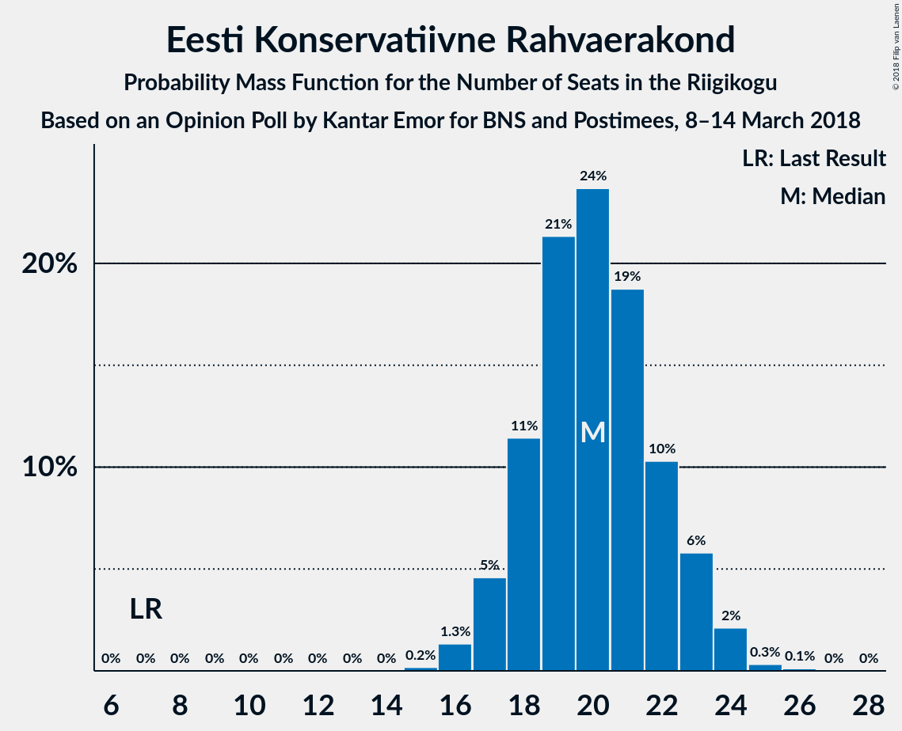
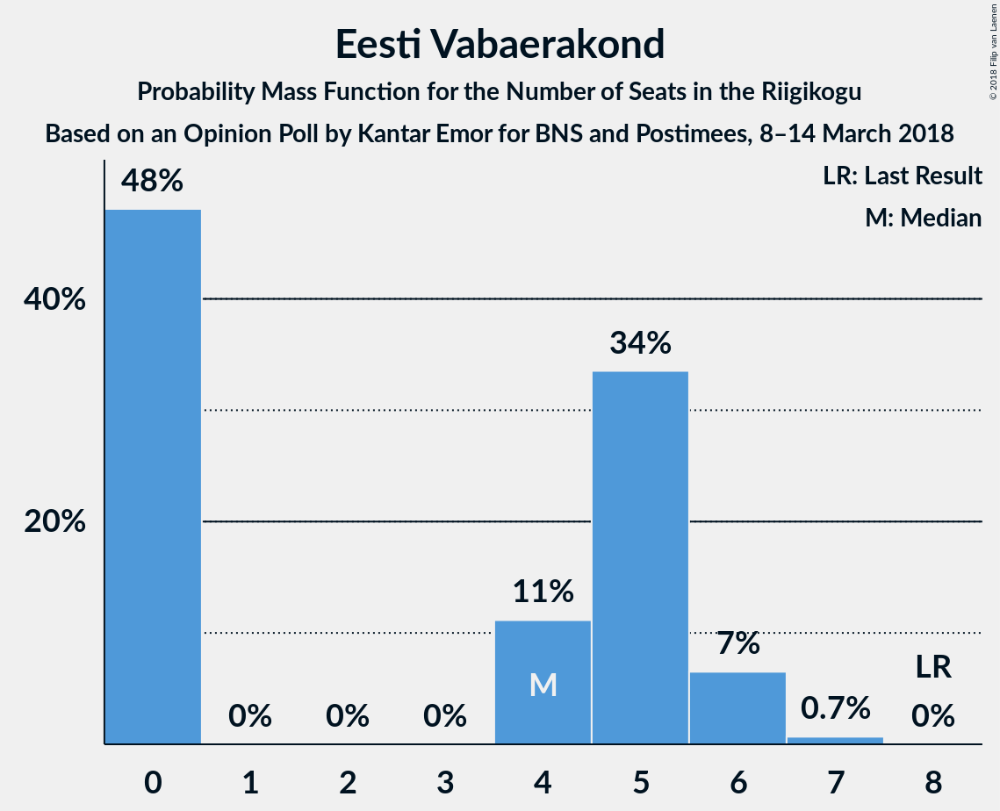

# Opinion Poll by Kantar Emor for BNS and Postimees, 8–14 March 2018

<a href="#voting-intentions">Voting Intentions</a> | <a href="#seats">Seats</a> | <a href="#coalitions">Coalitions</a> | <a href="#technical-information">Technical Information</a>

## Voting Intentions

### Confidence Intervals

| Party | Last Result | Poll Result | 80% Confidence Interval | 90% Confidence Interval | 95% Confidence Interval | 99% Confidence Interval |
|:-----:|:-----------:|:-----------:|:-----------------------:|:-----------------------:|:-----------------------:|:-----------------------:|
| Eesti Reformierakond | 27.7% | 34.1% | 32.2–36.2% |31.6–36.8% |31.1–37.3% |30.2–38.3% |
| Eesti Keskerakond | 24.8% | 23.8% | 22.1–25.7% |21.6–26.2% |21.1–26.7% |20.3–27.6% |
| Eesti Konservatiivne Rahvaerakond | 8.1% | 18.4% | 16.8–20.1% |16.3–20.6% |16.0–21.0% |15.2–21.9% |
| Sotsiaaldemokraatlik Erakond | 15.2% | 10.6% | 9.4–12.0% |9.0–12.4% |8.7–12.8% |8.2–13.5% |
| Eesti Vabaerakond | 8.7% | 5.0% | 4.2–6.1% |3.9–6.4% |3.8–6.6% |3.4–7.2% |
| Erakond Isamaa | 13.7% | 4.1% | 3.4–5.1% |3.2–5.4% |3.0–5.6% |2.7–6.1% |
| Erakond Eestimaa Rohelised | 0.9% | 3.6% | 2.9–4.5% |2.7–4.8% |2.5–5.0% |2.2–5.5% |

*Note:* The poll result column reflects the actual value used in the calculations. Published results may vary slightly, and in addition be rounded to fewer digits.

## Seats

### Confidence Intervals

| Party | Last Result | Median | 80% Confidence Interval | 90% Confidence Interval | 95% Confidence Interval | 99% Confidence Interval |
|:-----:|:-----------:|:------:|:-----------------------:|:-----------------------:|:-----------------------:|:-----------------------:|
| <a href="#eesti-reformierakond">Eesti Reformierakond</a> | 30 | 40 | 37–44 |36–45 |36–45 |35–46 |
| <a href="#eesti-keskerakond">Eesti Keskerakond</a> | 27 | 27 | 24–29 |24–30 |23–31 |22–32 |
| <a href="#eesti-konservatiivne-rahvaerakond">Eesti Konservatiivne Rahvaerakond</a> | 7 | 20 | 18–22 |17–23 |17–23 |16–25 |
| <a href="#sotsiaaldemokraatlik-erakond">Sotsiaaldemokraatlik Erakond</a> | 15 | 11 | 9–12 |9–13 |8–13 |8–14 |
| <a href="#eesti-vabaerakond">Eesti Vabaerakond</a> | 8 | 0 | 0–5 |0–6 |0–6 |0–7 |
| <a href="#erakond-isamaa">Erakond Isamaa</a> | 14 | 0 | 0–4 |0–5 |0–5 |0–5 |
| <a href="#erakond-eestimaa-rohelised">Erakond Eestimaa Rohelised</a> | 0 | 0 | 0 |0 |0 |0–5 |

### Eesti Reformierakond

*For a full overview of the results for this party, see the [Eesti Reformierakond](party-eestireformierakond.html) page.*

| Number of Seats | Probability | Accumulated | Special Marks |
|:---------------:|:-----------:|:-----------:|:-------------:|
| 30 | 0% | 100% | Last Result |
| 31 | 0% | 100% |  |
| 32 | 0% | 100% |  |
| 33 | 0.1% | 100% |  |
| 34 | 0.3% | 99.8% |  |
| 35 | 1.3% | 99.5% |  |
| 36 | 3% | 98% |  |
| 37 | 6% | 95% |  |
| 38 | 10% | 89% |  |
| 39 | 11% | 79% |  |
| 40 | 18% | 68% | Median |
| 41 | 16% | 49% |  |
| 42 | 8% | 33% |  |
| 43 | 12% | 25% |  |
| 44 | 8% | 13% |  |
| 45 | 3% | 6% |  |
| 46 | 2% | 2% |  |
| 47 | 0.3% | 0.3% |  |
| 48 | 0% | 0% |  |

### Eesti Keskerakond

*For a full overview of the results for this party, see the [Eesti Keskerakond](party-eestikeskerakond.html) page.*

| Number of Seats | Probability | Accumulated | Special Marks |
|:---------------:|:-----------:|:-----------:|:-------------:|
| 21 | 0.2% | 100% |  |
| 22 | 1.3% | 99.8% |  |
| 23 | 2% | 98.6% |  |
| 24 | 11% | 97% |  |
| 25 | 11% | 86% |  |
| 26 | 16% | 75% |  |
| 27 | 22% | 59% | Last Result, Median |
| 28 | 21% | 37% |  |
| 29 | 7% | 16% |  |
| 30 | 6% | 9% |  |
| 31 | 2% | 3% |  |
| 32 | 0.6% | 1.0% |  |
| 33 | 0.3% | 0.4% |  |
| 34 | 0.1% | 0.1% |  |
| 35 | 0% | 0% |  |

### Eesti Konservatiivne Rahvaerakond

*For a full overview of the results for this party, see the [Eesti Konservatiivne Rahvaerakond](party-eestikonservatiivnerahvaerakond.html) page.*

| Number of Seats | Probability | Accumulated | Special Marks |
|:---------------:|:-----------:|:-----------:|:-------------:|
| 7 | 0% | 100% | Last Result |
| 8 | 0% | 100% |  |
| 9 | 0% | 100% |  |
| 10 | 0% | 100% |  |
| 11 | 0% | 100% |  |
| 12 | 0% | 100% |  |
| 13 | 0% | 100% |  |
| 14 | 0% | 100% |  |
| 15 | 0.2% | 100% |  |
| 16 | 2% | 99.8% |  |
| 17 | 4% | 98% |  |
| 18 | 9% | 94% |  |
| 19 | 16% | 85% |  |
| 20 | 33% | 69% | Median |
| 21 | 14% | 36% |  |
| 22 | 14% | 22% |  |
| 23 | 7% | 8% |  |
| 24 | 1.2% | 2% |  |
| 25 | 0.4% | 0.6% |  |
| 26 | 0.2% | 0.2% |  |
| 27 | 0% | 0% |  |

### Sotsiaaldemokraatlik Erakond

*For a full overview of the results for this party, see the [Sotsiaaldemokraatlik Erakond](party-sotsiaaldemokraatlikerakond.html) page.*

| Number of Seats | Probability | Accumulated | Special Marks |
|:---------------:|:-----------:|:-----------:|:-------------:|
| 7 | 0.2% | 100% |  |
| 8 | 4% | 99.8% |  |
| 9 | 15% | 96% |  |
| 10 | 29% | 81% |  |
| 11 | 26% | 52% | Median |
| 12 | 17% | 26% |  |
| 13 | 6% | 9% |  |
| 14 | 2% | 2% |  |
| 15 | 0.5% | 0.5% | Last Result |
| 16 | 0% | 0% |  |

### Eesti Vabaerakond

*For a full overview of the results for this party, see the [Eesti Vabaerakond](party-eestivabaerakond.html) page.*

| Number of Seats | Probability | Accumulated | Special Marks |
|:---------------:|:-----------:|:-----------:|:-------------:|
| 0 | 58% | 100% | Median |
| 1 | 0% | 42% |  |
| 2 | 0% | 42% |  |
| 3 | 0% | 42% |  |
| 4 | 5% | 42% |  |
| 5 | 29% | 37% |  |
| 6 | 7% | 8% |  |
| 7 | 1.0% | 1.0% |  |
| 8 | 0% | 0% | Last Result |

### Erakond Isamaa

*For a full overview of the results for this party, see the [Erakond Isamaa](party-erakondisamaa.html) page.*

| Number of Seats | Probability | Accumulated | Special Marks |
|:---------------:|:-----------:|:-----------:|:-------------:|
| 0 | 88% | 100% | Median |
| 1 | 0% | 12% |  |
| 2 | 0% | 12% |  |
| 3 | 0% | 12% |  |
| 4 | 4% | 12% |  |
| 5 | 7% | 8% |  |
| 6 | 0.4% | 0.4% |  |
| 7 | 0% | 0% |  |
| 8 | 0% | 0% |  |
| 9 | 0% | 0% |  |
| 10 | 0% | 0% |  |
| 11 | 0% | 0% |  |
| 12 | 0% | 0% |  |
| 13 | 0% | 0% |  |
| 14 | 0% | 0% | Last Result |

### Erakond Eestimaa Rohelised

*For a full overview of the results for this party, see the [Erakond Eestimaa Rohelised](party-erakondeestimaarohelised.html) page.*

| Number of Seats | Probability | Accumulated | Special Marks |
|:---------------:|:-----------:|:-----------:|:-------------:|
| 0 | 98% | 100% | Last Result, Median |
| 1 | 0% | 2% |  |
| 2 | 0% | 2% |  |
| 3 | 0% | 2% |  |
| 4 | 1.4% | 2% |  |
| 5 | 0.8% | 0.8% |  |
| 6 | 0% | 0% |  |

## Coalitions

### Confidence Intervals

| Coalition | Last Result | Median | Majority? | 80% Confidence Interval | 90% Confidence Interval | 95% Confidence Interval | 99% Confidence Interval |
|:---------:|:-----------:|:------:|:---------:|:-----------------------:|:-----------------------:|:-----------------------:|:-----------------------:|
| Eesti Reformierakond – Eesti Keskerakond – Eesti Konservatiivne Rahvaerakond | 64 | 88 | 100% | 84–91 | 83–92 | 81–92 | 80–93 |
| Eesti Reformierakond – Eesti Keskerakond | 57 | 68 | 100% | 64–71 | 63–71 | 62–72 | 60–72 |
| Eesti Reformierakond – Eesti Konservatiivne Rahvaerakond – Erakond Isamaa | 51 | 61 | 100% | 58–65 | 56–66 | 56–66 | 54–68 |
| Eesti Reformierakond – Eesti Konservatiivne Rahvaerakond | 37 | 61 | 100% | 57–64 | 56–66 | 55–66 | 53–67 |
| Eesti Reformierakond – Sotsiaaldemokraatlik Erakond – Eesti Vabaerakond – Erakond Isamaa | 67 | 54 | 91% | 51–57 | 50–58 | 49–58 | 48–60 |
| Eesti Reformierakond – Sotsiaaldemokraatlik Erakond – Erakond Isamaa | 59 | 52 | 64% | 49–56 | 47–56 | 47–57 | 45–58 |
| Eesti Reformierakond – Sotsiaaldemokraatlik Erakond | 45 | 51 | 59% | 48–54 | 47–56 | 46–57 | 45–57 |
| Eesti Keskerakond – Eesti Konservatiivne Rahvaerakond | 34 | 47 | 9% | 44–50 | 43–51 | 42–52 | 41–53 |
| Eesti Reformierakond – Erakond Isamaa | 44 | 41 | 0% | 38–45 | 37–45 | 36–47 | 35–48 |
| Eesti Keskerakond – Sotsiaaldemokraatlik Erakond – Erakond Isamaa | 56 | 38 | 0% | 35–41 | 34–42 | 33–43 | 33–45 |
| Eesti Keskerakond – Sotsiaaldemokraatlik Erakond | 42 | 37 | 0% | 35–41 | 34–41 | 33–42 | 32–43 |
| Eesti Konservatiivne Rahvaerakond – Sotsiaaldemokraatlik Erakond | 22 | 31 | 0% | 28–33 | 27–34 | 27–34 | 26–36 |

### Eesti Reformierakond – Eesti Keskerakond – Eesti Konservatiivne Rahvaerakond

| Number of Seats | Probability | Accumulated | Special Marks |
|:---------------:|:-----------:|:-----------:|:-------------:|
| 64 | 0% | 100% | Last Result |
| 65 | 0% | 100% |  |
| 66 | 0% | 100% |  |
| 67 | 0% | 100% |  |
| 68 | 0% | 100% |  |
| 69 | 0% | 100% |  |
| 70 | 0% | 100% |  |
| 71 | 0% | 100% |  |
| 72 | 0% | 100% |  |
| 73 | 0% | 100% |  |
| 74 | 0% | 100% |  |
| 75 | 0% | 100% |  |
| 76 | 0% | 100% |  |
| 77 | 0% | 100% |  |
| 78 | 0.1% | 100% |  |
| 79 | 0.3% | 99.9% |  |
| 80 | 0.8% | 99.6% |  |
| 81 | 2% | 98.8% |  |
| 82 | 2% | 97% |  |
| 83 | 3% | 96% |  |
| 84 | 8% | 92% |  |
| 85 | 12% | 85% |  |
| 86 | 16% | 73% |  |
| 87 | 6% | 57% | Median |
| 88 | 6% | 51% |  |
| 89 | 14% | 45% |  |
| 90 | 13% | 31% |  |
| 91 | 12% | 19% |  |
| 92 | 5% | 7% |  |
| 93 | 1.5% | 2% |  |
| 94 | 0% | 0% |  |

### Eesti Reformierakond – Eesti Keskerakond

| Number of Seats | Probability | Accumulated | Special Marks |
|:---------------:|:-----------:|:-----------:|:-------------:|
| 57 | 0% | 100% | Last Result |
| 58 | 0% | 100% |  |
| 59 | 0.3% | 99.9% |  |
| 60 | 0.6% | 99.7% |  |
| 61 | 0.7% | 99.1% |  |
| 62 | 2% | 98% |  |
| 63 | 5% | 97% |  |
| 64 | 9% | 92% |  |
| 65 | 12% | 83% |  |
| 66 | 7% | 71% |  |
| 67 | 13% | 64% | Median |
| 68 | 9% | 51% |  |
| 69 | 22% | 42% |  |
| 70 | 4% | 21% |  |
| 71 | 13% | 16% |  |
| 72 | 3% | 3% |  |
| 73 | 0.3% | 0.5% |  |
| 74 | 0.1% | 0.2% |  |
| 75 | 0.1% | 0.1% |  |
| 76 | 0% | 0% |  |

### Eesti Reformierakond – Eesti Konservatiivne Rahvaerakond – Erakond Isamaa

| Number of Seats | Probability | Accumulated | Special Marks |
|:---------------:|:-----------:|:-----------:|:-------------:|
| 51 | 0% | 100% | Last Result, Majority |
| 52 | 0% | 100% |  |
| 53 | 0.1% | 100% |  |
| 54 | 0.5% | 99.9% |  |
| 55 | 0.4% | 99.4% |  |
| 56 | 4% | 98.9% |  |
| 57 | 4% | 95% |  |
| 58 | 5% | 91% |  |
| 59 | 12% | 86% |  |
| 60 | 12% | 74% | Median |
| 61 | 20% | 62% |  |
| 62 | 9% | 42% |  |
| 63 | 8% | 32% |  |
| 64 | 11% | 25% |  |
| 65 | 4% | 14% |  |
| 66 | 9% | 10% |  |
| 67 | 0.2% | 0.8% |  |
| 68 | 0.5% | 0.6% |  |
| 69 | 0.1% | 0.1% |  |
| 70 | 0% | 0% |  |

### Eesti Reformierakond – Eesti Konservatiivne Rahvaerakond

| Number of Seats | Probability | Accumulated | Special Marks |
|:---------------:|:-----------:|:-----------:|:-------------:|
| 37 | 0% | 100% | Last Result |
| 38 | 0% | 100% |  |
| 39 | 0% | 100% |  |
| 40 | 0% | 100% |  |
| 41 | 0% | 100% |  |
| 42 | 0% | 100% |  |
| 43 | 0% | 100% |  |
| 44 | 0% | 100% |  |
| 45 | 0% | 100% |  |
| 46 | 0% | 100% |  |
| 47 | 0% | 100% |  |
| 48 | 0% | 100% |  |
| 49 | 0% | 100% |  |
| 50 | 0% | 100% |  |
| 51 | 0.1% | 100% | Majority |
| 52 | 0.1% | 99.9% |  |
| 53 | 0.4% | 99.9% |  |
| 54 | 0.9% | 99.5% |  |
| 55 | 1.5% | 98.6% |  |
| 56 | 6% | 97% |  |
| 57 | 5% | 91% |  |
| 58 | 5% | 86% |  |
| 59 | 12% | 81% |  |
| 60 | 13% | 68% | Median |
| 61 | 19% | 55% |  |
| 62 | 10% | 36% |  |
| 63 | 7% | 25% |  |
| 64 | 10% | 18% |  |
| 65 | 2% | 9% |  |
| 66 | 6% | 7% |  |
| 67 | 0.2% | 0.6% |  |
| 68 | 0.4% | 0.4% |  |
| 69 | 0% | 0% |  |

### Eesti Reformierakond – Sotsiaaldemokraatlik Erakond – Eesti Vabaerakond – Erakond Isamaa

| Number of Seats | Probability | Accumulated | Special Marks |
|:---------------:|:-----------:|:-----------:|:-------------:|
| 46 | 0.1% | 100% |  |
| 47 | 0.3% | 99.9% |  |
| 48 | 0.6% | 99.6% |  |
| 49 | 4% | 99.1% |  |
| 50 | 4% | 95% |  |
| 51 | 4% | 91% | Median, Majority |
| 52 | 13% | 87% |  |
| 53 | 19% | 74% |  |
| 54 | 15% | 55% |  |
| 55 | 15% | 41% |  |
| 56 | 10% | 25% |  |
| 57 | 8% | 15% |  |
| 58 | 4% | 7% |  |
| 59 | 1.4% | 2% |  |
| 60 | 0.6% | 1.0% |  |
| 61 | 0.3% | 0.4% |  |
| 62 | 0.1% | 0.1% |  |
| 63 | 0% | 0% |  |
| 64 | 0% | 0% |  |
| 65 | 0% | 0% |  |
| 66 | 0% | 0% |  |
| 67 | 0% | 0% | Last Result |

### Eesti Reformierakond – Sotsiaaldemokraatlik Erakond – Erakond Isamaa

| Number of Seats | Probability | Accumulated | Special Marks |
|:---------------:|:-----------:|:-----------:|:-------------:|
| 43 | 0% | 100% |  |
| 44 | 0.1% | 99.9% |  |
| 45 | 0.6% | 99.9% |  |
| 46 | 1.1% | 99.3% |  |
| 47 | 5% | 98% |  |
| 48 | 2% | 94% |  |
| 49 | 12% | 91% |  |
| 50 | 15% | 79% |  |
| 51 | 7% | 64% | Median, Majority |
| 52 | 13% | 57% |  |
| 53 | 21% | 44% |  |
| 54 | 9% | 23% |  |
| 55 | 3% | 14% |  |
| 56 | 7% | 11% |  |
| 57 | 3% | 4% |  |
| 58 | 0.4% | 0.7% |  |
| 59 | 0.1% | 0.3% | Last Result |
| 60 | 0.2% | 0.2% |  |
| 61 | 0% | 0% |  |

### Eesti Reformierakond – Sotsiaaldemokraatlik Erakond

| Number of Seats | Probability | Accumulated | Special Marks |
|:---------------:|:-----------:|:-----------:|:-------------:|
| 43 | 0.1% | 100% |  |
| 44 | 0.3% | 99.9% |  |
| 45 | 2% | 99.6% | Last Result |
| 46 | 2% | 98% |  |
| 47 | 6% | 96% |  |
| 48 | 3% | 90% |  |
| 49 | 13% | 88% |  |
| 50 | 16% | 74% |  |
| 51 | 9% | 59% | Median, Majority |
| 52 | 13% | 49% |  |
| 53 | 20% | 36% |  |
| 54 | 8% | 16% |  |
| 55 | 2% | 8% |  |
| 56 | 3% | 6% |  |
| 57 | 3% | 3% |  |
| 58 | 0% | 0.1% |  |
| 59 | 0.1% | 0.1% |  |
| 60 | 0% | 0% |  |

### Eesti Keskerakond – Eesti Konservatiivne Rahvaerakond

| Number of Seats | Probability | Accumulated | Special Marks |
|:---------------:|:-----------:|:-----------:|:-------------:|
| 34 | 0% | 100% | Last Result |
| 35 | 0% | 100% |  |
| 36 | 0% | 100% |  |
| 37 | 0% | 100% |  |
| 38 | 0% | 100% |  |
| 39 | 0.1% | 100% |  |
| 40 | 0.4% | 99.9% |  |
| 41 | 1.0% | 99.5% |  |
| 42 | 2% | 98.6% |  |
| 43 | 4% | 97% |  |
| 44 | 9% | 93% |  |
| 45 | 10% | 84% |  |
| 46 | 16% | 74% |  |
| 47 | 14% | 58% | Median |
| 48 | 19% | 43% |  |
| 49 | 12% | 25% |  |
| 50 | 4% | 13% |  |
| 51 | 4% | 9% | Majority |
| 52 | 4% | 5% |  |
| 53 | 0.5% | 0.8% |  |
| 54 | 0.2% | 0.3% |  |
| 55 | 0% | 0.1% |  |
| 56 | 0% | 0% |  |

### Eesti Reformierakond – Erakond Isamaa

| Number of Seats | Probability | Accumulated | Special Marks |
|:---------------:|:-----------:|:-----------:|:-------------:|
| 33 | 0.1% | 100% |  |
| 34 | 0.2% | 99.9% |  |
| 35 | 0.2% | 99.7% |  |
| 36 | 3% | 99.5% |  |
| 37 | 4% | 97% |  |
| 38 | 9% | 92% |  |
| 39 | 10% | 84% |  |
| 40 | 17% | 74% | Median |
| 41 | 17% | 57% |  |
| 42 | 9% | 40% |  |
| 43 | 11% | 31% |  |
| 44 | 9% | 20% | Last Result |
| 45 | 6% | 11% |  |
| 46 | 2% | 5% |  |
| 47 | 2% | 3% |  |
| 48 | 0.4% | 0.5% |  |
| 49 | 0.1% | 0.1% |  |
| 50 | 0% | 0% |  |

### Eesti Keskerakond – Sotsiaaldemokraatlik Erakond – Erakond Isamaa

| Number of Seats | Probability | Accumulated | Special Marks |
|:---------------:|:-----------:|:-----------:|:-------------:|
| 31 | 0.1% | 100% |  |
| 32 | 0.3% | 99.9% |  |
| 33 | 2% | 99.6% |  |
| 34 | 2% | 97% |  |
| 35 | 16% | 95% |  |
| 36 | 5% | 79% |  |
| 37 | 21% | 74% |  |
| 38 | 9% | 53% | Median |
| 39 | 12% | 44% |  |
| 40 | 15% | 32% |  |
| 41 | 9% | 17% |  |
| 42 | 4% | 8% |  |
| 43 | 2% | 4% |  |
| 44 | 0.7% | 2% |  |
| 45 | 1.3% | 1.4% |  |
| 46 | 0.1% | 0.1% |  |
| 47 | 0% | 0% |  |
| 48 | 0% | 0% |  |
| 49 | 0% | 0% |  |
| 50 | 0% | 0% |  |
| 51 | 0% | 0% | Majority |
| 52 | 0% | 0% |  |
| 53 | 0% | 0% |  |
| 54 | 0% | 0% |  |
| 55 | 0% | 0% |  |
| 56 | 0% | 0% | Last Result |

### Eesti Keskerakond – Sotsiaaldemokraatlik Erakond

| Number of Seats | Probability | Accumulated | Special Marks |
|:---------------:|:-----------:|:-----------:|:-------------:|
| 31 | 0.1% | 100% |  |
| 32 | 0.7% | 99.8% |  |
| 33 | 3% | 99.2% |  |
| 34 | 3% | 96% |  |
| 35 | 20% | 93% |  |
| 36 | 8% | 74% |  |
| 37 | 23% | 66% |  |
| 38 | 8% | 43% | Median |
| 39 | 10% | 35% |  |
| 40 | 14% | 25% |  |
| 41 | 7% | 11% |  |
| 42 | 3% | 4% | Last Result |
| 43 | 1.1% | 2% |  |
| 44 | 0.2% | 0.5% |  |
| 45 | 0.2% | 0.2% |  |
| 46 | 0% | 0% |  |

### Eesti Konservatiivne Rahvaerakond – Sotsiaaldemokraatlik Erakond

| Number of Seats | Probability | Accumulated | Special Marks |
|:---------------:|:-----------:|:-----------:|:-------------:|
| 22 | 0% | 100% | Last Result |
| 23 | 0% | 100% |  |
| 24 | 0% | 100% |  |
| 25 | 0.4% | 99.9% |  |
| 26 | 2% | 99.6% |  |
| 27 | 4% | 98% |  |
| 28 | 6% | 94% |  |
| 29 | 14% | 88% |  |
| 30 | 18% | 74% |  |
| 31 | 14% | 57% | Median |
| 32 | 25% | 43% |  |
| 33 | 10% | 18% |  |
| 34 | 6% | 8% |  |
| 35 | 1.4% | 2% |  |
| 36 | 0.5% | 0.8% |  |
| 37 | 0.3% | 0.3% |  |
| 38 | 0% | 0% |  |

## Technical Information

### Opinion Poll

+ **Polling firm:** Kantar Emor
+ **Commissioner(s):** BNS and Postimees
+ **Fieldwork period:** 8–14 March 2018

### Calculations

+ **Sample size:** 899
+ **Simulations done:** 131,072
+ **Error estimate:** 1.52%

