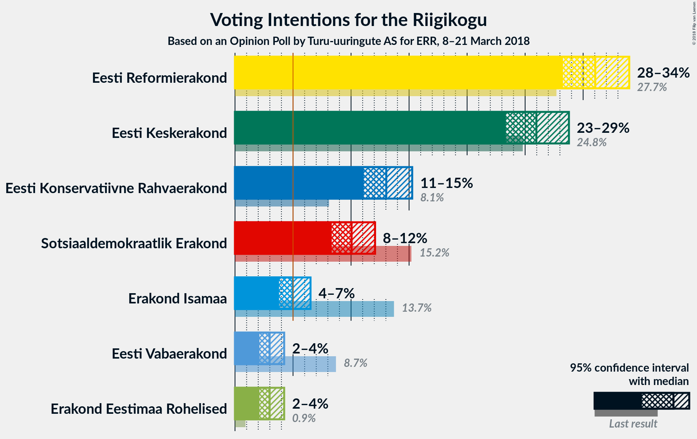

# Opinion Poll by Turu-uuringute AS for ERR, 8–21 March 2018

<a href="#voting-intentions">Voting Intentions</a> | <a href="#seats">Seats</a> | <a href="#coalitions">Coalitions</a> | <a href="#technical-information">Technical Information</a>

## Voting Intentions

### Confidence Intervals

| Party | Last Result | Poll Result | 80% Confidence Interval | 90% Confidence Interval | 95% Confidence Interval | 99% Confidence Interval |
|:-----:|:-----------:|:-----------:|:-----------------------:|:-----------------------:|:-----------------------:|:-----------------------:|
| Eesti Reformierakond | 27.7% | 31.0% | 29.2–33.0% |28.7–33.5% |28.3–34.0% |27.4–34.9% |
| Eesti Keskerakond | 24.8% | 26.0% | 24.2–27.8% |23.8–28.3% |23.4–28.8% |22.5–29.7% |
| Eesti Konservatiivne Rahvaerakond | 8.1% | 13.0% | 11.8–14.5% |11.4–14.9% |11.1–15.3% |10.5–16.0% |
| Sotsiaaldemokraatlik Erakond | 15.2% | 10.0% | 8.9–11.4% |8.6–11.7% |8.3–12.1% |7.8–12.7% |
| Erakond Isamaa | 13.7% | 5.0% | 4.2–6.0% |4.0–6.2% |3.8–6.5% |3.4–7.0% |
| Eesti Vabaerakond | 8.7% | 3.0% | 2.4–3.8% |2.2–4.0% |2.1–4.2% |1.8–4.7% |
| Erakond Eestimaa Rohelised | 0.9% | 3.0% | 2.4–3.8% |2.2–4.0% |2.1–4.2% |1.8–4.7% |

*Note:* The poll result column reflects the actual value used in the calculations. Published results may vary slightly, and in addition be rounded to fewer digits.

## Seats

### Confidence Intervals

| Party | Last Result | Median | 80% Confidence Interval | 90% Confidence Interval | 95% Confidence Interval | 99% Confidence Interval |
|:-----:|:-----------:|:------:|:-----------------------:|:-----------------------:|:-----------------------:|:-----------------------:|
| <a href="#eesti-reformierakond">Eesti Reformierakond</a> | 30 | 36 | 33–39 |33–39 |32–40 |31–41 |
| <a href="#eesti-keskerakond">Eesti Keskerakond</a> | 27 | 29 | 28–33 |27–34 |27–34 |25–35 |
| <a href="#eesti-konservatiivne-rahvaerakond">Eesti Konservatiivne Rahvaerakond</a> | 7 | 14 | 12–15 |11–16 |11–16 |10–17 |
| <a href="#sotsiaaldemokraatlik-erakond">Sotsiaaldemokraatlik Erakond</a> | 15 | 10 | 9–11 |8–12 |8–12 |7–13 |
| <a href="#erakond-isamaa">Erakond Isamaa</a> | 14 | 4 | 0–6 |0–6 |0–6 |0–6 |
| <a href="#eesti-vabaerakond">Eesti Vabaerakond</a> | 8 | 0 | 0 |0 |0 |0 |
| <a href="#erakond-eestimaa-rohelised">Erakond Eestimaa Rohelised</a> | 0 | 0 | 0 |0 |0 |0 |

### Eesti Reformierakond

*For a full overview of the results for this party, see the [Eesti Reformierakond](party-eestireformierakond.html) page.*

| Number of Seats | Probability | Accumulated | Special Marks |
|:---------------:|:-----------:|:-----------:|:-------------:|
| 30 | 0% | 100% | Last Result |
| 31 | 0.5% | 99.9% |  |
| 32 | 4% | 99.4% |  |
| 33 | 13% | 95% |  |
| 34 | 21% | 82% |  |
| 35 | 7% | 61% |  |
| 36 | 5% | 54% | Median |
| 37 | 6% | 49% |  |
| 38 | 31% | 43% |  |
| 39 | 9% | 12% |  |
| 40 | 2% | 3% |  |
| 41 | 0.1% | 0.5% |  |
| 42 | 0.2% | 0.4% |  |
| 43 | 0.1% | 0.2% |  |
| 44 | 0.1% | 0.1% |  |
| 45 | 0% | 0% |  |

### Eesti Keskerakond

*For a full overview of the results for this party, see the [Eesti Keskerakond](party-eestikeskerakond.html) page.*

| Number of Seats | Probability | Accumulated | Special Marks |
|:---------------:|:-----------:|:-----------:|:-------------:|
| 24 | 0.2% | 100% |  |
| 25 | 0.6% | 99.7% |  |
| 26 | 1.1% | 99.1% |  |
| 27 | 7% | 98% | Last Result |
| 28 | 19% | 91% |  |
| 29 | 23% | 72% | Median |
| 30 | 16% | 50% |  |
| 31 | 8% | 34% |  |
| 32 | 10% | 25% |  |
| 33 | 8% | 15% |  |
| 34 | 6% | 7% |  |
| 35 | 1.2% | 1.3% |  |
| 36 | 0.1% | 0.1% |  |
| 37 | 0% | 0% |  |

### Eesti Konservatiivne Rahvaerakond

*For a full overview of the results for this party, see the [Eesti Konservatiivne Rahvaerakond](party-eestikonservatiivnerahvaerakond.html) page.*

| Number of Seats | Probability | Accumulated | Special Marks |
|:---------------:|:-----------:|:-----------:|:-------------:|
| 7 | 0% | 100% | Last Result |
| 8 | 0% | 100% |  |
| 9 | 0% | 100% |  |
| 10 | 0.8% | 100% |  |
| 11 | 7% | 99.2% |  |
| 12 | 22% | 93% |  |
| 13 | 17% | 71% |  |
| 14 | 26% | 54% | Median |
| 15 | 20% | 27% |  |
| 16 | 6% | 7% |  |
| 17 | 1.4% | 2% |  |
| 18 | 0.3% | 0.4% |  |
| 19 | 0% | 0% |  |

### Sotsiaaldemokraatlik Erakond

*For a full overview of the results for this party, see the [Sotsiaaldemokraatlik Erakond](party-sotsiaaldemokraatlikerakond.html) page.*

| Number of Seats | Probability | Accumulated | Special Marks |
|:---------------:|:-----------:|:-----------:|:-------------:|
| 7 | 0.9% | 100% |  |
| 8 | 8% | 99.1% |  |
| 9 | 23% | 91% |  |
| 10 | 34% | 68% | Median |
| 11 | 24% | 34% |  |
| 12 | 8% | 10% |  |
| 13 | 1.3% | 2% |  |
| 14 | 0.2% | 0.3% |  |
| 15 | 0% | 0% | Last Result |

### Erakond Isamaa

*For a full overview of the results for this party, see the [Erakond Isamaa](party-erakondisamaa.html) page.*

| Number of Seats | Probability | Accumulated | Special Marks |
|:---------------:|:-----------:|:-----------:|:-------------:|
| 0 | 48% | 100% |  |
| 1 | 0% | 52% |  |
| 2 | 0% | 52% |  |
| 3 | 0% | 52% |  |
| 4 | 5% | 52% | Median |
| 5 | 35% | 47% |  |
| 6 | 12% | 13% |  |
| 7 | 0.5% | 0.5% |  |
| 8 | 0% | 0% |  |
| 9 | 0% | 0% |  |
| 10 | 0% | 0% |  |
| 11 | 0% | 0% |  |
| 12 | 0% | 0% |  |
| 13 | 0% | 0% |  |
| 14 | 0% | 0% | Last Result |

### Eesti Vabaerakond

*For a full overview of the results for this party, see the [Eesti Vabaerakond](party-eestivabaerakond.html) page.*

| Number of Seats | Probability | Accumulated | Special Marks |
|:---------------:|:-----------:|:-----------:|:-------------:|
| 0 | 99.9% | 100% | Median |
| 1 | 0% | 0.1% |  |
| 2 | 0% | 0.1% |  |
| 3 | 0% | 0.1% |  |
| 4 | 0.1% | 0.1% |  |
| 5 | 0% | 0% |  |
| 6 | 0% | 0% |  |
| 7 | 0% | 0% |  |
| 8 | 0% | 0% | Last Result |

### Erakond Eestimaa Rohelised

*For a full overview of the results for this party, see the [Erakond Eestimaa Rohelised](party-erakondeestimaarohelised.html) page.*

| Number of Seats | Probability | Accumulated | Special Marks |
|:---------------:|:-----------:|:-----------:|:-------------:|
| 0 | 99.9% | 100% | Last Result, Median |
| 1 | 0% | 0.1% |  |
| 2 | 0% | 0.1% |  |
| 3 | 0% | 0.1% |  |
| 4 | 0% | 0.1% |  |
| 5 | 0% | 0% |  |

## Coalitions

### Confidence Intervals

| Coalition | Last Result | Median | Majority? | 80% Confidence Interval | 90% Confidence Interval | 95% Confidence Interval | 99% Confidence Interval |
|:---------:|:-----------:|:------:|:---------:|:-----------------------:|:-----------------------:|:-----------------------:|:-----------------------:|
| Eesti Reformierakond – Eesti Keskerakond – Eesti Konservatiivne Rahvaerakond | 64 | 80 | 100% | 76–83 | 76–83 | 75–84 | 74–84 |
| Eesti Reformierakond – Eesti Keskerakond | 57 | 66 | 100% | 62–70 | 62–70 | 61–71 | 60–72 |
| Eesti Reformierakond – Eesti Konservatiivne Rahvaerakond – Erakond Isamaa | 51 | 52 | 74% | 49–55 | 48–56 | 48–56 | 46–57 |
| Eesti Reformierakond – Eesti Konservatiivne Rahvaerakond | 37 | 49 | 29% | 47–53 | 46–54 | 45–55 | 44–56 |
| Eesti Reformierakond – Sotsiaaldemokraatlik Erakond – Erakond Isamaa – Eesti Vabaerakond | 67 | 49 | 21% | 45–52 | 44–53 | 43–53 | 43–54 |
| Eesti Reformierakond – Sotsiaaldemokraatlik Erakond – Erakond Isamaa | 59 | 49 | 21% | 45–52 | 44–53 | 43–53 | 43–54 |
| Eesti Reformierakond – Sotsiaaldemokraatlik Erakond | 45 | 46 | 3% | 43–50 | 42–50 | 42–51 | 41–52 |
| Eesti Keskerakond – Eesti Konservatiivne Rahvaerakond | 34 | 43 | 0% | 40–47 | 40–48 | 39–49 | 38–49 |
| Eesti Keskerakond – Sotsiaaldemokraatlik Erakond – Erakond Isamaa | 56 | 43 | 0% | 39–46 | 38–46 | 37–47 | 36–48 |
| Eesti Keskerakond – Sotsiaaldemokraatlik Erakond | 42 | 40 | 0% | 37–43 | 37–43 | 36–44 | 35–45 |
| Eesti Reformierakond – Erakond Isamaa | 44 | 38 | 0% | 35–42 | 34–43 | 34–44 | 33–44 |
| Eesti Konservatiivne Rahvaerakond – Sotsiaaldemokraatlik Erakond | 22 | 24 | 0% | 21–26 | 20–26 | 20–27 | 19–28 |

### Eesti Reformierakond – Eesti Keskerakond – Eesti Konservatiivne Rahvaerakond

| Number of Seats | Probability | Accumulated | Special Marks |
|:---------------:|:-----------:|:-----------:|:-------------:|
| 64 | 0% | 100% | Last Result |
| 65 | 0% | 100% |  |
| 66 | 0% | 100% |  |
| 67 | 0% | 100% |  |
| 68 | 0% | 100% |  |
| 69 | 0% | 100% |  |
| 70 | 0% | 100% |  |
| 71 | 0% | 100% |  |
| 72 | 0% | 100% |  |
| 73 | 0.2% | 100% |  |
| 74 | 0.9% | 99.8% |  |
| 75 | 3% | 98.9% |  |
| 76 | 9% | 96% |  |
| 77 | 19% | 87% |  |
| 78 | 8% | 68% |  |
| 79 | 6% | 60% | Median |
| 80 | 14% | 54% |  |
| 81 | 12% | 39% |  |
| 82 | 17% | 28% |  |
| 83 | 8% | 11% |  |
| 84 | 2% | 3% |  |
| 85 | 0.3% | 0.4% |  |
| 86 | 0.1% | 0.1% |  |
| 87 | 0% | 0% |  |

### Eesti Reformierakond – Eesti Keskerakond

| Number of Seats | Probability | Accumulated | Special Marks |
|:---------------:|:-----------:|:-----------:|:-------------:|
| 57 | 0% | 100% | Last Result |
| 58 | 0% | 100% |  |
| 59 | 0.2% | 100% |  |
| 60 | 0.9% | 99.7% |  |
| 61 | 3% | 98.9% |  |
| 62 | 6% | 96% |  |
| 63 | 13% | 90% |  |
| 64 | 11% | 77% |  |
| 65 | 9% | 66% | Median |
| 66 | 12% | 57% |  |
| 67 | 17% | 45% |  |
| 68 | 12% | 28% |  |
| 69 | 5% | 16% |  |
| 70 | 7% | 11% |  |
| 71 | 3% | 4% |  |
| 72 | 0.6% | 0.7% |  |
| 73 | 0.1% | 0.1% |  |
| 74 | 0% | 0% |  |

### Eesti Reformierakond – Eesti Konservatiivne Rahvaerakond – Erakond Isamaa

| Number of Seats | Probability | Accumulated | Special Marks |
|:---------------:|:-----------:|:-----------:|:-------------:|
| 45 | 0.1% | 100% |  |
| 46 | 0.4% | 99.8% |  |
| 47 | 1.5% | 99.5% |  |
| 48 | 4% | 98% |  |
| 49 | 6% | 94% |  |
| 50 | 14% | 88% |  |
| 51 | 8% | 74% | Last Result, Majority |
| 52 | 21% | 66% |  |
| 53 | 14% | 45% |  |
| 54 | 16% | 31% | Median |
| 55 | 7% | 15% |  |
| 56 | 6% | 8% |  |
| 57 | 1.2% | 2% |  |
| 58 | 0.3% | 0.5% |  |
| 59 | 0.1% | 0.1% |  |
| 60 | 0% | 0% |  |

### Eesti Reformierakond – Eesti Konservatiivne Rahvaerakond

| Number of Seats | Probability | Accumulated | Special Marks |
|:---------------:|:-----------:|:-----------:|:-------------:|
| 37 | 0% | 100% | Last Result |
| 38 | 0% | 100% |  |
| 39 | 0% | 100% |  |
| 40 | 0% | 100% |  |
| 41 | 0% | 100% |  |
| 42 | 0% | 100% |  |
| 43 | 0.2% | 100% |  |
| 44 | 0.5% | 99.8% |  |
| 45 | 2% | 99.3% |  |
| 46 | 5% | 97% |  |
| 47 | 13% | 92% |  |
| 48 | 18% | 79% |  |
| 49 | 13% | 61% |  |
| 50 | 19% | 48% | Median |
| 51 | 8% | 29% | Majority |
| 52 | 11% | 22% |  |
| 53 | 2% | 11% |  |
| 54 | 5% | 8% |  |
| 55 | 3% | 3% |  |
| 56 | 0.5% | 0.7% |  |
| 57 | 0.1% | 0.2% |  |
| 58 | 0% | 0% |  |

### Eesti Reformierakond – Sotsiaaldemokraatlik Erakond – Erakond Isamaa – Eesti Vabaerakond

| Number of Seats | Probability | Accumulated | Special Marks |
|:---------------:|:-----------:|:-----------:|:-------------:|
| 42 | 0.2% | 100% |  |
| 43 | 5% | 99.7% |  |
| 44 | 4% | 95% |  |
| 45 | 3% | 91% |  |
| 46 | 3% | 88% |  |
| 47 | 6% | 85% |  |
| 48 | 24% | 79% |  |
| 49 | 19% | 55% |  |
| 50 | 15% | 36% | Median |
| 51 | 8% | 21% | Majority |
| 52 | 6% | 13% |  |
| 53 | 6% | 7% |  |
| 54 | 1.0% | 1.3% |  |
| 55 | 0.2% | 0.3% |  |
| 56 | 0% | 0% |  |
| 57 | 0% | 0% |  |
| 58 | 0% | 0% |  |
| 59 | 0% | 0% |  |
| 60 | 0% | 0% |  |
| 61 | 0% | 0% |  |
| 62 | 0% | 0% |  |
| 63 | 0% | 0% |  |
| 64 | 0% | 0% |  |
| 65 | 0% | 0% |  |
| 66 | 0% | 0% |  |
| 67 | 0% | 0% | Last Result |

### Eesti Reformierakond – Sotsiaaldemokraatlik Erakond – Erakond Isamaa

| Number of Seats | Probability | Accumulated | Special Marks |
|:---------------:|:-----------:|:-----------:|:-------------:|
| 42 | 0.3% | 100% |  |
| 43 | 5% | 99.7% |  |
| 44 | 4% | 95% |  |
| 45 | 3% | 91% |  |
| 46 | 3% | 88% |  |
| 47 | 6% | 85% |  |
| 48 | 24% | 79% |  |
| 49 | 19% | 55% |  |
| 50 | 15% | 36% | Median |
| 51 | 7% | 21% | Majority |
| 52 | 6% | 13% |  |
| 53 | 6% | 7% |  |
| 54 | 1.0% | 1.3% |  |
| 55 | 0.2% | 0.3% |  |
| 56 | 0% | 0% |  |
| 57 | 0% | 0% |  |
| 58 | 0% | 0% |  |
| 59 | 0% | 0% | Last Result |

### Eesti Reformierakond – Sotsiaaldemokraatlik Erakond

| Number of Seats | Probability | Accumulated | Special Marks |
|:---------------:|:-----------:|:-----------:|:-------------:|
| 40 | 0.1% | 100% |  |
| 41 | 0.9% | 99.9% |  |
| 42 | 6% | 99.0% |  |
| 43 | 22% | 94% |  |
| 44 | 9% | 71% |  |
| 45 | 7% | 62% | Last Result |
| 46 | 8% | 55% | Median |
| 47 | 10% | 47% |  |
| 48 | 16% | 37% |  |
| 49 | 9% | 21% |  |
| 50 | 10% | 12% |  |
| 51 | 2% | 3% | Majority |
| 52 | 0.2% | 0.6% |  |
| 53 | 0.2% | 0.3% |  |
| 54 | 0.1% | 0.2% |  |
| 55 | 0% | 0% |  |

### Eesti Keskerakond – Eesti Konservatiivne Rahvaerakond

| Number of Seats | Probability | Accumulated | Special Marks |
|:---------------:|:-----------:|:-----------:|:-------------:|
| 34 | 0% | 100% | Last Result |
| 35 | 0% | 100% |  |
| 36 | 0% | 100% |  |
| 37 | 0.2% | 100% |  |
| 38 | 0.5% | 99.8% |  |
| 39 | 3% | 99.3% |  |
| 40 | 8% | 96% |  |
| 41 | 4% | 88% |  |
| 42 | 17% | 83% |  |
| 43 | 22% | 67% | Median |
| 44 | 18% | 44% |  |
| 45 | 10% | 26% |  |
| 46 | 4% | 16% |  |
| 47 | 4% | 13% |  |
| 48 | 6% | 9% |  |
| 49 | 3% | 4% |  |
| 50 | 0.1% | 0.1% |  |
| 51 | 0% | 0% | Majority |

### Eesti Keskerakond – Sotsiaaldemokraatlik Erakond – Erakond Isamaa

| Number of Seats | Probability | Accumulated | Special Marks |
|:---------------:|:-----------:|:-----------:|:-------------:|
| 35 | 0.1% | 100% |  |
| 36 | 0.7% | 99.8% |  |
| 37 | 2% | 99.2% |  |
| 38 | 3% | 97% |  |
| 39 | 9% | 94% |  |
| 40 | 3% | 85% |  |
| 41 | 12% | 82% |  |
| 42 | 16% | 70% |  |
| 43 | 14% | 55% | Median |
| 44 | 19% | 41% |  |
| 45 | 12% | 23% |  |
| 46 | 7% | 11% |  |
| 47 | 3% | 4% |  |
| 48 | 1.1% | 1.3% |  |
| 49 | 0.2% | 0.2% |  |
| 50 | 0% | 0% |  |
| 51 | 0% | 0% | Majority |
| 52 | 0% | 0% |  |
| 53 | 0% | 0% |  |
| 54 | 0% | 0% |  |
| 55 | 0% | 0% |  |
| 56 | 0% | 0% | Last Result |

### Eesti Keskerakond – Sotsiaaldemokraatlik Erakond

| Number of Seats | Probability | Accumulated | Special Marks |
|:---------------:|:-----------:|:-----------:|:-------------:|
| 33 | 0.1% | 100% |  |
| 34 | 0.2% | 99.9% |  |
| 35 | 0.6% | 99.7% |  |
| 36 | 4% | 99.1% |  |
| 37 | 7% | 95% |  |
| 38 | 12% | 88% |  |
| 39 | 25% | 76% | Median |
| 40 | 9% | 51% |  |
| 41 | 15% | 41% |  |
| 42 | 13% | 26% | Last Result |
| 43 | 8% | 13% |  |
| 44 | 3% | 5% |  |
| 45 | 2% | 2% |  |
| 46 | 0.3% | 0.4% |  |
| 47 | 0.1% | 0.1% |  |
| 48 | 0% | 0% |  |

### Eesti Reformierakond – Erakond Isamaa

| Number of Seats | Probability | Accumulated | Special Marks |
|:---------------:|:-----------:|:-----------:|:-------------:|
| 32 | 0.1% | 100% |  |
| 33 | 1.3% | 99.8% |  |
| 34 | 7% | 98.5% |  |
| 35 | 5% | 92% |  |
| 36 | 2% | 87% |  |
| 37 | 6% | 85% |  |
| 38 | 34% | 79% |  |
| 39 | 15% | 46% |  |
| 40 | 9% | 30% | Median |
| 41 | 6% | 21% |  |
| 42 | 5% | 15% |  |
| 43 | 5% | 9% |  |
| 44 | 4% | 4% | Last Result |
| 45 | 0.3% | 0.3% |  |
| 46 | 0% | 0% |  |

### Eesti Konservatiivne Rahvaerakond – Sotsiaaldemokraatlik Erakond

| Number of Seats | Probability | Accumulated | Special Marks |
|:---------------:|:-----------:|:-----------:|:-------------:|
| 18 | 0.2% | 100% |  |
| 19 | 0.8% | 99.8% |  |
| 20 | 4% | 99.0% |  |
| 21 | 9% | 95% |  |
| 22 | 16% | 86% | Last Result |
| 23 | 18% | 69% |  |
| 24 | 16% | 51% | Median |
| 25 | 20% | 35% |  |
| 26 | 11% | 15% |  |
| 27 | 2% | 4% |  |
| 28 | 1.4% | 2% |  |
| 29 | 0.4% | 0.5% |  |
| 30 | 0.1% | 0.1% |  |
| 31 | 0% | 0% |  |

## Technical Information

### Opinion Poll

+ **Polling firm:** Turu-uuringute AS
+ **Commissioner(s):** ERR
+ **Fieldwork period:** 8–21 March 2018

### Calculations

+ **Sample size:** 1005
+ **Simulations done:** 131,072
+ **Error estimate:** 2.24%

