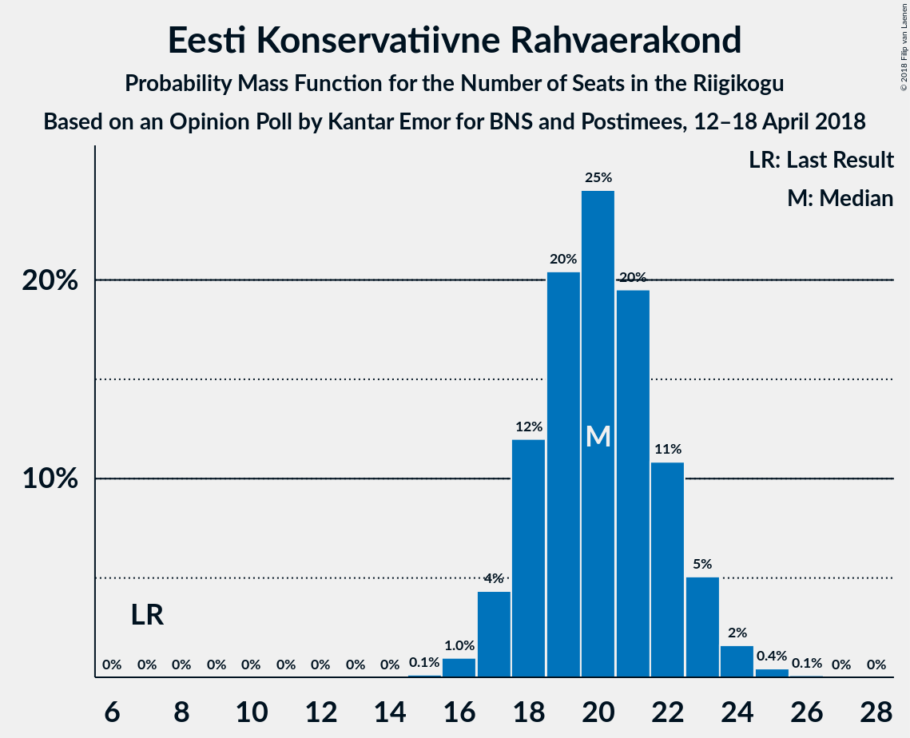
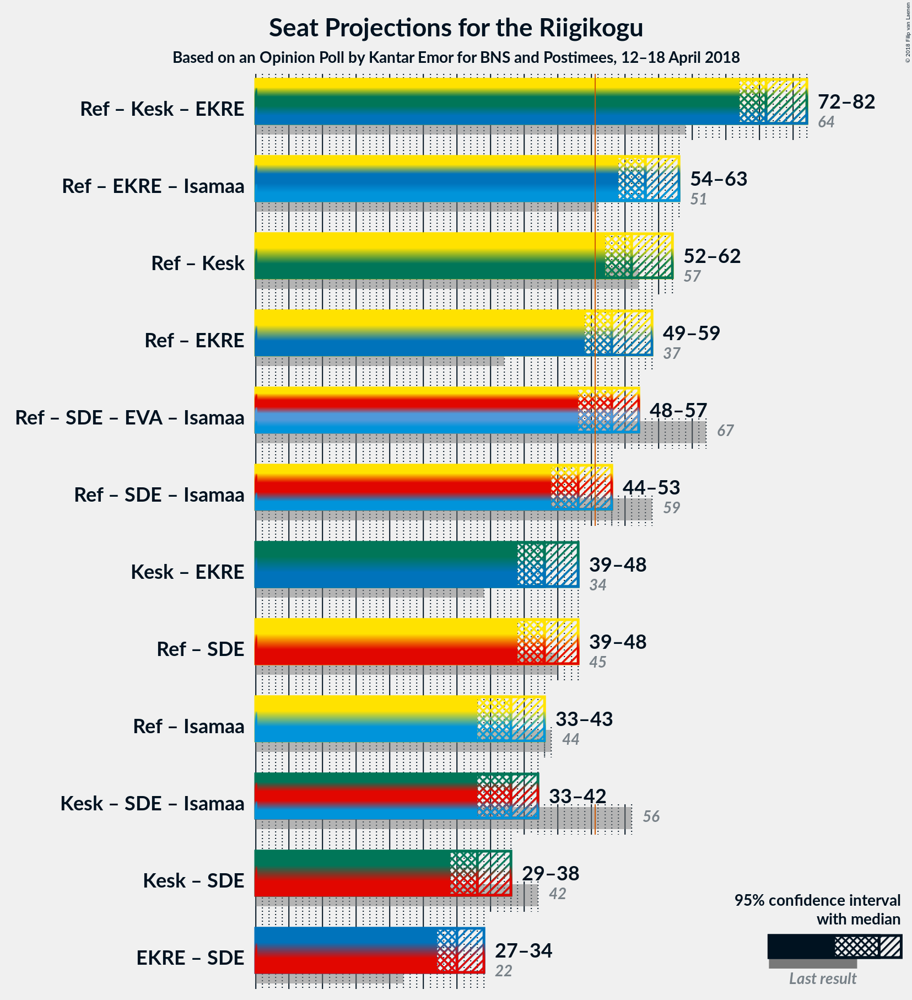

# Opinion Poll by Kantar Emor for BNS and Postimees, 12–18 April 2018

<a href="#voting-intentions">Voting Intentions</a> | <a href="#seats">Seats</a> | <a href="#coalitions">Coalitions</a> | <a href="#technical-information">Technical Information</a>

## Voting Intentions

### Confidence Intervals

| Party | Last Result | Poll Result | 80% Confidence Interval | 90% Confidence Interval | 95% Confidence Interval | 99% Confidence Interval |
|:-----:|:-----------:|:-----------:|:-----------------------:|:-----------------------:|:-----------------------:|:-----------------------:|
| Eesti Reformierakond | 27.7% | 30.0% | 28.1–32.0% |27.5–32.5% |27.1–33.0% |26.2–34.0% |
| Eesti Keskerakond | 24.8% | 21.6% | 19.9–23.4% |19.4–23.9% |19.0–24.4% |18.2–25.3% |
| Eesti Konservatiivne Rahvaerakond | 8.1% | 19.1% | 17.5–20.8% |17.0–21.3% |16.6–21.7% |15.9–22.6% |
| Sotsiaaldemokraatlik Erakond | 15.2% | 10.6% | 9.4–12.0% |9.0–12.4% |8.7–12.7% |8.2–13.5% |
| Erakond Eestimaa Rohelised | 0.9% | 6.1% | 5.2–7.2% |4.9–7.5% |4.7–7.8% |4.3–8.4% |
| Erakond Isamaa | 13.7% | 5.8% | 5.0–7.0% |4.7–7.3% |4.5–7.6% |4.1–8.1% |
| Eesti Vabaerakond | 8.7% | 5.8% | 5.0–7.0% |4.7–7.3% |4.5–7.6% |4.1–8.1% |

*Note:* The poll result column reflects the actual value used in the calculations. Published results may vary slightly, and in addition be rounded to fewer digits.

## Seats

### Confidence Intervals

| Party | Last Result | Median | 80% Confidence Interval | 90% Confidence Interval | 95% Confidence Interval | 99% Confidence Interval |
|:-----:|:-----------:|:------:|:-----------------------:|:-----------------------:|:-----------------------:|:-----------------------:|
| <a href="#eesti-reformierakond">Eesti Reformierakond</a> | 30 | 32 | 29–34 |29–35 |29–35 |29–37 |
| <a href="#eesti-keskerakond">Eesti Keskerakond</a> | 27 | 23 | 22–29 |22–29 |22–29 |20–29 |
| <a href="#eesti-konservatiivne-rahvaerakond">Eesti Konservatiivne Rahvaerakond</a> | 7 | 22 | 18–24 |18–24 |18–24 |15–24 |
| <a href="#sotsiaaldemokraatlik-erakond">Sotsiaaldemokraatlik Erakond</a> | 15 | 10 | 10–11 |9–11 |9–13 |8–14 |
| <a href="#erakond-eestimaa-rohelised">Erakond Eestimaa Rohelised</a> | 0 | 6 | 5–8 |5–8 |5–8 |0–8 |
| <a href="#erakond-isamaa">Erakond Isamaa</a> | 14 | 5 | 0–6 |0–7 |0–7 |0–7 |
| <a href="#eesti-vabaerakond">Eesti Vabaerakond</a> | 8 | 5 | 5 |0–6 |0–6 |0–6 |

### Eesti Reformierakond

*For a full overview of the results for this party, see the [Eesti Reformierakond](party-eestireformierakond.html) page.*

| Number of Seats | Probability | Accumulated | Special Marks |
|:---------------:|:-----------:|:-----------:|:-------------:|
| 26 | 0.1% | 100% |  |
| 27 | 0.1% | 99.9% |  |
| 28 | 0.1% | 99.8% |  |
| 29 | 42% | 99.8% |  |
| 30 | 5% | 58% | Last Result |
| 31 | 1.3% | 53% |  |
| 32 | 40% | 52% | Median |
| 33 | 0% | 12% |  |
| 34 | 2% | 12% |  |
| 35 | 8% | 10% |  |
| 36 | 0.1% | 2% |  |
| 37 | 2% | 2% |  |
| 38 | 0% | 0.4% |  |
| 39 | 0% | 0.4% |  |
| 40 | 0.2% | 0.4% |  |
| 41 | 0% | 0.2% |  |
| 42 | 0.2% | 0.2% |  |
| 43 | 0% | 0% |  |

### Eesti Keskerakond

*For a full overview of the results for this party, see the [Eesti Keskerakond](party-eestikeskerakond.html) page.*

| Number of Seats | Probability | Accumulated | Special Marks |
|:---------------:|:-----------:|:-----------:|:-------------:|
| 20 | 0.8% | 100% |  |
| 21 | 1.1% | 99.2% |  |
| 22 | 45% | 98% |  |
| 23 | 6% | 53% | Median |
| 24 | 32% | 47% |  |
| 25 | 0.1% | 15% |  |
| 26 | 0.8% | 15% |  |
| 27 | 0.3% | 14% | Last Result |
| 28 | 0.6% | 14% |  |
| 29 | 13% | 13% |  |
| 30 | 0% | 0% |  |

### Eesti Konservatiivne Rahvaerakond

*For a full overview of the results for this party, see the [Eesti Konservatiivne Rahvaerakond](party-eestikonservatiivnerahvaerakond.html) page.*

| Number of Seats | Probability | Accumulated | Special Marks |
|:---------------:|:-----------:|:-----------:|:-------------:|
| 7 | 0% | 100% | Last Result |
| 8 | 0% | 100% |  |
| 9 | 0% | 100% |  |
| 10 | 0% | 100% |  |
| 11 | 0% | 100% |  |
| 12 | 0% | 100% |  |
| 13 | 0% | 100% |  |
| 14 | 0% | 100% |  |
| 15 | 1.2% | 100% |  |
| 16 | 0.6% | 98.8% |  |
| 17 | 0.2% | 98% |  |
| 18 | 18% | 98% |  |
| 19 | 0.6% | 80% |  |
| 20 | 2% | 80% |  |
| 21 | 6% | 78% |  |
| 22 | 27% | 72% | Median |
| 23 | 2% | 44% |  |
| 24 | 42% | 42% |  |
| 25 | 0.1% | 0.2% |  |
| 26 | 0% | 0% |  |

### Sotsiaaldemokraatlik Erakond

*For a full overview of the results for this party, see the [Sotsiaaldemokraatlik Erakond](party-sotsiaaldemokraatlikerakond.html) page.*

| Number of Seats | Probability | Accumulated | Special Marks |
|:---------------:|:-----------:|:-----------:|:-------------:|
| 8 | 0.6% | 100% |  |
| 9 | 9% | 99.4% |  |
| 10 | 75% | 91% | Median |
| 11 | 13% | 16% |  |
| 12 | 0.3% | 3% |  |
| 13 | 1.2% | 3% |  |
| 14 | 1.4% | 1.4% |  |
| 15 | 0% | 0% | Last Result |

### Erakond Eestimaa Rohelised

*For a full overview of the results for this party, see the [Erakond Eestimaa Rohelised](party-erakondeestimaarohelised.html) page.*

| Number of Seats | Probability | Accumulated | Special Marks |
|:---------------:|:-----------:|:-----------:|:-------------:|
| 0 | 1.2% | 100% | Last Result |
| 1 | 0% | 98.8% |  |
| 2 | 0% | 98.8% |  |
| 3 | 0% | 98.8% |  |
| 4 | 0.1% | 98.8% |  |
| 5 | 43% | 98.8% |  |
| 6 | 22% | 56% | Median |
| 7 | 1.5% | 34% |  |
| 8 | 33% | 33% |  |
| 9 | 0% | 0% |  |

### Erakond Isamaa

*For a full overview of the results for this party, see the [Erakond Isamaa](party-erakondisamaa.html) page.*

| Number of Seats | Probability | Accumulated | Special Marks |
|:---------------:|:-----------:|:-----------:|:-------------:|
| 0 | 41% | 100% |  |
| 1 | 0% | 59% |  |
| 2 | 0% | 59% |  |
| 3 | 0% | 59% |  |
| 4 | 2% | 59% |  |
| 5 | 7% | 57% | Median |
| 6 | 43% | 50% |  |
| 7 | 7% | 7% |  |
| 8 | 0% | 0% |  |
| 9 | 0% | 0% |  |
| 10 | 0% | 0% |  |
| 11 | 0% | 0% |  |
| 12 | 0% | 0% |  |
| 13 | 0% | 0% |  |
| 14 | 0% | 0% | Last Result |

### Eesti Vabaerakond

*For a full overview of the results for this party, see the [Eesti Vabaerakond](party-eestivabaerakond.html) page.*

| Number of Seats | Probability | Accumulated | Special Marks |
|:---------------:|:-----------:|:-----------:|:-------------:|
| 0 | 10% | 100% |  |
| 1 | 0% | 90% |  |
| 2 | 0% | 90% |  |
| 3 | 0% | 90% |  |
| 4 | 0.2% | 90% |  |
| 5 | 84% | 90% | Median |
| 6 | 6% | 6% |  |
| 7 | 0.1% | 0.4% |  |
| 8 | 0.3% | 0.3% | Last Result |
| 9 | 0% | 0% |  |

## Coalitions

### Confidence Intervals

| Coalition | Last Result | Median | Majority? | 80% Confidence Interval | 90% Confidence Interval | 95% Confidence Interval | 99% Confidence Interval |
|:---------:|:-----------:|:------:|:---------:|:-----------------------:|:-----------------------:|:-----------------------:|:-----------------------:|
| Eesti Reformierakond – Eesti Keskerakond – Eesti Konservatiivne Rahvaerakond | 64 | 78 | 100% | 75–79 | 72–79 | 72–79 | 72–85 |
| Eesti Reformierakond – Eesti Konservatiivne Rahvaerakond – Erakond Isamaa | 51 | 59 | 87% | 50–59 | 50–61 | 50–63 | 50–64 |
| Eesti Reformierakond – Eesti Keskerakond | 57 | 56 | 99.4% | 51–61 | 51–61 | 51–61 | 50–63 |
| Eesti Reformierakond – Sotsiaaldemokraatlik Erakond – Eesti Vabaerakond – Erakond Isamaa | 67 | 50 | 9% | 47–50 | 47–53 | 47–54 | 45–59 |
| Eesti Reformierakond – Sotsiaaldemokraatlik Erakond – Erakond Isamaa | 59 | 45 | 2% | 42–49 | 42–49 | 42–50 | 42–54 |
| Eesti Reformierakond – Sotsiaaldemokraatlik Erakond | 45 | 42 | 0.3% | 39–44 | 39–44 | 39–45 | 39–50 |
| Eesti Keskerakond – Sotsiaaldemokraatlik Erakond – Erakond Isamaa | 56 | 38 | 0% | 34–40 | 34–41 | 34–41 | 34–43 |
| Eesti Reformierakond – Erakond Isamaa | 44 | 35 | 0% | 32–40 | 32–40 | 32–41 | 32–43 |

### Eesti Reformierakond – Eesti Keskerakond – Eesti Konservatiivne Rahvaerakond

| Number of Seats | Probability | Accumulated | Special Marks |
|:---------------:|:-----------:|:-----------:|:-------------:|
| 64 | 0% | 100% | Last Result |
| 65 | 0% | 100% |  |
| 66 | 0% | 100% |  |
| 67 | 0% | 100% |  |
| 68 | 0% | 100% |  |
| 69 | 0% | 100% |  |
| 70 | 0% | 100% |  |
| 71 | 0% | 100% |  |
| 72 | 6% | 100% |  |
| 73 | 0.2% | 94% |  |
| 74 | 1.4% | 93% |  |
| 75 | 42% | 92% |  |
| 76 | 0% | 50% |  |
| 77 | 0.1% | 50% | Median |
| 78 | 27% | 50% |  |
| 79 | 22% | 24% |  |
| 80 | 0% | 2% |  |
| 81 | 0.7% | 2% |  |
| 82 | 0% | 1.0% |  |
| 83 | 0.1% | 1.0% |  |
| 84 | 0.2% | 0.9% |  |
| 85 | 0.7% | 0.7% |  |
| 86 | 0% | 0% |  |

### Eesti Reformierakond – Eesti Konservatiivne Rahvaerakond – Erakond Isamaa

| Number of Seats | Probability | Accumulated | Special Marks |
|:---------------:|:-----------:|:-----------:|:-------------:|
| 50 | 13% | 100% |  |
| 51 | 0% | 87% | Last Result, Majority |
| 52 | 0% | 87% |  |
| 53 | 0.1% | 87% |  |
| 54 | 27% | 87% |  |
| 55 | 6% | 60% |  |
| 56 | 2% | 54% |  |
| 57 | 0.1% | 52% |  |
| 58 | 0.2% | 52% |  |
| 59 | 43% | 52% | Median |
| 60 | 0.5% | 9% |  |
| 61 | 6% | 9% |  |
| 62 | 0% | 3% |  |
| 63 | 0.5% | 3% |  |
| 64 | 2% | 2% |  |
| 65 | 0% | 0% |  |

### Eesti Reformierakond – Eesti Keskerakond

| Number of Seats | Probability | Accumulated | Special Marks |
|:---------------:|:-----------:|:-----------:|:-------------:|
| 48 | 0.1% | 100% |  |
| 49 | 0% | 99.9% |  |
| 50 | 0.5% | 99.9% |  |
| 51 | 42% | 99.4% | Majority |
| 52 | 1.1% | 58% |  |
| 53 | 0.1% | 57% |  |
| 54 | 5% | 57% |  |
| 55 | 0.3% | 52% | Median |
| 56 | 29% | 52% |  |
| 57 | 0% | 23% | Last Result |
| 58 | 6% | 23% |  |
| 59 | 1.3% | 17% |  |
| 60 | 0.1% | 15% |  |
| 61 | 14% | 15% |  |
| 62 | 0% | 1.0% |  |
| 63 | 0.6% | 1.0% |  |
| 64 | 0.4% | 0.4% |  |
| 65 | 0% | 0% |  |

### Eesti Reformierakond – Sotsiaaldemokraatlik Erakond – Eesti Vabaerakond – Erakond Isamaa

| Number of Seats | Probability | Accumulated | Special Marks |
|:---------------:|:-----------:|:-----------:|:-------------:|
| 44 | 0.1% | 100% |  |
| 45 | 0.7% | 99.9% |  |
| 46 | 0% | 99.2% |  |
| 47 | 27% | 99.2% |  |
| 48 | 13% | 73% |  |
| 49 | 6% | 59% |  |
| 50 | 44% | 53% |  |
| 51 | 0.2% | 9% | Majority |
| 52 | 0.7% | 9% | Median |
| 53 | 5% | 8% |  |
| 54 | 1.1% | 3% |  |
| 55 | 0.3% | 2% |  |
| 56 | 0% | 2% |  |
| 57 | 0.6% | 2% |  |
| 58 | 0.1% | 1.5% |  |
| 59 | 1.2% | 1.4% |  |
| 60 | 0% | 0.2% |  |
| 61 | 0% | 0.2% |  |
| 62 | 0.2% | 0.2% |  |
| 63 | 0% | 0% |  |
| 64 | 0% | 0% |  |
| 65 | 0% | 0% |  |
| 66 | 0% | 0% |  |
| 67 | 0% | 0% | Last Result |

### Eesti Reformierakond – Sotsiaaldemokraatlik Erakond – Erakond Isamaa

| Number of Seats | Probability | Accumulated | Special Marks |
|:---------------:|:-----------:|:-----------:|:-------------:|
| 41 | 0.1% | 100% |  |
| 42 | 27% | 99.9% |  |
| 43 | 13% | 73% |  |
| 44 | 0.2% | 60% |  |
| 45 | 42% | 60% |  |
| 46 | 0.6% | 18% |  |
| 47 | 5% | 17% | Median |
| 48 | 0.1% | 12% |  |
| 49 | 7% | 12% |  |
| 50 | 3% | 5% |  |
| 51 | 0.7% | 2% | Majority |
| 52 | 0.1% | 2% |  |
| 53 | 0% | 2% |  |
| 54 | 1.2% | 2% |  |
| 55 | 0.3% | 0.5% |  |
| 56 | 0.2% | 0.2% |  |
| 57 | 0% | 0% |  |
| 58 | 0% | 0% |  |
| 59 | 0% | 0% | Last Result |

### Eesti Reformierakond – Sotsiaaldemokraatlik Erakond

| Number of Seats | Probability | Accumulated | Special Marks |
|:---------------:|:-----------:|:-----------:|:-------------:|
| 36 | 0.1% | 100% |  |
| 37 | 0% | 99.9% |  |
| 38 | 0% | 99.9% |  |
| 39 | 42% | 99.8% |  |
| 40 | 5% | 58% |  |
| 41 | 0% | 53% |  |
| 42 | 27% | 53% | Median |
| 43 | 15% | 26% |  |
| 44 | 6% | 11% |  |
| 45 | 3% | 5% | Last Result |
| 46 | 0.1% | 2% |  |
| 47 | 0% | 2% |  |
| 48 | 0% | 2% |  |
| 49 | 0.3% | 2% |  |
| 50 | 1.3% | 2% |  |
| 51 | 0.3% | 0.3% | Majority |
| 52 | 0% | 0% |  |

### Eesti Keskerakond – Sotsiaaldemokraatlik Erakond – Erakond Isamaa

| Number of Seats | Probability | Accumulated | Special Marks |
|:---------------:|:-----------:|:-----------:|:-------------:|
| 32 | 0.1% | 100% |  |
| 33 | 0% | 99.9% |  |
| 34 | 27% | 99.9% |  |
| 35 | 0.2% | 73% |  |
| 36 | 1.3% | 73% |  |
| 37 | 6% | 72% |  |
| 38 | 44% | 66% | Median |
| 39 | 2% | 22% |  |
| 40 | 13% | 19% |  |
| 41 | 5% | 6% |  |
| 42 | 0% | 1.0% |  |
| 43 | 0.7% | 1.0% |  |
| 44 | 0.1% | 0.3% |  |
| 45 | 0.2% | 0.2% |  |
| 46 | 0% | 0% |  |
| 47 | 0% | 0% |  |
| 48 | 0% | 0% |  |
| 49 | 0% | 0% |  |
| 50 | 0% | 0% |  |
| 51 | 0% | 0% | Majority |
| 52 | 0% | 0% |  |
| 53 | 0% | 0% |  |
| 54 | 0% | 0% |  |
| 55 | 0% | 0% |  |
| 56 | 0% | 0% | Last Result |

### Eesti Reformierakond – Erakond Isamaa

| Number of Seats | Probability | Accumulated | Special Marks |
|:---------------:|:-----------:|:-----------:|:-------------:|
| 32 | 40% | 100% |  |
| 33 | 0.2% | 60% |  |
| 34 | 0% | 60% |  |
| 35 | 43% | 60% |  |
| 36 | 0.1% | 17% |  |
| 37 | 5% | 16% | Median |
| 38 | 0% | 11% |  |
| 39 | 0.1% | 11% |  |
| 40 | 7% | 11% |  |
| 41 | 3% | 4% |  |
| 42 | 0% | 0.8% |  |
| 43 | 0.6% | 0.7% |  |
| 44 | 0% | 0.2% | Last Result |
| 45 | 0% | 0.2% |  |
| 46 | 0% | 0.2% |  |
| 47 | 0.2% | 0.2% |  |
| 48 | 0% | 0% |  |

## Technical Information

### Opinion Poll

+ **Polling firm:** Kantar Emor
+ **Commissioner(s):** BNS and Postimees
+ **Fieldwork period:** 12–18 April 2018

### Calculations

+ **Sample size:** 908
+ **Simulations done:** 1,024
+ **Error estimate:** 5.62%

