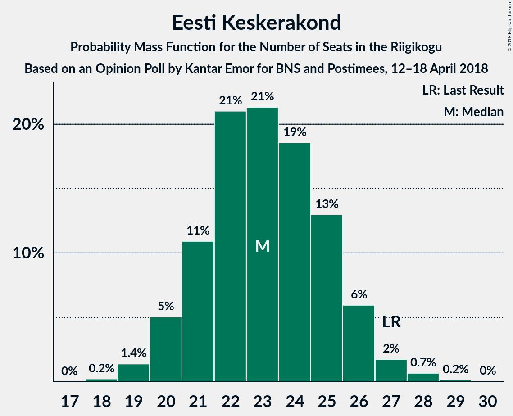
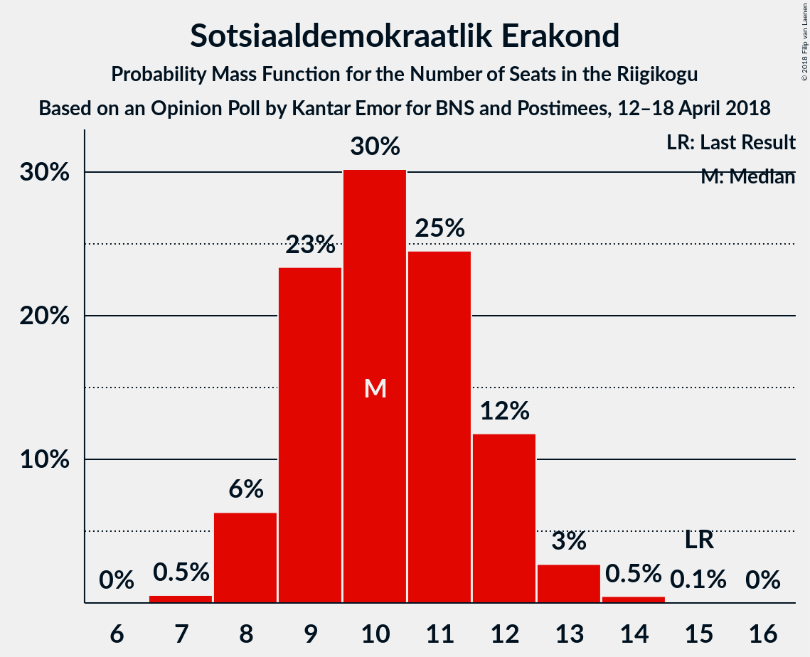
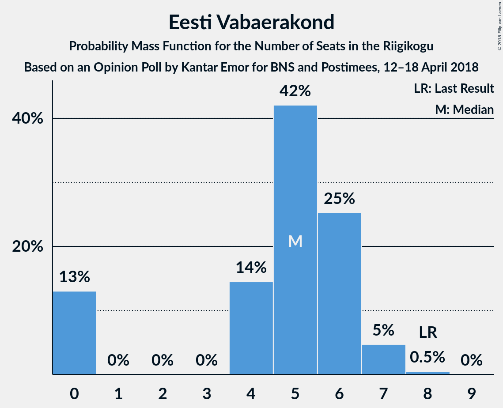

# Opinion Poll by Kantar Emor for BNS and Postimees, 12–18 April 2018

<a href="#voting-intentions">Voting Intentions</a> | <a href="#seats">Seats</a> | <a href="#coalitions">Coalitions</a> | <a href="#technical-information">Technical Information</a>

## Voting Intentions

### Confidence Intervals

| Party | Last Result | Poll Result | 80% Confidence Interval | 90% Confidence Interval | 95% Confidence Interval | 99% Confidence Interval |
|:-----:|:-----------:|:-----------:|:-----------------------:|:-----------------------:|:-----------------------:|:-----------------------:|
| Eesti Reformierakond | 27.7% | 30.0% | 28.1–32.0% |27.5–32.5% |27.1–33.0% |26.2–34.0% |
| Eesti Keskerakond | 24.8% | 21.6% | 19.9–23.4% |19.4–23.9% |19.0–24.4% |18.2–25.3% |
| Eesti Konservatiivne Rahvaerakond | 8.1% | 19.1% | 17.5–20.8% |17.0–21.3% |16.6–21.7% |15.9–22.6% |
| Sotsiaaldemokraatlik Erakond | 15.2% | 10.6% | 9.4–12.0% |9.0–12.4% |8.7–12.7% |8.2–13.5% |
| Erakond Eestimaa Rohelised | 0.9% | 6.1% | 5.2–7.2% |4.9–7.5% |4.7–7.8% |4.3–8.4% |
| Erakond Isamaa | 13.7% | 5.8% | 5.0–7.0% |4.7–7.3% |4.5–7.6% |4.1–8.1% |
| Eesti Vabaerakond | 8.7% | 5.8% | 5.0–7.0% |4.7–7.3% |4.5–7.6% |4.1–8.1% |

*Note:* The poll result column reflects the actual value used in the calculations. Published results may vary slightly, and in addition be rounded to fewer digits.

## Seats

### Confidence Intervals

| Party | Last Result | Median | 80% Confidence Interval | 90% Confidence Interval | 95% Confidence Interval | 99% Confidence Interval |
|:-----:|:-----------:|:------:|:-----------------------:|:-----------------------:|:-----------------------:|:-----------------------:|
| <a href="#eesti-reformierakond">Eesti Reformierakond</a> | 30 | 33 | 31–36 |30–37 |29–38 |29–39 |
| <a href="#eesti-keskerakond">Eesti Keskerakond</a> | 27 | 23 | 21–25 |20–26 |20–27 |19–28 |
| <a href="#eesti-konservatiivne-rahvaerakond">Eesti Konservatiivne Rahvaerakond</a> | 7 | 20 | 18–22 |17–23 |17–23 |16–25 |
| <a href="#sotsiaaldemokraatlik-erakond">Sotsiaaldemokraatlik Erakond</a> | 15 | 10 | 9–12 |8–12 |8–13 |7–14 |
| <a href="#erakond-eestimaa-rohelised">Erakond Eestimaa Rohelised</a> | 0 | 5 | 4–6 |0–7 |0–7 |0–8 |
| <a href="#erakond-isamaa">Erakond Isamaa</a> | 14 | 5 | 4–6 |0–7 |0–7 |0–7 |
| <a href="#eesti-vabaerakond">Eesti Vabaerakond</a> | 8 | 5 | 0–6 |0–7 |0–7 |0–7 |

### Eesti Reformierakond

*For a full overview of the results for this party, see the [Eesti Reformierakond](party-eestireformierakond.html) page.*

| Number of Seats | Probability | Accumulated | Special Marks |
|:---------------:|:-----------:|:-----------:|:-------------:|
| 27 | 0.1% | 100% |  |
| 28 | 0.4% | 99.9% |  |
| 29 | 2% | 99.5% |  |
| 30 | 5% | 97% | Last Result |
| 31 | 12% | 93% |  |
| 32 | 17% | 81% |  |
| 33 | 18% | 64% | Median |
| 34 | 19% | 46% |  |
| 35 | 12% | 27% |  |
| 36 | 8% | 15% |  |
| 37 | 4% | 7% |  |
| 38 | 2% | 3% |  |
| 39 | 0.6% | 0.9% |  |
| 40 | 0.3% | 0.3% |  |
| 41 | 0.1% | 0.1% |  |
| 42 | 0% | 0% |  |

### Eesti Keskerakond

*For a full overview of the results for this party, see the [Eesti Keskerakond](party-eestikeskerakond.html) page.*

| Number of Seats | Probability | Accumulated | Special Marks |
|:---------------:|:-----------:|:-----------:|:-------------:|
| 18 | 0.2% | 100% |  |
| 19 | 1.4% | 99.8% |  |
| 20 | 5% | 98% |  |
| 21 | 11% | 93% |  |
| 22 | 21% | 82% |  |
| 23 | 21% | 61% | Median |
| 24 | 19% | 40% |  |
| 25 | 13% | 22% |  |
| 26 | 6% | 9% |  |
| 27 | 2% | 3% | Last Result |
| 28 | 0.7% | 0.9% |  |
| 29 | 0.2% | 0.2% |  |
| 30 | 0% | 0% |  |

### Eesti Konservatiivne Rahvaerakond

*For a full overview of the results for this party, see the [Eesti Konservatiivne Rahvaerakond](party-eestikonservatiivnerahvaerakond.html) page.*

| Number of Seats | Probability | Accumulated | Special Marks |
|:---------------:|:-----------:|:-----------:|:-------------:|
| 7 | 0% | 100% | Last Result |
| 8 | 0% | 100% |  |
| 9 | 0% | 100% |  |
| 10 | 0% | 100% |  |
| 11 | 0% | 100% |  |
| 12 | 0% | 100% |  |
| 13 | 0% | 100% |  |
| 14 | 0% | 100% |  |
| 15 | 0.1% | 100% |  |
| 16 | 1.0% | 99.9% |  |
| 17 | 4% | 98.9% |  |
| 18 | 12% | 95% |  |
| 19 | 20% | 83% |  |
| 20 | 25% | 62% | Median |
| 21 | 20% | 38% |  |
| 22 | 11% | 18% |  |
| 23 | 5% | 7% |  |
| 24 | 2% | 2% |  |
| 25 | 0.4% | 0.6% |  |
| 26 | 0.1% | 0.1% |  |
| 27 | 0% | 0% |  |

### Sotsiaaldemokraatlik Erakond

*For a full overview of the results for this party, see the [Sotsiaaldemokraatlik Erakond](party-sotsiaaldemokraatlikerakond.html) page.*

| Number of Seats | Probability | Accumulated | Special Marks |
|:---------------:|:-----------:|:-----------:|:-------------:|
| 7 | 0.5% | 100% |  |
| 8 | 6% | 99.4% |  |
| 9 | 23% | 93% |  |
| 10 | 30% | 70% | Median |
| 11 | 25% | 40% |  |
| 12 | 12% | 15% |  |
| 13 | 3% | 3% |  |
| 14 | 0.5% | 0.5% |  |
| 15 | 0.1% | 0.1% | Last Result |
| 16 | 0% | 0% |  |

### Erakond Eestimaa Rohelised

*For a full overview of the results for this party, see the [Erakond Eestimaa Rohelised](party-erakondeestimaarohelised.html) page.*

| Number of Seats | Probability | Accumulated | Special Marks |
|:---------------:|:-----------:|:-----------:|:-------------:|
| 0 | 8% | 100% | Last Result |
| 1 | 0% | 92% |  |
| 2 | 0% | 92% |  |
| 3 | 0% | 92% |  |
| 4 | 9% | 92% |  |
| 5 | 43% | 83% | Median |
| 6 | 32% | 41% |  |
| 7 | 8% | 9% |  |
| 8 | 0.9% | 1.0% |  |
| 9 | 0.1% | 0.1% |  |
| 10 | 0% | 0% |  |

### Erakond Isamaa

*For a full overview of the results for this party, see the [Erakond Isamaa](party-erakondisamaa.html) page.*

| Number of Seats | Probability | Accumulated | Special Marks |
|:---------------:|:-----------:|:-----------:|:-------------:|
| 0 | 8% | 100% |  |
| 1 | 0% | 92% |  |
| 2 | 0% | 92% |  |
| 3 | 0% | 92% |  |
| 4 | 24% | 92% |  |
| 5 | 37% | 68% | Median |
| 6 | 24% | 31% |  |
| 7 | 6% | 7% |  |
| 8 | 0.3% | 0.3% |  |
| 9 | 0% | 0% |  |
| 10 | 0% | 0% |  |
| 11 | 0% | 0% |  |
| 12 | 0% | 0% |  |
| 13 | 0% | 0% |  |
| 14 | 0% | 0% | Last Result |

### Eesti Vabaerakond

*For a full overview of the results for this party, see the [Eesti Vabaerakond](party-eestivabaerakond.html) page.*

| Number of Seats | Probability | Accumulated | Special Marks |
|:---------------:|:-----------:|:-----------:|:-------------:|
| 0 | 13% | 100% |  |
| 1 | 0% | 87% |  |
| 2 | 0% | 87% |  |
| 3 | 0% | 87% |  |
| 4 | 14% | 87% |  |
| 5 | 42% | 73% | Median |
| 6 | 25% | 30% |  |
| 7 | 5% | 5% |  |
| 8 | 0.5% | 0.5% | Last Result |
| 9 | 0% | 0% |  |

## Coalitions

### Confidence Intervals

| Coalition | Last Result | Median | Majority? | 80% Confidence Interval | 90% Confidence Interval | 95% Confidence Interval | 99% Confidence Interval |
|:---------:|:-----------:|:------:|:---------:|:-----------------------:|:-----------------------:|:-----------------------:|:-----------------------:|
| Eesti Reformierakond – Eesti Keskerakond – Eesti Konservatiivne Rahvaerakond | 64 | 76 | 100% | 73–80 | 73–81 | 72–82 | 71–85 |
| Eesti Reformierakond – Eesti Konservatiivne Rahvaerakond – Erakond Isamaa | 51 | 58 | 99.9% | 55–61 | 54–62 | 54–63 | 52–65 |
| Eesti Reformierakond – Eesti Keskerakond | 57 | 56 | 99.7% | 53–60 | 53–61 | 52–62 | 51–64 |
| Eesti Reformierakond – Eesti Konservatiivne Rahvaerakond | 37 | 53 | 89% | 50–57 | 50–58 | 49–59 | 48–61 |
| Eesti Reformierakond – Sotsiaaldemokraatlik Erakond – Eesti Vabaerakond – Erakond Isamaa | 67 | 53 | 84% | 50–56 | 49–57 | 48–57 | 47–59 |
| Eesti Reformierakond – Sotsiaaldemokraatlik Erakond – Erakond Isamaa | 59 | 48 | 18% | 45–51 | 44–52 | 44–53 | 42–55 |
| Eesti Keskerakond – Eesti Konservatiivne Rahvaerakond | 34 | 43 | 0.2% | 40–46 | 40–47 | 39–48 | 38–49 |
| Eesti Reformierakond – Sotsiaaldemokraatlik Erakond | 45 | 43 | 0.3% | 41–46 | 40–47 | 39–48 | 38–50 |
| Eesti Reformierakond – Erakond Isamaa | 44 | 38 | 0% | 35–41 | 34–42 | 33–43 | 32–44 |
| Eesti Keskerakond – Sotsiaaldemokraatlik Erakond – Erakond Isamaa | 56 | 38 | 0% | 35–41 | 34–42 | 33–42 | 32–44 |
| Eesti Keskerakond – Sotsiaaldemokraatlik Erakond | 42 | 33 | 0% | 31–36 | 30–37 | 29–38 | 28–39 |
| Eesti Konservatiivne Rahvaerakond – Sotsiaaldemokraatlik Erakond | 22 | 30 | 0% | 28–33 | 27–34 | 27–34 | 26–36 |

### Eesti Reformierakond – Eesti Keskerakond – Eesti Konservatiivne Rahvaerakond

| Number of Seats | Probability | Accumulated | Special Marks |
|:---------------:|:-----------:|:-----------:|:-------------:|
| 64 | 0% | 100% | Last Result |
| 65 | 0% | 100% |  |
| 66 | 0% | 100% |  |
| 67 | 0% | 100% |  |
| 68 | 0% | 100% |  |
| 69 | 0% | 100% |  |
| 70 | 0.1% | 100% |  |
| 71 | 0.7% | 99.8% |  |
| 72 | 3% | 99.1% |  |
| 73 | 7% | 96% |  |
| 74 | 13% | 89% |  |
| 75 | 16% | 76% |  |
| 76 | 18% | 60% | Median |
| 77 | 12% | 42% |  |
| 78 | 9% | 30% |  |
| 79 | 7% | 21% |  |
| 80 | 6% | 14% |  |
| 81 | 4% | 8% |  |
| 82 | 2% | 4% |  |
| 83 | 1.0% | 2% |  |
| 84 | 0.5% | 1.2% |  |
| 85 | 0.3% | 0.7% |  |
| 86 | 0.3% | 0.4% |  |
| 87 | 0.1% | 0.1% |  |
| 88 | 0% | 0% |  |

### Eesti Reformierakond – Eesti Konservatiivne Rahvaerakond – Erakond Isamaa

| Number of Seats | Probability | Accumulated | Special Marks |
|:---------------:|:-----------:|:-----------:|:-------------:|
| 50 | 0% | 100% |  |
| 51 | 0.2% | 99.9% | Last Result, Majority |
| 52 | 0.6% | 99.7% |  |
| 53 | 1.4% | 99.1% |  |
| 54 | 4% | 98% |  |
| 55 | 7% | 94% |  |
| 56 | 13% | 87% |  |
| 57 | 19% | 74% |  |
| 58 | 12% | 55% | Median |
| 59 | 16% | 44% |  |
| 60 | 12% | 27% |  |
| 61 | 6% | 15% |  |
| 62 | 4% | 9% |  |
| 63 | 2% | 5% |  |
| 64 | 1.4% | 2% |  |
| 65 | 0.4% | 0.9% |  |
| 66 | 0.3% | 0.5% |  |
| 67 | 0.1% | 0.1% |  |
| 68 | 0% | 0.1% |  |
| 69 | 0% | 0% |  |

### Eesti Reformierakond – Eesti Keskerakond

| Number of Seats | Probability | Accumulated | Special Marks |
|:---------------:|:-----------:|:-----------:|:-------------:|
| 49 | 0.1% | 100% |  |
| 50 | 0.2% | 99.9% |  |
| 51 | 0.9% | 99.7% | Majority |
| 52 | 3% | 98.8% |  |
| 53 | 7% | 96% |  |
| 54 | 12% | 89% |  |
| 55 | 14% | 78% |  |
| 56 | 18% | 64% | Median |
| 57 | 16% | 46% | Last Result |
| 58 | 12% | 30% |  |
| 59 | 8% | 19% |  |
| 60 | 4% | 11% |  |
| 61 | 3% | 6% |  |
| 62 | 1.5% | 3% |  |
| 63 | 0.7% | 1.3% |  |
| 64 | 0.3% | 0.6% |  |
| 65 | 0.1% | 0.2% |  |
| 66 | 0.1% | 0.1% |  |
| 67 | 0% | 0% |  |

### Eesti Reformierakond – Eesti Konservatiivne Rahvaerakond

| Number of Seats | Probability | Accumulated | Special Marks |
|:---------------:|:-----------:|:-----------:|:-------------:|
| 37 | 0% | 100% | Last Result |
| 38 | 0% | 100% |  |
| 39 | 0% | 100% |  |
| 40 | 0% | 100% |  |
| 41 | 0% | 100% |  |
| 42 | 0% | 100% |  |
| 43 | 0% | 100% |  |
| 44 | 0% | 100% |  |
| 45 | 0% | 100% |  |
| 46 | 0.1% | 100% |  |
| 47 | 0.3% | 99.9% |  |
| 48 | 1.0% | 99.7% |  |
| 49 | 2% | 98.7% |  |
| 50 | 7% | 96% |  |
| 51 | 13% | 89% | Majority |
| 52 | 15% | 77% |  |
| 53 | 15% | 62% | Median |
| 54 | 17% | 46% |  |
| 55 | 11% | 29% |  |
| 56 | 7% | 18% |  |
| 57 | 5% | 11% |  |
| 58 | 3% | 6% |  |
| 59 | 2% | 3% |  |
| 60 | 0.4% | 1.0% |  |
| 61 | 0.5% | 0.6% |  |
| 62 | 0.1% | 0.2% |  |
| 63 | 0% | 0.1% |  |
| 64 | 0% | 0% |  |

### Eesti Reformierakond – Sotsiaaldemokraatlik Erakond – Eesti Vabaerakond – Erakond Isamaa

| Number of Seats | Probability | Accumulated | Special Marks |
|:---------------:|:-----------:|:-----------:|:-------------:|
| 44 | 0% | 100% |  |
| 45 | 0.1% | 99.9% |  |
| 46 | 0.3% | 99.8% |  |
| 47 | 0.9% | 99.5% |  |
| 48 | 2% | 98.6% |  |
| 49 | 4% | 97% |  |
| 50 | 9% | 92% |  |
| 51 | 13% | 84% | Majority |
| 52 | 16% | 71% |  |
| 53 | 16% | 55% | Median |
| 54 | 13% | 39% |  |
| 55 | 13% | 26% |  |
| 56 | 7% | 12% |  |
| 57 | 4% | 6% |  |
| 58 | 1.3% | 2% |  |
| 59 | 0.5% | 0.8% |  |
| 60 | 0.2% | 0.3% |  |
| 61 | 0.1% | 0.1% |  |
| 62 | 0% | 0% |  |
| 63 | 0% | 0% |  |
| 64 | 0% | 0% |  |
| 65 | 0% | 0% |  |
| 66 | 0% | 0% |  |
| 67 | 0% | 0% | Last Result |

### Eesti Reformierakond – Sotsiaaldemokraatlik Erakond – Erakond Isamaa

| Number of Seats | Probability | Accumulated | Special Marks |
|:---------------:|:-----------:|:-----------:|:-------------:|
| 40 | 0% | 100% |  |
| 41 | 0.2% | 99.9% |  |
| 42 | 0.5% | 99.7% |  |
| 43 | 1.5% | 99.2% |  |
| 44 | 3% | 98% |  |
| 45 | 6% | 94% |  |
| 46 | 11% | 89% |  |
| 47 | 16% | 77% |  |
| 48 | 17% | 62% | Median |
| 49 | 13% | 45% |  |
| 50 | 13% | 31% |  |
| 51 | 9% | 18% | Majority |
| 52 | 5% | 9% |  |
| 53 | 2% | 4% |  |
| 54 | 1.3% | 2% |  |
| 55 | 0.6% | 0.8% |  |
| 56 | 0.1% | 0.2% |  |
| 57 | 0.1% | 0.1% |  |
| 58 | 0% | 0% |  |
| 59 | 0% | 0% | Last Result |

### Eesti Keskerakond – Eesti Konservatiivne Rahvaerakond

| Number of Seats | Probability | Accumulated | Special Marks |
|:---------------:|:-----------:|:-----------:|:-------------:|
| 34 | 0% | 100% | Last Result |
| 35 | 0% | 100% |  |
| 36 | 0.1% | 100% |  |
| 37 | 0.3% | 99.9% |  |
| 38 | 0.9% | 99.7% |  |
| 39 | 3% | 98.7% |  |
| 40 | 7% | 96% |  |
| 41 | 16% | 89% |  |
| 42 | 14% | 73% |  |
| 43 | 18% | 59% | Median |
| 44 | 13% | 41% |  |
| 45 | 13% | 29% |  |
| 46 | 9% | 16% |  |
| 47 | 3% | 6% |  |
| 48 | 2% | 3% |  |
| 49 | 0.9% | 1.3% |  |
| 50 | 0.3% | 0.5% |  |
| 51 | 0.1% | 0.2% | Majority |
| 52 | 0% | 0% |  |

### Eesti Reformierakond – Sotsiaaldemokraatlik Erakond

| Number of Seats | Probability | Accumulated | Special Marks |
|:---------------:|:-----------:|:-----------:|:-------------:|
| 37 | 0.1% | 100% |  |
| 38 | 0.7% | 99.8% |  |
| 39 | 2% | 99.2% |  |
| 40 | 5% | 97% |  |
| 41 | 10% | 92% |  |
| 42 | 16% | 82% |  |
| 43 | 19% | 66% | Median |
| 44 | 15% | 48% |  |
| 45 | 14% | 33% | Last Result |
| 46 | 9% | 19% |  |
| 47 | 5% | 10% |  |
| 48 | 3% | 5% |  |
| 49 | 1.1% | 2% |  |
| 50 | 0.6% | 0.9% |  |
| 51 | 0.2% | 0.3% | Majority |
| 52 | 0.1% | 0.1% |  |
| 53 | 0% | 0% |  |

### Eesti Reformierakond – Erakond Isamaa

| Number of Seats | Probability | Accumulated | Special Marks |
|:---------------:|:-----------:|:-----------:|:-------------:|
| 30 | 0.1% | 100% |  |
| 31 | 0.3% | 99.9% |  |
| 32 | 0.7% | 99.6% |  |
| 33 | 2% | 98.9% |  |
| 34 | 3% | 97% |  |
| 35 | 7% | 94% |  |
| 36 | 12% | 87% |  |
| 37 | 14% | 75% |  |
| 38 | 17% | 61% | Median |
| 39 | 18% | 44% |  |
| 40 | 11% | 26% |  |
| 41 | 8% | 15% |  |
| 42 | 4% | 7% |  |
| 43 | 2% | 3% |  |
| 44 | 0.6% | 1.0% | Last Result |
| 45 | 0.3% | 0.4% |  |
| 46 | 0.1% | 0.1% |  |
| 47 | 0% | 0% |  |

### Eesti Keskerakond – Sotsiaaldemokraatlik Erakond – Erakond Isamaa

| Number of Seats | Probability | Accumulated | Special Marks |
|:---------------:|:-----------:|:-----------:|:-------------:|
| 30 | 0.1% | 100% |  |
| 31 | 0.2% | 99.9% |  |
| 32 | 0.9% | 99.7% |  |
| 33 | 2% | 98.8% |  |
| 34 | 4% | 97% |  |
| 35 | 5% | 93% |  |
| 36 | 12% | 87% |  |
| 37 | 15% | 76% |  |
| 38 | 19% | 61% | Median |
| 39 | 15% | 41% |  |
| 40 | 13% | 27% |  |
| 41 | 8% | 14% |  |
| 42 | 4% | 6% |  |
| 43 | 1.2% | 2% |  |
| 44 | 0.8% | 1.1% |  |
| 45 | 0.2% | 0.3% |  |
| 46 | 0% | 0.1% |  |
| 47 | 0% | 0% |  |
| 48 | 0% | 0% |  |
| 49 | 0% | 0% |  |
| 50 | 0% | 0% |  |
| 51 | 0% | 0% | Majority |
| 52 | 0% | 0% |  |
| 53 | 0% | 0% |  |
| 54 | 0% | 0% |  |
| 55 | 0% | 0% |  |
| 56 | 0% | 0% | Last Result |

### Eesti Keskerakond – Sotsiaaldemokraatlik Erakond

| Number of Seats | Probability | Accumulated | Special Marks |
|:---------------:|:-----------:|:-----------:|:-------------:|
| 27 | 0.1% | 100% |  |
| 28 | 0.4% | 99.9% |  |
| 29 | 2% | 99.5% |  |
| 30 | 4% | 97% |  |
| 31 | 13% | 93% |  |
| 32 | 17% | 80% |  |
| 33 | 16% | 63% | Median |
| 34 | 20% | 47% |  |
| 35 | 13% | 27% |  |
| 36 | 8% | 14% |  |
| 37 | 4% | 6% |  |
| 38 | 2% | 3% |  |
| 39 | 0.6% | 0.9% |  |
| 40 | 0.2% | 0.3% |  |
| 41 | 0% | 0.1% |  |
| 42 | 0% | 0% | Last Result |

### Eesti Konservatiivne Rahvaerakond – Sotsiaaldemokraatlik Erakond

| Number of Seats | Probability | Accumulated | Special Marks |
|:---------------:|:-----------:|:-----------:|:-------------:|
| 22 | 0% | 100% | Last Result |
| 23 | 0% | 100% |  |
| 24 | 0.1% | 100% |  |
| 25 | 0.4% | 99.9% |  |
| 26 | 2% | 99.5% |  |
| 27 | 6% | 98% |  |
| 28 | 11% | 92% |  |
| 29 | 18% | 81% |  |
| 30 | 19% | 63% | Median |
| 31 | 19% | 44% |  |
| 32 | 12% | 25% |  |
| 33 | 7% | 13% |  |
| 34 | 4% | 6% |  |
| 35 | 1.3% | 2% |  |
| 36 | 0.6% | 0.7% |  |
| 37 | 0.1% | 0.1% |  |
| 38 | 0% | 0% |  |

## Technical Information

### Opinion Poll

+ **Polling firm:** Kantar Emor
+ **Commissioner(s):** BNS and Postimees
+ **Fieldwork period:** 12–18 April 2018

### Calculations

+ **Sample size:** 908
+ **Simulations done:** 1,048,576
+ **Error estimate:** 1.65%

