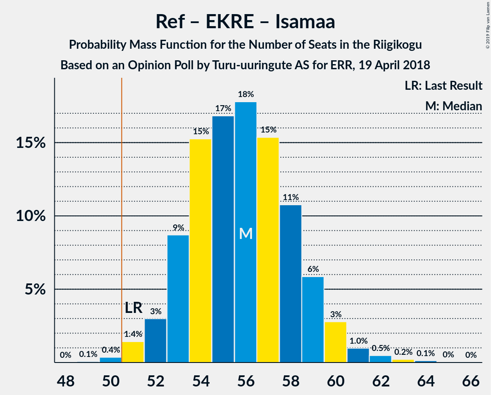
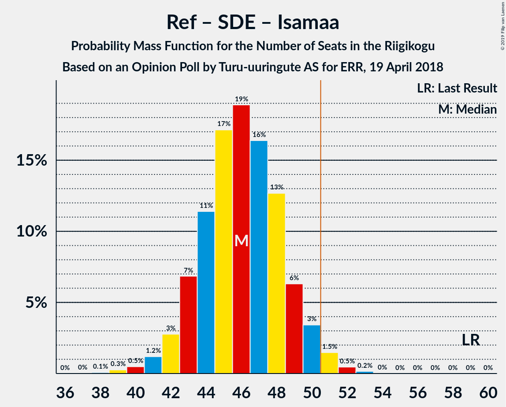

# Opinion Poll by Turu-uuringute AS for ERR, 19 April 2018

<a href="#voting-intentions">Voting Intentions</a> | <a href="#seats">Seats</a> | <a href="#coalitions">Coalitions</a> | <a href="#technical-information">Technical Information</a>

## Voting Intentions

### Confidence Intervals

| Party | Last Result | Poll Result | 80% Confidence Interval | 90% Confidence Interval | 95% Confidence Interval | 99% Confidence Interval |
|:-----:|:-----------:|:-----------:|:-----------------------:|:-----------------------:|:-----------------------:|:-----------------------:|
| Eesti Reformierakond | 27.7% | 33.7% | 31.8–35.7% |31.3–36.2% |30.8–36.7% |29.9–37.6% |
| Eesti Keskerakond | 24.8% | 26.5% | 24.8–28.3% |24.3–28.9% |23.9–29.3% |23.0–30.2% |
| Eesti Konservatiivne Rahvaerakond | 8.1% | 14.3% | 13.0–15.8% |12.6–16.2% |12.3–16.6% |11.6–17.4% |
| Sotsiaaldemokraatlik Erakond | 15.2% | 6.1% | 5.2–7.2% |5.0–7.5% |4.8–7.8% |4.4–8.3% |
| Erakond Isamaa | 13.7% | 4.1% | 3.4–5.0% |3.2–5.3% |3.0–5.5% |2.7–6.0% |
| Eesti Vabaerakond | 8.7% | 3.1% | 2.5–3.9% |2.3–4.2% |2.2–4.4% |1.9–4.8% |
| Erakond Eestimaa Rohelised | 0.9% | 3.1% | 2.5–3.9% |2.3–4.2% |2.2–4.4% |1.9–4.8% |

*Note:* The poll result column reflects the actual value used in the calculations. Published results may vary slightly, and in addition be rounded to fewer digits.

## Seats

### Confidence Intervals

| Party | Last Result | Median | 80% Confidence Interval | 90% Confidence Interval | 95% Confidence Interval | 99% Confidence Interval |
|:-----:|:-----------:|:------:|:-----------------------:|:-----------------------:|:-----------------------:|:-----------------------:|
| <a href="#eesti-reformierakond">Eesti Reformierakond</a> | 30 | 39 | 36–41 |35–41 |34–42 |33–42 |
| <a href="#eesti-keskerakond">Eesti Keskerakond</a> | 27 | 33 | 28–33 |27–33 |26–33 |25–33 |
| <a href="#eesti-konservatiivne-rahvaerakond">Eesti Konservatiivne Rahvaerakond</a> | 7 | 15 | 14–16 |12–19 |12–19 |12–19 |
| <a href="#sotsiaaldemokraatlik-erakond">Sotsiaaldemokraatlik Erakond</a> | 15 | 7 | 0–9 |0–9 |0–9 |0–10 |
| <a href="#erakond-isamaa">Erakond Isamaa</a> | 14 | 0 | 0–5 |0–5 |0–6 |0–6 |
| <a href="#eesti-vabaerakond">Eesti Vabaerakond</a> | 8 | 0 | 0 |0–5 |0–5 |0–5 |
| <a href="#erakond-eestimaa-rohelised">Erakond Eestimaa Rohelised</a> | 0 | 0 | 0 |0 |0 |0 |

### Eesti Reformierakond

*For a full overview of the results for this party, see the [Eesti Reformierakond](party-eestireformierakond.html) page.*

| Number of Seats | Probability | Accumulated | Special Marks |
|:---------------:|:-----------:|:-----------:|:-------------:|
| 30 | 0% | 100% | Last Result |
| 31 | 0% | 100% |  |
| 32 | 0.1% | 100% |  |
| 33 | 1.2% | 99.9% |  |
| 34 | 1.3% | 98.7% |  |
| 35 | 3% | 97% |  |
| 36 | 25% | 95% |  |
| 37 | 14% | 70% |  |
| 38 | 0.3% | 56% |  |
| 39 | 28% | 56% | Median |
| 40 | 14% | 28% |  |
| 41 | 9% | 14% |  |
| 42 | 4% | 5% |  |
| 43 | 0.1% | 0.5% |  |
| 44 | 0% | 0.3% |  |
| 45 | 0% | 0.3% |  |
| 46 | 0.1% | 0.3% |  |
| 47 | 0% | 0.2% |  |
| 48 | 0.1% | 0.1% |  |
| 49 | 0.1% | 0.1% |  |
| 50 | 0% | 0% |  |

### Eesti Keskerakond

*For a full overview of the results for this party, see the [Eesti Keskerakond](party-eestikeskerakond.html) page.*

| Number of Seats | Probability | Accumulated | Special Marks |
|:---------------:|:-----------:|:-----------:|:-------------:|
| 24 | 0.2% | 100% |  |
| 25 | 0.4% | 99.8% |  |
| 26 | 3% | 99.4% |  |
| 27 | 5% | 96% | Last Result |
| 28 | 13% | 91% |  |
| 29 | 9% | 79% |  |
| 30 | 0.4% | 70% |  |
| 31 | 3% | 70% |  |
| 32 | 6% | 66% |  |
| 33 | 60% | 60% | Median |
| 34 | 0.1% | 0.2% |  |
| 35 | 0% | 0% |  |

### Eesti Konservatiivne Rahvaerakond

*For a full overview of the results for this party, see the [Eesti Konservatiivne Rahvaerakond](party-eestikonservatiivnerahvaerakond.html) page.*

| Number of Seats | Probability | Accumulated | Special Marks |
|:---------------:|:-----------:|:-----------:|:-------------:|
| 7 | 0% | 100% | Last Result |
| 8 | 0% | 100% |  |
| 9 | 0% | 100% |  |
| 10 | 0% | 100% |  |
| 11 | 0% | 100% |  |
| 12 | 6% | 100% |  |
| 13 | 0.3% | 93% |  |
| 14 | 43% | 93% |  |
| 15 | 32% | 50% | Median |
| 16 | 9% | 19% |  |
| 17 | 1.4% | 9% |  |
| 18 | 0.8% | 8% |  |
| 19 | 7% | 7% |  |
| 20 | 0.1% | 0.1% |  |
| 21 | 0% | 0% |  |

### Sotsiaaldemokraatlik Erakond

*For a full overview of the results for this party, see the [Sotsiaaldemokraatlik Erakond](party-sotsiaaldemokraatlikerakond.html) page.*

| Number of Seats | Probability | Accumulated | Special Marks |
|:---------------:|:-----------:|:-----------:|:-------------:|
| 0 | 25% | 100% |  |
| 1 | 0% | 75% |  |
| 2 | 0% | 75% |  |
| 3 | 0% | 75% |  |
| 4 | 0.2% | 75% |  |
| 5 | 7% | 74% |  |
| 6 | 5% | 67% |  |
| 7 | 21% | 62% | Median |
| 8 | 28% | 41% |  |
| 9 | 12% | 13% |  |
| 10 | 0.5% | 0.5% |  |
| 11 | 0% | 0% |  |
| 12 | 0% | 0% |  |
| 13 | 0% | 0% |  |
| 14 | 0% | 0% |  |
| 15 | 0% | 0% | Last Result |

### Erakond Isamaa

*For a full overview of the results for this party, see the [Erakond Isamaa](party-erakondisamaa.html) page.*

| Number of Seats | Probability | Accumulated | Special Marks |
|:---------------:|:-----------:|:-----------:|:-------------:|
| 0 | 68% | 100% | Median |
| 1 | 0% | 32% |  |
| 2 | 0% | 32% |  |
| 3 | 0% | 32% |  |
| 4 | 2% | 32% |  |
| 5 | 25% | 30% |  |
| 6 | 4% | 4% |  |
| 7 | 0% | 0% |  |
| 8 | 0% | 0% |  |
| 9 | 0% | 0% |  |
| 10 | 0% | 0% |  |
| 11 | 0% | 0% |  |
| 12 | 0% | 0% |  |
| 13 | 0% | 0% |  |
| 14 | 0% | 0% | Last Result |

### Eesti Vabaerakond

*For a full overview of the results for this party, see the [Eesti Vabaerakond](party-eestivabaerakond.html) page.*

| Number of Seats | Probability | Accumulated | Special Marks |
|:---------------:|:-----------:|:-----------:|:-------------:|
| 0 | 93% | 100% | Median |
| 1 | 0% | 7% |  |
| 2 | 0% | 7% |  |
| 3 | 0% | 7% |  |
| 4 | 0% | 7% |  |
| 5 | 7% | 7% |  |
| 6 | 0% | 0% |  |
| 7 | 0% | 0% |  |
| 8 | 0% | 0% | Last Result |

### Erakond Eestimaa Rohelised

*For a full overview of the results for this party, see the [Erakond Eestimaa Rohelised](party-erakondeestimaarohelised.html) page.*

| Number of Seats | Probability | Accumulated | Special Marks |
|:---------------:|:-----------:|:-----------:|:-------------:|
| 0 | 99.8% | 100% | Last Result, Median |
| 1 | 0% | 0.2% |  |
| 2 | 0% | 0.2% |  |
| 3 | 0% | 0.2% |  |
| 4 | 0.1% | 0.2% |  |
| 5 | 0.1% | 0.1% |  |
| 6 | 0% | 0% |  |

## Coalitions

### Confidence Intervals

| Coalition | Last Result | Median | Majority? | 80% Confidence Interval | 90% Confidence Interval | 95% Confidence Interval | 99% Confidence Interval |
|:---------:|:-----------:|:------:|:---------:|:-----------------------:|:-----------------------:|:-----------------------:|:-----------------------:|
| Eesti Reformierakond – Eesti Keskerakond – Eesti Konservatiivne Rahvaerakond | 64 | 84 | 100% | 82–87 | 81–88 | 80–89 | 80–89 |
| Eesti Reformierakond – Eesti Keskerakond | 57 | 69 | 100% | 66–72 | 66–72 | 66–74 | 64–74 |
| Eesti Reformierakond – Eesti Konservatiivne Rahvaerakond – Erakond Isamaa | 51 | 55 | 70% | 50–59 | 50–61 | 49–61 | 49–61 |
| Eesti Reformierakond – Eesti Konservatiivne Rahvaerakond | 37 | 53 | 70% | 50–58 | 50–58 | 49–58 | 49–59 |
| Eesti Reformierakond – Sotsiaaldemokraatlik Erakond – Erakond Isamaa – Eesti Vabaerakond | 67 | 45 | 5% | 44–50 | 44–51 | 43–51 | 42–53 |
| Eesti Reformierakond – Sotsiaaldemokraatlik Erakond – Erakond Isamaa | 59 | 44 | 4% | 44–49 | 43–50 | 41–51 | 39–53 |
| Eesti Reformierakond – Sotsiaaldemokraatlik Erakond | 45 | 44 | 0% | 39–47 | 39–48 | 39–49 | 37–49 |
| Eesti Keskerakond – Eesti Konservatiivne Rahvaerakond | 34 | 47 | 0.7% | 43–48 | 42–48 | 40–48 | 40–51 |
| Eesti Reformierakond – Erakond Isamaa | 44 | 40 | 0.2% | 36–44 | 35–46 | 35–46 | 33–47 |
| Eesti Keskerakond – Sotsiaaldemokraatlik Erakond – Erakond Isamaa | 56 | 38 | 0% | 35–42 | 34–42 | 31–42 | 31–42 |
| Eesti Keskerakond – Sotsiaaldemokraatlik Erakond | 42 | 36 | 0% | 33–42 | 32–42 | 31–42 | 30–42 |
| Eesti Konservatiivne Rahvaerakond – Sotsiaaldemokraatlik Erakond | 22 | 22 | 0% | 15–23 | 15–26 | 15–26 | 13–26 |

### Eesti Reformierakond – Eesti Keskerakond – Eesti Konservatiivne Rahvaerakond

| Number of Seats | Probability | Accumulated | Special Marks |
|:---------------:|:-----------:|:-----------:|:-------------:|
| 64 | 0% | 100% | Last Result |
| 65 | 0% | 100% |  |
| 66 | 0% | 100% |  |
| 67 | 0% | 100% |  |
| 68 | 0% | 100% |  |
| 69 | 0% | 100% |  |
| 70 | 0% | 100% |  |
| 71 | 0% | 100% |  |
| 72 | 0% | 100% |  |
| 73 | 0% | 100% |  |
| 74 | 0% | 100% |  |
| 75 | 0% | 100% |  |
| 76 | 0% | 100% |  |
| 77 | 0% | 100% |  |
| 78 | 0.1% | 100% |  |
| 79 | 0.3% | 99.9% |  |
| 80 | 4% | 99.6% |  |
| 81 | 5% | 96% |  |
| 82 | 4% | 91% |  |
| 83 | 30% | 87% |  |
| 84 | 21% | 57% |  |
| 85 | 6% | 36% |  |
| 86 | 5% | 30% |  |
| 87 | 20% | 25% | Median |
| 88 | 0.8% | 5% |  |
| 89 | 4% | 4% |  |
| 90 | 0% | 0.2% |  |
| 91 | 0% | 0.2% |  |
| 92 | 0.1% | 0.1% |  |
| 93 | 0.1% | 0.1% |  |
| 94 | 0% | 0% |  |

### Eesti Reformierakond – Eesti Keskerakond

| Number of Seats | Probability | Accumulated | Special Marks |
|:---------------:|:-----------:|:-----------:|:-------------:|
| 57 | 0% | 100% | Last Result |
| 58 | 0% | 100% |  |
| 59 | 0% | 100% |  |
| 60 | 0% | 100% |  |
| 61 | 0.1% | 100% |  |
| 62 | 0% | 99.9% |  |
| 63 | 0.1% | 99.9% |  |
| 64 | 1.3% | 99.8% |  |
| 65 | 0.7% | 98% |  |
| 66 | 9% | 98% |  |
| 67 | 3% | 89% |  |
| 68 | 7% | 86% |  |
| 69 | 35% | 79% |  |
| 70 | 17% | 43% |  |
| 71 | 4% | 27% |  |
| 72 | 18% | 23% | Median |
| 73 | 0.2% | 5% |  |
| 74 | 5% | 5% |  |
| 75 | 0% | 0.1% |  |
| 76 | 0.1% | 0.1% |  |
| 77 | 0% | 0% |  |

### Eesti Reformierakond – Eesti Konservatiivne Rahvaerakond – Erakond Isamaa

| Number of Seats | Probability | Accumulated | Special Marks |
|:---------------:|:-----------:|:-----------:|:-------------:|
| 48 | 0.1% | 100% |  |
| 49 | 3% | 99.9% |  |
| 50 | 26% | 96% |  |
| 51 | 13% | 70% | Last Result, Majority |
| 52 | 2% | 58% |  |
| 53 | 1.3% | 55% |  |
| 54 | 0% | 54% | Median |
| 55 | 6% | 54% |  |
| 56 | 5% | 49% |  |
| 57 | 1.0% | 44% |  |
| 58 | 16% | 43% |  |
| 59 | 22% | 27% |  |
| 60 | 0.3% | 5% |  |
| 61 | 5% | 5% |  |
| 62 | 0% | 0.3% |  |
| 63 | 0% | 0.3% |  |
| 64 | 0% | 0.3% |  |
| 65 | 0.2% | 0.3% |  |
| 66 | 0% | 0.1% |  |
| 67 | 0.1% | 0.1% |  |
| 68 | 0% | 0% |  |

### Eesti Reformierakond – Eesti Konservatiivne Rahvaerakond

| Number of Seats | Probability | Accumulated | Special Marks |
|:---------------:|:-----------:|:-----------:|:-------------:|
| 37 | 0% | 100% | Last Result |
| 38 | 0% | 100% |  |
| 39 | 0% | 100% |  |
| 40 | 0% | 100% |  |
| 41 | 0% | 100% |  |
| 42 | 0% | 100% |  |
| 43 | 0% | 100% |  |
| 44 | 0% | 100% |  |
| 45 | 0% | 100% |  |
| 46 | 0% | 100% |  |
| 47 | 0% | 100% |  |
| 48 | 0.1% | 100% |  |
| 49 | 4% | 99.9% |  |
| 50 | 26% | 96% |  |
| 51 | 13% | 70% | Majority |
| 52 | 5% | 58% |  |
| 53 | 5% | 53% |  |
| 54 | 21% | 48% | Median |
| 55 | 6% | 27% |  |
| 56 | 9% | 21% |  |
| 57 | 0.8% | 12% |  |
| 58 | 9% | 11% |  |
| 59 | 2% | 2% |  |
| 60 | 0.1% | 0.4% |  |
| 61 | 0.1% | 0.3% |  |
| 62 | 0.1% | 0.2% |  |
| 63 | 0% | 0.1% |  |
| 64 | 0% | 0.1% |  |
| 65 | 0.1% | 0.1% |  |
| 66 | 0% | 0% |  |

### Eesti Reformierakond – Sotsiaaldemokraatlik Erakond – Erakond Isamaa – Eesti Vabaerakond

| Number of Seats | Probability | Accumulated | Special Marks |
|:---------------:|:-----------:|:-----------:|:-------------:|
| 40 | 0% | 100% |  |
| 41 | 0.2% | 99.9% |  |
| 42 | 1.3% | 99.8% |  |
| 43 | 3% | 98% |  |
| 44 | 46% | 96% |  |
| 45 | 1.4% | 50% |  |
| 46 | 22% | 49% | Median |
| 47 | 7% | 26% |  |
| 48 | 2% | 19% |  |
| 49 | 5% | 17% |  |
| 50 | 6% | 12% |  |
| 51 | 3% | 5% | Majority |
| 52 | 0% | 2% |  |
| 53 | 2% | 2% |  |
| 54 | 0% | 0.2% |  |
| 55 | 0.1% | 0.2% |  |
| 56 | 0% | 0% |  |
| 57 | 0% | 0% |  |
| 58 | 0% | 0% |  |
| 59 | 0% | 0% |  |
| 60 | 0% | 0% |  |
| 61 | 0% | 0% |  |
| 62 | 0% | 0% |  |
| 63 | 0% | 0% |  |
| 64 | 0% | 0% |  |
| 65 | 0% | 0% |  |
| 66 | 0% | 0% |  |
| 67 | 0% | 0% | Last Result |

### Eesti Reformierakond – Sotsiaaldemokraatlik Erakond – Erakond Isamaa

| Number of Seats | Probability | Accumulated | Special Marks |
|:---------------:|:-----------:|:-----------:|:-------------:|
| 37 | 0.1% | 100% |  |
| 38 | 0% | 99.9% |  |
| 39 | 1.0% | 99.9% |  |
| 40 | 0.8% | 98.9% |  |
| 41 | 0.7% | 98% |  |
| 42 | 1.2% | 97% |  |
| 43 | 3% | 96% |  |
| 44 | 45% | 94% |  |
| 45 | 4% | 48% |  |
| 46 | 23% | 44% | Median |
| 47 | 7% | 22% |  |
| 48 | 2% | 14% |  |
| 49 | 5% | 12% |  |
| 50 | 3% | 7% |  |
| 51 | 2% | 4% | Majority |
| 52 | 0% | 2% |  |
| 53 | 2% | 2% |  |
| 54 | 0% | 0.2% |  |
| 55 | 0.1% | 0.2% |  |
| 56 | 0% | 0% |  |
| 57 | 0% | 0% |  |
| 58 | 0% | 0% |  |
| 59 | 0% | 0% | Last Result |

### Eesti Reformierakond – Sotsiaaldemokraatlik Erakond

| Number of Seats | Probability | Accumulated | Special Marks |
|:---------------:|:-----------:|:-----------:|:-------------:|
| 37 | 0.9% | 100% |  |
| 38 | 0% | 99.1% |  |
| 39 | 21% | 99.1% |  |
| 40 | 0.9% | 78% |  |
| 41 | 5% | 77% |  |
| 42 | 0.6% | 73% |  |
| 43 | 3% | 72% |  |
| 44 | 26% | 69% |  |
| 45 | 7% | 44% | Last Result |
| 46 | 21% | 37% | Median |
| 47 | 9% | 16% |  |
| 48 | 2% | 7% |  |
| 49 | 4% | 5% |  |
| 50 | 0.3% | 0.3% |  |
| 51 | 0% | 0% | Majority |

### Eesti Keskerakond – Eesti Konservatiivne Rahvaerakond

| Number of Seats | Probability | Accumulated | Special Marks |
|:---------------:|:-----------:|:-----------:|:-------------:|
| 34 | 0% | 100% | Last Result |
| 35 | 0% | 100% |  |
| 36 | 0% | 100% |  |
| 37 | 0% | 100% |  |
| 38 | 0.2% | 100% |  |
| 39 | 0.2% | 99.8% |  |
| 40 | 4% | 99.5% |  |
| 41 | 0.3% | 95% |  |
| 42 | 2% | 95% |  |
| 43 | 5% | 93% |  |
| 44 | 12% | 87% |  |
| 45 | 1.2% | 75% |  |
| 46 | 9% | 74% |  |
| 47 | 40% | 65% |  |
| 48 | 23% | 24% | Median |
| 49 | 0.4% | 2% |  |
| 50 | 0.5% | 1.1% |  |
| 51 | 0.6% | 0.7% | Majority |
| 52 | 0.1% | 0.1% |  |
| 53 | 0% | 0% |  |

### Eesti Reformierakond – Erakond Isamaa

| Number of Seats | Probability | Accumulated | Special Marks |
|:---------------:|:-----------:|:-----------:|:-------------:|
| 32 | 0.1% | 100% |  |
| 33 | 1.1% | 99.9% |  |
| 34 | 1.3% | 98.8% |  |
| 35 | 3% | 98% |  |
| 36 | 25% | 95% |  |
| 37 | 13% | 70% |  |
| 38 | 0.1% | 57% |  |
| 39 | 6% | 57% | Median |
| 40 | 12% | 51% |  |
| 41 | 3% | 40% |  |
| 42 | 5% | 37% |  |
| 43 | 3% | 31% |  |
| 44 | 20% | 29% | Last Result |
| 45 | 0.2% | 9% |  |
| 46 | 6% | 9% |  |
| 47 | 2% | 2% |  |
| 48 | 0% | 0.3% |  |
| 49 | 0.1% | 0.3% |  |
| 50 | 0% | 0.2% |  |
| 51 | 0.1% | 0.2% | Majority |
| 52 | 0% | 0.1% |  |
| 53 | 0.1% | 0.1% |  |
| 54 | 0% | 0% |  |

### Eesti Keskerakond – Sotsiaaldemokraatlik Erakond – Erakond Isamaa

| Number of Seats | Probability | Accumulated | Special Marks |
|:---------------:|:-----------:|:-----------:|:-------------:|
| 27 | 0.1% | 100% |  |
| 28 | 0% | 99.9% |  |
| 29 | 0.1% | 99.9% |  |
| 30 | 0.2% | 99.8% |  |
| 31 | 2% | 99.6% |  |
| 32 | 1.2% | 97% |  |
| 33 | 0.7% | 96% |  |
| 34 | 5% | 95% |  |
| 35 | 8% | 91% |  |
| 36 | 8% | 83% |  |
| 37 | 4% | 75% |  |
| 38 | 23% | 71% |  |
| 39 | 3% | 48% |  |
| 40 | 7% | 45% | Median |
| 41 | 26% | 38% |  |
| 42 | 12% | 12% |  |
| 43 | 0.1% | 0.1% |  |
| 44 | 0% | 0% |  |
| 45 | 0% | 0% |  |
| 46 | 0% | 0% |  |
| 47 | 0% | 0% |  |
| 48 | 0% | 0% |  |
| 49 | 0% | 0% |  |
| 50 | 0% | 0% |  |
| 51 | 0% | 0% | Majority |
| 52 | 0% | 0% |  |
| 53 | 0% | 0% |  |
| 54 | 0% | 0% |  |
| 55 | 0% | 0% |  |
| 56 | 0% | 0% | Last Result |

### Eesti Keskerakond – Sotsiaaldemokraatlik Erakond

| Number of Seats | Probability | Accumulated | Special Marks |
|:---------------:|:-----------:|:-----------:|:-------------:|
| 24 | 0.1% | 100% |  |
| 25 | 0% | 99.9% |  |
| 26 | 0% | 99.9% |  |
| 27 | 0.1% | 99.9% |  |
| 28 | 0.1% | 99.8% |  |
| 29 | 0% | 99.7% |  |
| 30 | 0.3% | 99.7% |  |
| 31 | 2% | 99.4% |  |
| 32 | 4% | 97% |  |
| 33 | 25% | 93% |  |
| 34 | 7% | 68% |  |
| 35 | 8% | 62% |  |
| 36 | 10% | 53% |  |
| 37 | 1.1% | 43% |  |
| 38 | 0.8% | 42% |  |
| 39 | 0.2% | 41% |  |
| 40 | 3% | 41% | Median |
| 41 | 25% | 38% |  |
| 42 | 12% | 12% | Last Result |
| 43 | 0.1% | 0.1% |  |
| 44 | 0% | 0% |  |

### Eesti Konservatiivne Rahvaerakond – Sotsiaaldemokraatlik Erakond

| Number of Seats | Probability | Accumulated | Special Marks |
|:---------------:|:-----------:|:-----------:|:-------------:|
| 12 | 0.5% | 100% |  |
| 13 | 0.1% | 99.5% |  |
| 14 | 2% | 99.5% |  |
| 15 | 22% | 98% |  |
| 16 | 0.1% | 76% |  |
| 17 | 4% | 76% |  |
| 18 | 2% | 71% |  |
| 19 | 0.7% | 69% |  |
| 20 | 0.1% | 68% |  |
| 21 | 3% | 68% |  |
| 22 | 40% | 65% | Last Result, Median |
| 23 | 18% | 25% |  |
| 24 | 0.3% | 8% |  |
| 25 | 0.3% | 7% |  |
| 26 | 7% | 7% |  |
| 27 | 0.3% | 0.3% |  |
| 28 | 0% | 0% |  |

## Technical Information

### Opinion Poll

+ **Polling firm:** Turu-uuringute AS
+ **Commissioner(s):** ERR
+ **Fieldwork period:** 19 April 2018

### Calculations

+ **Sample size:** 1000
+ **Simulations done:** 1,024
+ **Error estimate:** 3.40%

