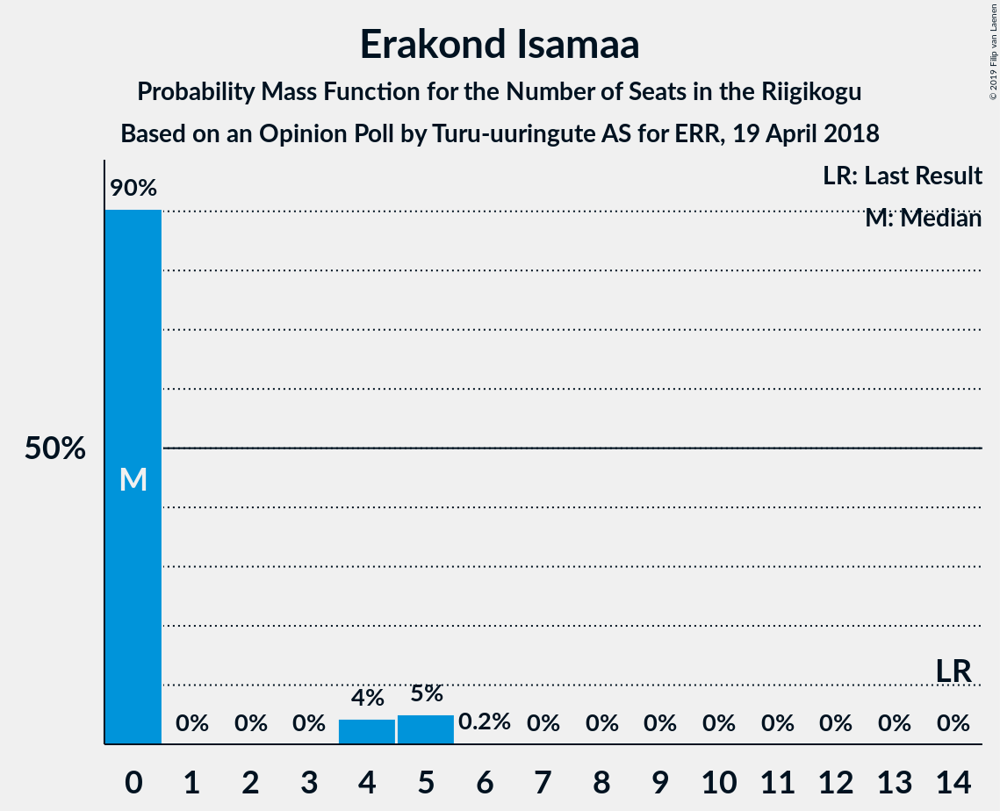
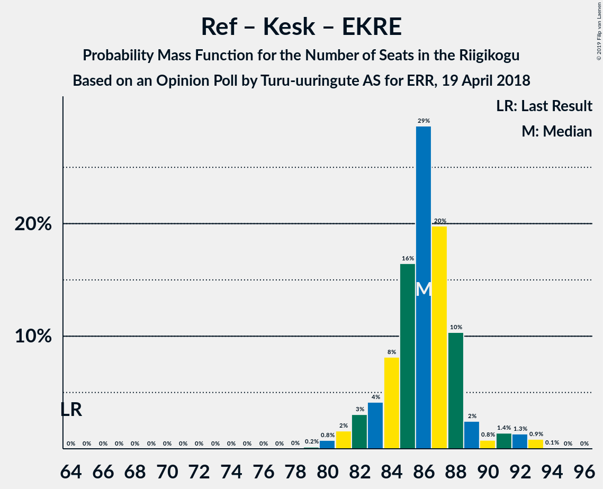
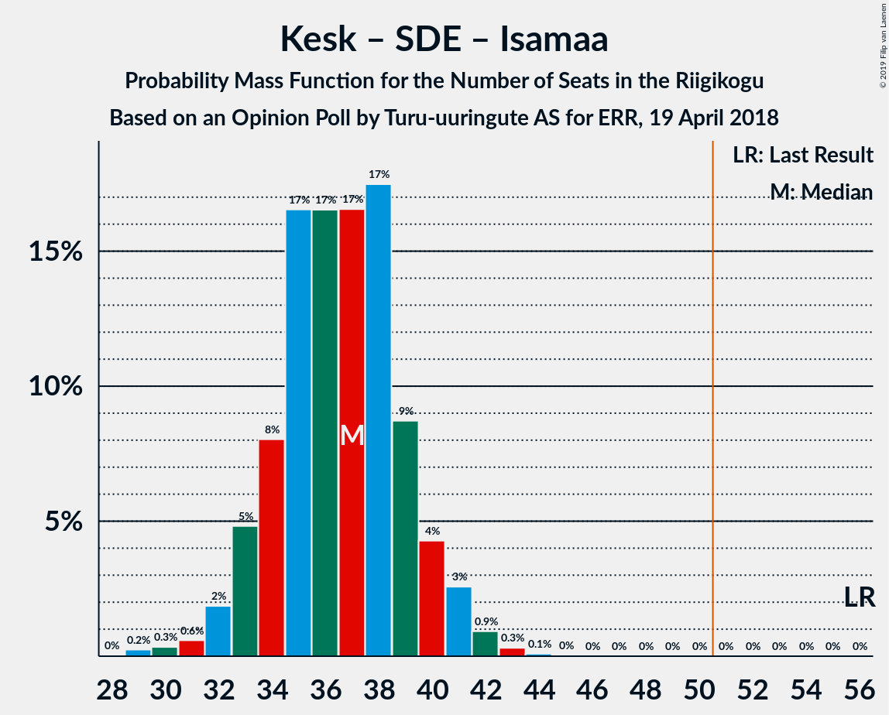

# Opinion Poll by Turu-uuringute AS for ERR, 19 April 2018

<a href="#voting-intentions">Voting Intentions</a> | <a href="#seats">Seats</a> | <a href="#coalitions">Coalitions</a> | <a href="#technical-information">Technical Information</a>

## Voting Intentions

### Confidence Intervals

| Party | Last Result | Poll Result | 80% Confidence Interval | 90% Confidence Interval | 95% Confidence Interval | 99% Confidence Interval |
|:-----:|:-----------:|:-----------:|:-----------------------:|:-----------------------:|:-----------------------:|:-----------------------:|
| Eesti Reformierakond | 27.7% | 33.7% | 31.8–35.7% |31.3–36.2% |30.8–36.7% |29.9–37.6% |
| Eesti Keskerakond | 24.8% | 26.5% | 24.8–28.3% |24.3–28.9% |23.9–29.3% |23.0–30.2% |
| Eesti Konservatiivne Rahvaerakond | 8.1% | 14.3% | 13.0–15.8% |12.6–16.2% |12.3–16.6% |11.6–17.4% |
| Sotsiaaldemokraatlik Erakond | 15.2% | 6.1% | 5.2–7.2% |5.0–7.5% |4.8–7.8% |4.4–8.3% |
| Erakond Isamaa | 13.7% | 4.1% | 3.4–5.0% |3.2–5.3% |3.0–5.5% |2.7–6.0% |
| Eesti Vabaerakond | 8.7% | 3.1% | 2.5–3.9% |2.3–4.2% |2.2–4.4% |1.9–4.8% |
| Erakond Eestimaa Rohelised | 0.9% | 3.1% | 2.5–3.9% |2.3–4.2% |2.2–4.4% |1.9–4.8% |

*Note:* The poll result column reflects the actual value used in the calculations. Published results may vary slightly, and in addition be rounded to fewer digits.

## Seats

### Confidence Intervals

| Party | Last Result | Median | 80% Confidence Interval | 90% Confidence Interval | 95% Confidence Interval | 99% Confidence Interval |
|:-----:|:-----------:|:------:|:-----------------------:|:-----------------------:|:-----------------------:|:-----------------------:|
| <a href="#eesti-reformierakond">Eesti Reformierakond</a> | 30 | 40 | 37–43 |37–43 |36–44 |35–45 |
| <a href="#eesti-keskerakond">Eesti Keskerakond</a> | 27 | 31 | 28–33 |28–34 |27–34 |26–36 |
| <a href="#eesti-konservatiivne-rahvaerakond">Eesti Konservatiivne Rahvaerakond</a> | 7 | 15 | 14–17 |13–18 |13–18 |12–19 |
| <a href="#sotsiaaldemokraatlik-erakond">Sotsiaaldemokraatlik Erakond</a> | 15 | 6 | 5–7 |4–7 |0–7 |0–8 |
| <a href="#erakond-isamaa">Erakond Isamaa</a> | 14 | 0 | 0–4 |0–5 |0–5 |0–5 |
| <a href="#eesti-vabaerakond">Eesti Vabaerakond</a> | 8 | 0 | 0 |0 |0 |0 |
| <a href="#erakond-eestimaa-rohelised">Erakond Eestimaa Rohelised</a> | 0 | 0 | 0 |0 |0 |0 |

### Eesti Reformierakond

*For a full overview of the results for this party, see the [Eesti Reformierakond](party-eestireformierakond.html) page.*

| Number of Seats | Probability | Accumulated | Special Marks |
|:---------------:|:-----------:|:-----------:|:-------------:|
| 30 | 0% | 100% | Last Result |
| 31 | 0% | 100% |  |
| 32 | 0% | 100% |  |
| 33 | 0% | 100% |  |
| 34 | 0.4% | 100% |  |
| 35 | 0.7% | 99.5% |  |
| 36 | 4% | 98.8% |  |
| 37 | 7% | 95% |  |
| 38 | 18% | 88% |  |
| 39 | 11% | 70% |  |
| 40 | 20% | 59% | Median |
| 41 | 16% | 40% |  |
| 42 | 13% | 24% |  |
| 43 | 6% | 11% |  |
| 44 | 4% | 5% |  |
| 45 | 0.7% | 1.2% |  |
| 46 | 0.4% | 0.5% |  |
| 47 | 0.1% | 0.1% |  |
| 48 | 0% | 0% |  |

### Eesti Keskerakond

*For a full overview of the results for this party, see the [Eesti Keskerakond](party-eestikeskerakond.html) page.*

| Number of Seats | Probability | Accumulated | Special Marks |
|:---------------:|:-----------:|:-----------:|:-------------:|
| 25 | 0.1% | 100% |  |
| 26 | 0.8% | 99.9% |  |
| 27 | 4% | 99.1% | Last Result |
| 28 | 9% | 95% |  |
| 29 | 11% | 86% |  |
| 30 | 16% | 76% |  |
| 31 | 25% | 60% | Median |
| 32 | 21% | 35% |  |
| 33 | 7% | 14% |  |
| 34 | 5% | 7% |  |
| 35 | 2% | 2% |  |
| 36 | 0.5% | 0.6% |  |
| 37 | 0.1% | 0.1% |  |
| 38 | 0% | 0% |  |

### Eesti Konservatiivne Rahvaerakond

*For a full overview of the results for this party, see the [Eesti Konservatiivne Rahvaerakond](party-eestikonservatiivnerahvaerakond.html) page.*

| Number of Seats | Probability | Accumulated | Special Marks |
|:---------------:|:-----------:|:-----------:|:-------------:|
| 7 | 0% | 100% | Last Result |
| 8 | 0% | 100% |  |
| 9 | 0% | 100% |  |
| 10 | 0% | 100% |  |
| 11 | 0.1% | 100% |  |
| 12 | 2% | 99.9% |  |
| 13 | 8% | 98% |  |
| 14 | 20% | 90% |  |
| 15 | 30% | 71% | Median |
| 16 | 25% | 40% |  |
| 17 | 9% | 15% |  |
| 18 | 5% | 7% |  |
| 19 | 1.3% | 1.4% |  |
| 20 | 0.1% | 0.1% |  |
| 21 | 0% | 0% |  |

### Sotsiaaldemokraatlik Erakond

*For a full overview of the results for this party, see the [Sotsiaaldemokraatlik Erakond](party-sotsiaaldemokraatlikerakond.html) page.*

| Number of Seats | Probability | Accumulated | Special Marks |
|:---------------:|:-----------:|:-----------:|:-------------:|
| 0 | 5% | 100% |  |
| 1 | 0% | 95% |  |
| 2 | 0% | 95% |  |
| 3 | 0% | 95% |  |
| 4 | 2% | 95% |  |
| 5 | 32% | 93% |  |
| 6 | 47% | 61% | Median |
| 7 | 12% | 14% |  |
| 8 | 2% | 2% |  |
| 9 | 0.2% | 0.2% |  |
| 10 | 0% | 0% |  |
| 11 | 0% | 0% |  |
| 12 | 0% | 0% |  |
| 13 | 0% | 0% |  |
| 14 | 0% | 0% |  |
| 15 | 0% | 0% | Last Result |

### Erakond Isamaa

*For a full overview of the results for this party, see the [Erakond Isamaa](party-erakondisamaa.html) page.*

| Number of Seats | Probability | Accumulated | Special Marks |
|:---------------:|:-----------:|:-----------:|:-------------:|
| 0 | 88% | 100% | Median |
| 1 | 0% | 12% |  |
| 2 | 0% | 12% |  |
| 3 | 0% | 12% |  |
| 4 | 6% | 12% |  |
| 5 | 5% | 5% |  |
| 6 | 0.3% | 0.3% |  |
| 7 | 0% | 0% |  |
| 8 | 0% | 0% |  |
| 9 | 0% | 0% |  |
| 10 | 0% | 0% |  |
| 11 | 0% | 0% |  |
| 12 | 0% | 0% |  |
| 13 | 0% | 0% |  |
| 14 | 0% | 0% | Last Result |

### Eesti Vabaerakond

*For a full overview of the results for this party, see the [Eesti Vabaerakond](party-eestivabaerakond.html) page.*

| Number of Seats | Probability | Accumulated | Special Marks |
|:---------------:|:-----------:|:-----------:|:-------------:|
| 0 | 99.9% | 100% | Median |
| 1 | 0% | 0.1% |  |
| 2 | 0% | 0.1% |  |
| 3 | 0% | 0.1% |  |
| 4 | 0% | 0.1% |  |
| 5 | 0.1% | 0.1% |  |
| 6 | 0% | 0% |  |
| 7 | 0% | 0% |  |
| 8 | 0% | 0% | Last Result |

### Erakond Eestimaa Rohelised

*For a full overview of the results for this party, see the [Erakond Eestimaa Rohelised](party-erakondeestimaarohelised.html) page.*

| Number of Seats | Probability | Accumulated | Special Marks |
|:---------------:|:-----------:|:-----------:|:-------------:|
| 0 | 99.8% | 100% | Last Result, Median |
| 1 | 0% | 0.2% |  |
| 2 | 0% | 0.2% |  |
| 3 | 0% | 0.2% |  |
| 4 | 0.1% | 0.2% |  |
| 5 | 0.1% | 0.1% |  |
| 6 | 0% | 0% |  |

## Coalitions

### Confidence Intervals

| Coalition | Last Result | Median | Majority? | 80% Confidence Interval | 90% Confidence Interval | 95% Confidence Interval | 99% Confidence Interval |
|:---------:|:-----------:|:------:|:---------:|:-----------------------:|:-----------------------:|:-----------------------:|:-----------------------:|
| Eesti Reformierakond – Eesti Keskerakond – Eesti Konservatiivne Rahvaerakond | 64 | 86 | 100% | 83–88 | 82–89 | 81–91 | 80–93 |
| Eesti Reformierakond – Eesti Keskerakond | 57 | 71 | 100% | 68–73 | 67–74 | 66–76 | 65–77 |
| Eesti Reformierakond – Eesti Konservatiivne Rahvaerakond | 37 | 55 | 98.5% | 52–58 | 51–59 | 51–60 | 50–61 |
| Eesti Reformierakond – Eesti Konservatiivne Rahvaerakond – Erakond Isamaa | 51 | 56 | 99.5% | 53–59 | 52–60 | 51–60 | 51–62 |
| Eesti Keskerakond – Eesti Konservatiivne Rahvaerakond | 34 | 46 | 2% | 43–49 | 42–49 | 42–50 | 40–52 |
| Eesti Reformierakond – Sotsiaaldemokraatlik Erakond – Erakond Isamaa – Eesti Vabaerakond | 67 | 46 | 2% | 43–49 | 43–50 | 42–50 | 40–51 |
| Eesti Reformierakond – Sotsiaaldemokraatlik Erakond – Erakond Isamaa | 59 | 46 | 2% | 43–49 | 43–50 | 42–50 | 40–51 |
| Eesti Reformierakond – Sotsiaaldemokraatlik Erakond | 45 | 46 | 0.4% | 43–48 | 42–49 | 41–49 | 40–50 |
| Eesti Reformierakond – Erakond Isamaa | 44 | 40 | 0% | 38–43 | 37–44 | 37–45 | 35–46 |
| Eesti Keskerakond – Sotsiaaldemokraatlik Erakond – Erakond Isamaa | 56 | 37 | 0% | 34–40 | 33–41 | 32–41 | 30–43 |
| Eesti Keskerakond – Sotsiaaldemokraatlik Erakond | 42 | 36 | 0% | 33–39 | 33–40 | 32–40 | 30–41 |
| Eesti Konservatiivne Rahvaerakond – Sotsiaaldemokraatlik Erakond | 22 | 21 | 0% | 19–23 | 17–24 | 16–24 | 15–25 |

### Eesti Reformierakond – Eesti Keskerakond – Eesti Konservatiivne Rahvaerakond

| Number of Seats | Probability | Accumulated | Special Marks |
|:---------------:|:-----------:|:-----------:|:-------------:|
| 64 | 0% | 100% | Last Result |
| 65 | 0% | 100% |  |
| 66 | 0% | 100% |  |
| 67 | 0% | 100% |  |
| 68 | 0% | 100% |  |
| 69 | 0% | 100% |  |
| 70 | 0% | 100% |  |
| 71 | 0% | 100% |  |
| 72 | 0% | 100% |  |
| 73 | 0% | 100% |  |
| 74 | 0% | 100% |  |
| 75 | 0% | 100% |  |
| 76 | 0% | 100% |  |
| 77 | 0% | 100% |  |
| 78 | 0% | 100% |  |
| 79 | 0.2% | 100% |  |
| 80 | 0.4% | 99.8% |  |
| 81 | 2% | 99.4% |  |
| 82 | 5% | 97% |  |
| 83 | 4% | 92% |  |
| 84 | 7% | 88% |  |
| 85 | 14% | 81% |  |
| 86 | 34% | 67% | Median |
| 87 | 19% | 33% |  |
| 88 | 7% | 14% |  |
| 89 | 3% | 7% |  |
| 90 | 0.7% | 4% |  |
| 91 | 2% | 4% |  |
| 92 | 0.9% | 2% |  |
| 93 | 1.0% | 1.1% |  |
| 94 | 0.1% | 0.1% |  |
| 95 | 0% | 0% |  |

### Eesti Reformierakond – Eesti Keskerakond

| Number of Seats | Probability | Accumulated | Special Marks |
|:---------------:|:-----------:|:-----------:|:-------------:|
| 57 | 0% | 100% | Last Result |
| 58 | 0% | 100% |  |
| 59 | 0% | 100% |  |
| 60 | 0% | 100% |  |
| 61 | 0% | 100% |  |
| 62 | 0% | 100% |  |
| 63 | 0.1% | 100% |  |
| 64 | 0.1% | 99.9% |  |
| 65 | 2% | 99.8% |  |
| 66 | 2% | 98% |  |
| 67 | 3% | 96% |  |
| 68 | 9% | 93% |  |
| 69 | 11% | 85% |  |
| 70 | 24% | 74% |  |
| 71 | 16% | 50% | Median |
| 72 | 15% | 34% |  |
| 73 | 11% | 19% |  |
| 74 | 4% | 8% |  |
| 75 | 2% | 4% |  |
| 76 | 1.4% | 3% |  |
| 77 | 1.2% | 1.3% |  |
| 78 | 0.1% | 0.1% |  |
| 79 | 0% | 0% |  |

### Eesti Reformierakond – Eesti Konservatiivne Rahvaerakond

| Number of Seats | Probability | Accumulated | Special Marks |
|:---------------:|:-----------:|:-----------:|:-------------:|
| 37 | 0% | 100% | Last Result |
| 38 | 0% | 100% |  |
| 39 | 0% | 100% |  |
| 40 | 0% | 100% |  |
| 41 | 0% | 100% |  |
| 42 | 0% | 100% |  |
| 43 | 0% | 100% |  |
| 44 | 0% | 100% |  |
| 45 | 0% | 100% |  |
| 46 | 0% | 100% |  |
| 47 | 0% | 100% |  |
| 48 | 0.1% | 100% |  |
| 49 | 0.4% | 99.9% |  |
| 50 | 1.0% | 99.5% |  |
| 51 | 4% | 98.5% | Majority |
| 52 | 6% | 95% |  |
| 53 | 10% | 89% |  |
| 54 | 20% | 79% |  |
| 55 | 14% | 58% | Median |
| 56 | 21% | 45% |  |
| 57 | 7% | 23% |  |
| 58 | 8% | 16% |  |
| 59 | 4% | 8% |  |
| 60 | 3% | 3% |  |
| 61 | 0.4% | 0.7% |  |
| 62 | 0.2% | 0.4% |  |
| 63 | 0.1% | 0.2% |  |
| 64 | 0% | 0% |  |

### Eesti Reformierakond – Eesti Konservatiivne Rahvaerakond – Erakond Isamaa

| Number of Seats | Probability | Accumulated | Special Marks |
|:---------------:|:-----------:|:-----------:|:-------------:|
| 49 | 0.1% | 100% |  |
| 50 | 0.4% | 99.9% |  |
| 51 | 2% | 99.5% | Last Result, Majority |
| 52 | 3% | 97% |  |
| 53 | 10% | 94% |  |
| 54 | 18% | 85% |  |
| 55 | 13% | 67% | Median |
| 56 | 23% | 54% |  |
| 57 | 9% | 30% |  |
| 58 | 10% | 22% |  |
| 59 | 7% | 12% |  |
| 60 | 4% | 5% |  |
| 61 | 0.6% | 1.2% |  |
| 62 | 0.3% | 0.6% |  |
| 63 | 0.2% | 0.3% |  |
| 64 | 0.1% | 0.1% |  |
| 65 | 0% | 0% |  |

### Eesti Keskerakond – Eesti Konservatiivne Rahvaerakond

| Number of Seats | Probability | Accumulated | Special Marks |
|:---------------:|:-----------:|:-----------:|:-------------:|
| 34 | 0% | 100% | Last Result |
| 35 | 0% | 100% |  |
| 36 | 0% | 100% |  |
| 37 | 0% | 100% |  |
| 38 | 0% | 100% |  |
| 39 | 0.1% | 100% |  |
| 40 | 0.4% | 99.9% |  |
| 41 | 1.0% | 99.5% |  |
| 42 | 4% | 98.5% |  |
| 43 | 7% | 95% |  |
| 44 | 10% | 88% |  |
| 45 | 17% | 78% |  |
| 46 | 23% | 61% | Median |
| 47 | 14% | 38% |  |
| 48 | 12% | 24% |  |
| 49 | 8% | 11% |  |
| 50 | 2% | 3% |  |
| 51 | 1.2% | 2% | Majority |
| 52 | 0.4% | 0.5% |  |
| 53 | 0.1% | 0.1% |  |
| 54 | 0.1% | 0.1% |  |
| 55 | 0% | 0% |  |

### Eesti Reformierakond – Sotsiaaldemokraatlik Erakond – Erakond Isamaa – Eesti Vabaerakond

| Number of Seats | Probability | Accumulated | Special Marks |
|:---------------:|:-----------:|:-----------:|:-------------:|
| 38 | 0.1% | 100% |  |
| 39 | 0.2% | 99.9% |  |
| 40 | 0.5% | 99.7% |  |
| 41 | 1.1% | 99.2% |  |
| 42 | 2% | 98% |  |
| 43 | 11% | 96% |  |
| 44 | 14% | 85% |  |
| 45 | 12% | 71% |  |
| 46 | 19% | 59% | Median |
| 47 | 15% | 40% |  |
| 48 | 13% | 25% |  |
| 49 | 6% | 12% |  |
| 50 | 4% | 6% |  |
| 51 | 2% | 2% | Majority |
| 52 | 0.3% | 0.4% |  |
| 53 | 0.1% | 0.1% |  |
| 54 | 0% | 0% |  |
| 55 | 0% | 0% |  |
| 56 | 0% | 0% |  |
| 57 | 0% | 0% |  |
| 58 | 0% | 0% |  |
| 59 | 0% | 0% |  |
| 60 | 0% | 0% |  |
| 61 | 0% | 0% |  |
| 62 | 0% | 0% |  |
| 63 | 0% | 0% |  |
| 64 | 0% | 0% |  |
| 65 | 0% | 0% |  |
| 66 | 0% | 0% |  |
| 67 | 0% | 0% | Last Result |

### Eesti Reformierakond – Sotsiaaldemokraatlik Erakond – Erakond Isamaa

| Number of Seats | Probability | Accumulated | Special Marks |
|:---------------:|:-----------:|:-----------:|:-------------:|
| 38 | 0.1% | 100% |  |
| 39 | 0.2% | 99.9% |  |
| 40 | 0.5% | 99.7% |  |
| 41 | 1.1% | 99.2% |  |
| 42 | 2% | 98% |  |
| 43 | 11% | 96% |  |
| 44 | 14% | 85% |  |
| 45 | 12% | 71% |  |
| 46 | 19% | 59% | Median |
| 47 | 15% | 40% |  |
| 48 | 13% | 25% |  |
| 49 | 6% | 12% |  |
| 50 | 4% | 6% |  |
| 51 | 2% | 2% | Majority |
| 52 | 0.3% | 0.4% |  |
| 53 | 0.1% | 0.1% |  |
| 54 | 0% | 0% |  |
| 55 | 0% | 0% |  |
| 56 | 0% | 0% |  |
| 57 | 0% | 0% |  |
| 58 | 0% | 0% |  |
| 59 | 0% | 0% | Last Result |

### Eesti Reformierakond – Sotsiaaldemokraatlik Erakond

| Number of Seats | Probability | Accumulated | Special Marks |
|:---------------:|:-----------:|:-----------:|:-------------:|
| 38 | 0.1% | 100% |  |
| 39 | 0.3% | 99.8% |  |
| 40 | 0.7% | 99.5% |  |
| 41 | 2% | 98.8% |  |
| 42 | 5% | 97% |  |
| 43 | 12% | 92% |  |
| 44 | 15% | 81% |  |
| 45 | 13% | 65% | Last Result |
| 46 | 20% | 52% | Median |
| 47 | 15% | 32% |  |
| 48 | 11% | 17% |  |
| 49 | 5% | 6% |  |
| 50 | 1.2% | 2% |  |
| 51 | 0.3% | 0.4% | Majority |
| 52 | 0.1% | 0.2% |  |
| 53 | 0% | 0% |  |

### Eesti Reformierakond – Erakond Isamaa

| Number of Seats | Probability | Accumulated | Special Marks |
|:---------------:|:-----------:|:-----------:|:-------------:|
| 34 | 0.2% | 100% |  |
| 35 | 0.5% | 99.8% |  |
| 36 | 1.4% | 99.4% |  |
| 37 | 6% | 98% |  |
| 38 | 16% | 92% |  |
| 39 | 9% | 75% |  |
| 40 | 18% | 66% | Median |
| 41 | 17% | 48% |  |
| 42 | 13% | 31% |  |
| 43 | 8% | 18% |  |
| 44 | 6% | 10% | Last Result |
| 45 | 2% | 4% |  |
| 46 | 1.5% | 2% |  |
| 47 | 0.2% | 0.3% |  |
| 48 | 0.1% | 0.2% |  |
| 49 | 0.1% | 0.1% |  |
| 50 | 0% | 0% |  |

### Eesti Keskerakond – Sotsiaaldemokraatlik Erakond – Erakond Isamaa

| Number of Seats | Probability | Accumulated | Special Marks |
|:---------------:|:-----------:|:-----------:|:-------------:|
| 28 | 0.1% | 100% |  |
| 29 | 0.2% | 99.9% |  |
| 30 | 0.3% | 99.7% |  |
| 31 | 0.8% | 99.5% |  |
| 32 | 2% | 98.7% |  |
| 33 | 6% | 97% |  |
| 34 | 7% | 91% |  |
| 35 | 10% | 84% |  |
| 36 | 16% | 74% |  |
| 37 | 20% | 58% | Median |
| 38 | 21% | 38% |  |
| 39 | 7% | 17% |  |
| 40 | 4% | 10% |  |
| 41 | 4% | 6% |  |
| 42 | 2% | 2% |  |
| 43 | 0.5% | 0.6% |  |
| 44 | 0.1% | 0.1% |  |
| 45 | 0% | 0% |  |
| 46 | 0% | 0% |  |
| 47 | 0% | 0% |  |
| 48 | 0% | 0% |  |
| 49 | 0% | 0% |  |
| 50 | 0% | 0% |  |
| 51 | 0% | 0% | Majority |
| 52 | 0% | 0% |  |
| 53 | 0% | 0% |  |
| 54 | 0% | 0% |  |
| 55 | 0% | 0% |  |
| 56 | 0% | 0% | Last Result |

### Eesti Keskerakond – Sotsiaaldemokraatlik Erakond

| Number of Seats | Probability | Accumulated | Special Marks |
|:---------------:|:-----------:|:-----------:|:-------------:|
| 28 | 0.1% | 100% |  |
| 29 | 0.2% | 99.9% |  |
| 30 | 0.3% | 99.6% |  |
| 31 | 0.9% | 99.3% |  |
| 32 | 3% | 98% |  |
| 33 | 7% | 96% |  |
| 34 | 10% | 89% |  |
| 35 | 12% | 79% |  |
| 36 | 17% | 67% |  |
| 37 | 20% | 49% | Median |
| 38 | 18% | 29% |  |
| 39 | 6% | 11% |  |
| 40 | 3% | 5% |  |
| 41 | 2% | 2% |  |
| 42 | 0.3% | 0.3% | Last Result |
| 43 | 0% | 0.1% |  |
| 44 | 0% | 0% |  |

### Eesti Konservatiivne Rahvaerakond – Sotsiaaldemokraatlik Erakond

| Number of Seats | Probability | Accumulated | Special Marks |
|:---------------:|:-----------:|:-----------:|:-------------:|
| 13 | 0.1% | 100% |  |
| 14 | 0.3% | 99.9% |  |
| 15 | 1.4% | 99.6% |  |
| 16 | 1.5% | 98% |  |
| 17 | 2% | 97% |  |
| 18 | 4% | 95% |  |
| 19 | 10% | 91% |  |
| 20 | 25% | 81% |  |
| 21 | 20% | 56% | Median |
| 22 | 20% | 35% | Last Result |
| 23 | 10% | 15% |  |
| 24 | 4% | 5% |  |
| 25 | 1.1% | 1.4% |  |
| 26 | 0.3% | 0.3% |  |
| 27 | 0% | 0% |  |

## Technical Information

### Opinion Poll

+ **Polling firm:** Turu-uuringute AS
+ **Commissioner(s):** ERR
+ **Fieldwork period:** 19 April 2018

### Calculations

+ **Sample size:** 1000
+ **Simulations done:** 131,072
+ **Error estimate:** 1.71%

