# Opinion Poll by Kantar Emor for BNS and Postimees, 21 May 2018

<a href="#voting-intentions">Voting Intentions</a> | <a href="#seats">Seats</a> | <a href="#coalitions">Coalitions</a> | <a href="#technical-information">Technical Information</a>

## Voting Intentions

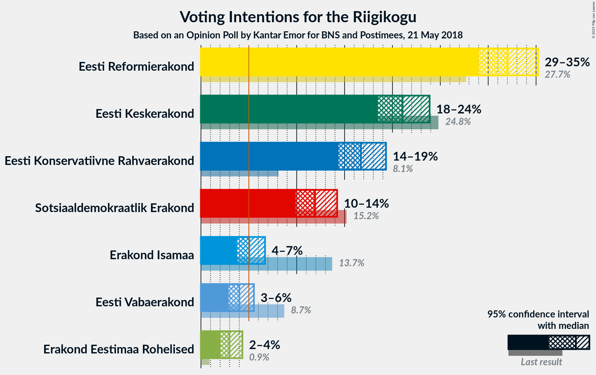

### Confidence Intervals

| Party | Last Result | Poll Result | 80% Confidence Interval | 90% Confidence Interval | 95% Confidence Interval | 99% Confidence Interval |
|:-----:|:-----------:|:-----------:|:-----------------------:|:-----------------------:|:-----------------------:|:-----------------------:|
| Eesti Reformierakond | 27.7% | 32.0% | 30.1–34.1% |29.5–34.7% |29.0–35.2% |28.1–36.2% |
| Eesti Keskerakond | 24.8% | 21.1% | 19.4–22.9% |18.9–23.4% |18.5–23.9% |17.7–24.8% |
| Eesti Konservatiivne Rahvaerakond | 8.1% | 16.7% | 15.2–18.4% |14.7–18.9% |14.4–19.3% |13.7–20.2% |
| Sotsiaaldemokraatlik Erakond | 15.2% | 11.9% | 10.6–13.4% |10.2–13.8% |9.9–14.2% |9.3–15.0% |
| Erakond Isamaa | 13.7% | 5.0% | 4.2–6.1% |4.0–6.4% |3.8–6.7% |3.4–7.3% |
| Eesti Vabaerakond | 8.7% | 4.0% | 3.3–5.0% |3.1–5.3% |2.9–5.5% |2.6–6.0% |
| Erakond Eestimaa Rohelised | 0.9% | 3.0% | 2.3–3.9% |2.2–4.1% |2.0–4.3% |1.8–4.8% |

*Note:* The poll result column reflects the actual value used in the calculations. Published results may vary slightly, and in addition be rounded to fewer digits.

## Seats

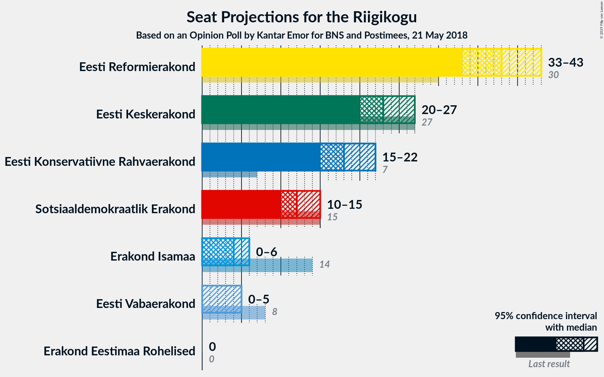

### Confidence Intervals

| Party | Last Result | Median | 80% Confidence Interval | 90% Confidence Interval | 95% Confidence Interval | 99% Confidence Interval |
|:-----:|:-----------:|:------:|:-----------------------:|:-----------------------:|:-----------------------:|:-----------------------:|
| <a href="#eesti-reformierakond">Eesti Reformierakond</a> | 30 | 38 | 35–41 |34–42 |33–43 |32–44 |
| <a href="#eesti-keskerakond">Eesti Keskerakond</a> | 27 | 23 | 21–27 |21–27 |20–27 |19–28 |
| <a href="#eesti-konservatiivne-rahvaerakond">Eesti Konservatiivne Rahvaerakond</a> | 7 | 18 | 16–20 |15–21 |15–22 |14–22 |
| <a href="#sotsiaaldemokraatlik-erakond">Sotsiaaldemokraatlik Erakond</a> | 15 | 12 | 11–14 |10–15 |10–15 |9–16 |
| <a href="#erakond-isamaa">Erakond Isamaa</a> | 14 | 4 | 0–5 |0–6 |0–6 |0–7 |
| <a href="#eesti-vabaerakond">Eesti Vabaerakond</a> | 8 | 0 | 0 |0–5 |0–5 |0–5 |
| <a href="#erakond-eestimaa-rohelised">Erakond Eestimaa Rohelised</a> | 0 | 0 | 0 |0 |0 |0 |

### Eesti Reformierakond

*For a full overview of the results for this party, see the [Eesti Reformierakond](party-eestireformierakond.html) page.*

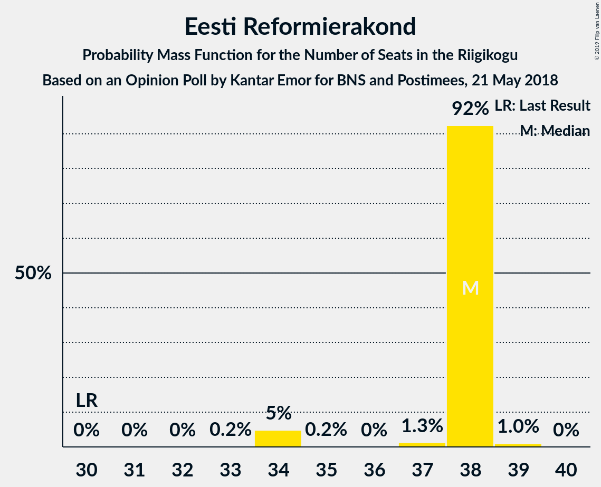

| Number of Seats | Probability | Accumulated | Special Marks |
|:---------------:|:-----------:|:-----------:|:-------------:|
| 30 | 0% | 100% | Last Result |
| 31 | 0.2% | 100% |  |
| 32 | 0.5% | 99.8% |  |
| 33 | 2% | 99.3% |  |
| 34 | 3% | 97% |  |
| 35 | 8% | 94% |  |
| 36 | 11% | 86% |  |
| 37 | 17% | 75% |  |
| 38 | 27% | 58% | Median |
| 39 | 11% | 31% |  |
| 40 | 8% | 20% |  |
| 41 | 6% | 13% |  |
| 42 | 3% | 7% |  |
| 43 | 3% | 4% |  |
| 44 | 0.6% | 0.9% |  |
| 45 | 0.2% | 0.3% |  |
| 46 | 0% | 0% |  |

### Eesti Keskerakond

*For a full overview of the results for this party, see the [Eesti Keskerakond](party-eestikeskerakond.html) page.*

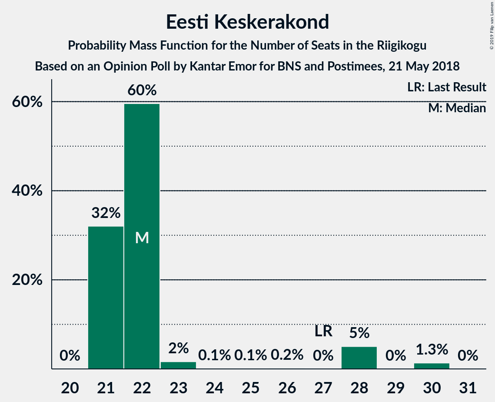

| Number of Seats | Probability | Accumulated | Special Marks |
|:---------------:|:-----------:|:-----------:|:-------------:|
| 18 | 0.2% | 100% |  |
| 19 | 0.7% | 99.8% |  |
| 20 | 4% | 99.1% |  |
| 21 | 9% | 95% |  |
| 22 | 19% | 87% |  |
| 23 | 19% | 67% | Median |
| 24 | 16% | 49% |  |
| 25 | 14% | 33% |  |
| 26 | 8% | 19% |  |
| 27 | 8% | 10% | Last Result |
| 28 | 2% | 2% |  |
| 29 | 0.2% | 0.4% |  |
| 30 | 0.2% | 0.2% |  |
| 31 | 0% | 0% |  |

### Eesti Konservatiivne Rahvaerakond

*For a full overview of the results for this party, see the [Eesti Konservatiivne Rahvaerakond](party-eestikonservatiivnerahvaerakond.html) page.*

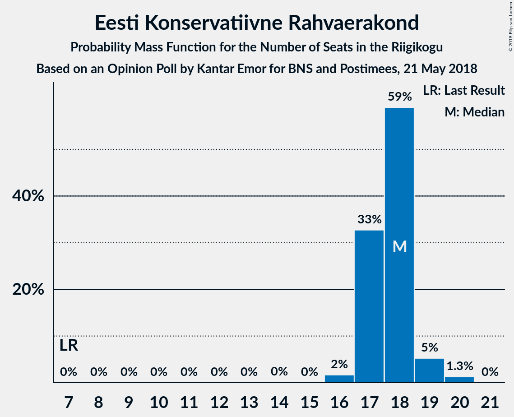

| Number of Seats | Probability | Accumulated | Special Marks |
|:---------------:|:-----------:|:-----------:|:-------------:|
| 7 | 0% | 100% | Last Result |
| 8 | 0% | 100% |  |
| 9 | 0% | 100% |  |
| 10 | 0% | 100% |  |
| 11 | 0% | 100% |  |
| 12 | 0% | 100% |  |
| 13 | 0.1% | 100% |  |
| 14 | 0.8% | 99.9% |  |
| 15 | 4% | 99.1% |  |
| 16 | 13% | 95% |  |
| 17 | 17% | 81% |  |
| 18 | 27% | 65% | Median |
| 19 | 20% | 38% |  |
| 20 | 11% | 18% |  |
| 21 | 4% | 7% |  |
| 22 | 3% | 3% |  |
| 23 | 0.4% | 0.5% |  |
| 24 | 0.1% | 0.1% |  |
| 25 | 0% | 0% |  |

### Sotsiaaldemokraatlik Erakond

*For a full overview of the results for this party, see the [Sotsiaaldemokraatlik Erakond](party-sotsiaaldemokraatlikerakond.html) page.*

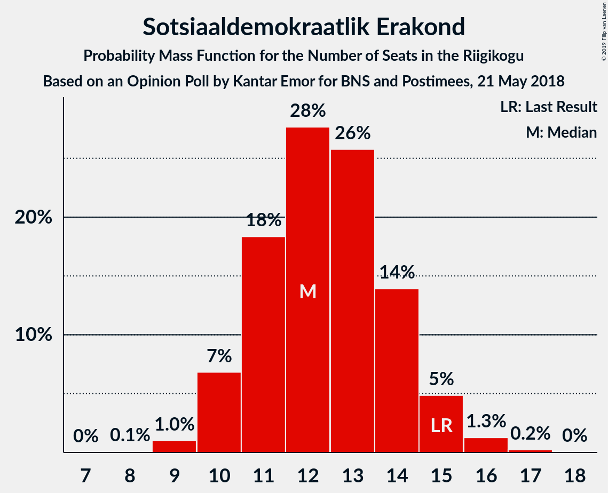

| Number of Seats | Probability | Accumulated | Special Marks |
|:---------------:|:-----------:|:-----------:|:-------------:|
| 8 | 0.1% | 100% |  |
| 9 | 1.1% | 99.9% |  |
| 10 | 6% | 98.8% |  |
| 11 | 16% | 93% |  |
| 12 | 33% | 77% | Median |
| 13 | 24% | 45% |  |
| 14 | 14% | 20% |  |
| 15 | 5% | 7% | Last Result |
| 16 | 2% | 2% |  |
| 17 | 0.1% | 0.2% |  |
| 18 | 0% | 0% |  |

### Erakond Isamaa

*For a full overview of the results for this party, see the [Erakond Isamaa](party-erakondisamaa.html) page.*

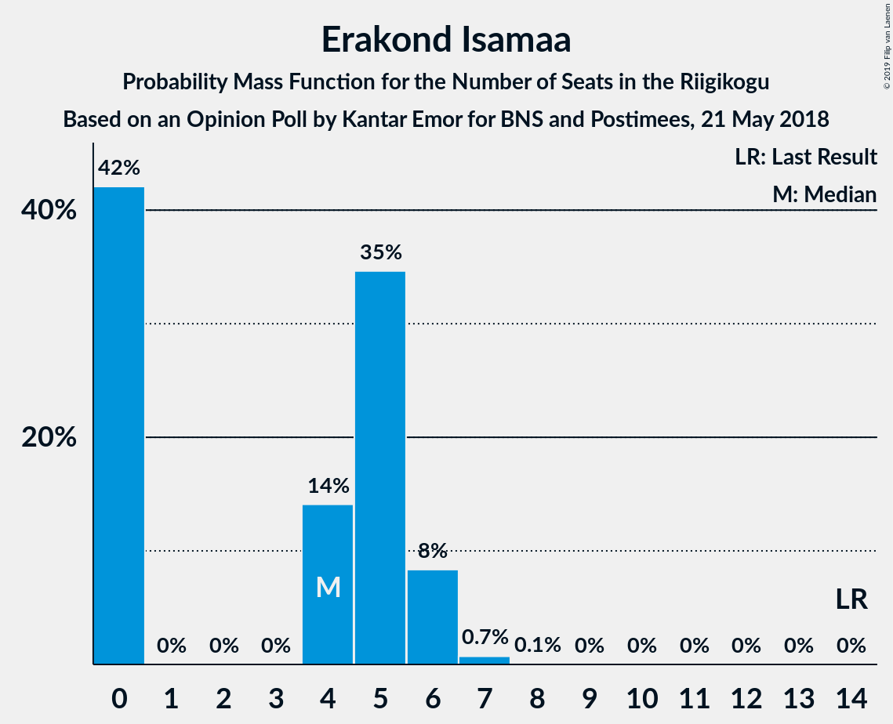

| Number of Seats | Probability | Accumulated | Special Marks |
|:---------------:|:-----------:|:-----------:|:-------------:|
| 0 | 42% | 100% |  |
| 1 | 0% | 58% |  |
| 2 | 0% | 58% |  |
| 3 | 0% | 58% |  |
| 4 | 14% | 58% | Median |
| 5 | 35% | 44% |  |
| 6 | 8% | 9% |  |
| 7 | 0.7% | 0.8% |  |
| 8 | 0.1% | 0.1% |  |
| 9 | 0% | 0% |  |
| 10 | 0% | 0% |  |
| 11 | 0% | 0% |  |
| 12 | 0% | 0% |  |
| 13 | 0% | 0% |  |
| 14 | 0% | 0% | Last Result |

### Eesti Vabaerakond

*For a full overview of the results for this party, see the [Eesti Vabaerakond](party-eestivabaerakond.html) page.*

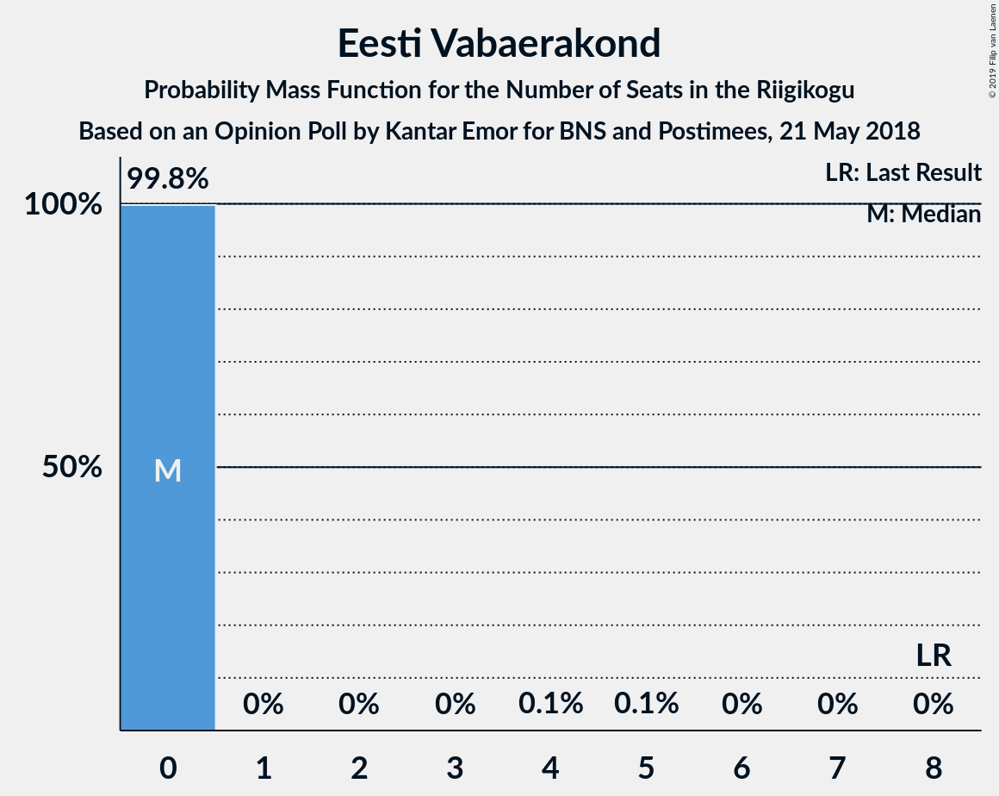

| Number of Seats | Probability | Accumulated | Special Marks |
|:---------------:|:-----------:|:-----------:|:-------------:|
| 0 | 91% | 100% | Median |
| 1 | 0% | 9% |  |
| 2 | 0% | 9% |  |
| 3 | 0% | 9% |  |
| 4 | 2% | 9% |  |
| 5 | 7% | 7% |  |
| 6 | 0.3% | 0.3% |  |
| 7 | 0% | 0% |  |
| 8 | 0% | 0% | Last Result |

### Erakond Eestimaa Rohelised

*For a full overview of the results for this party, see the [Erakond Eestimaa Rohelised](party-erakondeestimaarohelised.html) page.*

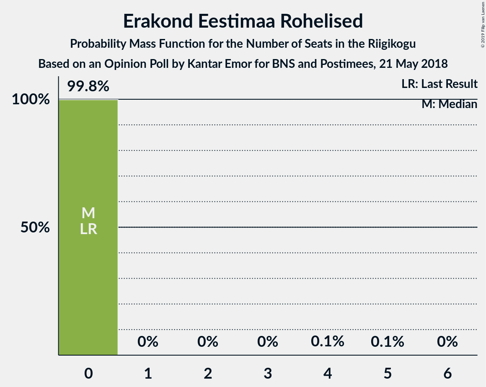

| Number of Seats | Probability | Accumulated | Special Marks |
|:---------------:|:-----------:|:-----------:|:-------------:|
| 0 | 99.8% | 100% | Last Result, Median |
| 1 | 0% | 0.2% |  |
| 2 | 0% | 0.2% |  |
| 3 | 0% | 0.2% |  |
| 4 | 0.1% | 0.2% |  |
| 5 | 0.1% | 0.1% |  |
| 6 | 0% | 0% |  |

## Coalitions

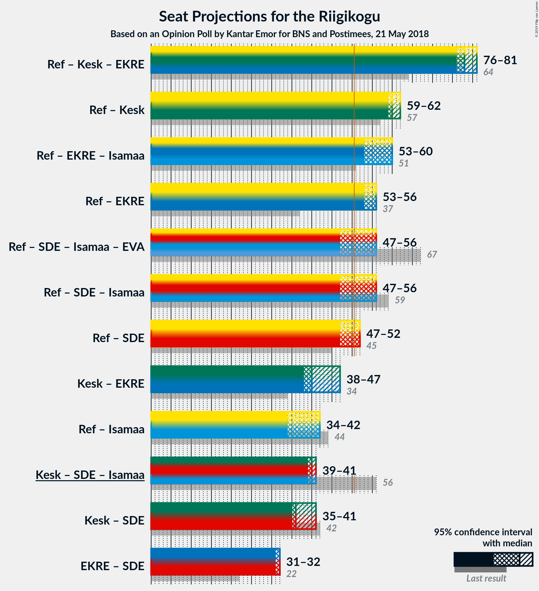

### Confidence Intervals

| Coalition | Last Result | Median | Majority? | 80% Confidence Interval | 90% Confidence Interval | 95% Confidence Interval | 99% Confidence Interval |
|:---------:|:-----------:|:------:|:---------:|:-----------------------:|:-----------------------:|:-----------------------:|:-----------------------:|
| Eesti Reformierakond – Eesti Keskerakond – Eesti Konservatiivne Rahvaerakond | 64 | 79 | 100% | 76–83 | 76–84 | 75–85 | 72–88 |
| Eesti Reformierakond – Eesti Keskerakond | 57 | 61 | 100% | 58–65 | 57–66 | 57–67 | 55–69 |
| Eesti Reformierakond – Eesti Konservatiivne Rahvaerakond – Erakond Isamaa | 51 | 59 | 99.9% | 55–62 | 55–62 | 54–64 | 52–66 |
| Eesti Reformierakond – Eesti Konservatiivne Rahvaerakond | 37 | 56 | 98% | 53–59 | 52–61 | 51–62 | 50–63 |
| Eesti Reformierakond – Sotsiaaldemokraatlik Erakond – Erakond Isamaa – Eesti Vabaerakond | 67 | 54 | 85% | 50–56 | 49–58 | 48–58 | 47–60 |
| Eesti Reformierakond – Sotsiaaldemokraatlik Erakond – Erakond Isamaa | 59 | 54 | 81% | 49–56 | 49–57 | 48–58 | 47–60 |
| Eesti Reformierakond – Sotsiaaldemokraatlik Erakond | 45 | 50 | 42% | 47–54 | 46–55 | 45–56 | 44–57 |
| Eesti Keskerakond – Eesti Konservatiivne Rahvaerakond | 34 | 42 | 0% | 38–45 | 38–46 | 37–47 | 36–48 |
| Eesti Reformierakond – Erakond Isamaa | 44 | 41 | 0% | 37–44 | 36–44 | 35–45 | 34–46 |
| Eesti Keskerakond – Sotsiaaldemokraatlik Erakond – Erakond Isamaa | 56 | 39 | 0% | 35–42 | 34–43 | 34–44 | 32–46 |
| Eesti Keskerakond – Sotsiaaldemokraatlik Erakond | 42 | 36 | 0% | 34–39 | 33–40 | 32–41 | 31–42 |
| Eesti Konservatiivne Rahvaerakond – Sotsiaaldemokraatlik Erakond | 22 | 30 | 0% | 28–33 | 27–34 | 27–35 | 26–36 |

### Eesti Reformierakond – Eesti Keskerakond – Eesti Konservatiivne Rahvaerakond

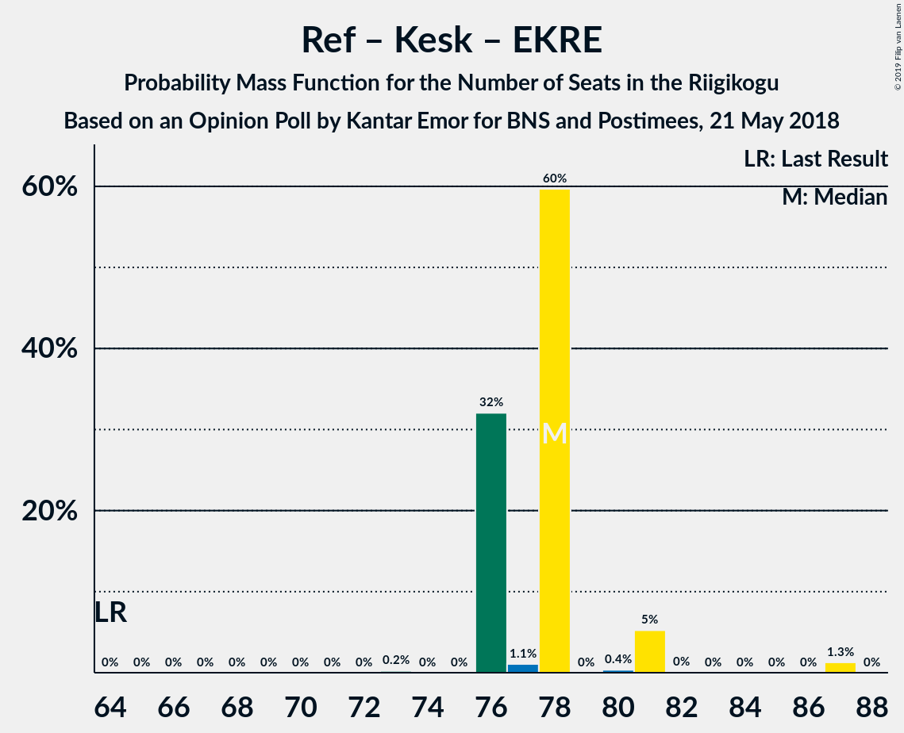

| Number of Seats | Probability | Accumulated | Special Marks |
|:---------------:|:-----------:|:-----------:|:-------------:|
| 64 | 0% | 100% | Last Result |
| 65 | 0% | 100% |  |
| 66 | 0% | 100% |  |
| 67 | 0% | 100% |  |
| 68 | 0% | 100% |  |
| 69 | 0% | 100% |  |
| 70 | 0.1% | 100% |  |
| 71 | 0.1% | 99.9% |  |
| 72 | 0.4% | 99.8% |  |
| 73 | 0.7% | 99.4% |  |
| 74 | 1.1% | 98.7% |  |
| 75 | 2% | 98% |  |
| 76 | 8% | 96% |  |
| 77 | 15% | 88% |  |
| 78 | 17% | 72% |  |
| 79 | 8% | 55% | Median |
| 80 | 13% | 48% |  |
| 81 | 8% | 34% |  |
| 82 | 6% | 27% |  |
| 83 | 11% | 20% |  |
| 84 | 5% | 9% |  |
| 85 | 2% | 4% |  |
| 86 | 0.6% | 2% |  |
| 87 | 0.2% | 1.4% |  |
| 88 | 0.9% | 1.2% |  |
| 89 | 0.2% | 0.3% |  |
| 90 | 0.1% | 0.1% |  |
| 91 | 0% | 0% |  |

### Eesti Reformierakond – Eesti Keskerakond

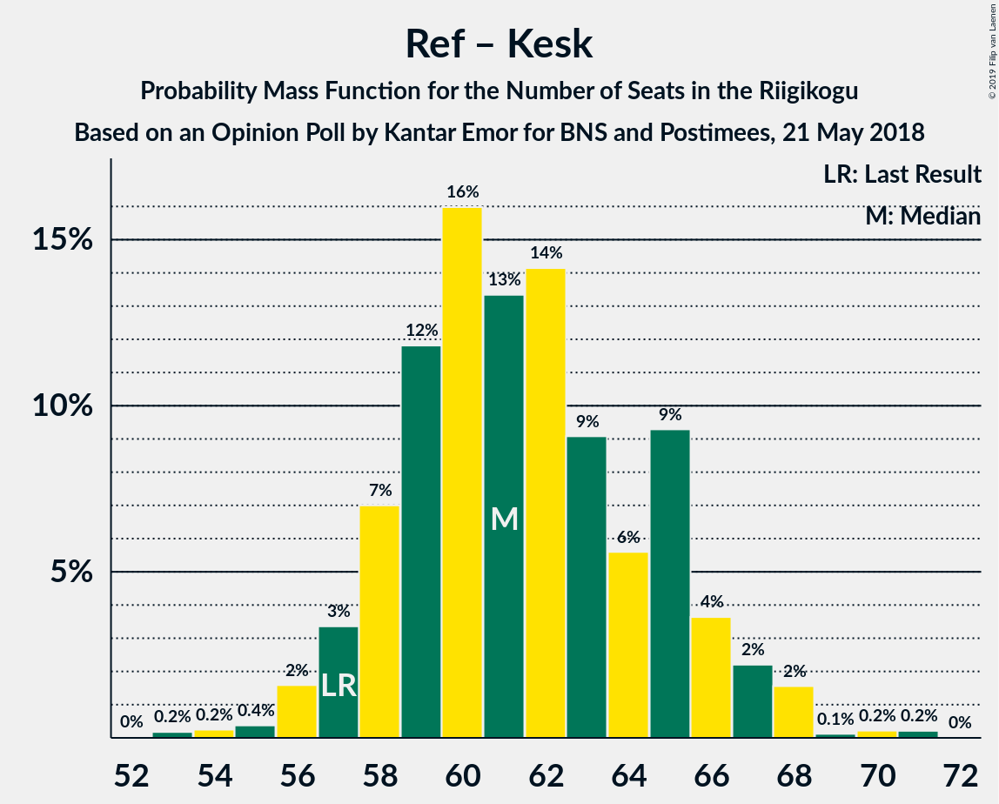

| Number of Seats | Probability | Accumulated | Special Marks |
|:---------------:|:-----------:|:-----------:|:-------------:|
| 53 | 0.2% | 100% |  |
| 54 | 0.2% | 99.8% |  |
| 55 | 0.4% | 99.6% |  |
| 56 | 2% | 99.2% |  |
| 57 | 3% | 98% | Last Result |
| 58 | 7% | 94% |  |
| 59 | 12% | 87% |  |
| 60 | 16% | 75% |  |
| 61 | 13% | 59% | Median |
| 62 | 14% | 46% |  |
| 63 | 9% | 32% |  |
| 64 | 6% | 23% |  |
| 65 | 9% | 17% |  |
| 66 | 4% | 8% |  |
| 67 | 2% | 4% |  |
| 68 | 2% | 2% |  |
| 69 | 0.1% | 0.6% |  |
| 70 | 0.2% | 0.4% |  |
| 71 | 0.2% | 0.2% |  |
| 72 | 0% | 0% |  |

### Eesti Reformierakond – Eesti Konservatiivne Rahvaerakond – Erakond Isamaa

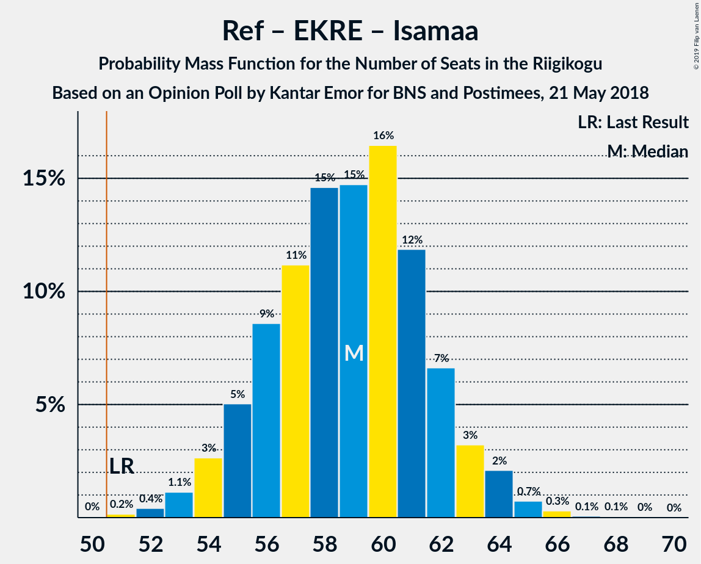

| Number of Seats | Probability | Accumulated | Special Marks |
|:---------------:|:-----------:|:-----------:|:-------------:|
| 50 | 0.1% | 100% |  |
| 51 | 0.2% | 99.9% | Last Result, Majority |
| 52 | 0.2% | 99.7% |  |
| 53 | 1.2% | 99.5% |  |
| 54 | 3% | 98% |  |
| 55 | 6% | 95% |  |
| 56 | 11% | 89% |  |
| 57 | 8% | 78% |  |
| 58 | 12% | 70% |  |
| 59 | 15% | 58% |  |
| 60 | 20% | 43% | Median |
| 61 | 8% | 23% |  |
| 62 | 10% | 15% |  |
| 63 | 2% | 5% |  |
| 64 | 2% | 3% |  |
| 65 | 0.3% | 0.9% |  |
| 66 | 0.5% | 0.5% |  |
| 67 | 0.1% | 0.1% |  |
| 68 | 0% | 0% |  |

### Eesti Reformierakond – Eesti Konservatiivne Rahvaerakond

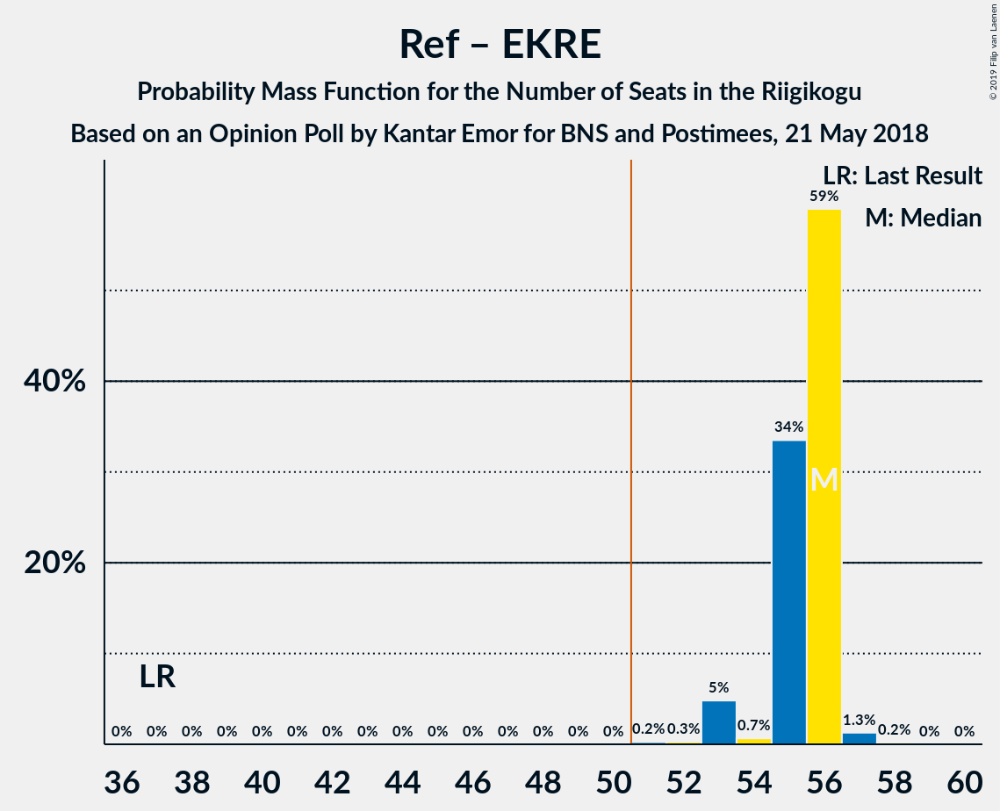

| Number of Seats | Probability | Accumulated | Special Marks |
|:---------------:|:-----------:|:-----------:|:-------------:|
| 37 | 0% | 100% | Last Result |
| 38 | 0% | 100% |  |
| 39 | 0% | 100% |  |
| 40 | 0% | 100% |  |
| 41 | 0% | 100% |  |
| 42 | 0% | 100% |  |
| 43 | 0% | 100% |  |
| 44 | 0% | 100% |  |
| 45 | 0% | 100% |  |
| 46 | 0% | 100% |  |
| 47 | 0% | 100% |  |
| 48 | 0.1% | 100% |  |
| 49 | 0.4% | 99.9% |  |
| 50 | 1.1% | 99.5% |  |
| 51 | 2% | 98% | Majority |
| 52 | 4% | 96% |  |
| 53 | 8% | 93% |  |
| 54 | 12% | 84% |  |
| 55 | 18% | 72% |  |
| 56 | 18% | 54% | Median |
| 57 | 14% | 36% |  |
| 58 | 6% | 22% |  |
| 59 | 6% | 16% |  |
| 60 | 5% | 10% |  |
| 61 | 2% | 5% |  |
| 62 | 1.3% | 3% |  |
| 63 | 1.1% | 1.3% |  |
| 64 | 0.2% | 0.3% |  |
| 65 | 0% | 0.1% |  |
| 66 | 0% | 0% |  |

### Eesti Reformierakond – Sotsiaaldemokraatlik Erakond – Erakond Isamaa – Eesti Vabaerakond

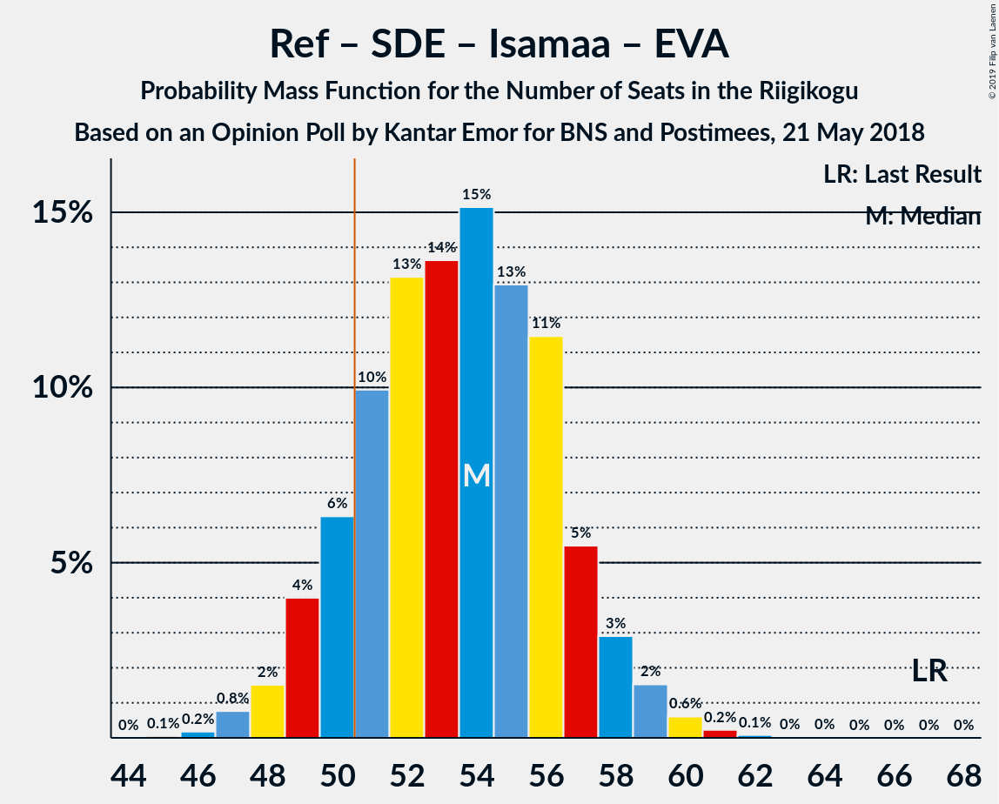

| Number of Seats | Probability | Accumulated | Special Marks |
|:---------------:|:-----------:|:-----------:|:-------------:|
| 45 | 0.1% | 100% |  |
| 46 | 0.1% | 99.9% |  |
| 47 | 0.7% | 99.8% |  |
| 48 | 2% | 99.1% |  |
| 49 | 4% | 97% |  |
| 50 | 8% | 93% |  |
| 51 | 8% | 85% | Majority |
| 52 | 8% | 78% |  |
| 53 | 13% | 69% |  |
| 54 | 20% | 57% | Median |
| 55 | 14% | 37% |  |
| 56 | 13% | 23% |  |
| 57 | 4% | 10% |  |
| 58 | 3% | 5% |  |
| 59 | 1.4% | 2% |  |
| 60 | 0.5% | 1.0% |  |
| 61 | 0.3% | 0.5% |  |
| 62 | 0.1% | 0.2% |  |
| 63 | 0% | 0% |  |
| 64 | 0% | 0% |  |
| 65 | 0% | 0% |  |
| 66 | 0% | 0% |  |
| 67 | 0% | 0% | Last Result |

### Eesti Reformierakond – Sotsiaaldemokraatlik Erakond – Erakond Isamaa

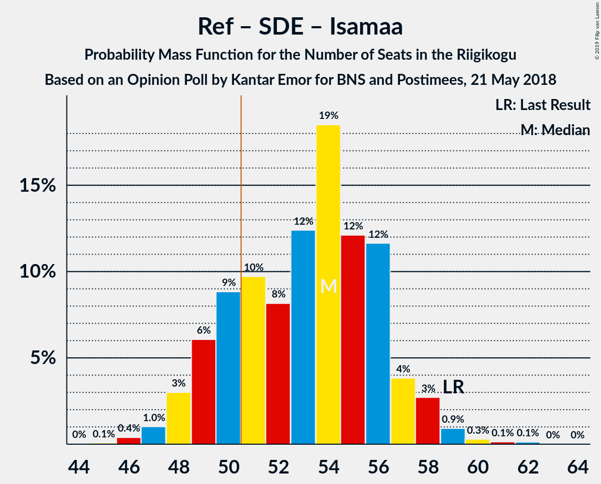

| Number of Seats | Probability | Accumulated | Special Marks |
|:---------------:|:-----------:|:-----------:|:-------------:|
| 45 | 0.1% | 100% |  |
| 46 | 0.4% | 99.9% |  |
| 47 | 1.0% | 99.5% |  |
| 48 | 3% | 98% |  |
| 49 | 6% | 95% |  |
| 50 | 9% | 89% |  |
| 51 | 10% | 81% | Majority |
| 52 | 8% | 71% |  |
| 53 | 12% | 63% |  |
| 54 | 19% | 50% | Median |
| 55 | 12% | 32% |  |
| 56 | 12% | 20% |  |
| 57 | 4% | 8% |  |
| 58 | 3% | 4% |  |
| 59 | 0.9% | 1.5% | Last Result |
| 60 | 0.3% | 0.6% |  |
| 61 | 0.1% | 0.3% |  |
| 62 | 0.1% | 0.1% |  |
| 63 | 0% | 0% |  |

### Eesti Reformierakond – Sotsiaaldemokraatlik Erakond

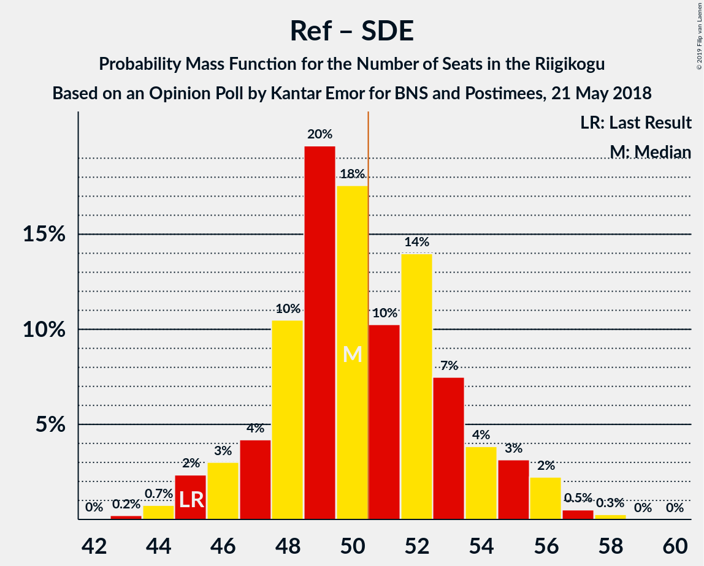

| Number of Seats | Probability | Accumulated | Special Marks |
|:---------------:|:-----------:|:-----------:|:-------------:|
| 43 | 0.2% | 100% |  |
| 44 | 0.7% | 99.7% |  |
| 45 | 2% | 99.0% | Last Result |
| 46 | 3% | 97% |  |
| 47 | 4% | 94% |  |
| 48 | 10% | 89% |  |
| 49 | 20% | 79% |  |
| 50 | 18% | 59% | Median |
| 51 | 10% | 42% | Majority |
| 52 | 14% | 31% |  |
| 53 | 7% | 18% |  |
| 54 | 4% | 10% |  |
| 55 | 3% | 6% |  |
| 56 | 2% | 3% |  |
| 57 | 0.5% | 0.8% |  |
| 58 | 0.3% | 0.3% |  |
| 59 | 0% | 0% |  |

### Eesti Keskerakond – Eesti Konservatiivne Rahvaerakond

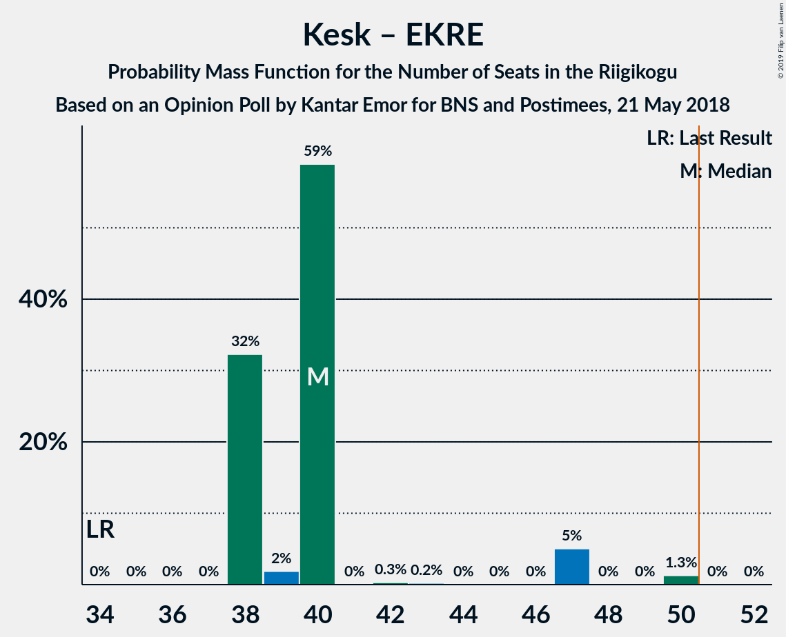

| Number of Seats | Probability | Accumulated | Special Marks |
|:---------------:|:-----------:|:-----------:|:-------------:|
| 34 | 0.1% | 100% | Last Result |
| 35 | 0.3% | 99.9% |  |
| 36 | 0.6% | 99.6% |  |
| 37 | 2% | 99.0% |  |
| 38 | 7% | 97% |  |
| 39 | 5% | 89% |  |
| 40 | 20% | 84% |  |
| 41 | 13% | 65% | Median |
| 42 | 19% | 51% |  |
| 43 | 7% | 33% |  |
| 44 | 10% | 25% |  |
| 45 | 10% | 15% |  |
| 46 | 3% | 6% |  |
| 47 | 2% | 3% |  |
| 48 | 0.6% | 1.0% |  |
| 49 | 0.2% | 0.4% |  |
| 50 | 0.1% | 0.2% |  |
| 51 | 0% | 0% | Majority |

### Eesti Reformierakond – Erakond Isamaa

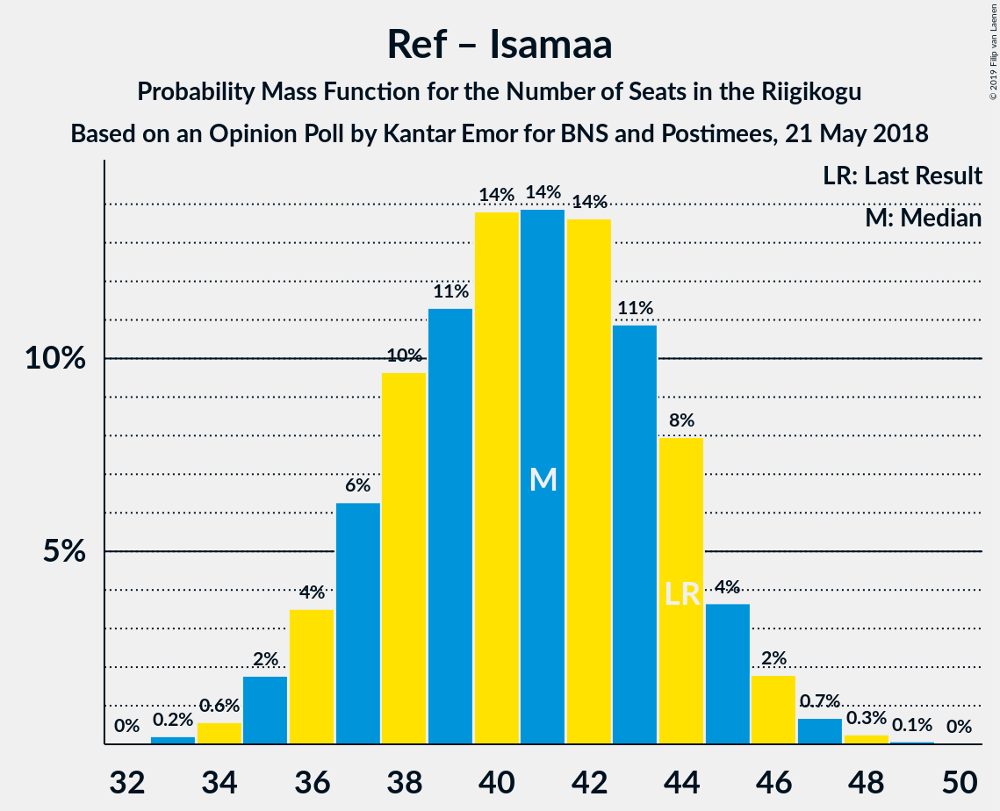

| Number of Seats | Probability | Accumulated | Special Marks |
|:---------------:|:-----------:|:-----------:|:-------------:|
| 33 | 0.1% | 100% |  |
| 34 | 0.7% | 99.8% |  |
| 35 | 2% | 99.1% |  |
| 36 | 3% | 97% |  |
| 37 | 7% | 94% |  |
| 38 | 12% | 87% |  |
| 39 | 7% | 75% |  |
| 40 | 10% | 68% |  |
| 41 | 13% | 58% |  |
| 42 | 19% | 46% | Median |
| 43 | 14% | 27% |  |
| 44 | 7% | 12% | Last Result |
| 45 | 3% | 5% |  |
| 46 | 2% | 2% |  |
| 47 | 0.1% | 0.5% |  |
| 48 | 0.2% | 0.3% |  |
| 49 | 0.1% | 0.1% |  |
| 50 | 0% | 0% |  |

### Eesti Keskerakond – Sotsiaaldemokraatlik Erakond – Erakond Isamaa

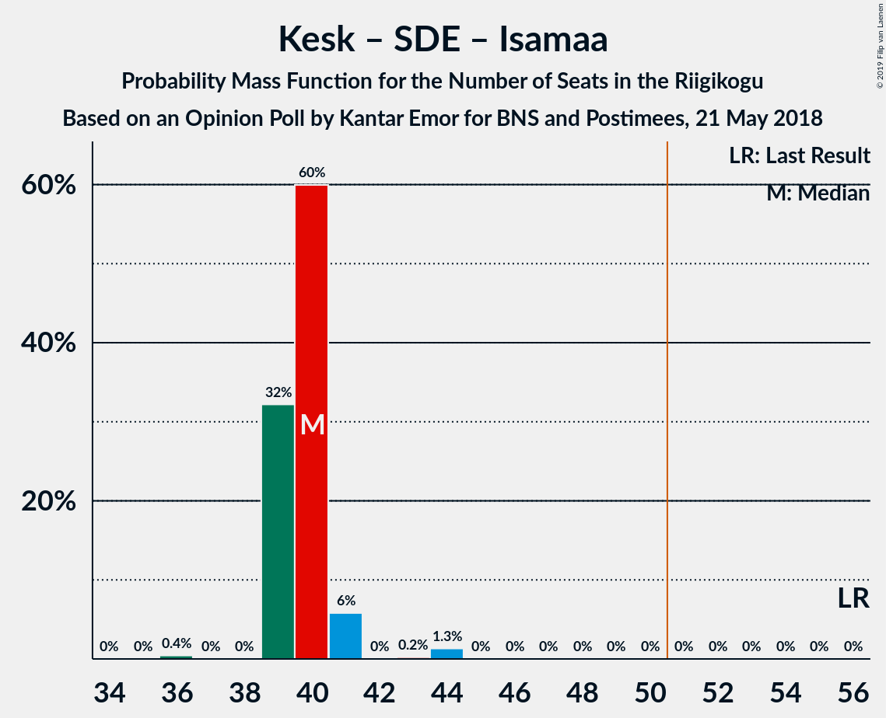

| Number of Seats | Probability | Accumulated | Special Marks |
|:---------------:|:-----------:|:-----------:|:-------------:|
| 31 | 0.1% | 100% |  |
| 32 | 0.5% | 99.9% |  |
| 33 | 1.0% | 99.4% |  |
| 34 | 5% | 98% |  |
| 35 | 7% | 94% |  |
| 36 | 5% | 87% |  |
| 37 | 8% | 82% |  |
| 38 | 11% | 74% |  |
| 39 | 19% | 63% | Median |
| 40 | 17% | 43% |  |
| 41 | 14% | 27% |  |
| 42 | 5% | 12% |  |
| 43 | 4% | 7% |  |
| 44 | 2% | 3% |  |
| 45 | 0.9% | 1.4% |  |
| 46 | 0.5% | 0.5% |  |
| 47 | 0% | 0.1% |  |
| 48 | 0% | 0% |  |
| 49 | 0% | 0% |  |
| 50 | 0% | 0% |  |
| 51 | 0% | 0% | Majority |
| 52 | 0% | 0% |  |
| 53 | 0% | 0% |  |
| 54 | 0% | 0% |  |
| 55 | 0% | 0% |  |
| 56 | 0% | 0% | Last Result |

### Eesti Keskerakond – Sotsiaaldemokraatlik Erakond

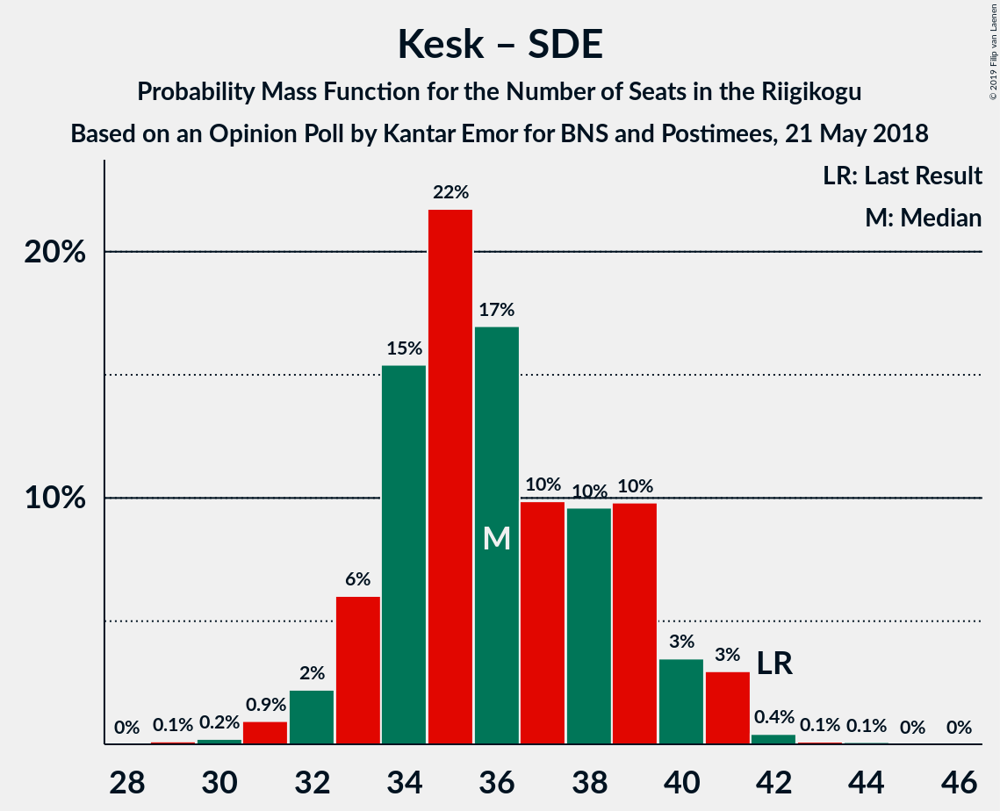

| Number of Seats | Probability | Accumulated | Special Marks |
|:---------------:|:-----------:|:-----------:|:-------------:|
| 29 | 0.1% | 100% |  |
| 30 | 0.2% | 99.9% |  |
| 31 | 0.9% | 99.6% |  |
| 32 | 2% | 98.7% |  |
| 33 | 6% | 96% |  |
| 34 | 15% | 90% |  |
| 35 | 22% | 75% | Median |
| 36 | 17% | 53% |  |
| 37 | 10% | 36% |  |
| 38 | 10% | 26% |  |
| 39 | 10% | 17% |  |
| 40 | 3% | 7% |  |
| 41 | 3% | 4% |  |
| 42 | 0.4% | 0.6% | Last Result |
| 43 | 0.1% | 0.2% |  |
| 44 | 0.1% | 0.1% |  |
| 45 | 0% | 0% |  |

### Eesti Konservatiivne Rahvaerakond – Sotsiaaldemokraatlik Erakond

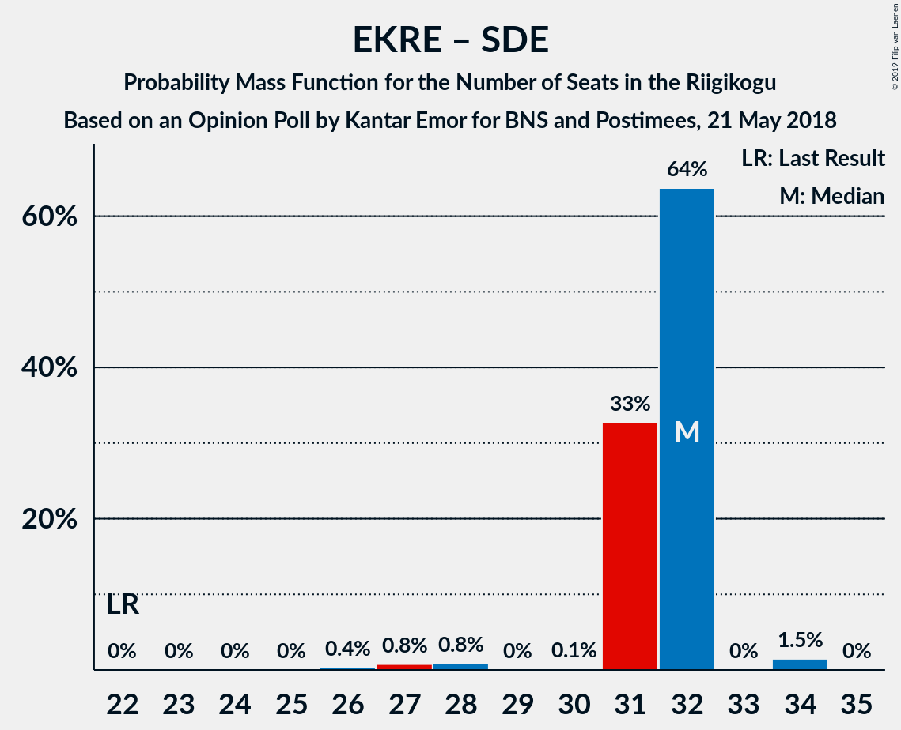

| Number of Seats | Probability | Accumulated | Special Marks |
|:---------------:|:-----------:|:-----------:|:-------------:|
| 22 | 0% | 100% | Last Result |
| 23 | 0% | 100% |  |
| 24 | 0.1% | 100% |  |
| 25 | 0.2% | 99.9% |  |
| 26 | 1.0% | 99.7% |  |
| 27 | 6% | 98.6% |  |
| 28 | 9% | 92% |  |
| 29 | 15% | 84% |  |
| 30 | 21% | 68% | Median |
| 31 | 18% | 47% |  |
| 32 | 12% | 29% |  |
| 33 | 9% | 17% |  |
| 34 | 5% | 9% |  |
| 35 | 3% | 3% |  |
| 36 | 0.4% | 0.7% |  |
| 37 | 0.2% | 0.2% |  |
| 38 | 0% | 0.1% |  |
| 39 | 0% | 0% |  |

## Technical Information

### Opinion Poll

+ **Polling firm:** Kantar Emor
+ **Commissioner(s):** BNS and Postimees
+ **Fieldwork period:** 21 May 2018

### Calculations

+ **Sample size:** 874
+ **Simulations done:** 131,072
+ **Error estimate:** 1.97%

