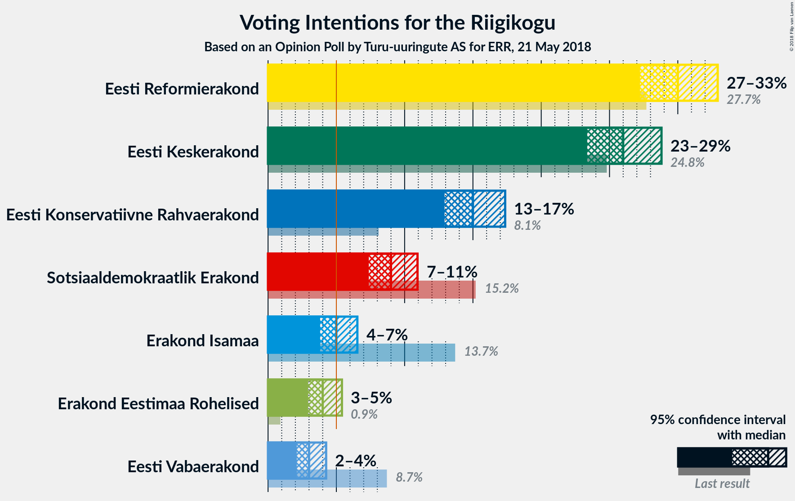
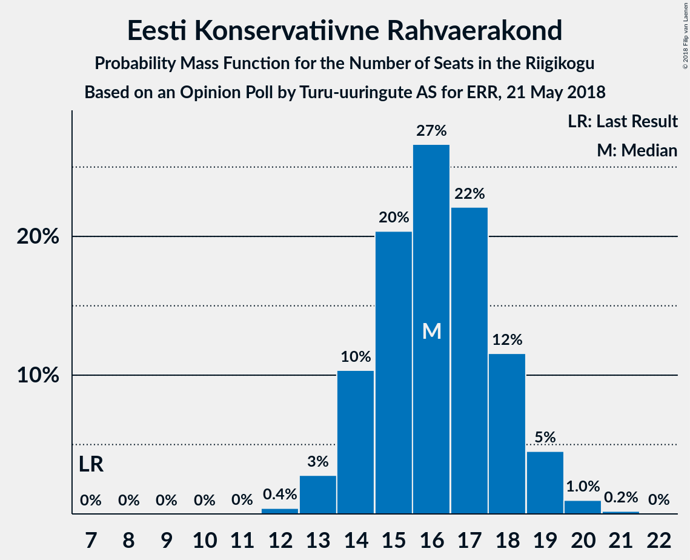

# Opinion Poll by Turu-uuringute AS for ERR, 21 May 2018

<a href="#voting-intentions">Voting Intentions</a> | <a href="#seats">Seats</a> | <a href="#coalitions">Coalitions</a> | <a href="#technical-information">Technical Information</a>

## Voting Intentions

### Confidence Intervals

| Party | Last Result | Poll Result | 80% Confidence Interval | 90% Confidence Interval | 95% Confidence Interval | 99% Confidence Interval |
|:-----:|:-----------:|:-----------:|:-----------------------:|:-----------------------:|:-----------------------:|:-----------------------:|
| Eesti Reformierakond | 27.7% | 30.0% | 28.2–31.9% |27.7–32.4% |27.2–32.9% |26.4–33.9% |
| Eesti Keskerakond | 24.8% | 26.0% | 24.3–27.8% |23.8–28.4% |23.4–28.8% |22.6–29.7% |
| Eesti Konservatiivne Rahvaerakond | 8.1% | 15.0% | 13.6–16.5% |13.2–17.0% |12.9–17.4% |12.3–18.1% |
| Sotsiaaldemokraatlik Erakond | 15.2% | 9.0% | 7.9–10.3% |7.6–10.6% |7.4–10.9% |6.9–11.6% |
| Erakond Isamaa | 13.7% | 5.0% | 4.2–6.0% |4.0–6.3% |3.8–6.5% |3.5–7.1% |
| Erakond Eestimaa Rohelised | 0.9% | 4.0% | 3.3–4.9% |3.1–5.2% |2.9–5.4% |2.7–5.9% |
| Eesti Vabaerakond | 8.7% | 3.0% | 2.4–3.8% |2.2–4.1% |2.1–4.3% |1.9–4.7% |

*Note:* The poll result column reflects the actual value used in the calculations. Published results may vary slightly, and in addition be rounded to fewer digits.

## Seats

### Confidence Intervals

| Party | Last Result | Median | 80% Confidence Interval | 90% Confidence Interval | 95% Confidence Interval | 99% Confidence Interval |
|:-----:|:-----------:|:------:|:-----------------------:|:-----------------------:|:-----------------------:|:-----------------------:|
| <a href="#eesti-reformierakond">Eesti Reformierakond</a> | 30 | 35 | 33–38 |32–38 |31–39 |30–40 |
| <a href="#eesti-keskerakond">Eesti Keskerakond</a> | 27 | 30 | 28–32 |27–33 |26–34 |25–35 |
| <a href="#eesti-konservatiivne-rahvaerakond">Eesti Konservatiivne Rahvaerakond</a> | 7 | 17 | 14–18 |13–19 |13–19 |13–20 |
| <a href="#sotsiaaldemokraatlik-erakond">Sotsiaaldemokraatlik Erakond</a> | 15 | 9 | 7–10 |7–11 |7–11 |6–12 |
| <a href="#erakond-isamaa">Erakond Isamaa</a> | 14 | 0 | 0–5 |0–6 |0–6 |0–7 |
| <a href="#erakond-eestimaa-rohelised">Erakond Eestimaa Rohelised</a> | 0 | 0 | 0 |0–4 |0–5 |0–5 |
| <a href="#eesti-vabaerakond">Eesti Vabaerakond</a> | 8 | 0 | 0 |0 |0 |0 |

### Eesti Reformierakond

*For a full overview of the results for this party, see the [Eesti Reformierakond](party-eestireformierakond.html) page.*

| Number of Seats | Probability | Accumulated | Special Marks |
|:---------------:|:-----------:|:-----------:|:-------------:|
| 29 | 0.2% | 100% |  |
| 30 | 0.8% | 99.8% | Last Result |
| 31 | 3% | 99.0% |  |
| 32 | 5% | 96% |  |
| 33 | 7% | 91% |  |
| 34 | 19% | 84% |  |
| 35 | 20% | 66% | Median |
| 36 | 17% | 45% |  |
| 37 | 17% | 28% |  |
| 38 | 8% | 11% |  |
| 39 | 1.3% | 3% |  |
| 40 | 0.7% | 1.2% |  |
| 41 | 0.4% | 0.5% |  |
| 42 | 0.1% | 0.1% |  |
| 43 | 0% | 0% |  |

### Eesti Keskerakond

*For a full overview of the results for this party, see the [Eesti Keskerakond](party-eestikeskerakond.html) page.*

| Number of Seats | Probability | Accumulated | Special Marks |
|:---------------:|:-----------:|:-----------:|:-------------:|
| 24 | 0.1% | 100% |  |
| 25 | 0.5% | 99.9% |  |
| 26 | 3% | 99.4% |  |
| 27 | 6% | 97% | Last Result |
| 28 | 11% | 90% |  |
| 29 | 16% | 80% |  |
| 30 | 27% | 64% | Median |
| 31 | 15% | 37% |  |
| 32 | 14% | 22% |  |
| 33 | 4% | 8% |  |
| 34 | 2% | 3% |  |
| 35 | 1.2% | 1.3% |  |
| 36 | 0.2% | 0.2% |  |
| 37 | 0% | 0% |  |

### Eesti Konservatiivne Rahvaerakond

*For a full overview of the results for this party, see the [Eesti Konservatiivne Rahvaerakond](party-eestikonservatiivnerahvaerakond.html) page.*

| Number of Seats | Probability | Accumulated | Special Marks |
|:---------------:|:-----------:|:-----------:|:-------------:|
| 7 | 0% | 100% | Last Result |
| 8 | 0% | 100% |  |
| 9 | 0% | 100% |  |
| 10 | 0% | 100% |  |
| 11 | 0% | 100% |  |
| 12 | 0.3% | 100% |  |
| 13 | 5% | 99.7% |  |
| 14 | 9% | 95% |  |
| 15 | 19% | 85% |  |
| 16 | 10% | 66% |  |
| 17 | 29% | 56% | Median |
| 18 | 19% | 27% |  |
| 19 | 6% | 8% |  |
| 20 | 1.3% | 1.5% |  |
| 21 | 0.2% | 0.2% |  |
| 22 | 0% | 0% |  |

### Sotsiaaldemokraatlik Erakond

*For a full overview of the results for this party, see the [Sotsiaaldemokraatlik Erakond](party-sotsiaaldemokraatlikerakond.html) page.*

| Number of Seats | Probability | Accumulated | Special Marks |
|:---------------:|:-----------:|:-----------:|:-------------:|
| 6 | 0.7% | 100% |  |
| 7 | 9% | 99.3% |  |
| 8 | 20% | 90% |  |
| 9 | 45% | 70% | Median |
| 10 | 18% | 25% |  |
| 11 | 5% | 6% |  |
| 12 | 1.4% | 2% |  |
| 13 | 0.2% | 0.2% |  |
| 14 | 0% | 0% |  |
| 15 | 0% | 0% | Last Result |

### Erakond Isamaa

*For a full overview of the results for this party, see the [Erakond Isamaa](party-erakondisamaa.html) page.*

| Number of Seats | Probability | Accumulated | Special Marks |
|:---------------:|:-----------:|:-----------:|:-------------:|
| 0 | 55% | 100% | Median |
| 1 | 0% | 45% |  |
| 2 | 0% | 45% |  |
| 3 | 0% | 45% |  |
| 4 | 8% | 45% |  |
| 5 | 27% | 36% |  |
| 6 | 8% | 9% |  |
| 7 | 1.0% | 1.0% |  |
| 8 | 0% | 0% |  |
| 9 | 0% | 0% |  |
| 10 | 0% | 0% |  |
| 11 | 0% | 0% |  |
| 12 | 0% | 0% |  |
| 13 | 0% | 0% |  |
| 14 | 0% | 0% | Last Result |

### Erakond Eestimaa Rohelised

*For a full overview of the results for this party, see the [Erakond Eestimaa Rohelised](party-erakondeestimaarohelised.html) page.*

| Number of Seats | Probability | Accumulated | Special Marks |
|:---------------:|:-----------:|:-----------:|:-------------:|
| 0 | 92% | 100% | Last Result, Median |
| 1 | 0% | 8% |  |
| 2 | 0% | 8% |  |
| 3 | 0% | 8% |  |
| 4 | 4% | 8% |  |
| 5 | 3% | 4% |  |
| 6 | 0.2% | 0.2% |  |
| 7 | 0% | 0% |  |

### Eesti Vabaerakond

*For a full overview of the results for this party, see the [Eesti Vabaerakond](party-eestivabaerakond.html) page.*

| Number of Seats | Probability | Accumulated | Special Marks |
|:---------------:|:-----------:|:-----------:|:-------------:|
| 0 | 99.8% | 100% | Median |
| 1 | 0% | 0.2% |  |
| 2 | 0% | 0.2% |  |
| 3 | 0% | 0.2% |  |
| 4 | 0.1% | 0.2% |  |
| 5 | 0.1% | 0.1% |  |
| 6 | 0% | 0% |  |
| 7 | 0% | 0% |  |
| 8 | 0% | 0% | Last Result |

## Coalitions

### Confidence Intervals

| Coalition | Last Result | Median | Majority? | 80% Confidence Interval | 90% Confidence Interval | 95% Confidence Interval | 99% Confidence Interval |
|:---------:|:-----------:|:------:|:---------:|:-----------------------:|:-----------------------:|:-----------------------:|:-----------------------:|
| Eesti Reformierakond – Eesti Keskerakond – Eesti Konservatiivne Rahvaerakond | 64 | 82 | 100% | 78–85 | 77–85 | 77–86 | 74–87 |
| Eesti Reformierakond – Eesti Keskerakond | 57 | 66 | 100% | 62–68 | 61–69 | 60–70 | 59–70 |
| Eesti Reformierakond – Eesti Konservatiivne Rahvaerakond – Erakond Isamaa | 51 | 54 | 94% | 51–57 | 50–58 | 49–58 | 48–60 |
| Eesti Reformierakond – Eesti Konservatiivne Rahvaerakond | 37 | 52 | 71% | 48–55 | 48–56 | 47–56 | 45–57 |
| Eesti Reformierakond – Sotsiaaldemokraatlik Erakond – Erakond Isamaa – Eesti Vabaerakond | 67 | 46 | 6% | 43–50 | 42–51 | 42–52 | 41–53 |
| Eesti Reformierakond – Sotsiaaldemokraatlik Erakond – Erakond Isamaa | 59 | 46 | 6% | 43–50 | 42–51 | 42–52 | 41–53 |
| Eesti Keskerakond – Eesti Konservatiivne Rahvaerakond | 34 | 47 | 4% | 43–49 | 42–50 | 42–51 | 41–52 |
| Eesti Reformierakond – Sotsiaaldemokraatlik Erakond | 45 | 44 | 0.2% | 41–47 | 41–47 | 40–48 | 38–50 |
| Eesti Keskerakond – Sotsiaaldemokraatlik Erakond – Erakond Isamaa | 56 | 41 | 0% | 38–44 | 37–45 | 37–46 | 36–47 |
| Eesti Keskerakond – Sotsiaaldemokraatlik Erakond | 42 | 39 | 0% | 36–42 | 36–42 | 35–43 | 34–44 |
| Eesti Reformierakond – Erakond Isamaa | 44 | 37 | 0% | 34–41 | 34–42 | 33–43 | 31–44 |
| Eesti Konservatiivne Rahvaerakond – Sotsiaaldemokraatlik Erakond | 22 | 26 | 0% | 22–27 | 22–28 | 22–29 | 21–30 |

### Eesti Reformierakond – Eesti Keskerakond – Eesti Konservatiivne Rahvaerakond

| Number of Seats | Probability | Accumulated | Special Marks |
|:---------------:|:-----------:|:-----------:|:-------------:|
| 64 | 0% | 100% | Last Result |
| 65 | 0% | 100% |  |
| 66 | 0% | 100% |  |
| 67 | 0% | 100% |  |
| 68 | 0% | 100% |  |
| 69 | 0% | 100% |  |
| 70 | 0% | 100% |  |
| 71 | 0% | 100% |  |
| 72 | 0% | 100% |  |
| 73 | 0.1% | 100% |  |
| 74 | 0.5% | 99.9% |  |
| 75 | 0.5% | 99.4% |  |
| 76 | 1.2% | 98.9% |  |
| 77 | 4% | 98% |  |
| 78 | 6% | 94% |  |
| 79 | 12% | 87% |  |
| 80 | 10% | 75% |  |
| 81 | 15% | 66% |  |
| 82 | 7% | 51% | Median |
| 83 | 11% | 44% |  |
| 84 | 19% | 33% |  |
| 85 | 11% | 14% |  |
| 86 | 2% | 3% |  |
| 87 | 1.0% | 1.1% |  |
| 88 | 0.1% | 0.1% |  |
| 89 | 0% | 0% |  |

### Eesti Reformierakond – Eesti Keskerakond

| Number of Seats | Probability | Accumulated | Special Marks |
|:---------------:|:-----------:|:-----------:|:-------------:|
| 57 | 0.1% | 100% | Last Result |
| 58 | 0.3% | 99.9% |  |
| 59 | 0.6% | 99.6% |  |
| 60 | 3% | 99.0% |  |
| 61 | 2% | 96% |  |
| 62 | 5% | 94% |  |
| 63 | 11% | 89% |  |
| 64 | 13% | 78% |  |
| 65 | 9% | 65% | Median |
| 66 | 26% | 56% |  |
| 67 | 19% | 30% |  |
| 68 | 4% | 11% |  |
| 69 | 4% | 7% |  |
| 70 | 3% | 3% |  |
| 71 | 0.2% | 0.5% |  |
| 72 | 0.1% | 0.2% |  |
| 73 | 0.1% | 0.1% |  |
| 74 | 0% | 0% |  |

### Eesti Reformierakond – Eesti Konservatiivne Rahvaerakond – Erakond Isamaa

| Number of Seats | Probability | Accumulated | Special Marks |
|:---------------:|:-----------:|:-----------:|:-------------:|
| 46 | 0% | 100% |  |
| 47 | 0.1% | 99.9% |  |
| 48 | 1.0% | 99.8% |  |
| 49 | 2% | 98.8% |  |
| 50 | 3% | 97% |  |
| 51 | 10% | 94% | Last Result, Majority |
| 52 | 15% | 84% | Median |
| 53 | 9% | 69% |  |
| 54 | 18% | 60% |  |
| 55 | 18% | 42% |  |
| 56 | 11% | 24% |  |
| 57 | 6% | 12% |  |
| 58 | 5% | 7% |  |
| 59 | 1.2% | 2% |  |
| 60 | 0.4% | 0.5% |  |
| 61 | 0.1% | 0.1% |  |
| 62 | 0% | 0% |  |

### Eesti Reformierakond – Eesti Konservatiivne Rahvaerakond

| Number of Seats | Probability | Accumulated | Special Marks |
|:---------------:|:-----------:|:-----------:|:-------------:|
| 37 | 0% | 100% | Last Result |
| 38 | 0% | 100% |  |
| 39 | 0% | 100% |  |
| 40 | 0% | 100% |  |
| 41 | 0% | 100% |  |
| 42 | 0% | 100% |  |
| 43 | 0% | 100% |  |
| 44 | 0.1% | 100% |  |
| 45 | 0.7% | 99.8% |  |
| 46 | 1.2% | 99.1% |  |
| 47 | 2% | 98% |  |
| 48 | 7% | 96% |  |
| 49 | 9% | 89% |  |
| 50 | 9% | 79% |  |
| 51 | 19% | 71% | Majority |
| 52 | 18% | 52% | Median |
| 53 | 9% | 34% |  |
| 54 | 12% | 25% |  |
| 55 | 7% | 13% |  |
| 56 | 5% | 6% |  |
| 57 | 0.8% | 1.1% |  |
| 58 | 0.2% | 0.3% |  |
| 59 | 0.1% | 0.1% |  |
| 60 | 0% | 0% |  |

### Eesti Reformierakond – Sotsiaaldemokraatlik Erakond – Erakond Isamaa – Eesti Vabaerakond

| Number of Seats | Probability | Accumulated | Special Marks |
|:---------------:|:-----------:|:-----------:|:-------------:|
| 39 | 0.1% | 100% |  |
| 40 | 0.4% | 99.9% |  |
| 41 | 1.4% | 99.5% |  |
| 42 | 4% | 98% |  |
| 43 | 4% | 94% |  |
| 44 | 16% | 90% | Median |
| 45 | 10% | 73% |  |
| 46 | 15% | 64% |  |
| 47 | 16% | 49% |  |
| 48 | 11% | 32% |  |
| 49 | 9% | 22% |  |
| 50 | 7% | 13% |  |
| 51 | 3% | 6% | Majority |
| 52 | 3% | 3% |  |
| 53 | 0.5% | 0.6% |  |
| 54 | 0.1% | 0.1% |  |
| 55 | 0% | 0% |  |
| 56 | 0% | 0% |  |
| 57 | 0% | 0% |  |
| 58 | 0% | 0% |  |
| 59 | 0% | 0% |  |
| 60 | 0% | 0% |  |
| 61 | 0% | 0% |  |
| 62 | 0% | 0% |  |
| 63 | 0% | 0% |  |
| 64 | 0% | 0% |  |
| 65 | 0% | 0% |  |
| 66 | 0% | 0% |  |
| 67 | 0% | 0% | Last Result |

### Eesti Reformierakond – Sotsiaaldemokraatlik Erakond – Erakond Isamaa

| Number of Seats | Probability | Accumulated | Special Marks |
|:---------------:|:-----------:|:-----------:|:-------------:|
| 39 | 0.1% | 100% |  |
| 40 | 0.4% | 99.9% |  |
| 41 | 1.4% | 99.5% |  |
| 42 | 4% | 98% |  |
| 43 | 4% | 94% |  |
| 44 | 16% | 90% | Median |
| 45 | 10% | 73% |  |
| 46 | 15% | 63% |  |
| 47 | 16% | 49% |  |
| 48 | 11% | 32% |  |
| 49 | 9% | 21% |  |
| 50 | 7% | 13% |  |
| 51 | 3% | 6% | Majority |
| 52 | 3% | 3% |  |
| 53 | 0.5% | 0.6% |  |
| 54 | 0.1% | 0.1% |  |
| 55 | 0% | 0% |  |
| 56 | 0% | 0% |  |
| 57 | 0% | 0% |  |
| 58 | 0% | 0% |  |
| 59 | 0% | 0% | Last Result |

### Eesti Keskerakond – Eesti Konservatiivne Rahvaerakond

| Number of Seats | Probability | Accumulated | Special Marks |
|:---------------:|:-----------:|:-----------:|:-------------:|
| 34 | 0% | 100% | Last Result |
| 35 | 0% | 100% |  |
| 36 | 0% | 100% |  |
| 37 | 0% | 100% |  |
| 38 | 0% | 100% |  |
| 39 | 0.1% | 100% |  |
| 40 | 0.3% | 99.9% |  |
| 41 | 2% | 99.6% |  |
| 42 | 4% | 98% |  |
| 43 | 4% | 94% |  |
| 44 | 14% | 89% |  |
| 45 | 11% | 75% |  |
| 46 | 12% | 65% |  |
| 47 | 14% | 53% | Median |
| 48 | 21% | 38% |  |
| 49 | 12% | 17% |  |
| 50 | 2% | 6% |  |
| 51 | 2% | 4% | Majority |
| 52 | 1.2% | 2% |  |
| 53 | 0.3% | 0.3% |  |
| 54 | 0% | 0.1% |  |
| 55 | 0% | 0% |  |

### Eesti Reformierakond – Sotsiaaldemokraatlik Erakond

| Number of Seats | Probability | Accumulated | Special Marks |
|:---------------:|:-----------:|:-----------:|:-------------:|
| 37 | 0.1% | 100% |  |
| 38 | 0.6% | 99.9% |  |
| 39 | 1.4% | 99.3% |  |
| 40 | 3% | 98% |  |
| 41 | 6% | 95% |  |
| 42 | 9% | 89% |  |
| 43 | 15% | 80% |  |
| 44 | 25% | 65% | Median |
| 45 | 13% | 40% | Last Result |
| 46 | 12% | 27% |  |
| 47 | 11% | 15% |  |
| 48 | 3% | 4% |  |
| 49 | 0.8% | 2% |  |
| 50 | 0.5% | 0.7% |  |
| 51 | 0.2% | 0.2% | Majority |
| 52 | 0% | 0% |  |

### Eesti Keskerakond – Sotsiaaldemokraatlik Erakond – Erakond Isamaa

| Number of Seats | Probability | Accumulated | Special Marks |
|:---------------:|:-----------:|:-----------:|:-------------:|
| 34 | 0.1% | 100% |  |
| 35 | 0.3% | 99.9% |  |
| 36 | 1.2% | 99.6% |  |
| 37 | 4% | 98% |  |
| 38 | 10% | 94% |  |
| 39 | 12% | 84% | Median |
| 40 | 11% | 72% |  |
| 41 | 18% | 61% |  |
| 42 | 11% | 43% |  |
| 43 | 13% | 32% |  |
| 44 | 10% | 19% |  |
| 45 | 6% | 10% |  |
| 46 | 2% | 4% |  |
| 47 | 1.5% | 2% |  |
| 48 | 0.2% | 0.3% |  |
| 49 | 0.1% | 0.1% |  |
| 50 | 0% | 0% |  |
| 51 | 0% | 0% | Majority |
| 52 | 0% | 0% |  |
| 53 | 0% | 0% |  |
| 54 | 0% | 0% |  |
| 55 | 0% | 0% |  |
| 56 | 0% | 0% | Last Result |

### Eesti Keskerakond – Sotsiaaldemokraatlik Erakond

| Number of Seats | Probability | Accumulated | Special Marks |
|:---------------:|:-----------:|:-----------:|:-------------:|
| 32 | 0.1% | 100% |  |
| 33 | 0.3% | 99.9% |  |
| 34 | 1.4% | 99.6% |  |
| 35 | 3% | 98% |  |
| 36 | 8% | 95% |  |
| 37 | 10% | 87% |  |
| 38 | 17% | 77% |  |
| 39 | 24% | 60% | Median |
| 40 | 12% | 36% |  |
| 41 | 14% | 24% |  |
| 42 | 5% | 10% | Last Result |
| 43 | 3% | 5% |  |
| 44 | 1.3% | 2% |  |
| 45 | 0.3% | 0.4% |  |
| 46 | 0.1% | 0.1% |  |
| 47 | 0% | 0% |  |

### Eesti Reformierakond – Erakond Isamaa

| Number of Seats | Probability | Accumulated | Special Marks |
|:---------------:|:-----------:|:-----------:|:-------------:|
| 30 | 0.1% | 100% |  |
| 31 | 0.5% | 99.9% |  |
| 32 | 2% | 99.4% |  |
| 33 | 1.5% | 98% |  |
| 34 | 9% | 96% |  |
| 35 | 13% | 88% | Median |
| 36 | 12% | 75% |  |
| 37 | 16% | 63% |  |
| 38 | 15% | 47% |  |
| 39 | 8% | 32% |  |
| 40 | 8% | 24% |  |
| 41 | 8% | 16% |  |
| 42 | 5% | 9% |  |
| 43 | 2% | 3% |  |
| 44 | 0.5% | 0.8% | Last Result |
| 45 | 0.3% | 0.3% |  |
| 46 | 0% | 0% |  |

### Eesti Konservatiivne Rahvaerakond – Sotsiaaldemokraatlik Erakond

| Number of Seats | Probability | Accumulated | Special Marks |
|:---------------:|:-----------:|:-----------:|:-------------:|
| 20 | 0.2% | 100% |  |
| 21 | 2% | 99.8% |  |
| 22 | 11% | 98% | Last Result |
| 23 | 8% | 87% |  |
| 24 | 14% | 79% |  |
| 25 | 11% | 65% |  |
| 26 | 22% | 54% | Median |
| 27 | 22% | 32% |  |
| 28 | 7% | 10% |  |
| 29 | 1.5% | 3% |  |
| 30 | 1.2% | 2% |  |
| 31 | 0.3% | 0.3% |  |
| 32 | 0% | 0% |  |

## Technical Information

### Opinion Poll

+ **Polling firm:** Turu-uuringute AS
+ **Commissioner(s):** ERR
+ **Fieldwork period:** 21 May 2018

### Calculations

+ **Sample size:** 1000
+ **Simulations done:** 131,072
+ **Error estimate:** 1.66%

