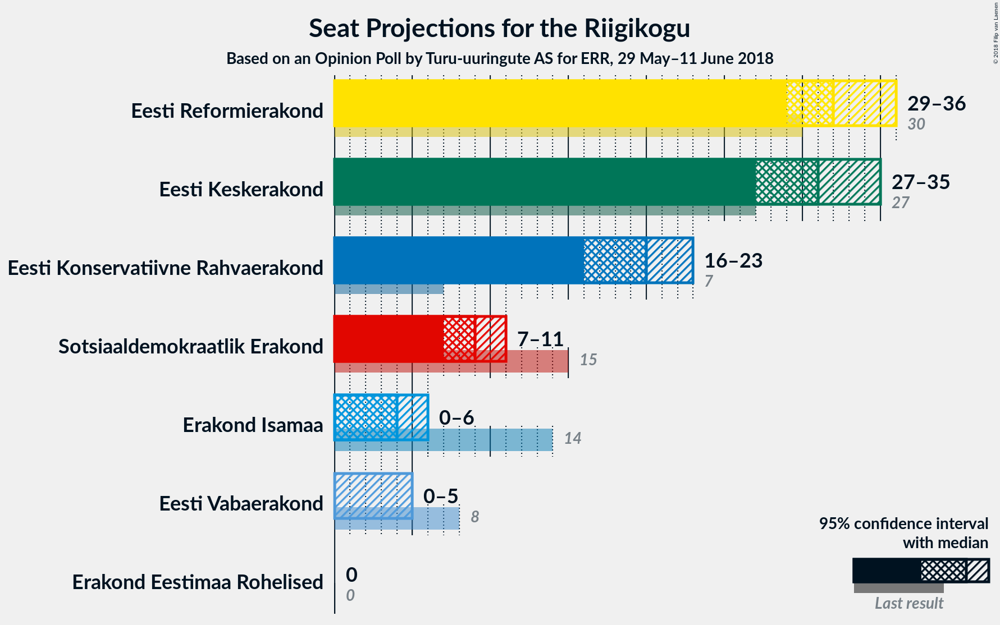
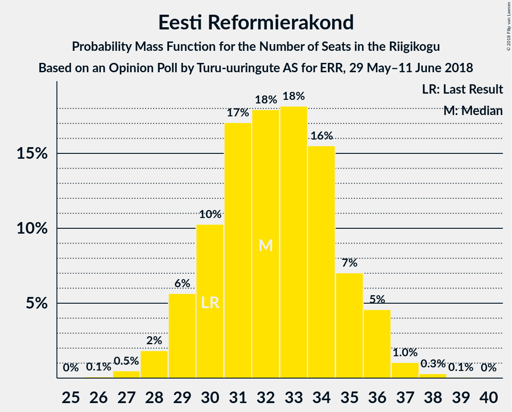
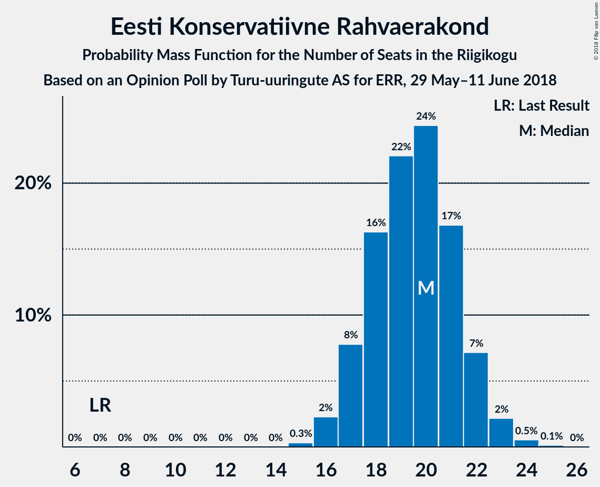
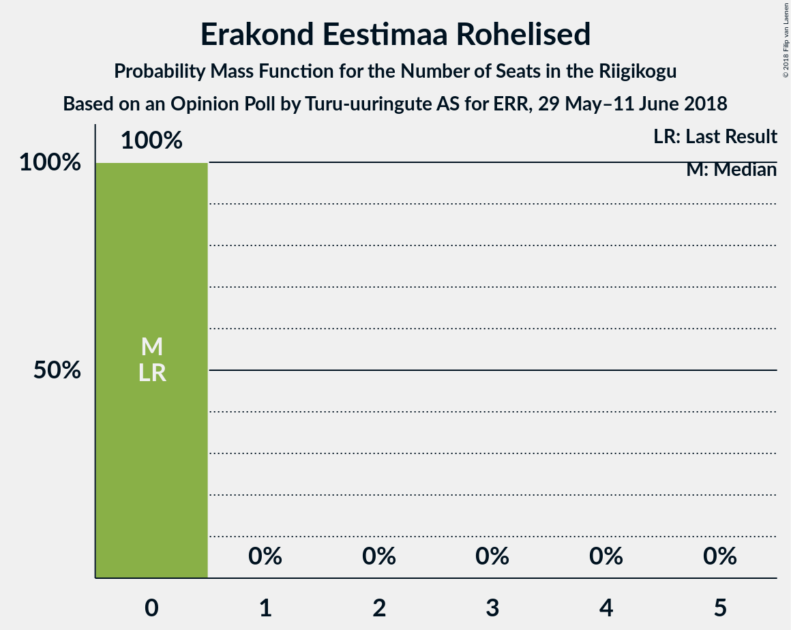

# Opinion Poll by Turu-uuringute AS for ERR, 29 May–11 June 2018

<a href="#voting-intentions">Voting Intentions</a> | <a href="#seats">Seats</a> | <a href="#coalitions">Coalitions</a> | <a href="#technical-information">Technical Information</a>

## Voting Intentions

### Confidence Intervals

| Party | Last Result | Poll Result | 80% Confidence Interval | 90% Confidence Interval | 95% Confidence Interval | 99% Confidence Interval |
|:-----:|:-----------:|:-----------:|:-----------------------:|:-----------------------:|:-----------------------:|:-----------------------:|
| Eesti Reformierakond | 27.7% | 28.0% | 26.3–29.9% |25.8–30.5% |25.3–30.9% |24.5–31.8% |
| Eesti Keskerakond | 24.8% | 27.0% | 25.3–28.9% |24.8–29.4% |24.4–29.9% |23.6–30.8% |
| Eesti Konservatiivne Rahvaerakond | 8.1% | 18.0% | 16.5–19.6% |16.1–20.1% |15.7–20.5% |15.0–21.3% |
| Sotsiaaldemokraatlik Erakond | 15.2% | 9.0% | 7.9–10.2% |7.6–10.6% |7.4–10.9% |6.9–11.6% |
| Erakond Isamaa | 13.7% | 5.0% | 4.2–6.0% |4.0–6.3% |3.8–6.5% |3.5–7.0% |
| Eesti Vabaerakond | 8.7% | 4.0% | 3.3–4.9% |3.1–5.2% |2.9–5.4% |2.6–5.9% |
| Erakond Eestimaa Rohelised | 0.9% | 2.0% | 1.5–2.7% |1.4–2.9% |1.3–3.1% |1.1–3.4% |

*Note:* The poll result column reflects the actual value used in the calculations. Published results may vary slightly, and in addition be rounded to fewer digits.

## Seats

### Confidence Intervals

| Party | Last Result | Median | 80% Confidence Interval | 90% Confidence Interval | 95% Confidence Interval | 99% Confidence Interval |
|:-----:|:-----------:|:------:|:-----------------------:|:-----------------------:|:-----------------------:|:-----------------------:|
| <a href="#eesti-reformierakond">Eesti Reformierakond</a> | 30 | 32 | 30–35 |29–36 |29–36 |27–37 |
| <a href="#eesti-keskerakond">Eesti Keskerakond</a> | 27 | 31 | 29–33 |28–34 |27–35 |26–36 |
| <a href="#eesti-konservatiivne-rahvaerakond">Eesti Konservatiivne Rahvaerakond</a> | 7 | 20 | 17–22 |17–22 |16–23 |16–24 |
| <a href="#sotsiaaldemokraatlik-erakond">Sotsiaaldemokraatlik Erakond</a> | 15 | 9 | 7–10 |7–11 |7–11 |6–12 |
| <a href="#erakond-isamaa">Erakond Isamaa</a> | 14 | 4 | 0–5 |0–6 |0–6 |0–6 |
| <a href="#eesti-vabaerakond">Eesti Vabaerakond</a> | 8 | 0 | 0 |0–4 |0–5 |0–5 |
| <a href="#erakond-eestimaa-rohelised">Erakond Eestimaa Rohelised</a> | 0 | 0 | 0 |0 |0 |0 |

### Eesti Reformierakond

*For a full overview of the results for this party, see the [Eesti Reformierakond](party-eestireformierakond.html) page.*

| Number of Seats | Probability | Accumulated | Special Marks |
|:---------------:|:-----------:|:-----------:|:-------------:|
| 26 | 0.1% | 100% |  |
| 27 | 0.5% | 99.9% |  |
| 28 | 2% | 99.4% |  |
| 29 | 6% | 98% |  |
| 30 | 10% | 92% | Last Result |
| 31 | 17% | 82% |  |
| 32 | 18% | 65% | Median |
| 33 | 18% | 47% |  |
| 34 | 16% | 29% |  |
| 35 | 7% | 13% |  |
| 36 | 5% | 6% |  |
| 37 | 1.0% | 1.4% |  |
| 38 | 0.3% | 0.4% |  |
| 39 | 0.1% | 0.1% |  |
| 40 | 0% | 0% |  |

### Eesti Keskerakond

*For a full overview of the results for this party, see the [Eesti Keskerakond](party-eestikeskerakond.html) page.*

| Number of Seats | Probability | Accumulated | Special Marks |
|:---------------:|:-----------:|:-----------:|:-------------:|
| 25 | 0.1% | 100% |  |
| 26 | 0.7% | 99.8% |  |
| 27 | 3% | 99.2% | Last Result |
| 28 | 6% | 96% |  |
| 29 | 11% | 91% |  |
| 30 | 20% | 80% |  |
| 31 | 23% | 59% | Median |
| 32 | 16% | 36% |  |
| 33 | 11% | 19% |  |
| 34 | 5% | 9% |  |
| 35 | 2% | 4% |  |
| 36 | 0.9% | 1.3% |  |
| 37 | 0.3% | 0.3% |  |
| 38 | 0% | 0.1% |  |
| 39 | 0% | 0% |  |

### Eesti Konservatiivne Rahvaerakond

*For a full overview of the results for this party, see the [Eesti Konservatiivne Rahvaerakond](party-eestikonservatiivnerahvaerakond.html) page.*

| Number of Seats | Probability | Accumulated | Special Marks |
|:---------------:|:-----------:|:-----------:|:-------------:|
| 7 | 0% | 100% | Last Result |
| 8 | 0% | 100% |  |
| 9 | 0% | 100% |  |
| 10 | 0% | 100% |  |
| 11 | 0% | 100% |  |
| 12 | 0% | 100% |  |
| 13 | 0% | 100% |  |
| 14 | 0% | 100% |  |
| 15 | 0.3% | 100% |  |
| 16 | 2% | 99.7% |  |
| 17 | 8% | 97% |  |
| 18 | 16% | 90% |  |
| 19 | 22% | 73% |  |
| 20 | 24% | 51% | Median |
| 21 | 17% | 27% |  |
| 22 | 7% | 10% |  |
| 23 | 2% | 3% |  |
| 24 | 0.5% | 0.7% |  |
| 25 | 0.1% | 0.2% |  |
| 26 | 0% | 0% |  |

### Sotsiaaldemokraatlik Erakond

*For a full overview of the results for this party, see the [Sotsiaaldemokraatlik Erakond](party-sotsiaaldemokraatlikerakond.html) page.*

| Number of Seats | Probability | Accumulated | Special Marks |
|:---------------:|:-----------:|:-----------:|:-------------:|
| 6 | 1.0% | 100% |  |
| 7 | 9% | 99.0% |  |
| 8 | 29% | 90% |  |
| 9 | 35% | 61% | Median |
| 10 | 19% | 26% |  |
| 11 | 6% | 7% |  |
| 12 | 0.9% | 1.0% |  |
| 13 | 0.1% | 0.1% |  |
| 14 | 0% | 0% |  |
| 15 | 0% | 0% | Last Result |

### Erakond Isamaa

*For a full overview of the results for this party, see the [Erakond Isamaa](party-erakondisamaa.html) page.*

| Number of Seats | Probability | Accumulated | Special Marks |
|:---------------:|:-----------:|:-----------:|:-------------:|
| 0 | 49% | 100% |  |
| 1 | 0% | 51% |  |
| 2 | 0% | 51% |  |
| 3 | 0% | 51% |  |
| 4 | 14% | 51% | Median |
| 5 | 31% | 37% |  |
| 6 | 6% | 6% |  |
| 7 | 0.4% | 0.4% |  |
| 8 | 0% | 0% |  |
| 9 | 0% | 0% |  |
| 10 | 0% | 0% |  |
| 11 | 0% | 0% |  |
| 12 | 0% | 0% |  |
| 13 | 0% | 0% |  |
| 14 | 0% | 0% | Last Result |

### Eesti Vabaerakond

*For a full overview of the results for this party, see the [Eesti Vabaerakond](party-eestivabaerakond.html) page.*

| Number of Seats | Probability | Accumulated | Special Marks |
|:---------------:|:-----------:|:-----------:|:-------------:|
| 0 | 92% | 100% | Median |
| 1 | 0% | 8% |  |
| 2 | 0% | 8% |  |
| 3 | 0% | 8% |  |
| 4 | 4% | 8% |  |
| 5 | 3% | 3% |  |
| 6 | 0.1% | 0.1% |  |
| 7 | 0% | 0% |  |
| 8 | 0% | 0% | Last Result |

### Erakond Eestimaa Rohelised

*For a full overview of the results for this party, see the [Erakond Eestimaa Rohelised](party-erakondeestimaarohelised.html) page.*

| Number of Seats | Probability | Accumulated | Special Marks |
|:---------------:|:-----------:|:-----------:|:-------------:|
| 0 | 100% | 100% | Last Result, Median |

## Coalitions

### Confidence Intervals

| Coalition | Last Result | Median | Majority? | 80% Confidence Interval | 90% Confidence Interval | 95% Confidence Interval | 99% Confidence Interval |
|:---------:|:-----------:|:------:|:---------:|:-----------------------:|:-----------------------:|:-----------------------:|:-----------------------:|
| Eesti Reformierakond – Eesti Keskerakond – Eesti Konservatiivne Rahvaerakond | 64 | 83 | 100% | 79–86 | 79–87 | 78–87 | 76–88 |
| Eesti Reformierakond – Eesti Keskerakond | 57 | 63 | 100% | 60–66 | 59–67 | 58–68 | 57–69 |
| Eesti Reformierakond – Eesti Konservatiivne Rahvaerakond – Erakond Isamaa | 51 | 54 | 94% | 51–57 | 50–58 | 50–59 | 48–60 |
| Eesti Reformierakond – Eesti Konservatiivne Rahvaerakond | 37 | 52 | 71% | 49–55 | 48–56 | 47–56 | 46–58 |
| Eesti Keskerakond – Eesti Konservatiivne Rahvaerakond | 34 | 50 | 50% | 47–53 | 47–54 | 46–55 | 45–56 |
| Eesti Reformierakond – Sotsiaaldemokraatlik Erakond – Erakond Isamaa – Eesti Vabaerakond | 67 | 44 | 0.3% | 41–47 | 40–48 | 39–49 | 38–50 |
| Eesti Reformierakond – Sotsiaaldemokraatlik Erakond – Erakond Isamaa | 59 | 44 | 0.1% | 40–47 | 40–48 | 39–48 | 37–49 |
| Eesti Keskerakond – Sotsiaaldemokraatlik Erakond – Erakond Isamaa | 56 | 42 | 0% | 39–46 | 38–46 | 38–47 | 36–48 |
| Eesti Reformierakond – Sotsiaaldemokraatlik Erakond | 45 | 41 | 0% | 38–44 | 38–45 | 37–45 | 36–47 |
| Eesti Keskerakond – Sotsiaaldemokraatlik Erakond | 42 | 40 | 0% | 37–42 | 36–43 | 36–44 | 34–45 |
| Eesti Reformierakond – Erakond Isamaa | 44 | 35 | 0% | 31–38 | 31–39 | 30–39 | 29–41 |
| Eesti Konservatiivne Rahvaerakond – Sotsiaaldemokraatlik Erakond | 22 | 28 | 0% | 26–31 | 25–31 | 25–32 | 24–33 |

### Eesti Reformierakond – Eesti Keskerakond – Eesti Konservatiivne Rahvaerakond

| Number of Seats | Probability | Accumulated | Special Marks |
|:---------------:|:-----------:|:-----------:|:-------------:|
| 64 | 0% | 100% | Last Result |
| 65 | 0% | 100% |  |
| 66 | 0% | 100% |  |
| 67 | 0% | 100% |  |
| 68 | 0% | 100% |  |
| 69 | 0% | 100% |  |
| 70 | 0% | 100% |  |
| 71 | 0% | 100% |  |
| 72 | 0% | 100% |  |
| 73 | 0% | 100% |  |
| 74 | 0% | 100% |  |
| 75 | 0.2% | 99.9% |  |
| 76 | 0.5% | 99.7% |  |
| 77 | 1.1% | 99.2% |  |
| 78 | 3% | 98% |  |
| 79 | 6% | 95% |  |
| 80 | 10% | 90% |  |
| 81 | 14% | 80% |  |
| 82 | 14% | 66% |  |
| 83 | 11% | 52% | Median |
| 84 | 10% | 41% |  |
| 85 | 15% | 31% |  |
| 86 | 10% | 16% |  |
| 87 | 4% | 6% |  |
| 88 | 2% | 2% |  |
| 89 | 0.2% | 0.3% |  |
| 90 | 0% | 0.1% |  |
| 91 | 0% | 0.1% |  |
| 92 | 0% | 0% |  |

### Eesti Reformierakond – Eesti Keskerakond

| Number of Seats | Probability | Accumulated | Special Marks |
|:---------------:|:-----------:|:-----------:|:-------------:|
| 55 | 0.1% | 100% |  |
| 56 | 0.2% | 99.9% |  |
| 57 | 0.6% | 99.7% | Last Result |
| 58 | 2% | 99.2% |  |
| 59 | 5% | 97% |  |
| 60 | 6% | 92% |  |
| 61 | 10% | 86% |  |
| 62 | 10% | 77% |  |
| 63 | 19% | 66% | Median |
| 64 | 17% | 47% |  |
| 65 | 15% | 30% |  |
| 66 | 7% | 15% |  |
| 67 | 4% | 9% |  |
| 68 | 3% | 4% |  |
| 69 | 0.9% | 1.3% |  |
| 70 | 0.2% | 0.3% |  |
| 71 | 0.1% | 0.1% |  |
| 72 | 0% | 0% |  |

### Eesti Reformierakond – Eesti Konservatiivne Rahvaerakond – Erakond Isamaa

| Number of Seats | Probability | Accumulated | Special Marks |
|:---------------:|:-----------:|:-----------:|:-------------:|
| 47 | 0.2% | 100% |  |
| 48 | 0.4% | 99.8% |  |
| 49 | 2% | 99.3% |  |
| 50 | 3% | 98% |  |
| 51 | 5% | 94% | Last Result, Majority |
| 52 | 11% | 89% |  |
| 53 | 12% | 78% |  |
| 54 | 18% | 66% |  |
| 55 | 17% | 48% |  |
| 56 | 15% | 31% | Median |
| 57 | 8% | 15% |  |
| 58 | 4% | 7% |  |
| 59 | 2% | 3% |  |
| 60 | 0.7% | 0.9% |  |
| 61 | 0.2% | 0.3% |  |
| 62 | 0% | 0% |  |

### Eesti Reformierakond – Eesti Konservatiivne Rahvaerakond

| Number of Seats | Probability | Accumulated | Special Marks |
|:---------------:|:-----------:|:-----------:|:-------------:|
| 37 | 0% | 100% | Last Result |
| 38 | 0% | 100% |  |
| 39 | 0% | 100% |  |
| 40 | 0% | 100% |  |
| 41 | 0% | 100% |  |
| 42 | 0% | 100% |  |
| 43 | 0% | 100% |  |
| 44 | 0% | 100% |  |
| 45 | 0.3% | 99.9% |  |
| 46 | 0.7% | 99.7% |  |
| 47 | 2% | 99.0% |  |
| 48 | 5% | 97% |  |
| 49 | 9% | 92% |  |
| 50 | 13% | 84% |  |
| 51 | 16% | 71% | Majority |
| 52 | 17% | 54% | Median |
| 53 | 12% | 38% |  |
| 54 | 12% | 26% |  |
| 55 | 8% | 14% |  |
| 56 | 4% | 6% |  |
| 57 | 2% | 2% |  |
| 58 | 0.3% | 0.5% |  |
| 59 | 0.1% | 0.2% |  |
| 60 | 0% | 0% |  |

### Eesti Keskerakond – Eesti Konservatiivne Rahvaerakond

| Number of Seats | Probability | Accumulated | Special Marks |
|:---------------:|:-----------:|:-----------:|:-------------:|
| 34 | 0% | 100% | Last Result |
| 35 | 0% | 100% |  |
| 36 | 0% | 100% |  |
| 37 | 0% | 100% |  |
| 38 | 0% | 100% |  |
| 39 | 0% | 100% |  |
| 40 | 0% | 100% |  |
| 41 | 0% | 100% |  |
| 42 | 0% | 100% |  |
| 43 | 0.1% | 100% |  |
| 44 | 0.3% | 99.9% |  |
| 45 | 1.3% | 99.6% |  |
| 46 | 2% | 98% |  |
| 47 | 7% | 96% |  |
| 48 | 8% | 89% |  |
| 49 | 14% | 80% |  |
| 50 | 17% | 67% |  |
| 51 | 18% | 50% | Median, Majority |
| 52 | 12% | 32% |  |
| 53 | 11% | 20% |  |
| 54 | 5% | 9% |  |
| 55 | 3% | 4% |  |
| 56 | 0.8% | 1.3% |  |
| 57 | 0.4% | 0.5% |  |
| 58 | 0.1% | 0.1% |  |
| 59 | 0% | 0% |  |

### Eesti Reformierakond – Sotsiaaldemokraatlik Erakond – Erakond Isamaa – Eesti Vabaerakond

| Number of Seats | Probability | Accumulated | Special Marks |
|:---------------:|:-----------:|:-----------:|:-------------:|
| 36 | 0.1% | 100% |  |
| 37 | 0.2% | 99.9% |  |
| 38 | 0.7% | 99.7% |  |
| 39 | 2% | 99.1% |  |
| 40 | 5% | 97% |  |
| 41 | 8% | 92% |  |
| 42 | 11% | 84% |  |
| 43 | 17% | 73% |  |
| 44 | 15% | 56% |  |
| 45 | 16% | 41% | Median |
| 46 | 10% | 26% |  |
| 47 | 8% | 15% |  |
| 48 | 5% | 8% |  |
| 49 | 2% | 3% |  |
| 50 | 0.7% | 1.0% |  |
| 51 | 0.3% | 0.3% | Majority |
| 52 | 0.1% | 0.1% |  |
| 53 | 0% | 0% |  |
| 54 | 0% | 0% |  |
| 55 | 0% | 0% |  |
| 56 | 0% | 0% |  |
| 57 | 0% | 0% |  |
| 58 | 0% | 0% |  |
| 59 | 0% | 0% |  |
| 60 | 0% | 0% |  |
| 61 | 0% | 0% |  |
| 62 | 0% | 0% |  |
| 63 | 0% | 0% |  |
| 64 | 0% | 0% |  |
| 65 | 0% | 0% |  |
| 66 | 0% | 0% |  |
| 67 | 0% | 0% | Last Result |

### Eesti Reformierakond – Sotsiaaldemokraatlik Erakond – Erakond Isamaa

| Number of Seats | Probability | Accumulated | Special Marks |
|:---------------:|:-----------:|:-----------:|:-------------:|
| 36 | 0.1% | 100% |  |
| 37 | 0.4% | 99.8% |  |
| 38 | 1.0% | 99.5% |  |
| 39 | 3% | 98% |  |
| 40 | 6% | 95% |  |
| 41 | 10% | 90% |  |
| 42 | 12% | 80% |  |
| 43 | 18% | 69% |  |
| 44 | 14% | 51% |  |
| 45 | 15% | 37% | Median |
| 46 | 10% | 21% |  |
| 47 | 6% | 12% |  |
| 48 | 4% | 5% |  |
| 49 | 1.2% | 2% |  |
| 50 | 0.4% | 0.5% |  |
| 51 | 0.1% | 0.1% | Majority |
| 52 | 0% | 0% |  |
| 53 | 0% | 0% |  |
| 54 | 0% | 0% |  |
| 55 | 0% | 0% |  |
| 56 | 0% | 0% |  |
| 57 | 0% | 0% |  |
| 58 | 0% | 0% |  |
| 59 | 0% | 0% | Last Result |

### Eesti Keskerakond – Sotsiaaldemokraatlik Erakond – Erakond Isamaa

| Number of Seats | Probability | Accumulated | Special Marks |
|:---------------:|:-----------:|:-----------:|:-------------:|
| 35 | 0.2% | 100% |  |
| 36 | 0.4% | 99.8% |  |
| 37 | 1.2% | 99.4% |  |
| 38 | 4% | 98% |  |
| 39 | 8% | 94% |  |
| 40 | 14% | 86% |  |
| 41 | 12% | 72% |  |
| 42 | 15% | 61% |  |
| 43 | 13% | 46% |  |
| 44 | 15% | 33% | Median |
| 45 | 8% | 18% |  |
| 46 | 6% | 10% |  |
| 47 | 3% | 4% |  |
| 48 | 0.8% | 1.1% |  |
| 49 | 0.3% | 0.4% |  |
| 50 | 0% | 0.1% |  |
| 51 | 0% | 0% | Majority |
| 52 | 0% | 0% |  |
| 53 | 0% | 0% |  |
| 54 | 0% | 0% |  |
| 55 | 0% | 0% |  |
| 56 | 0% | 0% | Last Result |

### Eesti Reformierakond – Sotsiaaldemokraatlik Erakond

| Number of Seats | Probability | Accumulated | Special Marks |
|:---------------:|:-----------:|:-----------:|:-------------:|
| 34 | 0.1% | 100% |  |
| 35 | 0.3% | 99.9% |  |
| 36 | 1.1% | 99.6% |  |
| 37 | 3% | 98% |  |
| 38 | 7% | 95% |  |
| 39 | 13% | 89% |  |
| 40 | 14% | 76% |  |
| 41 | 19% | 62% | Median |
| 42 | 14% | 43% |  |
| 43 | 13% | 28% |  |
| 44 | 8% | 15% |  |
| 45 | 4% | 6% | Last Result |
| 46 | 1.4% | 2% |  |
| 47 | 0.5% | 0.7% |  |
| 48 | 0.1% | 0.2% |  |
| 49 | 0% | 0% |  |

### Eesti Keskerakond – Sotsiaaldemokraatlik Erakond

| Number of Seats | Probability | Accumulated | Special Marks |
|:---------------:|:-----------:|:-----------:|:-------------:|
| 33 | 0.1% | 100% |  |
| 34 | 0.4% | 99.9% |  |
| 35 | 2% | 99.5% |  |
| 36 | 4% | 98% |  |
| 37 | 7% | 94% |  |
| 38 | 15% | 88% |  |
| 39 | 17% | 73% |  |
| 40 | 22% | 56% | Median |
| 41 | 14% | 34% |  |
| 42 | 10% | 20% | Last Result |
| 43 | 5% | 10% |  |
| 44 | 3% | 4% |  |
| 45 | 1.2% | 2% |  |
| 46 | 0.3% | 0.4% |  |
| 47 | 0.1% | 0.1% |  |
| 48 | 0% | 0% |  |

### Eesti Reformierakond – Erakond Isamaa

| Number of Seats | Probability | Accumulated | Special Marks |
|:---------------:|:-----------:|:-----------:|:-------------:|
| 27 | 0.1% | 100% |  |
| 28 | 0.3% | 99.9% |  |
| 29 | 0.9% | 99.6% |  |
| 30 | 2% | 98.7% |  |
| 31 | 7% | 96% |  |
| 32 | 7% | 90% |  |
| 33 | 13% | 82% |  |
| 34 | 17% | 69% |  |
| 35 | 14% | 53% |  |
| 36 | 14% | 39% | Median |
| 37 | 12% | 25% |  |
| 38 | 7% | 14% |  |
| 39 | 4% | 7% |  |
| 40 | 2% | 2% |  |
| 41 | 0.5% | 0.7% |  |
| 42 | 0.1% | 0.1% |  |
| 43 | 0% | 0% |  |
| 44 | 0% | 0% | Last Result |

### Eesti Konservatiivne Rahvaerakond – Sotsiaaldemokraatlik Erakond

| Number of Seats | Probability | Accumulated | Special Marks |
|:---------------:|:-----------:|:-----------:|:-------------:|
| 22 | 0% | 100% | Last Result |
| 23 | 0.3% | 100% |  |
| 24 | 1.3% | 99.7% |  |
| 25 | 5% | 98% |  |
| 26 | 10% | 93% |  |
| 27 | 17% | 83% |  |
| 28 | 17% | 66% |  |
| 29 | 23% | 49% | Median |
| 30 | 13% | 27% |  |
| 31 | 10% | 14% |  |
| 32 | 3% | 4% |  |
| 33 | 0.9% | 1.2% |  |
| 34 | 0.3% | 0.4% |  |
| 35 | 0.1% | 0.1% |  |
| 36 | 0% | 0% |  |

## Technical Information

### Opinion Poll

+ **Polling firm:** Turu-uuringute AS
+ **Commissioner(s):** ERR
+ **Fieldwork period:** 29 May–11 June 2018

### Calculations

+ **Sample size:** 1002
+ **Simulations done:** 1,048,576
+ **Error estimate:** 0.61%

