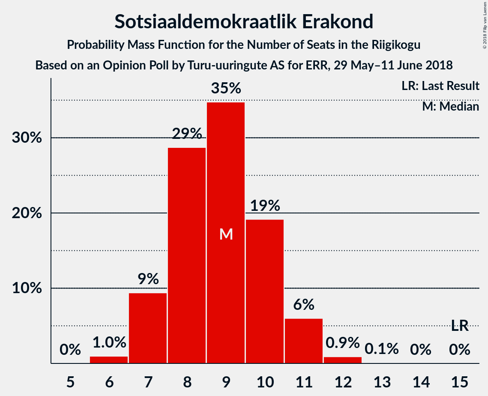
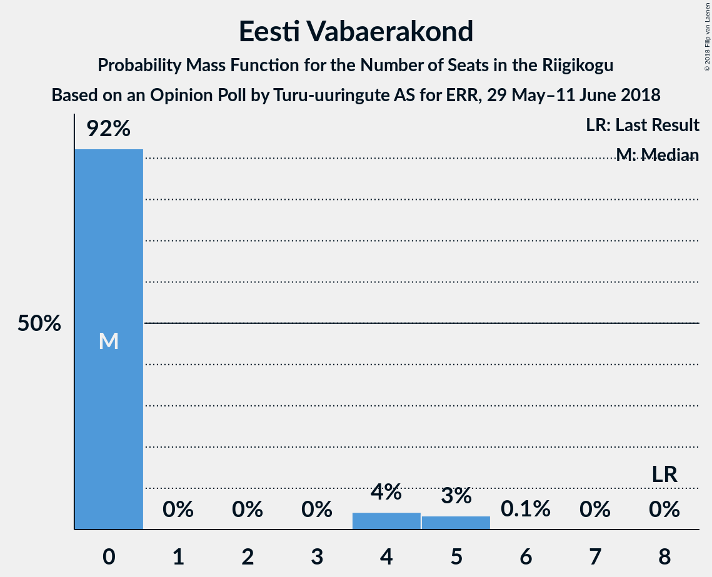

# Opinion Poll by Turu-uuringute AS for ERR, 29 May–11 June 2018

<a href="#voting-intentions">Voting Intentions</a> | <a href="#seats">Seats</a> | <a href="#coalitions">Coalitions</a> | <a href="#technical-information">Technical Information</a>

## Voting Intentions

### Confidence Intervals

| Party | Last Result | Poll Result | 80% Confidence Interval | 90% Confidence Interval | 95% Confidence Interval | 99% Confidence Interval |
|:-----:|:-----------:|:-----------:|:-----------------------:|:-----------------------:|:-----------------------:|:-----------------------:|
| Eesti Reformierakond | 27.7% | 28.0% | 26.3–29.9% |25.8–30.5% |25.3–30.9% |24.5–31.8% |
| Eesti Keskerakond | 24.8% | 27.0% | 25.3–28.9% |24.8–29.4% |24.4–29.9% |23.6–30.8% |
| Eesti Konservatiivne Rahvaerakond | 8.1% | 18.0% | 16.5–19.6% |16.1–20.1% |15.7–20.5% |15.0–21.3% |
| Sotsiaaldemokraatlik Erakond | 15.2% | 9.0% | 7.9–10.2% |7.6–10.6% |7.4–10.9% |6.9–11.6% |
| Erakond Isamaa | 13.7% | 5.0% | 4.2–6.0% |4.0–6.3% |3.8–6.5% |3.5–7.0% |
| Eesti Vabaerakond | 8.7% | 4.0% | 3.3–4.9% |3.1–5.2% |2.9–5.4% |2.6–5.9% |
| Erakond Eestimaa Rohelised | 0.9% | 2.0% | 1.5–2.7% |1.4–2.9% |1.3–3.1% |1.1–3.4% |

*Note:* The poll result column reflects the actual value used in the calculations. Published results may vary slightly, and in addition be rounded to fewer digits.

## Seats

### Confidence Intervals

| Party | Last Result | Median | 80% Confidence Interval | 90% Confidence Interval | 95% Confidence Interval | 99% Confidence Interval |
|:-----:|:-----------:|:------:|:-----------------------:|:-----------------------:|:-----------------------:|:-----------------------:|
| <a href="#eesti-reformierakond">Eesti Reformierakond</a> | 30 | 33 | 30–35 |30–35 |30–35 |29–36 |
| <a href="#eesti-keskerakond">Eesti Keskerakond</a> | 27 | 28 | 26–35 |26–36 |26–37 |26–37 |
| <a href="#eesti-konservatiivne-rahvaerakond">Eesti Konservatiivne Rahvaerakond</a> | 7 | 19 | 17–21 |17–21 |16–21 |16–21 |
| <a href="#sotsiaaldemokraatlik-erakond">Sotsiaaldemokraatlik Erakond</a> | 15 | 10 | 9–11 |9–11 |8–11 |7–11 |
| <a href="#erakond-isamaa">Erakond Isamaa</a> | 14 | 5 | 0–5 |0–5 |0–5 |0–5 |
| <a href="#eesti-vabaerakond">Eesti Vabaerakond</a> | 8 | 0 | 0 |0 |0 |0 |
| <a href="#erakond-eestimaa-rohelised">Erakond Eestimaa Rohelised</a> | 0 | 0 | 0 |0 |0 |0 |

### Eesti Reformierakond

*For a full overview of the results for this party, see the [Eesti Reformierakond](party-eestireformierakond.html) page.*

| Number of Seats | Probability | Accumulated | Special Marks |
|:---------------:|:-----------:|:-----------:|:-------------:|
| 28 | 0.3% | 100% |  |
| 29 | 2% | 99.7% |  |
| 30 | 32% | 98% | Last Result |
| 31 | 2% | 66% |  |
| 32 | 13% | 64% |  |
| 33 | 29% | 51% | Median |
| 34 | 0% | 21% |  |
| 35 | 21% | 21% |  |
| 36 | 0.6% | 0.7% |  |
| 37 | 0% | 0.1% |  |
| 38 | 0.1% | 0.1% |  |
| 39 | 0% | 0% |  |

### Eesti Keskerakond

*For a full overview of the results for this party, see the [Eesti Keskerakond](party-eestikeskerakond.html) page.*

| Number of Seats | Probability | Accumulated | Special Marks |
|:---------------:|:-----------:|:-----------:|:-------------:|
| 23 | 0.1% | 100% |  |
| 24 | 0% | 99.9% |  |
| 25 | 0.2% | 99.9% |  |
| 26 | 10% | 99.7% |  |
| 27 | 14% | 89% | Last Result |
| 28 | 39% | 75% | Median |
| 29 | 4% | 36% |  |
| 30 | 2% | 33% |  |
| 31 | 0% | 31% |  |
| 32 | 0.1% | 31% |  |
| 33 | 0% | 31% |  |
| 34 | 11% | 31% |  |
| 35 | 10% | 19% |  |
| 36 | 6% | 9% |  |
| 37 | 3% | 4% |  |
| 38 | 0.1% | 0.2% |  |
| 39 | 0.1% | 0.1% |  |
| 40 | 0% | 0% |  |

### Eesti Konservatiivne Rahvaerakond

*For a full overview of the results for this party, see the [Eesti Konservatiivne Rahvaerakond](party-eestikonservatiivnerahvaerakond.html) page.*

| Number of Seats | Probability | Accumulated | Special Marks |
|:---------------:|:-----------:|:-----------:|:-------------:|
| 7 | 0% | 100% | Last Result |
| 8 | 0% | 100% |  |
| 9 | 0% | 100% |  |
| 10 | 0% | 100% |  |
| 11 | 0% | 100% |  |
| 12 | 0% | 100% |  |
| 13 | 0% | 100% |  |
| 14 | 0% | 100% |  |
| 15 | 0.1% | 100% |  |
| 16 | 4% | 99.9% |  |
| 17 | 20% | 96% |  |
| 18 | 5% | 76% |  |
| 19 | 34% | 71% | Median |
| 20 | 10% | 36% |  |
| 21 | 26% | 26% |  |
| 22 | 0.3% | 0.4% |  |
| 23 | 0% | 0.1% |  |
| 24 | 0% | 0% |  |

### Sotsiaaldemokraatlik Erakond

*For a full overview of the results for this party, see the [Sotsiaaldemokraatlik Erakond](party-sotsiaaldemokraatlikerakond.html) page.*

| Number of Seats | Probability | Accumulated | Special Marks |
|:---------------:|:-----------:|:-----------:|:-------------:|
| 7 | 1.0% | 100% |  |
| 8 | 3% | 99.0% |  |
| 9 | 35% | 96% |  |
| 10 | 36% | 61% | Median |
| 11 | 25% | 25% |  |
| 12 | 0.1% | 0.1% |  |
| 13 | 0% | 0% |  |
| 14 | 0% | 0% |  |
| 15 | 0% | 0% | Last Result |

### Erakond Isamaa

*For a full overview of the results for this party, see the [Erakond Isamaa](party-erakondisamaa.html) page.*

| Number of Seats | Probability | Accumulated | Special Marks |
|:---------------:|:-----------:|:-----------:|:-------------:|
| 0 | 31% | 100% |  |
| 1 | 0% | 69% |  |
| 2 | 0% | 69% |  |
| 3 | 0% | 69% |  |
| 4 | 0.1% | 69% |  |
| 5 | 69% | 69% | Median |
| 6 | 0.2% | 0.2% |  |
| 7 | 0% | 0% |  |
| 8 | 0% | 0% |  |
| 9 | 0% | 0% |  |
| 10 | 0% | 0% |  |
| 11 | 0% | 0% |  |
| 12 | 0% | 0% |  |
| 13 | 0% | 0% |  |
| 14 | 0% | 0% | Last Result |

### Eesti Vabaerakond

*For a full overview of the results for this party, see the [Eesti Vabaerakond](party-eestivabaerakond.html) page.*

| Number of Seats | Probability | Accumulated | Special Marks |
|:---------------:|:-----------:|:-----------:|:-------------:|
| 0 | 99.9% | 100% | Median |
| 1 | 0% | 0.1% |  |
| 2 | 0% | 0.1% |  |
| 3 | 0% | 0.1% |  |
| 4 | 0% | 0.1% |  |
| 5 | 0.1% | 0.1% |  |
| 6 | 0% | 0% |  |
| 7 | 0% | 0% |  |
| 8 | 0% | 0% | Last Result |

### Erakond Eestimaa Rohelised

*For a full overview of the results for this party, see the [Erakond Eestimaa Rohelised](party-erakondeestimaarohelised.html) page.*

| Number of Seats | Probability | Accumulated | Special Marks |
|:---------------:|:-----------:|:-----------:|:-------------:|
| 0 | 100% | 100% | Last Result, Median |

## Coalitions

### Confidence Intervals

| Coalition | Last Result | Median | Majority? | 80% Confidence Interval | 90% Confidence Interval | 95% Confidence Interval | 99% Confidence Interval |
|:---------:|:-----------:|:------:|:---------:|:-----------------------:|:-----------------------:|:-----------------------:|:-----------------------:|
| Eesti Reformierakond – Eesti Keskerakond – Eesti Konservatiivne Rahvaerakond | 64 | 80 | 100% | 77–86 | 77–87 | 77–87 | 77–87 |
| Eesti Reformierakond – Eesti Keskerakond | 57 | 63 | 100% | 58–67 | 58–67 | 58–70 | 56–70 |
| Eesti Reformierakond – Eesti Konservatiivne Rahvaerakond – Erakond Isamaa | 51 | 56 | 85% | 50–57 | 50–57 | 50–57 | 49–58 |
| Eesti Reformierakond – Sotsiaaldemokraatlik Erakond – Erakond Isamaa – Eesti Vabaerakond | 67 | 47 | 0.9% | 39–50 | 39–50 | 39–50 | 37–51 |
| Eesti Reformierakond – Sotsiaaldemokraatlik Erakond – Erakond Isamaa | 59 | 47 | 0.8% | 39–50 | 39–50 | 39–50 | 37–51 |
| Eesti Keskerakond – Sotsiaaldemokraatlik Erakond – Erakond Isamaa | 56 | 43 | 0% | 42–44 | 42–45 | 42–45 | 42–45 |
| Eesti Reformierakond – Sotsiaaldemokraatlik Erakond | 45 | 42 | 0% | 39–45 | 39–45 | 39–45 | 37–46 |
| Eesti Reformierakond – Erakond Isamaa | 44 | 36 | 0% | 30–40 | 30–40 | 30–40 | 29–41 |

### Eesti Reformierakond – Eesti Keskerakond – Eesti Konservatiivne Rahvaerakond

| Number of Seats | Probability | Accumulated | Special Marks |
|:---------------:|:-----------:|:-----------:|:-------------:|
| 64 | 0% | 100% | Last Result |
| 65 | 0% | 100% |  |
| 66 | 0% | 100% |  |
| 67 | 0% | 100% |  |
| 68 | 0% | 100% |  |
| 69 | 0% | 100% |  |
| 70 | 0% | 100% |  |
| 71 | 0% | 100% |  |
| 72 | 0% | 100% |  |
| 73 | 0% | 100% |  |
| 74 | 0% | 100% |  |
| 75 | 0% | 100% |  |
| 76 | 0% | 100% |  |
| 77 | 12% | 100% |  |
| 78 | 0.1% | 88% |  |
| 79 | 33% | 88% |  |
| 80 | 21% | 54% | Median |
| 81 | 0% | 33% |  |
| 82 | 2% | 33% |  |
| 83 | 0.1% | 31% |  |
| 84 | 2% | 31% |  |
| 85 | 10% | 29% |  |
| 86 | 11% | 19% |  |
| 87 | 8% | 8% |  |
| 88 | 0.1% | 0.3% |  |
| 89 | 0% | 0.3% |  |
| 90 | 0% | 0.2% |  |
| 91 | 0.2% | 0.2% |  |
| 92 | 0% | 0% |  |

### Eesti Reformierakond – Eesti Keskerakond

| Number of Seats | Probability | Accumulated | Special Marks |
|:---------------:|:-----------:|:-----------:|:-------------:|
| 56 | 2% | 100% |  |
| 57 | 0% | 98% | Last Result |
| 58 | 27% | 98% |  |
| 59 | 2% | 71% |  |
| 60 | 13% | 69% |  |
| 61 | 0% | 56% | Median |
| 62 | 3% | 56% |  |
| 63 | 22% | 53% |  |
| 64 | 0.3% | 31% |  |
| 65 | 11% | 31% |  |
| 66 | 7% | 21% |  |
| 67 | 10% | 13% |  |
| 68 | 0.1% | 4% |  |
| 69 | 0.8% | 4% |  |
| 70 | 3% | 3% |  |
| 71 | 0.2% | 0.3% |  |
| 72 | 0.1% | 0.1% |  |
| 73 | 0% | 0% |  |

### Eesti Reformierakond – Eesti Konservatiivne Rahvaerakond – Erakond Isamaa

| Number of Seats | Probability | Accumulated | Special Marks |
|:---------------:|:-----------:|:-----------:|:-------------:|
| 49 | 1.2% | 100% |  |
| 50 | 14% | 98.8% |  |
| 51 | 6% | 85% | Last Result, Majority |
| 52 | 10% | 79% |  |
| 53 | 0% | 69% |  |
| 54 | 0.2% | 69% |  |
| 55 | 2% | 69% |  |
| 56 | 34% | 67% |  |
| 57 | 33% | 34% | Median |
| 58 | 0.8% | 0.8% |  |
| 59 | 0% | 0.1% |  |
| 60 | 0% | 0.1% |  |
| 61 | 0% | 0% |  |

### Eesti Reformierakond – Sotsiaaldemokraatlik Erakond – Erakond Isamaa – Eesti Vabaerakond

| Number of Seats | Probability | Accumulated | Special Marks |
|:---------------:|:-----------:|:-----------:|:-------------:|
| 36 | 0.3% | 100% |  |
| 37 | 0.4% | 99.7% |  |
| 38 | 0% | 99.3% |  |
| 39 | 16% | 99.3% |  |
| 40 | 0% | 84% |  |
| 41 | 4% | 84% |  |
| 42 | 9% | 79% |  |
| 43 | 0.4% | 70% |  |
| 44 | 2% | 69% |  |
| 45 | 17% | 68% |  |
| 46 | 0.1% | 50% |  |
| 47 | 7% | 50% |  |
| 48 | 10% | 44% | Median |
| 49 | 16% | 33% |  |
| 50 | 16% | 17% |  |
| 51 | 0.6% | 0.9% | Majority |
| 52 | 0.1% | 0.2% |  |
| 53 | 0.1% | 0.1% |  |
| 54 | 0% | 0% |  |
| 55 | 0% | 0% |  |
| 56 | 0% | 0% |  |
| 57 | 0% | 0% |  |
| 58 | 0% | 0% |  |
| 59 | 0% | 0% |  |
| 60 | 0% | 0% |  |
| 61 | 0% | 0% |  |
| 62 | 0% | 0% |  |
| 63 | 0% | 0% |  |
| 64 | 0% | 0% |  |
| 65 | 0% | 0% |  |
| 66 | 0% | 0% |  |
| 67 | 0% | 0% | Last Result |

### Eesti Reformierakond – Sotsiaaldemokraatlik Erakond – Erakond Isamaa

| Number of Seats | Probability | Accumulated | Special Marks |
|:---------------:|:-----------:|:-----------:|:-------------:|
| 36 | 0.3% | 100% |  |
| 37 | 0.4% | 99.7% |  |
| 38 | 0% | 99.3% |  |
| 39 | 16% | 99.3% |  |
| 40 | 0.1% | 84% |  |
| 41 | 4% | 83% |  |
| 42 | 9% | 79% |  |
| 43 | 0.4% | 70% |  |
| 44 | 2% | 69% |  |
| 45 | 17% | 68% |  |
| 46 | 0.1% | 50% |  |
| 47 | 7% | 50% |  |
| 48 | 10% | 43% | Median |
| 49 | 16% | 33% |  |
| 50 | 16% | 17% |  |
| 51 | 0.6% | 0.8% | Majority |
| 52 | 0.1% | 0.2% |  |
| 53 | 0.1% | 0.1% |  |
| 54 | 0% | 0% |  |
| 55 | 0% | 0% |  |
| 56 | 0% | 0% |  |
| 57 | 0% | 0% |  |
| 58 | 0% | 0% |  |
| 59 | 0% | 0% | Last Result |

### Eesti Keskerakond – Sotsiaaldemokraatlik Erakond – Erakond Isamaa

| Number of Seats | Probability | Accumulated | Special Marks |
|:---------------:|:-----------:|:-----------:|:-------------:|
| 34 | 0% | 100% |  |
| 35 | 0% | 99.9% |  |
| 36 | 0.1% | 99.9% |  |
| 37 | 0% | 99.9% |  |
| 38 | 0% | 99.8% |  |
| 39 | 0% | 99.8% |  |
| 40 | 0% | 99.8% |  |
| 41 | 0.3% | 99.8% |  |
| 42 | 16% | 99.5% |  |
| 43 | 61% | 84% | Median |
| 44 | 15% | 23% |  |
| 45 | 8% | 8% |  |
| 46 | 0.3% | 0.3% |  |
| 47 | 0% | 0% |  |
| 48 | 0% | 0% |  |
| 49 | 0% | 0% |  |
| 50 | 0% | 0% |  |
| 51 | 0% | 0% | Majority |
| 52 | 0% | 0% |  |
| 53 | 0% | 0% |  |
| 54 | 0% | 0% |  |
| 55 | 0% | 0% |  |
| 56 | 0% | 0% | Last Result |

### Eesti Reformierakond – Sotsiaaldemokraatlik Erakond

| Number of Seats | Probability | Accumulated | Special Marks |
|:---------------:|:-----------:|:-----------:|:-------------:|
| 36 | 0.3% | 100% |  |
| 37 | 0.4% | 99.7% |  |
| 38 | 0% | 99.3% |  |
| 39 | 17% | 99.3% |  |
| 40 | 17% | 82% |  |
| 41 | 4% | 65% |  |
| 42 | 16% | 61% |  |
| 43 | 11% | 44% | Median |
| 44 | 16% | 34% |  |
| 45 | 16% | 17% | Last Result |
| 46 | 0.7% | 0.8% |  |
| 47 | 0.1% | 0.1% |  |
| 48 | 0.1% | 0.1% |  |
| 49 | 0% | 0% |  |

### Eesti Reformierakond – Erakond Isamaa

| Number of Seats | Probability | Accumulated | Special Marks |
|:---------------:|:-----------:|:-----------:|:-------------:|
| 28 | 0.3% | 100% |  |
| 29 | 0.2% | 99.7% |  |
| 30 | 15% | 99.5% |  |
| 31 | 0.1% | 84% |  |
| 32 | 3% | 84% |  |
| 33 | 12% | 82% |  |
| 34 | 2% | 70% |  |
| 35 | 17% | 68% |  |
| 36 | 2% | 51% |  |
| 37 | 10% | 48% |  |
| 38 | 17% | 38% | Median |
| 39 | 0% | 21% |  |
| 40 | 20% | 21% |  |
| 41 | 0.7% | 0.8% |  |
| 42 | 0% | 0.1% |  |
| 43 | 0% | 0.1% |  |
| 44 | 0% | 0% | Last Result |

## Technical Information

### Opinion Poll

+ **Polling firm:** Turu-uuringute AS
+ **Commissioner(s):** ERR
+ **Fieldwork period:** 29 May–11 June 2018

### Calculations

+ **Sample size:** 1002
+ **Simulations done:** 1,024
+ **Error estimate:** 4.71%

