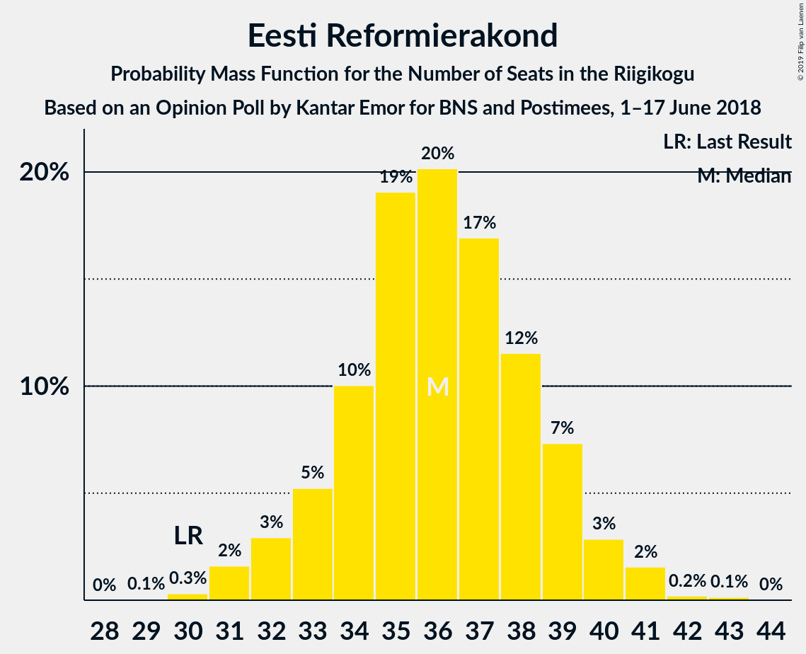
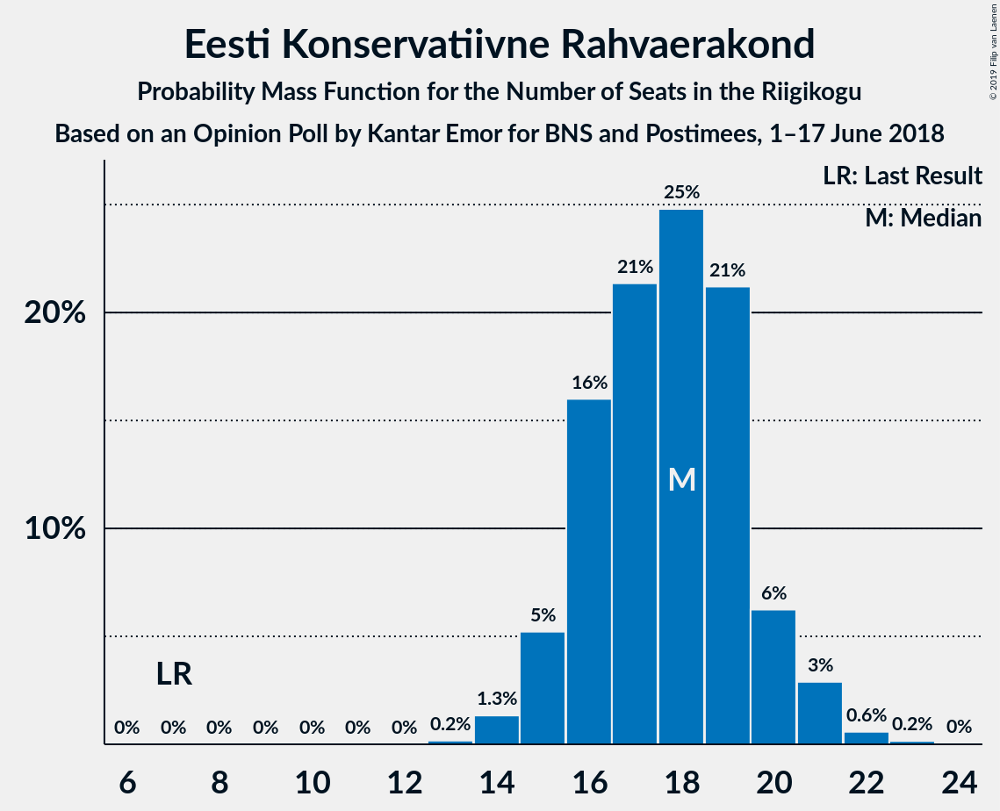
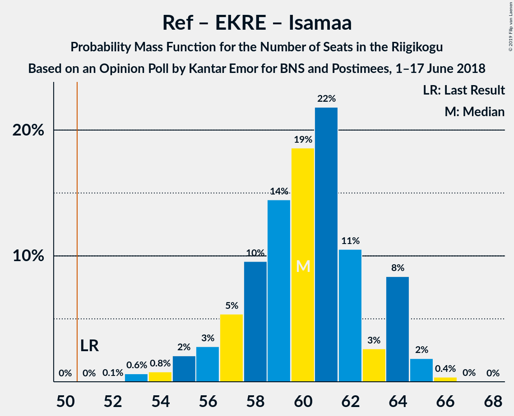
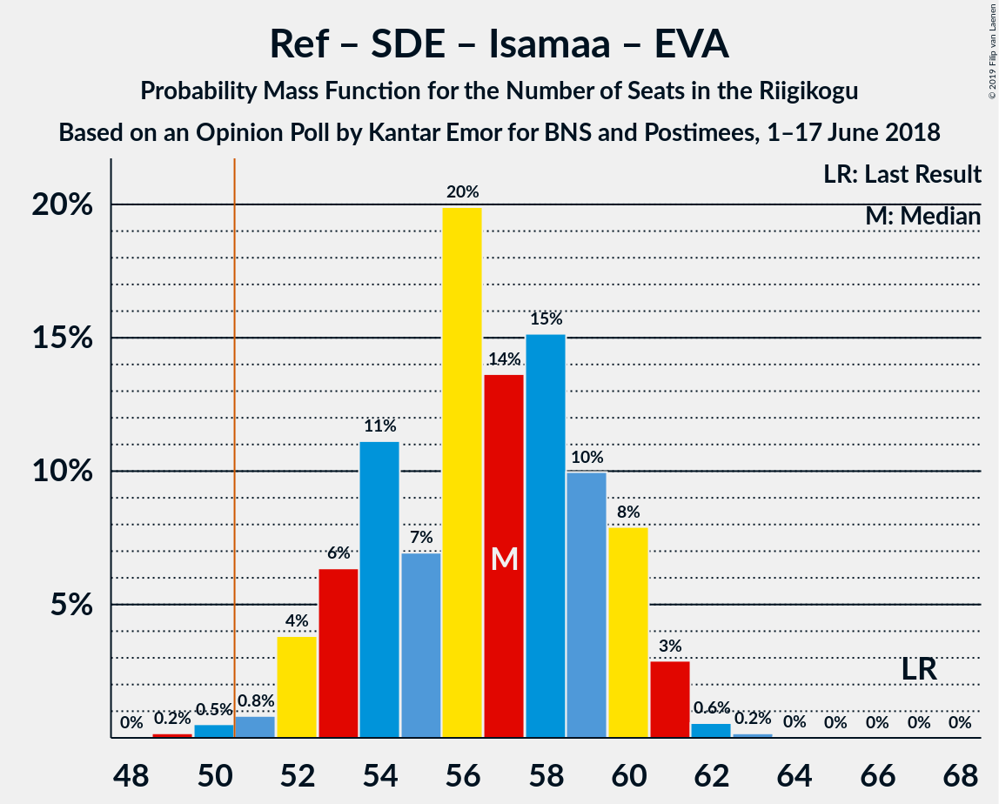

# Opinion Poll by Kantar Emor for BNS and Postimees, 1–17 June 2018

<a href="#voting-intentions">Voting Intentions</a> | <a href="#seats">Seats</a> | <a href="#coalitions">Coalitions</a> | <a href="#technical-information">Technical Information</a>

## Voting Intentions

### Confidence Intervals

| Party | Last Result | Poll Result | 80% Confidence Interval | 90% Confidence Interval | 95% Confidence Interval | 99% Confidence Interval |
|:-----:|:-----------:|:-----------:|:-----------------------:|:-----------------------:|:-----------------------:|:-----------------------:|
| Eesti Reformierakond | 27.7% | 32.0% | 30.1–34.1% |29.5–34.7% |29.0–35.2% |28.1–36.2% |
| Eesti Keskerakond | 24.8% | 23.0% | 21.2–24.9% |20.7–25.4% |20.3–25.9% |19.5–26.8% |
| Eesti Konservatiivne Rahvaerakond | 8.1% | 17.0% | 15.5–18.8% |15.1–19.3% |14.7–19.7% |14.0–20.5% |
| Sotsiaaldemokraatlik Erakond | 15.2% | 14.0% | 12.5–15.6% |12.1–16.0% |11.8–16.4% |11.2–17.2% |
| Erakond Isamaa | 13.7% | 7.0% | 6.0–8.2% |5.7–8.6% |5.5–8.9% |5.0–9.5% |
| Erakond Eestimaa Rohelised | 0.9% | 5.0% | 4.2–6.1% |4.0–6.4% |3.8–6.7% |3.4–7.3% |
| Eesti Vabaerakond | 8.7% | 3.0% | 2.3–3.9% |2.2–4.1% |2.0–4.3% |1.8–4.8% |

*Note:* The poll result column reflects the actual value used in the calculations. Published results may vary slightly, and in addition be rounded to fewer digits.

## Seats

### Confidence Intervals

| Party | Last Result | Median | 80% Confidence Interval | 90% Confidence Interval | 95% Confidence Interval | 99% Confidence Interval |
|:-----:|:-----------:|:------:|:-----------------------:|:-----------------------:|:-----------------------:|:-----------------------:|
| <a href="#eesti-reformierakond">Eesti Reformierakond</a> | 30 | 36 | 33–39 |33–39 |32–40 |31–41 |
| <a href="#eesti-keskerakond">Eesti Keskerakond</a> | 27 | 25 | 23–27 |22–28 |21–28 |20–29 |
| <a href="#eesti-konservatiivne-rahvaerakond">Eesti Konservatiivne Rahvaerakond</a> | 7 | 18 | 16–19 |15–20 |15–21 |14–22 |
| <a href="#sotsiaaldemokraatlik-erakond">Sotsiaaldemokraatlik Erakond</a> | 15 | 14 | 12–16 |12–16 |11–17 |11–18 |
| <a href="#erakond-isamaa">Erakond Isamaa</a> | 14 | 6 | 5–8 |5–8 |5–8 |0–9 |
| <a href="#erakond-eestimaa-rohelised">Erakond Eestimaa Rohelised</a> | 0 | 0 | 0–5 |0–6 |0–6 |0–6 |
| <a href="#eesti-vabaerakond">Eesti Vabaerakond</a> | 8 | 0 | 0 |0 |0 |0 |

### Eesti Reformierakond

*For a full overview of the results for this party, see the [Eesti Reformierakond](party-eestireformierakond.html) page.*

| Number of Seats | Probability | Accumulated | Special Marks |
|:---------------:|:-----------:|:-----------:|:-------------:|
| 29 | 0.1% | 100% |  |
| 30 | 0.3% | 99.9% | Last Result |
| 31 | 2% | 99.6% |  |
| 32 | 3% | 98% |  |
| 33 | 5% | 95% |  |
| 34 | 10% | 90% |  |
| 35 | 19% | 80% |  |
| 36 | 20% | 61% | Median |
| 37 | 17% | 41% |  |
| 38 | 12% | 24% |  |
| 39 | 7% | 12% |  |
| 40 | 3% | 5% |  |
| 41 | 2% | 2% |  |
| 42 | 0.2% | 0.4% |  |
| 43 | 0.1% | 0.2% |  |
| 44 | 0% | 0% |  |

### Eesti Keskerakond

*For a full overview of the results for this party, see the [Eesti Keskerakond](party-eestikeskerakond.html) page.*

| Number of Seats | Probability | Accumulated | Special Marks |
|:---------------:|:-----------:|:-----------:|:-------------:|
| 19 | 0.1% | 100% |  |
| 20 | 0.7% | 99.9% |  |
| 21 | 2% | 99.2% |  |
| 22 | 6% | 97% |  |
| 23 | 10% | 91% |  |
| 24 | 19% | 81% |  |
| 25 | 22% | 62% | Median |
| 26 | 25% | 40% |  |
| 27 | 10% | 15% | Last Result |
| 28 | 3% | 5% |  |
| 29 | 1.4% | 2% |  |
| 30 | 0.4% | 0.4% |  |
| 31 | 0.1% | 0.1% |  |
| 32 | 0% | 0% |  |

### Eesti Konservatiivne Rahvaerakond

*For a full overview of the results for this party, see the [Eesti Konservatiivne Rahvaerakond](party-eestikonservatiivnerahvaerakond.html) page.*

| Number of Seats | Probability | Accumulated | Special Marks |
|:---------------:|:-----------:|:-----------:|:-------------:|
| 7 | 0% | 100% | Last Result |
| 8 | 0% | 100% |  |
| 9 | 0% | 100% |  |
| 10 | 0% | 100% |  |
| 11 | 0% | 100% |  |
| 12 | 0% | 100% |  |
| 13 | 0.2% | 100% |  |
| 14 | 1.3% | 99.8% |  |
| 15 | 5% | 98% |  |
| 16 | 16% | 93% |  |
| 17 | 21% | 77% |  |
| 18 | 25% | 56% | Median |
| 19 | 21% | 31% |  |
| 20 | 6% | 10% |  |
| 21 | 3% | 4% |  |
| 22 | 0.6% | 0.8% |  |
| 23 | 0.2% | 0.2% |  |
| 24 | 0% | 0% |  |

### Sotsiaaldemokraatlik Erakond

*For a full overview of the results for this party, see the [Sotsiaaldemokraatlik Erakond](party-sotsiaaldemokraatlikerakond.html) page.*

| Number of Seats | Probability | Accumulated | Special Marks |
|:---------------:|:-----------:|:-----------:|:-------------:|
| 10 | 0.3% | 100% |  |
| 11 | 3% | 99.7% |  |
| 12 | 9% | 97% |  |
| 13 | 27% | 88% |  |
| 14 | 23% | 61% | Median |
| 15 | 21% | 39% | Last Result |
| 16 | 13% | 17% |  |
| 17 | 3% | 4% |  |
| 18 | 0.7% | 0.8% |  |
| 19 | 0.2% | 0.2% |  |
| 20 | 0% | 0% |  |

### Erakond Isamaa

*For a full overview of the results for this party, see the [Erakond Isamaa](party-erakondisamaa.html) page.*

| Number of Seats | Probability | Accumulated | Special Marks |
|:---------------:|:-----------:|:-----------:|:-------------:|
| 0 | 0.6% | 100% |  |
| 1 | 0% | 99.4% |  |
| 2 | 0% | 99.4% |  |
| 3 | 0% | 99.4% |  |
| 4 | 2% | 99.4% |  |
| 5 | 13% | 98% |  |
| 6 | 40% | 85% | Median |
| 7 | 34% | 45% |  |
| 8 | 9% | 11% |  |
| 9 | 1.4% | 2% |  |
| 10 | 0.1% | 0.1% |  |
| 11 | 0% | 0% |  |
| 12 | 0% | 0% |  |
| 13 | 0% | 0% |  |
| 14 | 0% | 0% | Last Result |

### Erakond Eestimaa Rohelised

*For a full overview of the results for this party, see the [Erakond Eestimaa Rohelised](party-erakondeestimaarohelised.html) page.*

| Number of Seats | Probability | Accumulated | Special Marks |
|:---------------:|:-----------:|:-----------:|:-------------:|
| 0 | 62% | 100% | Last Result, Median |
| 1 | 0% | 38% |  |
| 2 | 0% | 38% |  |
| 3 | 0% | 38% |  |
| 4 | 12% | 38% |  |
| 5 | 20% | 26% |  |
| 6 | 5% | 6% |  |
| 7 | 0.3% | 0.3% |  |
| 8 | 0% | 0% |  |

### Eesti Vabaerakond

*For a full overview of the results for this party, see the [Eesti Vabaerakond](party-eestivabaerakond.html) page.*

| Number of Seats | Probability | Accumulated | Special Marks |
|:---------------:|:-----------:|:-----------:|:-------------:|
| 0 | 99.9% | 100% | Median |
| 1 | 0% | 0.1% |  |
| 2 | 0% | 0.1% |  |
| 3 | 0% | 0.1% |  |
| 4 | 0.1% | 0.1% |  |
| 5 | 0% | 0% |  |
| 6 | 0% | 0% |  |
| 7 | 0% | 0% |  |
| 8 | 0% | 0% | Last Result |

## Coalitions

### Confidence Intervals

| Coalition | Last Result | Median | Majority? | 80% Confidence Interval | 90% Confidence Interval | 95% Confidence Interval | 99% Confidence Interval |
|:---------:|:-----------:|:------:|:---------:|:-----------------------:|:-----------------------:|:-----------------------:|:-----------------------:|
| Eesti Reformierakond – Eesti Keskerakond – Eesti Konservatiivne Rahvaerakond | 64 | 79 | 100% | 75–82 | 74–82 | 74–83 | 73–84 |
| Eesti Reformierakond – Eesti Keskerakond | 57 | 61 | 100% | 58–64 | 57–65 | 56–65 | 55–67 |
| Eesti Reformierakond – Eesti Konservatiivne Rahvaerakond – Erakond Isamaa | 51 | 60 | 100% | 57–64 | 56–64 | 55–64 | 53–65 |
| Eesti Reformierakond – Sotsiaaldemokraatlik Erakond – Erakond Isamaa – Eesti Vabaerakond | 67 | 57 | 99.3% | 53–60 | 52–60 | 52–61 | 50–62 |
| Eesti Reformierakond – Sotsiaaldemokraatlik Erakond – Erakond Isamaa | 59 | 57 | 99.3% | 53–60 | 52–60 | 52–61 | 50–62 |
| Eesti Reformierakond – Eesti Konservatiivne Rahvaerakond | 37 | 54 | 93% | 51–57 | 50–58 | 49–58 | 48–59 |
| Eesti Reformierakond – Sotsiaaldemokraatlik Erakond | 45 | 50 | 45% | 47–54 | 46–54 | 45–54 | 44–56 |
| Eesti Keskerakond – Sotsiaaldemokraatlik Erakond – Erakond Isamaa | 56 | 46 | 0.6% | 42–48 | 42–49 | 41–50 | 39–51 |
| Eesti Keskerakond – Eesti Konservatiivne Rahvaerakond | 34 | 43 | 0% | 40–45 | 39–46 | 38–47 | 37–48 |
| Eesti Reformierakond – Erakond Isamaa | 44 | 43 | 0% | 40–45 | 39–46 | 38–47 | 37–47 |
| Eesti Keskerakond – Sotsiaaldemokraatlik Erakond | 42 | 39 | 0% | 36–41 | 36–42 | 35–43 | 33–44 |
| Eesti Konservatiivne Rahvaerakond – Sotsiaaldemokraatlik Erakond | 22 | 32 | 0% | 29–35 | 29–35 | 28–35 | 27–37 |

### Eesti Reformierakond – Eesti Keskerakond – Eesti Konservatiivne Rahvaerakond

| Number of Seats | Probability | Accumulated | Special Marks |
|:---------------:|:-----------:|:-----------:|:-------------:|
| 64 | 0% | 100% | Last Result |
| 65 | 0% | 100% |  |
| 66 | 0% | 100% |  |
| 67 | 0% | 100% |  |
| 68 | 0% | 100% |  |
| 69 | 0% | 100% |  |
| 70 | 0% | 100% |  |
| 71 | 0.1% | 100% |  |
| 72 | 0.4% | 99.9% |  |
| 73 | 1.3% | 99.5% |  |
| 74 | 4% | 98% |  |
| 75 | 6% | 95% |  |
| 76 | 9% | 89% |  |
| 77 | 11% | 80% |  |
| 78 | 14% | 68% |  |
| 79 | 13% | 54% | Median |
| 80 | 17% | 41% |  |
| 81 | 9% | 25% |  |
| 82 | 12% | 15% |  |
| 83 | 2% | 3% |  |
| 84 | 0.6% | 1.0% |  |
| 85 | 0.1% | 0.3% |  |
| 86 | 0% | 0.2% |  |
| 87 | 0.2% | 0.2% |  |
| 88 | 0% | 0% |  |

### Eesti Reformierakond – Eesti Keskerakond

| Number of Seats | Probability | Accumulated | Special Marks |
|:---------------:|:-----------:|:-----------:|:-------------:|
| 53 | 0.1% | 100% |  |
| 54 | 0.2% | 99.9% |  |
| 55 | 0.9% | 99.7% |  |
| 56 | 4% | 98.8% |  |
| 57 | 4% | 95% | Last Result |
| 58 | 8% | 91% |  |
| 59 | 9% | 83% |  |
| 60 | 14% | 74% |  |
| 61 | 14% | 60% | Median |
| 62 | 20% | 46% |  |
| 63 | 12% | 27% |  |
| 64 | 10% | 15% |  |
| 65 | 3% | 5% |  |
| 66 | 1.0% | 2% |  |
| 67 | 0.7% | 1.1% |  |
| 68 | 0.3% | 0.4% |  |
| 69 | 0% | 0.1% |  |
| 70 | 0% | 0% |  |

### Eesti Reformierakond – Eesti Konservatiivne Rahvaerakond – Erakond Isamaa

| Number of Seats | Probability | Accumulated | Special Marks |
|:---------------:|:-----------:|:-----------:|:-------------:|
| 51 | 0% | 100% | Last Result, Majority |
| 52 | 0.1% | 100% |  |
| 53 | 0.6% | 99.9% |  |
| 54 | 0.8% | 99.3% |  |
| 55 | 2% | 98.5% |  |
| 56 | 3% | 96% |  |
| 57 | 5% | 94% |  |
| 58 | 10% | 88% |  |
| 59 | 14% | 79% |  |
| 60 | 19% | 64% | Median |
| 61 | 22% | 46% |  |
| 62 | 11% | 24% |  |
| 63 | 3% | 13% |  |
| 64 | 8% | 11% |  |
| 65 | 2% | 2% |  |
| 66 | 0.4% | 0.4% |  |
| 67 | 0% | 0.1% |  |
| 68 | 0% | 0% |  |

### Eesti Reformierakond – Sotsiaaldemokraatlik Erakond – Erakond Isamaa – Eesti Vabaerakond

| Number of Seats | Probability | Accumulated | Special Marks |
|:---------------:|:-----------:|:-----------:|:-------------:|
| 49 | 0.2% | 100% |  |
| 50 | 0.5% | 99.8% |  |
| 51 | 0.8% | 99.3% | Majority |
| 52 | 4% | 98% |  |
| 53 | 6% | 95% |  |
| 54 | 11% | 88% |  |
| 55 | 7% | 77% |  |
| 56 | 20% | 70% | Median |
| 57 | 14% | 50% |  |
| 58 | 15% | 37% |  |
| 59 | 10% | 22% |  |
| 60 | 8% | 12% |  |
| 61 | 3% | 4% |  |
| 62 | 0.6% | 0.8% |  |
| 63 | 0.2% | 0.2% |  |
| 64 | 0% | 0% |  |
| 65 | 0% | 0% |  |
| 66 | 0% | 0% |  |
| 67 | 0% | 0% | Last Result |

### Eesti Reformierakond – Sotsiaaldemokraatlik Erakond – Erakond Isamaa

| Number of Seats | Probability | Accumulated | Special Marks |
|:---------------:|:-----------:|:-----------:|:-------------:|
| 49 | 0.2% | 100% |  |
| 50 | 0.5% | 99.8% |  |
| 51 | 0.8% | 99.3% | Majority |
| 52 | 4% | 98% |  |
| 53 | 6% | 95% |  |
| 54 | 11% | 88% |  |
| 55 | 7% | 77% |  |
| 56 | 20% | 70% | Median |
| 57 | 14% | 50% |  |
| 58 | 15% | 37% |  |
| 59 | 10% | 21% | Last Result |
| 60 | 8% | 12% |  |
| 61 | 3% | 4% |  |
| 62 | 0.6% | 0.8% |  |
| 63 | 0.2% | 0.2% |  |
| 64 | 0% | 0% |  |

### Eesti Reformierakond – Eesti Konservatiivne Rahvaerakond

| Number of Seats | Probability | Accumulated | Special Marks |
|:---------------:|:-----------:|:-----------:|:-------------:|
| 37 | 0% | 100% | Last Result |
| 38 | 0% | 100% |  |
| 39 | 0% | 100% |  |
| 40 | 0% | 100% |  |
| 41 | 0% | 100% |  |
| 42 | 0% | 100% |  |
| 43 | 0% | 100% |  |
| 44 | 0% | 100% |  |
| 45 | 0% | 100% |  |
| 46 | 0.1% | 100% |  |
| 47 | 0.3% | 99.9% |  |
| 48 | 2% | 99.7% |  |
| 49 | 2% | 98% |  |
| 50 | 3% | 96% |  |
| 51 | 6% | 93% | Majority |
| 52 | 11% | 86% |  |
| 53 | 21% | 76% |  |
| 54 | 22% | 54% | Median |
| 55 | 12% | 32% |  |
| 56 | 8% | 21% |  |
| 57 | 7% | 13% |  |
| 58 | 3% | 6% |  |
| 59 | 2% | 2% |  |
| 60 | 0.2% | 0.3% |  |
| 61 | 0.1% | 0.2% |  |
| 62 | 0.1% | 0.1% |  |
| 63 | 0% | 0% |  |

### Eesti Reformierakond – Sotsiaaldemokraatlik Erakond

| Number of Seats | Probability | Accumulated | Special Marks |
|:---------------:|:-----------:|:-----------:|:-------------:|
| 43 | 0.1% | 100% |  |
| 44 | 0.7% | 99.9% |  |
| 45 | 2% | 99.1% | Last Result |
| 46 | 4% | 97% |  |
| 47 | 7% | 94% |  |
| 48 | 12% | 86% |  |
| 49 | 8% | 74% |  |
| 50 | 21% | 66% | Median |
| 51 | 22% | 45% | Majority |
| 52 | 8% | 23% |  |
| 53 | 5% | 15% |  |
| 54 | 8% | 10% |  |
| 55 | 2% | 2% |  |
| 56 | 0.4% | 0.7% |  |
| 57 | 0.2% | 0.2% |  |
| 58 | 0% | 0% |  |

### Eesti Keskerakond – Sotsiaaldemokraatlik Erakond – Erakond Isamaa

| Number of Seats | Probability | Accumulated | Special Marks |
|:---------------:|:-----------:|:-----------:|:-------------:|
| 38 | 0.1% | 100% |  |
| 39 | 0.6% | 99.8% |  |
| 40 | 0.7% | 99.2% |  |
| 41 | 2% | 98.5% |  |
| 42 | 7% | 97% |  |
| 43 | 12% | 90% |  |
| 44 | 16% | 78% |  |
| 45 | 12% | 62% | Median |
| 46 | 15% | 51% |  |
| 47 | 18% | 36% |  |
| 48 | 12% | 18% |  |
| 49 | 3% | 5% |  |
| 50 | 2% | 3% |  |
| 51 | 0.3% | 0.6% | Majority |
| 52 | 0.2% | 0.3% |  |
| 53 | 0% | 0.1% |  |
| 54 | 0% | 0% |  |
| 55 | 0% | 0% |  |
| 56 | 0% | 0% | Last Result |

### Eesti Keskerakond – Eesti Konservatiivne Rahvaerakond

| Number of Seats | Probability | Accumulated | Special Marks |
|:---------------:|:-----------:|:-----------:|:-------------:|
| 34 | 0% | 100% | Last Result |
| 35 | 0% | 100% |  |
| 36 | 0.3% | 100% |  |
| 37 | 1.0% | 99.6% |  |
| 38 | 2% | 98.6% |  |
| 39 | 4% | 96% |  |
| 40 | 7% | 93% |  |
| 41 | 16% | 86% |  |
| 42 | 16% | 70% |  |
| 43 | 20% | 54% | Median |
| 44 | 13% | 34% |  |
| 45 | 15% | 21% |  |
| 46 | 3% | 6% |  |
| 47 | 2% | 3% |  |
| 48 | 0.9% | 1.2% |  |
| 49 | 0.2% | 0.3% |  |
| 50 | 0% | 0.1% |  |
| 51 | 0% | 0% | Majority |

### Eesti Reformierakond – Erakond Isamaa

| Number of Seats | Probability | Accumulated | Special Marks |
|:---------------:|:-----------:|:-----------:|:-------------:|
| 35 | 0.2% | 100% |  |
| 36 | 0.2% | 99.8% |  |
| 37 | 2% | 99.6% |  |
| 38 | 2% | 98% |  |
| 39 | 5% | 96% |  |
| 40 | 9% | 91% |  |
| 41 | 16% | 82% |  |
| 42 | 10% | 65% | Median |
| 43 | 26% | 56% |  |
| 44 | 11% | 29% | Last Result |
| 45 | 12% | 18% |  |
| 46 | 2% | 6% |  |
| 47 | 3% | 4% |  |
| 48 | 0.3% | 0.4% |  |
| 49 | 0.1% | 0.1% |  |
| 50 | 0.1% | 0.1% |  |
| 51 | 0% | 0% | Majority |

### Eesti Keskerakond – Sotsiaaldemokraatlik Erakond

| Number of Seats | Probability | Accumulated | Special Marks |
|:---------------:|:-----------:|:-----------:|:-------------:|
| 32 | 0.1% | 100% |  |
| 33 | 0.5% | 99.9% |  |
| 34 | 0.7% | 99.4% |  |
| 35 | 2% | 98.7% |  |
| 36 | 8% | 96% |  |
| 37 | 18% | 89% |  |
| 38 | 10% | 71% |  |
| 39 | 14% | 61% | Median |
| 40 | 24% | 47% |  |
| 41 | 13% | 23% |  |
| 42 | 6% | 9% | Last Result |
| 43 | 3% | 4% |  |
| 44 | 0.8% | 1.2% |  |
| 45 | 0.3% | 0.4% |  |
| 46 | 0.1% | 0.1% |  |
| 47 | 0% | 0% |  |

### Eesti Konservatiivne Rahvaerakond – Sotsiaaldemokraatlik Erakond

| Number of Seats | Probability | Accumulated | Special Marks |
|:---------------:|:-----------:|:-----------:|:-------------:|
| 22 | 0% | 100% | Last Result |
| 23 | 0% | 100% |  |
| 24 | 0% | 100% |  |
| 25 | 0% | 100% |  |
| 26 | 0.3% | 100% |  |
| 27 | 1.4% | 99.7% |  |
| 28 | 3% | 98% |  |
| 29 | 8% | 95% |  |
| 30 | 11% | 87% |  |
| 31 | 15% | 76% |  |
| 32 | 33% | 61% | Median |
| 33 | 11% | 28% |  |
| 34 | 7% | 18% |  |
| 35 | 8% | 11% |  |
| 36 | 2% | 2% |  |
| 37 | 0.3% | 0.6% |  |
| 38 | 0.2% | 0.3% |  |
| 39 | 0.1% | 0.1% |  |
| 40 | 0% | 0% |  |

## Technical Information

### Opinion Poll

+ **Polling firm:** Kantar Emor
+ **Commissioner(s):** BNS and Postimees
+ **Fieldwork period:** 1–17 June 2018

### Calculations

+ **Sample size:** 874
+ **Simulations done:** 1,048,576
+ **Error estimate:** 1.40%

