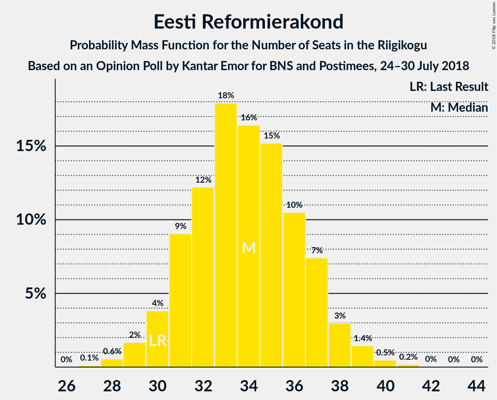

# Opinion Poll by Kantar Emor for BNS and Postimees, 24–30 July 2018

<a href="#voting-intentions">Voting Intentions</a> | <a href="#seats">Seats</a> | <a href="#coalitions">Coalitions</a> | <a href="#technical-information">Technical Information</a>

## Voting Intentions

### Confidence Intervals

| Party | Last Result | Poll Result | 80% Confidence Interval | 90% Confidence Interval | 95% Confidence Interval | 99% Confidence Interval |
|:-----:|:-----------:|:-----------:|:-----------------------:|:-----------------------:|:-----------------------:|:-----------------------:|
| Eesti Reformierakond | 27.7% | 29.6% | 27.5–31.8% |26.9–32.5% |26.4–33.0% |25.4–34.1% |
| Eesti Keskerakond | 24.8% | 23.9% | 21.9–26.0% |21.4–26.6% |20.9–27.1% |20.0–28.1% |
| Eesti Konservatiivne Rahvaerakond | 8.1% | 21.8% | 20.0–23.9% |19.4–24.5% |19.0–25.0% |18.1–26.0% |
| Sotsiaaldemokraatlik Erakond | 15.2% | 12.8% | 11.4–14.5% |10.9–15.0% |10.6–15.5% |9.9–16.3% |
| Erakond Isamaa | 13.7% | 5.3% | 4.4–6.5% |4.1–6.9% |3.9–7.2% |3.5–7.8% |
| Eesti Vabaerakond | 8.7% | 3.0% | 2.3–4.0% |2.1–4.3% |2.0–4.5% |1.7–5.0% |
| Erakond Eestimaa Rohelised | 0.9% | 2.9% | 2.2–3.8% |2.0–4.1% |1.9–4.3% |1.6–4.8% |

*Note:* The poll result column reflects the actual value used in the calculations. Published results may vary slightly, and in addition be rounded to fewer digits.

## Seats

### Confidence Intervals

| Party | Last Result | Median | 80% Confidence Interval | 90% Confidence Interval | 95% Confidence Interval | 99% Confidence Interval |
|:-----:|:-----------:|:------:|:-----------------------:|:-----------------------:|:-----------------------:|:-----------------------:|
| <a href="#eesti-reformierakond">Eesti Reformierakond</a> | 30 | 33 | 31–36 |30–37 |30–38 |28–40 |
| <a href="#eesti-keskerakond">Eesti Keskerakond</a> | 27 | 27 | 24–30 |24–30 |23–31 |22–32 |
| <a href="#eesti-konservatiivne-rahvaerakond">Eesti Konservatiivne Rahvaerakond</a> | 7 | 24 | 21–27 |21–27 |21–28 |19–29 |
| <a href="#sotsiaaldemokraatlik-erakond">Sotsiaaldemokraatlik Erakond</a> | 15 | 13 | 11–15 |11–16 |11–16 |10–17 |
| <a href="#erakond-isamaa">Erakond Isamaa</a> | 14 | 5 | 0–6 |0–6 |0–6 |0–7 |
| <a href="#eesti-vabaerakond">Eesti Vabaerakond</a> | 8 | 0 | 0 |0 |0 |0 |
| <a href="#erakond-eestimaa-rohelised">Erakond Eestimaa Rohelised</a> | 0 | 0 | 0 |0 |0 |0 |

### Eesti Reformierakond

*For a full overview of the results for this party, see the [Eesti Reformierakond](party-eestireformierakond.html) page.*

| Number of Seats | Probability | Accumulated | Special Marks |
|:---------------:|:-----------:|:-----------:|:-------------:|
| 27 | 0.1% | 100% |  |
| 28 | 1.1% | 99.9% |  |
| 29 | 1.3% | 98.8% |  |
| 30 | 4% | 98% | Last Result |
| 31 | 8% | 93% |  |
| 32 | 9% | 85% |  |
| 33 | 30% | 76% | Median |
| 34 | 14% | 46% |  |
| 35 | 16% | 32% |  |
| 36 | 7% | 16% |  |
| 37 | 6% | 9% |  |
| 38 | 1.1% | 3% |  |
| 39 | 1.1% | 2% |  |
| 40 | 0.7% | 0.8% |  |
| 41 | 0.1% | 0.1% |  |
| 42 | 0% | 0% |  |

### Eesti Keskerakond

*For a full overview of the results for this party, see the [Eesti Keskerakond](party-eestikeskerakond.html) page.*

| Number of Seats | Probability | Accumulated | Special Marks |
|:---------------:|:-----------:|:-----------:|:-------------:|
| 20 | 0.1% | 100% |  |
| 21 | 0.3% | 99.9% |  |
| 22 | 0.9% | 99.6% |  |
| 23 | 2% | 98.8% |  |
| 24 | 11% | 96% |  |
| 25 | 12% | 85% |  |
| 26 | 11% | 73% |  |
| 27 | 19% | 63% | Last Result, Median |
| 28 | 16% | 44% |  |
| 29 | 13% | 28% |  |
| 30 | 12% | 15% |  |
| 31 | 2% | 3% |  |
| 32 | 0.7% | 1.1% |  |
| 33 | 0.3% | 0.4% |  |
| 34 | 0% | 0% |  |

### Eesti Konservatiivne Rahvaerakond

*For a full overview of the results for this party, see the [Eesti Konservatiivne Rahvaerakond](party-eestikonservatiivnerahvaerakond.html) page.*

| Number of Seats | Probability | Accumulated | Special Marks |
|:---------------:|:-----------:|:-----------:|:-------------:|
| 7 | 0% | 100% | Last Result |
| 8 | 0% | 100% |  |
| 9 | 0% | 100% |  |
| 10 | 0% | 100% |  |
| 11 | 0% | 100% |  |
| 12 | 0% | 100% |  |
| 13 | 0% | 100% |  |
| 14 | 0% | 100% |  |
| 15 | 0% | 100% |  |
| 16 | 0% | 100% |  |
| 17 | 0% | 100% |  |
| 18 | 0.1% | 100% |  |
| 19 | 0.6% | 99.9% |  |
| 20 | 1.0% | 99.3% |  |
| 21 | 11% | 98% |  |
| 22 | 8% | 88% |  |
| 23 | 13% | 80% |  |
| 24 | 24% | 67% | Median |
| 25 | 26% | 43% |  |
| 26 | 6% | 17% |  |
| 27 | 6% | 11% |  |
| 28 | 3% | 5% |  |
| 29 | 1.1% | 1.4% |  |
| 30 | 0.1% | 0.2% |  |
| 31 | 0.1% | 0.1% |  |
| 32 | 0% | 0% |  |

### Sotsiaaldemokraatlik Erakond

*For a full overview of the results for this party, see the [Sotsiaaldemokraatlik Erakond](party-sotsiaaldemokraatlikerakond.html) page.*

| Number of Seats | Probability | Accumulated | Special Marks |
|:---------------:|:-----------:|:-----------:|:-------------:|
| 9 | 0.4% | 100% |  |
| 10 | 2% | 99.5% |  |
| 11 | 9% | 98% |  |
| 12 | 26% | 89% |  |
| 13 | 32% | 64% | Median |
| 14 | 21% | 32% |  |
| 15 | 4% | 11% | Last Result |
| 16 | 5% | 7% |  |
| 17 | 2% | 2% |  |
| 18 | 0.4% | 0.4% |  |
| 19 | 0% | 0% |  |

### Erakond Isamaa

*For a full overview of the results for this party, see the [Erakond Isamaa](party-erakondisamaa.html) page.*

| Number of Seats | Probability | Accumulated | Special Marks |
|:---------------:|:-----------:|:-----------:|:-------------:|
| 0 | 38% | 100% |  |
| 1 | 0% | 62% |  |
| 2 | 0% | 62% |  |
| 3 | 0% | 62% |  |
| 4 | 6% | 62% |  |
| 5 | 43% | 56% | Median |
| 6 | 11% | 13% |  |
| 7 | 2% | 2% |  |
| 8 | 0.2% | 0.2% |  |
| 9 | 0% | 0% |  |
| 10 | 0% | 0% |  |
| 11 | 0% | 0% |  |
| 12 | 0% | 0% |  |
| 13 | 0% | 0% |  |
| 14 | 0% | 0% | Last Result |

### Eesti Vabaerakond

*For a full overview of the results for this party, see the [Eesti Vabaerakond](party-eestivabaerakond.html) page.*

| Number of Seats | Probability | Accumulated | Special Marks |
|:---------------:|:-----------:|:-----------:|:-------------:|
| 0 | 99.6% | 100% | Median |
| 1 | 0% | 0.4% |  |
| 2 | 0% | 0.4% |  |
| 3 | 0% | 0.4% |  |
| 4 | 0.3% | 0.4% |  |
| 5 | 0.1% | 0.1% |  |
| 6 | 0% | 0% |  |
| 7 | 0% | 0% |  |
| 8 | 0% | 0% | Last Result |

### Erakond Eestimaa Rohelised

*For a full overview of the results for this party, see the [Erakond Eestimaa Rohelised](party-erakondeestimaarohelised.html) page.*

| Number of Seats | Probability | Accumulated | Special Marks |
|:---------------:|:-----------:|:-----------:|:-------------:|
| 0 | 99.6% | 100% | Last Result, Median |
| 1 | 0% | 0.4% |  |
| 2 | 0% | 0.4% |  |
| 3 | 0% | 0.4% |  |
| 4 | 0.2% | 0.4% |  |
| 5 | 0.2% | 0.2% |  |
| 6 | 0% | 0% |  |

## Coalitions

### Confidence Intervals

| Coalition | Last Result | Median | Majority? | 80% Confidence Interval | 90% Confidence Interval | 95% Confidence Interval | 99% Confidence Interval |
|:---------:|:-----------:|:------:|:---------:|:-----------------------:|:-----------------------:|:-----------------------:|:-----------------------:|
| Eesti Reformierakond – Eesti Keskerakond – Eesti Konservatiivne Rahvaerakond | 64 | 84 | 100% | 82–88 | 81–89 | 80–89 | 78–90 |
| Eesti Reformierakond – Eesti Konservatiivne Rahvaerakond – Erakond Isamaa | 51 | 61 | 100% | 57–64 | 57–65 | 56–65 | 55–67 |
| Eesti Reformierakond – Eesti Keskerakond | 57 | 60 | 100% | 58–64 | 56–65 | 55–65 | 54–67 |
| Eesti Reformierakond – Eesti Konservatiivne Rahvaerakond | 37 | 58 | 99.9% | 54–60 | 54–61 | 53–63 | 51–65 |
| Eesti Keskerakond – Eesti Konservatiivne Rahvaerakond | 34 | 51 | 59% | 48–54 | 47–55 | 46–56 | 45–57 |
| Eesti Reformierakond – Sotsiaaldemokraatlik Erakond – Erakond Isamaa – Eesti Vabaerakond | 67 | 50 | 40% | 47–53 | 46–54 | 45–55 | 44–56 |
| Eesti Reformierakond – Sotsiaaldemokraatlik Erakond – Erakond Isamaa | 59 | 50 | 40% | 47–53 | 46–54 | 45–55 | 44–56 |
| Eesti Reformierakond – Sotsiaaldemokraatlik Erakond | 45 | 46 | 6% | 44–50 | 43–51 | 42–52 | 41–53 |
| Eesti Keskerakond – Sotsiaaldemokraatlik Erakond – Erakond Isamaa | 56 | 43 | 0.1% | 41–47 | 40–47 | 38–48 | 36–50 |
| Eesti Keskerakond – Sotsiaaldemokraatlik Erakond | 42 | 40 | 0% | 37–44 | 36–44 | 36–45 | 34–46 |
| Eesti Konservatiivne Rahvaerakond – Sotsiaaldemokraatlik Erakond | 22 | 37 | 0% | 34–40 | 33–41 | 33–42 | 32–43 |
| Eesti Reformierakond – Erakond Isamaa | 44 | 37 | 0% | 33–40 | 33–41 | 32–42 | 30–43 |

### Eesti Reformierakond – Eesti Keskerakond – Eesti Konservatiivne Rahvaerakond

| Number of Seats | Probability | Accumulated | Special Marks |
|:---------------:|:-----------:|:-----------:|:-------------:|
| 64 | 0% | 100% | Last Result |
| 65 | 0% | 100% |  |
| 66 | 0% | 100% |  |
| 67 | 0% | 100% |  |
| 68 | 0% | 100% |  |
| 69 | 0% | 100% |  |
| 70 | 0% | 100% |  |
| 71 | 0% | 100% |  |
| 72 | 0% | 100% |  |
| 73 | 0% | 100% |  |
| 74 | 0% | 100% |  |
| 75 | 0% | 100% |  |
| 76 | 0% | 100% |  |
| 77 | 0.1% | 100% |  |
| 78 | 0.5% | 99.9% |  |
| 79 | 0.8% | 99.4% |  |
| 80 | 2% | 98.5% |  |
| 81 | 5% | 97% |  |
| 82 | 9% | 92% |  |
| 83 | 20% | 83% |  |
| 84 | 19% | 63% | Median |
| 85 | 8% | 44% |  |
| 86 | 5% | 36% |  |
| 87 | 10% | 31% |  |
| 88 | 13% | 21% |  |
| 89 | 6% | 8% |  |
| 90 | 1.5% | 2% |  |
| 91 | 0.2% | 0.2% |  |
| 92 | 0.1% | 0.1% |  |
| 93 | 0% | 0% |  |

### Eesti Reformierakond – Eesti Konservatiivne Rahvaerakond – Erakond Isamaa

| Number of Seats | Probability | Accumulated | Special Marks |
|:---------------:|:-----------:|:-----------:|:-------------:|
| 51 | 0% | 100% | Last Result, Majority |
| 52 | 0% | 100% |  |
| 53 | 0% | 100% |  |
| 54 | 0.2% | 99.9% |  |
| 55 | 1.2% | 99.8% |  |
| 56 | 2% | 98.6% |  |
| 57 | 8% | 97% |  |
| 58 | 6% | 89% |  |
| 59 | 16% | 84% |  |
| 60 | 15% | 68% |  |
| 61 | 9% | 52% |  |
| 62 | 15% | 43% | Median |
| 63 | 13% | 28% |  |
| 64 | 6% | 15% |  |
| 65 | 8% | 9% |  |
| 66 | 0.8% | 1.3% |  |
| 67 | 0.2% | 0.5% |  |
| 68 | 0.3% | 0.3% |  |
| 69 | 0% | 0% |  |

### Eesti Reformierakond – Eesti Keskerakond

| Number of Seats | Probability | Accumulated | Special Marks |
|:---------------:|:-----------:|:-----------:|:-------------:|
| 53 | 0.3% | 100% |  |
| 54 | 0.5% | 99.6% |  |
| 55 | 2% | 99.1% |  |
| 56 | 4% | 97% |  |
| 57 | 3% | 93% | Last Result |
| 58 | 13% | 91% |  |
| 59 | 11% | 77% |  |
| 60 | 19% | 67% | Median |
| 61 | 6% | 48% |  |
| 62 | 12% | 41% |  |
| 63 | 13% | 29% |  |
| 64 | 11% | 16% |  |
| 65 | 3% | 5% |  |
| 66 | 0.8% | 2% |  |
| 67 | 0.3% | 0.8% |  |
| 68 | 0.5% | 0.5% |  |
| 69 | 0% | 0% |  |

### Eesti Reformierakond – Eesti Konservatiivne Rahvaerakond

| Number of Seats | Probability | Accumulated | Special Marks |
|:---------------:|:-----------:|:-----------:|:-------------:|
| 37 | 0% | 100% | Last Result |
| 38 | 0% | 100% |  |
| 39 | 0% | 100% |  |
| 40 | 0% | 100% |  |
| 41 | 0% | 100% |  |
| 42 | 0% | 100% |  |
| 43 | 0% | 100% |  |
| 44 | 0% | 100% |  |
| 45 | 0% | 100% |  |
| 46 | 0% | 100% |  |
| 47 | 0% | 100% |  |
| 48 | 0% | 100% |  |
| 49 | 0% | 100% |  |
| 50 | 0.1% | 100% |  |
| 51 | 0.5% | 99.9% | Majority |
| 52 | 1.4% | 99.3% |  |
| 53 | 1.3% | 98% |  |
| 54 | 10% | 97% |  |
| 55 | 5% | 87% |  |
| 56 | 9% | 82% |  |
| 57 | 20% | 73% | Median |
| 58 | 16% | 53% |  |
| 59 | 15% | 37% |  |
| 60 | 13% | 22% |  |
| 61 | 4% | 9% |  |
| 62 | 2% | 5% |  |
| 63 | 2% | 3% |  |
| 64 | 0.9% | 1.4% |  |
| 65 | 0.3% | 0.5% |  |
| 66 | 0.2% | 0.2% |  |
| 67 | 0% | 0% |  |

### Eesti Keskerakond – Eesti Konservatiivne Rahvaerakond

| Number of Seats | Probability | Accumulated | Special Marks |
|:---------------:|:-----------:|:-----------:|:-------------:|
| 34 | 0% | 100% | Last Result |
| 35 | 0% | 100% |  |
| 36 | 0% | 100% |  |
| 37 | 0% | 100% |  |
| 38 | 0% | 100% |  |
| 39 | 0% | 100% |  |
| 40 | 0% | 100% |  |
| 41 | 0% | 100% |  |
| 42 | 0% | 100% |  |
| 43 | 0.1% | 100% |  |
| 44 | 0.2% | 99.9% |  |
| 45 | 0.8% | 99.7% |  |
| 46 | 3% | 98.8% |  |
| 47 | 5% | 96% |  |
| 48 | 6% | 91% |  |
| 49 | 10% | 85% |  |
| 50 | 16% | 75% |  |
| 51 | 18% | 59% | Median, Majority |
| 52 | 8% | 42% |  |
| 53 | 14% | 34% |  |
| 54 | 10% | 19% |  |
| 55 | 6% | 9% |  |
| 56 | 2% | 3% |  |
| 57 | 1.1% | 1.4% |  |
| 58 | 0.2% | 0.3% |  |
| 59 | 0.1% | 0.1% |  |
| 60 | 0% | 0% |  |

### Eesti Reformierakond – Sotsiaaldemokraatlik Erakond – Erakond Isamaa – Eesti Vabaerakond

| Number of Seats | Probability | Accumulated | Special Marks |
|:---------------:|:-----------:|:-----------:|:-------------:|
| 42 | 0.1% | 100% |  |
| 43 | 0.2% | 99.9% |  |
| 44 | 1.1% | 99.7% |  |
| 45 | 2% | 98.6% |  |
| 46 | 6% | 97% |  |
| 47 | 10% | 91% |  |
| 48 | 14% | 80% |  |
| 49 | 8% | 66% |  |
| 50 | 17% | 58% |  |
| 51 | 16% | 40% | Median, Majority |
| 52 | 10% | 24% |  |
| 53 | 6% | 14% |  |
| 54 | 5% | 9% |  |
| 55 | 3% | 4% |  |
| 56 | 0.8% | 1.1% |  |
| 57 | 0.2% | 0.3% |  |
| 58 | 0.1% | 0.1% |  |
| 59 | 0% | 0% |  |
| 60 | 0% | 0% |  |
| 61 | 0% | 0% |  |
| 62 | 0% | 0% |  |
| 63 | 0% | 0% |  |
| 64 | 0% | 0% |  |
| 65 | 0% | 0% |  |
| 66 | 0% | 0% |  |
| 67 | 0% | 0% | Last Result |

### Eesti Reformierakond – Sotsiaaldemokraatlik Erakond – Erakond Isamaa

| Number of Seats | Probability | Accumulated | Special Marks |
|:---------------:|:-----------:|:-----------:|:-------------:|
| 42 | 0.1% | 100% |  |
| 43 | 0.2% | 99.9% |  |
| 44 | 1.1% | 99.7% |  |
| 45 | 2% | 98.6% |  |
| 46 | 6% | 97% |  |
| 47 | 10% | 91% |  |
| 48 | 15% | 80% |  |
| 49 | 8% | 66% |  |
| 50 | 17% | 58% |  |
| 51 | 16% | 40% | Median, Majority |
| 52 | 10% | 24% |  |
| 53 | 6% | 14% |  |
| 54 | 5% | 8% |  |
| 55 | 3% | 4% |  |
| 56 | 0.8% | 1.1% |  |
| 57 | 0.2% | 0.3% |  |
| 58 | 0.1% | 0.1% |  |
| 59 | 0% | 0% | Last Result |

### Eesti Reformierakond – Sotsiaaldemokraatlik Erakond

| Number of Seats | Probability | Accumulated | Special Marks |
|:---------------:|:-----------:|:-----------:|:-------------:|
| 39 | 0.1% | 100% |  |
| 40 | 0.2% | 99.9% |  |
| 41 | 1.3% | 99.7% |  |
| 42 | 1.2% | 98% |  |
| 43 | 6% | 97% |  |
| 44 | 9% | 91% |  |
| 45 | 14% | 82% | Last Result |
| 46 | 19% | 68% | Median |
| 47 | 17% | 49% |  |
| 48 | 11% | 32% |  |
| 49 | 9% | 21% |  |
| 50 | 6% | 12% |  |
| 51 | 3% | 6% | Majority |
| 52 | 2% | 3% |  |
| 53 | 0.4% | 0.8% |  |
| 54 | 0.1% | 0.4% |  |
| 55 | 0.2% | 0.3% |  |
| 56 | 0% | 0% |  |

### Eesti Keskerakond – Sotsiaaldemokraatlik Erakond – Erakond Isamaa

| Number of Seats | Probability | Accumulated | Special Marks |
|:---------------:|:-----------:|:-----------:|:-------------:|
| 35 | 0.2% | 100% |  |
| 36 | 0.4% | 99.8% |  |
| 37 | 1.0% | 99.5% |  |
| 38 | 2% | 98.5% |  |
| 39 | 2% | 97% |  |
| 40 | 4% | 95% |  |
| 41 | 13% | 91% |  |
| 42 | 15% | 78% |  |
| 43 | 16% | 62% |  |
| 44 | 20% | 47% |  |
| 45 | 9% | 26% | Median |
| 46 | 5% | 17% |  |
| 47 | 9% | 12% |  |
| 48 | 1.2% | 3% |  |
| 49 | 1.2% | 2% |  |
| 50 | 0.5% | 0.6% |  |
| 51 | 0.1% | 0.1% | Majority |
| 52 | 0% | 0% |  |
| 53 | 0% | 0% |  |
| 54 | 0% | 0% |  |
| 55 | 0% | 0% |  |
| 56 | 0% | 0% | Last Result |

### Eesti Keskerakond – Sotsiaaldemokraatlik Erakond

| Number of Seats | Probability | Accumulated | Special Marks |
|:---------------:|:-----------:|:-----------:|:-------------:|
| 33 | 0.3% | 100% |  |
| 34 | 0.2% | 99.7% |  |
| 35 | 0.8% | 99.4% |  |
| 36 | 8% | 98.6% |  |
| 37 | 6% | 91% |  |
| 38 | 13% | 85% |  |
| 39 | 15% | 71% |  |
| 40 | 9% | 56% | Median |
| 41 | 15% | 47% |  |
| 42 | 16% | 32% | Last Result |
| 43 | 6% | 16% |  |
| 44 | 8% | 10% |  |
| 45 | 1.4% | 3% |  |
| 46 | 1.1% | 1.3% |  |
| 47 | 0.2% | 0.2% |  |
| 48 | 0% | 0.1% |  |
| 49 | 0% | 0% |  |

### Eesti Konservatiivne Rahvaerakond – Sotsiaaldemokraatlik Erakond

| Number of Seats | Probability | Accumulated | Special Marks |
|:---------------:|:-----------:|:-----------:|:-------------:|
| 22 | 0% | 100% | Last Result |
| 23 | 0% | 100% |  |
| 24 | 0% | 100% |  |
| 25 | 0% | 100% |  |
| 26 | 0% | 100% |  |
| 27 | 0% | 100% |  |
| 28 | 0% | 100% |  |
| 29 | 0% | 100% |  |
| 30 | 0.1% | 100% |  |
| 31 | 0.3% | 99.8% |  |
| 32 | 0.9% | 99.6% |  |
| 33 | 4% | 98.7% |  |
| 34 | 7% | 95% |  |
| 35 | 6% | 87% |  |
| 36 | 20% | 81% |  |
| 37 | 18% | 61% | Median |
| 38 | 23% | 43% |  |
| 39 | 6% | 20% |  |
| 40 | 5% | 13% |  |
| 41 | 5% | 8% |  |
| 42 | 2% | 3% |  |
| 43 | 0.5% | 1.0% |  |
| 44 | 0.2% | 0.5% |  |
| 45 | 0.2% | 0.2% |  |
| 46 | 0% | 0% |  |

### Eesti Reformierakond – Erakond Isamaa

| Number of Seats | Probability | Accumulated | Special Marks |
|:---------------:|:-----------:|:-----------:|:-------------:|
| 29 | 0.1% | 100% |  |
| 30 | 0.5% | 99.9% |  |
| 31 | 1.1% | 99.4% |  |
| 32 | 3% | 98% |  |
| 33 | 9% | 96% |  |
| 34 | 9% | 87% |  |
| 35 | 13% | 78% |  |
| 36 | 9% | 65% |  |
| 37 | 12% | 56% |  |
| 38 | 21% | 44% | Median |
| 39 | 6% | 23% |  |
| 40 | 8% | 17% |  |
| 41 | 5% | 9% |  |
| 42 | 3% | 4% |  |
| 43 | 0.5% | 0.9% |  |
| 44 | 0.4% | 0.4% | Last Result |
| 45 | 0.1% | 0.1% |  |
| 46 | 0% | 0% |  |

## Technical Information

### Opinion Poll

+ **Polling firm:** Kantar Emor
+ **Commissioner(s):** BNS and Postimees
+ **Fieldwork period:** 24–30 July 2018

### Calculations

+ **Sample size:** 733
+ **Simulations done:** 131,072
+ **Error estimate:** 1.59%

