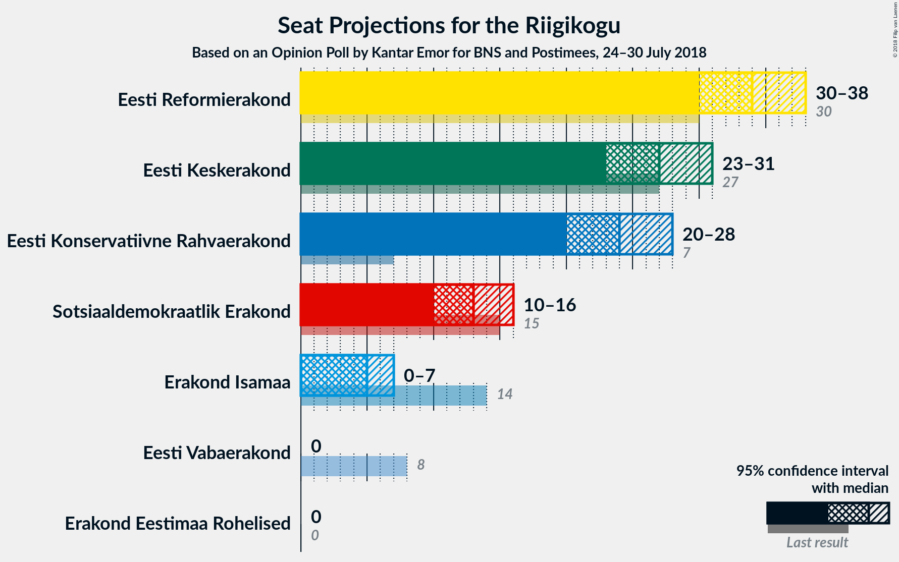
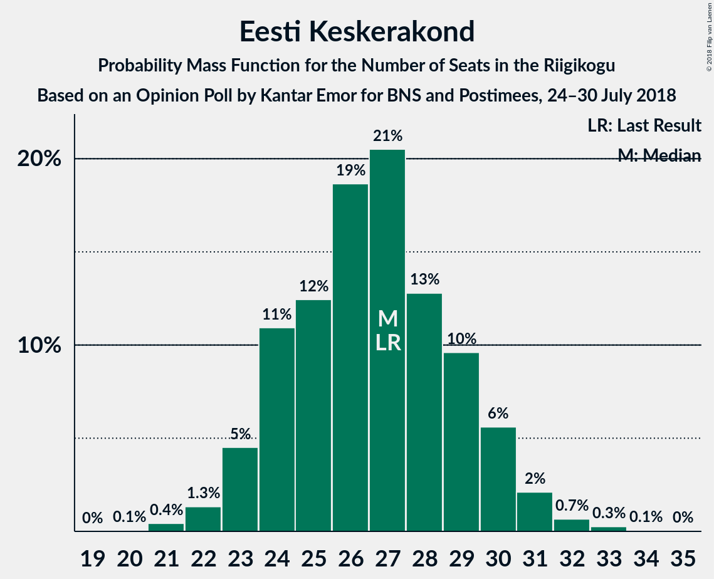
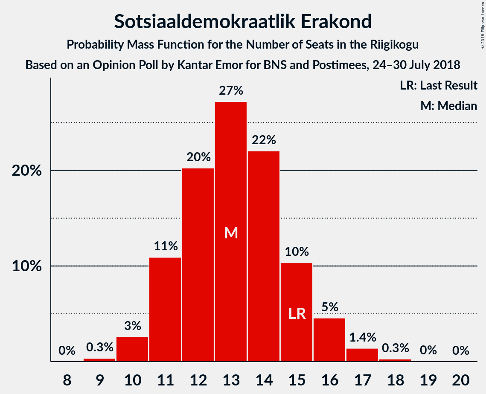
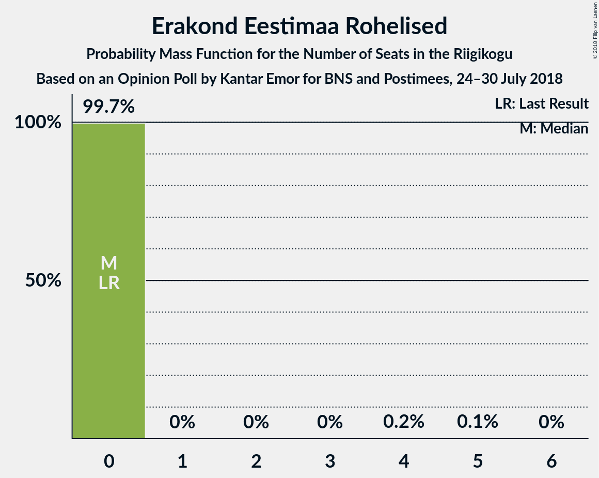

# Opinion Poll by Kantar Emor for BNS and Postimees, 24–30 July 2018

<a href="#voting-intentions">Voting Intentions</a> | <a href="#seats">Seats</a> | <a href="#coalitions">Coalitions</a> | <a href="#technical-information">Technical Information</a>

## Voting Intentions

### Confidence Intervals

| Party | Last Result | Poll Result | 80% Confidence Interval | 90% Confidence Interval | 95% Confidence Interval | 99% Confidence Interval |
|:-----:|:-----------:|:-----------:|:-----------------------:|:-----------------------:|:-----------------------:|:-----------------------:|
| Eesti Reformierakond | 27.7% | 29.6% | 27.5–31.8% |26.9–32.5% |26.4–33.0% |25.4–34.1% |
| Eesti Keskerakond | 24.8% | 23.9% | 21.9–26.0% |21.4–26.6% |20.9–27.1% |20.0–28.1% |
| Eesti Konservatiivne Rahvaerakond | 8.1% | 21.8% | 20.0–23.9% |19.4–24.5% |19.0–25.0% |18.1–26.0% |
| Sotsiaaldemokraatlik Erakond | 15.2% | 12.8% | 11.4–14.5% |10.9–15.0% |10.6–15.5% |9.9–16.3% |
| Erakond Isamaa | 13.7% | 5.3% | 4.4–6.5% |4.1–6.9% |3.9–7.2% |3.5–7.8% |
| Eesti Vabaerakond | 8.7% | 3.0% | 2.3–4.0% |2.1–4.3% |2.0–4.5% |1.7–5.0% |
| Erakond Eestimaa Rohelised | 0.9% | 2.9% | 2.2–3.8% |2.0–4.1% |1.9–4.3% |1.6–4.8% |

*Note:* The poll result column reflects the actual value used in the calculations. Published results may vary slightly, and in addition be rounded to fewer digits.

## Seats

### Confidence Intervals

| Party | Last Result | Median | 80% Confidence Interval | 90% Confidence Interval | 95% Confidence Interval | 99% Confidence Interval |
|:-----:|:-----------:|:------:|:-----------------------:|:-----------------------:|:-----------------------:|:-----------------------:|
| <a href="#eesti-reformierakond">Eesti Reformierakond</a> | 30 | 36 | 35–36 |35–36 |29–36 |29–36 |
| <a href="#eesti-keskerakond">Eesti Keskerakond</a> | 27 | 24 | 24–27 |24–27 |24–27 |24–30 |
| <a href="#eesti-konservatiivne-rahvaerakond">Eesti Konservatiivne Rahvaerakond</a> | 7 | 22 | 22–25 |22–25 |22–27 |20–27 |
| <a href="#sotsiaaldemokraatlik-erakond">Sotsiaaldemokraatlik Erakond</a> | 15 | 14 | 14 |14–15 |12–15 |12–16 |
| <a href="#erakond-isamaa">Erakond Isamaa</a> | 14 | 5 | 0–5 |0–5 |0–7 |0–7 |
| <a href="#eesti-vabaerakond">Eesti Vabaerakond</a> | 8 | 0 | 0 |0 |0 |0 |
| <a href="#erakond-eestimaa-rohelised">Erakond Eestimaa Rohelised</a> | 0 | 0 | 0 |0 |0 |0 |

### Eesti Reformierakond

*For a full overview of the results for this party, see the [Eesti Reformierakond](party-eestireformierakond.html) page.*

| Number of Seats | Probability | Accumulated | Special Marks |
|:---------------:|:-----------:|:-----------:|:-------------:|
| 29 | 3% | 100% |  |
| 30 | 0% | 97% | Last Result |
| 31 | 0.6% | 97% |  |
| 32 | 0% | 96% |  |
| 33 | 0% | 96% |  |
| 34 | 0% | 96% |  |
| 35 | 29% | 96% |  |
| 36 | 67% | 67% | Median |
| 37 | 0.3% | 0.3% |  |
| 38 | 0% | 0% |  |

### Eesti Keskerakond

*For a full overview of the results for this party, see the [Eesti Keskerakond](party-eestikeskerakond.html) page.*

| Number of Seats | Probability | Accumulated | Special Marks |
|:---------------:|:-----------:|:-----------:|:-------------:|
| 24 | 61% | 100% | Median |
| 25 | 0.1% | 39% |  |
| 26 | 9% | 39% |  |
| 27 | 29% | 30% | Last Result |
| 28 | 0% | 0.6% |  |
| 29 | 0% | 0.6% |  |
| 30 | 0.2% | 0.6% |  |
| 31 | 0% | 0.4% |  |
| 32 | 0.4% | 0.4% |  |
| 33 | 0% | 0% |  |

### Eesti Konservatiivne Rahvaerakond

*For a full overview of the results for this party, see the [Eesti Konservatiivne Rahvaerakond](party-eestikonservatiivnerahvaerakond.html) page.*

| Number of Seats | Probability | Accumulated | Special Marks |
|:---------------:|:-----------:|:-----------:|:-------------:|
| 7 | 0% | 100% | Last Result |
| 8 | 0% | 100% |  |
| 9 | 0% | 100% |  |
| 10 | 0% | 100% |  |
| 11 | 0% | 100% |  |
| 12 | 0% | 100% |  |
| 13 | 0% | 100% |  |
| 14 | 0% | 100% |  |
| 15 | 0% | 100% |  |
| 16 | 0% | 100% |  |
| 17 | 0% | 100% |  |
| 18 | 0% | 100% |  |
| 19 | 0.3% | 100% |  |
| 20 | 0.3% | 99.7% |  |
| 21 | 0.4% | 99.5% |  |
| 22 | 61% | 99.1% | Median |
| 23 | 0% | 38% |  |
| 24 | 6% | 38% |  |
| 25 | 29% | 32% |  |
| 26 | 0% | 3% |  |
| 27 | 3% | 3% |  |
| 28 | 0% | 0% |  |

### Sotsiaaldemokraatlik Erakond

*For a full overview of the results for this party, see the [Sotsiaaldemokraatlik Erakond](party-sotsiaaldemokraatlikerakond.html) page.*

| Number of Seats | Probability | Accumulated | Special Marks |
|:---------------:|:-----------:|:-----------:|:-------------:|
| 12 | 3% | 100% |  |
| 13 | 0% | 97% |  |
| 14 | 90% | 97% | Median |
| 15 | 6% | 7% | Last Result |
| 16 | 0.2% | 0.6% |  |
| 17 | 0.4% | 0.4% |  |
| 18 | 0% | 0% |  |

### Erakond Isamaa

*For a full overview of the results for this party, see the [Erakond Isamaa](party-erakondisamaa.html) page.*

| Number of Seats | Probability | Accumulated | Special Marks |
|:---------------:|:-----------:|:-----------:|:-------------:|
| 0 | 36% | 100% |  |
| 1 | 0% | 64% |  |
| 2 | 0% | 64% |  |
| 3 | 0% | 64% |  |
| 4 | 0% | 64% |  |
| 5 | 61% | 64% | Median |
| 6 | 0.3% | 3% |  |
| 7 | 3% | 3% |  |
| 8 | 0% | 0% |  |
| 9 | 0% | 0% |  |
| 10 | 0% | 0% |  |
| 11 | 0% | 0% |  |
| 12 | 0% | 0% |  |
| 13 | 0% | 0% |  |
| 14 | 0% | 0% | Last Result |

### Eesti Vabaerakond

*For a full overview of the results for this party, see the [Eesti Vabaerakond](party-eestivabaerakond.html) page.*

| Number of Seats | Probability | Accumulated | Special Marks |
|:---------------:|:-----------:|:-----------:|:-------------:|
| 0 | 100% | 100% | Median |
| 1 | 0% | 0% |  |
| 2 | 0% | 0% |  |
| 3 | 0% | 0% |  |
| 4 | 0% | 0% |  |
| 5 | 0% | 0% |  |
| 6 | 0% | 0% |  |
| 7 | 0% | 0% |  |
| 8 | 0% | 0% | Last Result |

### Erakond Eestimaa Rohelised

*For a full overview of the results for this party, see the [Erakond Eestimaa Rohelised](party-erakondeestimaarohelised.html) page.*

| Number of Seats | Probability | Accumulated | Special Marks |
|:---------------:|:-----------:|:-----------:|:-------------:|
| 0 | 100% | 100% | Last Result, Median |

## Coalitions

### Confidence Intervals

| Coalition | Last Result | Median | Majority? | 80% Confidence Interval | 90% Confidence Interval | 95% Confidence Interval | 99% Confidence Interval |
|:---------:|:-----------:|:------:|:---------:|:-----------------------:|:-----------------------:|:-----------------------:|:-----------------------:|
| Eesti Reformierakond – Eesti Keskerakond – Eesti Konservatiivne Rahvaerakond | 64 | 82 | 100% | 82–87 | 82–87 | 82–87 | 81–87 |
| Eesti Reformierakond – Eesti Konservatiivne Rahvaerakond – Erakond Isamaa | 51 | 63 | 100% | 60–63 | 60–63 | 60–63 | 55–63 |
| Eesti Reformierakond – Eesti Keskerakond | 57 | 60 | 100% | 60–62 | 60–62 | 55–62 | 55–62 |
| Eesti Reformierakond – Sotsiaaldemokraatlik Erakond – Erakond Isamaa – Eesti Vabaerakond | 67 | 55 | 68% | 49–55 | 49–55 | 48–55 | 48–55 |
| Eesti Reformierakond – Sotsiaaldemokraatlik Erakond – Erakond Isamaa | 59 | 55 | 68% | 49–55 | 49–55 | 48–55 | 48–55 |
| Eesti Reformierakond – Sotsiaaldemokraatlik Erakond | 45 | 50 | 7% | 49–50 | 49–51 | 41–51 | 41–51 |
| Eesti Keskerakond – Sotsiaaldemokraatlik Erakond – Erakond Isamaa | 56 | 43 | 0.2% | 41–43 | 41–43 | 41–45 | 41–49 |
| Eesti Reformierakond – Erakond Isamaa | 44 | 41 | 0% | 35–41 | 35–41 | 35–41 | 35–41 |

### Eesti Reformierakond – Eesti Keskerakond – Eesti Konservatiivne Rahvaerakond

| Number of Seats | Probability | Accumulated | Special Marks |
|:---------------:|:-----------:|:-----------:|:-------------:|
| 64 | 0% | 100% | Last Result |
| 65 | 0% | 100% |  |
| 66 | 0% | 100% |  |
| 67 | 0% | 100% |  |
| 68 | 0% | 100% |  |
| 69 | 0% | 100% |  |
| 70 | 0% | 100% |  |
| 71 | 0% | 100% |  |
| 72 | 0% | 100% |  |
| 73 | 0% | 100% |  |
| 74 | 0% | 100% |  |
| 75 | 0% | 100% |  |
| 76 | 0% | 100% |  |
| 77 | 0% | 100% |  |
| 78 | 0% | 100% |  |
| 79 | 0% | 100% |  |
| 80 | 0.2% | 100% |  |
| 81 | 0.3% | 99.7% |  |
| 82 | 64% | 99.4% | Median |
| 83 | 0% | 36% |  |
| 84 | 0.5% | 36% |  |
| 85 | 0% | 35% |  |
| 86 | 6% | 35% |  |
| 87 | 29% | 29% |  |
| 88 | 0% | 0% |  |

### Eesti Reformierakond – Eesti Konservatiivne Rahvaerakond – Erakond Isamaa

| Number of Seats | Probability | Accumulated | Special Marks |
|:---------------:|:-----------:|:-----------:|:-------------:|
| 51 | 0% | 100% | Last Result, Majority |
| 52 | 0.4% | 100% |  |
| 53 | 0% | 99.6% |  |
| 54 | 0% | 99.6% |  |
| 55 | 0.2% | 99.6% |  |
| 56 | 0% | 99.4% |  |
| 57 | 0% | 99.4% |  |
| 58 | 0% | 99.4% |  |
| 59 | 0% | 99.4% |  |
| 60 | 35% | 99.4% |  |
| 61 | 0% | 64% |  |
| 62 | 0% | 64% |  |
| 63 | 64% | 64% | Median |
| 64 | 0.1% | 0.1% |  |
| 65 | 0% | 0% |  |

### Eesti Reformierakond – Eesti Keskerakond

| Number of Seats | Probability | Accumulated | Special Marks |
|:---------------:|:-----------:|:-----------:|:-------------:|
| 55 | 3% | 100% |  |
| 56 | 0% | 97% |  |
| 57 | 0% | 97% | Last Result |
| 58 | 0% | 97% |  |
| 59 | 0% | 97% |  |
| 60 | 61% | 97% | Median |
| 61 | 0.5% | 36% |  |
| 62 | 35% | 36% |  |
| 63 | 0.4% | 0.4% |  |
| 64 | 0% | 0% |  |

### Eesti Reformierakond – Sotsiaaldemokraatlik Erakond – Erakond Isamaa – Eesti Vabaerakond

| Number of Seats | Probability | Accumulated | Special Marks |
|:---------------:|:-----------:|:-----------:|:-------------:|
| 48 | 3% | 100% |  |
| 49 | 29% | 97% |  |
| 50 | 0% | 68% |  |
| 51 | 6% | 68% | Majority |
| 52 | 0.2% | 61% |  |
| 53 | 0.2% | 61% |  |
| 54 | 0% | 61% |  |
| 55 | 61% | 61% | Median |
| 56 | 0% | 0.3% |  |
| 57 | 0.3% | 0.3% |  |
| 58 | 0% | 0% |  |
| 59 | 0% | 0% |  |
| 60 | 0% | 0% |  |
| 61 | 0% | 0% |  |
| 62 | 0% | 0% |  |
| 63 | 0% | 0% |  |
| 64 | 0% | 0% |  |
| 65 | 0% | 0% |  |
| 66 | 0% | 0% |  |
| 67 | 0% | 0% | Last Result |

### Eesti Reformierakond – Sotsiaaldemokraatlik Erakond – Erakond Isamaa

| Number of Seats | Probability | Accumulated | Special Marks |
|:---------------:|:-----------:|:-----------:|:-------------:|
| 48 | 3% | 100% |  |
| 49 | 29% | 97% |  |
| 50 | 0% | 68% |  |
| 51 | 6% | 68% | Majority |
| 52 | 0.2% | 61% |  |
| 53 | 0.2% | 61% |  |
| 54 | 0% | 61% |  |
| 55 | 61% | 61% | Median |
| 56 | 0% | 0.3% |  |
| 57 | 0.3% | 0.3% |  |
| 58 | 0% | 0% |  |
| 59 | 0% | 0% | Last Result |

### Eesti Reformierakond – Sotsiaaldemokraatlik Erakond

| Number of Seats | Probability | Accumulated | Special Marks |
|:---------------:|:-----------:|:-----------:|:-------------:|
| 41 | 3% | 100% |  |
| 42 | 0% | 97% |  |
| 43 | 0% | 97% |  |
| 44 | 0% | 97% |  |
| 45 | 0% | 97% | Last Result |
| 46 | 0% | 97% |  |
| 47 | 0.2% | 97% |  |
| 48 | 0.5% | 97% |  |
| 49 | 29% | 96% |  |
| 50 | 61% | 67% | Median |
| 51 | 7% | 7% | Majority |
| 52 | 0% | 0% |  |

### Eesti Keskerakond – Sotsiaaldemokraatlik Erakond – Erakond Isamaa

| Number of Seats | Probability | Accumulated | Special Marks |
|:---------------:|:-----------:|:-----------:|:-------------:|
| 41 | 35% | 100% |  |
| 42 | 0% | 65% |  |
| 43 | 61% | 65% | Median |
| 44 | 0.3% | 4% |  |
| 45 | 3% | 4% |  |
| 46 | 0% | 0.7% |  |
| 47 | 0% | 0.7% |  |
| 48 | 0% | 0.6% |  |
| 49 | 0.4% | 0.6% |  |
| 50 | 0% | 0.2% |  |
| 51 | 0.2% | 0.2% | Majority |
| 52 | 0% | 0% |  |
| 53 | 0% | 0% |  |
| 54 | 0% | 0% |  |
| 55 | 0% | 0% |  |
| 56 | 0% | 0% | Last Result |

### Eesti Reformierakond – Erakond Isamaa

| Number of Seats | Probability | Accumulated | Special Marks |
|:---------------:|:-----------:|:-----------:|:-------------:|
| 31 | 0.4% | 100% |  |
| 32 | 0% | 99.6% |  |
| 33 | 0% | 99.6% |  |
| 34 | 0% | 99.6% |  |
| 35 | 29% | 99.6% |  |
| 36 | 10% | 71% |  |
| 37 | 0% | 61% |  |
| 38 | 0% | 61% |  |
| 39 | 0% | 61% |  |
| 40 | 0% | 61% |  |
| 41 | 61% | 61% | Median |
| 42 | 0% | 0.3% |  |
| 43 | 0.3% | 0.3% |  |
| 44 | 0% | 0% | Last Result |

## Technical Information

### Opinion Poll

+ **Polling firm:** Kantar Emor
+ **Commissioner(s):** BNS and Postimees
+ **Fieldwork period:** 24–30 July 2018

### Calculations

+ **Sample size:** 733
+ **Simulations done:** 1,024
+ **Error estimate:** 2.48%

