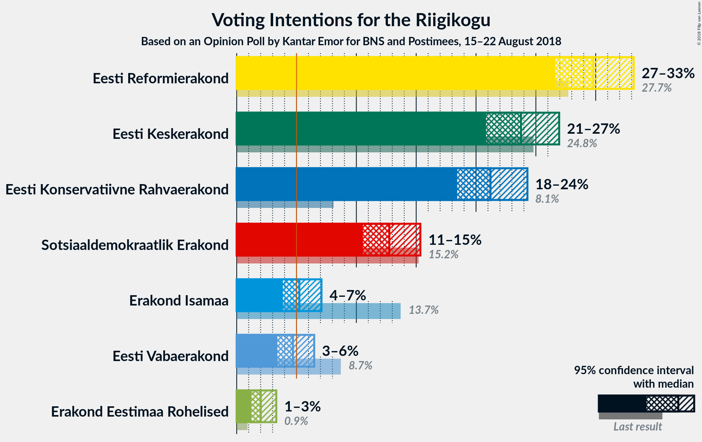
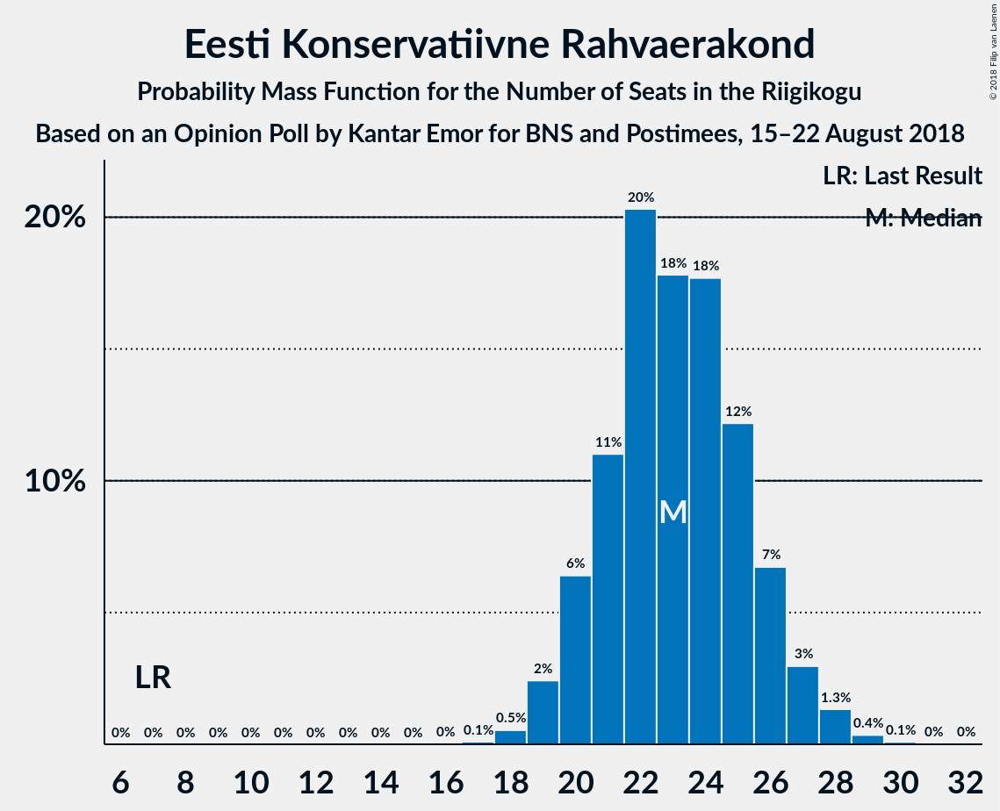
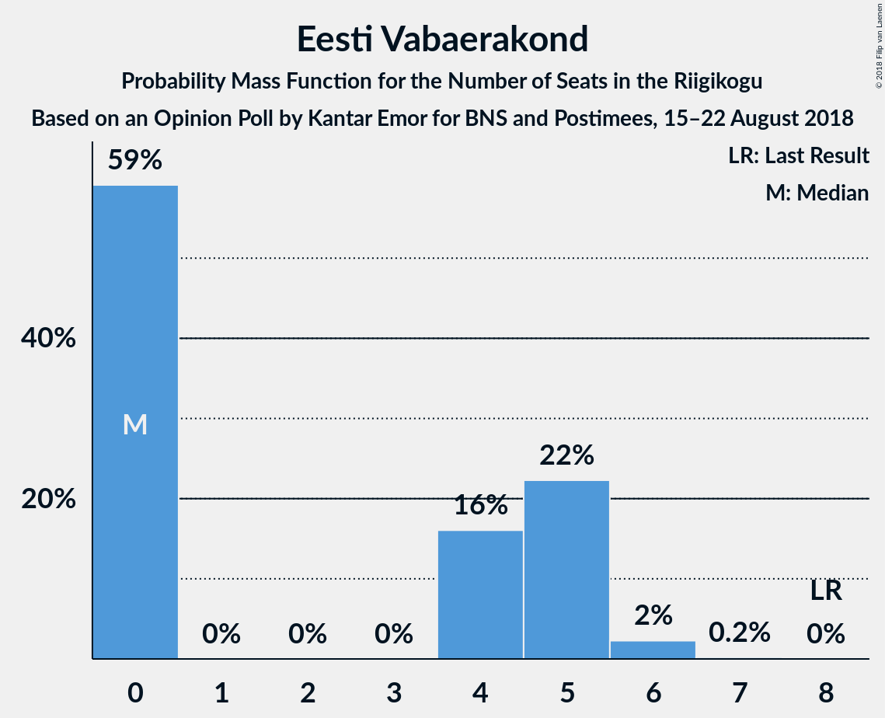

# Opinion Poll by Kantar Emor for BNS and Postimees, 15–22 August 2018

<a href="#voting-intentions">Voting Intentions</a> | <a href="#seats">Seats</a> | <a href="#coalitions">Coalitions</a> | <a href="#technical-information">Technical Information</a>

## Voting Intentions

### Confidence Intervals

| Party | Last Result | Poll Result | 80% Confidence Interval | 90% Confidence Interval | 95% Confidence Interval | 99% Confidence Interval |
|:-----:|:-----------:|:-----------:|:-----------------------:|:-----------------------:|:-----------------------:|:-----------------------:|
| Eesti Reformierakond | 27.7% | 29.8% | 27.7–32.0% |27.1–32.6% |26.6–33.2% |25.7–34.3% |
| Eesti Keskerakond | 24.8% | 23.8% | 21.8–25.8% |21.3–26.4% |20.8–26.9% |20.0–28.0% |
| Eesti Konservatiivne Rahvaerakond | 8.1% | 21.2% | 19.4–23.2% |18.9–23.8% |18.4–24.3% |17.6–25.3% |
| Sotsiaaldemokraatlik Erakond | 15.2% | 12.8% | 11.3–14.4% |10.9–14.9% |10.5–15.3% |9.9–16.2% |
| Erakond Isamaa | 13.7% | 5.2% | 4.3–6.4% |4.1–6.8% |3.9–7.1% |3.5–7.7% |
| Eesti Vabaerakond | 8.7% | 4.7% | 3.8–5.9% |3.6–6.2% |3.4–6.5% |3.0–7.1% |
| Erakond Eestimaa Rohelised | 0.9% | 2.0% | 1.5–2.9% |1.3–3.1% |1.2–3.3% |1.0–3.7% |

*Note:* The poll result column reflects the actual value used in the calculations. Published results may vary slightly, and in addition be rounded to fewer digits.

## Seats

### Confidence Intervals

| Party | Last Result | Median | 80% Confidence Interval | 90% Confidence Interval | 95% Confidence Interval | 99% Confidence Interval |
|:-----:|:-----------:|:------:|:-----------------------:|:-----------------------:|:-----------------------:|:-----------------------:|
| <a href="#eesti-reformierakond">Eesti Reformierakond</a> | 30 | 36 | 36 |35–38 |34–38 |28–38 |
| <a href="#eesti-keskerakond">Eesti Keskerakond</a> | 27 | 27 | 27 |25–27 |22–27 |22–29 |
| <a href="#eesti-konservatiivne-rahvaerakond">Eesti Konservatiivne Rahvaerakond</a> | 7 | 22 | 22 |22–26 |19–26 |19–27 |
| <a href="#sotsiaaldemokraatlik-erakond">Sotsiaaldemokraatlik Erakond</a> | 15 | 16 | 14–16 |11–16 |11–16 |9–16 |
| <a href="#erakond-isamaa">Erakond Isamaa</a> | 14 | 0 | 0 |0–5 |0–5 |0–5 |
| <a href="#eesti-vabaerakond">Eesti Vabaerakond</a> | 8 | 0 | 0 |0 |0 |0–6 |
| <a href="#erakond-eestimaa-rohelised">Erakond Eestimaa Rohelised</a> | 0 | 0 | 0 |0 |0 |0 |

### Eesti Reformierakond

*For a full overview of the results for this party, see the [Eesti Reformierakond](party-eestireformierakond.html) page.*

| Number of Seats | Probability | Accumulated | Special Marks |
|:---------------:|:-----------:|:-----------:|:-------------:|
| 27 | 0.2% | 100% |  |
| 28 | 0.8% | 99.8% |  |
| 29 | 0.3% | 99.0% |  |
| 30 | 0.1% | 98.7% | Last Result |
| 31 | 0.1% | 98.5% |  |
| 32 | 0.2% | 98% |  |
| 33 | 0.1% | 98% |  |
| 34 | 2% | 98% |  |
| 35 | 2% | 96% |  |
| 36 | 87% | 95% | Median |
| 37 | 0.8% | 7% |  |
| 38 | 6% | 6% |  |
| 39 | 0% | 0% |  |

### Eesti Keskerakond

*For a full overview of the results for this party, see the [Eesti Keskerakond](party-eestikeskerakond.html) page.*

| Number of Seats | Probability | Accumulated | Special Marks |
|:---------------:|:-----------:|:-----------:|:-------------:|
| 21 | 0.2% | 100% |  |
| 22 | 3% | 99.8% |  |
| 23 | 0.3% | 97% |  |
| 24 | 0% | 96% |  |
| 25 | 4% | 96% |  |
| 26 | 2% | 92% |  |
| 27 | 89% | 90% | Last Result, Median |
| 28 | 0% | 1.2% |  |
| 29 | 1.0% | 1.1% |  |
| 30 | 0% | 0.1% |  |
| 31 | 0% | 0.1% |  |
| 32 | 0.1% | 0.1% |  |
| 33 | 0% | 0% |  |

### Eesti Konservatiivne Rahvaerakond

*For a full overview of the results for this party, see the [Eesti Konservatiivne Rahvaerakond](party-eestikonservatiivnerahvaerakond.html) page.*

| Number of Seats | Probability | Accumulated | Special Marks |
|:---------------:|:-----------:|:-----------:|:-------------:|
| 7 | 0% | 100% | Last Result |
| 8 | 0% | 100% |  |
| 9 | 0% | 100% |  |
| 10 | 0% | 100% |  |
| 11 | 0% | 100% |  |
| 12 | 0% | 100% |  |
| 13 | 0% | 100% |  |
| 14 | 0% | 100% |  |
| 15 | 0% | 100% |  |
| 16 | 0% | 100% |  |
| 17 | 0.1% | 100% |  |
| 18 | 0% | 99.9% |  |
| 19 | 3% | 99.9% |  |
| 20 | 0.8% | 97% |  |
| 21 | 0.1% | 97% |  |
| 22 | 88% | 96% | Median |
| 23 | 2% | 9% |  |
| 24 | 0.2% | 7% |  |
| 25 | 2% | 7% |  |
| 26 | 3% | 5% |  |
| 27 | 2% | 2% |  |
| 28 | 0% | 0% |  |

### Sotsiaaldemokraatlik Erakond

*For a full overview of the results for this party, see the [Sotsiaaldemokraatlik Erakond](party-sotsiaaldemokraatlikerakond.html) page.*

| Number of Seats | Probability | Accumulated | Special Marks |
|:---------------:|:-----------:|:-----------:|:-------------:|
| 9 | 0.8% | 100% |  |
| 10 | 0.1% | 99.2% |  |
| 11 | 5% | 99.1% |  |
| 12 | 0.4% | 94% |  |
| 13 | 1.3% | 94% |  |
| 14 | 5% | 93% |  |
| 15 | 0% | 87% | Last Result |
| 16 | 87% | 87% | Median |
| 17 | 0% | 0% |  |

### Erakond Isamaa

*For a full overview of the results for this party, see the [Erakond Isamaa](party-erakondisamaa.html) page.*

| Number of Seats | Probability | Accumulated | Special Marks |
|:---------------:|:-----------:|:-----------:|:-------------:|
| 0 | 90% | 100% | Median |
| 1 | 0% | 10% |  |
| 2 | 0% | 10% |  |
| 3 | 0% | 10% |  |
| 4 | 4% | 10% |  |
| 5 | 5% | 6% |  |
| 6 | 0% | 0.2% |  |
| 7 | 0.2% | 0.2% |  |
| 8 | 0% | 0% |  |
| 9 | 0% | 0% |  |
| 10 | 0% | 0% |  |
| 11 | 0% | 0% |  |
| 12 | 0% | 0% |  |
| 13 | 0% | 0% |  |
| 14 | 0% | 0% | Last Result |

### Eesti Vabaerakond

*For a full overview of the results for this party, see the [Eesti Vabaerakond](party-eestivabaerakond.html) page.*

| Number of Seats | Probability | Accumulated | Special Marks |
|:---------------:|:-----------:|:-----------:|:-------------:|
| 0 | 98% | 100% | Median |
| 1 | 0% | 2% |  |
| 2 | 0% | 2% |  |
| 3 | 0% | 2% |  |
| 4 | 0.1% | 2% |  |
| 5 | 0.3% | 2% |  |
| 6 | 1.2% | 1.5% |  |
| 7 | 0.3% | 0.3% |  |
| 8 | 0% | 0% | Last Result |

### Erakond Eestimaa Rohelised

*For a full overview of the results for this party, see the [Erakond Eestimaa Rohelised](party-erakondeestimaarohelised.html) page.*

| Number of Seats | Probability | Accumulated | Special Marks |
|:---------------:|:-----------:|:-----------:|:-------------:|
| 0 | 100% | 100% | Last Result, Median |

## Coalitions

### Confidence Intervals

| Coalition | Last Result | Median | Majority? | 80% Confidence Interval | 90% Confidence Interval | 95% Confidence Interval | 99% Confidence Interval |
|:---------:|:-----------:|:------:|:---------:|:-----------------------:|:-----------------------:|:-----------------------:|:-----------------------:|
| Eesti Reformierakond – Eesti Keskerakond – Eesti Konservatiivne Rahvaerakond | 64 | 85 | 100% | 85 | 85–86 | 82–87 | 77–88 |
| Eesti Reformierakond – Eesti Konservatiivne Rahvaerakond – Erakond Isamaa | 51 | 58 | 100% | 58–61 | 58–63 | 58–68 | 52–68 |
| Eesti Reformierakond – Eesti Keskerakond | 57 | 63 | 100% | 63 | 60–63 | 60–63 | 53–63 |
| Eesti Reformierakond – Sotsiaaldemokraatlik Erakond – Erakond Isamaa – Eesti Vabaerakond | 67 | 52 | 98% | 52 | 51–53 | 51–57 | 48–57 |
| Eesti Reformierakond – Sotsiaaldemokraatlik Erakond – Erakond Isamaa | 59 | 52 | 96% | 52 | 51–53 | 48–57 | 46–57 |
| Eesti Reformierakond – Sotsiaaldemokraatlik Erakond | 45 | 52 | 91% | 51–52 | 48–52 | 46–52 | 42–52 |
| Eesti Keskerakond – Sotsiaaldemokraatlik Erakond – Erakond Isamaa | 56 | 43 | 0% | 43 | 40–43 | 37–44 | 37–47 |
| Eesti Reformierakond – Erakond Isamaa | 44 | 36 | 0% | 36 | 36–42 | 34–43 | 32–43 |

### Eesti Reformierakond – Eesti Keskerakond – Eesti Konservatiivne Rahvaerakond

| Number of Seats | Probability | Accumulated | Special Marks |
|:---------------:|:-----------:|:-----------:|:-------------:|
| 64 | 0% | 100% | Last Result |
| 65 | 0% | 100% |  |
| 66 | 0% | 100% |  |
| 67 | 0% | 100% |  |
| 68 | 0% | 100% |  |
| 69 | 0% | 100% |  |
| 70 | 0% | 100% |  |
| 71 | 0% | 100% |  |
| 72 | 0% | 100% |  |
| 73 | 0% | 100% |  |
| 74 | 0% | 100% |  |
| 75 | 0.1% | 100% |  |
| 76 | 0% | 99.9% |  |
| 77 | 0.8% | 99.9% |  |
| 78 | 0.4% | 99.0% |  |
| 79 | 0.3% | 98.7% |  |
| 80 | 0.2% | 98% |  |
| 81 | 0% | 98% |  |
| 82 | 3% | 98% |  |
| 83 | 0% | 95% |  |
| 84 | 0% | 95% |  |
| 85 | 89% | 95% | Median |
| 86 | 3% | 6% |  |
| 87 | 2% | 3% |  |
| 88 | 0.8% | 0.8% |  |
| 89 | 0% | 0% |  |

### Eesti Reformierakond – Eesti Konservatiivne Rahvaerakond – Erakond Isamaa

| Number of Seats | Probability | Accumulated | Special Marks |
|:---------------:|:-----------:|:-----------:|:-------------:|
| 51 | 0% | 100% | Last Result, Majority |
| 52 | 0.8% | 100% |  |
| 53 | 0.2% | 99.1% |  |
| 54 | 0.1% | 98.9% |  |
| 55 | 0% | 98.8% |  |
| 56 | 0.1% | 98.8% |  |
| 57 | 0% | 98.6% |  |
| 58 | 87% | 98.6% | Median |
| 59 | 0% | 11% |  |
| 60 | 0.3% | 11% |  |
| 61 | 2% | 11% |  |
| 62 | 3% | 9% |  |
| 63 | 2% | 7% |  |
| 64 | 0% | 4% |  |
| 65 | 0.2% | 4% |  |
| 66 | 0% | 4% |  |
| 67 | 0.8% | 4% |  |
| 68 | 3% | 3% |  |
| 69 | 0% | 0% |  |

### Eesti Reformierakond – Eesti Keskerakond

| Number of Seats | Probability | Accumulated | Special Marks |
|:---------------:|:-----------:|:-----------:|:-------------:|
| 52 | 0.3% | 100% |  |
| 53 | 0.2% | 99.7% |  |
| 54 | 0% | 99.5% |  |
| 55 | 0% | 99.5% |  |
| 56 | 0.5% | 99.4% |  |
| 57 | 0.8% | 98.9% | Last Result |
| 58 | 0.1% | 98% |  |
| 59 | 0% | 98% |  |
| 60 | 5% | 98% |  |
| 61 | 0% | 93% |  |
| 62 | 3% | 93% |  |
| 63 | 91% | 91% | Median |
| 64 | 0% | 0.1% |  |
| 65 | 0.1% | 0.1% |  |
| 66 | 0% | 0% |  |

### Eesti Reformierakond – Sotsiaaldemokraatlik Erakond – Erakond Isamaa – Eesti Vabaerakond

| Number of Seats | Probability | Accumulated | Special Marks |
|:---------------:|:-----------:|:-----------:|:-------------:|
| 46 | 0.2% | 100% |  |
| 47 | 0% | 99.8% |  |
| 48 | 2% | 99.8% |  |
| 49 | 0% | 98% |  |
| 50 | 0% | 98% |  |
| 51 | 4% | 98% | Majority |
| 52 | 88% | 95% | Median |
| 53 | 3% | 6% |  |
| 54 | 0% | 3% |  |
| 55 | 0.4% | 3% |  |
| 56 | 0% | 3% |  |
| 57 | 3% | 3% |  |
| 58 | 0% | 0% |  |
| 59 | 0% | 0% |  |
| 60 | 0% | 0% |  |
| 61 | 0% | 0% |  |
| 62 | 0% | 0% |  |
| 63 | 0% | 0% |  |
| 64 | 0% | 0% |  |
| 65 | 0% | 0% |  |
| 66 | 0% | 0% |  |
| 67 | 0% | 0% | Last Result |

### Eesti Reformierakond – Sotsiaaldemokraatlik Erakond – Erakond Isamaa

| Number of Seats | Probability | Accumulated | Special Marks |
|:---------------:|:-----------:|:-----------:|:-------------:|
| 40 | 0.2% | 100% |  |
| 41 | 0% | 99.8% |  |
| 42 | 0% | 99.8% |  |
| 43 | 0% | 99.8% |  |
| 44 | 0.1% | 99.8% |  |
| 45 | 0% | 99.7% |  |
| 46 | 1.3% | 99.7% |  |
| 47 | 0% | 98% |  |
| 48 | 2% | 98% |  |
| 49 | 0.2% | 97% |  |
| 50 | 0.1% | 97% |  |
| 51 | 3% | 96% | Majority |
| 52 | 87% | 93% | Median |
| 53 | 3% | 6% |  |
| 54 | 0% | 3% |  |
| 55 | 0.2% | 3% |  |
| 56 | 0% | 3% |  |
| 57 | 3% | 3% |  |
| 58 | 0% | 0% |  |
| 59 | 0% | 0% | Last Result |

### Eesti Reformierakond – Sotsiaaldemokraatlik Erakond

| Number of Seats | Probability | Accumulated | Special Marks |
|:---------------:|:-----------:|:-----------:|:-------------:|
| 40 | 0.2% | 100% |  |
| 41 | 0% | 99.8% |  |
| 42 | 1.3% | 99.8% |  |
| 43 | 0% | 98% |  |
| 44 | 0.4% | 98% |  |
| 45 | 0.1% | 98% | Last Result |
| 46 | 3% | 98% |  |
| 47 | 0% | 96% |  |
| 48 | 2% | 96% |  |
| 49 | 3% | 94% |  |
| 50 | 0% | 91% |  |
| 51 | 0.8% | 91% | Majority |
| 52 | 90% | 90% | Median |
| 53 | 0% | 0% |  |

### Eesti Keskerakond – Sotsiaaldemokraatlik Erakond – Erakond Isamaa

| Number of Seats | Probability | Accumulated | Special Marks |
|:---------------:|:-----------:|:-----------:|:-------------:|
| 37 | 3% | 100% |  |
| 38 | 1.0% | 97% |  |
| 39 | 0.9% | 96% |  |
| 40 | 2% | 95% |  |
| 41 | 0% | 93% |  |
| 42 | 0.3% | 93% |  |
| 43 | 89% | 93% | Median |
| 44 | 3% | 4% |  |
| 45 | 0% | 1.0% |  |
| 46 | 0.1% | 1.0% |  |
| 47 | 0.9% | 0.9% |  |
| 48 | 0% | 0% |  |
| 49 | 0% | 0% |  |
| 50 | 0% | 0% |  |
| 51 | 0% | 0% | Majority |
| 52 | 0% | 0% |  |
| 53 | 0% | 0% |  |
| 54 | 0% | 0% |  |
| 55 | 0% | 0% |  |
| 56 | 0% | 0% | Last Result |

### Eesti Reformierakond – Erakond Isamaa

| Number of Seats | Probability | Accumulated | Special Marks |
|:---------------:|:-----------:|:-----------:|:-------------:|
| 27 | 0.2% | 100% |  |
| 28 | 0% | 99.8% |  |
| 29 | 0% | 99.8% |  |
| 30 | 0% | 99.8% |  |
| 31 | 0% | 99.8% |  |
| 32 | 0.9% | 99.8% |  |
| 33 | 0.4% | 99.0% |  |
| 34 | 2% | 98.6% |  |
| 35 | 0% | 97% |  |
| 36 | 88% | 97% | Median |
| 37 | 0.2% | 9% |  |
| 38 | 0.8% | 9% |  |
| 39 | 0% | 8% |  |
| 40 | 2% | 8% |  |
| 41 | 0.2% | 7% |  |
| 42 | 4% | 6% |  |
| 43 | 3% | 3% |  |
| 44 | 0% | 0% | Last Result |

## Technical Information

### Opinion Poll

+ **Polling firm:** Kantar Emor
+ **Commissioner(s):** BNS and Postimees
+ **Fieldwork period:** 15–22 August 2018

### Calculations

+ **Sample size:** 745
+ **Simulations done:** 1,024
+ **Error estimate:** 2.94%

