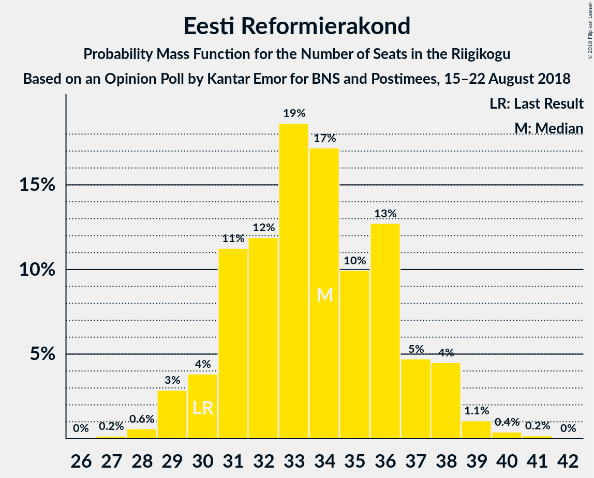
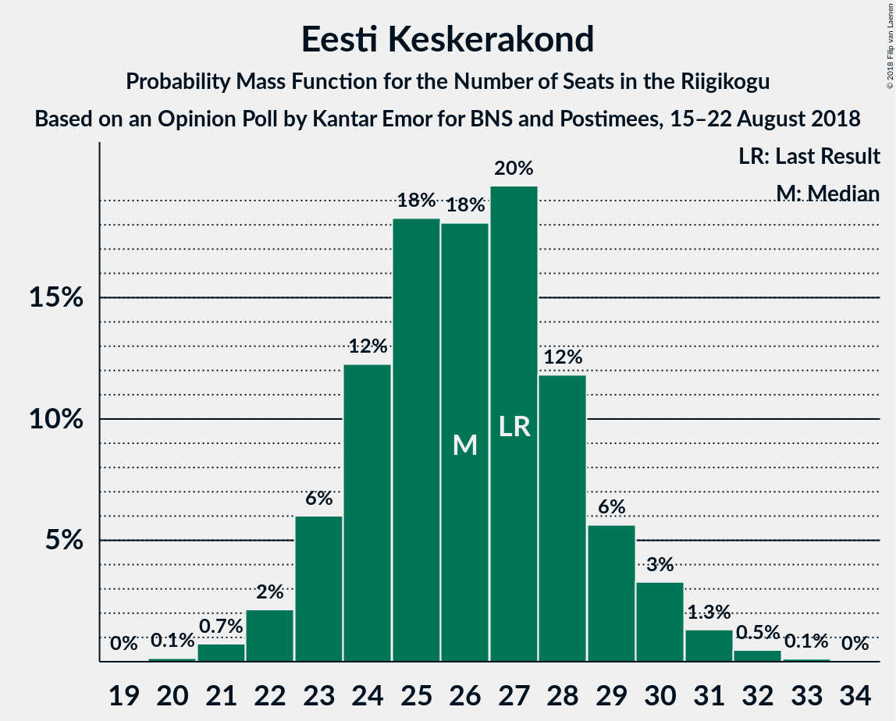
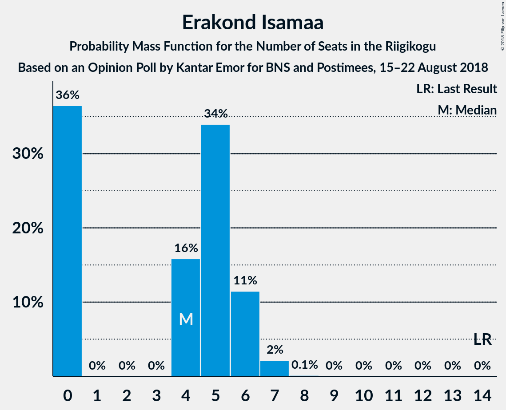

# Opinion Poll by Kantar Emor for BNS and Postimees, 15–22 August 2018

<a href="#voting-intentions">Voting Intentions</a> | <a href="#seats">Seats</a> | <a href="#coalitions">Coalitions</a> | <a href="#technical-information">Technical Information</a>

## Voting Intentions

### Confidence Intervals

| Party | Last Result | Poll Result | 80% Confidence Interval | 90% Confidence Interval | 95% Confidence Interval | 99% Confidence Interval |
|:-----:|:-----------:|:-----------:|:-----------------------:|:-----------------------:|:-----------------------:|:-----------------------:|
| Eesti Reformierakond | 27.7% | 29.8% | 27.7–32.0% |27.1–32.6% |26.6–33.2% |25.7–34.3% |
| Eesti Keskerakond | 24.8% | 23.8% | 21.8–25.8% |21.3–26.4% |20.8–26.9% |20.0–28.0% |
| Eesti Konservatiivne Rahvaerakond | 8.1% | 21.2% | 19.4–23.2% |18.9–23.8% |18.4–24.3% |17.6–25.3% |
| Sotsiaaldemokraatlik Erakond | 15.2% | 12.8% | 11.3–14.4% |10.9–14.9% |10.5–15.3% |9.9–16.2% |
| Erakond Isamaa | 13.7% | 5.2% | 4.3–6.4% |4.1–6.8% |3.9–7.1% |3.5–7.7% |
| Eesti Vabaerakond | 8.7% | 4.7% | 3.8–5.9% |3.6–6.2% |3.4–6.5% |3.0–7.1% |
| Erakond Eestimaa Rohelised | 0.9% | 2.0% | 1.5–2.9% |1.3–3.1% |1.2–3.3% |1.0–3.7% |

*Note:* The poll result column reflects the actual value used in the calculations. Published results may vary slightly, and in addition be rounded to fewer digits.

## Seats

### Confidence Intervals

| Party | Last Result | Median | 80% Confidence Interval | 90% Confidence Interval | 95% Confidence Interval | 99% Confidence Interval |
|:-----:|:-----------:|:------:|:-----------------------:|:-----------------------:|:-----------------------:|:-----------------------:|
| <a href="#eesti-reformierakond">Eesti Reformierakond</a> | 30 | 35 | 32–37 |31–38 |30–40 |28–40 |
| <a href="#eesti-keskerakond">Eesti Keskerakond</a> | 27 | 27 | 24–29 |23–30 |23–31 |21–32 |
| <a href="#eesti-konservatiivne-rahvaerakond">Eesti Konservatiivne Rahvaerakond</a> | 7 | 23 | 21–26 |20–26 |19–27 |19–29 |
| <a href="#sotsiaaldemokraatlik-erakond">Sotsiaaldemokraatlik Erakond</a> | 15 | 13 | 11–14 |11–15 |10–15 |9–16 |
| <a href="#erakond-isamaa">Erakond Isamaa</a> | 14 | 4 | 0–6 |0–6 |0–7 |0–7 |
| <a href="#eesti-vabaerakond">Eesti Vabaerakond</a> | 8 | 0 | 0–4 |0–5 |0–6 |0–7 |
| <a href="#erakond-eestimaa-rohelised">Erakond Eestimaa Rohelised</a> | 0 | 0 | 0 |0 |0 |0 |

### Eesti Reformierakond

*For a full overview of the results for this party, see the [Eesti Reformierakond](party-eestireformierakond.html) page.*

| Number of Seats | Probability | Accumulated | Special Marks |
|:---------------:|:-----------:|:-----------:|:-------------:|
| 27 | 0.1% | 100% |  |
| 28 | 0.5% | 99.9% |  |
| 29 | 0.6% | 99.4% |  |
| 30 | 2% | 98.8% | Last Result |
| 31 | 4% | 97% |  |
| 32 | 9% | 93% |  |
| 33 | 21% | 84% |  |
| 34 | 11% | 63% |  |
| 35 | 19% | 53% | Median |
| 36 | 15% | 34% |  |
| 37 | 10% | 18% |  |
| 38 | 5% | 9% |  |
| 39 | 0.7% | 3% |  |
| 40 | 2% | 3% |  |
| 41 | 0.3% | 0.3% |  |
| 42 | 0% | 0% |  |

### Eesti Keskerakond

*For a full overview of the results for this party, see the [Eesti Keskerakond](party-eestikeskerakond.html) page.*

| Number of Seats | Probability | Accumulated | Special Marks |
|:---------------:|:-----------:|:-----------:|:-------------:|
| 20 | 0.1% | 100% |  |
| 21 | 0.5% | 99.9% |  |
| 22 | 1.0% | 99.4% |  |
| 23 | 3% | 98% |  |
| 24 | 9% | 95% |  |
| 25 | 10% | 86% |  |
| 26 | 13% | 77% |  |
| 27 | 26% | 64% | Last Result, Median |
| 28 | 18% | 38% |  |
| 29 | 11% | 20% |  |
| 30 | 6% | 10% |  |
| 31 | 2% | 4% |  |
| 32 | 1.5% | 2% |  |
| 33 | 0.2% | 0.3% |  |
| 34 | 0% | 0% |  |

### Eesti Konservatiivne Rahvaerakond

*For a full overview of the results for this party, see the [Eesti Konservatiivne Rahvaerakond](party-eestikonservatiivnerahvaerakond.html) page.*

| Number of Seats | Probability | Accumulated | Special Marks |
|:---------------:|:-----------:|:-----------:|:-------------:|
| 7 | 0% | 100% | Last Result |
| 8 | 0% | 100% |  |
| 9 | 0% | 100% |  |
| 10 | 0% | 100% |  |
| 11 | 0% | 100% |  |
| 12 | 0% | 100% |  |
| 13 | 0% | 100% |  |
| 14 | 0% | 100% |  |
| 15 | 0% | 100% |  |
| 16 | 0% | 100% |  |
| 17 | 0.1% | 100% |  |
| 18 | 0.4% | 99.9% |  |
| 19 | 2% | 99.6% |  |
| 20 | 5% | 97% |  |
| 21 | 8% | 92% |  |
| 22 | 29% | 84% |  |
| 23 | 20% | 56% | Median |
| 24 | 13% | 35% |  |
| 25 | 9% | 22% |  |
| 26 | 9% | 13% |  |
| 27 | 3% | 4% |  |
| 28 | 0.8% | 1.4% |  |
| 29 | 0.5% | 0.6% |  |
| 30 | 0.1% | 0.1% |  |
| 31 | 0% | 0% |  |

### Sotsiaaldemokraatlik Erakond

*For a full overview of the results for this party, see the [Sotsiaaldemokraatlik Erakond](party-sotsiaaldemokraatlikerakond.html) page.*

| Number of Seats | Probability | Accumulated | Special Marks |
|:---------------:|:-----------:|:-----------:|:-------------:|
| 8 | 0.1% | 100% |  |
| 9 | 0.6% | 99.9% |  |
| 10 | 2% | 99.3% |  |
| 11 | 15% | 97% |  |
| 12 | 31% | 82% |  |
| 13 | 27% | 51% | Median |
| 14 | 16% | 24% |  |
| 15 | 5% | 8% | Last Result |
| 16 | 2% | 2% |  |
| 17 | 0.2% | 0.3% |  |
| 18 | 0.1% | 0.1% |  |
| 19 | 0% | 0% |  |

### Erakond Isamaa

*For a full overview of the results for this party, see the [Erakond Isamaa](party-erakondisamaa.html) page.*

| Number of Seats | Probability | Accumulated | Special Marks |
|:---------------:|:-----------:|:-----------:|:-------------:|
| 0 | 34% | 100% |  |
| 1 | 0% | 66% |  |
| 2 | 0% | 66% |  |
| 3 | 0% | 66% |  |
| 4 | 16% | 66% | Median |
| 5 | 38% | 50% |  |
| 6 | 8% | 11% |  |
| 7 | 3% | 3% |  |
| 8 | 0.1% | 0.1% |  |
| 9 | 0% | 0% |  |
| 10 | 0% | 0% |  |
| 11 | 0% | 0% |  |
| 12 | 0% | 0% |  |
| 13 | 0% | 0% |  |
| 14 | 0% | 0% | Last Result |

### Eesti Vabaerakond

*For a full overview of the results for this party, see the [Eesti Vabaerakond](party-eestivabaerakond.html) page.*

| Number of Seats | Probability | Accumulated | Special Marks |
|:---------------:|:-----------:|:-----------:|:-------------:|
| 0 | 88% | 100% | Median |
| 1 | 0% | 12% |  |
| 2 | 0% | 12% |  |
| 3 | 0% | 12% |  |
| 4 | 6% | 12% |  |
| 5 | 3% | 5% |  |
| 6 | 2% | 3% |  |
| 7 | 0.5% | 0.5% |  |
| 8 | 0% | 0% | Last Result |

### Erakond Eestimaa Rohelised

*For a full overview of the results for this party, see the [Erakond Eestimaa Rohelised](party-erakondeestimaarohelised.html) page.*

| Number of Seats | Probability | Accumulated | Special Marks |
|:---------------:|:-----------:|:-----------:|:-------------:|
| 0 | 100% | 100% | Last Result, Median |

## Coalitions

### Confidence Intervals

| Coalition | Last Result | Median | Majority? | 80% Confidence Interval | 90% Confidence Interval | 95% Confidence Interval | 99% Confidence Interval |
|:---------:|:-----------:|:------:|:---------:|:-----------------------:|:-----------------------:|:-----------------------:|:-----------------------:|
| Eesti Reformierakond – Eesti Keskerakond – Eesti Konservatiivne Rahvaerakond | 64 | 84 | 100% | 82–88 | 81–89 | 78–90 | 75–90 |
| Eesti Reformierakond – Eesti Konservatiivne Rahvaerakond – Erakond Isamaa | 51 | 61 | 100% | 58–64 | 57–65 | 56–66 | 54–67 |
| Eesti Reformierakond – Eesti Keskerakond | 57 | 62 | 100% | 58–64 | 57–64 | 55–66 | 53–67 |
| Eesti Reformierakond – Eesti Konservatiivne Rahvaerakond | 37 | 58 | 99.7% | 54–61 | 54–62 | 53–63 | 51–65 |
| Eesti Keskerakond – Eesti Konservatiivne Rahvaerakond | 34 | 50 | 35% | 46–54 | 46–55 | 45–56 | 43–57 |
| Eesti Reformierakond – Sotsiaaldemokraatlik Erakond – Erakond Isamaa – Eesti Vabaerakond | 67 | 51 | 65% | 47–55 | 46–55 | 45–56 | 44–58 |
| Eesti Reformierakond – Sotsiaaldemokraatlik Erakond – Erakond Isamaa | 59 | 51 | 59% | 47–53 | 45–54 | 45–56 | 44–57 |
| Eesti Reformierakond – Sotsiaaldemokraatlik Erakond | 45 | 47 | 15% | 44–51 | 44–51 | 42–52 | 41–54 |
| Eesti Keskerakond – Sotsiaaldemokraatlik Erakond – Erakond Isamaa | 56 | 43 | 0.1% | 39–46 | 39–47 | 37–47 | 36–49 |
| Eesti Keskerakond – Sotsiaaldemokraatlik Erakond | 42 | 40 | 0% | 37–42 | 35–44 | 35–44 | 34–46 |
| Eesti Reformierakond – Erakond Isamaa | 44 | 38 | 0% | 34–40 | 33–42 | 32–43 | 30–43 |
| Eesti Konservatiivne Rahvaerakond – Sotsiaaldemokraatlik Erakond | 22 | 35 | 0% | 33–39 | 32–39 | 31–40 | 30–42 |

### Eesti Reformierakond – Eesti Keskerakond – Eesti Konservatiivne Rahvaerakond

| Number of Seats | Probability | Accumulated | Special Marks |
|:---------------:|:-----------:|:-----------:|:-------------:|
| 64 | 0% | 100% | Last Result |
| 65 | 0% | 100% |  |
| 66 | 0% | 100% |  |
| 67 | 0% | 100% |  |
| 68 | 0% | 100% |  |
| 69 | 0% | 100% |  |
| 70 | 0% | 100% |  |
| 71 | 0% | 100% |  |
| 72 | 0% | 100% |  |
| 73 | 0% | 100% |  |
| 74 | 0.2% | 100% |  |
| 75 | 0.5% | 99.8% |  |
| 76 | 1.1% | 99.3% |  |
| 77 | 0.6% | 98% |  |
| 78 | 0.3% | 98% |  |
| 79 | 0.4% | 97% |  |
| 80 | 1.1% | 97% |  |
| 81 | 5% | 96% |  |
| 82 | 9% | 91% |  |
| 83 | 19% | 82% |  |
| 84 | 14% | 63% |  |
| 85 | 17% | 48% | Median |
| 86 | 4% | 32% |  |
| 87 | 13% | 27% |  |
| 88 | 7% | 15% |  |
| 89 | 5% | 8% |  |
| 90 | 3% | 3% |  |
| 91 | 0% | 0% |  |

### Eesti Reformierakond – Eesti Konservatiivne Rahvaerakond – Erakond Isamaa

| Number of Seats | Probability | Accumulated | Special Marks |
|:---------------:|:-----------:|:-----------:|:-------------:|
| 51 | 0% | 100% | Last Result, Majority |
| 52 | 0.1% | 100% |  |
| 53 | 0.2% | 99.9% |  |
| 54 | 0.6% | 99.7% |  |
| 55 | 1.0% | 99.0% |  |
| 56 | 3% | 98% |  |
| 57 | 4% | 95% |  |
| 58 | 5% | 91% |  |
| 59 | 13% | 86% |  |
| 60 | 20% | 73% |  |
| 61 | 10% | 53% |  |
| 62 | 20% | 43% | Median |
| 63 | 7% | 23% |  |
| 64 | 10% | 16% |  |
| 65 | 3% | 6% |  |
| 66 | 2% | 3% |  |
| 67 | 0.5% | 0.7% |  |
| 68 | 0.2% | 0.2% |  |
| 69 | 0% | 0% |  |

### Eesti Reformierakond – Eesti Keskerakond

| Number of Seats | Probability | Accumulated | Special Marks |
|:---------------:|:-----------:|:-----------:|:-------------:|
| 51 | 0.1% | 100% | Majority |
| 52 | 0.3% | 99.9% |  |
| 53 | 1.0% | 99.6% |  |
| 54 | 0.8% | 98.6% |  |
| 55 | 0.5% | 98% |  |
| 56 | 0.5% | 97% |  |
| 57 | 2% | 97% | Last Result |
| 58 | 5% | 94% |  |
| 59 | 8% | 90% |  |
| 60 | 11% | 81% |  |
| 61 | 17% | 70% |  |
| 62 | 11% | 52% | Median |
| 63 | 20% | 41% |  |
| 64 | 17% | 22% |  |
| 65 | 1.3% | 4% |  |
| 66 | 2% | 3% |  |
| 67 | 0.5% | 0.9% |  |
| 68 | 0.3% | 0.3% |  |
| 69 | 0% | 0% |  |

### Eesti Reformierakond – Eesti Konservatiivne Rahvaerakond

| Number of Seats | Probability | Accumulated | Special Marks |
|:---------------:|:-----------:|:-----------:|:-------------:|
| 37 | 0% | 100% | Last Result |
| 38 | 0% | 100% |  |
| 39 | 0% | 100% |  |
| 40 | 0% | 100% |  |
| 41 | 0% | 100% |  |
| 42 | 0% | 100% |  |
| 43 | 0% | 100% |  |
| 44 | 0% | 100% |  |
| 45 | 0% | 100% |  |
| 46 | 0% | 100% |  |
| 47 | 0% | 100% |  |
| 48 | 0% | 100% |  |
| 49 | 0.1% | 100% |  |
| 50 | 0.2% | 99.8% |  |
| 51 | 0.4% | 99.7% | Majority |
| 52 | 2% | 99.2% |  |
| 53 | 2% | 98% |  |
| 54 | 8% | 95% |  |
| 55 | 12% | 87% |  |
| 56 | 10% | 75% |  |
| 57 | 9% | 65% |  |
| 58 | 20% | 56% | Median |
| 59 | 11% | 36% |  |
| 60 | 12% | 24% |  |
| 61 | 4% | 12% |  |
| 62 | 5% | 8% |  |
| 63 | 1.1% | 3% |  |
| 64 | 1.1% | 2% |  |
| 65 | 1.1% | 1.2% |  |
| 66 | 0.1% | 0.1% |  |
| 67 | 0% | 0% |  |

### Eesti Keskerakond – Eesti Konservatiivne Rahvaerakond

| Number of Seats | Probability | Accumulated | Special Marks |
|:---------------:|:-----------:|:-----------:|:-------------:|
| 34 | 0% | 100% | Last Result |
| 35 | 0% | 100% |  |
| 36 | 0% | 100% |  |
| 37 | 0% | 100% |  |
| 38 | 0% | 100% |  |
| 39 | 0% | 100% |  |
| 40 | 0% | 100% |  |
| 41 | 0% | 100% |  |
| 42 | 0.1% | 100% |  |
| 43 | 0.3% | 99.8% |  |
| 44 | 1.3% | 99.5% |  |
| 45 | 3% | 98% |  |
| 46 | 6% | 95% |  |
| 47 | 4% | 90% |  |
| 48 | 8% | 86% |  |
| 49 | 18% | 78% |  |
| 50 | 25% | 60% | Median |
| 51 | 14% | 35% | Majority |
| 52 | 8% | 21% |  |
| 53 | 3% | 13% |  |
| 54 | 4% | 10% |  |
| 55 | 2% | 7% |  |
| 56 | 3% | 4% |  |
| 57 | 1.1% | 1.2% |  |
| 58 | 0% | 0.1% |  |
| 59 | 0% | 0% |  |

### Eesti Reformierakond – Sotsiaaldemokraatlik Erakond – Erakond Isamaa – Eesti Vabaerakond

| Number of Seats | Probability | Accumulated | Special Marks |
|:---------------:|:-----------:|:-----------:|:-------------:|
| 43 | 0% | 100% |  |
| 44 | 1.1% | 99.9% |  |
| 45 | 3% | 98.8% |  |
| 46 | 2% | 96% |  |
| 47 | 4% | 93% |  |
| 48 | 3% | 90% |  |
| 49 | 8% | 87% |  |
| 50 | 14% | 79% |  |
| 51 | 25% | 65% | Majority |
| 52 | 18% | 40% | Median |
| 53 | 8% | 22% |  |
| 54 | 4% | 14% |  |
| 55 | 6% | 10% |  |
| 56 | 3% | 5% |  |
| 57 | 1.3% | 2% |  |
| 58 | 0.3% | 0.5% |  |
| 59 | 0.1% | 0.2% |  |
| 60 | 0% | 0% |  |
| 61 | 0% | 0% |  |
| 62 | 0% | 0% |  |
| 63 | 0% | 0% |  |
| 64 | 0% | 0% |  |
| 65 | 0% | 0% |  |
| 66 | 0% | 0% |  |
| 67 | 0% | 0% | Last Result |

### Eesti Reformierakond – Sotsiaaldemokraatlik Erakond – Erakond Isamaa

| Number of Seats | Probability | Accumulated | Special Marks |
|:---------------:|:-----------:|:-----------:|:-------------:|
| 42 | 0.1% | 100% |  |
| 43 | 0.1% | 99.9% |  |
| 44 | 1.5% | 99.8% |  |
| 45 | 4% | 98% |  |
| 46 | 3% | 94% |  |
| 47 | 4% | 90% |  |
| 48 | 3% | 86% |  |
| 49 | 10% | 83% |  |
| 50 | 15% | 74% |  |
| 51 | 28% | 59% | Majority |
| 52 | 17% | 31% | Median |
| 53 | 6% | 14% |  |
| 54 | 3% | 8% |  |
| 55 | 2% | 5% |  |
| 56 | 2% | 3% |  |
| 57 | 0.8% | 0.9% |  |
| 58 | 0% | 0.1% |  |
| 59 | 0% | 0% | Last Result |

### Eesti Reformierakond – Sotsiaaldemokraatlik Erakond

| Number of Seats | Probability | Accumulated | Special Marks |
|:---------------:|:-----------:|:-----------:|:-------------:|
| 39 | 0.1% | 100% |  |
| 40 | 0.2% | 99.9% |  |
| 41 | 1.4% | 99.7% |  |
| 42 | 1.1% | 98% |  |
| 43 | 1.2% | 97% |  |
| 44 | 7% | 96% |  |
| 45 | 15% | 89% | Last Result |
| 46 | 20% | 74% |  |
| 47 | 15% | 55% |  |
| 48 | 13% | 40% | Median |
| 49 | 7% | 27% |  |
| 50 | 5% | 20% |  |
| 51 | 11% | 15% | Majority |
| 52 | 3% | 5% |  |
| 53 | 1.4% | 2% |  |
| 54 | 0.6% | 0.7% |  |
| 55 | 0.1% | 0.2% |  |
| 56 | 0% | 0.1% |  |
| 57 | 0% | 0% |  |

### Eesti Keskerakond – Sotsiaaldemokraatlik Erakond – Erakond Isamaa

| Number of Seats | Probability | Accumulated | Special Marks |
|:---------------:|:-----------:|:-----------:|:-------------:|
| 34 | 0.1% | 100% |  |
| 35 | 0.2% | 99.9% |  |
| 36 | 1.4% | 99.7% |  |
| 37 | 1.5% | 98% |  |
| 38 | 2% | 97% |  |
| 39 | 7% | 95% |  |
| 40 | 5% | 88% |  |
| 41 | 13% | 83% |  |
| 42 | 13% | 70% |  |
| 43 | 19% | 57% |  |
| 44 | 9% | 38% | Median |
| 45 | 10% | 28% |  |
| 46 | 10% | 19% |  |
| 47 | 7% | 9% |  |
| 48 | 1.0% | 2% |  |
| 49 | 0.7% | 0.9% |  |
| 50 | 0.1% | 0.2% |  |
| 51 | 0% | 0.1% | Majority |
| 52 | 0% | 0% |  |
| 53 | 0% | 0% |  |
| 54 | 0% | 0% |  |
| 55 | 0% | 0% |  |
| 56 | 0% | 0% | Last Result |

### Eesti Keskerakond – Sotsiaaldemokraatlik Erakond

| Number of Seats | Probability | Accumulated | Special Marks |
|:---------------:|:-----------:|:-----------:|:-------------:|
| 32 | 0.1% | 100% |  |
| 33 | 0.2% | 99.9% |  |
| 34 | 0.9% | 99.6% |  |
| 35 | 5% | 98.7% |  |
| 36 | 4% | 94% |  |
| 37 | 11% | 90% |  |
| 38 | 10% | 79% |  |
| 39 | 19% | 69% |  |
| 40 | 10% | 50% | Median |
| 41 | 20% | 40% |  |
| 42 | 11% | 20% | Last Result |
| 43 | 3% | 9% |  |
| 44 | 3% | 6% |  |
| 45 | 2% | 2% |  |
| 46 | 0.3% | 0.6% |  |
| 47 | 0.2% | 0.2% |  |
| 48 | 0.1% | 0.1% |  |
| 49 | 0% | 0% |  |

### Eesti Reformierakond – Erakond Isamaa

| Number of Seats | Probability | Accumulated | Special Marks |
|:---------------:|:-----------:|:-----------:|:-------------:|
| 28 | 0.1% | 100% |  |
| 29 | 0% | 99.9% |  |
| 30 | 0.4% | 99.9% |  |
| 31 | 0.4% | 99.5% |  |
| 32 | 2% | 99.1% |  |
| 33 | 4% | 97% |  |
| 34 | 3% | 93% |  |
| 35 | 12% | 90% |  |
| 36 | 3% | 78% |  |
| 37 | 16% | 75% |  |
| 38 | 22% | 59% |  |
| 39 | 2% | 37% | Median |
| 40 | 25% | 35% |  |
| 41 | 3% | 9% |  |
| 42 | 2% | 6% |  |
| 43 | 3% | 4% |  |
| 44 | 0% | 0.5% | Last Result |
| 45 | 0.4% | 0.5% |  |
| 46 | 0% | 0% |  |

### Eesti Konservatiivne Rahvaerakond – Sotsiaaldemokraatlik Erakond

| Number of Seats | Probability | Accumulated | Special Marks |
|:---------------:|:-----------:|:-----------:|:-------------:|
| 22 | 0% | 100% | Last Result |
| 23 | 0% | 100% |  |
| 24 | 0% | 100% |  |
| 25 | 0% | 100% |  |
| 26 | 0% | 100% |  |
| 27 | 0% | 100% |  |
| 28 | 0% | 100% |  |
| 29 | 0.3% | 100% |  |
| 30 | 0.9% | 99.7% |  |
| 31 | 2% | 98.8% |  |
| 32 | 2% | 97% |  |
| 33 | 10% | 95% |  |
| 34 | 16% | 85% |  |
| 35 | 21% | 69% |  |
| 36 | 5% | 48% | Median |
| 37 | 24% | 43% |  |
| 38 | 9% | 19% |  |
| 39 | 7% | 10% |  |
| 40 | 2% | 3% |  |
| 41 | 0.6% | 1.3% |  |
| 42 | 0.6% | 0.7% |  |
| 43 | 0% | 0.1% |  |
| 44 | 0% | 0% |  |

## Technical Information

### Opinion Poll

+ **Polling firm:** Kantar Emor
+ **Commissioner(s):** BNS and Postimees
+ **Fieldwork period:** 15–22 August 2018

### Calculations

+ **Sample size:** 745
+ **Simulations done:** 131,072
+ **Error estimate:** 0.82%

