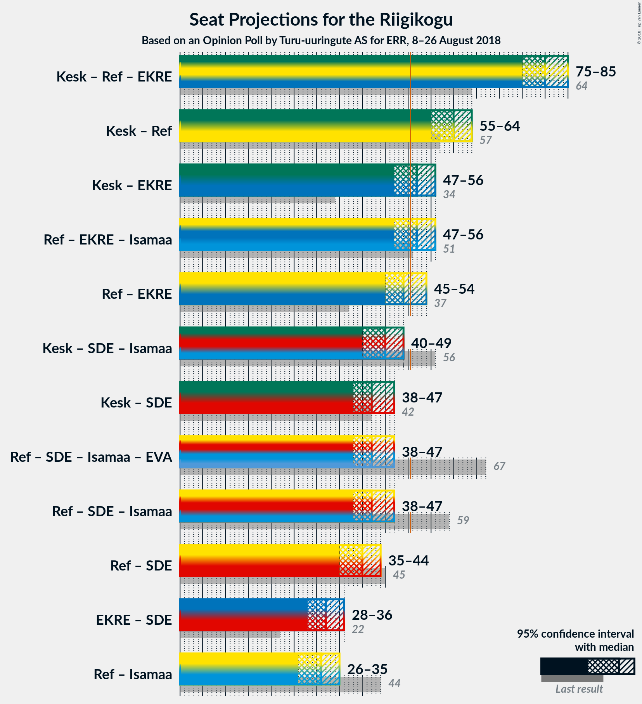

# Opinion Poll by Turu-uuringute AS for ERR, 8–26 August 2018

<a href="#voting-intentions">Voting Intentions</a> | <a href="#seats">Seats</a> | <a href="#coalitions">Coalitions</a> | <a href="#technical-information">Technical Information</a>

## Voting Intentions

### Confidence Intervals

| Party | Last Result | Poll Result | 80% Confidence Interval | 90% Confidence Interval | 95% Confidence Interval | 99% Confidence Interval |
|:-----:|:-----------:|:-----------:|:-----------------------:|:-----------------------:|:-----------------------:|:-----------------------:|
| Eesti Keskerakond | 24.8% | 27.0% | 25.3–28.9% |24.8–29.4% |24.3–29.8% |23.5–30.7% |
| Eesti Reformierakond | 27.7% | 25.0% | 23.3–26.8% |22.8–27.3% |22.4–27.8% |21.6–28.7% |
| Eesti Konservatiivne Rahvaerakond | 8.1% | 19.0% | 17.5–20.7% |17.1–21.1% |16.7–21.6% |16.0–22.4% |
| Sotsiaaldemokraatlik Erakond | 15.2% | 11.0% | 9.8–12.4% |9.5–12.8% |9.2–13.1% |8.7–13.8% |
| Erakond Isamaa | 13.7% | 5.0% | 4.2–6.0% |4.0–6.3% |3.8–6.5% |3.5–7.1% |
| Erakond Eestimaa Rohelised | 0.9% | 4.0% | 3.3–4.9% |3.1–5.2% |2.9–5.4% |2.7–5.9% |
| Eesti Vabaerakond | 8.7% | 2.0% | 1.5–2.7% |1.4–2.9% |1.3–3.1% |1.1–3.4% |

*Note:* The poll result column reflects the actual value used in the calculations. Published results may vary slightly, and in addition be rounded to fewer digits.

## Seats

### Confidence Intervals

| Party | Last Result | Median | 80% Confidence Interval | 90% Confidence Interval | 95% Confidence Interval | 99% Confidence Interval |
|:-----:|:-----------:|:------:|:-----------------------:|:-----------------------:|:-----------------------:|:-----------------------:|
| <a href="#eesti-keskerakond">Eesti Keskerakond</a> | 27 | 27 | 27–29 |27–30 |27–31 |25–34 |
| <a href="#eesti-reformierakond">Eesti Reformierakond</a> | 30 | 29 | 27–29 |26–29 |26–29 |25–31 |
| <a href="#eesti-konservatiivne-rahvaerakond">Eesti Konservatiivne Rahvaerakond</a> | 7 | 21 | 20–23 |19–24 |18–24 |17–24 |
| <a href="#sotsiaaldemokraatlik-erakond">Sotsiaaldemokraatlik Erakond</a> | 15 | 13 | 9–13 |9–13 |9–13 |8–13 |
| <a href="#erakond-isamaa">Erakond Isamaa</a> | 14 | 5 | 5–7 |5–7 |5–7 |0–7 |
| <a href="#erakond-eestimaa-rohelised">Erakond Eestimaa Rohelised</a> | 0 | 0 | 0 |0–4 |0–4 |0–5 |
| <a href="#eesti-vabaerakond">Eesti Vabaerakond</a> | 8 | 0 | 0 |0 |0 |0 |

### Eesti Keskerakond

*For a full overview of the results for this party, see the [Eesti Keskerakond](party-eestikeskerakond.html) page.*

| Number of Seats | Probability | Accumulated | Special Marks |
|:---------------:|:-----------:|:-----------:|:-------------:|
| 24 | 0.1% | 100% |  |
| 25 | 0.3% | 99.8% |  |
| 26 | 0.1% | 99.5% |  |
| 27 | 78% | 99.4% | Last Result, Median |
| 28 | 0.5% | 22% |  |
| 29 | 13% | 21% |  |
| 30 | 4% | 8% |  |
| 31 | 3% | 4% |  |
| 32 | 0.4% | 1.0% |  |
| 33 | 0% | 0.6% |  |
| 34 | 0.2% | 0.6% |  |
| 35 | 0.1% | 0.3% |  |
| 36 | 0.1% | 0.3% |  |
| 37 | 0% | 0.1% |  |
| 38 | 0% | 0.1% |  |
| 39 | 0% | 0.1% |  |
| 40 | 0.1% | 0.1% |  |
| 41 | 0% | 0% |  |

### Eesti Reformierakond

*For a full overview of the results for this party, see the [Eesti Reformierakond](party-eestireformierakond.html) page.*

| Number of Seats | Probability | Accumulated | Special Marks |
|:---------------:|:-----------:|:-----------:|:-------------:|
| 25 | 0.5% | 100% |  |
| 26 | 5% | 99.4% |  |
| 27 | 10% | 94% |  |
| 28 | 7% | 84% |  |
| 29 | 75% | 77% | Median |
| 30 | 0.5% | 2% | Last Result |
| 31 | 1.0% | 1.4% |  |
| 32 | 0% | 0.4% |  |
| 33 | 0.3% | 0.4% |  |
| 34 | 0% | 0% |  |

### Eesti Konservatiivne Rahvaerakond

*For a full overview of the results for this party, see the [Eesti Konservatiivne Rahvaerakond](party-eestikonservatiivnerahvaerakond.html) page.*

| Number of Seats | Probability | Accumulated | Special Marks |
|:---------------:|:-----------:|:-----------:|:-------------:|
| 7 | 0% | 100% | Last Result |
| 8 | 0% | 100% |  |
| 9 | 0% | 100% |  |
| 10 | 0% | 100% |  |
| 11 | 0% | 100% |  |
| 12 | 0% | 100% |  |
| 13 | 0% | 100% |  |
| 14 | 0% | 100% |  |
| 15 | 0% | 100% |  |
| 16 | 0.3% | 100% |  |
| 17 | 0.4% | 99.6% |  |
| 18 | 2% | 99.2% |  |
| 19 | 4% | 97% |  |
| 20 | 13% | 93% |  |
| 21 | 64% | 80% | Median |
| 22 | 2% | 17% |  |
| 23 | 9% | 15% |  |
| 24 | 5% | 5% |  |
| 25 | 0.1% | 0.1% |  |
| 26 | 0% | 0% |  |

### Sotsiaaldemokraatlik Erakond

*For a full overview of the results for this party, see the [Sotsiaaldemokraatlik Erakond](party-sotsiaaldemokraatlikerakond.html) page.*

| Number of Seats | Probability | Accumulated | Special Marks |
|:---------------:|:-----------:|:-----------:|:-------------:|
| 8 | 1.4% | 100% |  |
| 9 | 15% | 98.6% |  |
| 10 | 3% | 84% |  |
| 11 | 5% | 81% |  |
| 12 | 12% | 76% |  |
| 13 | 64% | 64% | Median |
| 14 | 0.1% | 0.1% |  |
| 15 | 0% | 0% | Last Result |

### Erakond Isamaa

*For a full overview of the results for this party, see the [Erakond Isamaa](party-erakondisamaa.html) page.*

| Number of Seats | Probability | Accumulated | Special Marks |
|:---------------:|:-----------:|:-----------:|:-------------:|
| 0 | 0.7% | 100% |  |
| 1 | 0% | 99.3% |  |
| 2 | 0% | 99.3% |  |
| 3 | 0% | 99.3% |  |
| 4 | 0.3% | 99.3% |  |
| 5 | 81% | 99.0% | Median |
| 6 | 7% | 18% |  |
| 7 | 11% | 11% |  |
| 8 | 0% | 0% |  |
| 9 | 0% | 0% |  |
| 10 | 0% | 0% |  |
| 11 | 0% | 0% |  |
| 12 | 0% | 0% |  |
| 13 | 0% | 0% |  |
| 14 | 0% | 0% | Last Result |

### Erakond Eestimaa Rohelised

*For a full overview of the results for this party, see the [Erakond Eestimaa Rohelised](party-erakondeestimaarohelised.html) page.*

| Number of Seats | Probability | Accumulated | Special Marks |
|:---------------:|:-----------:|:-----------:|:-------------:|
| 0 | 93% | 100% | Last Result, Median |
| 1 | 0% | 7% |  |
| 2 | 0% | 7% |  |
| 3 | 0% | 7% |  |
| 4 | 6% | 7% |  |
| 5 | 0.8% | 0.8% |  |
| 6 | 0% | 0% |  |

### Eesti Vabaerakond

*For a full overview of the results for this party, see the [Eesti Vabaerakond](party-eestivabaerakond.html) page.*

| Number of Seats | Probability | Accumulated | Special Marks |
|:---------------:|:-----------:|:-----------:|:-------------:|
| 0 | 100% | 100% | Median |
| 1 | 0% | 0% |  |
| 2 | 0% | 0% |  |
| 3 | 0% | 0% |  |
| 4 | 0% | 0% |  |
| 5 | 0% | 0% |  |
| 6 | 0% | 0% |  |
| 7 | 0% | 0% |  |
| 8 | 0% | 0% | Last Result |

## Coalitions

### Confidence Intervals

| Coalition | Last Result | Median | Majority? | 80% Confidence Interval | 90% Confidence Interval | 95% Confidence Interval | 99% Confidence Interval |
|:---------:|:-----------:|:------:|:---------:|:-----------------------:|:-----------------------:|:-----------------------:|:-----------------------:|
| Eesti Keskerakond – Eesti Reformierakond – Eesti Konservatiivne Rahvaerakond | 64 | 77 | 100% | 77–79 | 76–79 | 76–79 | 74–82 |
| Eesti Keskerakond – Eesti Reformierakond | 57 | 56 | 100% | 56–58 | 53–58 | 53–59 | 52–62 |
| Eesti Reformierakond – Eesti Konservatiivne Rahvaerakond – Erakond Isamaa | 51 | 55 | 99.7% | 54–55 | 53–57 | 53–57 | 52–59 |
| Eesti Keskerakond – Sotsiaaldemokraatlik Erakond – Erakond Isamaa | 56 | 45 | 0% | 44–46 | 41–47 | 41–48 | 41–48 |
| Eesti Reformierakond – Sotsiaaldemokraatlik Erakond – Erakond Isamaa – Eesti Vabaerakond | 67 | 47 | 0.4% | 43–47 | 40–47 | 40–47 | 39–50 |
| Eesti Reformierakond – Sotsiaaldemokraatlik Erakond – Erakond Isamaa | 59 | 47 | 0.4% | 43–47 | 40–47 | 40–47 | 39–50 |
| Eesti Reformierakond – Sotsiaaldemokraatlik Erakond | 45 | 42 | 0% | 36–42 | 35–42 | 35–42 | 34–44 |
| Eesti Reformierakond – Erakond Isamaa | 44 | 34 | 0% | 33–34 | 31–35 | 31–35 | 30–37 |

### Eesti Keskerakond – Eesti Reformierakond – Eesti Konservatiivne Rahvaerakond

| Number of Seats | Probability | Accumulated | Special Marks |
|:---------------:|:-----------:|:-----------:|:-------------:|
| 64 | 0% | 100% | Last Result |
| 65 | 0% | 100% |  |
| 66 | 0% | 100% |  |
| 67 | 0% | 100% |  |
| 68 | 0% | 100% |  |
| 69 | 0% | 100% |  |
| 70 | 0% | 100% |  |
| 71 | 0% | 100% |  |
| 72 | 0% | 100% |  |
| 73 | 0.4% | 100% |  |
| 74 | 0.2% | 99.6% |  |
| 75 | 0.5% | 99.4% |  |
| 76 | 9% | 98.9% |  |
| 77 | 74% | 90% | Median |
| 78 | 5% | 16% |  |
| 79 | 10% | 11% |  |
| 80 | 0.2% | 1.4% |  |
| 81 | 0.1% | 1.3% |  |
| 82 | 0.6% | 1.1% |  |
| 83 | 0% | 0.5% |  |
| 84 | 0.1% | 0.5% |  |
| 85 | 0% | 0.4% |  |
| 86 | 0.3% | 0.4% |  |
| 87 | 0.1% | 0.1% |  |
| 88 | 0% | 0% |  |

### Eesti Keskerakond – Eesti Reformierakond

| Number of Seats | Probability | Accumulated | Special Marks |
|:---------------:|:-----------:|:-----------:|:-------------:|
| 52 | 0.5% | 100% |  |
| 53 | 5% | 99.5% |  |
| 54 | 0.1% | 94% |  |
| 55 | 0.1% | 94% |  |
| 56 | 81% | 94% | Median |
| 57 | 0.6% | 12% | Last Result |
| 58 | 7% | 12% |  |
| 59 | 3% | 5% |  |
| 60 | 1.0% | 2% |  |
| 61 | 0.4% | 1.0% |  |
| 62 | 0.1% | 0.6% |  |
| 63 | 0% | 0.4% |  |
| 64 | 0.2% | 0.4% |  |
| 65 | 0.1% | 0.2% |  |
| 66 | 0% | 0.1% |  |
| 67 | 0% | 0.1% |  |
| 68 | 0.1% | 0.1% |  |
| 69 | 0% | 0% |  |

### Eesti Reformierakond – Eesti Konservatiivne Rahvaerakond – Erakond Isamaa

| Number of Seats | Probability | Accumulated | Special Marks |
|:---------------:|:-----------:|:-----------:|:-------------:|
| 45 | 0.1% | 100% |  |
| 46 | 0.1% | 99.8% |  |
| 47 | 0% | 99.7% |  |
| 48 | 0% | 99.7% |  |
| 49 | 0% | 99.7% |  |
| 50 | 0% | 99.7% |  |
| 51 | 0.1% | 99.7% | Last Result, Majority |
| 52 | 0.6% | 99.6% |  |
| 53 | 6% | 98.9% |  |
| 54 | 13% | 93% |  |
| 55 | 70% | 80% | Median |
| 56 | 0.2% | 9% |  |
| 57 | 8% | 9% |  |
| 58 | 0.1% | 0.8% |  |
| 59 | 0.6% | 0.7% |  |
| 60 | 0.1% | 0.1% |  |
| 61 | 0% | 0% |  |

### Eesti Keskerakond – Sotsiaaldemokraatlik Erakond – Erakond Isamaa

| Number of Seats | Probability | Accumulated | Special Marks |
|:---------------:|:-----------:|:-----------:|:-------------:|
| 40 | 0.1% | 100% |  |
| 41 | 6% | 99.8% |  |
| 42 | 0.2% | 94% |  |
| 43 | 1.2% | 93% |  |
| 44 | 8% | 92% |  |
| 45 | 73% | 84% | Median |
| 46 | 4% | 11% |  |
| 47 | 3% | 7% |  |
| 48 | 4% | 4% |  |
| 49 | 0.4% | 0.4% |  |
| 50 | 0% | 0% |  |
| 51 | 0% | 0% | Majority |
| 52 | 0% | 0% |  |
| 53 | 0% | 0% |  |
| 54 | 0% | 0% |  |
| 55 | 0% | 0% |  |
| 56 | 0% | 0% | Last Result |

### Eesti Reformierakond – Sotsiaaldemokraatlik Erakond – Erakond Isamaa – Eesti Vabaerakond

| Number of Seats | Probability | Accumulated | Special Marks |
|:---------------:|:-----------:|:-----------:|:-------------:|
| 35 | 0.1% | 100% |  |
| 36 | 0.1% | 99.9% |  |
| 37 | 0% | 99.8% |  |
| 38 | 0.2% | 99.8% |  |
| 39 | 0.6% | 99.5% |  |
| 40 | 5% | 98.9% |  |
| 41 | 1.1% | 94% |  |
| 42 | 0% | 92% |  |
| 43 | 9% | 92% |  |
| 44 | 4% | 84% |  |
| 45 | 3% | 80% |  |
| 46 | 9% | 77% |  |
| 47 | 67% | 68% | Median |
| 48 | 0.1% | 1.0% |  |
| 49 | 0% | 1.0% |  |
| 50 | 0.6% | 1.0% |  |
| 51 | 0.4% | 0.4% | Majority |
| 52 | 0% | 0% |  |
| 53 | 0% | 0% |  |
| 54 | 0% | 0% |  |
| 55 | 0% | 0% |  |
| 56 | 0% | 0% |  |
| 57 | 0% | 0% |  |
| 58 | 0% | 0% |  |
| 59 | 0% | 0% |  |
| 60 | 0% | 0% |  |
| 61 | 0% | 0% |  |
| 62 | 0% | 0% |  |
| 63 | 0% | 0% |  |
| 64 | 0% | 0% |  |
| 65 | 0% | 0% |  |
| 66 | 0% | 0% |  |
| 67 | 0% | 0% | Last Result |

### Eesti Reformierakond – Sotsiaaldemokraatlik Erakond – Erakond Isamaa

| Number of Seats | Probability | Accumulated | Special Marks |
|:---------------:|:-----------:|:-----------:|:-------------:|
| 35 | 0.1% | 100% |  |
| 36 | 0.1% | 99.9% |  |
| 37 | 0% | 99.8% |  |
| 38 | 0.2% | 99.8% |  |
| 39 | 0.6% | 99.5% |  |
| 40 | 5% | 98.9% |  |
| 41 | 1.1% | 94% |  |
| 42 | 0% | 92% |  |
| 43 | 9% | 92% |  |
| 44 | 4% | 84% |  |
| 45 | 3% | 80% |  |
| 46 | 9% | 77% |  |
| 47 | 67% | 68% | Median |
| 48 | 0.1% | 1.0% |  |
| 49 | 0% | 1.0% |  |
| 50 | 0.6% | 1.0% |  |
| 51 | 0.4% | 0.4% | Majority |
| 52 | 0% | 0% |  |
| 53 | 0% | 0% |  |
| 54 | 0% | 0% |  |
| 55 | 0% | 0% |  |
| 56 | 0% | 0% |  |
| 57 | 0% | 0% |  |
| 58 | 0% | 0% |  |
| 59 | 0% | 0% | Last Result |

### Eesti Reformierakond – Sotsiaaldemokraatlik Erakond

| Number of Seats | Probability | Accumulated | Special Marks |
|:---------------:|:-----------:|:-----------:|:-------------:|
| 34 | 0.5% | 100% |  |
| 35 | 7% | 99.5% |  |
| 36 | 9% | 93% |  |
| 37 | 0.1% | 84% |  |
| 38 | 2% | 84% |  |
| 39 | 5% | 82% |  |
| 40 | 0.6% | 77% |  |
| 41 | 11% | 76% |  |
| 42 | 64% | 65% | Median |
| 43 | 0.4% | 1.4% |  |
| 44 | 0.7% | 1.0% |  |
| 45 | 0.3% | 0.4% | Last Result |
| 46 | 0% | 0% |  |

### Eesti Reformierakond – Erakond Isamaa

| Number of Seats | Probability | Accumulated | Special Marks |
|:---------------:|:-----------:|:-----------:|:-------------:|
| 26 | 0.2% | 100% |  |
| 27 | 0% | 99.8% |  |
| 28 | 0.1% | 99.8% |  |
| 29 | 0% | 99.7% |  |
| 30 | 0.9% | 99.7% |  |
| 31 | 5% | 98.8% |  |
| 32 | 0.1% | 93% |  |
| 33 | 5% | 93% |  |
| 34 | 81% | 88% | Median |
| 35 | 6% | 7% |  |
| 36 | 0.6% | 2% |  |
| 37 | 0.6% | 1.0% |  |
| 38 | 0% | 0.4% |  |
| 39 | 0.4% | 0.4% |  |
| 40 | 0% | 0% |  |
| 41 | 0% | 0% |  |
| 42 | 0% | 0% |  |
| 43 | 0% | 0% |  |
| 44 | 0% | 0% | Last Result |

## Technical Information

### Opinion Poll

+ **Polling firm:** Turu-uuringute AS
+ **Commissioner(s):** ERR
+ **Fieldwork period:** 8–26 August 2018

### Calculations

+ **Sample size:** 1000
+ **Simulations done:** 1,024
+ **Error estimate:** 3.55%

