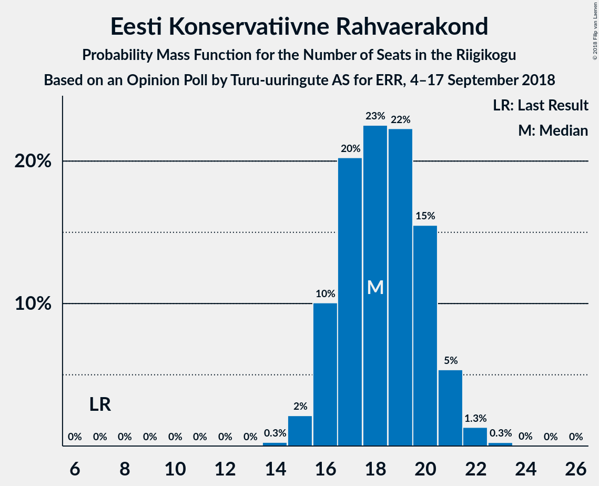
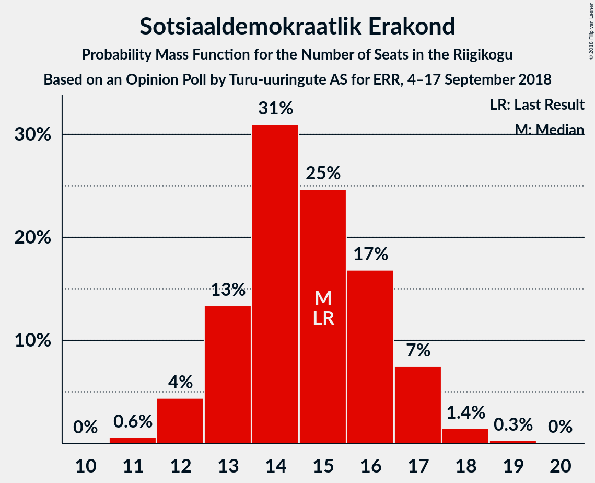
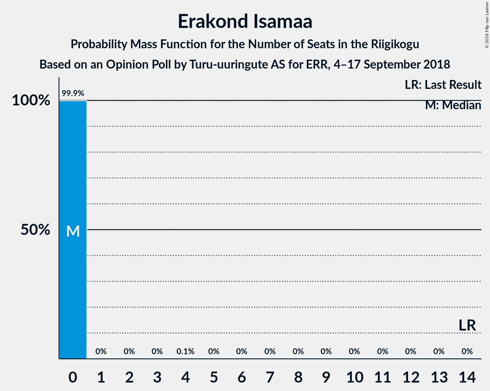
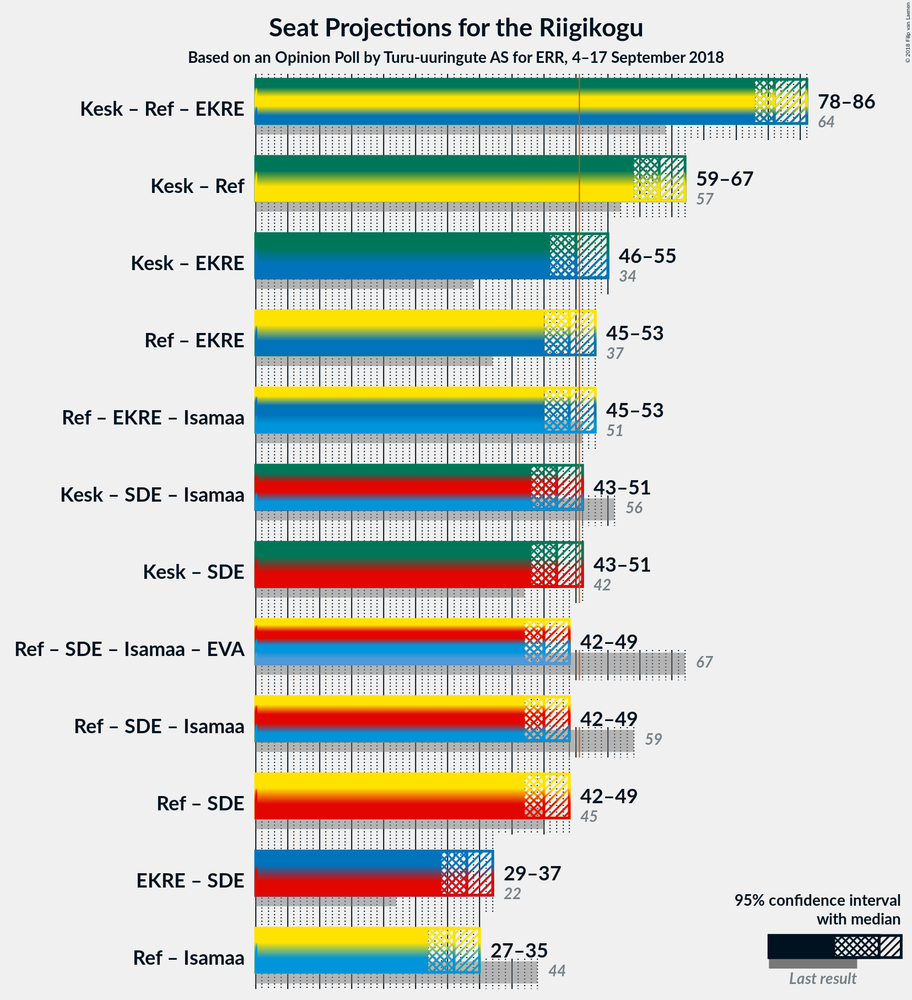

# Opinion Poll by Turu-uuringute AS for ERR, 4–17 September 2018

<a href="#voting-intentions">Voting Intentions</a> | <a href="#seats">Seats</a> | <a href="#coalitions">Coalitions</a> | <a href="#technical-information">Technical Information</a>

## Voting Intentions

### Confidence Intervals

| Party | Last Result | Poll Result | 80% Confidence Interval | 90% Confidence Interval | 95% Confidence Interval | 99% Confidence Interval |
|:-----:|:-----------:|:-----------:|:-----------------------:|:-----------------------:|:-----------------------:|:-----------------------:|
| Eesti Keskerakond | 24.8% | 28.0% | 26.2–29.9% |25.7–30.4% |25.3–30.9% |24.5–31.8% |
| Eesti Reformierakond | 27.7% | 27.0% | 25.3–28.9% |24.8–29.4% |24.3–29.8% |23.5–30.7% |
| Eesti Konservatiivne Rahvaerakond | 8.1% | 17.0% | 15.5–18.6% |15.2–19.1% |14.8–19.5% |14.1–20.3% |
| Sotsiaaldemokraatlik Erakond | 15.2% | 14.0% | 12.7–15.5% |12.3–15.9% |12.0–16.3% |11.4–17.0% |
| Erakond Isamaa | 13.7% | 3.0% | 2.4–3.8% |2.2–4.1% |2.1–4.3% |1.9–4.7% |
| Erakond Eestimaa Rohelised | 0.9% | 3.0% | 2.4–3.8% |2.2–4.1% |2.1–4.3% |1.9–4.7% |
| Eesti Vabaerakond | 8.7% | 2.0% | 1.5–2.7% |1.4–2.9% |1.3–3.1% |1.1–3.4% |

*Note:* The poll result column reflects the actual value used in the calculations. Published results may vary slightly, and in addition be rounded to fewer digits.

## Seats

### Confidence Intervals

| Party | Last Result | Median | 80% Confidence Interval | 90% Confidence Interval | 95% Confidence Interval | 99% Confidence Interval |
|:-----:|:-----------:|:------:|:-----------------------:|:-----------------------:|:-----------------------:|:-----------------------:|
| <a href="#eesti-keskerakond">Eesti Keskerakond</a> | 27 | 33 | 33 |32–34 |30–34 |29–35 |
| <a href="#eesti-reformierakond">Eesti Reformierakond</a> | 30 | 32 | 32 |31–32 |27–33 |26–34 |
| <a href="#eesti-konservatiivne-rahvaerakond">Eesti Konservatiivne Rahvaerakond</a> | 7 | 15 | 15 |15–19 |15–22 |15–22 |
| <a href="#sotsiaaldemokraatlik-erakond">Sotsiaaldemokraatlik Erakond</a> | 15 | 16 | 15–16 |13–16 |13–16 |13–19 |
| <a href="#erakond-isamaa">Erakond Isamaa</a> | 14 | 0 | 0 |0 |0 |0 |
| <a href="#erakond-eestimaa-rohelised">Erakond Eestimaa Rohelised</a> | 0 | 0 | 0 |0 |0 |0 |
| <a href="#eesti-vabaerakond">Eesti Vabaerakond</a> | 8 | 0 | 0 |0 |0 |0 |

### Eesti Keskerakond

*For a full overview of the results for this party, see the [Eesti Keskerakond](party-eestikeskerakond.html) page.*

| Number of Seats | Probability | Accumulated | Special Marks |
|:---------------:|:-----------:|:-----------:|:-------------:|
| 27 | 0.2% | 100% | Last Result |
| 28 | 0% | 99.8% |  |
| 29 | 1.2% | 99.8% |  |
| 30 | 1.5% | 98.6% |  |
| 31 | 1.1% | 97% |  |
| 32 | 5% | 96% |  |
| 33 | 85% | 91% | Median |
| 34 | 4% | 6% |  |
| 35 | 2% | 2% |  |
| 36 | 0.1% | 0.1% |  |
| 37 | 0% | 0% |  |

### Eesti Reformierakond

*For a full overview of the results for this party, see the [Eesti Reformierakond](party-eestireformierakond.html) page.*

| Number of Seats | Probability | Accumulated | Special Marks |
|:---------------:|:-----------:|:-----------:|:-------------:|
| 25 | 0.4% | 100% |  |
| 26 | 0.6% | 99.6% |  |
| 27 | 3% | 99.1% |  |
| 28 | 0.2% | 96% |  |
| 29 | 0% | 95% |  |
| 30 | 0.1% | 95% | Last Result |
| 31 | 3% | 95% |  |
| 32 | 90% | 92% | Median |
| 33 | 1.2% | 3% |  |
| 34 | 1.2% | 1.3% |  |
| 35 | 0.1% | 0.1% |  |
| 36 | 0% | 0% |  |

### Eesti Konservatiivne Rahvaerakond

*For a full overview of the results for this party, see the [Eesti Konservatiivne Rahvaerakond](party-eestikonservatiivnerahvaerakond.html) page.*

| Number of Seats | Probability | Accumulated | Special Marks |
|:---------------:|:-----------:|:-----------:|:-------------:|
| 7 | 0% | 100% | Last Result |
| 8 | 0% | 100% |  |
| 9 | 0% | 100% |  |
| 10 | 0% | 100% |  |
| 11 | 0% | 100% |  |
| 12 | 0% | 100% |  |
| 13 | 0% | 100% |  |
| 14 | 0.2% | 100% |  |
| 15 | 90% | 99.8% | Median |
| 16 | 1.4% | 9% |  |
| 17 | 0% | 8% |  |
| 18 | 2% | 8% |  |
| 19 | 2% | 6% |  |
| 20 | 0% | 4% |  |
| 21 | 0% | 4% |  |
| 22 | 4% | 4% |  |
| 23 | 0% | 0.1% |  |
| 24 | 0% | 0% |  |

### Sotsiaaldemokraatlik Erakond

*For a full overview of the results for this party, see the [Sotsiaaldemokraatlik Erakond](party-sotsiaaldemokraatlikerakond.html) page.*

| Number of Seats | Probability | Accumulated | Special Marks |
|:---------------:|:-----------:|:-----------:|:-------------:|
| 10 | 0.1% | 100% |  |
| 11 | 0% | 99.9% |  |
| 12 | 0% | 99.9% |  |
| 13 | 5% | 99.8% |  |
| 14 | 0.4% | 95% |  |
| 15 | 5% | 94% | Last Result |
| 16 | 88% | 90% | Median |
| 17 | 0% | 2% |  |
| 18 | 1.1% | 2% |  |
| 19 | 0.7% | 0.7% |  |
| 20 | 0% | 0% |  |

### Erakond Isamaa

*For a full overview of the results for this party, see the [Erakond Isamaa](party-erakondisamaa.html) page.*

| Number of Seats | Probability | Accumulated | Special Marks |
|:---------------:|:-----------:|:-----------:|:-------------:|
| 0 | 99.9% | 100% | Median |
| 1 | 0% | 0.1% |  |
| 2 | 0% | 0.1% |  |
| 3 | 0% | 0.1% |  |
| 4 | 0.1% | 0.1% |  |
| 5 | 0% | 0% |  |
| 6 | 0% | 0% |  |
| 7 | 0% | 0% |  |
| 8 | 0% | 0% |  |
| 9 | 0% | 0% |  |
| 10 | 0% | 0% |  |
| 11 | 0% | 0% |  |
| 12 | 0% | 0% |  |
| 13 | 0% | 0% |  |
| 14 | 0% | 0% | Last Result |

### Erakond Eestimaa Rohelised

*For a full overview of the results for this party, see the [Erakond Eestimaa Rohelised](party-erakondeestimaarohelised.html) page.*

| Number of Seats | Probability | Accumulated | Special Marks |
|:---------------:|:-----------:|:-----------:|:-------------:|
| 0 | 99.9% | 100% | Last Result, Median |
| 1 | 0% | 0.1% |  |
| 2 | 0% | 0.1% |  |
| 3 | 0% | 0.1% |  |
| 4 | 0% | 0.1% |  |
| 5 | 0% | 0% |  |

### Eesti Vabaerakond

*For a full overview of the results for this party, see the [Eesti Vabaerakond](party-eestivabaerakond.html) page.*

| Number of Seats | Probability | Accumulated | Special Marks |
|:---------------:|:-----------:|:-----------:|:-------------:|
| 0 | 100% | 100% | Median |
| 1 | 0% | 0% |  |
| 2 | 0% | 0% |  |
| 3 | 0% | 0% |  |
| 4 | 0% | 0% |  |
| 5 | 0% | 0% |  |
| 6 | 0% | 0% |  |
| 7 | 0% | 0% |  |
| 8 | 0% | 0% | Last Result |

## Coalitions

### Confidence Intervals

| Coalition | Last Result | Median | Majority? | 80% Confidence Interval | 90% Confidence Interval | 95% Confidence Interval | 99% Confidence Interval |
|:---------:|:-----------:|:------:|:---------:|:-----------------------:|:-----------------------:|:-----------------------:|:-----------------------:|
| Eesti Keskerakond – Eesti Reformierakond – Eesti Konservatiivne Rahvaerakond | 64 | 80 | 100% | 80 | 79–83 | 78–83 | 77–85 |
| Eesti Keskerakond – Eesti Reformierakond | 57 | 65 | 100% | 64–65 | 61–65 | 61–66 | 58–69 |
| Eesti Reformierakond – Eesti Konservatiivne Rahvaerakond – Erakond Isamaa | 51 | 47 | 2% | 47 | 47–49 | 47–50 | 44–51 |
| Eesti Keskerakond – Sotsiaaldemokraatlik Erakond – Erakond Isamaa | 56 | 49 | 2% | 47–49 | 47–49 | 46–49 | 45–52 |
| Eesti Reformierakond – Sotsiaaldemokraatlik Erakond – Erakond Isamaa – Eesti Vabaerakond | 67 | 48 | 0.2% | 47–48 | 45–48 | 40–49 | 40–50 |
| Eesti Reformierakond – Sotsiaaldemokraatlik Erakond – Erakond Isamaa | 59 | 48 | 0.2% | 47–48 | 45–48 | 40–49 | 40–50 |
| Eesti Reformierakond – Sotsiaaldemokraatlik Erakond | 45 | 48 | 0.2% | 47–48 | 45–48 | 40–49 | 40–50 |
| Eesti Reformierakond – Erakond Isamaa | 44 | 32 | 0% | 32 | 31–32 | 27–33 | 26–34 |

### Eesti Keskerakond – Eesti Reformierakond – Eesti Konservatiivne Rahvaerakond

| Number of Seats | Probability | Accumulated | Special Marks |
|:---------------:|:-----------:|:-----------:|:-------------:|
| 64 | 0% | 100% | Last Result |
| 65 | 0% | 100% |  |
| 66 | 0% | 100% |  |
| 67 | 0% | 100% |  |
| 68 | 0% | 100% |  |
| 69 | 0% | 100% |  |
| 70 | 0% | 100% |  |
| 71 | 0% | 100% |  |
| 72 | 0% | 100% |  |
| 73 | 0% | 100% |  |
| 74 | 0% | 100% |  |
| 75 | 0% | 100% |  |
| 76 | 0% | 100% |  |
| 77 | 2% | 99.9% |  |
| 78 | 1.3% | 98% |  |
| 79 | 5% | 97% |  |
| 80 | 84% | 92% | Median |
| 81 | 2% | 8% |  |
| 82 | 0.6% | 6% |  |
| 83 | 4% | 6% |  |
| 84 | 0% | 1.4% |  |
| 85 | 1.2% | 1.4% |  |
| 86 | 0.1% | 0.1% |  |
| 87 | 0.1% | 0.1% |  |
| 88 | 0% | 0% |  |

### Eesti Keskerakond – Eesti Reformierakond

| Number of Seats | Probability | Accumulated | Special Marks |
|:---------------:|:-----------:|:-----------:|:-------------:|
| 57 | 0.1% | 100% | Last Result |
| 58 | 0.5% | 99.9% |  |
| 59 | 0.3% | 99.4% |  |
| 60 | 1.3% | 99.2% |  |
| 61 | 4% | 98% |  |
| 62 | 3% | 94% |  |
| 63 | 0.1% | 91% |  |
| 64 | 5% | 91% |  |
| 65 | 84% | 86% | Median |
| 66 | 0.2% | 3% |  |
| 67 | 0.2% | 2% |  |
| 68 | 1.0% | 2% |  |
| 69 | 1.2% | 1.2% |  |
| 70 | 0% | 0% |  |

### Eesti Reformierakond – Eesti Konservatiivne Rahvaerakond – Erakond Isamaa

| Number of Seats | Probability | Accumulated | Special Marks |
|:---------------:|:-----------:|:-----------:|:-------------:|
| 43 | 0.1% | 100% |  |
| 44 | 0.5% | 99.9% |  |
| 45 | 0.3% | 99.5% |  |
| 46 | 1.1% | 99.2% |  |
| 47 | 88% | 98% | Median |
| 48 | 1.2% | 10% |  |
| 49 | 5% | 8% |  |
| 50 | 1.5% | 3% |  |
| 51 | 1.5% | 2% | Last Result, Majority |
| 52 | 0.1% | 0.2% |  |
| 53 | 0.1% | 0.1% |  |
| 54 | 0% | 0% |  |

### Eesti Keskerakond – Sotsiaaldemokraatlik Erakond – Erakond Isamaa

| Number of Seats | Probability | Accumulated | Special Marks |
|:---------------:|:-----------:|:-----------:|:-------------:|
| 43 | 0.1% | 100% |  |
| 44 | 0% | 99.9% |  |
| 45 | 1.3% | 99.8% |  |
| 46 | 2% | 98.5% |  |
| 47 | 9% | 97% |  |
| 48 | 0.9% | 88% |  |
| 49 | 85% | 87% | Median |
| 50 | 0.1% | 2% |  |
| 51 | 2% | 2% | Majority |
| 52 | 0.6% | 0.6% |  |
| 53 | 0% | 0% |  |
| 54 | 0% | 0% |  |
| 55 | 0% | 0% |  |
| 56 | 0% | 0% | Last Result |

### Eesti Reformierakond – Sotsiaaldemokraatlik Erakond – Erakond Isamaa – Eesti Vabaerakond

| Number of Seats | Probability | Accumulated | Special Marks |
|:---------------:|:-----------:|:-----------:|:-------------:|
| 39 | 0.2% | 100% |  |
| 40 | 3% | 99.8% |  |
| 41 | 0.1% | 96% |  |
| 42 | 0.4% | 96% |  |
| 43 | 0.1% | 96% |  |
| 44 | 0.5% | 96% |  |
| 45 | 0.5% | 95% |  |
| 46 | 1.1% | 95% |  |
| 47 | 6% | 94% |  |
| 48 | 85% | 88% | Median |
| 49 | 1.2% | 3% |  |
| 50 | 1.3% | 2% |  |
| 51 | 0% | 0.2% | Majority |
| 52 | 0.2% | 0.2% |  |
| 53 | 0% | 0% |  |
| 54 | 0% | 0% |  |
| 55 | 0% | 0% |  |
| 56 | 0% | 0% |  |
| 57 | 0% | 0% |  |
| 58 | 0% | 0% |  |
| 59 | 0% | 0% |  |
| 60 | 0% | 0% |  |
| 61 | 0% | 0% |  |
| 62 | 0% | 0% |  |
| 63 | 0% | 0% |  |
| 64 | 0% | 0% |  |
| 65 | 0% | 0% |  |
| 66 | 0% | 0% |  |
| 67 | 0% | 0% | Last Result |

### Eesti Reformierakond – Sotsiaaldemokraatlik Erakond – Erakond Isamaa

| Number of Seats | Probability | Accumulated | Special Marks |
|:---------------:|:-----------:|:-----------:|:-------------:|
| 39 | 0.2% | 100% |  |
| 40 | 3% | 99.8% |  |
| 41 | 0.1% | 96% |  |
| 42 | 0.4% | 96% |  |
| 43 | 0.1% | 96% |  |
| 44 | 0.5% | 96% |  |
| 45 | 0.5% | 95% |  |
| 46 | 1.1% | 95% |  |
| 47 | 6% | 94% |  |
| 48 | 85% | 88% | Median |
| 49 | 1.2% | 3% |  |
| 50 | 1.3% | 2% |  |
| 51 | 0% | 0.2% | Majority |
| 52 | 0.2% | 0.2% |  |
| 53 | 0% | 0% |  |
| 54 | 0% | 0% |  |
| 55 | 0% | 0% |  |
| 56 | 0% | 0% |  |
| 57 | 0% | 0% |  |
| 58 | 0% | 0% |  |
| 59 | 0% | 0% | Last Result |

### Eesti Reformierakond – Sotsiaaldemokraatlik Erakond

| Number of Seats | Probability | Accumulated | Special Marks |
|:---------------:|:-----------:|:-----------:|:-------------:|
| 39 | 0.2% | 100% |  |
| 40 | 3% | 99.8% |  |
| 41 | 0.1% | 96% |  |
| 42 | 0.4% | 96% |  |
| 43 | 0.1% | 96% |  |
| 44 | 0.5% | 96% |  |
| 45 | 0.5% | 95% | Last Result |
| 46 | 1.1% | 95% |  |
| 47 | 6% | 94% |  |
| 48 | 85% | 88% | Median |
| 49 | 1.1% | 3% |  |
| 50 | 1.3% | 2% |  |
| 51 | 0% | 0.2% | Majority |
| 52 | 0.2% | 0.2% |  |
| 53 | 0% | 0% |  |

### Eesti Reformierakond – Erakond Isamaa

| Number of Seats | Probability | Accumulated | Special Marks |
|:---------------:|:-----------:|:-----------:|:-------------:|
| 25 | 0.4% | 100% |  |
| 26 | 0.6% | 99.6% |  |
| 27 | 3% | 99.1% |  |
| 28 | 0.2% | 96% |  |
| 29 | 0% | 95% |  |
| 30 | 0.1% | 95% |  |
| 31 | 3% | 95% |  |
| 32 | 90% | 92% | Median |
| 33 | 1.2% | 3% |  |
| 34 | 1.3% | 1.4% |  |
| 35 | 0.1% | 0.1% |  |
| 36 | 0% | 0% |  |
| 37 | 0% | 0% |  |
| 38 | 0% | 0% |  |
| 39 | 0% | 0% |  |
| 40 | 0% | 0% |  |
| 41 | 0% | 0% |  |
| 42 | 0% | 0% |  |
| 43 | 0% | 0% |  |
| 44 | 0% | 0% | Last Result |

## Technical Information

### Opinion Poll

+ **Polling firm:** Turu-uuringute AS
+ **Commissioner(s):** ERR
+ **Fieldwork period:** 4–17 September 2018

### Calculations

+ **Sample size:** 1000
+ **Simulations done:** 1,024
+ **Error estimate:** 6.02%

