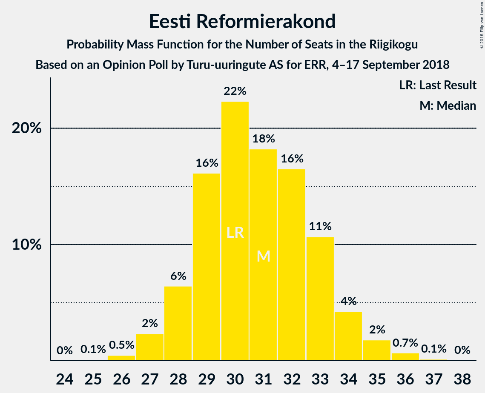
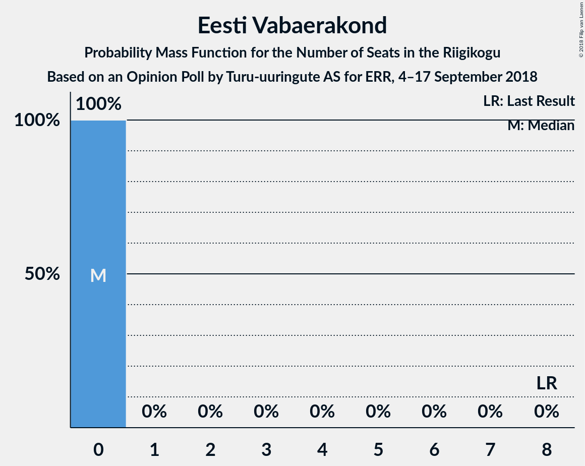

# Opinion Poll by Turu-uuringute AS for ERR, 4–17 September 2018

<a href="#voting-intentions">Voting Intentions</a> | <a href="#seats">Seats</a> | <a href="#coalitions">Coalitions</a> | <a href="#technical-information">Technical Information</a>

## Voting Intentions

### Confidence Intervals

| Party | Last Result | Poll Result | 80% Confidence Interval | 90% Confidence Interval | 95% Confidence Interval | 99% Confidence Interval |
|:-----:|:-----------:|:-----------:|:-----------------------:|:-----------------------:|:-----------------------:|:-----------------------:|
| Eesti Keskerakond | 24.8% | 28.0% | 26.2–29.9% |25.7–30.4% |25.3–30.9% |24.5–31.8% |
| Eesti Reformierakond | 27.7% | 27.0% | 25.3–28.9% |24.8–29.4% |24.3–29.8% |23.5–30.7% |
| Eesti Konservatiivne Rahvaerakond | 8.1% | 17.0% | 15.5–18.6% |15.2–19.1% |14.8–19.5% |14.1–20.3% |
| Sotsiaaldemokraatlik Erakond | 15.2% | 14.0% | 12.7–15.5% |12.3–15.9% |12.0–16.3% |11.4–17.0% |
| Erakond Isamaa | 13.7% | 3.0% | 2.4–3.8% |2.2–4.1% |2.1–4.3% |1.9–4.7% |
| Erakond Eestimaa Rohelised | 0.9% | 3.0% | 2.4–3.8% |2.2–4.1% |2.1–4.3% |1.9–4.7% |
| Eesti Vabaerakond | 8.7% | 2.0% | 1.5–2.7% |1.4–2.9% |1.3–3.1% |1.1–3.4% |

*Note:* The poll result column reflects the actual value used in the calculations. Published results may vary slightly, and in addition be rounded to fewer digits.

## Seats

### Confidence Intervals

| Party | Last Result | Median | 80% Confidence Interval | 90% Confidence Interval | 95% Confidence Interval | 99% Confidence Interval |
|:-----:|:-----------:|:------:|:-----------------------:|:-----------------------:|:-----------------------:|:-----------------------:|
| <a href="#eesti-keskerakond">Eesti Keskerakond</a> | 27 | 32 | 30–34 |29–35 |29–36 |28–37 |
| <a href="#eesti-reformierakond">Eesti Reformierakond</a> | 30 | 30 | 29–33 |28–34 |27–35 |26–36 |
| <a href="#eesti-konservatiivne-rahvaerakond">Eesti Konservatiivne Rahvaerakond</a> | 7 | 19 | 16–20 |16–21 |15–21 |15–22 |
| <a href="#sotsiaaldemokraatlik-erakond">Sotsiaaldemokraatlik Erakond</a> | 15 | 15 | 13–16 |13–17 |12–17 |11–18 |
| <a href="#erakond-isamaa">Erakond Isamaa</a> | 14 | 0 | 0 |0 |0 |0 |
| <a href="#erakond-eestimaa-rohelised">Erakond Eestimaa Rohelised</a> | 0 | 0 | 0 |0 |0 |0 |
| <a href="#eesti-vabaerakond">Eesti Vabaerakond</a> | 8 | 0 | 0 |0 |0 |0 |

### Eesti Keskerakond

*For a full overview of the results for this party, see the [Eesti Keskerakond](party-eestikeskerakond.html) page.*

| Number of Seats | Probability | Accumulated | Special Marks |
|:---------------:|:-----------:|:-----------:|:-------------:|
| 26 | 0.1% | 100% |  |
| 27 | 0.4% | 99.9% | Last Result |
| 28 | 2% | 99.5% |  |
| 29 | 6% | 98% |  |
| 30 | 11% | 92% |  |
| 31 | 13% | 81% |  |
| 32 | 25% | 68% | Median |
| 33 | 24% | 43% |  |
| 34 | 10% | 19% |  |
| 35 | 5% | 9% |  |
| 36 | 2% | 4% |  |
| 37 | 1.1% | 1.4% |  |
| 38 | 0.3% | 0.3% |  |
| 39 | 0% | 0.1% |  |
| 40 | 0% | 0% |  |

### Eesti Reformierakond

*For a full overview of the results for this party, see the [Eesti Reformierakond](party-eestireformierakond.html) page.*

| Number of Seats | Probability | Accumulated | Special Marks |
|:---------------:|:-----------:|:-----------:|:-------------:|
| 25 | 0.1% | 100% |  |
| 26 | 0.5% | 99.9% |  |
| 27 | 3% | 99.4% |  |
| 28 | 6% | 96% |  |
| 29 | 20% | 90% |  |
| 30 | 24% | 71% | Last Result, Median |
| 31 | 16% | 47% |  |
| 32 | 13% | 30% |  |
| 33 | 9% | 17% |  |
| 34 | 5% | 8% |  |
| 35 | 2% | 3% |  |
| 36 | 0.7% | 0.9% |  |
| 37 | 0.2% | 0.2% |  |
| 38 | 0% | 0% |  |

### Eesti Konservatiivne Rahvaerakond

*For a full overview of the results for this party, see the [Eesti Konservatiivne Rahvaerakond](party-eestikonservatiivnerahvaerakond.html) page.*

| Number of Seats | Probability | Accumulated | Special Marks |
|:---------------:|:-----------:|:-----------:|:-------------:|
| 7 | 0% | 100% | Last Result |
| 8 | 0% | 100% |  |
| 9 | 0% | 100% |  |
| 10 | 0% | 100% |  |
| 11 | 0% | 100% |  |
| 12 | 0% | 100% |  |
| 13 | 0% | 100% |  |
| 14 | 0.1% | 100% |  |
| 15 | 4% | 99.9% |  |
| 16 | 14% | 96% |  |
| 17 | 11% | 82% |  |
| 18 | 15% | 71% |  |
| 19 | 31% | 56% | Median |
| 20 | 19% | 25% |  |
| 21 | 4% | 5% |  |
| 22 | 1.3% | 2% |  |
| 23 | 0.2% | 0.3% |  |
| 24 | 0.1% | 0.1% |  |
| 25 | 0% | 0% |  |

### Sotsiaaldemokraatlik Erakond

*For a full overview of the results for this party, see the [Sotsiaaldemokraatlik Erakond](party-sotsiaaldemokraatlikerakond.html) page.*

| Number of Seats | Probability | Accumulated | Special Marks |
|:---------------:|:-----------:|:-----------:|:-------------:|
| 10 | 0.1% | 100% |  |
| 11 | 0.6% | 99.9% |  |
| 12 | 2% | 99.4% |  |
| 13 | 12% | 97% |  |
| 14 | 33% | 85% |  |
| 15 | 29% | 52% | Last Result, Median |
| 16 | 13% | 22% |  |
| 17 | 7% | 9% |  |
| 18 | 1.5% | 2% |  |
| 19 | 0.3% | 0.3% |  |
| 20 | 0% | 0% |  |

### Erakond Isamaa

*For a full overview of the results for this party, see the [Erakond Isamaa](party-erakondisamaa.html) page.*

| Number of Seats | Probability | Accumulated | Special Marks |
|:---------------:|:-----------:|:-----------:|:-------------:|
| 0 | 99.9% | 100% | Median |
| 1 | 0% | 0.1% |  |
| 2 | 0% | 0.1% |  |
| 3 | 0% | 0.1% |  |
| 4 | 0.1% | 0.1% |  |
| 5 | 0% | 0% |  |
| 6 | 0% | 0% |  |
| 7 | 0% | 0% |  |
| 8 | 0% | 0% |  |
| 9 | 0% | 0% |  |
| 10 | 0% | 0% |  |
| 11 | 0% | 0% |  |
| 12 | 0% | 0% |  |
| 13 | 0% | 0% |  |
| 14 | 0% | 0% | Last Result |

### Erakond Eestimaa Rohelised

*For a full overview of the results for this party, see the [Erakond Eestimaa Rohelised](party-erakondeestimaarohelised.html) page.*

| Number of Seats | Probability | Accumulated | Special Marks |
|:---------------:|:-----------:|:-----------:|:-------------:|
| 0 | 99.9% | 100% | Last Result, Median |
| 1 | 0% | 0.1% |  |
| 2 | 0% | 0.1% |  |
| 3 | 0% | 0.1% |  |
| 4 | 0.1% | 0.1% |  |
| 5 | 0% | 0% |  |

### Eesti Vabaerakond

*For a full overview of the results for this party, see the [Eesti Vabaerakond](party-eestivabaerakond.html) page.*

| Number of Seats | Probability | Accumulated | Special Marks |
|:---------------:|:-----------:|:-----------:|:-------------:|
| 0 | 100% | 100% | Median |
| 1 | 0% | 0% |  |
| 2 | 0% | 0% |  |
| 3 | 0% | 0% |  |
| 4 | 0% | 0% |  |
| 5 | 0% | 0% |  |
| 6 | 0% | 0% |  |
| 7 | 0% | 0% |  |
| 8 | 0% | 0% | Last Result |

## Coalitions

### Confidence Intervals

| Coalition | Last Result | Median | Majority? | 80% Confidence Interval | 90% Confidence Interval | 95% Confidence Interval | 99% Confidence Interval |
|:---------:|:-----------:|:------:|:---------:|:-----------------------:|:-----------------------:|:-----------------------:|:-----------------------:|
| Eesti Keskerakond – Eesti Reformierakond – Eesti Konservatiivne Rahvaerakond | 64 | 81 | 100% | 79–83 | 78–85 | 78–86 | 77–88 |
| Eesti Keskerakond – Eesti Reformierakond | 57 | 63 | 100% | 60–66 | 59–67 | 59–68 | 58–69 |
| Eesti Keskerakond – Eesti Konservatiivne Rahvaerakond | 34 | 51 | 50% | 48–53 | 47–54 | 46–55 | 45–56 |
| Eesti Reformierakond – Eesti Konservatiivne Rahvaerakond | 37 | 49 | 21% | 47–52 | 46–53 | 46–54 | 44–55 |
| Eesti Reformierakond – Eesti Konservatiivne Rahvaerakond – Erakond Isamaa | 51 | 49 | 21% | 47–52 | 46–53 | 46–54 | 44–55 |
| Eesti Keskerakond – Sotsiaaldemokraatlik Erakond – Erakond Isamaa | 56 | 47 | 3% | 44–49 | 43–50 | 42–51 | 42–52 |
| Eesti Keskerakond – Sotsiaaldemokraatlik Erakond | 42 | 47 | 3% | 44–49 | 43–50 | 42–51 | 42–52 |
| Eesti Reformierakond – Sotsiaaldemokraatlik Erakond – Erakond Isamaa – Eesti Vabaerakond | 67 | 45 | 0.9% | 43–48 | 42–49 | 42–50 | 41–51 |
| Eesti Reformierakond – Sotsiaaldemokraatlik Erakond – Erakond Isamaa | 59 | 45 | 0.9% | 43–48 | 42–49 | 42–50 | 41–51 |
| Eesti Reformierakond – Sotsiaaldemokraatlik Erakond | 45 | 45 | 0.8% | 43–48 | 42–49 | 42–50 | 41–51 |
| Eesti Konservatiivne Rahvaerakond – Sotsiaaldemokraatlik Erakond | 22 | 33 | 0% | 31–35 | 30–36 | 29–37 | 28–38 |
| Eesti Reformierakond – Erakond Isamaa | 44 | 30 | 0% | 29–33 | 28–34 | 27–35 | 26–36 |

### Eesti Keskerakond – Eesti Reformierakond – Eesti Konservatiivne Rahvaerakond

| Number of Seats | Probability | Accumulated | Special Marks |
|:---------------:|:-----------:|:-----------:|:-------------:|
| 64 | 0% | 100% | Last Result |
| 65 | 0% | 100% |  |
| 66 | 0% | 100% |  |
| 67 | 0% | 100% |  |
| 68 | 0% | 100% |  |
| 69 | 0% | 100% |  |
| 70 | 0% | 100% |  |
| 71 | 0% | 100% |  |
| 72 | 0% | 100% |  |
| 73 | 0% | 100% |  |
| 74 | 0% | 100% |  |
| 75 | 0% | 100% |  |
| 76 | 0.3% | 100% |  |
| 77 | 1.2% | 99.7% |  |
| 78 | 5% | 98.5% |  |
| 79 | 9% | 93% |  |
| 80 | 22% | 84% |  |
| 81 | 25% | 62% | Median |
| 82 | 21% | 36% |  |
| 83 | 7% | 16% |  |
| 84 | 2% | 9% |  |
| 85 | 3% | 7% |  |
| 86 | 3% | 4% |  |
| 87 | 0.9% | 2% |  |
| 88 | 0.7% | 0.8% |  |
| 89 | 0.1% | 0.1% |  |
| 90 | 0% | 0% |  |

### Eesti Keskerakond – Eesti Reformierakond

| Number of Seats | Probability | Accumulated | Special Marks |
|:---------------:|:-----------:|:-----------:|:-------------:|
| 56 | 0% | 100% |  |
| 57 | 0.2% | 99.9% | Last Result |
| 58 | 1.5% | 99.7% |  |
| 59 | 4% | 98% |  |
| 60 | 5% | 94% |  |
| 61 | 18% | 90% |  |
| 62 | 20% | 71% | Median |
| 63 | 19% | 51% |  |
| 64 | 13% | 32% |  |
| 65 | 8% | 19% |  |
| 66 | 5% | 11% |  |
| 67 | 3% | 6% |  |
| 68 | 2% | 3% |  |
| 69 | 0.5% | 0.9% |  |
| 70 | 0.3% | 0.4% |  |
| 71 | 0.1% | 0.1% |  |
| 72 | 0% | 0% |  |

### Eesti Keskerakond – Eesti Konservatiivne Rahvaerakond

| Number of Seats | Probability | Accumulated | Special Marks |
|:---------------:|:-----------:|:-----------:|:-------------:|
| 34 | 0% | 100% | Last Result |
| 35 | 0% | 100% |  |
| 36 | 0% | 100% |  |
| 37 | 0% | 100% |  |
| 38 | 0% | 100% |  |
| 39 | 0% | 100% |  |
| 40 | 0% | 100% |  |
| 41 | 0% | 100% |  |
| 42 | 0% | 100% |  |
| 43 | 0% | 100% |  |
| 44 | 0.2% | 100% |  |
| 45 | 0.4% | 99.8% |  |
| 46 | 2% | 99.4% |  |
| 47 | 4% | 97% |  |
| 48 | 12% | 94% |  |
| 49 | 14% | 81% |  |
| 50 | 18% | 68% |  |
| 51 | 15% | 50% | Median, Majority |
| 52 | 21% | 35% |  |
| 53 | 6% | 14% |  |
| 54 | 5% | 8% |  |
| 55 | 2% | 3% |  |
| 56 | 0.4% | 0.7% |  |
| 57 | 0.1% | 0.3% |  |
| 58 | 0.1% | 0.2% |  |
| 59 | 0% | 0% |  |

### Eesti Reformierakond – Eesti Konservatiivne Rahvaerakond

| Number of Seats | Probability | Accumulated | Special Marks |
|:---------------:|:-----------:|:-----------:|:-------------:|
| 37 | 0% | 100% | Last Result |
| 38 | 0% | 100% |  |
| 39 | 0% | 100% |  |
| 40 | 0% | 100% |  |
| 41 | 0% | 100% |  |
| 42 | 0% | 100% |  |
| 43 | 0.1% | 100% |  |
| 44 | 0.6% | 99.8% |  |
| 45 | 2% | 99.2% |  |
| 46 | 7% | 98% |  |
| 47 | 13% | 90% |  |
| 48 | 21% | 77% |  |
| 49 | 24% | 57% | Median |
| 50 | 12% | 33% |  |
| 51 | 7% | 21% | Majority |
| 52 | 7% | 14% |  |
| 53 | 4% | 7% |  |
| 54 | 1.2% | 3% |  |
| 55 | 1.1% | 1.4% |  |
| 56 | 0.2% | 0.3% |  |
| 57 | 0.1% | 0.1% |  |
| 58 | 0% | 0% |  |

### Eesti Reformierakond – Eesti Konservatiivne Rahvaerakond – Erakond Isamaa

| Number of Seats | Probability | Accumulated | Special Marks |
|:---------------:|:-----------:|:-----------:|:-------------:|
| 43 | 0.1% | 100% |  |
| 44 | 0.6% | 99.8% |  |
| 45 | 2% | 99.3% |  |
| 46 | 7% | 98% |  |
| 47 | 13% | 90% |  |
| 48 | 21% | 78% |  |
| 49 | 24% | 57% | Median |
| 50 | 12% | 33% |  |
| 51 | 7% | 21% | Last Result, Majority |
| 52 | 7% | 14% |  |
| 53 | 4% | 7% |  |
| 54 | 1.2% | 3% |  |
| 55 | 1.1% | 1.4% |  |
| 56 | 0.2% | 0.3% |  |
| 57 | 0.1% | 0.1% |  |
| 58 | 0% | 0% |  |

### Eesti Keskerakond – Sotsiaaldemokraatlik Erakond – Erakond Isamaa

| Number of Seats | Probability | Accumulated | Special Marks |
|:---------------:|:-----------:|:-----------:|:-------------:|
| 41 | 0.4% | 100% |  |
| 42 | 2% | 99.5% |  |
| 43 | 4% | 97% |  |
| 44 | 6% | 93% |  |
| 45 | 8% | 87% |  |
| 46 | 22% | 79% |  |
| 47 | 25% | 57% | Median |
| 48 | 11% | 33% |  |
| 49 | 14% | 22% |  |
| 50 | 4% | 8% |  |
| 51 | 2% | 3% | Majority |
| 52 | 0.9% | 1.3% |  |
| 53 | 0.3% | 0.4% |  |
| 54 | 0.1% | 0.1% |  |
| 55 | 0% | 0% |  |
| 56 | 0% | 0% | Last Result |

### Eesti Keskerakond – Sotsiaaldemokraatlik Erakond

| Number of Seats | Probability | Accumulated | Special Marks |
|:---------------:|:-----------:|:-----------:|:-------------:|
| 41 | 0.4% | 100% |  |
| 42 | 2% | 99.5% | Last Result |
| 43 | 4% | 97% |  |
| 44 | 6% | 93% |  |
| 45 | 8% | 87% |  |
| 46 | 22% | 79% |  |
| 47 | 25% | 57% | Median |
| 48 | 11% | 32% |  |
| 49 | 14% | 21% |  |
| 50 | 4% | 8% |  |
| 51 | 2% | 3% | Majority |
| 52 | 0.9% | 1.3% |  |
| 53 | 0.3% | 0.4% |  |
| 54 | 0.1% | 0.1% |  |
| 55 | 0% | 0% |  |

### Eesti Reformierakond – Sotsiaaldemokraatlik Erakond – Erakond Isamaa – Eesti Vabaerakond

| Number of Seats | Probability | Accumulated | Special Marks |
|:---------------:|:-----------:|:-----------:|:-------------:|
| 39 | 0.1% | 100% |  |
| 40 | 0.3% | 99.9% |  |
| 41 | 2% | 99.6% |  |
| 42 | 5% | 98% |  |
| 43 | 14% | 92% |  |
| 44 | 19% | 79% |  |
| 45 | 10% | 60% | Median |
| 46 | 23% | 49% |  |
| 47 | 10% | 26% |  |
| 48 | 9% | 16% |  |
| 49 | 5% | 7% |  |
| 50 | 2% | 3% |  |
| 51 | 0.4% | 0.9% | Majority |
| 52 | 0.3% | 0.4% |  |
| 53 | 0.1% | 0.1% |  |
| 54 | 0% | 0% |  |
| 55 | 0% | 0% |  |
| 56 | 0% | 0% |  |
| 57 | 0% | 0% |  |
| 58 | 0% | 0% |  |
| 59 | 0% | 0% |  |
| 60 | 0% | 0% |  |
| 61 | 0% | 0% |  |
| 62 | 0% | 0% |  |
| 63 | 0% | 0% |  |
| 64 | 0% | 0% |  |
| 65 | 0% | 0% |  |
| 66 | 0% | 0% |  |
| 67 | 0% | 0% | Last Result |

### Eesti Reformierakond – Sotsiaaldemokraatlik Erakond – Erakond Isamaa

| Number of Seats | Probability | Accumulated | Special Marks |
|:---------------:|:-----------:|:-----------:|:-------------:|
| 39 | 0.1% | 100% |  |
| 40 | 0.3% | 99.9% |  |
| 41 | 2% | 99.6% |  |
| 42 | 5% | 98% |  |
| 43 | 14% | 92% |  |
| 44 | 19% | 79% |  |
| 45 | 10% | 60% | Median |
| 46 | 23% | 49% |  |
| 47 | 10% | 26% |  |
| 48 | 9% | 16% |  |
| 49 | 5% | 7% |  |
| 50 | 2% | 3% |  |
| 51 | 0.4% | 0.9% | Majority |
| 52 | 0.3% | 0.4% |  |
| 53 | 0.1% | 0.1% |  |
| 54 | 0% | 0% |  |
| 55 | 0% | 0% |  |
| 56 | 0% | 0% |  |
| 57 | 0% | 0% |  |
| 58 | 0% | 0% |  |
| 59 | 0% | 0% | Last Result |

### Eesti Reformierakond – Sotsiaaldemokraatlik Erakond

| Number of Seats | Probability | Accumulated | Special Marks |
|:---------------:|:-----------:|:-----------:|:-------------:|
| 39 | 0.1% | 100% |  |
| 40 | 0.3% | 99.9% |  |
| 41 | 2% | 99.6% |  |
| 42 | 5% | 98% |  |
| 43 | 14% | 92% |  |
| 44 | 19% | 79% |  |
| 45 | 10% | 60% | Last Result, Median |
| 46 | 23% | 49% |  |
| 47 | 10% | 26% |  |
| 48 | 9% | 16% |  |
| 49 | 5% | 7% |  |
| 50 | 2% | 3% |  |
| 51 | 0.4% | 0.8% | Majority |
| 52 | 0.3% | 0.4% |  |
| 53 | 0.1% | 0.1% |  |
| 54 | 0% | 0% |  |

### Eesti Konservatiivne Rahvaerakond – Sotsiaaldemokraatlik Erakond

| Number of Seats | Probability | Accumulated | Special Marks |
|:---------------:|:-----------:|:-----------:|:-------------:|
| 22 | 0% | 100% | Last Result |
| 23 | 0% | 100% |  |
| 24 | 0% | 100% |  |
| 25 | 0% | 100% |  |
| 26 | 0% | 100% |  |
| 27 | 0.1% | 100% |  |
| 28 | 0.4% | 99.9% |  |
| 29 | 3% | 99.5% |  |
| 30 | 5% | 97% |  |
| 31 | 9% | 91% |  |
| 32 | 18% | 82% |  |
| 33 | 25% | 64% |  |
| 34 | 22% | 39% | Median |
| 35 | 8% | 17% |  |
| 36 | 5% | 9% |  |
| 37 | 2% | 3% |  |
| 38 | 0.9% | 1.1% |  |
| 39 | 0.1% | 0.2% |  |
| 40 | 0% | 0% |  |

### Eesti Reformierakond – Erakond Isamaa

| Number of Seats | Probability | Accumulated | Special Marks |
|:---------------:|:-----------:|:-----------:|:-------------:|
| 25 | 0.1% | 100% |  |
| 26 | 0.5% | 99.9% |  |
| 27 | 3% | 99.4% |  |
| 28 | 6% | 96% |  |
| 29 | 20% | 90% |  |
| 30 | 24% | 71% | Median |
| 31 | 16% | 47% |  |
| 32 | 13% | 30% |  |
| 33 | 9% | 17% |  |
| 34 | 5% | 8% |  |
| 35 | 2% | 3% |  |
| 36 | 0.7% | 0.9% |  |
| 37 | 0.2% | 0.3% |  |
| 38 | 0% | 0% |  |
| 39 | 0% | 0% |  |
| 40 | 0% | 0% |  |
| 41 | 0% | 0% |  |
| 42 | 0% | 0% |  |
| 43 | 0% | 0% |  |
| 44 | 0% | 0% | Last Result |

## Technical Information

### Opinion Poll

+ **Polling firm:** Turu-uuringute AS
+ **Commissioner(s):** ERR
+ **Fieldwork period:** 4–17 September 2018

### Calculations

+ **Sample size:** 1000
+ **Simulations done:** 131,072
+ **Error estimate:** 1.33%

