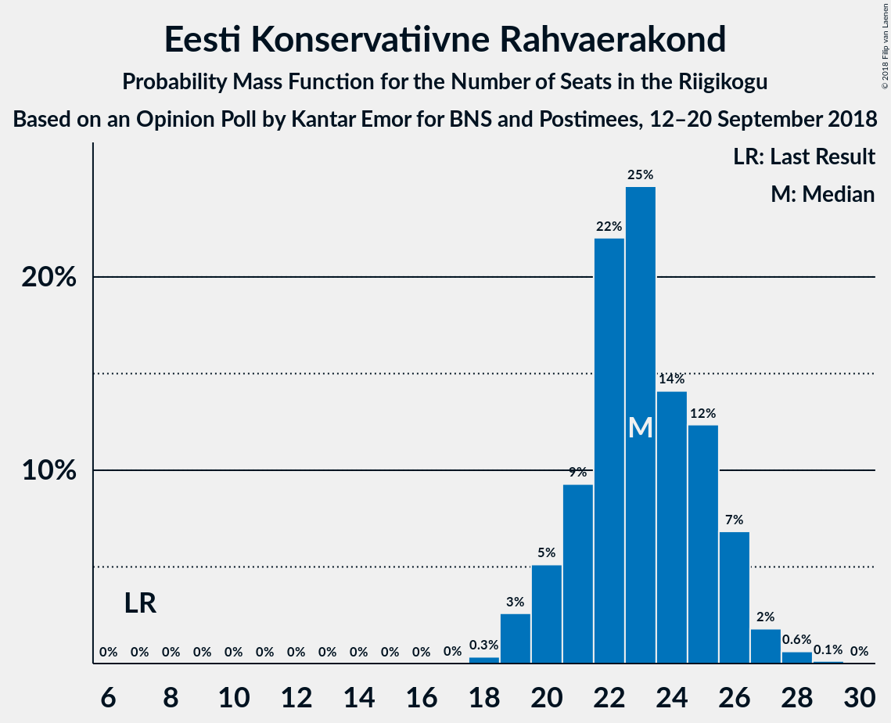

# Opinion Poll by Kantar Emor for BNS and Postimees, 12–20 September 2018

<a href="#voting-intentions">Voting Intentions</a> | <a href="#seats">Seats</a> | <a href="#coalitions">Coalitions</a> | <a href="#technical-information">Technical Information</a>

## Voting Intentions

### Confidence Intervals

| Party | Last Result | Poll Result | 80% Confidence Interval | 90% Confidence Interval | 95% Confidence Interval | 99% Confidence Interval |
|:-----:|:-----------:|:-----------:|:-----------------------:|:-----------------------:|:-----------------------:|:-----------------------:|
| Eesti Reformierakond | 27.7% | 26.7% | 25.0–28.6% |24.5–29.1% |24.0–29.6% |23.2–30.5% |
| Eesti Keskerakond | 24.8% | 24.6% | 22.8–26.4% |22.4–26.9% |22.0–27.4% |21.2–28.3% |
| Eesti Konservatiivne Rahvaerakond | 8.1% | 19.9% | 18.4–21.7% |17.9–22.1% |17.5–22.6% |16.8–23.4% |
| Sotsiaaldemokraatlik Erakond | 15.2% | 12.5% | 11.3–14.0% |10.9–14.4% |10.6–14.8% |10.0–15.5% |
| Erakond Isamaa | 13.7% | 4.9% | 4.1–5.9% |3.9–6.2% |3.7–6.5% |3.4–7.0% |
| Eesti 200 | 0.0% | 4.1% | 3.4–5.1% |3.2–5.3% |3.0–5.6% |2.7–6.0% |
| Eesti Vabaerakond | 8.7% | 3.4% | 2.7–4.3% |2.6–4.5% |2.4–4.7% |2.1–5.2% |
| Erakond Eestimaa Rohelised | 0.9% | 3.2% | 2.6–4.0% |2.4–4.3% |2.3–4.5% |2.0–4.9% |

*Note:* The poll result column reflects the actual value used in the calculations. Published results may vary slightly, and in addition be rounded to fewer digits.

## Seats

### Confidence Intervals

| Party | Last Result | Median | 80% Confidence Interval | 90% Confidence Interval | 95% Confidence Interval | 99% Confidence Interval |
|:-----:|:-----------:|:------:|:-----------------------:|:-----------------------:|:-----------------------:|:-----------------------:|
| <a href="#eesti-reformierakond">Eesti Reformierakond</a> | 30 | 31 | 30–35 |29–35 |28–36 |27–38 |
| <a href="#eesti-keskerakond">Eesti Keskerakond</a> | 27 | 29 | 27–31 |26–32 |26–34 |24–34 |
| <a href="#eesti-konservatiivne-rahvaerakond">Eesti Konservatiivne Rahvaerakond</a> | 7 | 23 | 22–26 |20–26 |20–26 |19–27 |
| <a href="#sotsiaaldemokraatlik-erakond">Sotsiaaldemokraatlik Erakond</a> | 15 | 13 | 12–15 |11–16 |11–16 |10–17 |
| <a href="#erakond-isamaa">Erakond Isamaa</a> | 14 | 0 | 0–5 |0–6 |0–6 |0–7 |
| <a href="#eesti-200">Eesti 200</a> | 0 | 0 | 0 |0–5 |0–5 |0–5 |
| <a href="#eesti-vabaerakond">Eesti Vabaerakond</a> | 8 | 0 | 0 |0 |0 |0 |
| <a href="#erakond-eestimaa-rohelised">Erakond Eestimaa Rohelised</a> | 0 | 0 | 0 |0 |0 |0–4 |

### Eesti Reformierakond

*For a full overview of the results for this party, see the [Eesti Reformierakond](party-eestireformierakond.html) page.*

| Number of Seats | Probability | Accumulated | Special Marks |
|:---------------:|:-----------:|:-----------:|:-------------:|
| 25 | 0.1% | 100% |  |
| 26 | 0.1% | 99.9% |  |
| 27 | 0.4% | 99.7% |  |
| 28 | 2% | 99.4% |  |
| 29 | 3% | 97% |  |
| 30 | 11% | 95% | Last Result |
| 31 | 35% | 84% | Median |
| 32 | 4% | 49% |  |
| 33 | 16% | 45% |  |
| 34 | 3% | 29% |  |
| 35 | 22% | 26% |  |
| 36 | 3% | 4% |  |
| 37 | 1.0% | 2% |  |
| 38 | 0.1% | 0.5% |  |
| 39 | 0.4% | 0.4% |  |
| 40 | 0% | 0% |  |

### Eesti Keskerakond

*For a full overview of the results for this party, see the [Eesti Keskerakond](party-eestikeskerakond.html) page.*

| Number of Seats | Probability | Accumulated | Special Marks |
|:---------------:|:-----------:|:-----------:|:-------------:|
| 23 | 0.1% | 100% |  |
| 24 | 0.4% | 99.9% |  |
| 25 | 1.4% | 99.4% |  |
| 26 | 3% | 98% |  |
| 27 | 8% | 95% | Last Result |
| 28 | 13% | 87% |  |
| 29 | 34% | 74% | Median |
| 30 | 18% | 39% |  |
| 31 | 11% | 21% |  |
| 32 | 6% | 9% |  |
| 33 | 0.8% | 4% |  |
| 34 | 3% | 3% |  |
| 35 | 0.1% | 0.2% |  |
| 36 | 0% | 0% |  |

### Eesti Konservatiivne Rahvaerakond

*For a full overview of the results for this party, see the [Eesti Konservatiivne Rahvaerakond](party-eestikonservatiivnerahvaerakond.html) page.*

| Number of Seats | Probability | Accumulated | Special Marks |
|:---------------:|:-----------:|:-----------:|:-------------:|
| 7 | 0% | 100% | Last Result |
| 8 | 0% | 100% |  |
| 9 | 0% | 100% |  |
| 10 | 0% | 100% |  |
| 11 | 0% | 100% |  |
| 12 | 0% | 100% |  |
| 13 | 0% | 100% |  |
| 14 | 0% | 100% |  |
| 15 | 0% | 100% |  |
| 16 | 0% | 100% |  |
| 17 | 0% | 100% |  |
| 18 | 0.2% | 100% |  |
| 19 | 0.9% | 99.7% |  |
| 20 | 4% | 98.8% |  |
| 21 | 3% | 94% |  |
| 22 | 30% | 91% |  |
| 23 | 37% | 61% | Median |
| 24 | 7% | 25% |  |
| 25 | 7% | 18% |  |
| 26 | 9% | 11% |  |
| 27 | 1.1% | 2% |  |
| 28 | 0.2% | 0.4% |  |
| 29 | 0.2% | 0.2% |  |
| 30 | 0% | 0% |  |

### Sotsiaaldemokraatlik Erakond

*For a full overview of the results for this party, see the [Sotsiaaldemokraatlik Erakond](party-sotsiaaldemokraatlikerakond.html) page.*

| Number of Seats | Probability | Accumulated | Special Marks |
|:---------------:|:-----------:|:-----------:|:-------------:|
| 10 | 0.6% | 100% |  |
| 11 | 6% | 99.4% |  |
| 12 | 11% | 94% |  |
| 13 | 45% | 82% | Median |
| 14 | 25% | 38% |  |
| 15 | 6% | 12% | Last Result |
| 16 | 4% | 6% |  |
| 17 | 2% | 2% |  |
| 18 | 0.2% | 0.2% |  |
| 19 | 0% | 0% |  |

### Erakond Isamaa

*For a full overview of the results for this party, see the [Erakond Isamaa](party-erakondisamaa.html) page.*

| Number of Seats | Probability | Accumulated | Special Marks |
|:---------------:|:-----------:|:-----------:|:-------------:|
| 0 | 50% | 100% | Median |
| 1 | 0% | 50% |  |
| 2 | 0% | 50% |  |
| 3 | 0% | 50% |  |
| 4 | 0.1% | 50% |  |
| 5 | 44% | 50% |  |
| 6 | 5% | 6% |  |
| 7 | 0.5% | 0.6% |  |
| 8 | 0% | 0% |  |
| 9 | 0% | 0% |  |
| 10 | 0% | 0% |  |
| 11 | 0% | 0% |  |
| 12 | 0% | 0% |  |
| 13 | 0% | 0% |  |
| 14 | 0% | 0% | Last Result |

### Eesti 200

*For a full overview of the results for this party, see the [Eesti 200](party-eesti200.html) page.*

| Number of Seats | Probability | Accumulated | Special Marks |
|:---------------:|:-----------:|:-----------:|:-------------:|
| 0 | 91% | 100% | Last Result, Median |
| 1 | 0% | 9% |  |
| 2 | 0% | 9% |  |
| 3 | 0% | 9% |  |
| 4 | 0.4% | 9% |  |
| 5 | 8% | 9% |  |
| 6 | 0.3% | 0.3% |  |
| 7 | 0% | 0% |  |

### Eesti Vabaerakond

*For a full overview of the results for this party, see the [Eesti Vabaerakond](party-eestivabaerakond.html) page.*

| Number of Seats | Probability | Accumulated | Special Marks |
|:---------------:|:-----------:|:-----------:|:-------------:|
| 0 | 99.5% | 100% | Median |
| 1 | 0% | 0.5% |  |
| 2 | 0% | 0.5% |  |
| 3 | 0% | 0.5% |  |
| 4 | 0.1% | 0.5% |  |
| 5 | 0.3% | 0.4% |  |
| 6 | 0.1% | 0.1% |  |
| 7 | 0% | 0% |  |
| 8 | 0% | 0% | Last Result |

### Erakond Eestimaa Rohelised

*For a full overview of the results for this party, see the [Erakond Eestimaa Rohelised](party-erakondeestimaarohelised.html) page.*

| Number of Seats | Probability | Accumulated | Special Marks |
|:---------------:|:-----------:|:-----------:|:-------------:|
| 0 | 99.5% | 100% | Last Result, Median |
| 1 | 0% | 0.5% |  |
| 2 | 0% | 0.5% |  |
| 3 | 0% | 0.5% |  |
| 4 | 0% | 0.5% |  |
| 5 | 0.5% | 0.5% |  |
| 6 | 0% | 0% |  |

## Coalitions

### Confidence Intervals

| Coalition | Last Result | Median | Majority? | 80% Confidence Interval | 90% Confidence Interval | 95% Confidence Interval | 99% Confidence Interval |
|:---------:|:-----------:|:------:|:---------:|:-----------------------:|:-----------------------:|:-----------------------:|:-----------------------:|
| Eesti Reformierakond – Eesti Keskerakond – Eesti Konservatiivne Rahvaerakond | 64 | 83 | 100% | 82–88 | 81–89 | 80–90 | 77–90 |
| Eesti Reformierakond – Eesti Keskerakond | 57 | 60 | 100% | 58–66 | 58–66 | 57–66 | 55–68 |
| Eesti Reformierakond – Eesti Konservatiivne Rahvaerakond – Erakond Isamaa | 51 | 58 | 99.8% | 55–61 | 54–61 | 54–62 | 52–63 |
| Eesti Reformierakond – Eesti Konservatiivne Rahvaerakond | 37 | 55 | 98% | 53–58 | 52–59 | 51–60 | 49–62 |
| Eesti Keskerakond – Eesti Konservatiivne Rahvaerakond | 34 | 52 | 84% | 49–56 | 48–57 | 48–58 | 46–58 |
| Eesti Reformierakond – Sotsiaaldemokraatlik Erakond – Erakond Isamaa – Eesti Vabaerakond | 67 | 49 | 9% | 45–50 | 44–52 | 43–53 | 41–55 |
| Eesti Reformierakond – Sotsiaaldemokraatlik Erakond – Erakond Isamaa | 59 | 49 | 9% | 45–50 | 44–52 | 43–53 | 41–55 |
| Eesti Reformierakond – Sotsiaaldemokraatlik Erakond | 45 | 44 | 2% | 43–49 | 42–49 | 42–50 | 40–51 |
| Eesti Keskerakond – Sotsiaaldemokraatlik Erakond – Erakond Isamaa | 56 | 45 | 1.4% | 42–47 | 41–48 | 40–50 | 39–51 |
| Eesti Keskerakond – Sotsiaaldemokraatlik Erakond | 42 | 42 | 0% | 40–45 | 40–46 | 39–47 | 38–49 |
| Eesti Konservatiivne Rahvaerakond – Sotsiaaldemokraatlik Erakond | 22 | 36 | 0% | 35–39 | 34–40 | 33–41 | 31–41 |
| Eesti Reformierakond – Erakond Isamaa | 44 | 35 | 0% | 32–36 | 30–38 | 30–39 | 28–41 |

### Eesti Reformierakond – Eesti Keskerakond – Eesti Konservatiivne Rahvaerakond

| Number of Seats | Probability | Accumulated | Special Marks |
|:---------------:|:-----------:|:-----------:|:-------------:|
| 64 | 0% | 100% | Last Result |
| 65 | 0% | 100% |  |
| 66 | 0% | 100% |  |
| 67 | 0% | 100% |  |
| 68 | 0% | 100% |  |
| 69 | 0% | 100% |  |
| 70 | 0% | 100% |  |
| 71 | 0% | 100% |  |
| 72 | 0% | 100% |  |
| 73 | 0% | 100% |  |
| 74 | 0% | 100% |  |
| 75 | 0% | 99.9% |  |
| 76 | 0.1% | 99.9% |  |
| 77 | 0.5% | 99.8% |  |
| 78 | 0.5% | 99.3% |  |
| 79 | 1.1% | 98.8% |  |
| 80 | 2% | 98% |  |
| 81 | 4% | 96% |  |
| 82 | 10% | 92% |  |
| 83 | 32% | 82% | Median |
| 84 | 8% | 50% |  |
| 85 | 5% | 42% |  |
| 86 | 3% | 37% |  |
| 87 | 16% | 35% |  |
| 88 | 12% | 19% |  |
| 89 | 3% | 7% |  |
| 90 | 4% | 4% |  |
| 91 | 0% | 0% |  |

### Eesti Reformierakond – Eesti Keskerakond

| Number of Seats | Probability | Accumulated | Special Marks |
|:---------------:|:-----------:|:-----------:|:-------------:|
| 53 | 0% | 100% |  |
| 54 | 0.2% | 99.9% |  |
| 55 | 1.3% | 99.8% |  |
| 56 | 1.0% | 98% |  |
| 57 | 2% | 98% | Last Result |
| 58 | 6% | 95% |  |
| 59 | 3% | 89% |  |
| 60 | 38% | 87% | Median |
| 61 | 7% | 49% |  |
| 62 | 8% | 41% |  |
| 63 | 3% | 33% |  |
| 64 | 4% | 30% |  |
| 65 | 17% | 27% |  |
| 66 | 9% | 10% |  |
| 67 | 0.7% | 1.3% |  |
| 68 | 0.5% | 0.6% |  |
| 69 | 0.1% | 0.1% |  |
| 70 | 0% | 0% |  |

### Eesti Reformierakond – Eesti Konservatiivne Rahvaerakond – Erakond Isamaa

| Number of Seats | Probability | Accumulated | Special Marks |
|:---------------:|:-----------:|:-----------:|:-------------:|
| 50 | 0.1% | 100% |  |
| 51 | 0.2% | 99.8% | Last Result, Majority |
| 52 | 1.1% | 99.7% |  |
| 53 | 0.7% | 98.6% |  |
| 54 | 6% | 98% | Median |
| 55 | 7% | 92% |  |
| 56 | 6% | 86% |  |
| 57 | 22% | 80% |  |
| 58 | 8% | 57% |  |
| 59 | 35% | 49% |  |
| 60 | 3% | 14% |  |
| 61 | 7% | 10% |  |
| 62 | 2% | 3% |  |
| 63 | 0.6% | 0.7% |  |
| 64 | 0.1% | 0.1% |  |
| 65 | 0% | 0% |  |

### Eesti Reformierakond – Eesti Konservatiivne Rahvaerakond

| Number of Seats | Probability | Accumulated | Special Marks |
|:---------------:|:-----------:|:-----------:|:-------------:|
| 37 | 0% | 100% | Last Result |
| 38 | 0% | 100% |  |
| 39 | 0% | 100% |  |
| 40 | 0% | 100% |  |
| 41 | 0% | 100% |  |
| 42 | 0% | 100% |  |
| 43 | 0% | 100% |  |
| 44 | 0% | 100% |  |
| 45 | 0% | 100% |  |
| 46 | 0% | 100% |  |
| 47 | 0.1% | 100% |  |
| 48 | 0.4% | 99.9% |  |
| 49 | 0.3% | 99.6% |  |
| 50 | 2% | 99.2% |  |
| 51 | 2% | 98% | Majority |
| 52 | 2% | 96% |  |
| 53 | 4% | 94% |  |
| 54 | 38% | 90% | Median |
| 55 | 7% | 52% |  |
| 56 | 10% | 44% |  |
| 57 | 22% | 34% |  |
| 58 | 5% | 12% |  |
| 59 | 4% | 7% |  |
| 60 | 1.4% | 4% |  |
| 61 | 1.2% | 2% |  |
| 62 | 1.0% | 1.1% |  |
| 63 | 0.1% | 0.1% |  |
| 64 | 0% | 0% |  |

### Eesti Keskerakond – Eesti Konservatiivne Rahvaerakond

| Number of Seats | Probability | Accumulated | Special Marks |
|:---------------:|:-----------:|:-----------:|:-------------:|
| 34 | 0% | 100% | Last Result |
| 35 | 0% | 100% |  |
| 36 | 0% | 100% |  |
| 37 | 0% | 100% |  |
| 38 | 0% | 100% |  |
| 39 | 0% | 100% |  |
| 40 | 0% | 100% |  |
| 41 | 0% | 100% |  |
| 42 | 0% | 100% |  |
| 43 | 0% | 100% |  |
| 44 | 0% | 100% |  |
| 45 | 0.2% | 100% |  |
| 46 | 1.1% | 99.8% |  |
| 47 | 0.8% | 98.7% |  |
| 48 | 3% | 98% |  |
| 49 | 5% | 95% |  |
| 50 | 5% | 89% |  |
| 51 | 4% | 84% | Majority |
| 52 | 46% | 80% | Median |
| 53 | 15% | 34% |  |
| 54 | 8% | 19% |  |
| 55 | 2% | 12% |  |
| 56 | 3% | 10% |  |
| 57 | 4% | 7% |  |
| 58 | 2% | 3% |  |
| 59 | 0.2% | 0.2% |  |
| 60 | 0% | 0% |  |

### Eesti Reformierakond – Sotsiaaldemokraatlik Erakond – Erakond Isamaa – Eesti Vabaerakond

| Number of Seats | Probability | Accumulated | Special Marks |
|:---------------:|:-----------:|:-----------:|:-------------:|
| 41 | 0.6% | 100% |  |
| 42 | 0.3% | 99.4% |  |
| 43 | 3% | 99.1% |  |
| 44 | 4% | 96% | Median |
| 45 | 4% | 92% |  |
| 46 | 3% | 88% |  |
| 47 | 11% | 84% |  |
| 48 | 15% | 73% |  |
| 49 | 46% | 58% |  |
| 50 | 3% | 12% |  |
| 51 | 3% | 9% | Majority |
| 52 | 1.2% | 6% |  |
| 53 | 3% | 4% |  |
| 54 | 0.6% | 2% |  |
| 55 | 1.0% | 1.0% |  |
| 56 | 0% | 0.1% |  |
| 57 | 0% | 0% |  |
| 58 | 0% | 0% |  |
| 59 | 0% | 0% |  |
| 60 | 0% | 0% |  |
| 61 | 0% | 0% |  |
| 62 | 0% | 0% |  |
| 63 | 0% | 0% |  |
| 64 | 0% | 0% |  |
| 65 | 0% | 0% |  |
| 66 | 0% | 0% |  |
| 67 | 0% | 0% | Last Result |

### Eesti Reformierakond – Sotsiaaldemokraatlik Erakond – Erakond Isamaa

| Number of Seats | Probability | Accumulated | Special Marks |
|:---------------:|:-----------:|:-----------:|:-------------:|
| 41 | 0.6% | 100% |  |
| 42 | 0.3% | 99.4% |  |
| 43 | 3% | 99.1% |  |
| 44 | 4% | 96% | Median |
| 45 | 4% | 92% |  |
| 46 | 4% | 87% |  |
| 47 | 12% | 84% |  |
| 48 | 15% | 72% |  |
| 49 | 46% | 58% |  |
| 50 | 3% | 12% |  |
| 51 | 3% | 9% | Majority |
| 52 | 1.2% | 5% |  |
| 53 | 3% | 4% |  |
| 54 | 0.5% | 2% |  |
| 55 | 1.0% | 1.0% |  |
| 56 | 0% | 0% |  |
| 57 | 0% | 0% |  |
| 58 | 0% | 0% |  |
| 59 | 0% | 0% | Last Result |

### Eesti Reformierakond – Sotsiaaldemokraatlik Erakond

| Number of Seats | Probability | Accumulated | Special Marks |
|:---------------:|:-----------:|:-----------:|:-------------:|
| 38 | 0.1% | 100% |  |
| 39 | 0.1% | 99.8% |  |
| 40 | 0.9% | 99.7% |  |
| 41 | 1.2% | 98.8% |  |
| 42 | 6% | 98% |  |
| 43 | 7% | 92% |  |
| 44 | 35% | 85% | Median |
| 45 | 6% | 50% | Last Result |
| 46 | 4% | 44% |  |
| 47 | 7% | 40% |  |
| 48 | 14% | 33% |  |
| 49 | 15% | 19% |  |
| 50 | 2% | 4% |  |
| 51 | 2% | 2% | Majority |
| 52 | 0% | 0.1% |  |
| 53 | 0.1% | 0.1% |  |
| 54 | 0% | 0% |  |

### Eesti Keskerakond – Sotsiaaldemokraatlik Erakond – Erakond Isamaa

| Number of Seats | Probability | Accumulated | Special Marks |
|:---------------:|:-----------:|:-----------:|:-------------:|
| 37 | 0.1% | 100% |  |
| 38 | 0.1% | 99.9% |  |
| 39 | 1.3% | 99.8% |  |
| 40 | 1.3% | 98.5% |  |
| 41 | 6% | 97% |  |
| 42 | 6% | 92% | Median |
| 43 | 5% | 86% |  |
| 44 | 23% | 80% |  |
| 45 | 10% | 57% |  |
| 46 | 4% | 47% |  |
| 47 | 36% | 43% |  |
| 48 | 3% | 7% |  |
| 49 | 1.3% | 4% |  |
| 50 | 1.5% | 3% |  |
| 51 | 1.0% | 1.4% | Majority |
| 52 | 0.2% | 0.4% |  |
| 53 | 0.2% | 0.2% |  |
| 54 | 0% | 0% |  |
| 55 | 0% | 0% |  |
| 56 | 0% | 0% | Last Result |

### Eesti Keskerakond – Sotsiaaldemokraatlik Erakond

| Number of Seats | Probability | Accumulated | Special Marks |
|:---------------:|:-----------:|:-----------:|:-------------:|
| 36 | 0.1% | 100% |  |
| 37 | 0.2% | 99.8% |  |
| 38 | 1.2% | 99.6% |  |
| 39 | 3% | 98% |  |
| 40 | 8% | 95% |  |
| 41 | 8% | 88% |  |
| 42 | 37% | 80% | Last Result, Median |
| 43 | 8% | 42% |  |
| 44 | 23% | 34% |  |
| 45 | 6% | 12% |  |
| 46 | 2% | 6% |  |
| 47 | 3% | 4% |  |
| 48 | 0.3% | 0.8% |  |
| 49 | 0.5% | 0.5% |  |
| 50 | 0% | 0% |  |

### Eesti Konservatiivne Rahvaerakond – Sotsiaaldemokraatlik Erakond

| Number of Seats | Probability | Accumulated | Special Marks |
|:---------------:|:-----------:|:-----------:|:-------------:|
| 22 | 0% | 100% | Last Result |
| 23 | 0% | 100% |  |
| 24 | 0% | 100% |  |
| 25 | 0% | 100% |  |
| 26 | 0% | 100% |  |
| 27 | 0% | 100% |  |
| 28 | 0% | 100% |  |
| 29 | 0% | 100% |  |
| 30 | 0.1% | 100% |  |
| 31 | 0.4% | 99.9% |  |
| 32 | 0.5% | 99.5% |  |
| 33 | 2% | 98.9% |  |
| 34 | 4% | 97% |  |
| 35 | 14% | 93% |  |
| 36 | 53% | 79% | Median |
| 37 | 5% | 25% |  |
| 38 | 8% | 20% |  |
| 39 | 5% | 12% |  |
| 40 | 3% | 6% |  |
| 41 | 3% | 3% |  |
| 42 | 0.2% | 0.5% |  |
| 43 | 0.2% | 0.2% |  |
| 44 | 0.1% | 0.1% |  |
| 45 | 0% | 0% |  |

### Eesti Reformierakond – Erakond Isamaa

| Number of Seats | Probability | Accumulated | Special Marks |
|:---------------:|:-----------:|:-----------:|:-------------:|
| 27 | 0.1% | 100% |  |
| 28 | 0.7% | 99.9% |  |
| 29 | 0.3% | 99.2% |  |
| 30 | 4% | 98.9% |  |
| 31 | 2% | 95% | Median |
| 32 | 3% | 93% |  |
| 33 | 14% | 89% |  |
| 34 | 4% | 75% |  |
| 35 | 27% | 71% |  |
| 36 | 35% | 44% |  |
| 37 | 2% | 8% |  |
| 38 | 3% | 6% |  |
| 39 | 2% | 4% |  |
| 40 | 0.3% | 2% |  |
| 41 | 2% | 2% |  |
| 42 | 0.1% | 0.1% |  |
| 43 | 0% | 0% |  |
| 44 | 0% | 0% | Last Result |

## Technical Information

### Opinion Poll

+ **Polling firm:** Kantar Emor
+ **Commissioner(s):** BNS and Postimees
+ **Fieldwork period:** 12–20 September 2018

### Calculations

+ **Sample size:** 973
+ **Simulations done:** 131,072
+ **Error estimate:** 2.44%

