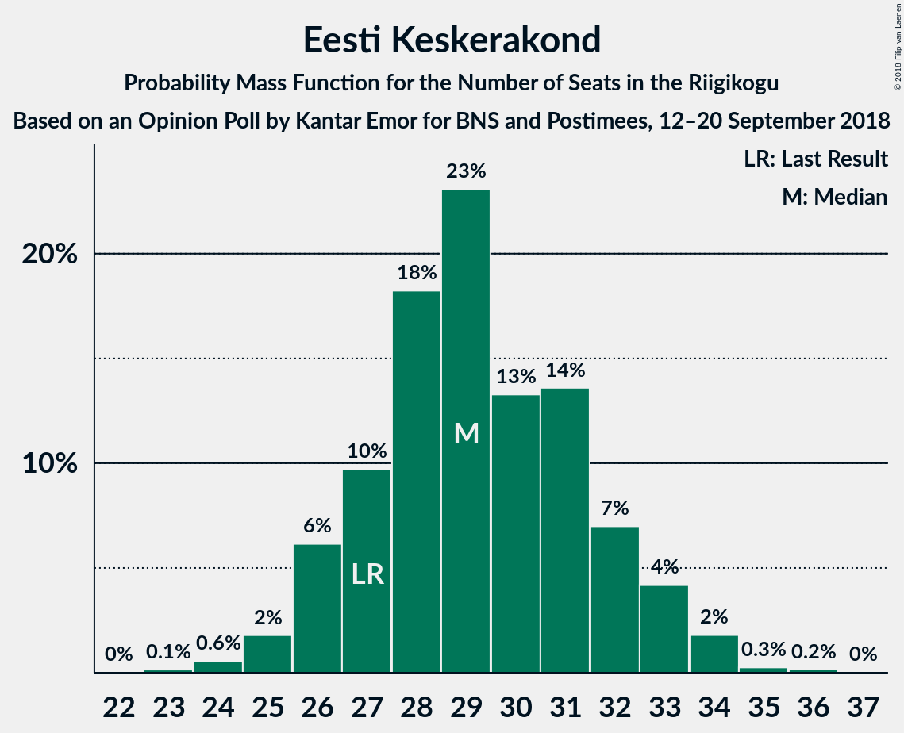
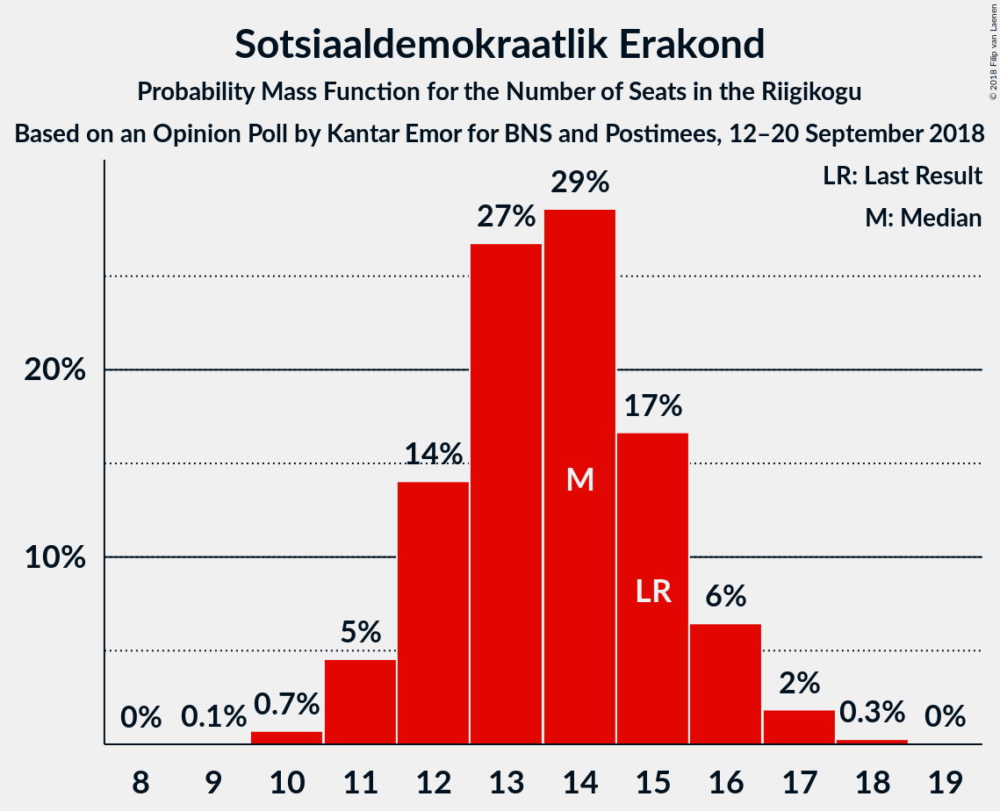
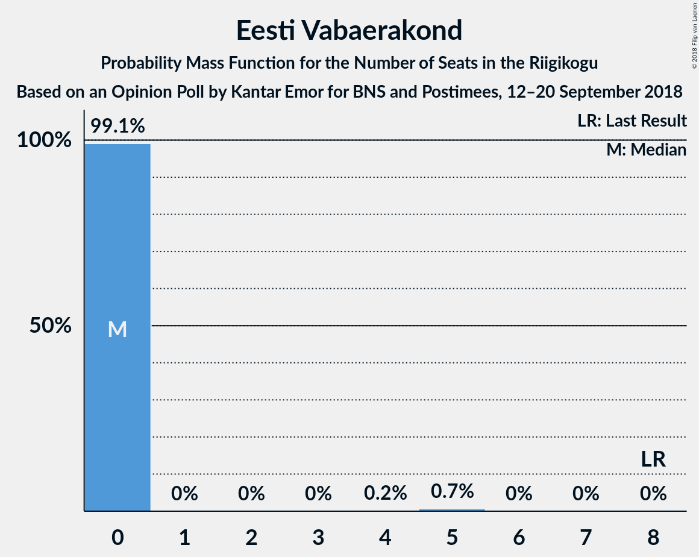
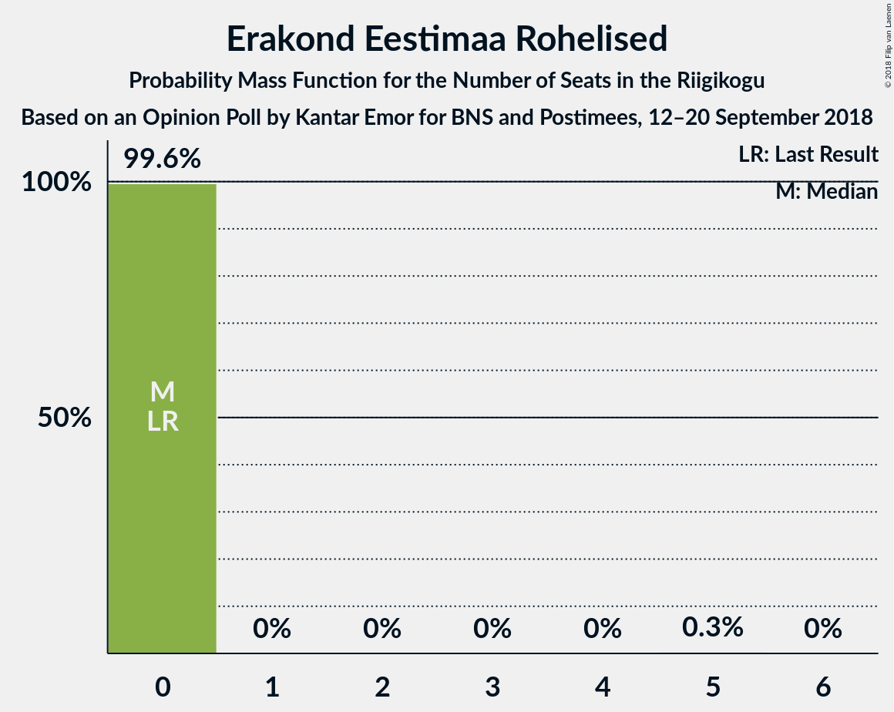
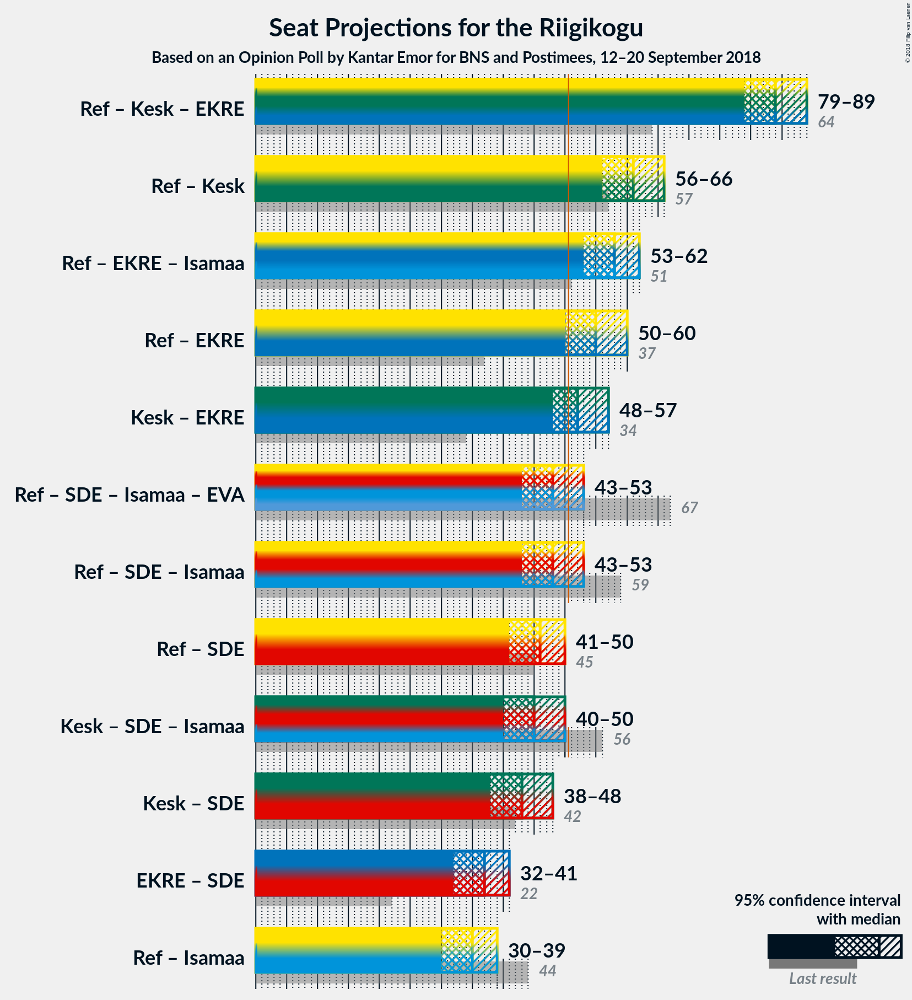

# Opinion Poll by Kantar Emor for BNS and Postimees, 12–20 September 2018

<a href="#voting-intentions">Voting Intentions</a> | <a href="#seats">Seats</a> | <a href="#coalitions">Coalitions</a> | <a href="#technical-information">Technical Information</a>

## Voting Intentions

### Confidence Intervals

| Party | Last Result | Poll Result | 80% Confidence Interval | 90% Confidence Interval | 95% Confidence Interval | 99% Confidence Interval |
|:-----:|:-----------:|:-----------:|:-----------------------:|:-----------------------:|:-----------------------:|:-----------------------:|
| Eesti Reformierakond | 27.7% | 26.7% | 25.0–28.6% |24.5–29.1% |24.0–29.6% |23.2–30.5% |
| Eesti Keskerakond | 24.8% | 24.6% | 22.8–26.4% |22.4–26.9% |22.0–27.4% |21.2–28.3% |
| Eesti Konservatiivne Rahvaerakond | 8.1% | 19.9% | 18.4–21.7% |17.9–22.1% |17.5–22.6% |16.8–23.4% |
| Sotsiaaldemokraatlik Erakond | 15.2% | 12.5% | 11.3–14.0% |10.9–14.4% |10.6–14.8% |10.0–15.5% |
| Erakond Isamaa | 13.7% | 4.9% | 4.1–5.9% |3.9–6.2% |3.7–6.5% |3.4–7.0% |
| Eesti 200 | 0.0% | 4.1% | 3.4–5.1% |3.2–5.3% |3.0–5.6% |2.7–6.0% |
| Eesti Vabaerakond | 8.7% | 3.4% | 2.7–4.3% |2.6–4.5% |2.4–4.7% |2.1–5.2% |
| Erakond Eestimaa Rohelised | 0.9% | 3.2% | 2.6–4.0% |2.4–4.3% |2.3–4.5% |2.0–4.9% |

*Note:* The poll result column reflects the actual value used in the calculations. Published results may vary slightly, and in addition be rounded to fewer digits.

## Seats

### Confidence Intervals

| Party | Last Result | Median | 80% Confidence Interval | 90% Confidence Interval | 95% Confidence Interval | 99% Confidence Interval |
|:-----:|:-----------:|:------:|:-----------------------:|:-----------------------:|:-----------------------:|:-----------------------:|
| <a href="#eesti-reformierakond">Eesti Reformierakond</a> | 30 | 37 | 34–37 |30–37 |30–37 |29–37 |
| <a href="#eesti-keskerakond">Eesti Keskerakond</a> | 27 | 25 | 25 |25–30 |25–30 |23–30 |
| <a href="#eesti-konservatiivne-rahvaerakond">Eesti Konservatiivne Rahvaerakond</a> | 7 | 25 | 23–25 |23–25 |23–25 |22–25 |
| <a href="#sotsiaaldemokraatlik-erakond">Sotsiaaldemokraatlik Erakond</a> | 15 | 14 | 14 |13–14 |13–15 |10–16 |
| <a href="#erakond-isamaa">Erakond Isamaa</a> | 14 | 0 | 0–5 |0–5 |0–6 |0–6 |
| <a href="#eesti-200">Eesti 200</a> | 0 | 0 | 0 |0 |0 |0 |
| <a href="#eesti-vabaerakond">Eesti Vabaerakond</a> | 8 | 0 | 0 |0 |0 |0–4 |
| <a href="#erakond-eestimaa-rohelised">Erakond Eestimaa Rohelised</a> | 0 | 0 | 0 |0 |0 |0 |

### Eesti Reformierakond

*For a full overview of the results for this party, see the [Eesti Reformierakond](party-eestireformierakond.html) page.*

| Number of Seats | Probability | Accumulated | Special Marks |
|:---------------:|:-----------:|:-----------:|:-------------:|
| 27 | 0.1% | 100% |  |
| 28 | 0.3% | 99.9% |  |
| 29 | 0.2% | 99.5% |  |
| 30 | 6% | 99.3% | Last Result |
| 31 | 1.4% | 93% |  |
| 32 | 0% | 92% |  |
| 33 | 0.2% | 92% |  |
| 34 | 2% | 91% |  |
| 35 | 0.2% | 89% |  |
| 36 | 0% | 89% |  |
| 37 | 89% | 89% | Median |
| 38 | 0% | 0% |  |

### Eesti Keskerakond

*For a full overview of the results for this party, see the [Eesti Keskerakond](party-eestikeskerakond.html) page.*

| Number of Seats | Probability | Accumulated | Special Marks |
|:---------------:|:-----------:|:-----------:|:-------------:|
| 23 | 2% | 100% |  |
| 24 | 0.2% | 98% |  |
| 25 | 89% | 98% | Median |
| 26 | 0.2% | 9% |  |
| 27 | 1.4% | 9% | Last Result |
| 28 | 0.4% | 7% |  |
| 29 | 0.4% | 7% |  |
| 30 | 6% | 6% |  |
| 31 | 0.1% | 0.1% |  |
| 32 | 0% | 0% |  |

### Eesti Konservatiivne Rahvaerakond

*For a full overview of the results for this party, see the [Eesti Konservatiivne Rahvaerakond](party-eestikonservatiivnerahvaerakond.html) page.*

| Number of Seats | Probability | Accumulated | Special Marks |
|:---------------:|:-----------:|:-----------:|:-------------:|
| 7 | 0% | 100% | Last Result |
| 8 | 0% | 100% |  |
| 9 | 0% | 100% |  |
| 10 | 0% | 100% |  |
| 11 | 0% | 100% |  |
| 12 | 0% | 100% |  |
| 13 | 0% | 100% |  |
| 14 | 0% | 100% |  |
| 15 | 0% | 100% |  |
| 16 | 0% | 100% |  |
| 17 | 0% | 100% |  |
| 18 | 0% | 100% |  |
| 19 | 0% | 100% |  |
| 20 | 0% | 100% |  |
| 21 | 0.1% | 100% |  |
| 22 | 2% | 99.9% |  |
| 23 | 8% | 98% |  |
| 24 | 0.1% | 89% |  |
| 25 | 89% | 89% | Median |
| 26 | 0% | 0% |  |

### Sotsiaaldemokraatlik Erakond

*For a full overview of the results for this party, see the [Sotsiaaldemokraatlik Erakond](party-sotsiaaldemokraatlikerakond.html) page.*

| Number of Seats | Probability | Accumulated | Special Marks |
|:---------------:|:-----------:|:-----------:|:-------------:|
| 10 | 1.4% | 100% |  |
| 11 | 0.2% | 98.6% |  |
| 12 | 0.4% | 98% |  |
| 13 | 6% | 98% |  |
| 14 | 89% | 92% | Median |
| 15 | 0.4% | 3% | Last Result |
| 16 | 2% | 2% |  |
| 17 | 0.2% | 0.2% |  |
| 18 | 0% | 0% |  |

### Erakond Isamaa

*For a full overview of the results for this party, see the [Erakond Isamaa](party-erakondisamaa.html) page.*

| Number of Seats | Probability | Accumulated | Special Marks |
|:---------------:|:-----------:|:-----------:|:-------------:|
| 0 | 89% | 100% | Median |
| 1 | 0% | 11% |  |
| 2 | 0% | 11% |  |
| 3 | 0% | 11% |  |
| 4 | 0% | 11% |  |
| 5 | 7% | 11% |  |
| 6 | 4% | 4% |  |
| 7 | 0.1% | 0.1% |  |
| 8 | 0% | 0% |  |
| 9 | 0% | 0% |  |
| 10 | 0% | 0% |  |
| 11 | 0% | 0% |  |
| 12 | 0% | 0% |  |
| 13 | 0% | 0% |  |
| 14 | 0% | 0% | Last Result |

### Eesti 200

*For a full overview of the results for this party, see the [Eesti 200](party-eesti200.html) page.*

| Number of Seats | Probability | Accumulated | Special Marks |
|:---------------:|:-----------:|:-----------:|:-------------:|
| 0 | 100% | 100% | Last Result, Median |

### Eesti Vabaerakond

*For a full overview of the results for this party, see the [Eesti Vabaerakond](party-eestivabaerakond.html) page.*

| Number of Seats | Probability | Accumulated | Special Marks |
|:---------------:|:-----------:|:-----------:|:-------------:|
| 0 | 98.6% | 100% | Median |
| 1 | 0% | 1.4% |  |
| 2 | 0% | 1.4% |  |
| 3 | 0% | 1.4% |  |
| 4 | 1.3% | 1.4% |  |
| 5 | 0% | 0% |  |
| 6 | 0% | 0% |  |
| 7 | 0% | 0% |  |
| 8 | 0% | 0% | Last Result |

### Erakond Eestimaa Rohelised

*For a full overview of the results for this party, see the [Erakond Eestimaa Rohelised](party-erakondeestimaarohelised.html) page.*

| Number of Seats | Probability | Accumulated | Special Marks |
|:---------------:|:-----------:|:-----------:|:-------------:|
| 0 | 99.6% | 100% | Last Result, Median |
| 1 | 0% | 0.4% |  |
| 2 | 0% | 0.4% |  |
| 3 | 0% | 0.4% |  |
| 4 | 0% | 0.4% |  |
| 5 | 0.4% | 0.4% |  |
| 6 | 0% | 0% |  |

## Coalitions

### Confidence Intervals

| Coalition | Last Result | Median | Majority? | 80% Confidence Interval | 90% Confidence Interval | 95% Confidence Interval | 99% Confidence Interval |
|:---------:|:-----------:|:------:|:---------:|:-----------------------:|:-----------------------:|:-----------------------:|:-----------------------:|
| Eesti Reformierakond – Eesti Keskerakond – Eesti Konservatiivne Rahvaerakond | 64 | 87 | 100% | 83–87 | 83–87 | 79–87 | 79–87 |
| Eesti Reformierakond – Eesti Konservatiivne Rahvaerakond – Erakond Isamaa | 51 | 62 | 100% | 62 | 58–62 | 58–62 | 56–62 |
| Eesti Reformierakond – Eesti Keskerakond | 57 | 62 | 100% | 60–62 | 60–62 | 57–62 | 57–62 |
| Eesti Reformierakond – Sotsiaaldemokraatlik Erakond – Erakond Isamaa – Eesti Vabaerakond | 67 | 51 | 93% | 51 | 48–51 | 48–52 | 47–56 |
| Eesti Reformierakond – Sotsiaaldemokraatlik Erakond – Erakond Isamaa | 59 | 51 | 91% | 51 | 48–51 | 48–52 | 46–56 |
| Eesti Reformierakond – Sotsiaaldemokraatlik Erakond | 45 | 51 | 89% | 50–51 | 43–51 | 43–51 | 41–51 |
| Eesti Keskerakond – Sotsiaaldemokraatlik Erakond – Erakond Isamaa | 56 | 39 | 0% | 39–43 | 39–48 | 39–48 | 39–48 |
| Eesti Reformierakond – Erakond Isamaa | 44 | 37 | 0% | 37 | 35–37 | 35–37 | 34–40 |

### Eesti Reformierakond – Eesti Keskerakond – Eesti Konservatiivne Rahvaerakond

| Number of Seats | Probability | Accumulated | Special Marks |
|:---------------:|:-----------:|:-----------:|:-------------:|
| 64 | 0% | 100% | Last Result |
| 65 | 0% | 100% |  |
| 66 | 0% | 100% |  |
| 67 | 0% | 100% |  |
| 68 | 0% | 100% |  |
| 69 | 0% | 100% |  |
| 70 | 0% | 100% |  |
| 71 | 0% | 100% |  |
| 72 | 0% | 100% |  |
| 73 | 0% | 100% |  |
| 74 | 0% | 100% |  |
| 75 | 0.1% | 100% |  |
| 76 | 0% | 99.9% |  |
| 77 | 0% | 99.9% |  |
| 78 | 0% | 99.9% |  |
| 79 | 2% | 99.9% |  |
| 80 | 0.2% | 97% |  |
| 81 | 1.4% | 97% |  |
| 82 | 0.1% | 96% |  |
| 83 | 6% | 96% |  |
| 84 | 0.2% | 90% |  |
| 85 | 0.2% | 89% |  |
| 86 | 0.2% | 89% |  |
| 87 | 89% | 89% | Median |
| 88 | 0% | 0% |  |

### Eesti Reformierakond – Eesti Konservatiivne Rahvaerakond – Erakond Isamaa

| Number of Seats | Probability | Accumulated | Special Marks |
|:---------------:|:-----------:|:-----------:|:-------------:|
| 51 | 0% | 100% | Last Result, Majority |
| 52 | 0% | 100% |  |
| 53 | 0.1% | 100% |  |
| 54 | 0% | 99.9% |  |
| 55 | 0.1% | 99.9% |  |
| 56 | 0.4% | 99.8% |  |
| 57 | 0.1% | 99.4% |  |
| 58 | 6% | 99.3% |  |
| 59 | 0% | 93% |  |
| 60 | 2% | 93% |  |
| 61 | 0.2% | 91% |  |
| 62 | 91% | 91% | Median |
| 63 | 0% | 0% |  |

### Eesti Reformierakond – Eesti Keskerakond

| Number of Seats | Probability | Accumulated | Special Marks |
|:---------------:|:-----------:|:-----------:|:-------------:|
| 54 | 0.1% | 100% |  |
| 55 | 0% | 99.9% |  |
| 56 | 0.3% | 99.9% |  |
| 57 | 2% | 99.5% | Last Result |
| 58 | 1.5% | 97% |  |
| 59 | 0.1% | 96% |  |
| 60 | 6% | 96% |  |
| 61 | 0% | 89% |  |
| 62 | 89% | 89% | Median |
| 63 | 0.2% | 0.2% |  |
| 64 | 0% | 0% |  |

### Eesti Reformierakond – Sotsiaaldemokraatlik Erakond – Erakond Isamaa – Eesti Vabaerakond

| Number of Seats | Probability | Accumulated | Special Marks |
|:---------------:|:-----------:|:-----------:|:-------------:|
| 45 | 0.3% | 100% |  |
| 46 | 0.1% | 99.6% |  |
| 47 | 0% | 99.5% |  |
| 48 | 6% | 99.5% |  |
| 49 | 0.2% | 93% |  |
| 50 | 0.2% | 93% |  |
| 51 | 90% | 93% | Median, Majority |
| 52 | 0.3% | 3% |  |
| 53 | 0% | 2% |  |
| 54 | 0% | 2% |  |
| 55 | 0% | 2% |  |
| 56 | 2% | 2% |  |
| 57 | 0% | 0% |  |
| 58 | 0% | 0% |  |
| 59 | 0% | 0% |  |
| 60 | 0% | 0% |  |
| 61 | 0% | 0% |  |
| 62 | 0% | 0% |  |
| 63 | 0% | 0% |  |
| 64 | 0% | 0% |  |
| 65 | 0% | 0% |  |
| 66 | 0% | 0% |  |
| 67 | 0% | 0% | Last Result |

### Eesti Reformierakond – Sotsiaaldemokraatlik Erakond – Erakond Isamaa

| Number of Seats | Probability | Accumulated | Special Marks |
|:---------------:|:-----------:|:-----------:|:-------------:|
| 42 | 0.1% | 100% |  |
| 43 | 0% | 99.9% |  |
| 44 | 0% | 99.9% |  |
| 45 | 0.3% | 99.9% |  |
| 46 | 0.1% | 99.6% |  |
| 47 | 1.3% | 99.5% |  |
| 48 | 6% | 98% |  |
| 49 | 0.2% | 92% |  |
| 50 | 0.2% | 92% |  |
| 51 | 89% | 91% | Median, Majority |
| 52 | 0.3% | 3% |  |
| 53 | 0% | 2% |  |
| 54 | 0% | 2% |  |
| 55 | 0% | 2% |  |
| 56 | 2% | 2% |  |
| 57 | 0% | 0% |  |
| 58 | 0% | 0% |  |
| 59 | 0% | 0% | Last Result |

### Eesti Reformierakond – Sotsiaaldemokraatlik Erakond

| Number of Seats | Probability | Accumulated | Special Marks |
|:---------------:|:-----------:|:-----------:|:-------------:|
| 40 | 0.3% | 100% |  |
| 41 | 1.4% | 99.7% |  |
| 42 | 0.1% | 98% |  |
| 43 | 6% | 98% |  |
| 44 | 0.3% | 92% |  |
| 45 | 0% | 92% | Last Result |
| 46 | 0.1% | 91% |  |
| 47 | 0% | 91% |  |
| 48 | 0% | 91% |  |
| 49 | 0% | 91% |  |
| 50 | 2% | 91% |  |
| 51 | 89% | 89% | Median, Majority |
| 52 | 0.3% | 0.3% |  |
| 53 | 0% | 0% |  |

### Eesti Keskerakond – Sotsiaaldemokraatlik Erakond – Erakond Isamaa

| Number of Seats | Probability | Accumulated | Special Marks |
|:---------------:|:-----------:|:-----------:|:-------------:|
| 39 | 89% | 100% | Median |
| 40 | 0.1% | 11% |  |
| 41 | 0.3% | 11% |  |
| 42 | 0% | 11% |  |
| 43 | 1.4% | 11% |  |
| 44 | 0% | 9% |  |
| 45 | 3% | 9% |  |
| 46 | 0% | 7% |  |
| 47 | 0% | 7% |  |
| 48 | 6% | 7% |  |
| 49 | 0% | 0.1% |  |
| 50 | 0.1% | 0.1% |  |
| 51 | 0% | 0% | Majority |
| 52 | 0% | 0% |  |
| 53 | 0% | 0% |  |
| 54 | 0% | 0% |  |
| 55 | 0% | 0% |  |
| 56 | 0% | 0% | Last Result |

### Eesti Reformierakond – Erakond Isamaa

| Number of Seats | Probability | Accumulated | Special Marks |
|:---------------:|:-----------:|:-----------:|:-------------:|
| 29 | 0.1% | 100% |  |
| 30 | 0% | 99.9% |  |
| 31 | 0.1% | 99.9% |  |
| 32 | 0% | 99.8% |  |
| 33 | 0.3% | 99.8% |  |
| 34 | 0.1% | 99.5% |  |
| 35 | 7% | 99.4% |  |
| 36 | 0% | 93% |  |
| 37 | 90% | 93% | Median |
| 38 | 0.2% | 2% |  |
| 39 | 0% | 2% |  |
| 40 | 2% | 2% |  |
| 41 | 0% | 0% |  |
| 42 | 0% | 0% |  |
| 43 | 0% | 0% |  |
| 44 | 0% | 0% | Last Result |

## Technical Information

### Opinion Poll

+ **Polling firm:** Kantar Emor
+ **Commissioner(s):** BNS and Postimees
+ **Fieldwork period:** 12–20 September 2018

### Calculations

+ **Sample size:** 973
+ **Simulations done:** 1,024
+ **Error estimate:** 1.75%

