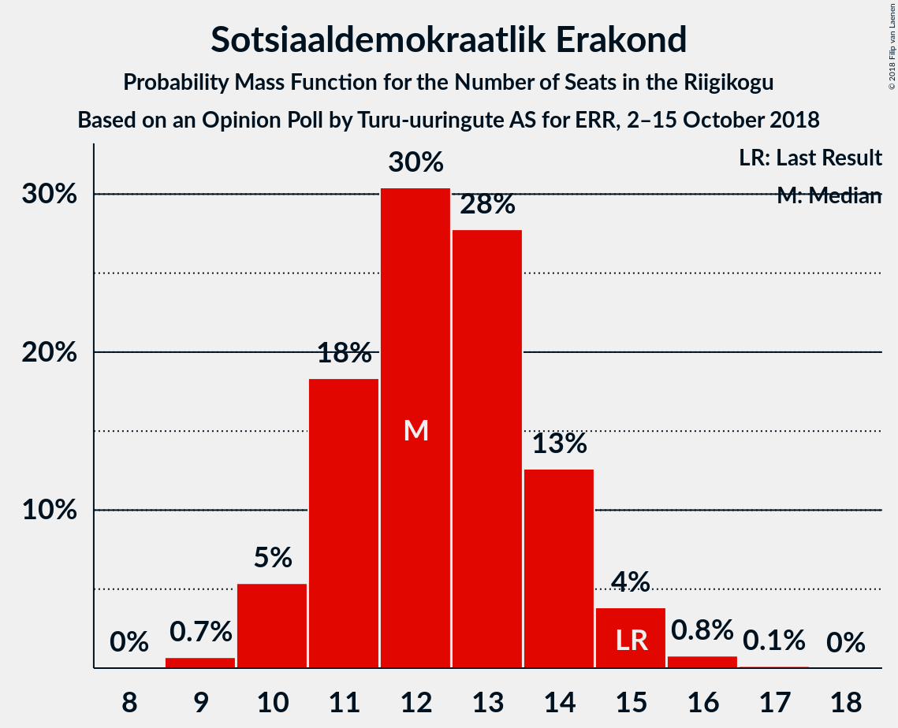

# Opinion Poll by Turu-uuringute AS for ERR, 2–15 October 2018

<a href="#voting-intentions">Voting Intentions</a> | <a href="#seats">Seats</a> | <a href="#coalitions">Coalitions</a> | <a href="#technical-information">Technical Information</a>

## Voting Intentions

### Confidence Intervals

| Party | Last Result | Poll Result | 80% Confidence Interval | 90% Confidence Interval | 95% Confidence Interval | 99% Confidence Interval |
|:-----:|:-----------:|:-----------:|:-----------------------:|:-----------------------:|:-----------------------:|:-----------------------:|
| Eesti Keskerakond | 24.8% | 30.0% | 28.2–31.9% |27.7–32.4% |27.2–32.9% |26.4–33.9% |
| Eesti Reformierakond | 27.7% | 28.0% | 26.2–29.9% |25.7–30.4% |25.3–30.9% |24.5–31.8% |
| Eesti Konservatiivne Rahvaerakond | 8.1% | 17.0% | 15.5–18.6% |15.2–19.1% |14.8–19.5% |14.1–20.3% |
| Sotsiaaldemokraatlik Erakond | 15.2% | 12.0% | 10.8–13.4% |10.4–13.8% |10.1–14.2% |9.6–14.9% |
| Erakond Isamaa | 13.7% | 5.0% | 4.2–6.0% |4.0–6.3% |3.8–6.5% |3.5–7.1% |
| Eesti Vabaerakond | 8.7% | 2.0% | 1.5–2.7% |1.4–2.9% |1.3–3.1% |1.1–3.4% |
| Erakond Eestimaa Rohelised | 0.9% | 2.0% | 1.5–2.7% |1.4–2.9% |1.3–3.1% |1.1–3.4% |

*Note:* The poll result column reflects the actual value used in the calculations. Published results may vary slightly, and in addition be rounded to fewer digits.

## Seats

### Confidence Intervals

| Party | Last Result | Median | 80% Confidence Interval | 90% Confidence Interval | 95% Confidence Interval | 99% Confidence Interval |
|:-----:|:-----------:|:------:|:-----------------------:|:-----------------------:|:-----------------------:|:-----------------------:|
| <a href="#eesti-keskerakond">Eesti Keskerakond</a> | 27 | 35 | 32–38 |32–38 |31–39 |30–40 |
| <a href="#eesti-reformierakond">Eesti Reformierakond</a> | 30 | 32 | 30–35 |29–36 |29–36 |27–38 |
| <a href="#eesti-konservatiivne-rahvaerakond">Eesti Konservatiivne Rahvaerakond</a> | 7 | 18 | 17–20 |16–21 |16–22 |15–23 |
| <a href="#sotsiaaldemokraatlik-erakond">Sotsiaaldemokraatlik Erakond</a> | 15 | 12 | 11–14 |10–14 |10–15 |9–16 |
| <a href="#erakond-isamaa">Erakond Isamaa</a> | 14 | 4 | 0–5 |0–6 |0–6 |0–7 |
| <a href="#eesti-vabaerakond">Eesti Vabaerakond</a> | 8 | 0 | 0 |0 |0 |0 |
| <a href="#erakond-eestimaa-rohelised">Erakond Eestimaa Rohelised</a> | 0 | 0 | 0 |0 |0 |0 |

### Eesti Keskerakond

*For a full overview of the results for this party, see the [Eesti Keskerakond](party-eestikeskerakond.html) page.*

| Number of Seats | Probability | Accumulated | Special Marks |
|:---------------:|:-----------:|:-----------:|:-------------:|
| 27 | 0% | 100% | Last Result |
| 28 | 0% | 100% |  |
| 29 | 0.2% | 99.9% |  |
| 30 | 0.9% | 99.7% |  |
| 31 | 3% | 98.8% |  |
| 32 | 9% | 96% |  |
| 33 | 10% | 87% |  |
| 34 | 16% | 77% |  |
| 35 | 23% | 60% | Median |
| 36 | 17% | 37% |  |
| 37 | 10% | 21% |  |
| 38 | 6% | 11% |  |
| 39 | 3% | 5% |  |
| 40 | 1.1% | 2% |  |
| 41 | 0.3% | 0.4% |  |
| 42 | 0.1% | 0.1% |  |
| 43 | 0% | 0% |  |

### Eesti Reformierakond

*For a full overview of the results for this party, see the [Eesti Reformierakond](party-eestireformierakond.html) page.*

| Number of Seats | Probability | Accumulated | Special Marks |
|:---------------:|:-----------:|:-----------:|:-------------:|
| 26 | 0.1% | 100% |  |
| 27 | 0.4% | 99.9% |  |
| 28 | 2% | 99.5% |  |
| 29 | 5% | 98% |  |
| 30 | 11% | 93% | Last Result |
| 31 | 15% | 82% |  |
| 32 | 19% | 67% | Median |
| 33 | 19% | 47% |  |
| 34 | 15% | 28% |  |
| 35 | 8% | 13% |  |
| 36 | 4% | 6% |  |
| 37 | 1.4% | 2% |  |
| 38 | 0.4% | 0.5% |  |
| 39 | 0.1% | 0.1% |  |
| 40 | 0% | 0% |  |

### Eesti Konservatiivne Rahvaerakond

*For a full overview of the results for this party, see the [Eesti Konservatiivne Rahvaerakond](party-eestikonservatiivnerahvaerakond.html) page.*

| Number of Seats | Probability | Accumulated | Special Marks |
|:---------------:|:-----------:|:-----------:|:-------------:|
| 7 | 0% | 100% | Last Result |
| 8 | 0% | 100% |  |
| 9 | 0% | 100% |  |
| 10 | 0% | 100% |  |
| 11 | 0% | 100% |  |
| 12 | 0% | 100% |  |
| 13 | 0% | 100% |  |
| 14 | 0.3% | 100% |  |
| 15 | 2% | 99.7% |  |
| 16 | 7% | 98% |  |
| 17 | 19% | 90% |  |
| 18 | 26% | 71% | Median |
| 19 | 20% | 45% |  |
| 20 | 18% | 25% |  |
| 21 | 4% | 8% |  |
| 22 | 3% | 3% |  |
| 23 | 0.5% | 0.6% |  |
| 24 | 0.1% | 0.1% |  |
| 25 | 0% | 0% |  |

### Sotsiaaldemokraatlik Erakond

*For a full overview of the results for this party, see the [Sotsiaaldemokraatlik Erakond](party-sotsiaaldemokraatlikerakond.html) page.*

| Number of Seats | Probability | Accumulated | Special Marks |
|:---------------:|:-----------:|:-----------:|:-------------:|
| 9 | 0.7% | 100% |  |
| 10 | 5% | 99.3% |  |
| 11 | 18% | 94% |  |
| 12 | 30% | 76% | Median |
| 13 | 28% | 45% |  |
| 14 | 13% | 17% |  |
| 15 | 4% | 5% | Last Result |
| 16 | 0.8% | 0.9% |  |
| 17 | 0.1% | 0.1% |  |
| 18 | 0% | 0% |  |

### Erakond Isamaa

*For a full overview of the results for this party, see the [Erakond Isamaa](party-erakondisamaa.html) page.*

| Number of Seats | Probability | Accumulated | Special Marks |
|:---------------:|:-----------:|:-----------:|:-------------:|
| 0 | 46% | 100% |  |
| 1 | 0% | 54% |  |
| 2 | 0% | 54% |  |
| 3 | 0% | 54% |  |
| 4 | 15% | 54% | Median |
| 5 | 31% | 38% |  |
| 6 | 6% | 7% |  |
| 7 | 0.5% | 0.5% |  |
| 8 | 0% | 0% |  |
| 9 | 0% | 0% |  |
| 10 | 0% | 0% |  |
| 11 | 0% | 0% |  |
| 12 | 0% | 0% |  |
| 13 | 0% | 0% |  |
| 14 | 0% | 0% | Last Result |

### Eesti Vabaerakond

*For a full overview of the results for this party, see the [Eesti Vabaerakond](party-eestivabaerakond.html) page.*

| Number of Seats | Probability | Accumulated | Special Marks |
|:---------------:|:-----------:|:-----------:|:-------------:|
| 0 | 100% | 100% | Median |
| 1 | 0% | 0% |  |
| 2 | 0% | 0% |  |
| 3 | 0% | 0% |  |
| 4 | 0% | 0% |  |
| 5 | 0% | 0% |  |
| 6 | 0% | 0% |  |
| 7 | 0% | 0% |  |
| 8 | 0% | 0% | Last Result |

### Erakond Eestimaa Rohelised

*For a full overview of the results for this party, see the [Erakond Eestimaa Rohelised](party-erakondeestimaarohelised.html) page.*

| Number of Seats | Probability | Accumulated | Special Marks |
|:---------------:|:-----------:|:-----------:|:-------------:|
| 0 | 100% | 100% | Last Result, Median |

## Coalitions

### Confidence Intervals

| Coalition | Last Result | Median | Majority? | 80% Confidence Interval | 90% Confidence Interval | 95% Confidence Interval | 99% Confidence Interval |
|:---------:|:-----------:|:------:|:---------:|:-----------------------:|:-----------------------:|:-----------------------:|:-----------------------:|
| Eesti Keskerakond – Eesti Reformierakond – Eesti Konservatiivne Rahvaerakond | 64 | 85 | 100% | 82–89 | 82–90 | 81–90 | 79–91 |
| Eesti Keskerakond – Eesti Reformierakond | 57 | 67 | 100% | 64–71 | 63–71 | 62–72 | 61–73 |
| Eesti Keskerakond – Eesti Konservatiivne Rahvaerakond | 34 | 53 | 88% | 50–57 | 50–57 | 49–58 | 47–59 |
| Eesti Reformierakond – Eesti Konservatiivne Rahvaerakond – Erakond Isamaa | 51 | 53 | 88% | 50–57 | 49–57 | 49–58 | 47–59 |
| Eesti Reformierakond – Eesti Konservatiivne Rahvaerakond | 37 | 51 | 51% | 48–54 | 47–55 | 46–55 | 45–57 |
| Eesti Keskerakond – Sotsiaaldemokraatlik Erakond – Erakond Isamaa | 56 | 50 | 44% | 47–53 | 46–54 | 45–54 | 44–56 |
| Eesti Keskerakond – Sotsiaaldemokraatlik Erakond | 42 | 47 | 10% | 44–50 | 44–51 | 43–52 | 42–53 |
| Eesti Reformierakond – Sotsiaaldemokraatlik Erakond – Erakond Isamaa – Eesti Vabaerakond | 67 | 47 | 10% | 44–50 | 43–51 | 42–52 | 41–53 |
| Eesti Reformierakond – Sotsiaaldemokraatlik Erakond – Erakond Isamaa | 59 | 47 | 10% | 44–50 | 43–51 | 42–52 | 41–53 |
| Eesti Reformierakond – Sotsiaaldemokraatlik Erakond | 45 | 45 | 0.5% | 42–48 | 41–48 | 40–49 | 39–51 |
| Eesti Reformierakond – Erakond Isamaa | 44 | 35 | 0% | 32–38 | 31–39 | 30–40 | 29–41 |
| Eesti Konservatiivne Rahvaerakond – Sotsiaaldemokraatlik Erakond | 22 | 31 | 0% | 28–33 | 28–34 | 27–35 | 26–36 |

### Eesti Keskerakond – Eesti Reformierakond – Eesti Konservatiivne Rahvaerakond

| Number of Seats | Probability | Accumulated | Special Marks |
|:---------------:|:-----------:|:-----------:|:-------------:|
| 64 | 0% | 100% | Last Result |
| 65 | 0% | 100% |  |
| 66 | 0% | 100% |  |
| 67 | 0% | 100% |  |
| 68 | 0% | 100% |  |
| 69 | 0% | 100% |  |
| 70 | 0% | 100% |  |
| 71 | 0% | 100% |  |
| 72 | 0% | 100% |  |
| 73 | 0% | 100% |  |
| 74 | 0% | 100% |  |
| 75 | 0% | 100% |  |
| 76 | 0% | 100% |  |
| 77 | 0.1% | 100% |  |
| 78 | 0.2% | 99.9% |  |
| 79 | 0.7% | 99.7% |  |
| 80 | 1.3% | 99.0% |  |
| 81 | 3% | 98% |  |
| 82 | 5% | 95% |  |
| 83 | 11% | 90% |  |
| 84 | 16% | 79% |  |
| 85 | 14% | 62% | Median |
| 86 | 8% | 49% |  |
| 87 | 9% | 41% |  |
| 88 | 14% | 32% |  |
| 89 | 12% | 18% |  |
| 90 | 5% | 7% |  |
| 91 | 1.3% | 1.4% |  |
| 92 | 0.1% | 0.1% |  |
| 93 | 0% | 0% |  |

### Eesti Keskerakond – Eesti Reformierakond

| Number of Seats | Probability | Accumulated | Special Marks |
|:---------------:|:-----------:|:-----------:|:-------------:|
| 57 | 0% | 100% | Last Result |
| 58 | 0% | 100% |  |
| 59 | 0% | 100% |  |
| 60 | 0.2% | 99.9% |  |
| 61 | 0.6% | 99.7% |  |
| 62 | 2% | 99.1% |  |
| 63 | 3% | 97% |  |
| 64 | 7% | 94% |  |
| 65 | 11% | 87% |  |
| 66 | 14% | 76% |  |
| 67 | 14% | 62% | Median |
| 68 | 15% | 48% |  |
| 69 | 13% | 32% |  |
| 70 | 9% | 19% |  |
| 71 | 6% | 10% |  |
| 72 | 3% | 4% |  |
| 73 | 0.9% | 1.2% |  |
| 74 | 0.2% | 0.3% |  |
| 75 | 0% | 0.1% |  |
| 76 | 0% | 0% |  |

### Eesti Keskerakond – Eesti Konservatiivne Rahvaerakond

| Number of Seats | Probability | Accumulated | Special Marks |
|:---------------:|:-----------:|:-----------:|:-------------:|
| 34 | 0% | 100% | Last Result |
| 35 | 0% | 100% |  |
| 36 | 0% | 100% |  |
| 37 | 0% | 100% |  |
| 38 | 0% | 100% |  |
| 39 | 0% | 100% |  |
| 40 | 0% | 100% |  |
| 41 | 0% | 100% |  |
| 42 | 0% | 100% |  |
| 43 | 0% | 100% |  |
| 44 | 0% | 100% |  |
| 45 | 0% | 100% |  |
| 46 | 0.1% | 100% |  |
| 47 | 0.5% | 99.9% |  |
| 48 | 1.2% | 99.4% |  |
| 49 | 3% | 98% |  |
| 50 | 7% | 95% |  |
| 51 | 11% | 88% | Majority |
| 52 | 15% | 77% |  |
| 53 | 15% | 63% | Median |
| 54 | 16% | 47% |  |
| 55 | 13% | 32% |  |
| 56 | 8% | 18% |  |
| 57 | 6% | 10% |  |
| 58 | 2% | 4% |  |
| 59 | 1.3% | 2% |  |
| 60 | 0.2% | 0.3% |  |
| 61 | 0.1% | 0.1% |  |
| 62 | 0% | 0% |  |

### Eesti Reformierakond – Eesti Konservatiivne Rahvaerakond – Erakond Isamaa

| Number of Seats | Probability | Accumulated | Special Marks |
|:---------------:|:-----------:|:-----------:|:-------------:|
| 46 | 0.1% | 100% |  |
| 47 | 0.7% | 99.8% |  |
| 48 | 1.2% | 99.1% |  |
| 49 | 4% | 98% |  |
| 50 | 7% | 94% |  |
| 51 | 7% | 88% | Last Result, Majority |
| 52 | 14% | 80% |  |
| 53 | 18% | 66% |  |
| 54 | 16% | 48% | Median |
| 55 | 16% | 32% |  |
| 56 | 6% | 16% |  |
| 57 | 7% | 10% |  |
| 58 | 2% | 3% |  |
| 59 | 0.5% | 0.7% |  |
| 60 | 0.2% | 0.2% |  |
| 61 | 0% | 0% |  |

### Eesti Reformierakond – Eesti Konservatiivne Rahvaerakond

| Number of Seats | Probability | Accumulated | Special Marks |
|:---------------:|:-----------:|:-----------:|:-------------:|
| 37 | 0% | 100% | Last Result |
| 38 | 0% | 100% |  |
| 39 | 0% | 100% |  |
| 40 | 0% | 100% |  |
| 41 | 0% | 100% |  |
| 42 | 0% | 100% |  |
| 43 | 0.1% | 100% |  |
| 44 | 0.3% | 99.9% |  |
| 45 | 0.6% | 99.7% |  |
| 46 | 2% | 99.0% |  |
| 47 | 6% | 97% |  |
| 48 | 8% | 91% |  |
| 49 | 15% | 83% |  |
| 50 | 18% | 69% | Median |
| 51 | 11% | 51% | Majority |
| 52 | 13% | 40% |  |
| 53 | 16% | 26% |  |
| 54 | 5% | 11% |  |
| 55 | 4% | 6% |  |
| 56 | 2% | 2% |  |
| 57 | 0.4% | 0.5% |  |
| 58 | 0.1% | 0.2% |  |
| 59 | 0% | 0% |  |

### Eesti Keskerakond – Sotsiaaldemokraatlik Erakond – Erakond Isamaa

| Number of Seats | Probability | Accumulated | Special Marks |
|:---------------:|:-----------:|:-----------:|:-------------:|
| 42 | 0.1% | 100% |  |
| 43 | 0.3% | 99.9% |  |
| 44 | 0.7% | 99.6% |  |
| 45 | 2% | 98.9% |  |
| 46 | 5% | 97% |  |
| 47 | 5% | 92% |  |
| 48 | 17% | 86% |  |
| 49 | 14% | 69% |  |
| 50 | 11% | 55% |  |
| 51 | 17% | 44% | Median, Majority |
| 52 | 14% | 27% |  |
| 53 | 6% | 13% |  |
| 54 | 5% | 7% |  |
| 55 | 1.5% | 2% |  |
| 56 | 0.3% | 0.5% | Last Result |
| 57 | 0.2% | 0.2% |  |
| 58 | 0% | 0% |  |

### Eesti Keskerakond – Sotsiaaldemokraatlik Erakond

| Number of Seats | Probability | Accumulated | Special Marks |
|:---------------:|:-----------:|:-----------:|:-------------:|
| 40 | 0.1% | 100% |  |
| 41 | 0.3% | 99.9% |  |
| 42 | 1.0% | 99.6% | Last Result |
| 43 | 3% | 98.6% |  |
| 44 | 9% | 96% |  |
| 45 | 7% | 87% |  |
| 46 | 17% | 80% |  |
| 47 | 16% | 63% | Median |
| 48 | 18% | 47% |  |
| 49 | 13% | 29% |  |
| 50 | 6% | 16% |  |
| 51 | 6% | 10% | Majority |
| 52 | 3% | 4% |  |
| 53 | 0.6% | 0.9% |  |
| 54 | 0.3% | 0.3% |  |
| 55 | 0% | 0.1% |  |
| 56 | 0% | 0% |  |

### Eesti Reformierakond – Sotsiaaldemokraatlik Erakond – Erakond Isamaa – Eesti Vabaerakond

| Number of Seats | Probability | Accumulated | Special Marks |
|:---------------:|:-----------:|:-----------:|:-------------:|
| 40 | 0.2% | 100% |  |
| 41 | 0.4% | 99.7% |  |
| 42 | 2% | 99.3% |  |
| 43 | 3% | 97% |  |
| 44 | 7% | 94% |  |
| 45 | 9% | 87% |  |
| 46 | 14% | 78% |  |
| 47 | 16% | 64% |  |
| 48 | 15% | 48% | Median |
| 49 | 14% | 33% |  |
| 50 | 9% | 19% |  |
| 51 | 6% | 10% | Majority |
| 52 | 2% | 3% |  |
| 53 | 0.8% | 1.1% |  |
| 54 | 0.2% | 0.3% |  |
| 55 | 0% | 0% |  |
| 56 | 0% | 0% |  |
| 57 | 0% | 0% |  |
| 58 | 0% | 0% |  |
| 59 | 0% | 0% |  |
| 60 | 0% | 0% |  |
| 61 | 0% | 0% |  |
| 62 | 0% | 0% |  |
| 63 | 0% | 0% |  |
| 64 | 0% | 0% |  |
| 65 | 0% | 0% |  |
| 66 | 0% | 0% |  |
| 67 | 0% | 0% | Last Result |

### Eesti Reformierakond – Sotsiaaldemokraatlik Erakond – Erakond Isamaa

| Number of Seats | Probability | Accumulated | Special Marks |
|:---------------:|:-----------:|:-----------:|:-------------:|
| 40 | 0.2% | 100% |  |
| 41 | 0.4% | 99.7% |  |
| 42 | 2% | 99.3% |  |
| 43 | 3% | 97% |  |
| 44 | 7% | 94% |  |
| 45 | 9% | 87% |  |
| 46 | 14% | 78% |  |
| 47 | 16% | 64% |  |
| 48 | 15% | 48% | Median |
| 49 | 14% | 33% |  |
| 50 | 9% | 19% |  |
| 51 | 6% | 10% | Majority |
| 52 | 2% | 3% |  |
| 53 | 0.8% | 1.1% |  |
| 54 | 0.2% | 0.3% |  |
| 55 | 0% | 0% |  |
| 56 | 0% | 0% |  |
| 57 | 0% | 0% |  |
| 58 | 0% | 0% |  |
| 59 | 0% | 0% | Last Result |

### Eesti Reformierakond – Sotsiaaldemokraatlik Erakond

| Number of Seats | Probability | Accumulated | Special Marks |
|:---------------:|:-----------:|:-----------:|:-------------:|
| 38 | 0.1% | 100% |  |
| 39 | 0.5% | 99.8% |  |
| 40 | 2% | 99.3% |  |
| 41 | 4% | 97% |  |
| 42 | 9% | 93% |  |
| 43 | 14% | 84% |  |
| 44 | 15% | 70% | Median |
| 45 | 18% | 54% | Last Result |
| 46 | 15% | 37% |  |
| 47 | 10% | 21% |  |
| 48 | 6% | 11% |  |
| 49 | 3% | 5% |  |
| 50 | 1.1% | 2% |  |
| 51 | 0.4% | 0.5% | Majority |
| 52 | 0.1% | 0.1% |  |
| 53 | 0% | 0% |  |

### Eesti Reformierakond – Erakond Isamaa

| Number of Seats | Probability | Accumulated | Special Marks |
|:---------------:|:-----------:|:-----------:|:-------------:|
| 27 | 0% | 100% |  |
| 28 | 0.2% | 99.9% |  |
| 29 | 0.8% | 99.7% |  |
| 30 | 2% | 98.9% |  |
| 31 | 6% | 97% |  |
| 32 | 7% | 91% |  |
| 33 | 12% | 83% |  |
| 34 | 14% | 71% |  |
| 35 | 14% | 57% |  |
| 36 | 12% | 42% | Median |
| 37 | 15% | 30% |  |
| 38 | 7% | 15% |  |
| 39 | 5% | 8% |  |
| 40 | 2% | 3% |  |
| 41 | 0.6% | 0.8% |  |
| 42 | 0.1% | 0.2% |  |
| 43 | 0% | 0% |  |
| 44 | 0% | 0% | Last Result |

### Eesti Konservatiivne Rahvaerakond – Sotsiaaldemokraatlik Erakond

| Number of Seats | Probability | Accumulated | Special Marks |
|:---------------:|:-----------:|:-----------:|:-------------:|
| 22 | 0% | 100% | Last Result |
| 23 | 0% | 100% |  |
| 24 | 0% | 100% |  |
| 25 | 0.2% | 100% |  |
| 26 | 0.8% | 99.8% |  |
| 27 | 3% | 99.0% |  |
| 28 | 7% | 96% |  |
| 29 | 17% | 89% |  |
| 30 | 17% | 73% | Median |
| 31 | 21% | 56% |  |
| 32 | 17% | 35% |  |
| 33 | 10% | 18% |  |
| 34 | 5% | 8% |  |
| 35 | 2% | 3% |  |
| 36 | 0.7% | 0.9% |  |
| 37 | 0.2% | 0.2% |  |
| 38 | 0% | 0% |  |

## Technical Information

### Opinion Poll

+ **Polling firm:** Turu-uuringute AS
+ **Commissioner(s):** ERR
+ **Fieldwork period:** 2–15 October 2018

### Calculations

+ **Sample size:** 1000
+ **Simulations done:** 1,048,576
+ **Error estimate:** 0.90%

