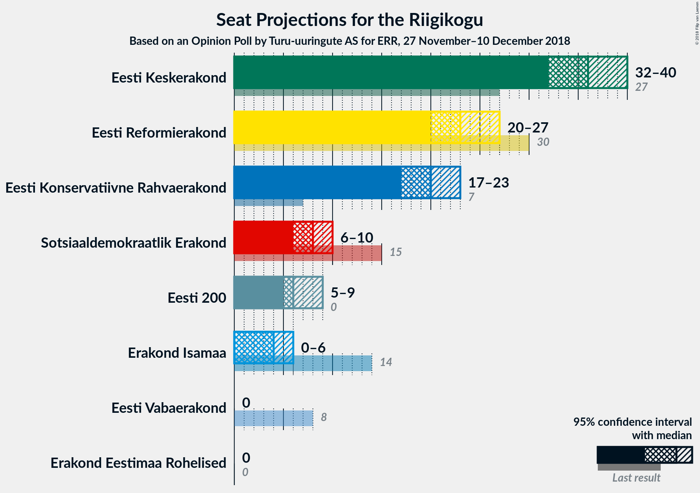
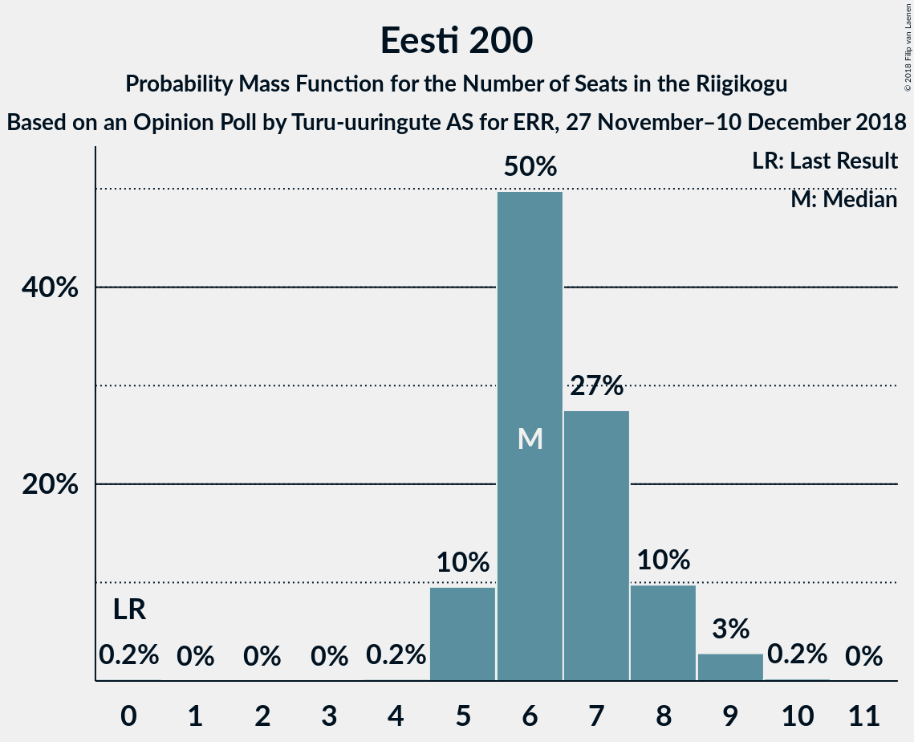
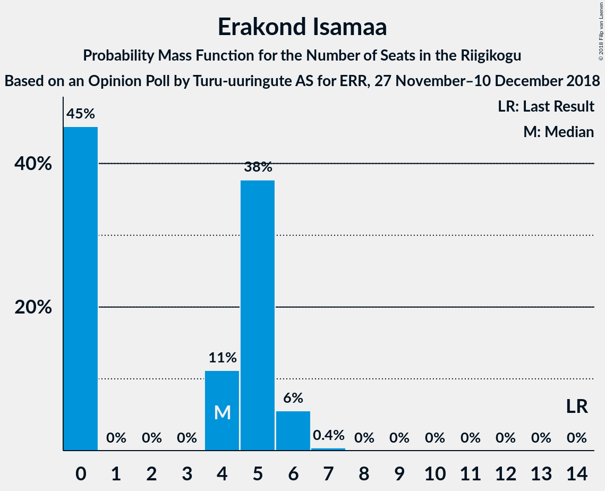
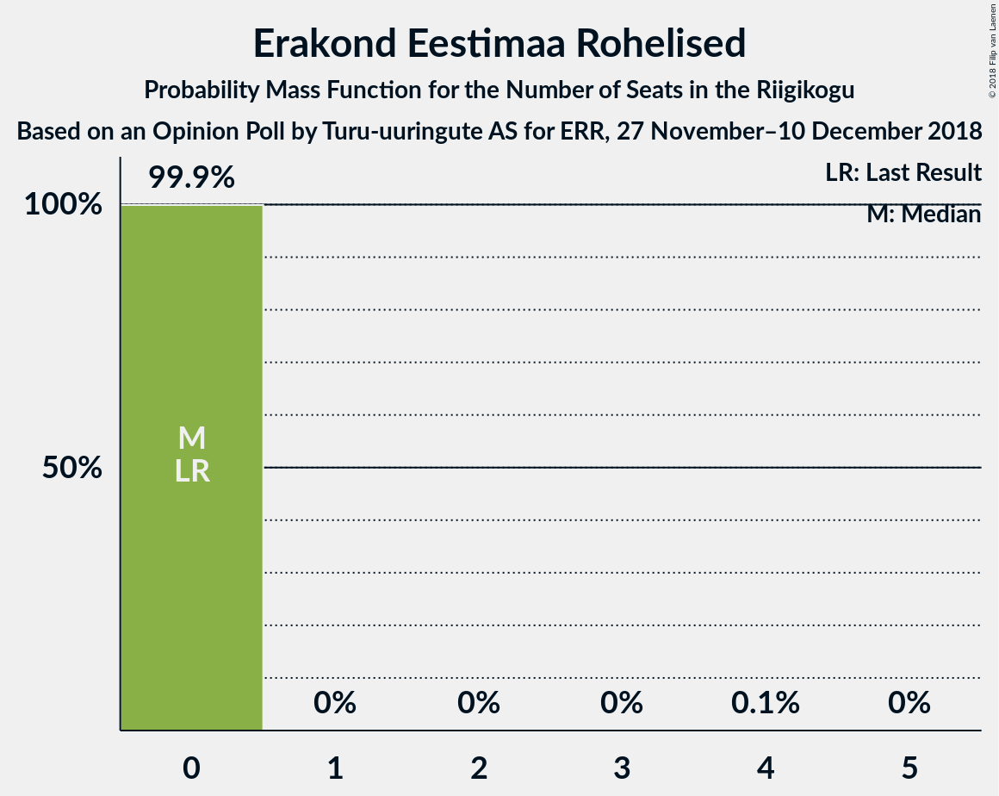

# Opinion Poll by Turu-uuringute AS for ERR, 27 November–10 December 2018

<a href="#voting-intentions">Voting Intentions</a> | <a href="#seats">Seats</a> | <a href="#coalitions">Coalitions</a> | <a href="#technical-information">Technical Information</a>

## Voting Intentions

### Confidence Intervals

| Party | Last Result | Poll Result | 80% Confidence Interval | 90% Confidence Interval | 95% Confidence Interval | 99% Confidence Interval |
|:-----:|:-----------:|:-----------:|:-----------------------:|:-----------------------:|:-----------------------:|:-----------------------:|
| Eesti Keskerakond | 24.8% | 31.0% | 29.2–32.9% |28.7–33.5% |28.2–33.9% |27.3–34.9% |
| Eesti Reformierakond | 27.7% | 21.0% | 19.4–22.7% |19.0–23.2% |18.6–23.6% |17.8–24.5% |
| Eesti Konservatiivne Rahvaerakond | 8.1% | 18.0% | 16.5–19.6% |16.1–20.1% |15.7–20.5% |15.1–21.3% |
| Sotsiaaldemokraatlik Erakond | 15.2% | 8.0% | 7.0–9.2% |6.7–9.6% |6.5–9.9% |6.0–10.5% |
| Eesti 200 | 0.0% | 7.0% | 6.1–8.2% |5.8–8.5% |5.6–8.8% |5.2–9.3% |
| Erakond Isamaa | 13.7% | 5.0% | 4.2–6.0% |4.0–6.3% |3.8–6.5% |3.5–7.1% |
| Erakond Eestimaa Rohelised | 0.9% | 3.0% | 2.4–3.8% |2.2–4.1% |2.1–4.3% |1.9–4.7% |
| Eesti Vabaerakond | 8.7% | 1.0% | 0.7–1.5% |0.6–1.7% |0.5–1.8% |0.4–2.1% |

*Note:* The poll result column reflects the actual value used in the calculations. Published results may vary slightly, and in addition be rounded to fewer digits.

## Seats

### Confidence Intervals

| Party | Last Result | Median | 80% Confidence Interval | 90% Confidence Interval | 95% Confidence Interval | 99% Confidence Interval |
|:-----:|:-----------:|:------:|:-----------------------:|:-----------------------:|:-----------------------:|:-----------------------:|
| <a href="#eesti-keskerakond">Eesti Keskerakond</a> | 27 | 36 | 34–39 |33–40 |32–40 |31–42 |
| <a href="#eesti-reformierakond">Eesti Reformierakond</a> | 30 | 23 | 21–25 |21–26 |20–27 |19–28 |
| <a href="#eesti-konservatiivne-rahvaerakond">Eesti Konservatiivne Rahvaerakond</a> | 7 | 20 | 18–21 |17–22 |17–23 |16–24 |
| <a href="#sotsiaaldemokraatlik-erakond">Sotsiaaldemokraatlik Erakond</a> | 15 | 8 | 7–9 |6–9 |6–10 |5–11 |
| <a href="#eesti-200">Eesti 200</a> | 0 | 6 | 6–8 |5–8 |5–9 |5–9 |
| <a href="#erakond-isamaa">Erakond Isamaa</a> | 14 | 4 | 0–5 |0–6 |0–6 |0–6 |
| <a href="#erakond-eestimaa-rohelised">Erakond Eestimaa Rohelised</a> | 0 | 0 | 0 |0 |0 |0 |
| <a href="#eesti-vabaerakond">Eesti Vabaerakond</a> | 8 | 0 | 0 |0 |0 |0 |

### Eesti Keskerakond

*For a full overview of the results for this party, see the [Eesti Keskerakond](party-eestikeskerakond.html) page.*

| Number of Seats | Probability | Accumulated | Special Marks |
|:---------------:|:-----------:|:-----------:|:-------------:|
| 27 | 0% | 100% | Last Result |
| 28 | 0% | 100% |  |
| 29 | 0% | 100% |  |
| 30 | 0.2% | 100% |  |
| 31 | 0.6% | 99.8% |  |
| 32 | 2% | 99.1% |  |
| 33 | 6% | 97% |  |
| 34 | 9% | 91% |  |
| 35 | 20% | 82% |  |
| 36 | 21% | 61% | Median |
| 37 | 18% | 40% |  |
| 38 | 10% | 21% |  |
| 39 | 6% | 12% |  |
| 40 | 4% | 6% |  |
| 41 | 1.2% | 2% |  |
| 42 | 0.6% | 0.8% |  |
| 43 | 0.1% | 0.2% |  |
| 44 | 0.1% | 0.1% |  |
| 45 | 0% | 0% |  |

### Eesti Reformierakond

*For a full overview of the results for this party, see the [Eesti Reformierakond](party-eestireformierakond.html) page.*

| Number of Seats | Probability | Accumulated | Special Marks |
|:---------------:|:-----------:|:-----------:|:-------------:|
| 18 | 0.2% | 100% |  |
| 19 | 1.2% | 99.8% |  |
| 20 | 3% | 98.7% |  |
| 21 | 7% | 96% |  |
| 22 | 17% | 89% |  |
| 23 | 29% | 72% | Median |
| 24 | 22% | 43% |  |
| 25 | 14% | 21% |  |
| 26 | 4% | 7% |  |
| 27 | 2% | 3% |  |
| 28 | 1.0% | 1.3% |  |
| 29 | 0.2% | 0.3% |  |
| 30 | 0.1% | 0.1% | Last Result |
| 31 | 0% | 0% |  |

### Eesti Konservatiivne Rahvaerakond

*For a full overview of the results for this party, see the [Eesti Konservatiivne Rahvaerakond](party-eestikonservatiivnerahvaerakond.html) page.*

| Number of Seats | Probability | Accumulated | Special Marks |
|:---------------:|:-----------:|:-----------:|:-------------:|
| 7 | 0% | 100% | Last Result |
| 8 | 0% | 100% |  |
| 9 | 0% | 100% |  |
| 10 | 0% | 100% |  |
| 11 | 0% | 100% |  |
| 12 | 0% | 100% |  |
| 13 | 0% | 100% |  |
| 14 | 0% | 100% |  |
| 15 | 0.3% | 100% |  |
| 16 | 2% | 99.7% |  |
| 17 | 7% | 98% |  |
| 18 | 21% | 91% |  |
| 19 | 19% | 70% |  |
| 20 | 29% | 52% | Median |
| 21 | 13% | 23% |  |
| 22 | 6% | 9% |  |
| 23 | 3% | 3% |  |
| 24 | 0.7% | 0.8% |  |
| 25 | 0.1% | 0.1% |  |
| 26 | 0% | 0% |  |

### Sotsiaaldemokraatlik Erakond

*For a full overview of the results for this party, see the [Sotsiaaldemokraatlik Erakond](party-sotsiaaldemokraatlikerakond.html) page.*

| Number of Seats | Probability | Accumulated | Special Marks |
|:---------------:|:-----------:|:-----------:|:-------------:|
| 5 | 0.6% | 100% |  |
| 6 | 9% | 99.4% |  |
| 7 | 32% | 90% |  |
| 8 | 36% | 58% | Median |
| 9 | 18% | 22% |  |
| 10 | 3% | 4% |  |
| 11 | 0.5% | 0.6% |  |
| 12 | 0.1% | 0.1% |  |
| 13 | 0% | 0% |  |
| 14 | 0% | 0% |  |
| 15 | 0% | 0% | Last Result |

### Eesti 200

*For a full overview of the results for this party, see the [Eesti 200](party-eesti200.html) page.*

| Number of Seats | Probability | Accumulated | Special Marks |
|:---------------:|:-----------:|:-----------:|:-------------:|
| 0 | 0.2% | 100% | Last Result |
| 1 | 0% | 99.8% |  |
| 2 | 0% | 99.8% |  |
| 3 | 0% | 99.8% |  |
| 4 | 0.2% | 99.8% |  |
| 5 | 10% | 99.6% |  |
| 6 | 50% | 90% | Median |
| 7 | 27% | 40% |  |
| 8 | 10% | 13% |  |
| 9 | 3% | 3% |  |
| 10 | 0.2% | 0.2% |  |
| 11 | 0% | 0% |  |

### Erakond Isamaa

*For a full overview of the results for this party, see the [Erakond Isamaa](party-erakondisamaa.html) page.*

| Number of Seats | Probability | Accumulated | Special Marks |
|:---------------:|:-----------:|:-----------:|:-------------:|
| 0 | 45% | 100% |  |
| 1 | 0% | 55% |  |
| 2 | 0% | 55% |  |
| 3 | 0% | 55% |  |
| 4 | 11% | 55% | Median |
| 5 | 38% | 44% |  |
| 6 | 6% | 6% |  |
| 7 | 0.4% | 0.4% |  |
| 8 | 0% | 0% |  |
| 9 | 0% | 0% |  |
| 10 | 0% | 0% |  |
| 11 | 0% | 0% |  |
| 12 | 0% | 0% |  |
| 13 | 0% | 0% |  |
| 14 | 0% | 0% | Last Result |

### Erakond Eestimaa Rohelised

*For a full overview of the results for this party, see the [Erakond Eestimaa Rohelised](party-erakondeestimaarohelised.html) page.*

| Number of Seats | Probability | Accumulated | Special Marks |
|:---------------:|:-----------:|:-----------:|:-------------:|
| 0 | 99.9% | 100% | Last Result, Median |
| 1 | 0% | 0.1% |  |
| 2 | 0% | 0.1% |  |
| 3 | 0% | 0.1% |  |
| 4 | 0.1% | 0.1% |  |
| 5 | 0% | 0% |  |

### Eesti Vabaerakond

*For a full overview of the results for this party, see the [Eesti Vabaerakond](party-eestivabaerakond.html) page.*

| Number of Seats | Probability | Accumulated | Special Marks |
|:---------------:|:-----------:|:-----------:|:-------------:|
| 0 | 100% | 100% | Median |
| 1 | 0% | 0% |  |
| 2 | 0% | 0% |  |
| 3 | 0% | 0% |  |
| 4 | 0% | 0% |  |
| 5 | 0% | 0% |  |
| 6 | 0% | 0% |  |
| 7 | 0% | 0% |  |
| 8 | 0% | 0% | Last Result |

## Coalitions

### Confidence Intervals

| Coalition | Last Result | Median | Majority? | 80% Confidence Interval | 90% Confidence Interval | 95% Confidence Interval | 99% Confidence Interval |
|:---------:|:-----------:|:------:|:---------:|:-----------------------:|:-----------------------:|:-----------------------:|:-----------------------:|
| Eesti Keskerakond – Eesti Reformierakond – Eesti Konservatiivne Rahvaerakond | 64 | 79 | 100% | 76–82 | 75–83 | 74–85 | 73–87 |
| Eesti Keskerakond – Eesti Reformierakond | 57 | 59 | 100% | 56–62 | 56–63 | 55–64 | 54–66 |
| Eesti Keskerakond – Eesti Konservatiivne Rahvaerakond | 34 | 55 | 98.8% | 53–58 | 52–60 | 51–60 | 50–62 |
| Eesti Keskerakond – Sotsiaaldemokraatlik Erakond – Erakond Isamaa | 56 | 47 | 4% | 43–49 | 43–50 | 42–51 | 40–53 |
| Eesti Reformierakond – Eesti Konservatiivne Rahvaerakond – Erakond Isamaa | 51 | 45 | 2% | 42–49 | 41–49 | 41–50 | 40–52 |
| Eesti Keskerakond – Sotsiaaldemokraatlik Erakond | 42 | 44 | 0.3% | 41–47 | 40–48 | 40–49 | 39–50 |
| Eesti Reformierakond – Eesti Konservatiivne Rahvaerakond | 37 | 43 | 0.1% | 40–46 | 39–46 | 39–47 | 38–49 |
| Eesti Reformierakond – Sotsiaaldemokraatlik Erakond – Erakond Isamaa – Eesti Vabaerakond | 67 | 34 | 0% | 31–36 | 30–37 | 29–38 | 28–40 |
| Eesti Reformierakond – Sotsiaaldemokraatlik Erakond – Erakond Isamaa | 59 | 34 | 0% | 31–36 | 30–37 | 29–38 | 28–40 |
| Eesti Reformierakond – Sotsiaaldemokraatlik Erakond | 45 | 31 | 0% | 29–33 | 28–34 | 27–35 | 26–36 |
| Eesti Konservatiivne Rahvaerakond – Sotsiaaldemokraatlik Erakond | 22 | 27 | 0% | 25–30 | 24–30 | 24–31 | 23–32 |
| Eesti Reformierakond – Erakond Isamaa | 44 | 26 | 0% | 23–29 | 22–30 | 21–30 | 20–32 |

### Eesti Keskerakond – Eesti Reformierakond – Eesti Konservatiivne Rahvaerakond

| Number of Seats | Probability | Accumulated | Special Marks |
|:---------------:|:-----------:|:-----------:|:-------------:|
| 64 | 0% | 100% | Last Result |
| 65 | 0% | 100% |  |
| 66 | 0% | 100% |  |
| 67 | 0% | 100% |  |
| 68 | 0% | 100% |  |
| 69 | 0% | 100% |  |
| 70 | 0% | 100% |  |
| 71 | 0% | 100% |  |
| 72 | 0.1% | 100% |  |
| 73 | 0.5% | 99.8% |  |
| 74 | 2% | 99.4% |  |
| 75 | 5% | 97% |  |
| 76 | 12% | 92% |  |
| 77 | 14% | 80% |  |
| 78 | 14% | 65% |  |
| 79 | 8% | 51% | Median |
| 80 | 16% | 44% |  |
| 81 | 11% | 28% |  |
| 82 | 8% | 17% |  |
| 83 | 4% | 8% |  |
| 84 | 1.2% | 4% |  |
| 85 | 1.4% | 3% |  |
| 86 | 1.0% | 2% |  |
| 87 | 0.3% | 0.6% |  |
| 88 | 0.2% | 0.2% |  |
| 89 | 0.1% | 0.1% |  |
| 90 | 0% | 0% |  |

### Eesti Keskerakond – Eesti Reformierakond

| Number of Seats | Probability | Accumulated | Special Marks |
|:---------------:|:-----------:|:-----------:|:-------------:|
| 52 | 0.1% | 100% |  |
| 53 | 0.4% | 99.9% |  |
| 54 | 1.1% | 99.6% |  |
| 55 | 3% | 98% |  |
| 56 | 7% | 96% |  |
| 57 | 8% | 89% | Last Result |
| 58 | 19% | 80% |  |
| 59 | 14% | 61% | Median |
| 60 | 15% | 47% |  |
| 61 | 10% | 32% |  |
| 62 | 13% | 22% |  |
| 63 | 5% | 10% |  |
| 64 | 2% | 5% |  |
| 65 | 2% | 2% |  |
| 66 | 0.4% | 0.8% |  |
| 67 | 0.2% | 0.4% |  |
| 68 | 0.1% | 0.2% |  |
| 69 | 0% | 0% |  |

### Eesti Keskerakond – Eesti Konservatiivne Rahvaerakond

| Number of Seats | Probability | Accumulated | Special Marks |
|:---------------:|:-----------:|:-----------:|:-------------:|
| 34 | 0% | 100% | Last Result |
| 35 | 0% | 100% |  |
| 36 | 0% | 100% |  |
| 37 | 0% | 100% |  |
| 38 | 0% | 100% |  |
| 39 | 0% | 100% |  |
| 40 | 0% | 100% |  |
| 41 | 0% | 100% |  |
| 42 | 0% | 100% |  |
| 43 | 0% | 100% |  |
| 44 | 0% | 100% |  |
| 45 | 0% | 100% |  |
| 46 | 0% | 100% |  |
| 47 | 0% | 100% |  |
| 48 | 0.1% | 100% |  |
| 49 | 0.3% | 99.9% |  |
| 50 | 0.9% | 99.7% |  |
| 51 | 2% | 98.8% | Majority |
| 52 | 4% | 97% |  |
| 53 | 9% | 94% |  |
| 54 | 18% | 85% |  |
| 55 | 19% | 67% |  |
| 56 | 15% | 48% | Median |
| 57 | 15% | 33% |  |
| 58 | 8% | 18% |  |
| 59 | 3% | 10% |  |
| 60 | 4% | 6% |  |
| 61 | 2% | 2% |  |
| 62 | 0.5% | 0.9% |  |
| 63 | 0.3% | 0.4% |  |
| 64 | 0.1% | 0.2% |  |
| 65 | 0% | 0.1% |  |
| 66 | 0% | 0% |  |

### Eesti Keskerakond – Sotsiaaldemokraatlik Erakond – Erakond Isamaa

| Number of Seats | Probability | Accumulated | Special Marks |
|:---------------:|:-----------:|:-----------:|:-------------:|
| 39 | 0.1% | 100% |  |
| 40 | 0.4% | 99.9% |  |
| 41 | 1.3% | 99.5% |  |
| 42 | 3% | 98% |  |
| 43 | 6% | 95% |  |
| 44 | 10% | 89% |  |
| 45 | 13% | 79% |  |
| 46 | 15% | 67% |  |
| 47 | 17% | 51% |  |
| 48 | 9% | 34% | Median |
| 49 | 15% | 25% |  |
| 50 | 5% | 10% |  |
| 51 | 2% | 4% | Majority |
| 52 | 1.5% | 2% |  |
| 53 | 0.5% | 0.7% |  |
| 54 | 0.2% | 0.2% |  |
| 55 | 0% | 0% |  |
| 56 | 0% | 0% | Last Result |

### Eesti Reformierakond – Eesti Konservatiivne Rahvaerakond – Erakond Isamaa

| Number of Seats | Probability | Accumulated | Special Marks |
|:---------------:|:-----------:|:-----------:|:-------------:|
| 38 | 0.1% | 100% |  |
| 39 | 0.4% | 99.9% |  |
| 40 | 0.9% | 99.5% |  |
| 41 | 4% | 98.6% |  |
| 42 | 5% | 95% |  |
| 43 | 8% | 89% |  |
| 44 | 17% | 81% |  |
| 45 | 17% | 64% |  |
| 46 | 13% | 47% |  |
| 47 | 13% | 34% | Median |
| 48 | 11% | 21% |  |
| 49 | 6% | 11% |  |
| 50 | 3% | 5% |  |
| 51 | 0.9% | 2% | Last Result, Majority |
| 52 | 0.5% | 0.7% |  |
| 53 | 0.2% | 0.2% |  |
| 54 | 0% | 0.1% |  |
| 55 | 0% | 0% |  |

### Eesti Keskerakond – Sotsiaaldemokraatlik Erakond

| Number of Seats | Probability | Accumulated | Special Marks |
|:---------------:|:-----------:|:-----------:|:-------------:|
| 37 | 0.1% | 100% |  |
| 38 | 0.4% | 99.9% |  |
| 39 | 2% | 99.5% |  |
| 40 | 4% | 98% |  |
| 41 | 8% | 94% |  |
| 42 | 16% | 86% | Last Result |
| 43 | 13% | 70% |  |
| 44 | 19% | 57% | Median |
| 45 | 16% | 37% |  |
| 46 | 9% | 22% |  |
| 47 | 7% | 13% |  |
| 48 | 3% | 6% |  |
| 49 | 2% | 3% |  |
| 50 | 0.4% | 0.7% |  |
| 51 | 0.2% | 0.3% | Majority |
| 52 | 0.1% | 0.1% |  |
| 53 | 0% | 0% |  |

### Eesti Reformierakond – Eesti Konservatiivne Rahvaerakond

| Number of Seats | Probability | Accumulated | Special Marks |
|:---------------:|:-----------:|:-----------:|:-------------:|
| 36 | 0.1% | 100% |  |
| 37 | 0.3% | 99.9% | Last Result |
| 38 | 1.5% | 99.6% |  |
| 39 | 4% | 98% |  |
| 40 | 13% | 94% |  |
| 41 | 12% | 82% |  |
| 42 | 13% | 70% |  |
| 43 | 20% | 57% | Median |
| 44 | 14% | 37% |  |
| 45 | 11% | 23% |  |
| 46 | 7% | 11% |  |
| 47 | 2% | 4% |  |
| 48 | 1.4% | 2% |  |
| 49 | 0.8% | 1.0% |  |
| 50 | 0.1% | 0.2% |  |
| 51 | 0% | 0.1% | Majority |
| 52 | 0% | 0% |  |

### Eesti Reformierakond – Sotsiaaldemokraatlik Erakond – Erakond Isamaa – Eesti Vabaerakond

| Number of Seats | Probability | Accumulated | Special Marks |
|:---------------:|:-----------:|:-----------:|:-------------:|
| 26 | 0.1% | 100% |  |
| 27 | 0.3% | 99.9% |  |
| 28 | 0.7% | 99.6% |  |
| 29 | 3% | 98.9% |  |
| 30 | 4% | 96% |  |
| 31 | 6% | 92% |  |
| 32 | 17% | 86% |  |
| 33 | 14% | 69% |  |
| 34 | 13% | 55% |  |
| 35 | 21% | 41% | Median |
| 36 | 11% | 21% |  |
| 37 | 5% | 9% |  |
| 38 | 3% | 5% |  |
| 39 | 1.2% | 2% |  |
| 40 | 0.5% | 0.7% |  |
| 41 | 0.1% | 0.2% |  |
| 42 | 0% | 0% |  |
| 43 | 0% | 0% |  |
| 44 | 0% | 0% |  |
| 45 | 0% | 0% |  |
| 46 | 0% | 0% |  |
| 47 | 0% | 0% |  |
| 48 | 0% | 0% |  |
| 49 | 0% | 0% |  |
| 50 | 0% | 0% |  |
| 51 | 0% | 0% | Majority |
| 52 | 0% | 0% |  |
| 53 | 0% | 0% |  |
| 54 | 0% | 0% |  |
| 55 | 0% | 0% |  |
| 56 | 0% | 0% |  |
| 57 | 0% | 0% |  |
| 58 | 0% | 0% |  |
| 59 | 0% | 0% |  |
| 60 | 0% | 0% |  |
| 61 | 0% | 0% |  |
| 62 | 0% | 0% |  |
| 63 | 0% | 0% |  |
| 64 | 0% | 0% |  |
| 65 | 0% | 0% |  |
| 66 | 0% | 0% |  |
| 67 | 0% | 0% | Last Result |

### Eesti Reformierakond – Sotsiaaldemokraatlik Erakond – Erakond Isamaa

| Number of Seats | Probability | Accumulated | Special Marks |
|:---------------:|:-----------:|:-----------:|:-------------:|
| 26 | 0.1% | 100% |  |
| 27 | 0.3% | 99.9% |  |
| 28 | 0.7% | 99.6% |  |
| 29 | 3% | 98.9% |  |
| 30 | 4% | 96% |  |
| 31 | 6% | 92% |  |
| 32 | 17% | 86% |  |
| 33 | 14% | 69% |  |
| 34 | 13% | 55% |  |
| 35 | 21% | 41% | Median |
| 36 | 11% | 21% |  |
| 37 | 5% | 9% |  |
| 38 | 3% | 5% |  |
| 39 | 1.2% | 2% |  |
| 40 | 0.5% | 0.7% |  |
| 41 | 0.1% | 0.2% |  |
| 42 | 0% | 0% |  |
| 43 | 0% | 0% |  |
| 44 | 0% | 0% |  |
| 45 | 0% | 0% |  |
| 46 | 0% | 0% |  |
| 47 | 0% | 0% |  |
| 48 | 0% | 0% |  |
| 49 | 0% | 0% |  |
| 50 | 0% | 0% |  |
| 51 | 0% | 0% | Majority |
| 52 | 0% | 0% |  |
| 53 | 0% | 0% |  |
| 54 | 0% | 0% |  |
| 55 | 0% | 0% |  |
| 56 | 0% | 0% |  |
| 57 | 0% | 0% |  |
| 58 | 0% | 0% |  |
| 59 | 0% | 0% | Last Result |

### Eesti Reformierakond – Sotsiaaldemokraatlik Erakond

| Number of Seats | Probability | Accumulated | Special Marks |
|:---------------:|:-----------:|:-----------:|:-------------:|
| 25 | 0.1% | 100% |  |
| 26 | 0.5% | 99.9% |  |
| 27 | 2% | 99.4% |  |
| 28 | 5% | 97% |  |
| 29 | 11% | 93% |  |
| 30 | 23% | 82% |  |
| 31 | 18% | 59% | Median |
| 32 | 19% | 41% |  |
| 33 | 14% | 22% |  |
| 34 | 5% | 8% |  |
| 35 | 2% | 3% |  |
| 36 | 0.9% | 1.2% |  |
| 37 | 0.2% | 0.3% |  |
| 38 | 0.1% | 0.1% |  |
| 39 | 0% | 0% |  |
| 40 | 0% | 0% |  |
| 41 | 0% | 0% |  |
| 42 | 0% | 0% |  |
| 43 | 0% | 0% |  |
| 44 | 0% | 0% |  |
| 45 | 0% | 0% | Last Result |

### Eesti Konservatiivne Rahvaerakond – Sotsiaaldemokraatlik Erakond

| Number of Seats | Probability | Accumulated | Special Marks |
|:---------------:|:-----------:|:-----------:|:-------------:|
| 22 | 0.2% | 100% | Last Result |
| 23 | 1.3% | 99.8% |  |
| 24 | 4% | 98% |  |
| 25 | 14% | 94% |  |
| 26 | 15% | 80% |  |
| 27 | 23% | 66% |  |
| 28 | 20% | 43% | Median |
| 29 | 12% | 22% |  |
| 30 | 6% | 11% |  |
| 31 | 3% | 4% |  |
| 32 | 1.2% | 2% |  |
| 33 | 0.2% | 0.3% |  |
| 34 | 0.1% | 0.1% |  |
| 35 | 0% | 0% |  |

### Eesti Reformierakond – Erakond Isamaa

| Number of Seats | Probability | Accumulated | Special Marks |
|:---------------:|:-----------:|:-----------:|:-------------:|
| 19 | 0.1% | 100% |  |
| 20 | 0.9% | 99.9% |  |
| 21 | 2% | 99.0% |  |
| 22 | 3% | 97% |  |
| 23 | 9% | 94% |  |
| 24 | 15% | 85% |  |
| 25 | 14% | 70% |  |
| 26 | 9% | 56% |  |
| 27 | 17% | 47% | Median |
| 28 | 16% | 30% |  |
| 29 | 8% | 14% |  |
| 30 | 4% | 6% |  |
| 31 | 0.9% | 2% |  |
| 32 | 0.7% | 0.9% |  |
| 33 | 0.2% | 0.2% |  |
| 34 | 0% | 0% |  |
| 35 | 0% | 0% |  |
| 36 | 0% | 0% |  |
| 37 | 0% | 0% |  |
| 38 | 0% | 0% |  |
| 39 | 0% | 0% |  |
| 40 | 0% | 0% |  |
| 41 | 0% | 0% |  |
| 42 | 0% | 0% |  |
| 43 | 0% | 0% |  |
| 44 | 0% | 0% | Last Result |

## Technical Information

### Opinion Poll

+ **Polling firm:** Turu-uuringute AS
+ **Commissioner(s):** ERR
+ **Fieldwork period:** 27 November–10 December 2018

### Calculations

+ **Sample size:** 1000
+ **Simulations done:** 1,048,576
+ **Error estimate:** 0.87%

