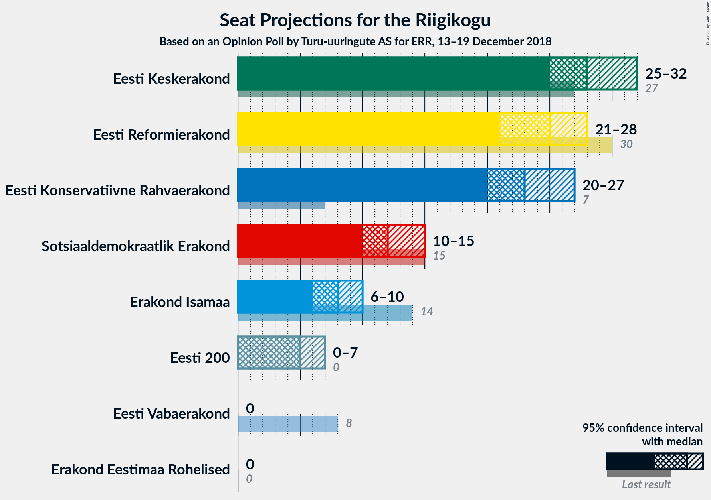
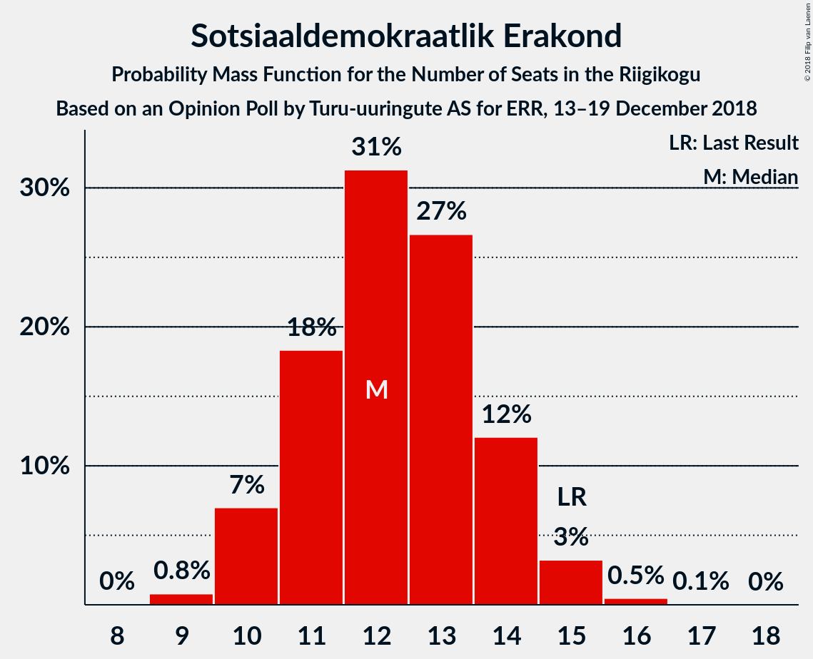

# Opinion Poll by Turu-uuringute AS for ERR, 13–19 December 2018

<a href="#voting-intentions">Voting Intentions</a> | <a href="#seats">Seats</a> | <a href="#coalitions">Coalitions</a> | <a href="#technical-information">Technical Information</a>

## Voting Intentions

### Confidence Intervals

| Party | Last Result | Poll Result | 80% Confidence Interval | 90% Confidence Interval | 95% Confidence Interval | 99% Confidence Interval |
|:-----:|:-----------:|:-----------:|:-----------------------:|:-----------------------:|:-----------------------:|:-----------------------:|
| Eesti Keskerakond | 24.8% | 25.0% | 23.3–26.8% |22.8–27.3% |22.4–27.8% |21.6–28.7% |
| Eesti Reformierakond | 27.7% | 22.0% | 20.4–23.7% |19.9–24.2% |19.5–24.7% |18.8–25.5% |
| Eesti Konservatiivne Rahvaerakond | 8.1% | 21.0% | 19.4–22.7% |19.0–23.2% |18.6–23.6% |17.8–24.5% |
| Sotsiaaldemokraatlik Erakond | 15.2% | 12.0% | 10.8–13.4% |10.4–13.8% |10.1–14.2% |9.6–14.9% |
| Erakond Isamaa | 13.7% | 8.0% | 7.0–9.2% |6.7–9.6% |6.5–9.9% |6.0–10.5% |
| Eesti 200 | 0.0% | 6.0% | 5.1–7.1% |4.9–7.4% |4.7–7.7% |4.3–8.2% |
| Erakond Eestimaa Rohelised | 0.9% | 3.0% | 2.4–3.8% |2.2–4.1% |2.1–4.3% |1.9–4.7% |
| Eesti Vabaerakond | 8.7% | 1.0% | 0.7–1.5% |0.6–1.7% |0.5–1.8% |0.4–2.1% |

*Note:* The poll result column reflects the actual value used in the calculations. Published results may vary slightly, and in addition be rounded to fewer digits.

## Seats

### Confidence Intervals

| Party | Last Result | Median | 80% Confidence Interval | 90% Confidence Interval | 95% Confidence Interval | 99% Confidence Interval |
|:-----:|:-----------:|:------:|:-----------------------:|:-----------------------:|:-----------------------:|:-----------------------:|
| <a href="#eesti-keskerakond">Eesti Keskerakond</a> | 27 | 28 | 26–31 |25–31 |25–32 |24–33 |
| <a href="#eesti-reformierakond">Eesti Reformierakond</a> | 30 | 25 | 22–27 |22–28 |21–28 |20–29 |
| <a href="#eesti-konservatiivne-rahvaerakond">Eesti Konservatiivne Rahvaerakond</a> | 7 | 23 | 21–25 |20–26 |20–27 |19–28 |
| <a href="#sotsiaaldemokraatlik-erakond">Sotsiaaldemokraatlik Erakond</a> | 15 | 12 | 11–14 |10–14 |10–15 |9–16 |
| <a href="#erakond-isamaa">Erakond Isamaa</a> | 14 | 8 | 6–9 |6–9 |6–10 |5–10 |
| <a href="#eesti-200">Eesti 200</a> | 0 | 5 | 4–7 |0–7 |0–7 |0–8 |
| <a href="#erakond-eestimaa-rohelised">Erakond Eestimaa Rohelised</a> | 0 | 0 | 0 |0 |0 |0 |
| <a href="#eesti-vabaerakond">Eesti Vabaerakond</a> | 8 | 0 | 0 |0 |0 |0 |

### Eesti Keskerakond

*For a full overview of the results for this party, see the [Eesti Keskerakond](party-eestikeskerakond.html) page.*

| Number of Seats | Probability | Accumulated | Special Marks |
|:---------------:|:-----------:|:-----------:|:-------------:|
| 23 | 0.2% | 100% |  |
| 24 | 1.2% | 99.8% |  |
| 25 | 4% | 98.6% |  |
| 26 | 10% | 94% |  |
| 27 | 18% | 84% | Last Result |
| 28 | 20% | 67% | Median |
| 29 | 21% | 47% |  |
| 30 | 14% | 26% |  |
| 31 | 7% | 11% |  |
| 32 | 3% | 5% |  |
| 33 | 1.0% | 1.4% |  |
| 34 | 0.3% | 0.4% |  |
| 35 | 0.1% | 0.1% |  |
| 36 | 0% | 0% |  |

### Eesti Reformierakond

*For a full overview of the results for this party, see the [Eesti Reformierakond](party-eestireformierakond.html) page.*

| Number of Seats | Probability | Accumulated | Special Marks |
|:---------------:|:-----------:|:-----------:|:-------------:|
| 19 | 0.1% | 100% |  |
| 20 | 0.8% | 99.9% |  |
| 21 | 3% | 99.1% |  |
| 22 | 9% | 97% |  |
| 23 | 14% | 88% |  |
| 24 | 24% | 74% |  |
| 25 | 21% | 50% | Median |
| 26 | 15% | 29% |  |
| 27 | 8% | 14% |  |
| 28 | 4% | 5% |  |
| 29 | 1.4% | 2% |  |
| 30 | 0.2% | 0.3% | Last Result |
| 31 | 0.1% | 0.1% |  |
| 32 | 0% | 0% |  |

### Eesti Konservatiivne Rahvaerakond

*For a full overview of the results for this party, see the [Eesti Konservatiivne Rahvaerakond](party-eestikonservatiivnerahvaerakond.html) page.*

| Number of Seats | Probability | Accumulated | Special Marks |
|:---------------:|:-----------:|:-----------:|:-------------:|
| 7 | 0% | 100% | Last Result |
| 8 | 0% | 100% |  |
| 9 | 0% | 100% |  |
| 10 | 0% | 100% |  |
| 11 | 0% | 100% |  |
| 12 | 0% | 100% |  |
| 13 | 0% | 100% |  |
| 14 | 0% | 100% |  |
| 15 | 0% | 100% |  |
| 16 | 0% | 100% |  |
| 17 | 0% | 100% |  |
| 18 | 0.2% | 100% |  |
| 19 | 1.4% | 99.8% |  |
| 20 | 5% | 98% |  |
| 21 | 13% | 93% |  |
| 22 | 22% | 80% |  |
| 23 | 25% | 58% | Median |
| 24 | 15% | 33% |  |
| 25 | 10% | 18% |  |
| 26 | 5% | 8% |  |
| 27 | 2% | 3% |  |
| 28 | 0.8% | 1.0% |  |
| 29 | 0.2% | 0.2% |  |
| 30 | 0% | 0% |  |

### Sotsiaaldemokraatlik Erakond

*For a full overview of the results for this party, see the [Sotsiaaldemokraatlik Erakond](party-sotsiaaldemokraatlikerakond.html) page.*

| Number of Seats | Probability | Accumulated | Special Marks |
|:---------------:|:-----------:|:-----------:|:-------------:|
| 9 | 0.8% | 100% |  |
| 10 | 7% | 99.2% |  |
| 11 | 18% | 92% |  |
| 12 | 31% | 74% | Median |
| 13 | 27% | 43% |  |
| 14 | 12% | 16% |  |
| 15 | 3% | 4% | Last Result |
| 16 | 0.5% | 0.6% |  |
| 17 | 0.1% | 0.1% |  |
| 18 | 0% | 0% |  |

### Erakond Isamaa

*For a full overview of the results for this party, see the [Erakond Isamaa](party-erakondisamaa.html) page.*

| Number of Seats | Probability | Accumulated | Special Marks |
|:---------------:|:-----------:|:-----------:|:-------------:|
| 5 | 1.2% | 100% |  |
| 6 | 11% | 98.8% |  |
| 7 | 34% | 87% |  |
| 8 | 37% | 54% | Median |
| 9 | 13% | 17% |  |
| 10 | 3% | 4% |  |
| 11 | 0.4% | 0.4% |  |
| 12 | 0% | 0% |  |
| 13 | 0% | 0% |  |
| 14 | 0% | 0% | Last Result |

### Eesti 200

*For a full overview of the results for this party, see the [Eesti 200](party-eesti200.html) page.*

| Number of Seats | Probability | Accumulated | Special Marks |
|:---------------:|:-----------:|:-----------:|:-------------:|
| 0 | 7% | 100% | Last Result |
| 1 | 0% | 93% |  |
| 2 | 0% | 93% |  |
| 3 | 0% | 93% |  |
| 4 | 3% | 93% |  |
| 5 | 39% | 89% | Median |
| 6 | 37% | 50% |  |
| 7 | 11% | 13% |  |
| 8 | 2% | 2% |  |
| 9 | 0.1% | 0.1% |  |
| 10 | 0% | 0% |  |

### Erakond Eestimaa Rohelised

*For a full overview of the results for this party, see the [Erakond Eestimaa Rohelised](party-erakondeestimaarohelised.html) page.*

| Number of Seats | Probability | Accumulated | Special Marks |
|:---------------:|:-----------:|:-----------:|:-------------:|
| 0 | 99.9% | 100% | Last Result, Median |
| 1 | 0% | 0.1% |  |
| 2 | 0% | 0.1% |  |
| 3 | 0% | 0.1% |  |
| 4 | 0.1% | 0.1% |  |
| 5 | 0% | 0% |  |

### Eesti Vabaerakond

*For a full overview of the results for this party, see the [Eesti Vabaerakond](party-eestivabaerakond.html) page.*

| Number of Seats | Probability | Accumulated | Special Marks |
|:---------------:|:-----------:|:-----------:|:-------------:|
| 0 | 100% | 100% | Median |
| 1 | 0% | 0% |  |
| 2 | 0% | 0% |  |
| 3 | 0% | 0% |  |
| 4 | 0% | 0% |  |
| 5 | 0% | 0% |  |
| 6 | 0% | 0% |  |
| 7 | 0% | 0% |  |
| 8 | 0% | 0% | Last Result |

## Coalitions

### Confidence Intervals

| Coalition | Last Result | Median | Majority? | 80% Confidence Interval | 90% Confidence Interval | 95% Confidence Interval | 99% Confidence Interval |
|:---------:|:-----------:|:------:|:---------:|:-----------------------:|:-----------------------:|:-----------------------:|:-----------------------:|
| Eesti Keskerakond – Eesti Reformierakond – Eesti Konservatiivne Rahvaerakond | 64 | 76 | 100% | 74–78 | 73–80 | 72–81 | 72–82 |
| Eesti Reformierakond – Eesti Konservatiivne Rahvaerakond – Erakond Isamaa | 51 | 55 | 99.0% | 52–58 | 52–59 | 51–60 | 50–61 |
| Eesti Keskerakond – Eesti Reformierakond | 57 | 53 | 86% | 50–56 | 49–57 | 49–58 | 47–59 |
| Eesti Keskerakond – Eesti Konservatiivne Rahvaerakond | 34 | 51 | 60% | 49–54 | 48–55 | 47–56 | 46–57 |
| Eesti Keskerakond – Sotsiaaldemokraatlik Erakond – Erakond Isamaa | 56 | 48 | 13% | 46–51 | 45–52 | 44–53 | 43–54 |
| Eesti Reformierakond – Eesti Konservatiivne Rahvaerakond | 37 | 47 | 8% | 45–50 | 44–51 | 44–52 | 42–53 |
| Eesti Reformierakond – Sotsiaaldemokraatlik Erakond – Erakond Isamaa – Eesti Vabaerakond | 67 | 45 | 0.3% | 42–47 | 41–48 | 41–49 | 39–50 |
| Eesti Reformierakond – Sotsiaaldemokraatlik Erakond – Erakond Isamaa | 59 | 45 | 0.3% | 42–47 | 41–48 | 41–49 | 39–50 |
| Eesti Keskerakond – Sotsiaaldemokraatlik Erakond | 42 | 41 | 0% | 38–43 | 38–44 | 37–45 | 36–46 |
| Eesti Reformierakond – Sotsiaaldemokraatlik Erakond | 45 | 37 | 0% | 34–39 | 34–40 | 33–41 | 32–42 |
| Eesti Konservatiivne Rahvaerakond – Sotsiaaldemokraatlik Erakond | 22 | 35 | 0% | 33–38 | 32–39 | 31–39 | 31–41 |
| Eesti Reformierakond – Erakond Isamaa | 44 | 32 | 0% | 30–35 | 29–35 | 29–36 | 28–37 |

### Eesti Keskerakond – Eesti Reformierakond – Eesti Konservatiivne Rahvaerakond

| Number of Seats | Probability | Accumulated | Special Marks |
|:---------------:|:-----------:|:-----------:|:-------------:|
| 64 | 0% | 100% | Last Result |
| 65 | 0% | 100% |  |
| 66 | 0% | 100% |  |
| 67 | 0% | 100% |  |
| 68 | 0% | 100% |  |
| 69 | 0% | 100% |  |
| 70 | 0.1% | 100% |  |
| 71 | 0.4% | 99.9% |  |
| 72 | 3% | 99.5% |  |
| 73 | 6% | 97% |  |
| 74 | 17% | 91% |  |
| 75 | 20% | 73% |  |
| 76 | 21% | 54% | Median |
| 77 | 14% | 33% |  |
| 78 | 10% | 19% |  |
| 79 | 4% | 10% |  |
| 80 | 2% | 5% |  |
| 81 | 2% | 3% |  |
| 82 | 0.8% | 1.2% |  |
| 83 | 0.4% | 0.4% |  |
| 84 | 0.1% | 0.1% |  |
| 85 | 0% | 0% |  |

### Eesti Reformierakond – Eesti Konservatiivne Rahvaerakond – Erakond Isamaa

| Number of Seats | Probability | Accumulated | Special Marks |
|:---------------:|:-----------:|:-----------:|:-------------:|
| 49 | 0.2% | 100% |  |
| 50 | 0.7% | 99.7% |  |
| 51 | 3% | 99.0% | Last Result, Majority |
| 52 | 6% | 96% |  |
| 53 | 8% | 90% |  |
| 54 | 21% | 81% |  |
| 55 | 20% | 60% |  |
| 56 | 17% | 40% | Median |
| 57 | 10% | 23% |  |
| 58 | 7% | 13% |  |
| 59 | 3% | 6% |  |
| 60 | 2% | 3% |  |
| 61 | 0.5% | 1.0% |  |
| 62 | 0.4% | 0.5% |  |
| 63 | 0.1% | 0.1% |  |
| 64 | 0% | 0% |  |

### Eesti Keskerakond – Eesti Reformierakond

| Number of Seats | Probability | Accumulated | Special Marks |
|:---------------:|:-----------:|:-----------:|:-------------:|
| 46 | 0.1% | 100% |  |
| 47 | 0.4% | 99.9% |  |
| 48 | 2% | 99.5% |  |
| 49 | 4% | 98% |  |
| 50 | 7% | 94% |  |
| 51 | 15% | 86% | Majority |
| 52 | 15% | 72% |  |
| 53 | 18% | 57% | Median |
| 54 | 14% | 39% |  |
| 55 | 12% | 25% |  |
| 56 | 7% | 13% |  |
| 57 | 3% | 6% | Last Result |
| 58 | 2% | 3% |  |
| 59 | 0.6% | 0.8% |  |
| 60 | 0.2% | 0.2% |  |
| 61 | 0.1% | 0.1% |  |
| 62 | 0% | 0% |  |

### Eesti Keskerakond – Eesti Konservatiivne Rahvaerakond

| Number of Seats | Probability | Accumulated | Special Marks |
|:---------------:|:-----------:|:-----------:|:-------------:|
| 34 | 0% | 100% | Last Result |
| 35 | 0% | 100% |  |
| 36 | 0% | 100% |  |
| 37 | 0% | 100% |  |
| 38 | 0% | 100% |  |
| 39 | 0% | 100% |  |
| 40 | 0% | 100% |  |
| 41 | 0% | 100% |  |
| 42 | 0% | 100% |  |
| 43 | 0% | 100% |  |
| 44 | 0% | 100% |  |
| 45 | 0.1% | 100% |  |
| 46 | 0.7% | 99.9% |  |
| 47 | 2% | 99.2% |  |
| 48 | 4% | 97% |  |
| 49 | 12% | 93% |  |
| 50 | 21% | 81% |  |
| 51 | 15% | 60% | Median, Majority |
| 52 | 16% | 44% |  |
| 53 | 13% | 28% |  |
| 54 | 9% | 15% |  |
| 55 | 3% | 6% |  |
| 56 | 1.4% | 3% |  |
| 57 | 1.1% | 1.4% |  |
| 58 | 0.3% | 0.3% |  |
| 59 | 0% | 0.1% |  |
| 60 | 0% | 0% |  |

### Eesti Keskerakond – Sotsiaaldemokraatlik Erakond – Erakond Isamaa

| Number of Seats | Probability | Accumulated | Special Marks |
|:---------------:|:-----------:|:-----------:|:-------------:|
| 42 | 0.1% | 100% |  |
| 43 | 0.7% | 99.8% |  |
| 44 | 2% | 99.2% |  |
| 45 | 6% | 97% |  |
| 46 | 10% | 91% |  |
| 47 | 17% | 81% |  |
| 48 | 19% | 63% | Median |
| 49 | 20% | 44% |  |
| 50 | 12% | 25% |  |
| 51 | 8% | 13% | Majority |
| 52 | 3% | 5% |  |
| 53 | 2% | 3% |  |
| 54 | 0.7% | 0.9% |  |
| 55 | 0.2% | 0.3% |  |
| 56 | 0% | 0.1% | Last Result |
| 57 | 0% | 0% |  |

### Eesti Reformierakond – Eesti Konservatiivne Rahvaerakond

| Number of Seats | Probability | Accumulated | Special Marks |
|:---------------:|:-----------:|:-----------:|:-------------:|
| 37 | 0% | 100% | Last Result |
| 38 | 0% | 100% |  |
| 39 | 0% | 100% |  |
| 40 | 0% | 100% |  |
| 41 | 0.1% | 100% |  |
| 42 | 0.6% | 99.9% |  |
| 43 | 1.3% | 99.4% |  |
| 44 | 5% | 98% |  |
| 45 | 7% | 93% |  |
| 46 | 17% | 86% |  |
| 47 | 21% | 69% |  |
| 48 | 18% | 48% | Median |
| 49 | 14% | 30% |  |
| 50 | 8% | 16% |  |
| 51 | 4% | 8% | Majority |
| 52 | 2% | 3% |  |
| 53 | 0.7% | 1.0% |  |
| 54 | 0.3% | 0.4% |  |
| 55 | 0.1% | 0.1% |  |
| 56 | 0% | 0% |  |

### Eesti Reformierakond – Sotsiaaldemokraatlik Erakond – Erakond Isamaa – Eesti Vabaerakond

| Number of Seats | Probability | Accumulated | Special Marks |
|:---------------:|:-----------:|:-----------:|:-------------:|
| 38 | 0.1% | 100% |  |
| 39 | 0.5% | 99.8% |  |
| 40 | 1.2% | 99.4% |  |
| 41 | 6% | 98% |  |
| 42 | 10% | 92% |  |
| 43 | 14% | 82% |  |
| 44 | 14% | 68% |  |
| 45 | 23% | 54% | Median |
| 46 | 17% | 30% |  |
| 47 | 7% | 13% |  |
| 48 | 4% | 6% |  |
| 49 | 2% | 3% |  |
| 50 | 0.5% | 0.8% |  |
| 51 | 0.2% | 0.3% | Majority |
| 52 | 0.1% | 0.1% |  |
| 53 | 0% | 0% |  |
| 54 | 0% | 0% |  |
| 55 | 0% | 0% |  |
| 56 | 0% | 0% |  |
| 57 | 0% | 0% |  |
| 58 | 0% | 0% |  |
| 59 | 0% | 0% |  |
| 60 | 0% | 0% |  |
| 61 | 0% | 0% |  |
| 62 | 0% | 0% |  |
| 63 | 0% | 0% |  |
| 64 | 0% | 0% |  |
| 65 | 0% | 0% |  |
| 66 | 0% | 0% |  |
| 67 | 0% | 0% | Last Result |

### Eesti Reformierakond – Sotsiaaldemokraatlik Erakond – Erakond Isamaa

| Number of Seats | Probability | Accumulated | Special Marks |
|:---------------:|:-----------:|:-----------:|:-------------:|
| 38 | 0.1% | 100% |  |
| 39 | 0.5% | 99.8% |  |
| 40 | 1.2% | 99.4% |  |
| 41 | 6% | 98% |  |
| 42 | 10% | 92% |  |
| 43 | 14% | 82% |  |
| 44 | 14% | 68% |  |
| 45 | 23% | 54% | Median |
| 46 | 17% | 30% |  |
| 47 | 7% | 13% |  |
| 48 | 4% | 6% |  |
| 49 | 2% | 3% |  |
| 50 | 0.5% | 0.8% |  |
| 51 | 0.2% | 0.3% | Majority |
| 52 | 0.1% | 0.1% |  |
| 53 | 0% | 0% |  |
| 54 | 0% | 0% |  |
| 55 | 0% | 0% |  |
| 56 | 0% | 0% |  |
| 57 | 0% | 0% |  |
| 58 | 0% | 0% |  |
| 59 | 0% | 0% | Last Result |

### Eesti Keskerakond – Sotsiaaldemokraatlik Erakond

| Number of Seats | Probability | Accumulated | Special Marks |
|:---------------:|:-----------:|:-----------:|:-------------:|
| 34 | 0.1% | 100% |  |
| 35 | 0.3% | 99.9% |  |
| 36 | 1.3% | 99.6% |  |
| 37 | 3% | 98% |  |
| 38 | 10% | 95% |  |
| 39 | 13% | 85% |  |
| 40 | 21% | 73% | Median |
| 41 | 19% | 51% |  |
| 42 | 18% | 33% | Last Result |
| 43 | 8% | 15% |  |
| 44 | 4% | 7% |  |
| 45 | 2% | 3% |  |
| 46 | 1.0% | 1.2% |  |
| 47 | 0.1% | 0.2% |  |
| 48 | 0.1% | 0.1% |  |
| 49 | 0% | 0% |  |

### Eesti Reformierakond – Sotsiaaldemokraatlik Erakond

| Number of Seats | Probability | Accumulated | Special Marks |
|:---------------:|:-----------:|:-----------:|:-------------:|
| 31 | 0.2% | 100% |  |
| 32 | 0.9% | 99.7% |  |
| 33 | 3% | 98.9% |  |
| 34 | 8% | 96% |  |
| 35 | 13% | 89% |  |
| 36 | 19% | 76% |  |
| 37 | 18% | 56% | Median |
| 38 | 18% | 38% |  |
| 39 | 12% | 20% |  |
| 40 | 5% | 8% |  |
| 41 | 2% | 3% |  |
| 42 | 0.7% | 0.9% |  |
| 43 | 0.2% | 0.3% |  |
| 44 | 0.1% | 0.1% |  |
| 45 | 0% | 0% | Last Result |

### Eesti Konservatiivne Rahvaerakond – Sotsiaaldemokraatlik Erakond

| Number of Seats | Probability | Accumulated | Special Marks |
|:---------------:|:-----------:|:-----------:|:-------------:|
| 22 | 0% | 100% | Last Result |
| 23 | 0% | 100% |  |
| 24 | 0% | 100% |  |
| 25 | 0% | 100% |  |
| 26 | 0% | 100% |  |
| 27 | 0% | 100% |  |
| 28 | 0% | 100% |  |
| 29 | 0% | 100% |  |
| 30 | 0.4% | 100% |  |
| 31 | 2% | 99.5% |  |
| 32 | 4% | 97% |  |
| 33 | 15% | 94% |  |
| 34 | 18% | 78% |  |
| 35 | 15% | 60% | Median |
| 36 | 20% | 45% |  |
| 37 | 12% | 25% |  |
| 38 | 6% | 13% |  |
| 39 | 5% | 7% |  |
| 40 | 1.5% | 2% |  |
| 41 | 0.4% | 0.7% |  |
| 42 | 0.2% | 0.3% |  |
| 43 | 0% | 0.1% |  |
| 44 | 0% | 0% |  |

### Eesti Reformierakond – Erakond Isamaa

| Number of Seats | Probability | Accumulated | Special Marks |
|:---------------:|:-----------:|:-----------:|:-------------:|
| 26 | 0% | 100% |  |
| 27 | 0.4% | 99.9% |  |
| 28 | 2% | 99.6% |  |
| 29 | 7% | 98% |  |
| 30 | 8% | 91% |  |
| 31 | 17% | 83% |  |
| 32 | 22% | 66% |  |
| 33 | 23% | 44% | Median |
| 34 | 11% | 21% |  |
| 35 | 6% | 10% |  |
| 36 | 3% | 4% |  |
| 37 | 1.2% | 2% |  |
| 38 | 0.4% | 0.4% |  |
| 39 | 0% | 0.1% |  |
| 40 | 0% | 0% |  |
| 41 | 0% | 0% |  |
| 42 | 0% | 0% |  |
| 43 | 0% | 0% |  |
| 44 | 0% | 0% | Last Result |

## Technical Information

### Opinion Poll

+ **Polling firm:** Turu-uuringute AS
+ **Commissioner(s):** ERR
+ **Fieldwork period:** 13–19 December 2018

### Calculations

+ **Sample size:** 1000
+ **Simulations done:** 1,048,576
+ **Error estimate:** 1.23%

