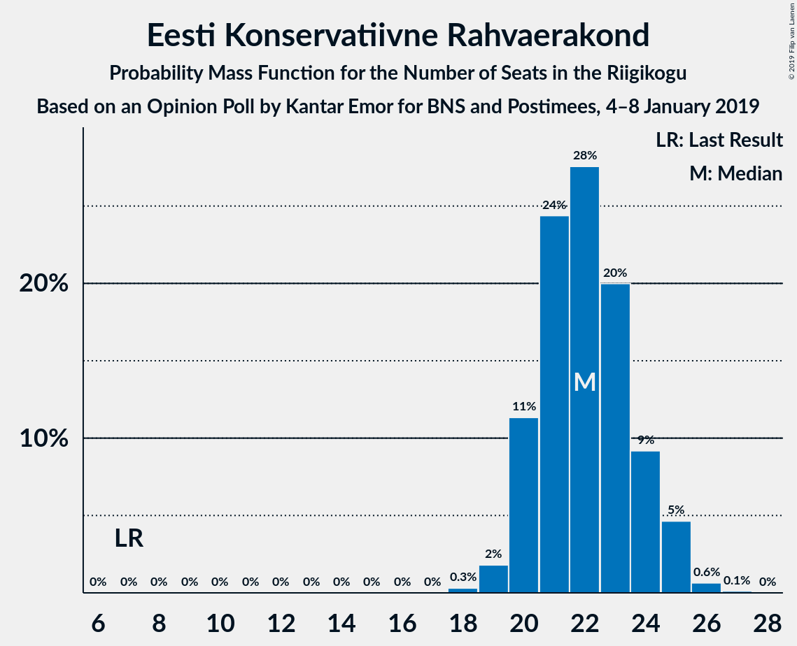

# Opinion Poll by Kantar Emor for BNS and Postimees, 4–8 January 2019

<a href="#voting-intentions">Voting Intentions</a> | <a href="#seats">Seats</a> | <a href="#coalitions">Coalitions</a> | <a href="#technical-information">Technical Information</a>

## Voting Intentions

### Confidence Intervals

| Party | Last Result | Poll Result | 80% Confidence Interval | 90% Confidence Interval | 95% Confidence Interval | 99% Confidence Interval |
|:-----:|:-----------:|:-----------:|:-----------------------:|:-----------------------:|:-----------------------:|:-----------------------:|
| Eesti Reformierakond | 27.7% | 24.4% | 22.9–26.0% |22.5–26.4% |22.2–26.8% |21.5–27.5% |
| Eesti Keskerakond | 24.8% | 23.3% | 21.8–24.8% |21.4–25.3% |21.1–25.6% |20.4–26.4% |
| Eesti Konservatiivne Rahvaerakond | 8.1% | 20.2% | 18.9–21.7% |18.5–22.1% |18.2–22.5% |17.5–23.2% |
| Sotsiaaldemokraatlik Erakond | 15.2% | 11.8% | 10.7–13.0% |10.4–13.3% |10.2–13.6% |9.7–14.2% |
| Erakond Isamaa | 13.7% | 8.0% | 7.1–9.0% |6.9–9.3% |6.6–9.6% |6.2–10.1% |
| Eesti 200 | 0.0% | 6.6% | 5.8–7.5% |5.5–7.8% |5.3–8.0% |5.0–8.5% |
| Erakond Eestimaa Rohelised | 0.9% | 3.0% | 2.5–3.7% |2.3–3.9% |2.2–4.0% |2.0–4.4% |
| Eesti Vabaerakond | 8.7% | 1.4% | 1.1–1.9% |1.0–2.1% |0.9–2.2% |0.8–2.5% |

*Note:* The poll result column reflects the actual value used in the calculations. Published results may vary slightly, and in addition be rounded to fewer digits.

## Seats

### Confidence Intervals

| Party | Last Result | Median | 80% Confidence Interval | 90% Confidence Interval | 95% Confidence Interval | 99% Confidence Interval |
|:-----:|:-----------:|:------:|:-----------------------:|:-----------------------:|:-----------------------:|:-----------------------:|
| <a href="#eesti-reformierakond">Eesti Reformierakond</a> | 30 | 26 | 26 |26 |26–27 |25–29 |
| <a href="#eesti-keskerakond">Eesti Keskerakond</a> | 27 | 24 | 24 |24–25 |24–27 |24–31 |
| <a href="#eesti-konservatiivne-rahvaerakond">Eesti Konservatiivne Rahvaerakond</a> | 7 | 24 | 24 |24 |22–24 |18–26 |
| <a href="#sotsiaaldemokraatlik-erakond">Sotsiaaldemokraatlik Erakond</a> | 15 | 14 | 14 |13–14 |11–14 |11–14 |
| <a href="#erakond-isamaa">Erakond Isamaa</a> | 14 | 7 | 7 |7 |6–7 |5–8 |
| <a href="#eesti-200">Eesti 200</a> | 0 | 6 | 6 |6 |6 |5–8 |
| <a href="#erakond-eestimaa-rohelised">Erakond Eestimaa Rohelised</a> | 0 | 0 | 0 |0 |0 |0 |
| <a href="#eesti-vabaerakond">Eesti Vabaerakond</a> | 8 | 0 | 0 |0 |0 |0 |

### Eesti Reformierakond

*For a full overview of the results for this party, see the [Eesti Reformierakond](party-eestireformierakond.html) page.*

| Number of Seats | Probability | Accumulated | Special Marks |
|:---------------:|:-----------:|:-----------:|:-------------:|
| 25 | 2% | 100% |  |
| 26 | 95% | 98% | Median |
| 27 | 1.2% | 3% |  |
| 28 | 0% | 2% |  |
| 29 | 1.3% | 2% |  |
| 30 | 0% | 0.4% | Last Result |
| 31 | 0.1% | 0.4% |  |
| 32 | 0.3% | 0.3% |  |
| 33 | 0% | 0% |  |

### Eesti Keskerakond

*For a full overview of the results for this party, see the [Eesti Keskerakond](party-eestikeskerakond.html) page.*

| Number of Seats | Probability | Accumulated | Special Marks |
|:---------------:|:-----------:|:-----------:|:-------------:|
| 22 | 0.1% | 100% |  |
| 23 | 0% | 99.9% |  |
| 24 | 94% | 99.9% | Median |
| 25 | 0.8% | 6% |  |
| 26 | 0.6% | 5% |  |
| 27 | 3% | 4% | Last Result |
| 28 | 0.4% | 1.2% |  |
| 29 | 0% | 0.8% |  |
| 30 | 0.2% | 0.8% |  |
| 31 | 0.6% | 0.6% |  |
| 32 | 0% | 0% |  |

### Eesti Konservatiivne Rahvaerakond

*For a full overview of the results for this party, see the [Eesti Konservatiivne Rahvaerakond](party-eestikonservatiivnerahvaerakond.html) page.*

| Number of Seats | Probability | Accumulated | Special Marks |
|:---------------:|:-----------:|:-----------:|:-------------:|
| 7 | 0% | 100% | Last Result |
| 8 | 0% | 100% |  |
| 9 | 0% | 100% |  |
| 10 | 0% | 100% |  |
| 11 | 0% | 100% |  |
| 12 | 0% | 100% |  |
| 13 | 0% | 100% |  |
| 14 | 0% | 100% |  |
| 15 | 0% | 100% |  |
| 16 | 0% | 100% |  |
| 17 | 0% | 100% |  |
| 18 | 0.6% | 100% |  |
| 19 | 0.2% | 99.4% |  |
| 20 | 0.4% | 99.2% |  |
| 21 | 0.7% | 98.9% |  |
| 22 | 1.1% | 98% |  |
| 23 | 0.8% | 97% |  |
| 24 | 94% | 96% | Median |
| 25 | 0.4% | 2% |  |
| 26 | 2% | 2% |  |
| 27 | 0% | 0% |  |

### Sotsiaaldemokraatlik Erakond

*For a full overview of the results for this party, see the [Sotsiaaldemokraatlik Erakond](party-sotsiaaldemokraatlikerakond.html) page.*

| Number of Seats | Probability | Accumulated | Special Marks |
|:---------------:|:-----------:|:-----------:|:-------------:|
| 10 | 0.3% | 100% |  |
| 11 | 3% | 99.7% |  |
| 12 | 1.2% | 96% |  |
| 13 | 0.8% | 95% |  |
| 14 | 94% | 94% | Median |
| 15 | 0.1% | 0.4% | Last Result |
| 16 | 0.4% | 0.4% |  |
| 17 | 0% | 0% |  |

### Erakond Isamaa

*For a full overview of the results for this party, see the [Erakond Isamaa](party-erakondisamaa.html) page.*

| Number of Seats | Probability | Accumulated | Special Marks |
|:---------------:|:-----------:|:-----------:|:-------------:|
| 5 | 1.4% | 100% |  |
| 6 | 3% | 98.6% |  |
| 7 | 94% | 95% | Median |
| 8 | 0.7% | 1.1% |  |
| 9 | 0% | 0.3% |  |
| 10 | 0% | 0.3% |  |
| 11 | 0.3% | 0.3% |  |
| 12 | 0% | 0% |  |
| 13 | 0% | 0% |  |
| 14 | 0% | 0% | Last Result |

### Eesti 200

*For a full overview of the results for this party, see the [Eesti 200](party-eesti200.html) page.*

| Number of Seats | Probability | Accumulated | Special Marks |
|:---------------:|:-----------:|:-----------:|:-------------:|
| 0 | 0% | 100% | Last Result |
| 1 | 0% | 100% |  |
| 2 | 0% | 100% |  |
| 3 | 0% | 100% |  |
| 4 | 0% | 100% |  |
| 5 | 2% | 100% |  |
| 6 | 96% | 98% | Median |
| 7 | 1.0% | 2% |  |
| 8 | 0.9% | 0.9% |  |
| 9 | 0.1% | 0.1% |  |
| 10 | 0% | 0% |  |

### Erakond Eestimaa Rohelised

*For a full overview of the results for this party, see the [Erakond Eestimaa Rohelised](party-erakondeestimaarohelised.html) page.*

| Number of Seats | Probability | Accumulated | Special Marks |
|:---------------:|:-----------:|:-----------:|:-------------:|
| 0 | 100% | 100% | Last Result, Median |

### Eesti Vabaerakond

*For a full overview of the results for this party, see the [Eesti Vabaerakond](party-eestivabaerakond.html) page.*

| Number of Seats | Probability | Accumulated | Special Marks |
|:---------------:|:-----------:|:-----------:|:-------------:|
| 0 | 100% | 100% | Median |
| 1 | 0% | 0% |  |
| 2 | 0% | 0% |  |
| 3 | 0% | 0% |  |
| 4 | 0% | 0% |  |
| 5 | 0% | 0% |  |
| 6 | 0% | 0% |  |
| 7 | 0% | 0% |  |
| 8 | 0% | 0% | Last Result |

## Coalitions

### Confidence Intervals

| Coalition | Last Result | Median | Majority? | 80% Confidence Interval | 90% Confidence Interval | 95% Confidence Interval | 99% Confidence Interval |
|:---------:|:-----------:|:------:|:---------:|:-----------------------:|:-----------------------:|:-----------------------:|:-----------------------:|
| Eesti Reformierakond – Eesti Keskerakond – Eesti Konservatiivne Rahvaerakond | 64 | 74 | 100% | 74 | 74 | 74–78 | 74–79 |
| Eesti Reformierakond – Eesti Konservatiivne Rahvaerakond – Erakond Isamaa | 51 | 57 | 100% | 57 | 57 | 55–57 | 52–61 |
| Eesti Reformierakond – Eesti Keskerakond | 57 | 50 | 6% | 50 | 50–52 | 50–54 | 50–57 |
| Eesti Keskerakond – Eesti Konservatiivne Rahvaerakond | 34 | 48 | 3% | 48 | 48 | 48–53 | 45–53 |
| Eesti Reformierakond – Eesti Konservatiivne Rahvaerakond | 37 | 50 | 3% | 50 | 50 | 50–51 | 46–52 |
| Eesti Reformierakond – Sotsiaaldemokraatlik Erakond – Erakond Isamaa – Eesti Vabaerakond | 67 | 47 | 0.3% | 47 | 47 | 43–47 | 42–50 |
| Eesti Reformierakond – Sotsiaaldemokraatlik Erakond – Erakond Isamaa | 59 | 47 | 0.3% | 47 | 47 | 43–47 | 42–50 |
| Eesti Keskerakond – Sotsiaaldemokraatlik Erakond – Erakond Isamaa | 56 | 45 | 0.2% | 45 | 45 | 44–45 | 43–50 |
| Eesti Reformierakond – Sotsiaaldemokraatlik Erakond | 45 | 40 | 0% | 40 | 40 | 38–40 | 36–42 |
| Eesti Keskerakond – Sotsiaaldemokraatlik Erakond | 42 | 38 | 0% | 38 | 38 | 38 | 36–44 |
| Eesti Konservatiivne Rahvaerakond – Sotsiaaldemokraatlik Erakond | 22 | 38 | 0% | 38 | 37–38 | 35–38 | 30–38 |
| Eesti Reformierakond – Erakond Isamaa | 44 | 33 | 0% | 33 | 33 | 31–33 | 31–39 |

### Eesti Reformierakond – Eesti Keskerakond – Eesti Konservatiivne Rahvaerakond

| Number of Seats | Probability | Accumulated | Special Marks |
|:---------------:|:-----------:|:-----------:|:-------------:|
| 64 | 0% | 100% | Last Result |
| 65 | 0% | 100% |  |
| 66 | 0% | 100% |  |
| 67 | 0% | 100% |  |
| 68 | 0% | 100% |  |
| 69 | 0% | 100% |  |
| 70 | 0% | 100% |  |
| 71 | 0.1% | 100% |  |
| 72 | 0% | 99.9% |  |
| 73 | 0% | 99.9% |  |
| 74 | 95% | 99.9% | Median |
| 75 | 1.0% | 5% |  |
| 76 | 0% | 4% |  |
| 77 | 0.6% | 4% |  |
| 78 | 2% | 3% |  |
| 79 | 1.1% | 1.1% |  |
| 80 | 0% | 0% |  |

### Eesti Reformierakond – Eesti Konservatiivne Rahvaerakond – Erakond Isamaa

| Number of Seats | Probability | Accumulated | Special Marks |
|:---------------:|:-----------:|:-----------:|:-------------:|
| 51 | 0% | 100% | Last Result, Majority |
| 52 | 0.5% | 100% |  |
| 53 | 0.6% | 99.4% |  |
| 54 | 0% | 98.8% |  |
| 55 | 1.4% | 98.8% |  |
| 56 | 0.1% | 97% |  |
| 57 | 96% | 97% | Median |
| 58 | 0.5% | 1.1% |  |
| 59 | 0.1% | 0.6% |  |
| 60 | 0% | 0.5% |  |
| 61 | 0.5% | 0.5% |  |
| 62 | 0% | 0% |  |

### Eesti Reformierakond – Eesti Keskerakond

| Number of Seats | Probability | Accumulated | Special Marks |
|:---------------:|:-----------:|:-----------:|:-------------:|
| 49 | 0.1% | 100% |  |
| 50 | 94% | 99.9% | Median |
| 51 | 0% | 6% | Majority |
| 52 | 3% | 6% |  |
| 53 | 0.3% | 3% |  |
| 54 | 0.7% | 3% |  |
| 55 | 0.4% | 2% |  |
| 56 | 0.9% | 2% |  |
| 57 | 0.7% | 0.8% | Last Result |
| 58 | 0.1% | 0.1% |  |
| 59 | 0% | 0% |  |

### Eesti Keskerakond – Eesti Konservatiivne Rahvaerakond

| Number of Seats | Probability | Accumulated | Special Marks |
|:---------------:|:-----------:|:-----------:|:-------------:|
| 34 | 0% | 100% | Last Result |
| 35 | 0% | 100% |  |
| 36 | 0% | 100% |  |
| 37 | 0% | 100% |  |
| 38 | 0% | 100% |  |
| 39 | 0% | 100% |  |
| 40 | 0% | 100% |  |
| 41 | 0% | 100% |  |
| 42 | 0% | 100% |  |
| 43 | 0% | 100% |  |
| 44 | 0.1% | 100% |  |
| 45 | 1.1% | 99.9% |  |
| 46 | 0% | 98.8% |  |
| 47 | 0.2% | 98.8% |  |
| 48 | 95% | 98.7% | Median |
| 49 | 0.3% | 3% |  |
| 50 | 0% | 3% |  |
| 51 | 0% | 3% | Majority |
| 52 | 0.4% | 3% |  |
| 53 | 3% | 3% |  |
| 54 | 0% | 0% |  |

### Eesti Reformierakond – Eesti Konservatiivne Rahvaerakond

| Number of Seats | Probability | Accumulated | Special Marks |
|:---------------:|:-----------:|:-----------:|:-------------:|
| 37 | 0% | 100% | Last Result |
| 38 | 0% | 100% |  |
| 39 | 0% | 100% |  |
| 40 | 0% | 100% |  |
| 41 | 0% | 100% |  |
| 42 | 0% | 100% |  |
| 43 | 0% | 100% |  |
| 44 | 0% | 100% |  |
| 45 | 0.2% | 100% |  |
| 46 | 0.3% | 99.8% |  |
| 47 | 0.6% | 99.4% |  |
| 48 | 0.6% | 98.9% |  |
| 49 | 0.1% | 98% |  |
| 50 | 95% | 98% | Median |
| 51 | 3% | 3% | Majority |
| 52 | 0.5% | 0.8% |  |
| 53 | 0.2% | 0.3% |  |
| 54 | 0% | 0% |  |

### Eesti Reformierakond – Sotsiaaldemokraatlik Erakond – Erakond Isamaa – Eesti Vabaerakond

| Number of Seats | Probability | Accumulated | Special Marks |
|:---------------:|:-----------:|:-----------:|:-------------:|
| 42 | 2% | 100% |  |
| 43 | 0.7% | 98% |  |
| 44 | 0.4% | 97% |  |
| 45 | 0.8% | 97% |  |
| 46 | 0.4% | 96% |  |
| 47 | 94% | 96% | Median |
| 48 | 0.5% | 2% |  |
| 49 | 0.7% | 1.3% |  |
| 50 | 0.3% | 0.6% |  |
| 51 | 0.2% | 0.3% | Majority |
| 52 | 0% | 0% |  |
| 53 | 0% | 0% |  |
| 54 | 0% | 0% |  |
| 55 | 0% | 0% |  |
| 56 | 0% | 0% |  |
| 57 | 0% | 0% |  |
| 58 | 0% | 0% |  |
| 59 | 0% | 0% |  |
| 60 | 0% | 0% |  |
| 61 | 0% | 0% |  |
| 62 | 0% | 0% |  |
| 63 | 0% | 0% |  |
| 64 | 0% | 0% |  |
| 65 | 0% | 0% |  |
| 66 | 0% | 0% |  |
| 67 | 0% | 0% | Last Result |

### Eesti Reformierakond – Sotsiaaldemokraatlik Erakond – Erakond Isamaa

| Number of Seats | Probability | Accumulated | Special Marks |
|:---------------:|:-----------:|:-----------:|:-------------:|
| 42 | 2% | 100% |  |
| 43 | 0.7% | 98% |  |
| 44 | 0.4% | 97% |  |
| 45 | 0.8% | 97% |  |
| 46 | 0.4% | 96% |  |
| 47 | 94% | 96% | Median |
| 48 | 0.5% | 2% |  |
| 49 | 0.7% | 1.3% |  |
| 50 | 0.3% | 0.6% |  |
| 51 | 0.2% | 0.3% | Majority |
| 52 | 0% | 0% |  |
| 53 | 0% | 0% |  |
| 54 | 0% | 0% |  |
| 55 | 0% | 0% |  |
| 56 | 0% | 0% |  |
| 57 | 0% | 0% |  |
| 58 | 0% | 0% |  |
| 59 | 0% | 0% | Last Result |

### Eesti Keskerakond – Sotsiaaldemokraatlik Erakond – Erakond Isamaa

| Number of Seats | Probability | Accumulated | Special Marks |
|:---------------:|:-----------:|:-----------:|:-------------:|
| 43 | 2% | 100% |  |
| 44 | 3% | 98% |  |
| 45 | 94% | 96% | Median |
| 46 | 0% | 2% |  |
| 47 | 0.6% | 2% |  |
| 48 | 0.6% | 1.2% |  |
| 49 | 0% | 0.6% |  |
| 50 | 0.3% | 0.6% |  |
| 51 | 0.2% | 0.2% | Majority |
| 52 | 0% | 0% |  |
| 53 | 0% | 0% |  |
| 54 | 0% | 0% |  |
| 55 | 0% | 0% |  |
| 56 | 0% | 0% | Last Result |

### Eesti Reformierakond – Sotsiaaldemokraatlik Erakond

| Number of Seats | Probability | Accumulated | Special Marks |
|:---------------:|:-----------:|:-----------:|:-------------:|
| 36 | 2% | 100% |  |
| 37 | 0.1% | 98% |  |
| 38 | 1.0% | 98% |  |
| 39 | 0.3% | 97% |  |
| 40 | 95% | 97% | Median |
| 41 | 0.6% | 1.4% |  |
| 42 | 0.6% | 0.9% |  |
| 43 | 0.2% | 0.3% |  |
| 44 | 0% | 0.1% |  |
| 45 | 0% | 0% | Last Result |

### Eesti Keskerakond – Sotsiaaldemokraatlik Erakond

| Number of Seats | Probability | Accumulated | Special Marks |
|:---------------:|:-----------:|:-----------:|:-------------:|
| 34 | 0.3% | 100% |  |
| 35 | 0.2% | 99.7% |  |
| 36 | 0% | 99.5% |  |
| 37 | 0.7% | 99.5% |  |
| 38 | 97% | 98.8% | Median |
| 39 | 0.6% | 2% |  |
| 40 | 0.1% | 1.2% |  |
| 41 | 0% | 1.2% |  |
| 42 | 0% | 1.2% | Last Result |
| 43 | 0.6% | 1.2% |  |
| 44 | 0.6% | 0.6% |  |
| 45 | 0% | 0% |  |

### Eesti Konservatiivne Rahvaerakond – Sotsiaaldemokraatlik Erakond

| Number of Seats | Probability | Accumulated | Special Marks |
|:---------------:|:-----------:|:-----------:|:-------------:|
| 22 | 0% | 100% | Last Result |
| 23 | 0% | 100% |  |
| 24 | 0% | 100% |  |
| 25 | 0% | 100% |  |
| 26 | 0% | 100% |  |
| 27 | 0% | 100% |  |
| 28 | 0% | 100% |  |
| 29 | 0% | 100% |  |
| 30 | 0.6% | 100% |  |
| 31 | 0.3% | 99.4% |  |
| 32 | 0.4% | 99.1% |  |
| 33 | 0.6% | 98.8% |  |
| 34 | 0.6% | 98% |  |
| 35 | 0% | 98% |  |
| 36 | 2% | 97% |  |
| 37 | 2% | 96% |  |
| 38 | 94% | 94% | Median |
| 39 | 0% | 0% |  |

### Eesti Reformierakond – Erakond Isamaa

| Number of Seats | Probability | Accumulated | Special Marks |
|:---------------:|:-----------:|:-----------:|:-------------:|
| 31 | 3% | 100% |  |
| 32 | 1.1% | 97% |  |
| 33 | 94% | 96% | Median |
| 34 | 0.1% | 2% |  |
| 35 | 0.5% | 2% |  |
| 36 | 0% | 1.3% |  |
| 37 | 0.7% | 1.3% |  |
| 38 | 0.1% | 0.6% |  |
| 39 | 0% | 0.5% |  |
| 40 | 0.5% | 0.5% |  |
| 41 | 0% | 0% |  |
| 42 | 0% | 0% |  |
| 43 | 0% | 0% |  |
| 44 | 0% | 0% | Last Result |

## Technical Information

### Opinion Poll

+ **Polling firm:** Kantar Emor
+ **Commissioner(s):** BNS and Postimees
+ **Fieldwork period:** 4–8 January 2019

### Calculations

+ **Sample size:** 1340
+ **Simulations done:** 1,024
+ **Error estimate:** 2.74%

