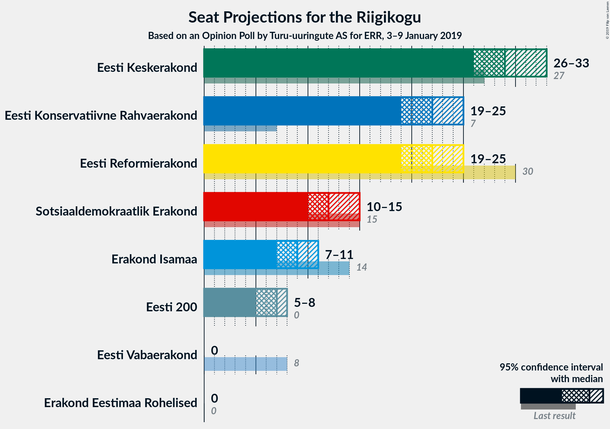
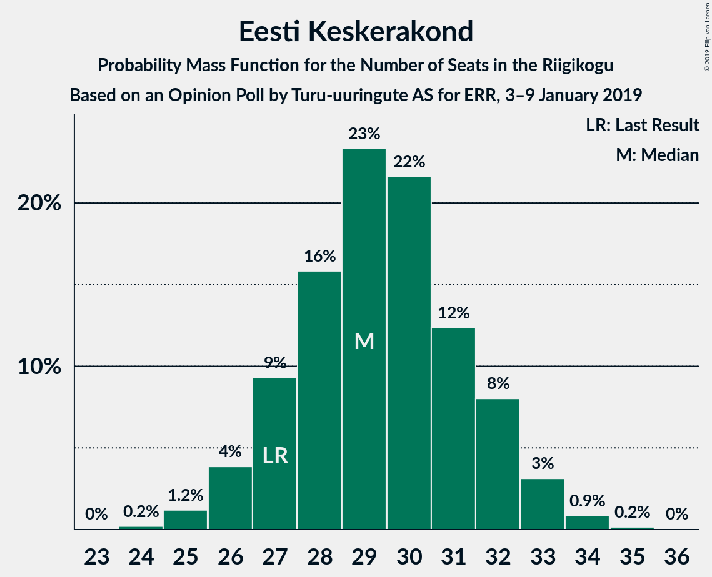
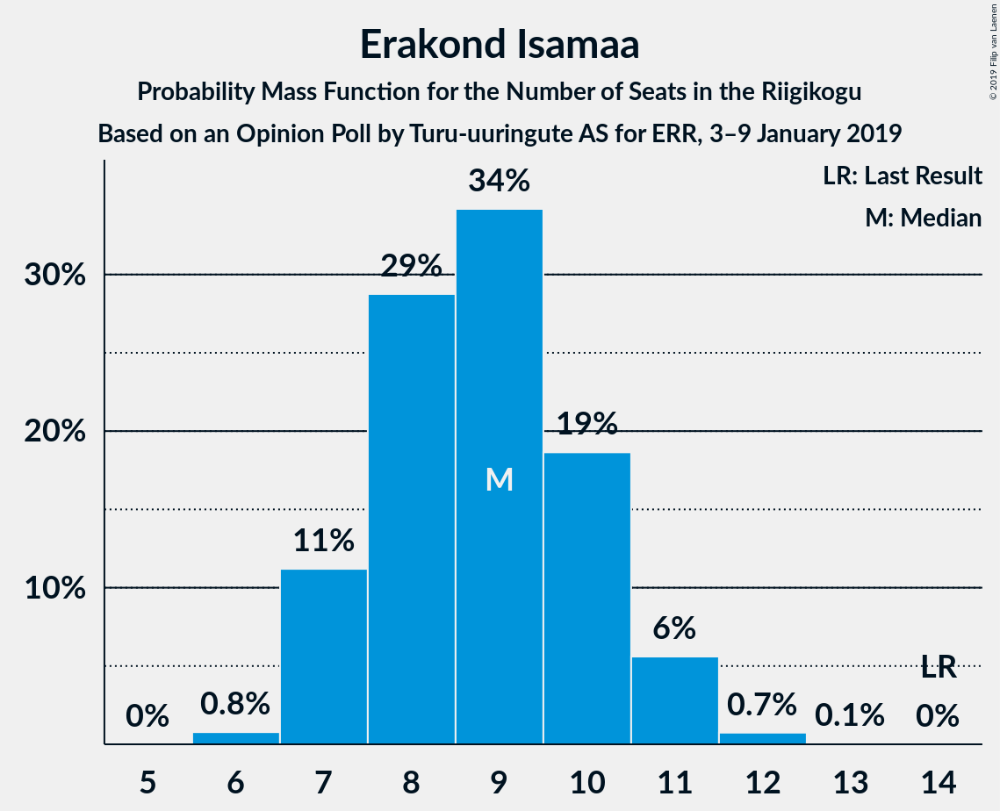
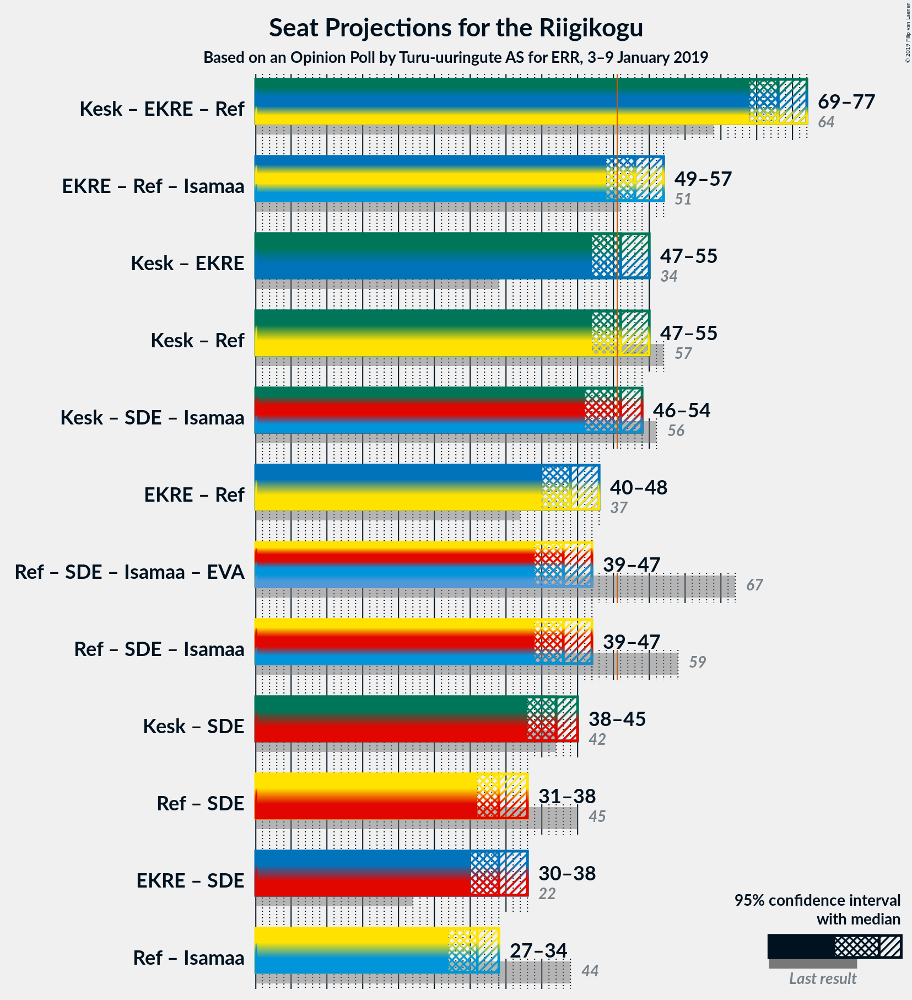

# Opinion Poll by Turu-uuringute AS for ERR, 3–9 January 2019

<a href="#voting-intentions">Voting Intentions</a> | <a href="#seats">Seats</a> | <a href="#coalitions">Coalitions</a> | <a href="#technical-information">Technical Information</a>

## Voting Intentions

### Confidence Intervals

| Party | Last Result | Poll Result | 80% Confidence Interval | 90% Confidence Interval | 95% Confidence Interval | 99% Confidence Interval |
|:-----:|:-----------:|:-----------:|:-----------------------:|:-----------------------:|:-----------------------:|:-----------------------:|
| Eesti Keskerakond | 24.8% | 26.0% | 24.2–27.8% |23.8–28.3% |23.4–28.8% |22.5–29.7% |
| Eesti Reformierakond | 27.7% | 20.0% | 18.5–21.7% |18.0–22.2% |17.7–22.6% |16.9–23.4% |
| Eesti Konservatiivne Rahvaerakond | 8.1% | 20.0% | 18.5–21.7% |18.0–22.2% |17.7–22.6% |16.9–23.4% |
| Sotsiaaldemokraatlik Erakond | 15.2% | 12.0% | 10.8–13.4% |10.4–13.8% |10.1–14.1% |9.6–14.8% |
| Erakond Isamaa | 13.7% | 9.0% | 8.0–10.3% |7.7–10.6% |7.4–11.0% |6.9–11.6% |
| Eesti 200 | 0.0% | 7.0% | 6.1–8.2% |5.8–8.5% |5.6–8.8% |5.2–9.4% |
| Eesti Vabaerakond | 8.7% | 1.0% | 0.7–1.5% |0.6–1.7% |0.5–1.8% |0.4–2.1% |
| Erakond Eestimaa Rohelised | 0.9% | 1.0% | 0.7–1.5% |0.6–1.7% |0.5–1.8% |0.4–2.1% |

*Note:* The poll result column reflects the actual value used in the calculations. Published results may vary slightly, and in addition be rounded to fewer digits.

## Seats

### Confidence Intervals

| Party | Last Result | Median | 80% Confidence Interval | 90% Confidence Interval | 95% Confidence Interval | 99% Confidence Interval |
|:-----:|:-----------:|:------:|:-----------------------:|:-----------------------:|:-----------------------:|:-----------------------:|
| <a href="#eesti-keskerakond">Eesti Keskerakond</a> | 27 | 30 | 27–32 |26–34 |26–34 |25–35 |
| <a href="#eesti-reformierakond">Eesti Reformierakond</a> | 30 | 23 | 20–26 |20–27 |18–27 |18–28 |
| <a href="#eesti-konservatiivne-rahvaerakond">Eesti Konservatiivne Rahvaerakond</a> | 7 | 19 | 17–23 |17–23 |17–24 |16–25 |
| <a href="#sotsiaaldemokraatlik-erakond">Sotsiaaldemokraatlik Erakond</a> | 15 | 12 | 10–16 |9–16 |9–16 |9–16 |
| <a href="#erakond-isamaa">Erakond Isamaa</a> | 14 | 8 | 6–11 |5–11 |5–12 |5–12 |
| <a href="#eesti-200">Eesti 200</a> | 0 | 7 | 6–9 |5–9 |5–9 |5–9 |
| <a href="#eesti-vabaerakond">Eesti Vabaerakond</a> | 8 | 0 | 0 |0 |0 |0 |
| <a href="#erakond-eestimaa-rohelised">Erakond Eestimaa Rohelised</a> | 0 | 0 | 0 |0 |0 |0 |

### Eesti Keskerakond

*For a full overview of the results for this party, see the [Eesti Keskerakond](party-eestikeskerakond.html) page.*

| Number of Seats | Probability | Accumulated | Special Marks |
|:---------------:|:-----------:|:-----------:|:-------------:|
| 23 | 0% | 100% |  |
| 24 | 0.1% | 99.9% |  |
| 25 | 0.6% | 99.9% |  |
| 26 | 9% | 99.2% |  |
| 27 | 2% | 90% | Last Result |
| 28 | 15% | 88% |  |
| 29 | 15% | 73% |  |
| 30 | 12% | 59% | Median |
| 31 | 34% | 47% |  |
| 32 | 5% | 12% |  |
| 33 | 0.2% | 7% |  |
| 34 | 6% | 7% |  |
| 35 | 0.9% | 1.0% |  |
| 36 | 0% | 0.1% |  |
| 37 | 0.1% | 0.1% |  |
| 38 | 0% | 0% |  |

### Eesti Reformierakond

*For a full overview of the results for this party, see the [Eesti Reformierakond](party-eestireformierakond.html) page.*

| Number of Seats | Probability | Accumulated | Special Marks |
|:---------------:|:-----------:|:-----------:|:-------------:|
| 16 | 0.1% | 100% |  |
| 17 | 0.1% | 99.9% |  |
| 18 | 3% | 99.8% |  |
| 19 | 0.3% | 96% |  |
| 20 | 7% | 96% |  |
| 21 | 12% | 89% |  |
| 22 | 15% | 78% |  |
| 23 | 15% | 62% | Median |
| 24 | 0.3% | 48% |  |
| 25 | 34% | 47% |  |
| 26 | 4% | 14% |  |
| 27 | 7% | 9% |  |
| 28 | 2% | 2% |  |
| 29 | 0% | 0% |  |
| 30 | 0% | 0% | Last Result |

### Eesti Konservatiivne Rahvaerakond

*For a full overview of the results for this party, see the [Eesti Konservatiivne Rahvaerakond](party-eestikonservatiivnerahvaerakond.html) page.*

| Number of Seats | Probability | Accumulated | Special Marks |
|:---------------:|:-----------:|:-----------:|:-------------:|
| 7 | 0% | 100% | Last Result |
| 8 | 0% | 100% |  |
| 9 | 0% | 100% |  |
| 10 | 0% | 100% |  |
| 11 | 0% | 100% |  |
| 12 | 0% | 100% |  |
| 13 | 0% | 100% |  |
| 14 | 0% | 100% |  |
| 15 | 0% | 100% |  |
| 16 | 2% | 100% |  |
| 17 | 9% | 98% |  |
| 18 | 29% | 89% |  |
| 19 | 23% | 60% | Median |
| 20 | 8% | 37% |  |
| 21 | 0.1% | 29% |  |
| 22 | 15% | 29% |  |
| 23 | 11% | 14% |  |
| 24 | 1.3% | 3% |  |
| 25 | 2% | 2% |  |
| 26 | 0% | 0.2% |  |
| 27 | 0% | 0.2% |  |
| 28 | 0.1% | 0.1% |  |
| 29 | 0% | 0% |  |

### Sotsiaaldemokraatlik Erakond

*For a full overview of the results for this party, see the [Sotsiaaldemokraatlik Erakond](party-sotsiaaldemokraatlikerakond.html) page.*

| Number of Seats | Probability | Accumulated | Special Marks |
|:---------------:|:-----------:|:-----------:|:-------------:|
| 9 | 8% | 100% |  |
| 10 | 3% | 92% |  |
| 11 | 21% | 89% |  |
| 12 | 30% | 67% | Median |
| 13 | 10% | 37% |  |
| 14 | 9% | 28% |  |
| 15 | 1.2% | 19% | Last Result |
| 16 | 18% | 18% |  |
| 17 | 0.1% | 0.1% |  |
| 18 | 0% | 0% |  |

### Erakond Isamaa

*For a full overview of the results for this party, see the [Erakond Isamaa](party-erakondisamaa.html) page.*

| Number of Seats | Probability | Accumulated | Special Marks |
|:---------------:|:-----------:|:-----------:|:-------------:|
| 5 | 6% | 100% |  |
| 6 | 31% | 94% |  |
| 7 | 8% | 63% |  |
| 8 | 21% | 55% | Median |
| 9 | 16% | 33% |  |
| 10 | 3% | 17% |  |
| 11 | 12% | 15% |  |
| 12 | 2% | 3% |  |
| 13 | 0.1% | 0.5% |  |
| 14 | 0.3% | 0.4% | Last Result |
| 15 | 0% | 0% |  |

### Eesti 200

*For a full overview of the results for this party, see the [Eesti 200](party-eesti200.html) page.*

| Number of Seats | Probability | Accumulated | Special Marks |
|:---------------:|:-----------:|:-----------:|:-------------:|
| 0 | 0% | 100% | Last Result |
| 1 | 0% | 100% |  |
| 2 | 0% | 100% |  |
| 3 | 0% | 100% |  |
| 4 | 0% | 100% |  |
| 5 | 7% | 100% |  |
| 6 | 25% | 93% |  |
| 7 | 27% | 67% | Median |
| 8 | 13% | 40% |  |
| 9 | 27% | 27% |  |
| 10 | 0.3% | 0.3% |  |
| 11 | 0% | 0% |  |

### Eesti Vabaerakond

*For a full overview of the results for this party, see the [Eesti Vabaerakond](party-eestivabaerakond.html) page.*

| Number of Seats | Probability | Accumulated | Special Marks |
|:---------------:|:-----------:|:-----------:|:-------------:|
| 0 | 100% | 100% | Median |
| 1 | 0% | 0% |  |
| 2 | 0% | 0% |  |
| 3 | 0% | 0% |  |
| 4 | 0% | 0% |  |
| 5 | 0% | 0% |  |
| 6 | 0% | 0% |  |
| 7 | 0% | 0% |  |
| 8 | 0% | 0% | Last Result |

### Erakond Eestimaa Rohelised

*For a full overview of the results for this party, see the [Erakond Eestimaa Rohelised](party-erakondeestimaarohelised.html) page.*

| Number of Seats | Probability | Accumulated | Special Marks |
|:---------------:|:-----------:|:-----------:|:-------------:|
| 0 | 100% | 100% | Last Result, Median |

## Coalitions

### Confidence Intervals

| Coalition | Last Result | Median | Majority? | 80% Confidence Interval | 90% Confidence Interval | 95% Confidence Interval | 99% Confidence Interval |
|:---------:|:-----------:|:------:|:---------:|:-----------------------:|:-----------------------:|:-----------------------:|:-----------------------:|
| Eesti Keskerakond – Eesti Konservatiivne Rahvaerakond – Eesti Reformierakond | 64 | 74 | 100% | 70–76 | 69–76 | 67–76 | 67–76 |
| Eesti Keskerakond – Eesti Reformierakond | 57 | 53 | 82% | 49–56 | 48–57 | 47–57 | 47–57 |
| Eesti Konservatiivne Rahvaerakond – Eesti Reformierakond – Erakond Isamaa | 51 | 51 | 56% | 48–53 | 47–56 | 47–56 | 45–58 |
| Eesti Keskerakond – Sotsiaaldemokraatlik Erakond – Erakond Isamaa | 56 | 49 | 32% | 48–54 | 48–54 | 45–56 | 43–57 |
| Eesti Keskerakond – Eesti Konservatiivne Rahvaerakond | 34 | 49 | 30% | 47–53 | 45–54 | 45–54 | 45–55 |
| Eesti Reformierakond – Sotsiaaldemokraatlik Erakond – Erakond Isamaa – Eesti Vabaerakond | 67 | 43 | 0% | 41–46 | 41–46 | 40–49 | 39–49 |
| Eesti Reformierakond – Sotsiaaldemokraatlik Erakond – Erakond Isamaa | 59 | 43 | 0% | 41–46 | 41–46 | 40–49 | 39–49 |
| Eesti Keskerakond – Sotsiaaldemokraatlik Erakond | 42 | 42 | 0% | 39–46 | 38–48 | 37–48 | 35–48 |
| Eesti Konservatiivne Rahvaerakond – Eesti Reformierakond | 37 | 43 | 0% | 40–47 | 40–47 | 36–47 | 36–50 |
| Eesti Reformierakond – Sotsiaaldemokraatlik Erakond | 45 | 37 | 0% | 31–39 | 31–40 | 30–40 | 29–40 |
| Eesti Konservatiivne Rahvaerakond – Sotsiaaldemokraatlik Erakond | 22 | 32 | 0% | 28–36 | 28–38 | 28–38 | 28–38 |
| Eesti Reformierakond – Erakond Isamaa | 44 | 31 | 0% | 29–34 | 28–35 | 28–37 | 26–37 |

### Eesti Keskerakond – Eesti Konservatiivne Rahvaerakond – Eesti Reformierakond

| Number of Seats | Probability | Accumulated | Special Marks |
|:---------------:|:-----------:|:-----------:|:-------------:|
| 64 | 0% | 100% | Last Result |
| 65 | 0.1% | 100% |  |
| 66 | 0.2% | 99.9% |  |
| 67 | 2% | 99.8% |  |
| 68 | 0.3% | 97% |  |
| 69 | 3% | 97% |  |
| 70 | 19% | 94% |  |
| 71 | 13% | 75% |  |
| 72 | 0.4% | 62% | Median |
| 73 | 11% | 62% |  |
| 74 | 25% | 50% |  |
| 75 | 3% | 26% |  |
| 76 | 22% | 22% |  |
| 77 | 0.3% | 0.3% |  |
| 78 | 0% | 0% |  |

### Eesti Keskerakond – Eesti Reformierakond

| Number of Seats | Probability | Accumulated | Special Marks |
|:---------------:|:-----------:|:-----------:|:-------------:|
| 44 | 0.1% | 100% |  |
| 45 | 0% | 99.9% |  |
| 46 | 0.2% | 99.8% |  |
| 47 | 3% | 99.7% |  |
| 48 | 4% | 97% |  |
| 49 | 10% | 93% |  |
| 50 | 0.7% | 83% |  |
| 51 | 15% | 82% | Majority |
| 52 | 2% | 67% |  |
| 53 | 16% | 65% | Median |
| 54 | 5% | 49% |  |
| 55 | 4% | 44% |  |
| 56 | 34% | 39% |  |
| 57 | 6% | 6% | Last Result |
| 58 | 0% | 0% |  |

### Eesti Konservatiivne Rahvaerakond – Eesti Reformierakond – Erakond Isamaa

| Number of Seats | Probability | Accumulated | Special Marks |
|:---------------:|:-----------:|:-----------:|:-------------:|
| 42 | 0.1% | 100% |  |
| 43 | 0% | 99.9% |  |
| 44 | 0% | 99.9% |  |
| 45 | 0.4% | 99.9% |  |
| 46 | 0.1% | 99.5% |  |
| 47 | 6% | 99.3% |  |
| 48 | 12% | 94% |  |
| 49 | 25% | 82% |  |
| 50 | 1.1% | 57% | Median |
| 51 | 13% | 56% | Last Result, Majority |
| 52 | 14% | 43% |  |
| 53 | 19% | 29% |  |
| 54 | 4% | 10% |  |
| 55 | 0.4% | 6% |  |
| 56 | 3% | 6% |  |
| 57 | 1.3% | 2% |  |
| 58 | 1.0% | 1.0% |  |
| 59 | 0% | 0% |  |

### Eesti Keskerakond – Sotsiaaldemokraatlik Erakond – Erakond Isamaa

| Number of Seats | Probability | Accumulated | Special Marks |
|:---------------:|:-----------:|:-----------:|:-------------:|
| 43 | 0.6% | 100% |  |
| 44 | 0% | 99.4% |  |
| 45 | 3% | 99.4% |  |
| 46 | 0.3% | 97% |  |
| 47 | 0.1% | 96% |  |
| 48 | 18% | 96% |  |
| 49 | 38% | 78% |  |
| 50 | 8% | 40% | Median |
| 51 | 0.6% | 32% | Majority |
| 52 | 11% | 31% |  |
| 53 | 6% | 20% |  |
| 54 | 10% | 14% |  |
| 55 | 1.3% | 5% |  |
| 56 | 0.8% | 3% | Last Result |
| 57 | 2% | 2% |  |
| 58 | 0% | 0% |  |

### Eesti Keskerakond – Eesti Konservatiivne Rahvaerakond

| Number of Seats | Probability | Accumulated | Special Marks |
|:---------------:|:-----------:|:-----------:|:-------------:|
| 34 | 0% | 100% | Last Result |
| 35 | 0% | 100% |  |
| 36 | 0% | 100% |  |
| 37 | 0% | 100% |  |
| 38 | 0% | 100% |  |
| 39 | 0% | 100% |  |
| 40 | 0% | 100% |  |
| 41 | 0% | 100% |  |
| 42 | 0% | 100% |  |
| 43 | 0.1% | 100% |  |
| 44 | 0% | 99.9% |  |
| 45 | 9% | 99.9% |  |
| 46 | 0.3% | 91% |  |
| 47 | 9% | 91% |  |
| 48 | 9% | 82% |  |
| 49 | 42% | 73% | Median |
| 50 | 1.0% | 31% |  |
| 51 | 12% | 30% | Majority |
| 52 | 2% | 18% |  |
| 53 | 6% | 16% |  |
| 54 | 9% | 10% |  |
| 55 | 1.0% | 1.2% |  |
| 56 | 0% | 0.1% |  |
| 57 | 0.1% | 0.1% |  |
| 58 | 0% | 0% |  |

### Eesti Reformierakond – Sotsiaaldemokraatlik Erakond – Erakond Isamaa – Eesti Vabaerakond

| Number of Seats | Probability | Accumulated | Special Marks |
|:---------------:|:-----------:|:-----------:|:-------------:|
| 37 | 0.1% | 100% |  |
| 38 | 0.2% | 99.9% |  |
| 39 | 2% | 99.7% |  |
| 40 | 2% | 98% |  |
| 41 | 12% | 95% |  |
| 42 | 11% | 83% |  |
| 43 | 26% | 72% | Median |
| 44 | 3% | 46% |  |
| 45 | 19% | 43% |  |
| 46 | 20% | 24% |  |
| 47 | 0% | 3% |  |
| 48 | 0% | 3% |  |
| 49 | 3% | 3% |  |
| 50 | 0.1% | 0.1% |  |
| 51 | 0% | 0% | Majority |
| 52 | 0% | 0% |  |
| 53 | 0% | 0% |  |
| 54 | 0% | 0% |  |
| 55 | 0% | 0% |  |
| 56 | 0% | 0% |  |
| 57 | 0% | 0% |  |
| 58 | 0% | 0% |  |
| 59 | 0% | 0% |  |
| 60 | 0% | 0% |  |
| 61 | 0% | 0% |  |
| 62 | 0% | 0% |  |
| 63 | 0% | 0% |  |
| 64 | 0% | 0% |  |
| 65 | 0% | 0% |  |
| 66 | 0% | 0% |  |
| 67 | 0% | 0% | Last Result |

### Eesti Reformierakond – Sotsiaaldemokraatlik Erakond – Erakond Isamaa

| Number of Seats | Probability | Accumulated | Special Marks |
|:---------------:|:-----------:|:-----------:|:-------------:|
| 37 | 0.1% | 100% |  |
| 38 | 0.2% | 99.9% |  |
| 39 | 2% | 99.7% |  |
| 40 | 2% | 98% |  |
| 41 | 12% | 95% |  |
| 42 | 11% | 83% |  |
| 43 | 26% | 72% | Median |
| 44 | 3% | 46% |  |
| 45 | 19% | 43% |  |
| 46 | 20% | 24% |  |
| 47 | 0% | 3% |  |
| 48 | 0% | 3% |  |
| 49 | 3% | 3% |  |
| 50 | 0.1% | 0.1% |  |
| 51 | 0% | 0% | Majority |
| 52 | 0% | 0% |  |
| 53 | 0% | 0% |  |
| 54 | 0% | 0% |  |
| 55 | 0% | 0% |  |
| 56 | 0% | 0% |  |
| 57 | 0% | 0% |  |
| 58 | 0% | 0% |  |
| 59 | 0% | 0% | Last Result |

### Eesti Keskerakond – Sotsiaaldemokraatlik Erakond

| Number of Seats | Probability | Accumulated | Special Marks |
|:---------------:|:-----------:|:-----------:|:-------------:|
| 35 | 0.6% | 100% |  |
| 36 | 2% | 99.4% |  |
| 37 | 1.1% | 98% |  |
| 38 | 2% | 97% |  |
| 39 | 8% | 95% |  |
| 40 | 8% | 87% |  |
| 41 | 12% | 79% |  |
| 42 | 22% | 67% | Last Result, Median |
| 43 | 25% | 45% |  |
| 44 | 1.0% | 20% |  |
| 45 | 2% | 19% |  |
| 46 | 11% | 17% |  |
| 47 | 0.2% | 6% |  |
| 48 | 6% | 6% |  |
| 49 | 0% | 0% |  |

### Eesti Konservatiivne Rahvaerakond – Eesti Reformierakond

| Number of Seats | Probability | Accumulated | Special Marks |
|:---------------:|:-----------:|:-----------:|:-------------:|
| 34 | 0.1% | 100% |  |
| 35 | 0% | 99.9% |  |
| 36 | 3% | 99.9% |  |
| 37 | 0.2% | 97% | Last Result |
| 38 | 0.1% | 97% |  |
| 39 | 0.1% | 97% |  |
| 40 | 13% | 97% |  |
| 41 | 6% | 84% |  |
| 42 | 14% | 77% | Median |
| 43 | 30% | 63% |  |
| 44 | 5% | 34% |  |
| 45 | 16% | 28% |  |
| 46 | 0.4% | 12% |  |
| 47 | 10% | 12% |  |
| 48 | 0.6% | 2% |  |
| 49 | 0.2% | 1.1% |  |
| 50 | 1.0% | 1.0% |  |
| 51 | 0% | 0% | Majority |

### Eesti Reformierakond – Sotsiaaldemokraatlik Erakond

| Number of Seats | Probability | Accumulated | Special Marks |
|:---------------:|:-----------:|:-----------:|:-------------:|
| 28 | 0.2% | 100% |  |
| 29 | 0.4% | 99.8% |  |
| 30 | 3% | 99.5% |  |
| 31 | 11% | 97% |  |
| 32 | 0.5% | 86% |  |
| 33 | 11% | 85% |  |
| 34 | 2% | 74% |  |
| 35 | 1.2% | 72% | Median |
| 36 | 9% | 71% |  |
| 37 | 44% | 62% |  |
| 38 | 1.1% | 18% |  |
| 39 | 8% | 17% |  |
| 40 | 9% | 9% |  |
| 41 | 0% | 0.1% |  |
| 42 | 0.1% | 0.1% |  |
| 43 | 0% | 0% |  |
| 44 | 0% | 0% |  |
| 45 | 0% | 0% | Last Result |

### Eesti Konservatiivne Rahvaerakond – Sotsiaaldemokraatlik Erakond

| Number of Seats | Probability | Accumulated | Special Marks |
|:---------------:|:-----------:|:-----------:|:-------------:|
| 22 | 0% | 100% | Last Result |
| 23 | 0% | 100% |  |
| 24 | 0% | 100% |  |
| 25 | 0% | 100% |  |
| 26 | 0% | 100% |  |
| 27 | 0% | 100% |  |
| 28 | 14% | 100% |  |
| 29 | 4% | 86% |  |
| 30 | 27% | 83% |  |
| 31 | 5% | 56% | Median |
| 32 | 2% | 50% |  |
| 33 | 14% | 48% |  |
| 34 | 11% | 34% |  |
| 35 | 11% | 23% |  |
| 36 | 4% | 12% |  |
| 37 | 0.2% | 9% |  |
| 38 | 8% | 9% |  |
| 39 | 0% | 0.3% |  |
| 40 | 0.3% | 0.3% |  |
| 41 | 0% | 0% |  |

### Eesti Reformierakond – Erakond Isamaa

| Number of Seats | Probability | Accumulated | Special Marks |
|:---------------:|:-----------:|:-----------:|:-------------:|
| 25 | 0.2% | 100% |  |
| 26 | 0.4% | 99.8% |  |
| 27 | 0.1% | 99.4% |  |
| 28 | 7% | 99.4% |  |
| 29 | 14% | 93% |  |
| 30 | 16% | 78% |  |
| 31 | 29% | 62% | Median |
| 32 | 4% | 33% |  |
| 33 | 12% | 29% |  |
| 34 | 10% | 17% |  |
| 35 | 4% | 7% |  |
| 36 | 0% | 3% |  |
| 37 | 3% | 3% |  |
| 38 | 0% | 0% |  |
| 39 | 0% | 0% |  |
| 40 | 0% | 0% |  |
| 41 | 0% | 0% |  |
| 42 | 0% | 0% |  |
| 43 | 0% | 0% |  |
| 44 | 0% | 0% | Last Result |

## Technical Information

### Opinion Poll

+ **Polling firm:** Turu-uuringute AS
+ **Commissioner(s):** ERR
+ **Fieldwork period:** 3–9 January 2019

### Calculations

+ **Sample size:** 1009
+ **Simulations done:** 1,024
+ **Error estimate:** 2.62%

