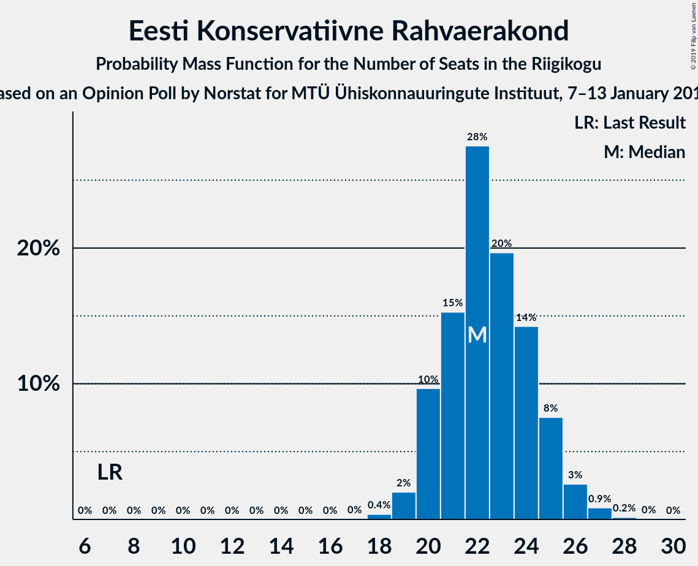
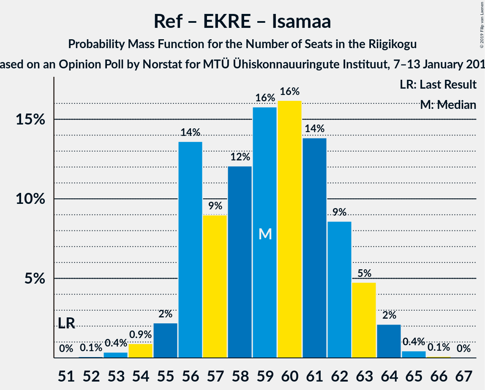
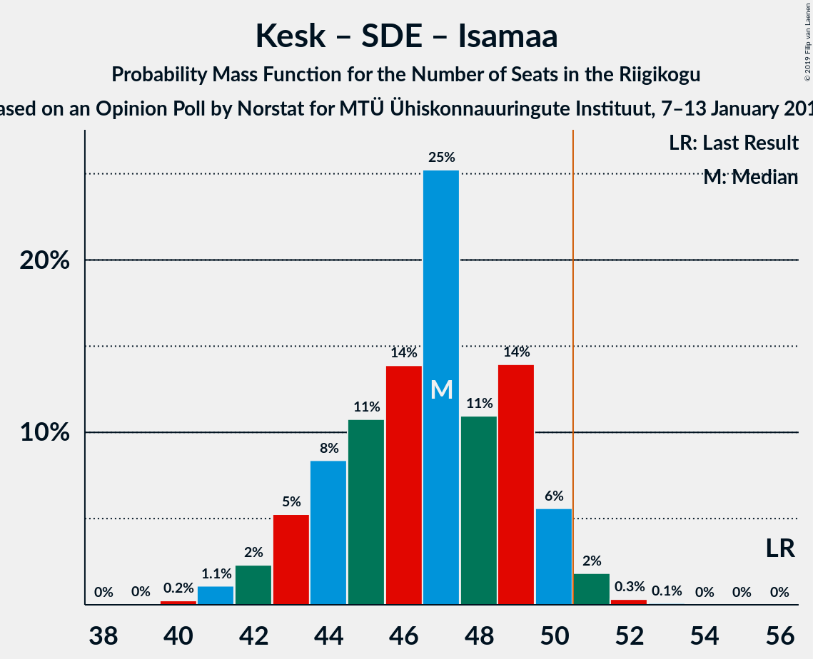

# Opinion Poll by Norstat, 7–13 January 2019

<a href="#voting-intentions">Voting Intentions</a> | <a href="#seats">Seats</a> | <a href="#coalitions">Coalitions</a> | <a href="#technical-information">Technical Information</a>

## Voting Intentions

### Confidence Intervals

| Party | Last Result | Poll Result | 80% Confidence Interval | 90% Confidence Interval | 95% Confidence Interval | 99% Confidence Interval |
|:-----:|:-----------:|:-----------:|:-----------------------:|:-----------------------:|:-----------------------:|:-----------------------:|
| Eesti Reformierakond | 27.7% | 26.9% | 25.2–28.7% |24.7–29.2% |24.3–29.6% |23.5–30.5% |
| Eesti Keskerakond | 24.8% | 26.9% | 25.2–28.7% |24.7–29.2% |24.3–29.6% |23.5–30.5% |
| Eesti Konservatiivne Rahvaerakond | 8.1% | 20.0% | 18.5–21.6% |18.1–22.1% |17.7–22.5% |17.0–23.3% |
| Sotsiaaldemokraatlik Erakond | 15.2% | 10.0% | 8.9–11.3% |8.6–11.6% |8.3–11.9% |7.8–12.6% |
| Erakond Isamaa | 13.7% | 7.0% | 6.1–8.1% |5.8–8.4% |5.6–8.7% |5.2–9.3% |
| Erakond Eestimaa Rohelised | 0.9% | 2.0% | 1.5–2.6% |1.4–2.8% |1.3–3.0% |1.1–3.3% |
| Eesti 200 | 0.0% | 2.0% | 1.5–2.6% |1.4–2.8% |1.3–3.0% |1.1–3.3% |
| Eesti Vabaerakond | 8.7% | 0.3% | 0.2–0.6% |0.1–0.7% |0.1–0.8% |0.1–1.0% |

*Note:* The poll result column reflects the actual value used in the calculations. Published results may vary slightly, and in addition be rounded to fewer digits.

## Seats

### Confidence Intervals

| Party | Last Result | Median | 80% Confidence Interval | 90% Confidence Interval | 95% Confidence Interval | 99% Confidence Interval |
|:-----:|:-----------:|:------:|:-----------------------:|:-----------------------:|:-----------------------:|:-----------------------:|
| <a href="#eesti-reformierakond">Eesti Reformierakond</a> | 30 | 30 | 28–33 |27–33 |27–34 |26–35 |
| <a href="#eesti-keskerakond">Eesti Keskerakond</a> | 27 | 30 | 28–33 |27–33 |27–34 |26–35 |
| <a href="#eesti-konservatiivne-rahvaerakond">Eesti Konservatiivne Rahvaerakond</a> | 7 | 22 | 20–24 |19–24 |19–25 |18–26 |
| <a href="#sotsiaaldemokraatlik-erakond">Sotsiaaldemokraatlik Erakond</a> | 15 | 10 | 8–11 |8–12 |8–12 |7–13 |
| <a href="#erakond-isamaa">Erakond Isamaa</a> | 14 | 7 | 5–8 |5–8 |5–8 |4–9 |
| <a href="#erakond-eestimaa-rohelised">Erakond Eestimaa Rohelised</a> | 0 | 0 | 0 |0 |0 |0 |
| <a href="#eesti-200">Eesti 200</a> | 0 | 0 | 0 |0 |0 |0 |
| <a href="#eesti-vabaerakond">Eesti Vabaerakond</a> | 8 | 0 | 0 |0 |0 |0 |

### Eesti Reformierakond

*For a full overview of the results for this party, see the [Eesti Reformierakond](party-eestireformierakond.html) page.*

| Number of Seats | Probability | Accumulated | Special Marks |
|:---------------:|:-----------:|:-----------:|:-------------:|
| 25 | 0.2% | 100% |  |
| 26 | 2% | 99.7% |  |
| 27 | 7% | 98% |  |
| 28 | 9% | 91% |  |
| 29 | 20% | 82% |  |
| 30 | 18% | 62% | Last Result, Median |
| 31 | 20% | 43% |  |
| 32 | 12% | 23% |  |
| 33 | 6% | 11% |  |
| 34 | 3% | 5% |  |
| 35 | 1.1% | 1.4% |  |
| 36 | 0.2% | 0.3% |  |
| 37 | 0% | 0.1% |  |
| 38 | 0% | 0% |  |

### Eesti Keskerakond

*For a full overview of the results for this party, see the [Eesti Keskerakond](party-eestikeskerakond.html) page.*

| Number of Seats | Probability | Accumulated | Special Marks |
|:---------------:|:-----------:|:-----------:|:-------------:|
| 25 | 0.4% | 100% |  |
| 26 | 1.5% | 99.6% |  |
| 27 | 4% | 98% | Last Result |
| 28 | 11% | 94% |  |
| 29 | 19% | 84% |  |
| 30 | 22% | 65% | Median |
| 31 | 20% | 43% |  |
| 32 | 12% | 22% |  |
| 33 | 7% | 11% |  |
| 34 | 3% | 4% |  |
| 35 | 0.6% | 0.9% |  |
| 36 | 0.2% | 0.3% |  |
| 37 | 0.1% | 0.1% |  |
| 38 | 0% | 0% |  |

### Eesti Konservatiivne Rahvaerakond

*For a full overview of the results for this party, see the [Eesti Konservatiivne Rahvaerakond](party-eestikonservatiivnerahvaerakond.html) page.*

| Number of Seats | Probability | Accumulated | Special Marks |
|:---------------:|:-----------:|:-----------:|:-------------:|
| 7 | 0% | 100% | Last Result |
| 8 | 0% | 100% |  |
| 9 | 0% | 100% |  |
| 10 | 0% | 100% |  |
| 11 | 0% | 100% |  |
| 12 | 0% | 100% |  |
| 13 | 0% | 100% |  |
| 14 | 0% | 100% |  |
| 15 | 0% | 100% |  |
| 16 | 0% | 100% |  |
| 17 | 0.2% | 100% |  |
| 18 | 2% | 99.8% |  |
| 19 | 6% | 98% |  |
| 20 | 17% | 92% |  |
| 21 | 20% | 76% |  |
| 22 | 25% | 56% | Median |
| 23 | 19% | 30% |  |
| 24 | 7% | 11% |  |
| 25 | 3% | 4% |  |
| 26 | 0.8% | 1.0% |  |
| 27 | 0.1% | 0.2% |  |
| 28 | 0% | 0% |  |

### Sotsiaaldemokraatlik Erakond

*For a full overview of the results for this party, see the [Sotsiaaldemokraatlik Erakond](party-sotsiaaldemokraatlikerakond.html) page.*

| Number of Seats | Probability | Accumulated | Special Marks |
|:---------------:|:-----------:|:-----------:|:-------------:|
| 7 | 0.9% | 100% |  |
| 8 | 10% | 99.1% |  |
| 9 | 28% | 89% |  |
| 10 | 35% | 61% | Median |
| 11 | 21% | 27% |  |
| 12 | 5% | 6% |  |
| 13 | 0.9% | 1.0% |  |
| 14 | 0.1% | 0.1% |  |
| 15 | 0% | 0% | Last Result |

### Erakond Isamaa

*For a full overview of the results for this party, see the [Erakond Isamaa](party-erakondisamaa.html) page.*

| Number of Seats | Probability | Accumulated | Special Marks |
|:---------------:|:-----------:|:-----------:|:-------------:|
| 0 | 0.2% | 100% |  |
| 1 | 0% | 99.8% |  |
| 2 | 0% | 99.8% |  |
| 3 | 0% | 99.8% |  |
| 4 | 0.6% | 99.8% |  |
| 5 | 12% | 99.2% |  |
| 6 | 33% | 87% |  |
| 7 | 42% | 54% | Median |
| 8 | 10% | 12% |  |
| 9 | 1.5% | 2% |  |
| 10 | 0.1% | 0.1% |  |
| 11 | 0% | 0% |  |
| 12 | 0% | 0% |  |
| 13 | 0% | 0% |  |
| 14 | 0% | 0% | Last Result |

### Erakond Eestimaa Rohelised

*For a full overview of the results for this party, see the [Erakond Eestimaa Rohelised](party-erakondeestimaarohelised.html) page.*

| Number of Seats | Probability | Accumulated | Special Marks |
|:---------------:|:-----------:|:-----------:|:-------------:|
| 0 | 100% | 100% | Last Result, Median |

### Eesti 200

*For a full overview of the results for this party, see the [Eesti 200](party-eesti200.html) page.*

| Number of Seats | Probability | Accumulated | Special Marks |
|:---------------:|:-----------:|:-----------:|:-------------:|
| 0 | 100% | 100% | Last Result, Median |

### Eesti Vabaerakond

*For a full overview of the results for this party, see the [Eesti Vabaerakond](party-eestivabaerakond.html) page.*

| Number of Seats | Probability | Accumulated | Special Marks |
|:---------------:|:-----------:|:-----------:|:-------------:|
| 0 | 100% | 100% | Median |
| 1 | 0% | 0% |  |
| 2 | 0% | 0% |  |
| 3 | 0% | 0% |  |
| 4 | 0% | 0% |  |
| 5 | 0% | 0% |  |
| 6 | 0% | 0% |  |
| 7 | 0% | 0% |  |
| 8 | 0% | 0% | Last Result |

## Coalitions

### Confidence Intervals

| Coalition | Last Result | Median | Majority? | 80% Confidence Interval | 90% Confidence Interval | 95% Confidence Interval | 99% Confidence Interval |
|:---------:|:-----------:|:------:|:---------:|:-----------------------:|:-----------------------:|:-----------------------:|:-----------------------:|
| Eesti Keskerakond – Eesti Reformierakond – Eesti Konservatiivne Rahvaerakond | 64 | 82 | 100% | 79–85 | 78–86 | 78–86 | 77–87 |
| Eesti Keskerakond – Eesti Reformierakond | 57 | 60 | 100% | 57–63 | 57–64 | 56–65 | 55–66 |
| Eesti Reformierakond – Eesti Konservatiivne Rahvaerakond – Erakond Isamaa | 51 | 58 | 100% | 56–61 | 55–62 | 54–63 | 53–64 |
| Eesti Reformierakond – Eesti Konservatiivne Rahvaerakond | 37 | 52 | 71% | 49–55 | 48–55 | 48–56 | 47–58 |
| Eesti Keskerakond – Eesti Konservatiivne Rahvaerakond | 34 | 52 | 73% | 49–55 | 48–55 | 47–56 | 46–58 |
| Eesti Keskerakond – Sotsiaaldemokraatlik Erakond – Erakond Isamaa | 56 | 47 | 3% | 44–49 | 43–50 | 42–51 | 41–52 |
| Eesti Reformierakond – Sotsiaaldemokraatlik Erakond – Erakond Isamaa – Eesti Vabaerakond | 67 | 47 | 3% | 44–49 | 43–50 | 42–51 | 41–52 |
| Eesti Reformierakond – Sotsiaaldemokraatlik Erakond – Erakond Isamaa | 59 | 47 | 3% | 44–49 | 43–50 | 42–51 | 41–52 |
| Eesti Keskerakond – Sotsiaaldemokraatlik Erakond | 42 | 40 | 0% | 38–43 | 37–43 | 36–44 | 35–45 |
| Eesti Reformierakond – Sotsiaaldemokraatlik Erakond | 45 | 40 | 0% | 37–43 | 37–44 | 36–44 | 35–45 |
| Eesti Reformierakond – Erakond Isamaa | 44 | 37 | 0% | 34–39 | 33–40 | 33–41 | 32–42 |
| Eesti Konservatiivne Rahvaerakond – Sotsiaaldemokraatlik Erakond | 22 | 32 | 0% | 29–34 | 28–35 | 28–35 | 27–36 |

### Eesti Keskerakond – Eesti Reformierakond – Eesti Konservatiivne Rahvaerakond

| Number of Seats | Probability | Accumulated | Special Marks |
|:---------------:|:-----------:|:-----------:|:-------------:|
| 64 | 0% | 100% | Last Result |
| 65 | 0% | 100% |  |
| 66 | 0% | 100% |  |
| 67 | 0% | 100% |  |
| 68 | 0% | 100% |  |
| 69 | 0% | 100% |  |
| 70 | 0% | 100% |  |
| 71 | 0% | 100% |  |
| 72 | 0% | 100% |  |
| 73 | 0% | 100% |  |
| 74 | 0% | 100% |  |
| 75 | 0% | 100% |  |
| 76 | 0.2% | 100% |  |
| 77 | 1.1% | 99.8% |  |
| 78 | 4% | 98.7% |  |
| 79 | 14% | 95% |  |
| 80 | 10% | 81% |  |
| 81 | 16% | 71% |  |
| 82 | 11% | 54% | Median |
| 83 | 9% | 43% |  |
| 84 | 18% | 34% |  |
| 85 | 7% | 16% |  |
| 86 | 8% | 10% |  |
| 87 | 1.2% | 2% |  |
| 88 | 0.4% | 0.5% |  |
| 89 | 0% | 0.1% |  |
| 90 | 0% | 0.1% |  |
| 91 | 0% | 0% |  |

### Eesti Keskerakond – Eesti Reformierakond

| Number of Seats | Probability | Accumulated | Special Marks |
|:---------------:|:-----------:|:-----------:|:-------------:|
| 54 | 0.2% | 100% |  |
| 55 | 0.9% | 99.8% |  |
| 56 | 2% | 98.8% |  |
| 57 | 8% | 97% | Last Result |
| 58 | 12% | 89% |  |
| 59 | 15% | 76% |  |
| 60 | 13% | 61% | Median |
| 61 | 14% | 48% |  |
| 62 | 16% | 34% |  |
| 63 | 10% | 19% |  |
| 64 | 5% | 9% |  |
| 65 | 2% | 3% |  |
| 66 | 1.3% | 2% |  |
| 67 | 0.2% | 0.3% |  |
| 68 | 0.1% | 0.1% |  |
| 69 | 0% | 0% |  |

### Eesti Reformierakond – Eesti Konservatiivne Rahvaerakond – Erakond Isamaa

| Number of Seats | Probability | Accumulated | Special Marks |
|:---------------:|:-----------:|:-----------:|:-------------:|
| 51 | 0.1% | 100% | Last Result, Majority |
| 52 | 0.3% | 99.9% |  |
| 53 | 0.9% | 99.7% |  |
| 54 | 3% | 98.7% |  |
| 55 | 6% | 96% |  |
| 56 | 14% | 90% |  |
| 57 | 14% | 77% |  |
| 58 | 13% | 62% |  |
| 59 | 16% | 49% | Median |
| 60 | 17% | 33% |  |
| 61 | 7% | 15% |  |
| 62 | 4% | 9% |  |
| 63 | 4% | 5% |  |
| 64 | 0.7% | 1.1% |  |
| 65 | 0.4% | 0.4% |  |
| 66 | 0% | 0% |  |

### Eesti Reformierakond – Eesti Konservatiivne Rahvaerakond

| Number of Seats | Probability | Accumulated | Special Marks |
|:---------------:|:-----------:|:-----------:|:-------------:|
| 37 | 0% | 100% | Last Result |
| 38 | 0% | 100% |  |
| 39 | 0% | 100% |  |
| 40 | 0% | 100% |  |
| 41 | 0% | 100% |  |
| 42 | 0% | 100% |  |
| 43 | 0% | 100% |  |
| 44 | 0% | 100% |  |
| 45 | 0.1% | 100% |  |
| 46 | 0.3% | 99.9% |  |
| 47 | 1.4% | 99.6% |  |
| 48 | 4% | 98% |  |
| 49 | 10% | 94% |  |
| 50 | 13% | 84% |  |
| 51 | 15% | 71% | Majority |
| 52 | 17% | 56% | Median |
| 53 | 18% | 39% |  |
| 54 | 9% | 21% |  |
| 55 | 7% | 12% |  |
| 56 | 3% | 5% |  |
| 57 | 2% | 2% |  |
| 58 | 0.5% | 0.7% |  |
| 59 | 0.2% | 0.2% |  |
| 60 | 0% | 0% |  |

### Eesti Keskerakond – Eesti Konservatiivne Rahvaerakond

| Number of Seats | Probability | Accumulated | Special Marks |
|:---------------:|:-----------:|:-----------:|:-------------:|
| 34 | 0% | 100% | Last Result |
| 35 | 0% | 100% |  |
| 36 | 0% | 100% |  |
| 37 | 0% | 100% |  |
| 38 | 0% | 100% |  |
| 39 | 0% | 100% |  |
| 40 | 0% | 100% |  |
| 41 | 0% | 100% |  |
| 42 | 0% | 100% |  |
| 43 | 0% | 100% |  |
| 44 | 0% | 100% |  |
| 45 | 0.1% | 100% |  |
| 46 | 0.4% | 99.9% |  |
| 47 | 2% | 99.5% |  |
| 48 | 3% | 97% |  |
| 49 | 10% | 94% |  |
| 50 | 11% | 84% |  |
| 51 | 14% | 73% | Majority |
| 52 | 19% | 59% | Median |
| 53 | 19% | 41% |  |
| 54 | 10% | 22% |  |
| 55 | 7% | 12% |  |
| 56 | 3% | 5% |  |
| 57 | 2% | 2% |  |
| 58 | 0.4% | 0.6% |  |
| 59 | 0.2% | 0.2% |  |
| 60 | 0% | 0% |  |

### Eesti Keskerakond – Sotsiaaldemokraatlik Erakond – Erakond Isamaa

| Number of Seats | Probability | Accumulated | Special Marks |
|:---------------:|:-----------:|:-----------:|:-------------:|
| 40 | 0.1% | 100% |  |
| 41 | 0.4% | 99.8% |  |
| 42 | 2% | 99.4% |  |
| 43 | 5% | 97% |  |
| 44 | 9% | 93% |  |
| 45 | 15% | 83% |  |
| 46 | 18% | 69% |  |
| 47 | 15% | 51% | Median |
| 48 | 19% | 36% |  |
| 49 | 8% | 17% |  |
| 50 | 6% | 8% |  |
| 51 | 2% | 3% | Majority |
| 52 | 0.8% | 1.0% |  |
| 53 | 0.2% | 0.3% |  |
| 54 | 0% | 0% |  |
| 55 | 0% | 0% |  |
| 56 | 0% | 0% | Last Result |

### Eesti Reformierakond – Sotsiaaldemokraatlik Erakond – Erakond Isamaa – Eesti Vabaerakond

| Number of Seats | Probability | Accumulated | Special Marks |
|:---------------:|:-----------:|:-----------:|:-------------:|
| 40 | 0.1% | 100% |  |
| 41 | 0.6% | 99.8% |  |
| 42 | 3% | 99.3% |  |
| 43 | 6% | 97% |  |
| 44 | 8% | 91% |  |
| 45 | 17% | 82% |  |
| 46 | 15% | 66% |  |
| 47 | 15% | 51% | Median |
| 48 | 17% | 35% |  |
| 49 | 9% | 18% |  |
| 50 | 5% | 8% |  |
| 51 | 2% | 3% | Majority |
| 52 | 0.7% | 1.0% |  |
| 53 | 0.2% | 0.3% |  |
| 54 | 0% | 0% |  |
| 55 | 0% | 0% |  |
| 56 | 0% | 0% |  |
| 57 | 0% | 0% |  |
| 58 | 0% | 0% |  |
| 59 | 0% | 0% |  |
| 60 | 0% | 0% |  |
| 61 | 0% | 0% |  |
| 62 | 0% | 0% |  |
| 63 | 0% | 0% |  |
| 64 | 0% | 0% |  |
| 65 | 0% | 0% |  |
| 66 | 0% | 0% |  |
| 67 | 0% | 0% | Last Result |

### Eesti Reformierakond – Sotsiaaldemokraatlik Erakond – Erakond Isamaa

| Number of Seats | Probability | Accumulated | Special Marks |
|:---------------:|:-----------:|:-----------:|:-------------:|
| 40 | 0.1% | 100% |  |
| 41 | 0.6% | 99.8% |  |
| 42 | 3% | 99.3% |  |
| 43 | 6% | 97% |  |
| 44 | 8% | 91% |  |
| 45 | 17% | 82% |  |
| 46 | 15% | 66% |  |
| 47 | 15% | 51% | Median |
| 48 | 17% | 35% |  |
| 49 | 9% | 18% |  |
| 50 | 5% | 8% |  |
| 51 | 2% | 3% | Majority |
| 52 | 0.7% | 1.0% |  |
| 53 | 0.2% | 0.3% |  |
| 54 | 0% | 0% |  |
| 55 | 0% | 0% |  |
| 56 | 0% | 0% |  |
| 57 | 0% | 0% |  |
| 58 | 0% | 0% |  |
| 59 | 0% | 0% | Last Result |

### Eesti Keskerakond – Sotsiaaldemokraatlik Erakond

| Number of Seats | Probability | Accumulated | Special Marks |
|:---------------:|:-----------:|:-----------:|:-------------:|
| 34 | 0.1% | 100% |  |
| 35 | 0.9% | 99.8% |  |
| 36 | 3% | 99.0% |  |
| 37 | 5% | 96% |  |
| 38 | 16% | 91% |  |
| 39 | 14% | 75% |  |
| 40 | 16% | 61% | Median |
| 41 | 24% | 45% |  |
| 42 | 10% | 21% | Last Result |
| 43 | 6% | 11% |  |
| 44 | 3% | 4% |  |
| 45 | 0.9% | 1.4% |  |
| 46 | 0.3% | 0.5% |  |
| 47 | 0.1% | 0.1% |  |
| 48 | 0% | 0% |  |

### Eesti Reformierakond – Sotsiaaldemokraatlik Erakond

| Number of Seats | Probability | Accumulated | Special Marks |
|:---------------:|:-----------:|:-----------:|:-------------:|
| 34 | 0.2% | 100% |  |
| 35 | 1.0% | 99.8% |  |
| 36 | 3% | 98.9% |  |
| 37 | 8% | 96% |  |
| 38 | 14% | 88% |  |
| 39 | 16% | 74% |  |
| 40 | 16% | 58% | Median |
| 41 | 19% | 42% |  |
| 42 | 11% | 23% |  |
| 43 | 6% | 12% |  |
| 44 | 4% | 5% |  |
| 45 | 1.1% | 2% | Last Result |
| 46 | 0.4% | 0.4% |  |
| 47 | 0.1% | 0.1% |  |
| 48 | 0% | 0% |  |

### Eesti Reformierakond – Erakond Isamaa

| Number of Seats | Probability | Accumulated | Special Marks |
|:---------------:|:-----------:|:-----------:|:-------------:|
| 30 | 0.1% | 100% |  |
| 31 | 0.2% | 99.9% |  |
| 32 | 1.1% | 99.7% |  |
| 33 | 5% | 98.6% |  |
| 34 | 8% | 94% |  |
| 35 | 14% | 86% |  |
| 36 | 18% | 72% |  |
| 37 | 20% | 54% | Median |
| 38 | 16% | 34% |  |
| 39 | 8% | 17% |  |
| 40 | 5% | 9% |  |
| 41 | 3% | 4% |  |
| 42 | 0.6% | 0.8% |  |
| 43 | 0.2% | 0.2% |  |
| 44 | 0% | 0% | Last Result |

### Eesti Konservatiivne Rahvaerakond – Sotsiaaldemokraatlik Erakond

| Number of Seats | Probability | Accumulated | Special Marks |
|:---------------:|:-----------:|:-----------:|:-------------:|
| 22 | 0% | 100% | Last Result |
| 23 | 0% | 100% |  |
| 24 | 0% | 100% |  |
| 25 | 0% | 100% |  |
| 26 | 0.2% | 100% |  |
| 27 | 1.3% | 99.8% |  |
| 28 | 4% | 98% |  |
| 29 | 10% | 95% |  |
| 30 | 16% | 85% |  |
| 31 | 13% | 70% |  |
| 32 | 29% | 56% | Median |
| 33 | 16% | 28% |  |
| 34 | 6% | 12% |  |
| 35 | 4% | 5% |  |
| 36 | 1.2% | 2% |  |
| 37 | 0.2% | 0.3% |  |
| 38 | 0.1% | 0.1% |  |
| 39 | 0% | 0% |  |

## Technical Information

### Opinion Poll

+ **Polling firm:** Norstat
+ **Commissioner(s):** —
+ **Fieldwork period:** 7–13 January 2019

### Calculations

+ **Sample size:** 1071
+ **Simulations done:** 1,048,576
+ **Error estimate:** 1.02%

