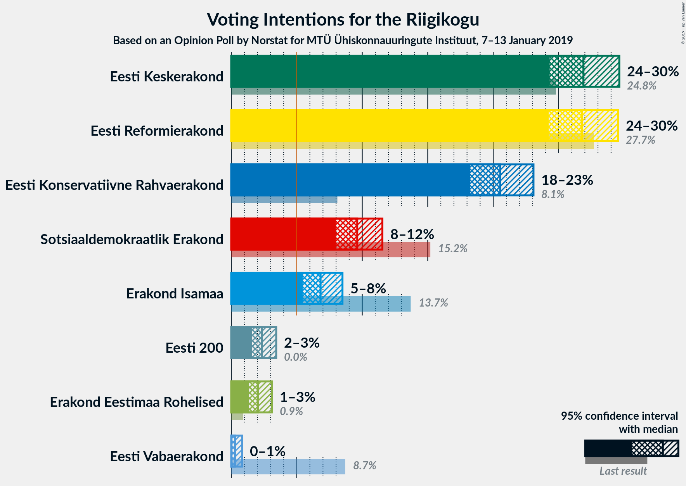
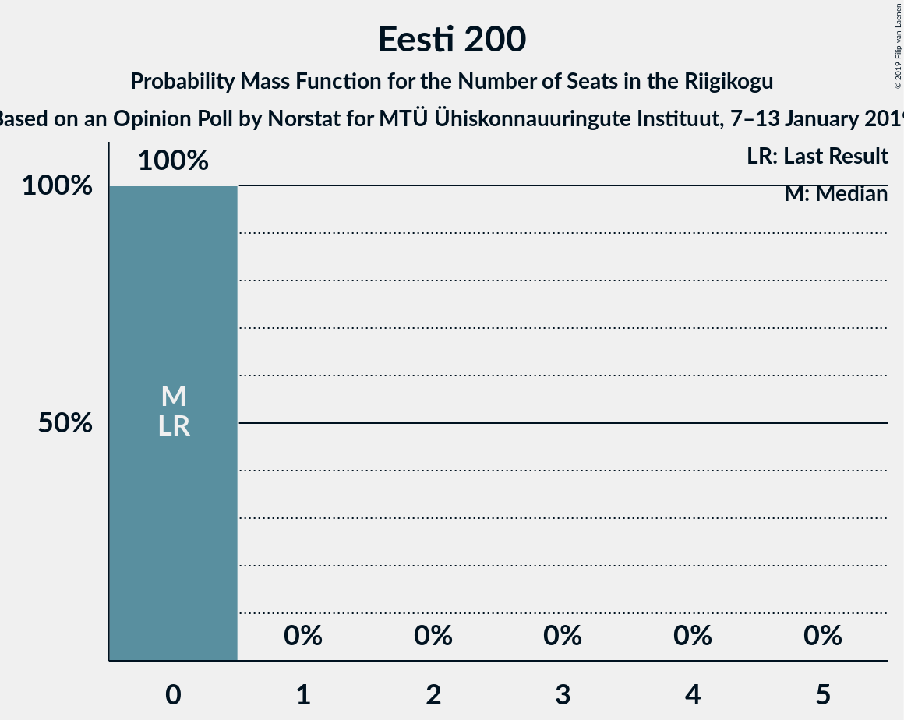

# Opinion Poll by Norstat for MTÜ Ühiskonnauuringute Instituut, 7–13 January 2019

<a href="#voting-intentions">Voting Intentions</a> | <a href="#seats">Seats</a> | <a href="#coalitions">Coalitions</a> | <a href="#technical-information">Technical Information</a>

## Voting Intentions

### Confidence Intervals

| Party | Last Result | Poll Result | 80% Confidence Interval | 90% Confidence Interval | 95% Confidence Interval | 99% Confidence Interval |
|:-----:|:-----------:|:-----------:|:-----------------------:|:-----------------------:|:-----------------------:|:-----------------------:|
| Eesti Keskerakond | 24.8% | 26.9% | 25.2–28.7% |24.7–29.2% |24.3–29.6% |23.5–30.5% |
| Eesti Reformierakond | 27.7% | 26.8% | 25.1–28.6% |24.6–29.1% |24.2–29.5% |23.4–30.4% |
| Eesti Konservatiivne Rahvaerakond | 8.1% | 20.5% | 19.0–22.2% |18.6–22.7% |18.2–23.1% |17.5–23.9% |
| Sotsiaaldemokraatlik Erakond | 15.2% | 9.6% | 8.6–10.9% |8.2–11.2% |8.0–11.5% |7.5–12.2% |
| Erakond Isamaa | 13.7% | 6.8% | 5.9–7.9% |5.7–8.2% |5.5–8.5% |5.0–9.0% |
| Eesti 200 | 0.0% | 2.3% | 1.8–3.0% |1.7–3.2% |1.6–3.4% |1.4–3.8% |
| Erakond Eestimaa Rohelised | 0.9% | 2.1% | 1.6–2.7% |1.5–2.9% |1.4–3.1% |1.2–3.5% |
| Eesti Vabaerakond | 8.7% | 0.3% | 0.2–0.6% |0.1–0.7% |0.1–0.8% |0.1–1.0% |

*Note:* The poll result column reflects the actual value used in the calculations. Published results may vary slightly, and in addition be rounded to fewer digits.

## Seats

### Confidence Intervals

| Party | Last Result | Median | 80% Confidence Interval | 90% Confidence Interval | 95% Confidence Interval | 99% Confidence Interval |
|:-----:|:-----------:|:------:|:-----------------------:|:-----------------------:|:-----------------------:|:-----------------------:|
| <a href="#eesti-keskerakond">Eesti Keskerakond</a> | 27 | 30 | 29–30 |29–32 |29–32 |27–34 |
| <a href="#eesti-reformierakond">Eesti Reformierakond</a> | 30 | 30 | 30–33 |30–34 |30–35 |30–35 |
| <a href="#eesti-konservatiivne-rahvaerakond">Eesti Konservatiivne Rahvaerakond</a> | 7 | 21 | 20–23 |20–23 |20–23 |20–23 |
| <a href="#sotsiaaldemokraatlik-erakond">Sotsiaaldemokraatlik Erakond</a> | 15 | 10 | 9–10 |9–10 |9–10 |9–10 |
| <a href="#erakond-isamaa">Erakond Isamaa</a> | 14 | 6 | 5–8 |5–8 |5–8 |0–8 |
| <a href="#eesti-200">Eesti 200</a> | 0 | 0 | 0 |0 |0 |0 |
| <a href="#erakond-eestimaa-rohelised">Erakond Eestimaa Rohelised</a> | 0 | 0 | 0 |0 |0 |0 |
| <a href="#eesti-vabaerakond">Eesti Vabaerakond</a> | 8 | 0 | 0 |0 |0 |0 |

### Eesti Keskerakond

*For a full overview of the results for this party, see the [Eesti Keskerakond](party-eestikeskerakond.html) page.*

| Number of Seats | Probability | Accumulated | Special Marks |
|:---------------:|:-----------:|:-----------:|:-------------:|
| 27 | 2% | 100% | Last Result |
| 28 | 0% | 98% |  |
| 29 | 22% | 98% |  |
| 30 | 68% | 76% | Median |
| 31 | 2% | 8% |  |
| 32 | 5% | 6% |  |
| 33 | 0.7% | 1.4% |  |
| 34 | 0.6% | 0.6% |  |
| 35 | 0% | 0% |  |

### Eesti Reformierakond

*For a full overview of the results for this party, see the [Eesti Reformierakond](party-eestireformierakond.html) page.*

| Number of Seats | Probability | Accumulated | Special Marks |
|:---------------:|:-----------:|:-----------:|:-------------:|
| 28 | 0.1% | 100% |  |
| 29 | 0.3% | 99.9% |  |
| 30 | 65% | 99.6% | Last Result, Median |
| 31 | 5% | 35% |  |
| 32 | 13% | 29% |  |
| 33 | 10% | 16% |  |
| 34 | 2% | 6% |  |
| 35 | 3% | 4% |  |
| 36 | 0% | 0.2% |  |
| 37 | 0.2% | 0.2% |  |
| 38 | 0% | 0% |  |

### Eesti Konservatiivne Rahvaerakond

*For a full overview of the results for this party, see the [Eesti Konservatiivne Rahvaerakond](party-eestikonservatiivnerahvaerakond.html) page.*

| Number of Seats | Probability | Accumulated | Special Marks |
|:---------------:|:-----------:|:-----------:|:-------------:|
| 7 | 0% | 100% | Last Result |
| 8 | 0% | 100% |  |
| 9 | 0% | 100% |  |
| 10 | 0% | 100% |  |
| 11 | 0% | 100% |  |
| 12 | 0% | 100% |  |
| 13 | 0% | 100% |  |
| 14 | 0% | 100% |  |
| 15 | 0% | 100% |  |
| 16 | 0% | 100% |  |
| 17 | 0% | 100% |  |
| 18 | 0% | 100% |  |
| 19 | 0% | 100% |  |
| 20 | 14% | 100% |  |
| 21 | 69% | 86% | Median |
| 22 | 4% | 17% |  |
| 23 | 13% | 13% |  |
| 24 | 0% | 0% |  |

### Sotsiaaldemokraatlik Erakond

*For a full overview of the results for this party, see the [Sotsiaaldemokraatlik Erakond](party-sotsiaaldemokraatlikerakond.html) page.*

| Number of Seats | Probability | Accumulated | Special Marks |
|:---------------:|:-----------:|:-----------:|:-------------:|
| 9 | 26% | 100% |  |
| 10 | 74% | 74% | Median |
| 11 | 0% | 0% |  |
| 12 | 0% | 0% |  |
| 13 | 0% | 0% |  |
| 14 | 0% | 0% |  |
| 15 | 0% | 0% | Last Result |

### Erakond Isamaa

*For a full overview of the results for this party, see the [Erakond Isamaa](party-erakondisamaa.html) page.*

| Number of Seats | Probability | Accumulated | Special Marks |
|:---------------:|:-----------:|:-----------:|:-------------:|
| 0 | 0.7% | 100% |  |
| 1 | 0% | 99.3% |  |
| 2 | 0% | 99.3% |  |
| 3 | 0% | 99.3% |  |
| 4 | 0.6% | 99.3% |  |
| 5 | 10% | 98.7% |  |
| 6 | 75% | 88% | Median |
| 7 | 2% | 14% |  |
| 8 | 12% | 12% |  |
| 9 | 0% | 0% |  |
| 10 | 0% | 0% |  |
| 11 | 0% | 0% |  |
| 12 | 0% | 0% |  |
| 13 | 0% | 0% |  |
| 14 | 0% | 0% | Last Result |

### Eesti 200

*For a full overview of the results for this party, see the [Eesti 200](party-eesti200.html) page.*

| Number of Seats | Probability | Accumulated | Special Marks |
|:---------------:|:-----------:|:-----------:|:-------------:|
| 0 | 100% | 100% | Last Result, Median |

### Erakond Eestimaa Rohelised

*For a full overview of the results for this party, see the [Erakond Eestimaa Rohelised](party-erakondeestimaarohelised.html) page.*

| Number of Seats | Probability | Accumulated | Special Marks |
|:---------------:|:-----------:|:-----------:|:-------------:|
| 0 | 100% | 100% | Last Result, Median |

### Eesti Vabaerakond

*For a full overview of the results for this party, see the [Eesti Vabaerakond](party-eestivabaerakond.html) page.*

| Number of Seats | Probability | Accumulated | Special Marks |
|:---------------:|:-----------:|:-----------:|:-------------:|
| 0 | 100% | 100% | Median |
| 1 | 0% | 0% |  |
| 2 | 0% | 0% |  |
| 3 | 0% | 0% |  |
| 4 | 0% | 0% |  |
| 5 | 0% | 0% |  |
| 6 | 0% | 0% |  |
| 7 | 0% | 0% |  |
| 8 | 0% | 0% | Last Result |

## Coalitions

### Confidence Intervals

| Coalition | Last Result | Median | Majority? | 80% Confidence Interval | 90% Confidence Interval | 95% Confidence Interval | 99% Confidence Interval |
|:---------:|:-----------:|:------:|:---------:|:-----------------------:|:-----------------------:|:-----------------------:|:-----------------------:|
| Eesti Keskerakond – Eesti Reformierakond – Eesti Konservatiivne Rahvaerakond | 64 | 81 | 100% | 81–85 | 81–85 | 81–86 | 79–87 |
| Eesti Keskerakond – Eesti Reformierakond | 57 | 60 | 100% | 60–63 | 60–65 | 60–65 | 58–66 |
| Eesti Reformierakond – Eesti Konservatiivne Rahvaerakond – Erakond Isamaa | 51 | 57 | 100% | 57–63 | 57–63 | 57–63 | 53–63 |
| Eesti Reformierakond – Eesti Konservatiivne Rahvaerakond | 37 | 51 | 99.6% | 51–55 | 51–55 | 51–55 | 51–55 |
| Eesti Keskerakond – Eesti Konservatiivne Rahvaerakond | 34 | 51 | 84% | 49–52 | 49–54 | 49–54 | 48–55 |
| Eesti Reformierakond – Sotsiaaldemokraatlik Erakond – Erakond Isamaa – Eesti Vabaerakond | 67 | 46 | 4% | 46–49 | 46–49 | 46–51 | 42–51 |
| Eesti Reformierakond – Sotsiaaldemokraatlik Erakond – Erakond Isamaa | 59 | 46 | 4% | 46–49 | 46–49 | 46–51 | 42–51 |
| Eesti Keskerakond – Sotsiaaldemokraatlik Erakond – Erakond Isamaa | 56 | 46 | 0% | 43–46 | 43–48 | 43–48 | 43–48 |
| Eesti Reformierakond – Sotsiaaldemokraatlik Erakond | 45 | 40 | 0% | 40–42 | 40–43 | 40–45 | 40–45 |
| Eesti Keskerakond – Sotsiaaldemokraatlik Erakond | 42 | 40 | 0% | 38–40 | 38–42 | 38–42 | 36–44 |
| Eesti Reformierakond – Erakond Isamaa | 44 | 36 | 0% | 36–40 | 36–40 | 36–41 | 32–41 |
| Eesti Konservatiivne Rahvaerakond – Sotsiaaldemokraatlik Erakond | 22 | 31 | 0% | 29–32 | 29–32 | 29–32 | 29–33 |

### Eesti Keskerakond – Eesti Reformierakond – Eesti Konservatiivne Rahvaerakond

| Number of Seats | Probability | Accumulated | Special Marks |
|:---------------:|:-----------:|:-----------:|:-------------:|
| 64 | 0% | 100% | Last Result |
| 65 | 0% | 100% |  |
| 66 | 0% | 100% |  |
| 67 | 0% | 100% |  |
| 68 | 0% | 100% |  |
| 69 | 0% | 100% |  |
| 70 | 0% | 100% |  |
| 71 | 0% | 100% |  |
| 72 | 0% | 100% |  |
| 73 | 0% | 100% |  |
| 74 | 0% | 100% |  |
| 75 | 0% | 100% |  |
| 76 | 0% | 100% |  |
| 77 | 0% | 100% |  |
| 78 | 0% | 100% |  |
| 79 | 2% | 100% |  |
| 80 | 0.4% | 98% |  |
| 81 | 64% | 98% | Median |
| 82 | 10% | 34% |  |
| 83 | 0% | 24% |  |
| 84 | 12% | 24% |  |
| 85 | 9% | 12% |  |
| 86 | 3% | 3% |  |
| 87 | 0.6% | 0.7% |  |
| 88 | 0% | 0% |  |

### Eesti Keskerakond – Eesti Reformierakond

| Number of Seats | Probability | Accumulated | Special Marks |
|:---------------:|:-----------:|:-----------:|:-------------:|
| 57 | 0% | 100% | Last Result |
| 58 | 2% | 100% |  |
| 59 | 0.3% | 98% |  |
| 60 | 64% | 98% | Median |
| 61 | 12% | 34% |  |
| 62 | 12% | 22% |  |
| 63 | 4% | 11% |  |
| 64 | 0.2% | 7% |  |
| 65 | 6% | 7% |  |
| 66 | 0.6% | 0.6% |  |
| 67 | 0% | 0% |  |

### Eesti Reformierakond – Eesti Konservatiivne Rahvaerakond – Erakond Isamaa

| Number of Seats | Probability | Accumulated | Special Marks |
|:---------------:|:-----------:|:-----------:|:-------------:|
| 51 | 0% | 100% | Last Result, Majority |
| 52 | 0% | 100% |  |
| 53 | 0.7% | 100% |  |
| 54 | 0% | 99.3% |  |
| 55 | 0% | 99.3% |  |
| 56 | 0.4% | 99.3% |  |
| 57 | 64% | 98.9% | Median |
| 58 | 10% | 34% |  |
| 59 | 7% | 24% |  |
| 60 | 0% | 17% |  |
| 61 | 5% | 17% |  |
| 62 | 0% | 12% |  |
| 63 | 12% | 12% |  |
| 64 | 0% | 0.2% |  |
| 65 | 0.2% | 0.2% |  |
| 66 | 0% | 0% |  |

### Eesti Reformierakond – Eesti Konservatiivne Rahvaerakond

| Number of Seats | Probability | Accumulated | Special Marks |
|:---------------:|:-----------:|:-----------:|:-------------:|
| 37 | 0% | 100% | Last Result |
| 38 | 0% | 100% |  |
| 39 | 0% | 100% |  |
| 40 | 0% | 100% |  |
| 41 | 0% | 100% |  |
| 42 | 0% | 100% |  |
| 43 | 0% | 100% |  |
| 44 | 0% | 100% |  |
| 45 | 0% | 100% |  |
| 46 | 0% | 100% |  |
| 47 | 0% | 100% |  |
| 48 | 0% | 100% |  |
| 49 | 0% | 100% |  |
| 50 | 0.4% | 100% |  |
| 51 | 64% | 99.6% | Median, Majority |
| 52 | 2% | 36% |  |
| 53 | 17% | 34% |  |
| 54 | 0% | 17% |  |
| 55 | 17% | 17% |  |
| 56 | 0% | 0.3% |  |
| 57 | 0% | 0.2% |  |
| 58 | 0.2% | 0.2% |  |
| 59 | 0% | 0% |  |

### Eesti Keskerakond – Eesti Konservatiivne Rahvaerakond

| Number of Seats | Probability | Accumulated | Special Marks |
|:---------------:|:-----------:|:-----------:|:-------------:|
| 34 | 0% | 100% | Last Result |
| 35 | 0% | 100% |  |
| 36 | 0% | 100% |  |
| 37 | 0% | 100% |  |
| 38 | 0% | 100% |  |
| 39 | 0% | 100% |  |
| 40 | 0% | 100% |  |
| 41 | 0% | 100% |  |
| 42 | 0% | 100% |  |
| 43 | 0% | 100% |  |
| 44 | 0% | 100% |  |
| 45 | 0% | 100% |  |
| 46 | 0% | 100% |  |
| 47 | 0% | 100% |  |
| 48 | 2% | 100% |  |
| 49 | 10% | 98% |  |
| 50 | 3% | 88% |  |
| 51 | 64% | 84% | Median, Majority |
| 52 | 14% | 20% |  |
| 53 | 0% | 6% |  |
| 54 | 5% | 6% |  |
| 55 | 2% | 2% |  |
| 56 | 0% | 0% |  |

### Eesti Reformierakond – Sotsiaaldemokraatlik Erakond – Erakond Isamaa – Eesti Vabaerakond

| Number of Seats | Probability | Accumulated | Special Marks |
|:---------------:|:-----------:|:-----------:|:-------------:|
| 42 | 0.7% | 100% |  |
| 43 | 0% | 99.3% |  |
| 44 | 0.3% | 99.2% |  |
| 45 | 0% | 98.9% |  |
| 46 | 66% | 98.9% | Median |
| 47 | 16% | 33% |  |
| 48 | 0% | 17% |  |
| 49 | 14% | 17% |  |
| 50 | 0% | 4% |  |
| 51 | 3% | 4% | Majority |
| 52 | 0% | 0.2% |  |
| 53 | 0.2% | 0.2% |  |
| 54 | 0% | 0% |  |
| 55 | 0% | 0% |  |
| 56 | 0% | 0% |  |
| 57 | 0% | 0% |  |
| 58 | 0% | 0% |  |
| 59 | 0% | 0% |  |
| 60 | 0% | 0% |  |
| 61 | 0% | 0% |  |
| 62 | 0% | 0% |  |
| 63 | 0% | 0% |  |
| 64 | 0% | 0% |  |
| 65 | 0% | 0% |  |
| 66 | 0% | 0% |  |
| 67 | 0% | 0% | Last Result |

### Eesti Reformierakond – Sotsiaaldemokraatlik Erakond – Erakond Isamaa

| Number of Seats | Probability | Accumulated | Special Marks |
|:---------------:|:-----------:|:-----------:|:-------------:|
| 42 | 0.7% | 100% |  |
| 43 | 0% | 99.3% |  |
| 44 | 0.3% | 99.2% |  |
| 45 | 0% | 98.9% |  |
| 46 | 66% | 98.9% | Median |
| 47 | 16% | 33% |  |
| 48 | 0% | 17% |  |
| 49 | 14% | 17% |  |
| 50 | 0% | 4% |  |
| 51 | 3% | 4% | Majority |
| 52 | 0% | 0.2% |  |
| 53 | 0.2% | 0.2% |  |
| 54 | 0% | 0% |  |
| 55 | 0% | 0% |  |
| 56 | 0% | 0% |  |
| 57 | 0% | 0% |  |
| 58 | 0% | 0% |  |
| 59 | 0% | 0% | Last Result |

### Eesti Keskerakond – Sotsiaaldemokraatlik Erakond – Erakond Isamaa

| Number of Seats | Probability | Accumulated | Special Marks |
|:---------------:|:-----------:|:-----------:|:-------------:|
| 43 | 13% | 100% |  |
| 44 | 0.1% | 87% |  |
| 45 | 0.4% | 87% |  |
| 46 | 81% | 87% | Median |
| 47 | 0% | 6% |  |
| 48 | 6% | 6% |  |
| 49 | 0% | 0% |  |
| 50 | 0% | 0% |  |
| 51 | 0% | 0% | Majority |
| 52 | 0% | 0% |  |
| 53 | 0% | 0% |  |
| 54 | 0% | 0% |  |
| 55 | 0% | 0% |  |
| 56 | 0% | 0% | Last Result |

### Eesti Reformierakond – Sotsiaaldemokraatlik Erakond

| Number of Seats | Probability | Accumulated | Special Marks |
|:---------------:|:-----------:|:-----------:|:-------------:|
| 37 | 0.1% | 100% |  |
| 38 | 0.3% | 99.9% |  |
| 39 | 0% | 99.6% |  |
| 40 | 67% | 99.6% | Median |
| 41 | 16% | 33% |  |
| 42 | 12% | 17% |  |
| 43 | 2% | 6% |  |
| 44 | 0% | 4% |  |
| 45 | 3% | 4% | Last Result |
| 46 | 0.2% | 0.2% |  |
| 47 | 0% | 0% |  |

### Eesti Keskerakond – Sotsiaaldemokraatlik Erakond

| Number of Seats | Probability | Accumulated | Special Marks |
|:---------------:|:-----------:|:-----------:|:-------------:|
| 36 | 2% | 100% |  |
| 37 | 0% | 98% |  |
| 38 | 22% | 98% |  |
| 39 | 0.4% | 76% |  |
| 40 | 69% | 75% | Median |
| 41 | 0% | 6% |  |
| 42 | 5% | 6% | Last Result |
| 43 | 0.7% | 1.4% |  |
| 44 | 0.6% | 0.6% |  |
| 45 | 0% | 0% |  |

### Eesti Reformierakond – Erakond Isamaa

| Number of Seats | Probability | Accumulated | Special Marks |
|:---------------:|:-----------:|:-----------:|:-------------:|
| 32 | 0.7% | 100% |  |
| 33 | 0% | 99.3% |  |
| 34 | 0.1% | 99.3% |  |
| 35 | 0.3% | 99.2% |  |
| 36 | 66% | 98.9% | Median |
| 37 | 4% | 33% |  |
| 38 | 12% | 29% |  |
| 39 | 0% | 17% |  |
| 40 | 14% | 17% |  |
| 41 | 3% | 4% |  |
| 42 | 0% | 0.2% |  |
| 43 | 0% | 0.2% |  |
| 44 | 0.2% | 0.2% | Last Result |
| 45 | 0% | 0% |  |

### Eesti Konservatiivne Rahvaerakond – Sotsiaaldemokraatlik Erakond

| Number of Seats | Probability | Accumulated | Special Marks |
|:---------------:|:-----------:|:-----------:|:-------------:|
| 22 | 0% | 100% | Last Result |
| 23 | 0% | 100% |  |
| 24 | 0% | 100% |  |
| 25 | 0% | 100% |  |
| 26 | 0% | 100% |  |
| 27 | 0% | 100% |  |
| 28 | 0% | 100% |  |
| 29 | 10% | 100% |  |
| 30 | 7% | 90% |  |
| 31 | 65% | 82% | Median |
| 32 | 16% | 17% |  |
| 33 | 1.2% | 1.2% |  |
| 34 | 0% | 0% |  |

## Technical Information

### Opinion Poll

+ **Polling firm:** Norstat
+ **Commissioner(s):** MTÜ Ühiskonnauuringute Instituut
+ **Fieldwork period:** 7–13 January 2019

### Calculations

+ **Sample size:** 1071
+ **Simulations done:** 1,024
+ **Error estimate:** 2.55%

