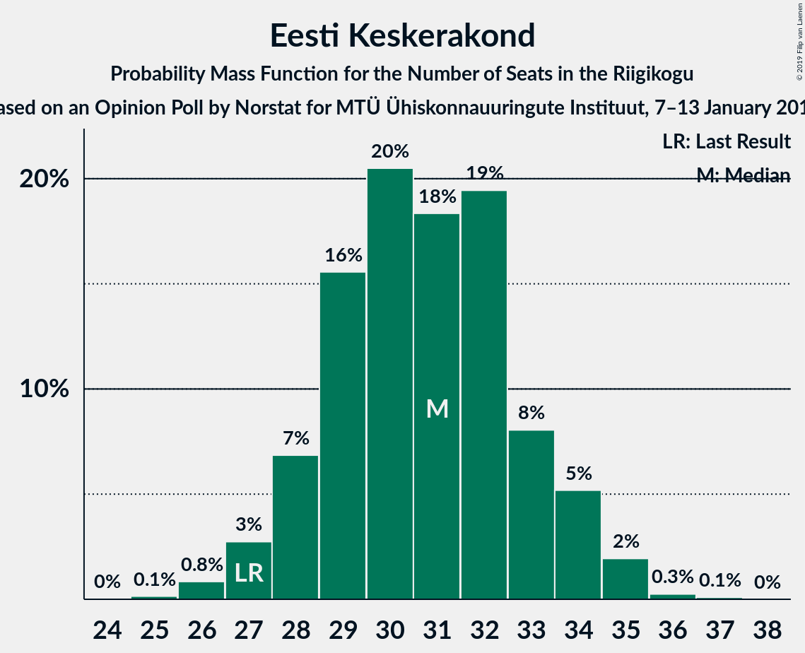
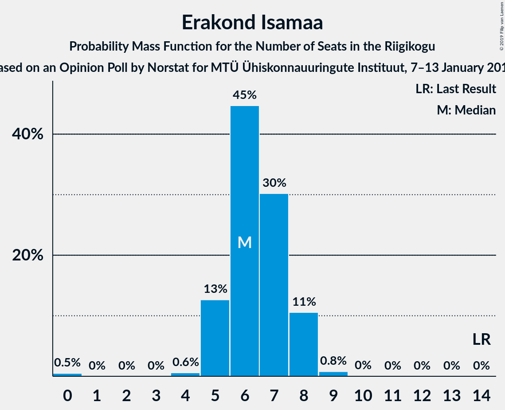
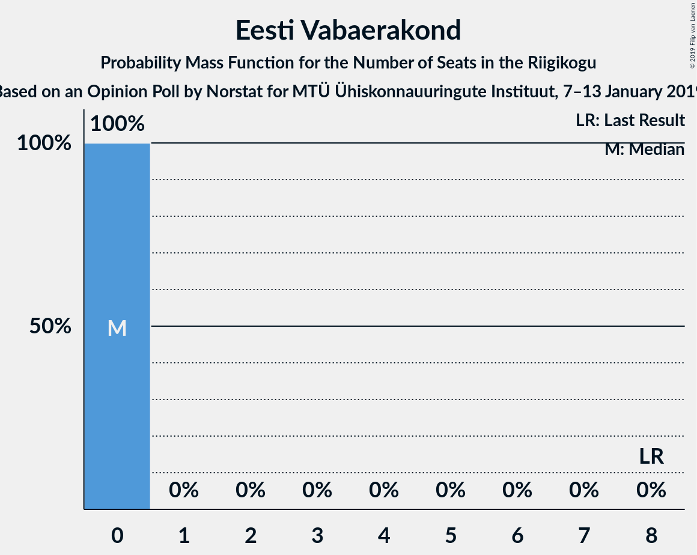
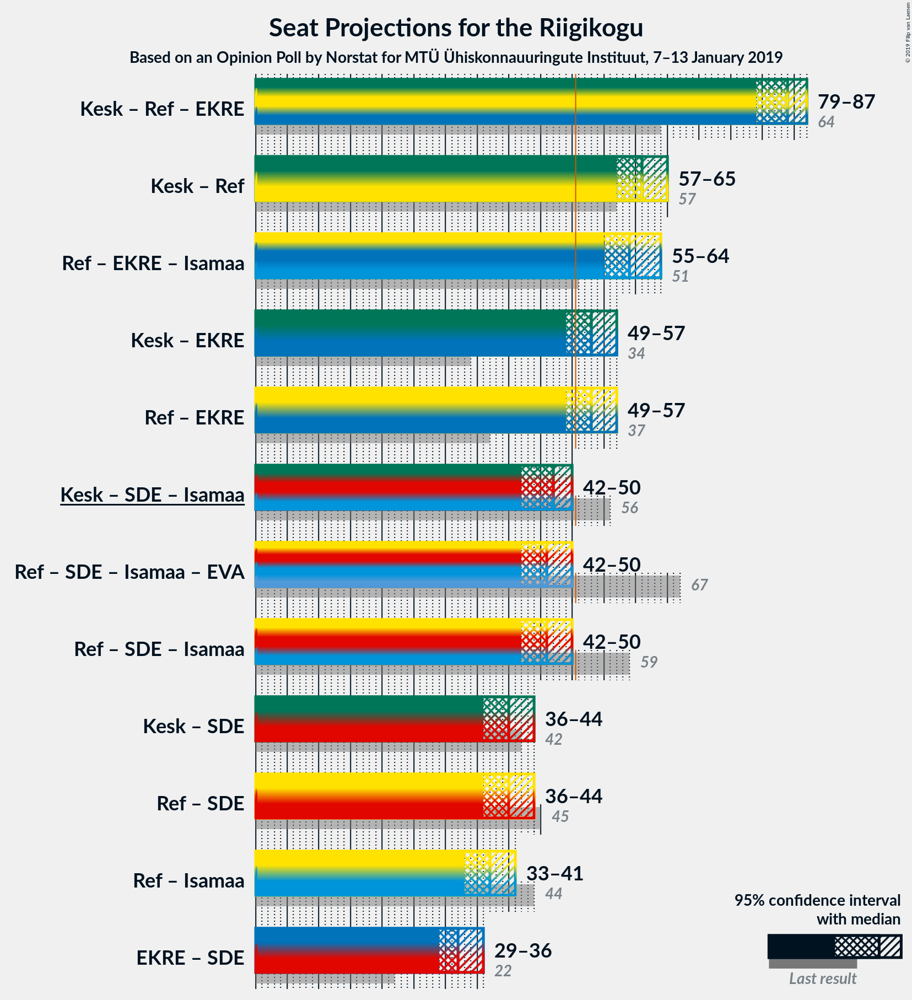
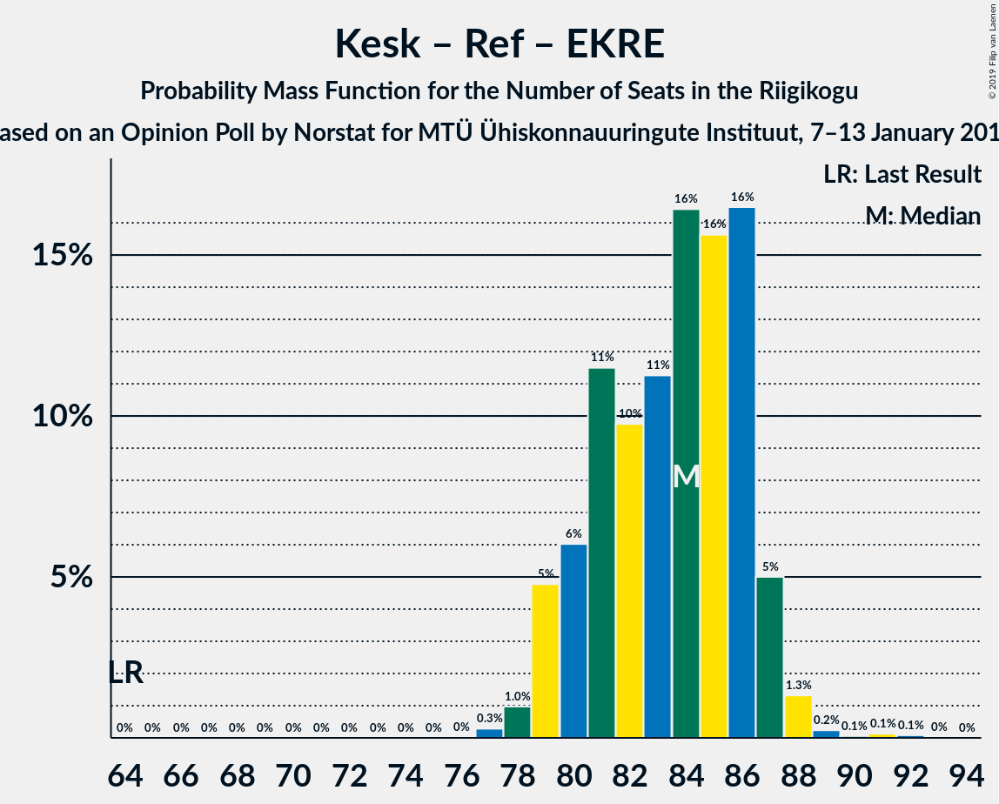
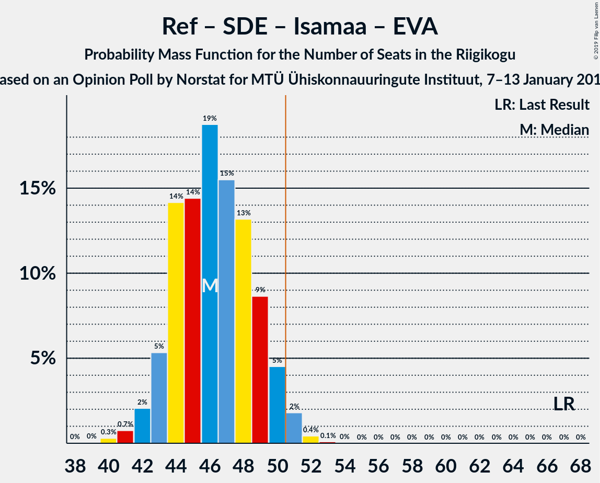

# Opinion Poll by Norstat for MTÜ Ühiskonnauuringute Instituut, 7–13 January 2019

<a href="#voting-intentions">Voting Intentions</a> | <a href="#seats">Seats</a> | <a href="#coalitions">Coalitions</a> | <a href="#technical-information">Technical Information</a>

## Voting Intentions

### Confidence Intervals

| Party | Last Result | Poll Result | 80% Confidence Interval | 90% Confidence Interval | 95% Confidence Interval | 99% Confidence Interval |
|:-----:|:-----------:|:-----------:|:-----------------------:|:-----------------------:|:-----------------------:|:-----------------------:|
| Eesti Keskerakond | 24.8% | 26.9% | 25.2–28.7% |24.7–29.2% |24.3–29.6% |23.5–30.5% |
| Eesti Reformierakond | 27.7% | 26.8% | 25.1–28.6% |24.6–29.1% |24.2–29.5% |23.4–30.4% |
| Eesti Konservatiivne Rahvaerakond | 8.1% | 20.5% | 19.0–22.2% |18.6–22.7% |18.2–23.1% |17.5–23.9% |
| Sotsiaaldemokraatlik Erakond | 15.2% | 9.6% | 8.6–10.9% |8.2–11.2% |8.0–11.5% |7.5–12.2% |
| Erakond Isamaa | 13.7% | 6.8% | 5.9–7.9% |5.7–8.2% |5.5–8.5% |5.0–9.0% |
| Eesti 200 | 0.0% | 2.3% | 1.8–3.0% |1.7–3.2% |1.6–3.4% |1.4–3.8% |
| Erakond Eestimaa Rohelised | 0.9% | 2.1% | 1.6–2.7% |1.5–2.9% |1.4–3.1% |1.2–3.5% |
| Eesti Vabaerakond | 8.7% | 0.3% | 0.2–0.6% |0.1–0.7% |0.1–0.8% |0.1–1.0% |

*Note:* The poll result column reflects the actual value used in the calculations. Published results may vary slightly, and in addition be rounded to fewer digits.

## Seats

### Confidence Intervals

| Party | Last Result | Median | 80% Confidence Interval | 90% Confidence Interval | 95% Confidence Interval | 99% Confidence Interval |
|:-----:|:-----------:|:------:|:-----------------------:|:-----------------------:|:-----------------------:|:-----------------------:|
| <a href="#eesti-keskerakond">Eesti Keskerakond</a> | 27 | 31 | 29–34 |28–34 |27–34 |26–35 |
| <a href="#eesti-reformierakond">Eesti Reformierakond</a> | 30 | 31 | 28–33 |28–33 |27–34 |26–35 |
| <a href="#eesti-konservatiivne-rahvaerakond">Eesti Konservatiivne Rahvaerakond</a> | 7 | 22 | 20–25 |20–25 |19–26 |19–27 |
| <a href="#sotsiaaldemokraatlik-erakond">Sotsiaaldemokraatlik Erakond</a> | 15 | 9 | 8–11 |8–11 |8–12 |7–13 |
| <a href="#erakond-isamaa">Erakond Isamaa</a> | 14 | 6 | 5–8 |5–8 |5–8 |0–9 |
| <a href="#eesti-200">Eesti 200</a> | 0 | 0 | 0 |0 |0 |0 |
| <a href="#erakond-eestimaa-rohelised">Erakond Eestimaa Rohelised</a> | 0 | 0 | 0 |0 |0 |0 |
| <a href="#eesti-vabaerakond">Eesti Vabaerakond</a> | 8 | 0 | 0 |0 |0 |0 |

### Eesti Keskerakond

*For a full overview of the results for this party, see the [Eesti Keskerakond](party-eestikeskerakond.html) page.*

| Number of Seats | Probability | Accumulated | Special Marks |
|:---------------:|:-----------:|:-----------:|:-------------:|
| 25 | 0.1% | 100% |  |
| 26 | 1.4% | 99.9% |  |
| 27 | 3% | 98% | Last Result |
| 28 | 5% | 96% |  |
| 29 | 12% | 90% |  |
| 30 | 19% | 78% |  |
| 31 | 20% | 59% | Median |
| 32 | 21% | 39% |  |
| 33 | 7% | 18% |  |
| 34 | 10% | 11% |  |
| 35 | 0.6% | 1.0% |  |
| 36 | 0.1% | 0.3% |  |
| 37 | 0.2% | 0.2% |  |
| 38 | 0% | 0% |  |

### Eesti Reformierakond

*For a full overview of the results for this party, see the [Eesti Reformierakond](party-eestireformierakond.html) page.*

| Number of Seats | Probability | Accumulated | Special Marks |
|:---------------:|:-----------:|:-----------:|:-------------:|
| 25 | 0.1% | 100% |  |
| 26 | 0.9% | 99.8% |  |
| 27 | 3% | 99.0% |  |
| 28 | 14% | 96% |  |
| 29 | 13% | 82% |  |
| 30 | 13% | 68% | Last Result |
| 31 | 26% | 56% | Median |
| 32 | 14% | 30% |  |
| 33 | 11% | 16% |  |
| 34 | 3% | 5% |  |
| 35 | 1.3% | 1.5% |  |
| 36 | 0.1% | 0.2% |  |
| 37 | 0% | 0% |  |

### Eesti Konservatiivne Rahvaerakond

*For a full overview of the results for this party, see the [Eesti Konservatiivne Rahvaerakond](party-eestikonservatiivnerahvaerakond.html) page.*

| Number of Seats | Probability | Accumulated | Special Marks |
|:---------------:|:-----------:|:-----------:|:-------------:|
| 7 | 0% | 100% | Last Result |
| 8 | 0% | 100% |  |
| 9 | 0% | 100% |  |
| 10 | 0% | 100% |  |
| 11 | 0% | 100% |  |
| 12 | 0% | 100% |  |
| 13 | 0% | 100% |  |
| 14 | 0% | 100% |  |
| 15 | 0% | 100% |  |
| 16 | 0% | 100% |  |
| 17 | 0% | 100% |  |
| 18 | 0.5% | 100% |  |
| 19 | 3% | 99.5% |  |
| 20 | 10% | 97% |  |
| 21 | 19% | 87% |  |
| 22 | 25% | 69% | Median |
| 23 | 20% | 43% |  |
| 24 | 13% | 23% |  |
| 25 | 6% | 10% |  |
| 26 | 4% | 5% |  |
| 27 | 0.6% | 0.7% |  |
| 28 | 0.2% | 0.2% |  |
| 29 | 0% | 0% |  |

### Sotsiaaldemokraatlik Erakond

*For a full overview of the results for this party, see the [Sotsiaaldemokraatlik Erakond](party-sotsiaaldemokraatlikerakond.html) page.*

| Number of Seats | Probability | Accumulated | Special Marks |
|:---------------:|:-----------:|:-----------:|:-------------:|
| 6 | 0.1% | 100% |  |
| 7 | 2% | 99.9% |  |
| 8 | 13% | 98% |  |
| 9 | 50% | 85% | Median |
| 10 | 20% | 35% |  |
| 11 | 11% | 14% |  |
| 12 | 3% | 3% |  |
| 13 | 0.7% | 0.7% |  |
| 14 | 0% | 0% |  |
| 15 | 0% | 0% | Last Result |

### Erakond Isamaa

*For a full overview of the results for this party, see the [Erakond Isamaa](party-erakondisamaa.html) page.*

| Number of Seats | Probability | Accumulated | Special Marks |
|:---------------:|:-----------:|:-----------:|:-------------:|
| 0 | 0.5% | 100% |  |
| 1 | 0% | 99.5% |  |
| 2 | 0% | 99.5% |  |
| 3 | 0% | 99.5% |  |
| 4 | 0.5% | 99.5% |  |
| 5 | 14% | 99.0% |  |
| 6 | 47% | 85% | Median |
| 7 | 21% | 37% |  |
| 8 | 15% | 17% |  |
| 9 | 1.0% | 1.0% |  |
| 10 | 0% | 0% |  |
| 11 | 0% | 0% |  |
| 12 | 0% | 0% |  |
| 13 | 0% | 0% |  |
| 14 | 0% | 0% | Last Result |

### Eesti 200

*For a full overview of the results for this party, see the [Eesti 200](party-eesti200.html) page.*

| Number of Seats | Probability | Accumulated | Special Marks |
|:---------------:|:-----------:|:-----------:|:-------------:|
| 0 | 100% | 100% | Last Result, Median |

### Erakond Eestimaa Rohelised

*For a full overview of the results for this party, see the [Erakond Eestimaa Rohelised](party-erakondeestimaarohelised.html) page.*

| Number of Seats | Probability | Accumulated | Special Marks |
|:---------------:|:-----------:|:-----------:|:-------------:|
| 0 | 100% | 100% | Last Result, Median |

### Eesti Vabaerakond

*For a full overview of the results for this party, see the [Eesti Vabaerakond](party-eestivabaerakond.html) page.*

| Number of Seats | Probability | Accumulated | Special Marks |
|:---------------:|:-----------:|:-----------:|:-------------:|
| 0 | 100% | 100% | Median |
| 1 | 0% | 0% |  |
| 2 | 0% | 0% |  |
| 3 | 0% | 0% |  |
| 4 | 0% | 0% |  |
| 5 | 0% | 0% |  |
| 6 | 0% | 0% |  |
| 7 | 0% | 0% |  |
| 8 | 0% | 0% | Last Result |

## Coalitions

### Confidence Intervals

| Coalition | Last Result | Median | Majority? | 80% Confidence Interval | 90% Confidence Interval | 95% Confidence Interval | 99% Confidence Interval |
|:---------:|:-----------:|:------:|:---------:|:-----------------------:|:-----------------------:|:-----------------------:|:-----------------------:|
| Eesti Keskerakond – Eesti Reformierakond – Eesti Konservatiivne Rahvaerakond | 64 | 85 | 100% | 80–86 | 79–86 | 79–87 | 78–88 |
| Eesti Keskerakond – Eesti Reformierakond | 57 | 62 | 100% | 58–64 | 57–65 | 57–65 | 56–67 |
| Eesti Reformierakond – Eesti Konservatiivne Rahvaerakond – Erakond Isamaa | 51 | 59 | 100% | 57–62 | 56–63 | 55–63 | 54–64 |
| Eesti Keskerakond – Eesti Konservatiivne Rahvaerakond | 34 | 53 | 87% | 50–56 | 49–57 | 49–58 | 48–58 |
| Eesti Reformierakond – Eesti Konservatiivne Rahvaerakond | 37 | 53 | 84% | 50–55 | 49–57 | 49–57 | 47–59 |
| Eesti Reformierakond – Sotsiaaldemokraatlik Erakond – Erakond Isamaa – Eesti Vabaerakond | 67 | 46 | 5% | 43–49 | 43–50 | 42–51 | 41–52 |
| Eesti Reformierakond – Sotsiaaldemokraatlik Erakond – Erakond Isamaa | 59 | 46 | 5% | 43–49 | 43–50 | 42–51 | 41–52 |
| Eesti Keskerakond – Sotsiaaldemokraatlik Erakond – Erakond Isamaa | 56 | 47 | 2% | 44–49 | 43–50 | 42–50 | 41–51 |
| Eesti Keskerakond – Sotsiaaldemokraatlik Erakond | 42 | 40 | 0% | 38–43 | 37–43 | 36–44 | 35–45 |
| Eesti Reformierakond – Sotsiaaldemokraatlik Erakond | 45 | 40 | 0% | 37–43 | 37–43 | 36–44 | 35–45 |
| Eesti Reformierakond – Erakond Isamaa | 44 | 37 | 0% | 34–40 | 34–40 | 33–40 | 32–42 |
| Eesti Konservatiivne Rahvaerakond – Sotsiaaldemokraatlik Erakond | 22 | 32 | 0% | 29–34 | 29–35 | 28–35 | 28–37 |

### Eesti Keskerakond – Eesti Reformierakond – Eesti Konservatiivne Rahvaerakond

| Number of Seats | Probability | Accumulated | Special Marks |
|:---------------:|:-----------:|:-----------:|:-------------:|
| 64 | 0% | 100% | Last Result |
| 65 | 0% | 100% |  |
| 66 | 0% | 100% |  |
| 67 | 0% | 100% |  |
| 68 | 0% | 100% |  |
| 69 | 0% | 100% |  |
| 70 | 0% | 100% |  |
| 71 | 0% | 100% |  |
| 72 | 0% | 100% |  |
| 73 | 0% | 100% |  |
| 74 | 0% | 100% |  |
| 75 | 0% | 100% |  |
| 76 | 0% | 100% |  |
| 77 | 0.1% | 100% |  |
| 78 | 1.5% | 99.8% |  |
| 79 | 7% | 98% |  |
| 80 | 2% | 92% |  |
| 81 | 9% | 89% |  |
| 82 | 15% | 80% |  |
| 83 | 6% | 65% |  |
| 84 | 8% | 59% | Median |
| 85 | 11% | 51% |  |
| 86 | 36% | 40% |  |
| 87 | 3% | 4% |  |
| 88 | 1.0% | 1.5% |  |
| 89 | 0.1% | 0.4% |  |
| 90 | 0.1% | 0.4% |  |
| 91 | 0% | 0.2% |  |
| 92 | 0.2% | 0.2% |  |
| 93 | 0% | 0% |  |

### Eesti Keskerakond – Eesti Reformierakond

| Number of Seats | Probability | Accumulated | Special Marks |
|:---------------:|:-----------:|:-----------:|:-------------:|
| 54 | 0.1% | 100% |  |
| 55 | 0.1% | 99.8% |  |
| 56 | 0.9% | 99.7% |  |
| 57 | 6% | 98.8% | Last Result |
| 58 | 4% | 93% |  |
| 59 | 14% | 89% |  |
| 60 | 7% | 75% |  |
| 61 | 14% | 68% |  |
| 62 | 19% | 54% | Median |
| 63 | 13% | 35% |  |
| 64 | 13% | 22% |  |
| 65 | 7% | 9% |  |
| 66 | 0.8% | 2% |  |
| 67 | 0.8% | 0.9% |  |
| 68 | 0.1% | 0.1% |  |
| 69 | 0% | 0% |  |

### Eesti Reformierakond – Eesti Konservatiivne Rahvaerakond – Erakond Isamaa

| Number of Seats | Probability | Accumulated | Special Marks |
|:---------------:|:-----------:|:-----------:|:-------------:|
| 51 | 0% | 100% | Last Result, Majority |
| 52 | 0.1% | 100% |  |
| 53 | 0.4% | 99.9% |  |
| 54 | 1.3% | 99.6% |  |
| 55 | 3% | 98% |  |
| 56 | 5% | 96% |  |
| 57 | 10% | 90% |  |
| 58 | 20% | 80% |  |
| 59 | 13% | 60% | Median |
| 60 | 18% | 48% |  |
| 61 | 17% | 30% |  |
| 62 | 6% | 13% |  |
| 63 | 5% | 7% |  |
| 64 | 2% | 2% |  |
| 65 | 0.2% | 0.3% |  |
| 66 | 0.2% | 0.2% |  |
| 67 | 0% | 0% |  |

### Eesti Keskerakond – Eesti Konservatiivne Rahvaerakond

| Number of Seats | Probability | Accumulated | Special Marks |
|:---------------:|:-----------:|:-----------:|:-------------:|
| 34 | 0% | 100% | Last Result |
| 35 | 0% | 100% |  |
| 36 | 0% | 100% |  |
| 37 | 0% | 100% |  |
| 38 | 0% | 100% |  |
| 39 | 0% | 100% |  |
| 40 | 0% | 100% |  |
| 41 | 0% | 100% |  |
| 42 | 0% | 100% |  |
| 43 | 0% | 100% |  |
| 44 | 0% | 100% |  |
| 45 | 0% | 100% |  |
| 46 | 0.1% | 100% |  |
| 47 | 0.4% | 99.9% |  |
| 48 | 2% | 99.6% |  |
| 49 | 4% | 98% |  |
| 50 | 7% | 94% |  |
| 51 | 13% | 87% | Majority |
| 52 | 10% | 74% |  |
| 53 | 17% | 65% | Median |
| 54 | 10% | 47% |  |
| 55 | 24% | 38% |  |
| 56 | 7% | 14% |  |
| 57 | 3% | 7% |  |
| 58 | 3% | 4% |  |
| 59 | 0.3% | 0.4% |  |
| 60 | 0.1% | 0.1% |  |
| 61 | 0% | 0.1% |  |
| 62 | 0% | 0% |  |

### Eesti Reformierakond – Eesti Konservatiivne Rahvaerakond

| Number of Seats | Probability | Accumulated | Special Marks |
|:---------------:|:-----------:|:-----------:|:-------------:|
| 37 | 0% | 100% | Last Result |
| 38 | 0% | 100% |  |
| 39 | 0% | 100% |  |
| 40 | 0% | 100% |  |
| 41 | 0% | 100% |  |
| 42 | 0% | 100% |  |
| 43 | 0% | 100% |  |
| 44 | 0% | 100% |  |
| 45 | 0% | 100% |  |
| 46 | 0.1% | 100% |  |
| 47 | 0.6% | 99.9% |  |
| 48 | 2% | 99.3% |  |
| 49 | 3% | 98% |  |
| 50 | 10% | 95% |  |
| 51 | 11% | 84% | Majority |
| 52 | 22% | 73% |  |
| 53 | 8% | 51% | Median |
| 54 | 18% | 44% |  |
| 55 | 16% | 25% |  |
| 56 | 3% | 9% |  |
| 57 | 5% | 7% |  |
| 58 | 1.0% | 2% |  |
| 59 | 0.7% | 0.7% |  |
| 60 | 0% | 0% |  |

### Eesti Reformierakond – Sotsiaaldemokraatlik Erakond – Erakond Isamaa – Eesti Vabaerakond

| Number of Seats | Probability | Accumulated | Special Marks |
|:---------------:|:-----------:|:-----------:|:-------------:|
| 39 | 0.1% | 100% |  |
| 40 | 0.2% | 99.9% |  |
| 41 | 0.5% | 99.7% |  |
| 42 | 2% | 99.2% |  |
| 43 | 9% | 97% |  |
| 44 | 9% | 88% |  |
| 45 | 11% | 79% |  |
| 46 | 29% | 68% | Median |
| 47 | 12% | 39% |  |
| 48 | 14% | 27% |  |
| 49 | 3% | 13% |  |
| 50 | 5% | 10% |  |
| 51 | 4% | 5% | Majority |
| 52 | 0.4% | 0.6% |  |
| 53 | 0.1% | 0.1% |  |
| 54 | 0% | 0% |  |
| 55 | 0% | 0% |  |
| 56 | 0% | 0% |  |
| 57 | 0% | 0% |  |
| 58 | 0% | 0% |  |
| 59 | 0% | 0% |  |
| 60 | 0% | 0% |  |
| 61 | 0% | 0% |  |
| 62 | 0% | 0% |  |
| 63 | 0% | 0% |  |
| 64 | 0% | 0% |  |
| 65 | 0% | 0% |  |
| 66 | 0% | 0% |  |
| 67 | 0% | 0% | Last Result |

### Eesti Reformierakond – Sotsiaaldemokraatlik Erakond – Erakond Isamaa

| Number of Seats | Probability | Accumulated | Special Marks |
|:---------------:|:-----------:|:-----------:|:-------------:|
| 39 | 0.1% | 100% |  |
| 40 | 0.2% | 99.9% |  |
| 41 | 0.5% | 99.7% |  |
| 42 | 2% | 99.2% |  |
| 43 | 9% | 97% |  |
| 44 | 9% | 88% |  |
| 45 | 11% | 79% |  |
| 46 | 29% | 68% | Median |
| 47 | 12% | 39% |  |
| 48 | 14% | 27% |  |
| 49 | 3% | 13% |  |
| 50 | 5% | 10% |  |
| 51 | 4% | 5% | Majority |
| 52 | 0.4% | 0.6% |  |
| 53 | 0.1% | 0.1% |  |
| 54 | 0% | 0% |  |
| 55 | 0% | 0% |  |
| 56 | 0% | 0% |  |
| 57 | 0% | 0% |  |
| 58 | 0% | 0% |  |
| 59 | 0% | 0% | Last Result |

### Eesti Keskerakond – Sotsiaaldemokraatlik Erakond – Erakond Isamaa

| Number of Seats | Probability | Accumulated | Special Marks |
|:---------------:|:-----------:|:-----------:|:-------------:|
| 38 | 0.1% | 100% |  |
| 39 | 0% | 99.9% |  |
| 40 | 0.2% | 99.9% |  |
| 41 | 1.2% | 99.7% |  |
| 42 | 2% | 98% |  |
| 43 | 3% | 96% |  |
| 44 | 8% | 93% |  |
| 45 | 12% | 85% |  |
| 46 | 19% | 74% | Median |
| 47 | 23% | 54% |  |
| 48 | 7% | 31% |  |
| 49 | 17% | 24% |  |
| 50 | 5% | 7% |  |
| 51 | 2% | 2% | Majority |
| 52 | 0.2% | 0.4% |  |
| 53 | 0.1% | 0.2% |  |
| 54 | 0% | 0% |  |
| 55 | 0% | 0% |  |
| 56 | 0% | 0% | Last Result |

### Eesti Keskerakond – Sotsiaaldemokraatlik Erakond

| Number of Seats | Probability | Accumulated | Special Marks |
|:---------------:|:-----------:|:-----------:|:-------------:|
| 34 | 0.1% | 100% |  |
| 35 | 1.3% | 99.9% |  |
| 36 | 3% | 98.6% |  |
| 37 | 4% | 96% |  |
| 38 | 8% | 92% |  |
| 39 | 18% | 84% |  |
| 40 | 20% | 66% | Median |
| 41 | 19% | 46% |  |
| 42 | 13% | 27% | Last Result |
| 43 | 11% | 14% |  |
| 44 | 2% | 3% |  |
| 45 | 1.3% | 2% |  |
| 46 | 0.2% | 0.3% |  |
| 47 | 0.1% | 0.1% |  |
| 48 | 0% | 0% |  |

### Eesti Reformierakond – Sotsiaaldemokraatlik Erakond

| Number of Seats | Probability | Accumulated | Special Marks |
|:---------------:|:-----------:|:-----------:|:-------------:|
| 33 | 0.1% | 100% |  |
| 34 | 0.1% | 99.9% |  |
| 35 | 0.7% | 99.8% |  |
| 36 | 2% | 99.2% |  |
| 37 | 11% | 97% |  |
| 38 | 14% | 86% |  |
| 39 | 16% | 72% |  |
| 40 | 19% | 56% | Median |
| 41 | 9% | 37% |  |
| 42 | 18% | 28% |  |
| 43 | 6% | 10% |  |
| 44 | 4% | 5% |  |
| 45 | 0.5% | 0.6% | Last Result |
| 46 | 0.1% | 0.2% |  |
| 47 | 0% | 0.1% |  |
| 48 | 0% | 0% |  |

### Eesti Reformierakond – Erakond Isamaa

| Number of Seats | Probability | Accumulated | Special Marks |
|:---------------:|:-----------:|:-----------:|:-------------:|
| 31 | 0.2% | 100% |  |
| 32 | 0.6% | 99.7% |  |
| 33 | 3% | 99.1% |  |
| 34 | 8% | 96% |  |
| 35 | 12% | 89% |  |
| 36 | 17% | 76% |  |
| 37 | 26% | 60% | Median |
| 38 | 12% | 34% |  |
| 39 | 10% | 22% |  |
| 40 | 10% | 12% |  |
| 41 | 2% | 2% |  |
| 42 | 0.4% | 0.6% |  |
| 43 | 0.1% | 0.1% |  |
| 44 | 0% | 0% | Last Result |

### Eesti Konservatiivne Rahvaerakond – Sotsiaaldemokraatlik Erakond

| Number of Seats | Probability | Accumulated | Special Marks |
|:---------------:|:-----------:|:-----------:|:-------------:|
| 22 | 0% | 100% | Last Result |
| 23 | 0% | 100% |  |
| 24 | 0% | 100% |  |
| 25 | 0% | 100% |  |
| 26 | 0.1% | 100% |  |
| 27 | 0.1% | 99.9% |  |
| 28 | 3% | 99.8% |  |
| 29 | 8% | 97% |  |
| 30 | 13% | 88% |  |
| 31 | 19% | 75% | Median |
| 32 | 29% | 57% |  |
| 33 | 12% | 28% |  |
| 34 | 8% | 16% |  |
| 35 | 6% | 8% |  |
| 36 | 1.1% | 2% |  |
| 37 | 0.3% | 0.5% |  |
| 38 | 0.2% | 0.2% |  |
| 39 | 0% | 0% |  |

## Technical Information

### Opinion Poll

+ **Polling firm:** Norstat
+ **Commissioner(s):** MTÜ Ühiskonnauuringute Instituut
+ **Fieldwork period:** 7–13 January 2019

### Calculations

+ **Sample size:** 1071
+ **Simulations done:** 131,072
+ **Error estimate:** 1.48%

