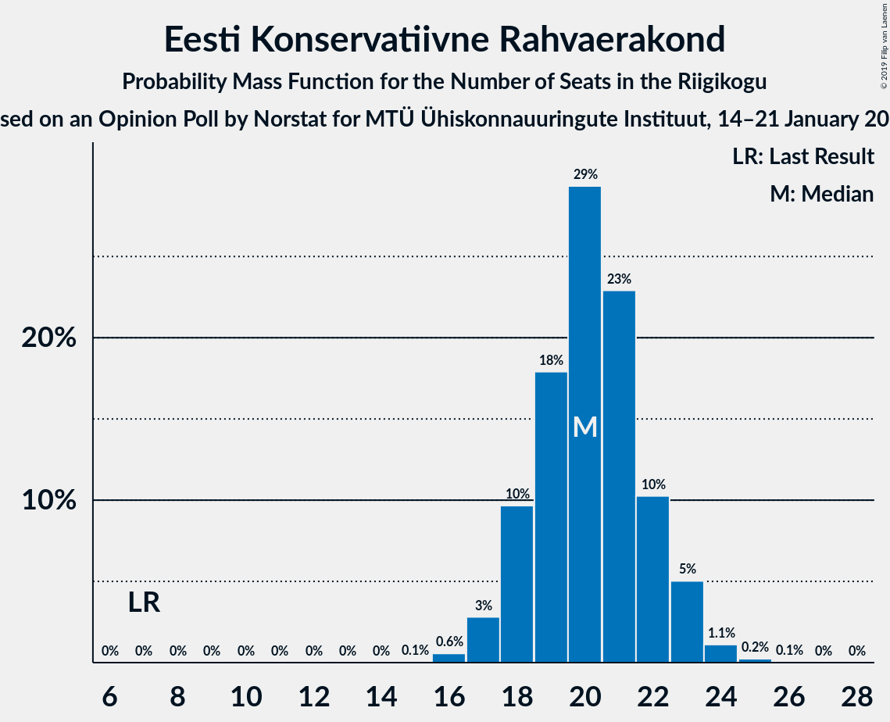
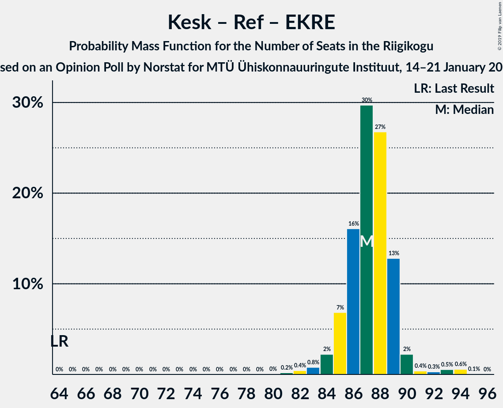

# Opinion Poll by Norstat for MTÜ Ühiskonnauuringute Instituut, 14–21 January 2019

<a href="#voting-intentions">Voting Intentions</a> | <a href="#seats">Seats</a> | <a href="#coalitions">Coalitions</a> | <a href="#technical-information">Technical Information</a>

## Voting Intentions

### Confidence Intervals

| Party | Last Result | Poll Result | 80% Confidence Interval | 90% Confidence Interval | 95% Confidence Interval | 99% Confidence Interval |
|:-----:|:-----------:|:-----------:|:-----------------------:|:-----------------------:|:-----------------------:|:-----------------------:|
| Eesti Keskerakond | 24.8% | 30.2% | 28.4–32.1% |27.9–32.6% |27.4–33.1% |26.6–34.0% |
| Eesti Reformierakond | 27.7% | 27.1% | 25.3–29.0% |24.9–29.5% |24.4–29.9% |23.6–30.8% |
| Eesti Konservatiivne Rahvaerakond | 8.1% | 18.2% | 16.7–19.8% |16.3–20.3% |15.9–20.7% |15.2–21.5% |
| Sotsiaaldemokraatlik Erakond | 15.2% | 7.7% | 6.7–8.9% |6.4–9.2% |6.2–9.5% |5.8–10.1% |
| Erakond Isamaa | 13.7% | 6.5% | 5.6–7.6% |5.3–7.9% |5.1–8.2% |4.7–8.8% |
| Eesti 200 | 0.0% | 3.7% | 3.0–4.6% |2.9–4.8% |2.7–5.1% |2.4–5.5% |
| Eesti Vabaerakond | 8.7% | 2.0% | 1.5–2.7% |1.4–2.9% |1.3–3.1% |1.1–3.4% |
| Erakond Eestimaa Rohelised | 0.9% | 1.9% | 1.4–2.6% |1.3–2.8% |1.2–3.0% |1.0–3.3% |

*Note:* The poll result column reflects the actual value used in the calculations. Published results may vary slightly, and in addition be rounded to fewer digits.

## Seats

### Confidence Intervals

| Party | Last Result | Median | 80% Confidence Interval | 90% Confidence Interval | 95% Confidence Interval | 99% Confidence Interval |
|:-----:|:-----------:|:------:|:-----------------------:|:-----------------------:|:-----------------------:|:-----------------------:|
| <a href="#eesti-keskerakond">Eesti Keskerakond</a> | 27 | 35 | 33–38 |29–38 |29–38 |29–43 |
| <a href="#eesti-reformierakond">Eesti Reformierakond</a> | 30 | 29 | 29–33 |27–33 |27–37 |27–38 |
| <a href="#eesti-konservatiivne-rahvaerakond">Eesti Konservatiivne Rahvaerakond</a> | 7 | 21 | 20–23 |20–26 |20–26 |18–26 |
| <a href="#sotsiaaldemokraatlik-erakond">Sotsiaaldemokraatlik Erakond</a> | 15 | 8 | 6–10 |6–10 |6–10 |5–11 |
| <a href="#erakond-isamaa">Erakond Isamaa</a> | 14 | 6 | 5–8 |5–8 |4–8 |0–8 |
| <a href="#eesti-200">Eesti 200</a> | 0 | 0 | 0 |0 |0 |0–4 |
| <a href="#eesti-vabaerakond">Eesti Vabaerakond</a> | 8 | 0 | 0 |0 |0 |0 |
| <a href="#erakond-eestimaa-rohelised">Erakond Eestimaa Rohelised</a> | 0 | 0 | 0 |0 |0 |0 |

### Eesti Keskerakond

*For a full overview of the results for this party, see the [Eesti Keskerakond](party-eestikeskerakond.html) page.*

| Number of Seats | Probability | Accumulated | Special Marks |
|:---------------:|:-----------:|:-----------:|:-------------:|
| 27 | 0% | 100% | Last Result |
| 28 | 0% | 100% |  |
| 29 | 6% | 100% |  |
| 30 | 0.3% | 94% |  |
| 31 | 3% | 94% |  |
| 32 | 0.8% | 91% |  |
| 33 | 0.3% | 90% |  |
| 34 | 0% | 90% |  |
| 35 | 48% | 90% | Median |
| 36 | 7% | 42% |  |
| 37 | 0.6% | 35% |  |
| 38 | 32% | 34% |  |
| 39 | 1.3% | 2% |  |
| 40 | 0.2% | 1.2% |  |
| 41 | 0% | 1.1% |  |
| 42 | 0% | 1.1% |  |
| 43 | 1.0% | 1.1% |  |
| 44 | 0.1% | 0.1% |  |
| 45 | 0% | 0% |  |

### Eesti Reformierakond

*For a full overview of the results for this party, see the [Eesti Reformierakond](party-eestireformierakond.html) page.*

| Number of Seats | Probability | Accumulated | Special Marks |
|:---------------:|:-----------:|:-----------:|:-------------:|
| 26 | 0.3% | 100% |  |
| 27 | 7% | 99.7% |  |
| 28 | 2% | 93% |  |
| 29 | 70% | 92% | Median |
| 30 | 1.0% | 22% | Last Result |
| 31 | 10% | 21% |  |
| 32 | 0.1% | 11% |  |
| 33 | 6% | 11% |  |
| 34 | 1.0% | 5% |  |
| 35 | 0.4% | 4% |  |
| 36 | 0.3% | 3% |  |
| 37 | 1.2% | 3% |  |
| 38 | 2% | 2% |  |
| 39 | 0% | 0% |  |

### Eesti Konservatiivne Rahvaerakond

*For a full overview of the results for this party, see the [Eesti Konservatiivne Rahvaerakond](party-eestikonservatiivnerahvaerakond.html) page.*

| Number of Seats | Probability | Accumulated | Special Marks |
|:---------------:|:-----------:|:-----------:|:-------------:|
| 7 | 0% | 100% | Last Result |
| 8 | 0% | 100% |  |
| 9 | 0% | 100% |  |
| 10 | 0% | 100% |  |
| 11 | 0% | 100% |  |
| 12 | 0% | 100% |  |
| 13 | 0.1% | 100% |  |
| 14 | 0% | 99.9% |  |
| 15 | 0.2% | 99.9% |  |
| 16 | 0% | 99.7% |  |
| 17 | 0% | 99.7% |  |
| 18 | 0.6% | 99.6% |  |
| 19 | 1.5% | 99.0% |  |
| 20 | 14% | 98% |  |
| 21 | 70% | 84% | Median |
| 22 | 0.4% | 14% |  |
| 23 | 6% | 13% |  |
| 24 | 0% | 7% |  |
| 25 | 0.5% | 7% |  |
| 26 | 7% | 7% |  |
| 27 | 0% | 0% |  |

### Sotsiaaldemokraatlik Erakond

*For a full overview of the results for this party, see the [Sotsiaaldemokraatlik Erakond](party-sotsiaaldemokraatlikerakond.html) page.*

| Number of Seats | Probability | Accumulated | Special Marks |
|:---------------:|:-----------:|:-----------:|:-------------:|
| 4 | 0.1% | 100% |  |
| 5 | 1.2% | 99.9% |  |
| 6 | 16% | 98.7% |  |
| 7 | 2% | 83% |  |
| 8 | 48% | 81% | Median |
| 9 | 17% | 33% |  |
| 10 | 16% | 16% |  |
| 11 | 0.5% | 0.5% |  |
| 12 | 0% | 0% |  |
| 13 | 0% | 0% |  |
| 14 | 0% | 0% |  |
| 15 | 0% | 0% | Last Result |

### Erakond Isamaa

*For a full overview of the results for this party, see the [Erakond Isamaa](party-erakondisamaa.html) page.*

| Number of Seats | Probability | Accumulated | Special Marks |
|:---------------:|:-----------:|:-----------:|:-------------:|
| 0 | 1.3% | 100% |  |
| 1 | 0% | 98.7% |  |
| 2 | 0% | 98.7% |  |
| 3 | 0% | 98.7% |  |
| 4 | 2% | 98.7% |  |
| 5 | 25% | 97% |  |
| 6 | 34% | 72% | Median |
| 7 | 15% | 38% |  |
| 8 | 23% | 23% |  |
| 9 | 0.3% | 0.3% |  |
| 10 | 0% | 0% |  |
| 11 | 0% | 0% |  |
| 12 | 0% | 0% |  |
| 13 | 0% | 0% |  |
| 14 | 0% | 0% | Last Result |

### Eesti 200

*For a full overview of the results for this party, see the [Eesti 200](party-eesti200.html) page.*

| Number of Seats | Probability | Accumulated | Special Marks |
|:---------------:|:-----------:|:-----------:|:-------------:|
| 0 | 98.9% | 100% | Last Result, Median |
| 1 | 0% | 1.1% |  |
| 2 | 0% | 1.1% |  |
| 3 | 0% | 1.1% |  |
| 4 | 0.6% | 1.1% |  |
| 5 | 0.5% | 0.5% |  |
| 6 | 0% | 0% |  |

### Eesti Vabaerakond

*For a full overview of the results for this party, see the [Eesti Vabaerakond](party-eestivabaerakond.html) page.*

| Number of Seats | Probability | Accumulated | Special Marks |
|:---------------:|:-----------:|:-----------:|:-------------:|
| 0 | 100% | 100% | Median |
| 1 | 0% | 0% |  |
| 2 | 0% | 0% |  |
| 3 | 0% | 0% |  |
| 4 | 0% | 0% |  |
| 5 | 0% | 0% |  |
| 6 | 0% | 0% |  |
| 7 | 0% | 0% |  |
| 8 | 0% | 0% | Last Result |

### Erakond Eestimaa Rohelised

*For a full overview of the results for this party, see the [Erakond Eestimaa Rohelised](party-erakondeestimaarohelised.html) page.*

| Number of Seats | Probability | Accumulated | Special Marks |
|:---------------:|:-----------:|:-----------:|:-------------:|
| 0 | 100% | 100% | Last Result, Median |

## Coalitions

### Confidence Intervals

| Coalition | Last Result | Median | Majority? | 80% Confidence Interval | 90% Confidence Interval | 95% Confidence Interval | 99% Confidence Interval |
|:---------:|:-----------:|:------:|:---------:|:-----------------------:|:-----------------------:|:-----------------------:|:-----------------------:|
| Eesti Keskerakond – Eesti Reformierakond – Eesti Konservatiivne Rahvaerakond | 64 | 86 | 100% | 85–89 | 85–89 | 85–90 | 84–91 |
| Eesti Keskerakond – Eesti Reformierakond | 57 | 64 | 100% | 63–67 | 62–68 | 62–69 | 62–73 |
| Eesti Reformierakond – Eesti Konservatiivne Rahvaerakond – Erakond Isamaa | 51 | 57 | 99.2% | 55–62 | 55–63 | 52–63 | 50–64 |
| Eesti Keskerakond – Eesti Konservatiivne Rahvaerakond | 34 | 56 | 99.9% | 55–59 | 52–62 | 51–62 | 51–62 |
| Eesti Reformierakond – Eesti Konservatiivne Rahvaerakond | 37 | 50 | 28% | 50–54 | 50–56 | 50–57 | 45–58 |
| Eesti Keskerakond – Sotsiaaldemokraatlik Erakond – Erakond Isamaa | 56 | 51 | 71% | 47–51 | 45–51 | 44–51 | 43–54 |
| Eesti Reformierakond – Sotsiaaldemokraatlik Erakond – Erakond Isamaa – Eesti Vabaerakond | 67 | 45 | 0.1% | 42–46 | 39–49 | 39–50 | 39–50 |
| Eesti Reformierakond – Sotsiaaldemokraatlik Erakond – Erakond Isamaa | 59 | 45 | 0.1% | 42–46 | 39–49 | 39–50 | 39–50 |
| Eesti Keskerakond – Sotsiaaldemokraatlik Erakond | 42 | 44 | 0.1% | 39–46 | 38–46 | 38–46 | 37–49 |
| Eesti Reformierakond – Sotsiaaldemokraatlik Erakond | 45 | 37 | 0% | 35–40 | 33–42 | 33–44 | 33–46 |
| Eesti Reformierakond – Erakond Isamaa | 44 | 36 | 0% | 34–39 | 33–40 | 33–42 | 30–43 |
| Eesti Konservatiivne Rahvaerakond – Sotsiaaldemokraatlik Erakond | 22 | 29 | 0% | 27–32 | 27–32 | 26–32 | 23–32 |

### Eesti Keskerakond – Eesti Reformierakond – Eesti Konservatiivne Rahvaerakond

| Number of Seats | Probability | Accumulated | Special Marks |
|:---------------:|:-----------:|:-----------:|:-------------:|
| 64 | 0% | 100% | Last Result |
| 65 | 0% | 100% |  |
| 66 | 0% | 100% |  |
| 67 | 0% | 100% |  |
| 68 | 0% | 100% |  |
| 69 | 0% | 100% |  |
| 70 | 0% | 100% |  |
| 71 | 0% | 100% |  |
| 72 | 0% | 100% |  |
| 73 | 0% | 100% |  |
| 74 | 0% | 100% |  |
| 75 | 0% | 100% |  |
| 76 | 0% | 100% |  |
| 77 | 0% | 100% |  |
| 78 | 0% | 100% |  |
| 79 | 0% | 100% |  |
| 80 | 0% | 100% |  |
| 81 | 0.1% | 100% |  |
| 82 | 0% | 99.9% |  |
| 83 | 0.3% | 99.9% |  |
| 84 | 0.3% | 99.6% |  |
| 85 | 45% | 99.3% | Median |
| 86 | 10% | 55% |  |
| 87 | 0.3% | 44% |  |
| 88 | 33% | 44% |  |
| 89 | 8% | 11% |  |
| 90 | 1.4% | 3% |  |
| 91 | 1.0% | 1.2% |  |
| 92 | 0% | 0.2% |  |
| 93 | 0.2% | 0.2% |  |
| 94 | 0% | 0% |  |

### Eesti Keskerakond – Eesti Reformierakond

| Number of Seats | Probability | Accumulated | Special Marks |
|:---------------:|:-----------:|:-----------:|:-------------:|
| 57 | 0% | 100% | Last Result |
| 58 | 0% | 100% |  |
| 59 | 0% | 100% |  |
| 60 | 0% | 100% |  |
| 61 | 0% | 100% |  |
| 62 | 6% | 100% |  |
| 63 | 7% | 94% |  |
| 64 | 38% | 87% | Median |
| 65 | 0.9% | 49% |  |
| 66 | 11% | 48% |  |
| 67 | 31% | 37% |  |
| 68 | 3% | 6% |  |
| 69 | 2% | 4% |  |
| 70 | 0% | 2% |  |
| 71 | 1.0% | 2% |  |
| 72 | 0.1% | 0.8% |  |
| 73 | 0.6% | 0.7% |  |
| 74 | 0% | 0.1% |  |
| 75 | 0.1% | 0.1% |  |
| 76 | 0% | 0% |  |

### Eesti Reformierakond – Eesti Konservatiivne Rahvaerakond – Erakond Isamaa

| Number of Seats | Probability | Accumulated | Special Marks |
|:---------------:|:-----------:|:-----------:|:-------------:|
| 49 | 0.1% | 100% |  |
| 50 | 0.7% | 99.9% |  |
| 51 | 0.5% | 99.2% | Last Result, Majority |
| 52 | 1.4% | 98.7% |  |
| 53 | 0.2% | 97% |  |
| 54 | 0.1% | 97% |  |
| 55 | 23% | 97% |  |
| 56 | 15% | 74% | Median |
| 57 | 19% | 58% |  |
| 58 | 23% | 40% |  |
| 59 | 7% | 17% |  |
| 60 | 0.3% | 10% |  |
| 61 | 0% | 10% |  |
| 62 | 2% | 10% |  |
| 63 | 7% | 8% |  |
| 64 | 0.5% | 0.5% |  |
| 65 | 0% | 0% |  |

### Eesti Keskerakond – Eesti Konservatiivne Rahvaerakond

| Number of Seats | Probability | Accumulated | Special Marks |
|:---------------:|:-----------:|:-----------:|:-------------:|
| 34 | 0% | 100% | Last Result |
| 35 | 0% | 100% |  |
| 36 | 0% | 100% |  |
| 37 | 0% | 100% |  |
| 38 | 0% | 100% |  |
| 39 | 0% | 100% |  |
| 40 | 0% | 100% |  |
| 41 | 0% | 100% |  |
| 42 | 0% | 100% |  |
| 43 | 0% | 100% |  |
| 44 | 0% | 100% |  |
| 45 | 0% | 100% |  |
| 46 | 0% | 100% |  |
| 47 | 0% | 100% |  |
| 48 | 0% | 100% |  |
| 49 | 0% | 100% |  |
| 50 | 0.1% | 100% |  |
| 51 | 3% | 99.9% | Majority |
| 52 | 6% | 97% |  |
| 53 | 0.4% | 91% |  |
| 54 | 0.2% | 90% |  |
| 55 | 10% | 90% |  |
| 56 | 38% | 80% | Median |
| 57 | 1.0% | 42% |  |
| 58 | 2% | 41% |  |
| 59 | 31% | 39% |  |
| 60 | 0% | 8% |  |
| 61 | 0.4% | 8% |  |
| 62 | 8% | 8% |  |
| 63 | 0% | 0.1% |  |
| 64 | 0.1% | 0.1% |  |
| 65 | 0% | 0% |  |

### Eesti Reformierakond – Eesti Konservatiivne Rahvaerakond

| Number of Seats | Probability | Accumulated | Special Marks |
|:---------------:|:-----------:|:-----------:|:-------------:|
| 37 | 0% | 100% | Last Result |
| 38 | 0% | 100% |  |
| 39 | 0% | 100% |  |
| 40 | 0% | 100% |  |
| 41 | 0% | 100% |  |
| 42 | 0% | 100% |  |
| 43 | 0.1% | 100% |  |
| 44 | 0.2% | 99.9% |  |
| 45 | 0.3% | 99.7% |  |
| 46 | 0% | 99.4% |  |
| 47 | 1.0% | 99.4% |  |
| 48 | 0.1% | 98% |  |
| 49 | 0.6% | 98% |  |
| 50 | 70% | 98% | Median |
| 51 | 10% | 28% | Majority |
| 52 | 0.5% | 17% |  |
| 53 | 7% | 17% |  |
| 54 | 0.1% | 10% |  |
| 55 | 0.4% | 10% |  |
| 56 | 6% | 10% |  |
| 57 | 1.4% | 4% |  |
| 58 | 2% | 2% |  |
| 59 | 0.5% | 0.5% |  |
| 60 | 0% | 0% |  |

### Eesti Keskerakond – Sotsiaaldemokraatlik Erakond – Erakond Isamaa

| Number of Seats | Probability | Accumulated | Special Marks |
|:---------------:|:-----------:|:-----------:|:-------------:|
| 42 | 0.5% | 100% |  |
| 43 | 2% | 99.5% |  |
| 44 | 1.4% | 98% |  |
| 45 | 6% | 96% |  |
| 46 | 0.4% | 90% |  |
| 47 | 0.7% | 90% |  |
| 48 | 7% | 89% |  |
| 49 | 0.5% | 82% | Median |
| 50 | 10% | 82% |  |
| 51 | 70% | 71% | Majority |
| 52 | 0.6% | 2% |  |
| 53 | 0.1% | 1.3% |  |
| 54 | 1.0% | 1.2% |  |
| 55 | 0% | 0.2% |  |
| 56 | 0% | 0.2% | Last Result |
| 57 | 0.2% | 0.2% |  |
| 58 | 0% | 0% |  |

### Eesti Reformierakond – Sotsiaaldemokraatlik Erakond – Erakond Isamaa – Eesti Vabaerakond

| Number of Seats | Probability | Accumulated | Special Marks |
|:---------------:|:-----------:|:-----------:|:-------------:|
| 37 | 0.1% | 100% |  |
| 38 | 0.2% | 99.9% |  |
| 39 | 8% | 99.7% |  |
| 40 | 0.4% | 91% |  |
| 41 | 0.1% | 91% |  |
| 42 | 31% | 91% |  |
| 43 | 0.7% | 60% | Median |
| 44 | 0.9% | 59% |  |
| 45 | 38% | 58% |  |
| 46 | 10% | 20% |  |
| 47 | 0.2% | 10% |  |
| 48 | 0.4% | 10% |  |
| 49 | 6% | 9% |  |
| 50 | 3% | 3% |  |
| 51 | 0.1% | 0.1% | Majority |
| 52 | 0% | 0% |  |
| 53 | 0% | 0% |  |
| 54 | 0% | 0% |  |
| 55 | 0% | 0% |  |
| 56 | 0% | 0% |  |
| 57 | 0% | 0% |  |
| 58 | 0% | 0% |  |
| 59 | 0% | 0% |  |
| 60 | 0% | 0% |  |
| 61 | 0% | 0% |  |
| 62 | 0% | 0% |  |
| 63 | 0% | 0% |  |
| 64 | 0% | 0% |  |
| 65 | 0% | 0% |  |
| 66 | 0% | 0% |  |
| 67 | 0% | 0% | Last Result |

### Eesti Reformierakond – Sotsiaaldemokraatlik Erakond – Erakond Isamaa

| Number of Seats | Probability | Accumulated | Special Marks |
|:---------------:|:-----------:|:-----------:|:-------------:|
| 37 | 0.1% | 100% |  |
| 38 | 0.2% | 99.9% |  |
| 39 | 8% | 99.7% |  |
| 40 | 0.4% | 91% |  |
| 41 | 0.1% | 91% |  |
| 42 | 31% | 91% |  |
| 43 | 0.7% | 60% | Median |
| 44 | 0.9% | 59% |  |
| 45 | 38% | 58% |  |
| 46 | 10% | 20% |  |
| 47 | 0.2% | 10% |  |
| 48 | 0.4% | 10% |  |
| 49 | 6% | 9% |  |
| 50 | 3% | 3% |  |
| 51 | 0.1% | 0.1% | Majority |
| 52 | 0% | 0% |  |
| 53 | 0% | 0% |  |
| 54 | 0% | 0% |  |
| 55 | 0% | 0% |  |
| 56 | 0% | 0% |  |
| 57 | 0% | 0% |  |
| 58 | 0% | 0% |  |
| 59 | 0% | 0% | Last Result |

### Eesti Keskerakond – Sotsiaaldemokraatlik Erakond

| Number of Seats | Probability | Accumulated | Special Marks |
|:---------------:|:-----------:|:-----------:|:-------------:|
| 37 | 0.5% | 100% |  |
| 38 | 7% | 99.5% |  |
| 39 | 2% | 92% |  |
| 40 | 0% | 90% |  |
| 41 | 0.3% | 90% |  |
| 42 | 7% | 90% | Last Result |
| 43 | 23% | 83% | Median |
| 44 | 19% | 60% |  |
| 45 | 16% | 41% |  |
| 46 | 23% | 26% |  |
| 47 | 0.7% | 2% |  |
| 48 | 0.1% | 2% |  |
| 49 | 1.2% | 2% |  |
| 50 | 0.4% | 0.5% |  |
| 51 | 0% | 0.1% | Majority |
| 52 | 0.1% | 0.1% |  |
| 53 | 0% | 0% |  |

### Eesti Reformierakond – Sotsiaaldemokraatlik Erakond

| Number of Seats | Probability | Accumulated | Special Marks |
|:---------------:|:-----------:|:-----------:|:-------------:|
| 31 | 0.2% | 100% |  |
| 32 | 0% | 99.8% |  |
| 33 | 7% | 99.8% |  |
| 34 | 1.0% | 93% |  |
| 35 | 8% | 92% |  |
| 36 | 0.1% | 84% |  |
| 37 | 46% | 84% | Median |
| 38 | 0.1% | 37% |  |
| 39 | 17% | 37% |  |
| 40 | 10% | 20% |  |
| 41 | 0.2% | 10% |  |
| 42 | 6% | 9% |  |
| 43 | 0.3% | 3% |  |
| 44 | 1.1% | 3% |  |
| 45 | 0.3% | 2% | Last Result |
| 46 | 2% | 2% |  |
| 47 | 0% | 0% |  |

### Eesti Reformierakond – Erakond Isamaa

| Number of Seats | Probability | Accumulated | Special Marks |
|:---------------:|:-----------:|:-----------:|:-------------:|
| 29 | 0.5% | 100% |  |
| 30 | 0.6% | 99.5% |  |
| 31 | 0% | 98.9% |  |
| 32 | 0.1% | 98.9% |  |
| 33 | 8% | 98.8% |  |
| 34 | 23% | 91% |  |
| 35 | 16% | 68% | Median |
| 36 | 8% | 52% |  |
| 37 | 33% | 44% |  |
| 38 | 0% | 11% |  |
| 39 | 1.2% | 11% |  |
| 40 | 6% | 10% |  |
| 41 | 0.2% | 3% |  |
| 42 | 2% | 3% |  |
| 43 | 1.2% | 1.2% |  |
| 44 | 0% | 0% | Last Result |

### Eesti Konservatiivne Rahvaerakond – Sotsiaaldemokraatlik Erakond

| Number of Seats | Probability | Accumulated | Special Marks |
|:---------------:|:-----------:|:-----------:|:-------------:|
| 21 | 0.1% | 100% |  |
| 22 | 0.1% | 99.9% | Last Result |
| 23 | 0.5% | 99.8% |  |
| 24 | 0.2% | 99.3% |  |
| 25 | 1.2% | 99.1% |  |
| 26 | 0.6% | 98% |  |
| 27 | 9% | 97% |  |
| 28 | 2% | 88% |  |
| 29 | 56% | 86% | Median |
| 30 | 2% | 30% |  |
| 31 | 15% | 29% |  |
| 32 | 13% | 13% |  |
| 33 | 0.4% | 0.5% |  |
| 34 | 0.1% | 0.1% |  |
| 35 | 0% | 0% |  |

## Technical Information

### Opinion Poll

+ **Polling firm:** Norstat
+ **Commissioner(s):** MTÜ Ühiskonnauuringute Instituut
+ **Fieldwork period:** 14–21 January 2019

### Calculations

+ **Sample size:** 1000
+ **Simulations done:** 1,024
+ **Error estimate:** 2.10%

