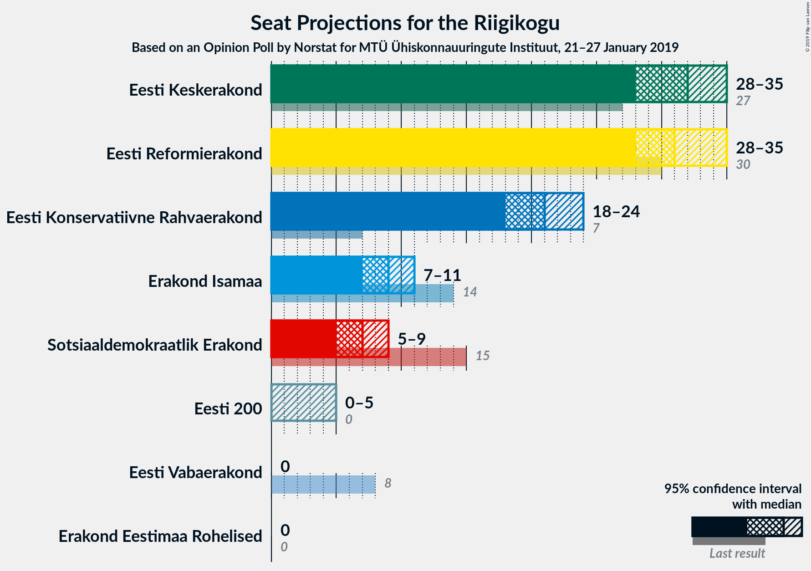
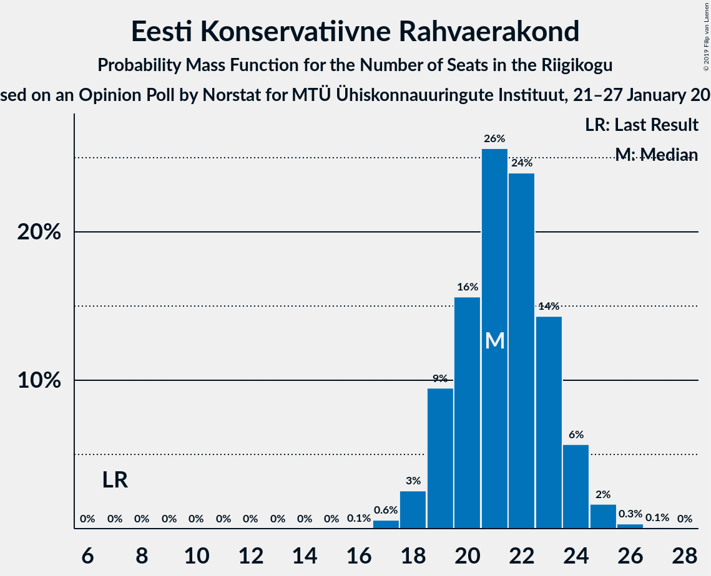
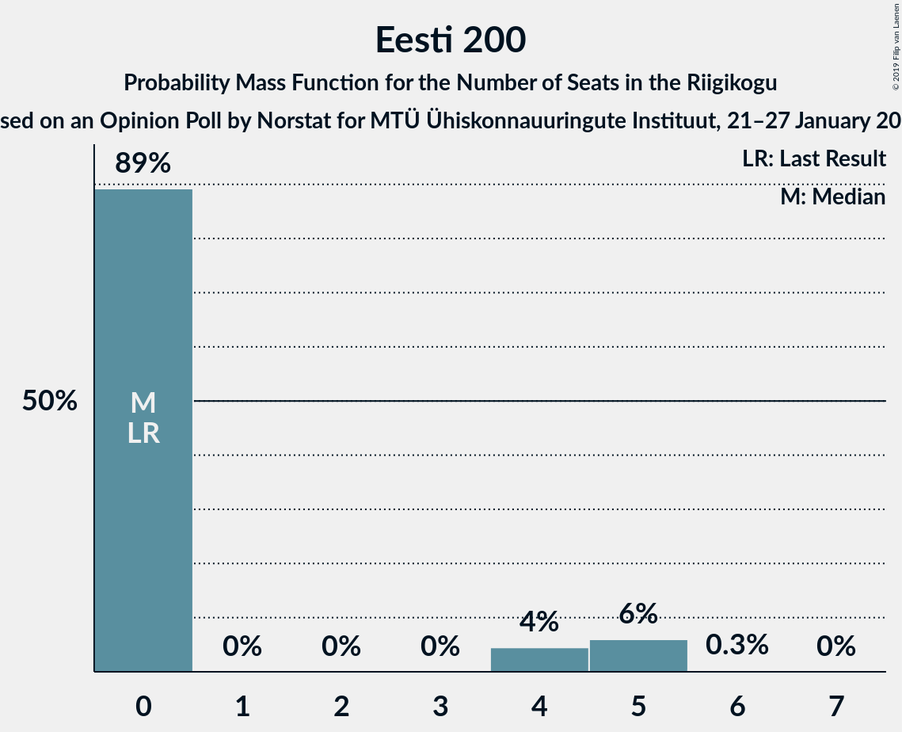
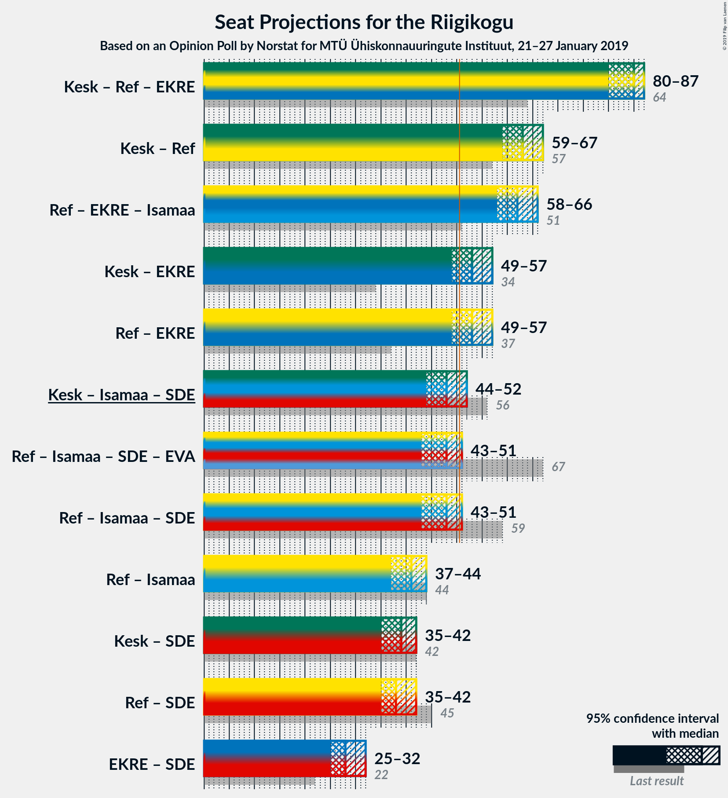

# Opinion Poll by Norstat for MTÜ Ühiskonnauuringute Instituut, 21–27 January 2019

<a href="#voting-intentions">Voting Intentions</a> | <a href="#seats">Seats</a> | <a href="#coalitions">Coalitions</a> | <a href="#technical-information">Technical Information</a>

## Voting Intentions

### Confidence Intervals

| Party | Last Result | Poll Result | 80% Confidence Interval | 90% Confidence Interval | 95% Confidence Interval | 99% Confidence Interval |
|:-----:|:-----------:|:-----------:|:-----------------------:|:-----------------------:|:-----------------------:|:-----------------------:|
| Eesti Keskerakond | 24.8% | 27.3% | 25.5–29.2% |25.1–29.7% |24.6–30.1% |23.8–31.1% |
| Eesti Reformierakond | 27.7% | 27.1% | 25.3–29.0% |24.9–29.5% |24.4–29.9% |23.6–30.8% |
| Eesti Konservatiivne Rahvaerakond | 8.1% | 19.2% | 17.7–20.9% |17.2–21.4% |16.9–21.8% |16.2–22.6% |
| Erakond Isamaa | 13.7% | 9.1% | 8.0–10.4% |7.7–10.7% |7.5–11.1% |7.0–11.7% |
| Sotsiaaldemokraatlik Erakond | 15.2% | 7.2% | 6.2–8.4% |6.0–8.7% |5.7–9.0% |5.3–9.6% |
| Eesti 200 | 0.0% | 4.2% | 3.5–5.1% |3.3–5.4% |3.1–5.6% |2.8–6.1% |
| Erakond Eestimaa Rohelised | 0.9% | 2.5% | 2.0–3.3% |1.8–3.5% |1.7–3.7% |1.5–4.1% |
| Eesti Vabaerakond | 8.7% | 0.9% | 0.6–1.4% |0.5–1.6% |0.5–1.7% |0.4–2.0% |

*Note:* The poll result column reflects the actual value used in the calculations. Published results may vary slightly, and in addition be rounded to fewer digits.

## Seats

### Confidence Intervals

| Party | Last Result | Median | 80% Confidence Interval | 90% Confidence Interval | 95% Confidence Interval | 99% Confidence Interval |
|:-----:|:-----------:|:------:|:-----------------------:|:-----------------------:|:-----------------------:|:-----------------------:|
| <a href="#eesti-keskerakond">Eesti Keskerakond</a> | 27 | 32 | 29–34 |29–35 |28–35 |27–36 |
| <a href="#eesti-reformierakond">Eesti Reformierakond</a> | 30 | 31 | 29–34 |29–34 |28–35 |27–36 |
| <a href="#eesti-konservatiivne-rahvaerakond">Eesti Konservatiivne Rahvaerakond</a> | 7 | 21 | 19–23 |19–24 |18–24 |17–25 |
| <a href="#erakond-isamaa">Erakond Isamaa</a> | 14 | 9 | 8–10 |7–11 |7–11 |7–12 |
| <a href="#sotsiaaldemokraatlik-erakond">Sotsiaaldemokraatlik Erakond</a> | 15 | 7 | 6–8 |5–8 |5–9 |5–10 |
| <a href="#eesti-200">Eesti 200</a> | 0 | 0 | 0–4 |0–5 |0–5 |0–5 |
| <a href="#erakond-eestimaa-rohelised">Erakond Eestimaa Rohelised</a> | 0 | 0 | 0 |0 |0 |0 |
| <a href="#eesti-vabaerakond">Eesti Vabaerakond</a> | 8 | 0 | 0 |0 |0 |0 |

### Eesti Keskerakond

*For a full overview of the results for this party, see the [Eesti Keskerakond](party-eestikeskerakond.html) page.*

| Number of Seats | Probability | Accumulated | Special Marks |
|:---------------:|:-----------:|:-----------:|:-------------:|
| 26 | 0.1% | 100% |  |
| 27 | 0.9% | 99.8% | Last Result |
| 28 | 3% | 98.9% |  |
| 29 | 8% | 96% |  |
| 30 | 13% | 89% |  |
| 31 | 23% | 76% |  |
| 32 | 18% | 52% | Median |
| 33 | 18% | 34% |  |
| 34 | 10% | 16% |  |
| 35 | 4% | 6% |  |
| 36 | 1.5% | 2% |  |
| 37 | 0.4% | 0.5% |  |
| 38 | 0.1% | 0.1% |  |
| 39 | 0% | 0% |  |

### Eesti Reformierakond

*For a full overview of the results for this party, see the [Eesti Reformierakond](party-eestireformierakond.html) page.*

| Number of Seats | Probability | Accumulated | Special Marks |
|:---------------:|:-----------:|:-----------:|:-------------:|
| 26 | 0.2% | 100% |  |
| 27 | 0.9% | 99.7% |  |
| 28 | 4% | 98.8% |  |
| 29 | 8% | 95% |  |
| 30 | 16% | 87% | Last Result |
| 31 | 23% | 71% | Median |
| 32 | 22% | 48% |  |
| 33 | 13% | 26% |  |
| 34 | 8% | 13% |  |
| 35 | 3% | 5% |  |
| 36 | 1.0% | 1.4% |  |
| 37 | 0.3% | 0.3% |  |
| 38 | 0.1% | 0.1% |  |
| 39 | 0% | 0% |  |

### Eesti Konservatiivne Rahvaerakond

*For a full overview of the results for this party, see the [Eesti Konservatiivne Rahvaerakond](party-eestikonservatiivnerahvaerakond.html) page.*

| Number of Seats | Probability | Accumulated | Special Marks |
|:---------------:|:-----------:|:-----------:|:-------------:|
| 7 | 0% | 100% | Last Result |
| 8 | 0% | 100% |  |
| 9 | 0% | 100% |  |
| 10 | 0% | 100% |  |
| 11 | 0% | 100% |  |
| 12 | 0% | 100% |  |
| 13 | 0% | 100% |  |
| 14 | 0% | 100% |  |
| 15 | 0% | 100% |  |
| 16 | 0.1% | 100% |  |
| 17 | 0.6% | 99.9% |  |
| 18 | 3% | 99.4% |  |
| 19 | 9% | 97% |  |
| 20 | 16% | 87% |  |
| 21 | 26% | 72% | Median |
| 22 | 24% | 46% |  |
| 23 | 14% | 22% |  |
| 24 | 6% | 8% |  |
| 25 | 2% | 2% |  |
| 26 | 0.3% | 0.4% |  |
| 27 | 0.1% | 0.1% |  |
| 28 | 0% | 0% |  |

### Erakond Isamaa

*For a full overview of the results for this party, see the [Erakond Isamaa](party-erakondisamaa.html) page.*

| Number of Seats | Probability | Accumulated | Special Marks |
|:---------------:|:-----------:|:-----------:|:-------------:|
| 6 | 0.4% | 100% |  |
| 7 | 5% | 99.6% |  |
| 8 | 24% | 95% |  |
| 9 | 37% | 71% | Median |
| 10 | 25% | 34% |  |
| 11 | 8% | 9% |  |
| 12 | 1.1% | 1.2% |  |
| 13 | 0.1% | 0.1% |  |
| 14 | 0% | 0% | Last Result |

### Sotsiaaldemokraatlik Erakond

*For a full overview of the results for this party, see the [Sotsiaaldemokraatlik Erakond](party-sotsiaaldemokraatlikerakond.html) page.*

| Number of Seats | Probability | Accumulated | Special Marks |
|:---------------:|:-----------:|:-----------:|:-------------:|
| 0 | 0.1% | 100% |  |
| 1 | 0% | 99.9% |  |
| 2 | 0% | 99.9% |  |
| 3 | 0% | 99.9% |  |
| 4 | 0.1% | 99.9% |  |
| 5 | 8% | 99.8% |  |
| 6 | 21% | 92% |  |
| 7 | 47% | 71% | Median |
| 8 | 19% | 24% |  |
| 9 | 4% | 5% |  |
| 10 | 0.7% | 0.7% |  |
| 11 | 0% | 0% |  |
| 12 | 0% | 0% |  |
| 13 | 0% | 0% |  |
| 14 | 0% | 0% |  |
| 15 | 0% | 0% | Last Result |

### Eesti 200

*For a full overview of the results for this party, see the [Eesti 200](party-eesti200.html) page.*

| Number of Seats | Probability | Accumulated | Special Marks |
|:---------------:|:-----------:|:-----------:|:-------------:|
| 0 | 89% | 100% | Last Result, Median |
| 1 | 0% | 11% |  |
| 2 | 0% | 11% |  |
| 3 | 0% | 11% |  |
| 4 | 4% | 11% |  |
| 5 | 6% | 6% |  |
| 6 | 0.3% | 0.3% |  |
| 7 | 0% | 0% |  |

### Erakond Eestimaa Rohelised

*For a full overview of the results for this party, see the [Erakond Eestimaa Rohelised](party-erakondeestimaarohelised.html) page.*

| Number of Seats | Probability | Accumulated | Special Marks |
|:---------------:|:-----------:|:-----------:|:-------------:|
| 0 | 100% | 100% | Last Result, Median |

### Eesti Vabaerakond

*For a full overview of the results for this party, see the [Eesti Vabaerakond](party-eestivabaerakond.html) page.*

| Number of Seats | Probability | Accumulated | Special Marks |
|:---------------:|:-----------:|:-----------:|:-------------:|
| 0 | 100% | 100% | Median |
| 1 | 0% | 0% |  |
| 2 | 0% | 0% |  |
| 3 | 0% | 0% |  |
| 4 | 0% | 0% |  |
| 5 | 0% | 0% |  |
| 6 | 0% | 0% |  |
| 7 | 0% | 0% |  |
| 8 | 0% | 0% | Last Result |

## Coalitions

### Confidence Intervals

| Coalition | Last Result | Median | Majority? | 80% Confidence Interval | 90% Confidence Interval | 95% Confidence Interval | 99% Confidence Interval |
|:---------:|:-----------:|:------:|:---------:|:-----------------------:|:-----------------------:|:-----------------------:|:-----------------------:|
| Eesti Keskerakond – Eesti Reformierakond – Eesti Konservatiivne Rahvaerakond | 64 | 85 | 100% | 82–86 | 81–87 | 80–87 | 79–88 |
| Eesti Keskerakond – Eesti Reformierakond | 57 | 63 | 100% | 61–66 | 60–66 | 59–67 | 58–68 |
| Eesti Reformierakond – Eesti Konservatiivne Rahvaerakond – Erakond Isamaa | 51 | 62 | 100% | 59–64 | 58–65 | 58–66 | 56–67 |
| Eesti Keskerakond – Eesti Konservatiivne Rahvaerakond | 34 | 53 | 88% | 50–56 | 50–56 | 49–57 | 47–58 |
| Eesti Reformierakond – Eesti Konservatiivne Rahvaerakond | 37 | 53 | 87% | 50–55 | 49–56 | 49–57 | 47–58 |
| Eesti Keskerakond – Erakond Isamaa – Sotsiaaldemokraatlik Erakond | 56 | 48 | 8% | 45–50 | 44–51 | 44–52 | 42–53 |
| Eesti Reformierakond – Erakond Isamaa – Sotsiaaldemokraatlik Erakond – Eesti Vabaerakond | 67 | 48 | 7% | 45–50 | 44–51 | 43–51 | 42–52 |
| Eesti Reformierakond – Erakond Isamaa – Sotsiaaldemokraatlik Erakond | 59 | 48 | 7% | 45–50 | 44–51 | 43–51 | 42–52 |
| Eesti Reformierakond – Erakond Isamaa | 44 | 41 | 0% | 38–43 | 37–44 | 37–44 | 35–46 |
| Eesti Keskerakond – Sotsiaaldemokraatlik Erakond | 42 | 39 | 0% | 36–41 | 35–42 | 35–42 | 34–44 |
| Eesti Reformierakond – Sotsiaaldemokraatlik Erakond | 45 | 38 | 0% | 36–41 | 35–42 | 35–42 | 33–43 |
| Eesti Konservatiivne Rahvaerakond – Sotsiaaldemokraatlik Erakond | 22 | 28 | 0% | 26–30 | 25–31 | 25–32 | 24–33 |

### Eesti Keskerakond – Eesti Reformierakond – Eesti Konservatiivne Rahvaerakond

| Number of Seats | Probability | Accumulated | Special Marks |
|:---------------:|:-----------:|:-----------:|:-------------:|
| 64 | 0% | 100% | Last Result |
| 65 | 0% | 100% |  |
| 66 | 0% | 100% |  |
| 67 | 0% | 100% |  |
| 68 | 0% | 100% |  |
| 69 | 0% | 100% |  |
| 70 | 0% | 100% |  |
| 71 | 0% | 100% |  |
| 72 | 0% | 100% |  |
| 73 | 0% | 100% |  |
| 74 | 0% | 100% |  |
| 75 | 0% | 100% |  |
| 76 | 0% | 100% |  |
| 77 | 0% | 100% |  |
| 78 | 0.2% | 99.9% |  |
| 79 | 0.9% | 99.7% |  |
| 80 | 2% | 98.8% |  |
| 81 | 4% | 97% |  |
| 82 | 5% | 93% |  |
| 83 | 11% | 88% |  |
| 84 | 22% | 77% | Median |
| 85 | 25% | 55% |  |
| 86 | 20% | 30% |  |
| 87 | 8% | 10% |  |
| 88 | 2% | 2% |  |
| 89 | 0.1% | 0.2% |  |
| 90 | 0% | 0.1% |  |
| 91 | 0% | 0.1% |  |
| 92 | 0% | 0% |  |

### Eesti Keskerakond – Eesti Reformierakond

| Number of Seats | Probability | Accumulated | Special Marks |
|:---------------:|:-----------:|:-----------:|:-------------:|
| 56 | 0.1% | 100% |  |
| 57 | 0.2% | 99.8% | Last Result |
| 58 | 1.1% | 99.7% |  |
| 59 | 2% | 98.5% |  |
| 60 | 4% | 96% |  |
| 61 | 8% | 92% |  |
| 62 | 19% | 84% |  |
| 63 | 24% | 65% | Median |
| 64 | 19% | 41% |  |
| 65 | 12% | 22% |  |
| 66 | 6% | 11% |  |
| 67 | 3% | 4% |  |
| 68 | 0.8% | 1.0% |  |
| 69 | 0.1% | 0.2% |  |
| 70 | 0% | 0% |  |

### Eesti Reformierakond – Eesti Konservatiivne Rahvaerakond – Erakond Isamaa

| Number of Seats | Probability | Accumulated | Special Marks |
|:---------------:|:-----------:|:-----------:|:-------------:|
| 51 | 0% | 100% | Last Result, Majority |
| 52 | 0% | 100% |  |
| 53 | 0% | 100% |  |
| 54 | 0.1% | 100% |  |
| 55 | 0.1% | 99.9% |  |
| 56 | 0.6% | 99.8% |  |
| 57 | 1.3% | 99.2% |  |
| 58 | 4% | 98% |  |
| 59 | 7% | 94% |  |
| 60 | 11% | 88% |  |
| 61 | 18% | 76% | Median |
| 62 | 18% | 58% |  |
| 63 | 19% | 40% |  |
| 64 | 12% | 21% |  |
| 65 | 6% | 9% |  |
| 66 | 3% | 4% |  |
| 67 | 0.7% | 0.9% |  |
| 68 | 0.1% | 0.2% |  |
| 69 | 0% | 0% |  |

### Eesti Keskerakond – Eesti Konservatiivne Rahvaerakond

| Number of Seats | Probability | Accumulated | Special Marks |
|:---------------:|:-----------:|:-----------:|:-------------:|
| 34 | 0% | 100% | Last Result |
| 35 | 0% | 100% |  |
| 36 | 0% | 100% |  |
| 37 | 0% | 100% |  |
| 38 | 0% | 100% |  |
| 39 | 0% | 100% |  |
| 40 | 0% | 100% |  |
| 41 | 0% | 100% |  |
| 42 | 0% | 100% |  |
| 43 | 0% | 100% |  |
| 44 | 0% | 100% |  |
| 45 | 0% | 100% |  |
| 46 | 0.1% | 100% |  |
| 47 | 0.4% | 99.9% |  |
| 48 | 0.9% | 99.4% |  |
| 49 | 3% | 98.5% |  |
| 50 | 7% | 95% |  |
| 51 | 10% | 88% | Majority |
| 52 | 17% | 79% |  |
| 53 | 20% | 61% | Median |
| 54 | 15% | 41% |  |
| 55 | 15% | 25% |  |
| 56 | 7% | 11% |  |
| 57 | 2% | 4% |  |
| 58 | 0.8% | 1.2% |  |
| 59 | 0.3% | 0.4% |  |
| 60 | 0.1% | 0.1% |  |
| 61 | 0% | 0% |  |

### Eesti Reformierakond – Eesti Konservatiivne Rahvaerakond

| Number of Seats | Probability | Accumulated | Special Marks |
|:---------------:|:-----------:|:-----------:|:-------------:|
| 37 | 0% | 100% | Last Result |
| 38 | 0% | 100% |  |
| 39 | 0% | 100% |  |
| 40 | 0% | 100% |  |
| 41 | 0% | 100% |  |
| 42 | 0% | 100% |  |
| 43 | 0% | 100% |  |
| 44 | 0% | 100% |  |
| 45 | 0% | 100% |  |
| 46 | 0.2% | 100% |  |
| 47 | 0.4% | 99.8% |  |
| 48 | 1.4% | 99.4% |  |
| 49 | 4% | 98% |  |
| 50 | 8% | 94% |  |
| 51 | 13% | 87% | Majority |
| 52 | 18% | 74% | Median |
| 53 | 19% | 56% |  |
| 54 | 17% | 37% |  |
| 55 | 10% | 20% |  |
| 56 | 7% | 10% |  |
| 57 | 2% | 3% |  |
| 58 | 0.9% | 1.1% |  |
| 59 | 0.2% | 0.2% |  |
| 60 | 0% | 0% |  |

### Eesti Keskerakond – Erakond Isamaa – Sotsiaaldemokraatlik Erakond

| Number of Seats | Probability | Accumulated | Special Marks |
|:---------------:|:-----------:|:-----------:|:-------------:|
| 41 | 0.2% | 100% |  |
| 42 | 0.5% | 99.8% |  |
| 43 | 2% | 99.3% |  |
| 44 | 3% | 98% |  |
| 45 | 9% | 94% |  |
| 46 | 12% | 86% |  |
| 47 | 19% | 73% |  |
| 48 | 19% | 55% | Median |
| 49 | 17% | 35% |  |
| 50 | 10% | 19% |  |
| 51 | 5% | 8% | Majority |
| 52 | 2% | 3% |  |
| 53 | 0.6% | 0.8% |  |
| 54 | 0.1% | 0.2% |  |
| 55 | 0% | 0% |  |
| 56 | 0% | 0% | Last Result |

### Eesti Reformierakond – Erakond Isamaa – Sotsiaaldemokraatlik Erakond – Eesti Vabaerakond

| Number of Seats | Probability | Accumulated | Special Marks |
|:---------------:|:-----------:|:-----------:|:-------------:|
| 40 | 0% | 100% |  |
| 41 | 0.2% | 99.9% |  |
| 42 | 0.6% | 99.7% |  |
| 43 | 2% | 99.1% |  |
| 44 | 4% | 97% |  |
| 45 | 10% | 94% |  |
| 46 | 17% | 84% |  |
| 47 | 17% | 67% | Median |
| 48 | 20% | 50% |  |
| 49 | 16% | 30% |  |
| 50 | 7% | 15% |  |
| 51 | 5% | 7% | Majority |
| 52 | 2% | 2% |  |
| 53 | 0.4% | 0.5% |  |
| 54 | 0.1% | 0.1% |  |
| 55 | 0% | 0% |  |
| 56 | 0% | 0% |  |
| 57 | 0% | 0% |  |
| 58 | 0% | 0% |  |
| 59 | 0% | 0% |  |
| 60 | 0% | 0% |  |
| 61 | 0% | 0% |  |
| 62 | 0% | 0% |  |
| 63 | 0% | 0% |  |
| 64 | 0% | 0% |  |
| 65 | 0% | 0% |  |
| 66 | 0% | 0% |  |
| 67 | 0% | 0% | Last Result |

### Eesti Reformierakond – Erakond Isamaa – Sotsiaaldemokraatlik Erakond

| Number of Seats | Probability | Accumulated | Special Marks |
|:---------------:|:-----------:|:-----------:|:-------------:|
| 40 | 0% | 100% |  |
| 41 | 0.2% | 99.9% |  |
| 42 | 0.6% | 99.7% |  |
| 43 | 2% | 99.1% |  |
| 44 | 4% | 97% |  |
| 45 | 10% | 94% |  |
| 46 | 17% | 84% |  |
| 47 | 17% | 67% | Median |
| 48 | 20% | 50% |  |
| 49 | 16% | 30% |  |
| 50 | 7% | 15% |  |
| 51 | 5% | 7% | Majority |
| 52 | 2% | 2% |  |
| 53 | 0.4% | 0.5% |  |
| 54 | 0.1% | 0.1% |  |
| 55 | 0% | 0% |  |
| 56 | 0% | 0% |  |
| 57 | 0% | 0% |  |
| 58 | 0% | 0% |  |
| 59 | 0% | 0% | Last Result |

### Eesti Reformierakond – Erakond Isamaa

| Number of Seats | Probability | Accumulated | Special Marks |
|:---------------:|:-----------:|:-----------:|:-------------:|
| 34 | 0.1% | 100% |  |
| 35 | 0.4% | 99.9% |  |
| 36 | 1.5% | 99.5% |  |
| 37 | 3% | 98% |  |
| 38 | 9% | 95% |  |
| 39 | 17% | 86% |  |
| 40 | 17% | 69% | Median |
| 41 | 22% | 52% |  |
| 42 | 14% | 30% |  |
| 43 | 9% | 16% |  |
| 44 | 5% | 7% | Last Result |
| 45 | 1.5% | 2% |  |
| 46 | 0.5% | 0.7% |  |
| 47 | 0.1% | 0.1% |  |
| 48 | 0% | 0% |  |

### Eesti Keskerakond – Sotsiaaldemokraatlik Erakond

| Number of Seats | Probability | Accumulated | Special Marks |
|:---------------:|:-----------:|:-----------:|:-------------:|
| 32 | 0.1% | 100% |  |
| 33 | 0.3% | 99.9% |  |
| 34 | 1.4% | 99.6% |  |
| 35 | 4% | 98% |  |
| 36 | 8% | 94% |  |
| 37 | 13% | 86% |  |
| 38 | 22% | 74% |  |
| 39 | 19% | 52% | Median |
| 40 | 17% | 33% |  |
| 41 | 9% | 16% |  |
| 42 | 4% | 6% | Last Result |
| 43 | 2% | 2% |  |
| 44 | 0.5% | 0.6% |  |
| 45 | 0.1% | 0.1% |  |
| 46 | 0% | 0% |  |

### Eesti Reformierakond – Sotsiaaldemokraatlik Erakond

| Number of Seats | Probability | Accumulated | Special Marks |
|:---------------:|:-----------:|:-----------:|:-------------:|
| 32 | 0.1% | 100% |  |
| 33 | 0.5% | 99.9% |  |
| 34 | 2% | 99.4% |  |
| 35 | 4% | 98% |  |
| 36 | 8% | 94% |  |
| 37 | 18% | 86% |  |
| 38 | 20% | 68% | Median |
| 39 | 21% | 47% |  |
| 40 | 14% | 26% |  |
| 41 | 8% | 13% |  |
| 42 | 4% | 5% |  |
| 43 | 1.2% | 2% |  |
| 44 | 0.3% | 0.3% |  |
| 45 | 0.1% | 0.1% | Last Result |
| 46 | 0% | 0% |  |

### Eesti Konservatiivne Rahvaerakond – Sotsiaaldemokraatlik Erakond

| Number of Seats | Probability | Accumulated | Special Marks |
|:---------------:|:-----------:|:-----------:|:-------------:|
| 22 | 0.1% | 100% | Last Result |
| 23 | 0.3% | 99.9% |  |
| 24 | 1.1% | 99.6% |  |
| 25 | 4% | 98% |  |
| 26 | 11% | 94% |  |
| 27 | 15% | 83% |  |
| 28 | 22% | 69% | Median |
| 29 | 23% | 46% |  |
| 30 | 14% | 23% |  |
| 31 | 6% | 9% |  |
| 32 | 2% | 3% |  |
| 33 | 0.7% | 0.8% |  |
| 34 | 0.1% | 0.2% |  |
| 35 | 0% | 0% |  |

## Technical Information

### Opinion Poll

+ **Polling firm:** Norstat
+ **Commissioner(s):** MTÜ Ühiskonnauuringute Instituut
+ **Fieldwork period:** 21–27 January 2019

### Calculations

+ **Sample size:** 1000
+ **Simulations done:** 1,048,576
+ **Error estimate:** 1.19%

