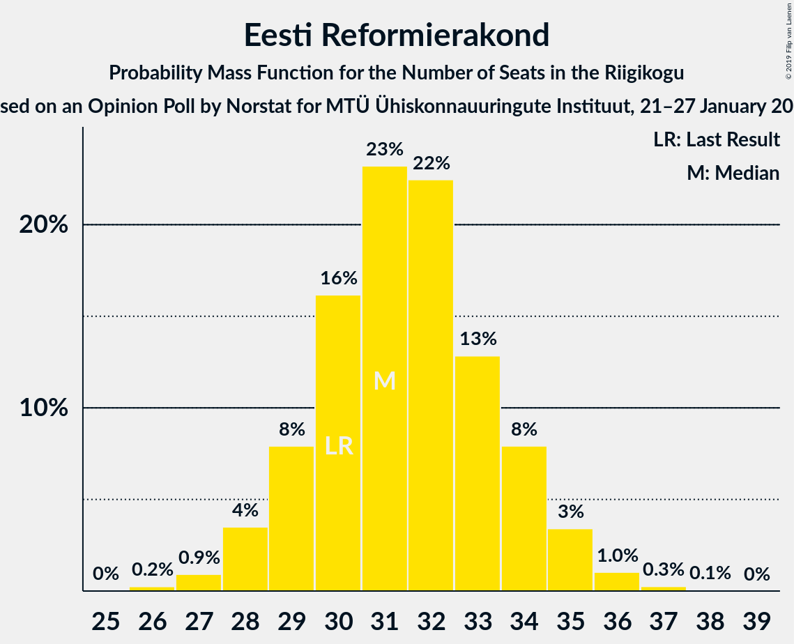
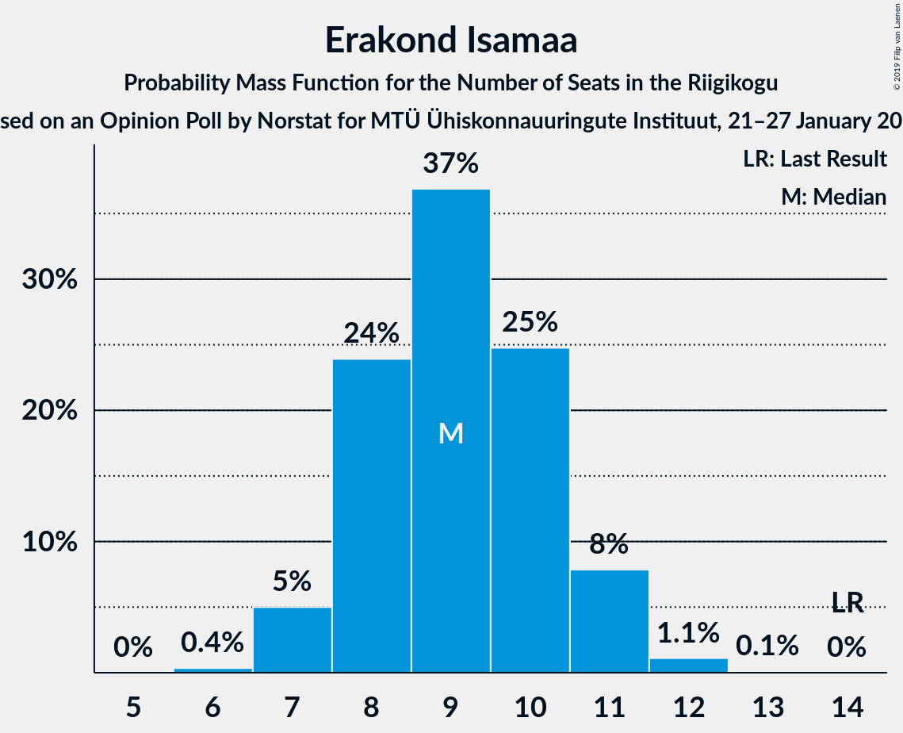
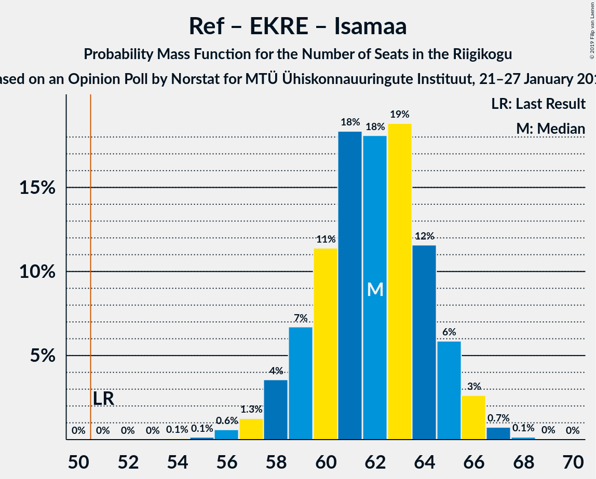
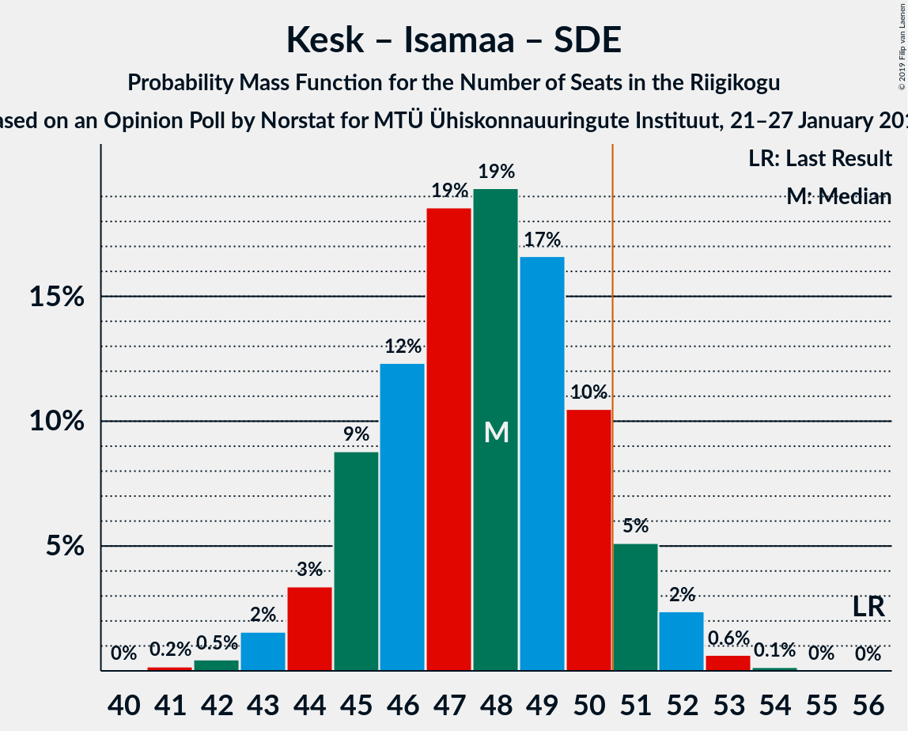

# Opinion Poll by Norstat for MTÜ Ühiskonnauuringute Instituut, 21–27 January 2019

<a href="#voting-intentions">Voting Intentions</a> | <a href="#seats">Seats</a> | <a href="#coalitions">Coalitions</a> | <a href="#technical-information">Technical Information</a>

## Voting Intentions

### Confidence Intervals

| Party | Last Result | Poll Result | 80% Confidence Interval | 90% Confidence Interval | 95% Confidence Interval | 99% Confidence Interval |
|:-----:|:-----------:|:-----------:|:-----------------------:|:-----------------------:|:-----------------------:|:-----------------------:|
| Eesti Keskerakond | 24.8% | 27.3% | 25.5–29.2% |25.1–29.7% |24.6–30.1% |23.8–31.1% |
| Eesti Reformierakond | 27.7% | 27.1% | 25.3–29.0% |24.9–29.5% |24.4–29.9% |23.6–30.8% |
| Eesti Konservatiivne Rahvaerakond | 8.1% | 19.2% | 17.7–20.9% |17.2–21.4% |16.9–21.8% |16.2–22.6% |
| Erakond Isamaa | 13.7% | 9.1% | 8.0–10.4% |7.7–10.7% |7.5–11.1% |7.0–11.7% |
| Sotsiaaldemokraatlik Erakond | 15.2% | 7.2% | 6.2–8.4% |6.0–8.7% |5.7–9.0% |5.3–9.6% |
| Eesti 200 | 0.0% | 4.2% | 3.5–5.1% |3.3–5.4% |3.1–5.6% |2.8–6.1% |
| Erakond Eestimaa Rohelised | 0.9% | 2.5% | 2.0–3.3% |1.8–3.5% |1.7–3.7% |1.5–4.1% |
| Eesti Vabaerakond | 8.7% | 0.9% | 0.6–1.4% |0.5–1.6% |0.5–1.7% |0.4–2.0% |

*Note:* The poll result column reflects the actual value used in the calculations. Published results may vary slightly, and in addition be rounded to fewer digits.

## Seats

### Confidence Intervals

| Party | Last Result | Median | 80% Confidence Interval | 90% Confidence Interval | 95% Confidence Interval | 99% Confidence Interval |
|:-----:|:-----------:|:------:|:-----------------------:|:-----------------------:|:-----------------------:|:-----------------------:|
| <a href="#eesti-keskerakond">Eesti Keskerakond</a> | 27 | 32 | 28–32 |28–34 |27–35 |25–39 |
| <a href="#eesti-reformierakond">Eesti Reformierakond</a> | 30 | 30 | 28–35 |28–37 |28–38 |27–38 |
| <a href="#eesti-konservatiivne-rahvaerakond">Eesti Konservatiivne Rahvaerakond</a> | 7 | 21 | 18–23 |18–24 |18–26 |17–26 |
| <a href="#erakond-isamaa">Erakond Isamaa</a> | 14 | 10 | 7–10 |7–10 |7–10 |6–11 |
| <a href="#sotsiaaldemokraatlik-erakond">Sotsiaaldemokraatlik Erakond</a> | 15 | 8 | 7–9 |6–9 |6–9 |6–9 |
| <a href="#eesti-200">Eesti 200</a> | 0 | 0 | 0–5 |0–5 |0–6 |0–6 |
| <a href="#erakond-eestimaa-rohelised">Erakond Eestimaa Rohelised</a> | 0 | 0 | 0 |0 |0 |0 |
| <a href="#eesti-vabaerakond">Eesti Vabaerakond</a> | 8 | 0 | 0 |0 |0 |0 |

### Eesti Keskerakond

*For a full overview of the results for this party, see the [Eesti Keskerakond](party-eestikeskerakond.html) page.*

| Number of Seats | Probability | Accumulated | Special Marks |
|:---------------:|:-----------:|:-----------:|:-------------:|
| 24 | 0.1% | 100% |  |
| 25 | 0.5% | 99.9% |  |
| 26 | 0.4% | 99.4% |  |
| 27 | 2% | 99.0% | Last Result |
| 28 | 8% | 97% |  |
| 29 | 16% | 89% |  |
| 30 | 6% | 72% |  |
| 31 | 2% | 66% |  |
| 32 | 55% | 65% | Median |
| 33 | 3% | 9% |  |
| 34 | 3% | 6% |  |
| 35 | 0.9% | 3% |  |
| 36 | 0.5% | 2% |  |
| 37 | 0.2% | 2% |  |
| 38 | 1.1% | 2% |  |
| 39 | 0.6% | 0.6% |  |
| 40 | 0% | 0% |  |

### Eesti Reformierakond

*For a full overview of the results for this party, see the [Eesti Reformierakond](party-eestireformierakond.html) page.*

| Number of Seats | Probability | Accumulated | Special Marks |
|:---------------:|:-----------:|:-----------:|:-------------:|
| 25 | 0.3% | 100% |  |
| 26 | 0% | 99.7% |  |
| 27 | 1.2% | 99.7% |  |
| 28 | 20% | 98.6% |  |
| 29 | 6% | 79% |  |
| 30 | 53% | 72% | Last Result, Median |
| 31 | 6% | 19% |  |
| 32 | 0% | 13% |  |
| 33 | 0.2% | 13% |  |
| 34 | 1.2% | 13% |  |
| 35 | 4% | 12% |  |
| 36 | 0.1% | 8% |  |
| 37 | 3% | 7% |  |
| 38 | 4% | 4% |  |
| 39 | 0% | 0% |  |

### Eesti Konservatiivne Rahvaerakond

*For a full overview of the results for this party, see the [Eesti Konservatiivne Rahvaerakond](party-eestikonservatiivnerahvaerakond.html) page.*

| Number of Seats | Probability | Accumulated | Special Marks |
|:---------------:|:-----------:|:-----------:|:-------------:|
| 7 | 0% | 100% | Last Result |
| 8 | 0% | 100% |  |
| 9 | 0% | 100% |  |
| 10 | 0% | 100% |  |
| 11 | 0% | 100% |  |
| 12 | 0% | 100% |  |
| 13 | 0% | 100% |  |
| 14 | 0% | 100% |  |
| 15 | 0% | 100% |  |
| 16 | 0% | 100% |  |
| 17 | 2% | 100% |  |
| 18 | 12% | 98% |  |
| 19 | 1.3% | 87% |  |
| 20 | 0.3% | 85% |  |
| 21 | 51% | 85% | Median |
| 22 | 18% | 34% |  |
| 23 | 9% | 16% |  |
| 24 | 3% | 6% |  |
| 25 | 0.7% | 4% |  |
| 26 | 3% | 3% |  |
| 27 | 0.3% | 0.3% |  |
| 28 | 0% | 0% |  |

### Erakond Isamaa

*For a full overview of the results for this party, see the [Erakond Isamaa](party-erakondisamaa.html) page.*

| Number of Seats | Probability | Accumulated | Special Marks |
|:---------------:|:-----------:|:-----------:|:-------------:|
| 6 | 0.7% | 100% |  |
| 7 | 18% | 99.3% |  |
| 8 | 22% | 82% |  |
| 9 | 7% | 59% |  |
| 10 | 51% | 52% | Median |
| 11 | 0.9% | 0.9% |  |
| 12 | 0% | 0% |  |
| 13 | 0% | 0% |  |
| 14 | 0% | 0% | Last Result |

### Sotsiaaldemokraatlik Erakond

*For a full overview of the results for this party, see the [Sotsiaaldemokraatlik Erakond](party-sotsiaaldemokraatlikerakond.html) page.*

| Number of Seats | Probability | Accumulated | Special Marks |
|:---------------:|:-----------:|:-----------:|:-------------:|
| 5 | 0.3% | 100% |  |
| 6 | 9% | 99.7% |  |
| 7 | 10% | 91% |  |
| 8 | 61% | 81% | Median |
| 9 | 20% | 20% |  |
| 10 | 0.1% | 0.1% |  |
| 11 | 0% | 0% |  |
| 12 | 0% | 0% |  |
| 13 | 0% | 0% |  |
| 14 | 0% | 0% |  |
| 15 | 0% | 0% | Last Result |

### Eesti 200

*For a full overview of the results for this party, see the [Eesti 200](party-eesti200.html) page.*

| Number of Seats | Probability | Accumulated | Special Marks |
|:---------------:|:-----------:|:-----------:|:-------------:|
| 0 | 72% | 100% | Last Result, Median |
| 1 | 0% | 28% |  |
| 2 | 0% | 28% |  |
| 3 | 0% | 28% |  |
| 4 | 0.7% | 28% |  |
| 5 | 24% | 27% |  |
| 6 | 4% | 4% |  |
| 7 | 0% | 0% |  |

### Erakond Eestimaa Rohelised

*For a full overview of the results for this party, see the [Erakond Eestimaa Rohelised](party-erakondeestimaarohelised.html) page.*

| Number of Seats | Probability | Accumulated | Special Marks |
|:---------------:|:-----------:|:-----------:|:-------------:|
| 0 | 100% | 100% | Last Result, Median |

### Eesti Vabaerakond

*For a full overview of the results for this party, see the [Eesti Vabaerakond](party-eestivabaerakond.html) page.*

| Number of Seats | Probability | Accumulated | Special Marks |
|:---------------:|:-----------:|:-----------:|:-------------:|
| 0 | 100% | 100% | Median |
| 1 | 0% | 0% |  |
| 2 | 0% | 0% |  |
| 3 | 0% | 0% |  |
| 4 | 0% | 0% |  |
| 5 | 0% | 0% |  |
| 6 | 0% | 0% |  |
| 7 | 0% | 0% |  |
| 8 | 0% | 0% | Last Result |

## Coalitions

### Confidence Intervals

| Coalition | Last Result | Median | Majority? | 80% Confidence Interval | 90% Confidence Interval | 95% Confidence Interval | 99% Confidence Interval |
|:---------:|:-----------:|:------:|:---------:|:-----------------------:|:-----------------------:|:-----------------------:|:-----------------------:|
| Eesti Keskerakond – Eesti Reformierakond – Eesti Konservatiivne Rahvaerakond | 64 | 83 | 100% | 79–87 | 79–88 | 79–88 | 77–88 |
| Eesti Keskerakond – Eesti Reformierakond | 57 | 62 | 100% | 57–65 | 57–70 | 56–70 | 55–70 |
| Eesti Reformierakond – Eesti Konservatiivne Rahvaerakond – Erakond Isamaa | 51 | 61 | 100% | 58–63 | 58–64 | 57–66 | 55–68 |
| Eesti Reformierakond – Eesti Konservatiivne Rahvaerakond | 37 | 51 | 75% | 50–56 | 49–57 | 49–58 | 47–59 |
| Eesti Keskerakond – Eesti Konservatiivne Rahvaerakond | 34 | 53 | 89% | 50–53 | 48–57 | 48–58 | 48–58 |
| Eesti Reformierakond – Erakond Isamaa – Sotsiaaldemokraatlik Erakond – Eesti Vabaerakond | 67 | 48 | 5% | 44–50 | 43–51 | 43–51 | 43–51 |
| Eesti Reformierakond – Erakond Isamaa – Sotsiaaldemokraatlik Erakond | 59 | 48 | 5% | 44–50 | 43–51 | 43–51 | 43–51 |
| Eesti Keskerakond – Erakond Isamaa – Sotsiaaldemokraatlik Erakond | 56 | 50 | 2% | 43–50 | 43–50 | 42–50 | 42–53 |
| Eesti Reformierakond – Erakond Isamaa | 44 | 40 | 0% | 36–43 | 36–44 | 36–45 | 35–45 |
| Eesti Reformierakond – Sotsiaaldemokraatlik Erakond | 45 | 38 | 0% | 37–42 | 36–43 | 36–44 | 35–44 |
| Eesti Keskerakond – Sotsiaaldemokraatlik Erakond | 42 | 40 | 0% | 36–40 | 35–41 | 34–43 | 33–46 |
| Eesti Konservatiivne Rahvaerakond – Sotsiaaldemokraatlik Erakond | 22 | 29 | 0% | 26–31 | 24–31 | 24–33 | 24–35 |

### Eesti Keskerakond – Eesti Reformierakond – Eesti Konservatiivne Rahvaerakond

| Number of Seats | Probability | Accumulated | Special Marks |
|:---------------:|:-----------:|:-----------:|:-------------:|
| 64 | 0% | 100% | Last Result |
| 65 | 0% | 100% |  |
| 66 | 0% | 100% |  |
| 67 | 0% | 100% |  |
| 68 | 0% | 100% |  |
| 69 | 0% | 100% |  |
| 70 | 0% | 100% |  |
| 71 | 0% | 100% |  |
| 72 | 0% | 100% |  |
| 73 | 0% | 100% |  |
| 74 | 0% | 100% |  |
| 75 | 0% | 100% |  |
| 76 | 0% | 100% |  |
| 77 | 0.7% | 100% |  |
| 78 | 2% | 99.3% |  |
| 79 | 20% | 98% |  |
| 80 | 4% | 77% |  |
| 81 | 2% | 74% |  |
| 82 | 0% | 72% |  |
| 83 | 52% | 72% | Median |
| 84 | 0.8% | 20% |  |
| 85 | 0.1% | 19% |  |
| 86 | 5% | 19% |  |
| 87 | 4% | 13% |  |
| 88 | 9% | 10% |  |
| 89 | 0.2% | 0.4% |  |
| 90 | 0.1% | 0.1% |  |
| 91 | 0% | 0% |  |

### Eesti Keskerakond – Eesti Reformierakond

| Number of Seats | Probability | Accumulated | Special Marks |
|:---------------:|:-----------:|:-----------:|:-------------:|
| 55 | 2% | 100% |  |
| 56 | 0.3% | 98% |  |
| 57 | 21% | 97% | Last Result |
| 58 | 0.1% | 76% |  |
| 59 | 0.6% | 76% |  |
| 60 | 0% | 75% |  |
| 61 | 6% | 75% |  |
| 62 | 51% | 70% | Median |
| 63 | 8% | 19% |  |
| 64 | 0.7% | 11% |  |
| 65 | 0.8% | 10% |  |
| 66 | 0.2% | 10% |  |
| 67 | 0.2% | 9% |  |
| 68 | 0% | 9% |  |
| 69 | 1.3% | 9% |  |
| 70 | 8% | 8% |  |
| 71 | 0% | 0% |  |

### Eesti Reformierakond – Eesti Konservatiivne Rahvaerakond – Erakond Isamaa

| Number of Seats | Probability | Accumulated | Special Marks |
|:---------------:|:-----------:|:-----------:|:-------------:|
| 51 | 0% | 100% | Last Result, Majority |
| 52 | 0% | 100% |  |
| 53 | 0% | 100% |  |
| 54 | 0% | 100% |  |
| 55 | 0.6% | 99.9% |  |
| 56 | 2% | 99.3% |  |
| 57 | 1.4% | 98% |  |
| 58 | 21% | 96% |  |
| 59 | 4% | 75% |  |
| 60 | 3% | 71% |  |
| 61 | 52% | 68% | Median |
| 62 | 6% | 17% |  |
| 63 | 4% | 11% |  |
| 64 | 1.3% | 6% |  |
| 65 | 0% | 5% |  |
| 66 | 4% | 5% |  |
| 67 | 0% | 0.6% |  |
| 68 | 0.5% | 0.6% |  |
| 69 | 0% | 0% |  |

### Eesti Reformierakond – Eesti Konservatiivne Rahvaerakond

| Number of Seats | Probability | Accumulated | Special Marks |
|:---------------:|:-----------:|:-----------:|:-------------:|
| 37 | 0% | 100% | Last Result |
| 38 | 0% | 100% |  |
| 39 | 0% | 100% |  |
| 40 | 0% | 100% |  |
| 41 | 0% | 100% |  |
| 42 | 0% | 100% |  |
| 43 | 0% | 100% |  |
| 44 | 0% | 100% |  |
| 45 | 0% | 100% |  |
| 46 | 0% | 100% |  |
| 47 | 2% | 99.9% |  |
| 48 | 0.3% | 98% |  |
| 49 | 4% | 98% |  |
| 50 | 18% | 94% |  |
| 51 | 52% | 75% | Median, Majority |
| 52 | 4% | 24% |  |
| 53 | 4% | 20% |  |
| 54 | 2% | 15% |  |
| 55 | 3% | 14% |  |
| 56 | 4% | 10% |  |
| 57 | 1.0% | 6% |  |
| 58 | 4% | 5% |  |
| 59 | 0.7% | 0.7% |  |
| 60 | 0% | 0% |  |

### Eesti Keskerakond – Eesti Konservatiivne Rahvaerakond

| Number of Seats | Probability | Accumulated | Special Marks |
|:---------------:|:-----------:|:-----------:|:-------------:|
| 34 | 0% | 100% | Last Result |
| 35 | 0% | 100% |  |
| 36 | 0% | 100% |  |
| 37 | 0% | 100% |  |
| 38 | 0% | 100% |  |
| 39 | 0% | 100% |  |
| 40 | 0% | 100% |  |
| 41 | 0% | 100% |  |
| 42 | 0% | 100% |  |
| 43 | 0% | 100% |  |
| 44 | 0% | 100% |  |
| 45 | 0.1% | 100% |  |
| 46 | 0% | 99.9% |  |
| 47 | 0% | 99.9% |  |
| 48 | 5% | 99.9% |  |
| 49 | 1.2% | 95% |  |
| 50 | 5% | 93% |  |
| 51 | 27% | 89% | Majority |
| 52 | 0.1% | 61% |  |
| 53 | 54% | 61% | Median |
| 54 | 0.1% | 8% |  |
| 55 | 0.4% | 8% |  |
| 56 | 1.2% | 7% |  |
| 57 | 2% | 6% |  |
| 58 | 4% | 4% |  |
| 59 | 0% | 0% |  |

### Eesti Reformierakond – Erakond Isamaa – Sotsiaaldemokraatlik Erakond – Eesti Vabaerakond

| Number of Seats | Probability | Accumulated | Special Marks |
|:---------------:|:-----------:|:-----------:|:-------------:|
| 42 | 0.1% | 100% |  |
| 43 | 6% | 99.9% |  |
| 44 | 6% | 94% |  |
| 45 | 18% | 88% |  |
| 46 | 0.4% | 71% |  |
| 47 | 0% | 70% |  |
| 48 | 58% | 70% | Median |
| 49 | 0.1% | 13% |  |
| 50 | 7% | 12% |  |
| 51 | 5% | 5% | Majority |
| 52 | 0.4% | 0.4% |  |
| 53 | 0% | 0% |  |
| 54 | 0% | 0% |  |
| 55 | 0% | 0% |  |
| 56 | 0% | 0% |  |
| 57 | 0% | 0% |  |
| 58 | 0% | 0% |  |
| 59 | 0% | 0% |  |
| 60 | 0% | 0% |  |
| 61 | 0% | 0% |  |
| 62 | 0% | 0% |  |
| 63 | 0% | 0% |  |
| 64 | 0% | 0% |  |
| 65 | 0% | 0% |  |
| 66 | 0% | 0% |  |
| 67 | 0% | 0% | Last Result |

### Eesti Reformierakond – Erakond Isamaa – Sotsiaaldemokraatlik Erakond

| Number of Seats | Probability | Accumulated | Special Marks |
|:---------------:|:-----------:|:-----------:|:-------------:|
| 42 | 0.1% | 100% |  |
| 43 | 6% | 99.9% |  |
| 44 | 6% | 94% |  |
| 45 | 18% | 88% |  |
| 46 | 0.4% | 71% |  |
| 47 | 0% | 70% |  |
| 48 | 58% | 70% | Median |
| 49 | 0.1% | 13% |  |
| 50 | 7% | 12% |  |
| 51 | 5% | 5% | Majority |
| 52 | 0.4% | 0.4% |  |
| 53 | 0% | 0% |  |
| 54 | 0% | 0% |  |
| 55 | 0% | 0% |  |
| 56 | 0% | 0% |  |
| 57 | 0% | 0% |  |
| 58 | 0% | 0% |  |
| 59 | 0% | 0% | Last Result |

### Eesti Keskerakond – Erakond Isamaa – Sotsiaaldemokraatlik Erakond

| Number of Seats | Probability | Accumulated | Special Marks |
|:---------------:|:-----------:|:-----------:|:-------------:|
| 39 | 0.3% | 100% |  |
| 40 | 0.1% | 99.7% |  |
| 41 | 0% | 99.6% |  |
| 42 | 2% | 99.6% |  |
| 43 | 8% | 97% |  |
| 44 | 0.7% | 89% |  |
| 45 | 4% | 89% |  |
| 46 | 20% | 84% |  |
| 47 | 5% | 65% |  |
| 48 | 4% | 60% |  |
| 49 | 2% | 56% |  |
| 50 | 52% | 54% | Median |
| 51 | 1.1% | 2% | Majority |
| 52 | 0.5% | 1.1% |  |
| 53 | 0.3% | 0.5% |  |
| 54 | 0.2% | 0.2% |  |
| 55 | 0% | 0% |  |
| 56 | 0% | 0% | Last Result |

### Eesti Reformierakond – Erakond Isamaa

| Number of Seats | Probability | Accumulated | Special Marks |
|:---------------:|:-----------:|:-----------:|:-------------:|
| 35 | 1.1% | 100% |  |
| 36 | 25% | 98.8% |  |
| 37 | 1.1% | 73% |  |
| 38 | 2% | 72% |  |
| 39 | 3% | 70% |  |
| 40 | 55% | 68% | Median |
| 41 | 0.8% | 13% |  |
| 42 | 0.1% | 12% |  |
| 43 | 5% | 12% |  |
| 44 | 3% | 8% | Last Result |
| 45 | 4% | 4% |  |
| 46 | 0% | 0% |  |

### Eesti Reformierakond – Sotsiaaldemokraatlik Erakond

| Number of Seats | Probability | Accumulated | Special Marks |
|:---------------:|:-----------:|:-----------:|:-------------:|
| 33 | 0.3% | 100% |  |
| 34 | 0% | 99.7% |  |
| 35 | 2% | 99.7% |  |
| 36 | 5% | 98% |  |
| 37 | 22% | 93% |  |
| 38 | 51% | 71% | Median |
| 39 | 6% | 19% |  |
| 40 | 0% | 13% |  |
| 41 | 0.7% | 13% |  |
| 42 | 5% | 13% |  |
| 43 | 3% | 8% |  |
| 44 | 4% | 5% |  |
| 45 | 0.2% | 0.2% | Last Result |
| 46 | 0% | 0% |  |

### Eesti Keskerakond – Sotsiaaldemokraatlik Erakond

| Number of Seats | Probability | Accumulated | Special Marks |
|:---------------:|:-----------:|:-----------:|:-------------:|
| 32 | 0.4% | 100% |  |
| 33 | 0.6% | 99.6% |  |
| 34 | 2% | 99.0% |  |
| 35 | 4% | 97% |  |
| 36 | 4% | 93% |  |
| 37 | 0.9% | 89% |  |
| 38 | 25% | 88% |  |
| 39 | 4% | 63% |  |
| 40 | 52% | 59% | Median |
| 41 | 3% | 6% |  |
| 42 | 0.6% | 4% | Last Result |
| 43 | 0.9% | 3% |  |
| 44 | 1.4% | 2% |  |
| 45 | 0% | 0.7% |  |
| 46 | 0.6% | 0.6% |  |
| 47 | 0% | 0% |  |

### Eesti Konservatiivne Rahvaerakond – Sotsiaaldemokraatlik Erakond

| Number of Seats | Probability | Accumulated | Special Marks |
|:---------------:|:-----------:|:-----------:|:-------------:|
| 22 | 0% | 100% | Last Result |
| 23 | 0% | 100% |  |
| 24 | 7% | 100% |  |
| 25 | 2% | 93% |  |
| 26 | 5% | 91% |  |
| 27 | 0.2% | 85% |  |
| 28 | 0.4% | 85% |  |
| 29 | 51% | 85% | Median |
| 30 | 5% | 33% |  |
| 31 | 24% | 28% |  |
| 32 | 0% | 4% |  |
| 33 | 3% | 4% |  |
| 34 | 0.1% | 1.3% |  |
| 35 | 1.1% | 1.1% |  |
| 36 | 0% | 0% |  |

## Technical Information

### Opinion Poll

+ **Polling firm:** Norstat
+ **Commissioner(s):** MTÜ Ühiskonnauuringute Instituut
+ **Fieldwork period:** 21–27 January 2019

### Calculations

+ **Sample size:** 1000
+ **Simulations done:** 1,024
+ **Error estimate:** 2.39%

