# Opinion Poll by Kantar Emor for BNS and Postimees, 24–29 January 2019

<a href="#voting-intentions">Voting Intentions</a> | <a href="#seats">Seats</a> | <a href="#coalitions">Coalitions</a> | <a href="#technical-information">Technical Information</a>

## Voting Intentions

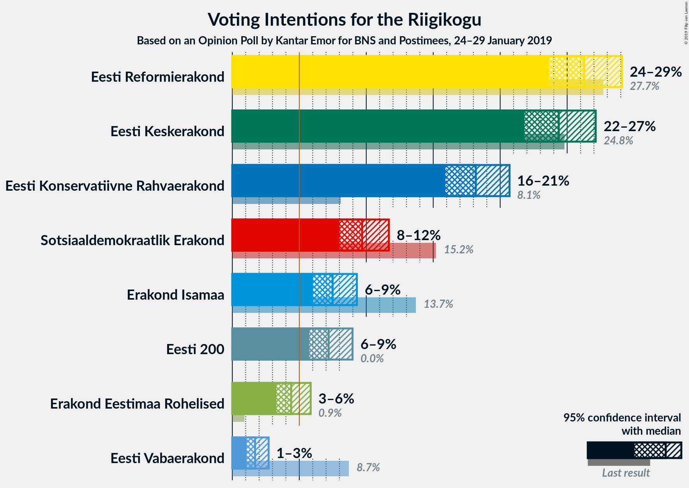

### Confidence Intervals

| Party | Last Result | Poll Result | 80% Confidence Interval | 90% Confidence Interval | 95% Confidence Interval | 99% Confidence Interval |
|:-----:|:-----------:|:-----------:|:-----------------------:|:-----------------------:|:-----------------------:|:-----------------------:|
| Eesti Reformierakond | 27.7% | 26.3% | 24.5–28.1% |24.1–28.6% |23.6–29.1% |22.8–30.0% |
| Eesti Keskerakond | 24.8% | 24.4% | 22.7–26.2% |22.2–26.7% |21.8–27.1% |21.0–28.0% |
| Eesti Konservatiivne Rahvaerakond | 8.1% | 18.2% | 16.7–19.8% |16.3–20.3% |15.9–20.7% |15.2–21.5% |
| Sotsiaaldemokraatlik Erakond | 15.2% | 9.7% | 8.6–11.0% |8.3–11.4% |8.0–11.7% |7.5–12.3% |
| Erakond Isamaa | 13.7% | 7.5% | 6.5–8.7% |6.2–9.0% |6.0–9.3% |5.6–9.9% |
| Eesti 200 | 0.0% | 7.2% | 6.2–8.4% |6.0–8.7% |5.7–9.0% |5.3–9.6% |
| Erakond Eestimaa Rohelised | 0.9% | 4.4% | 3.7–5.3% |3.5–5.6% |3.3–5.9% |3.0–6.3% |
| Eesti Vabaerakond | 8.7% | 1.7% | 1.3–2.4% |1.2–2.5% |1.1–2.7% |0.9–3.1% |

*Note:* The poll result column reflects the actual value used in the calculations. Published results may vary slightly, and in addition be rounded to fewer digits.

## Seats

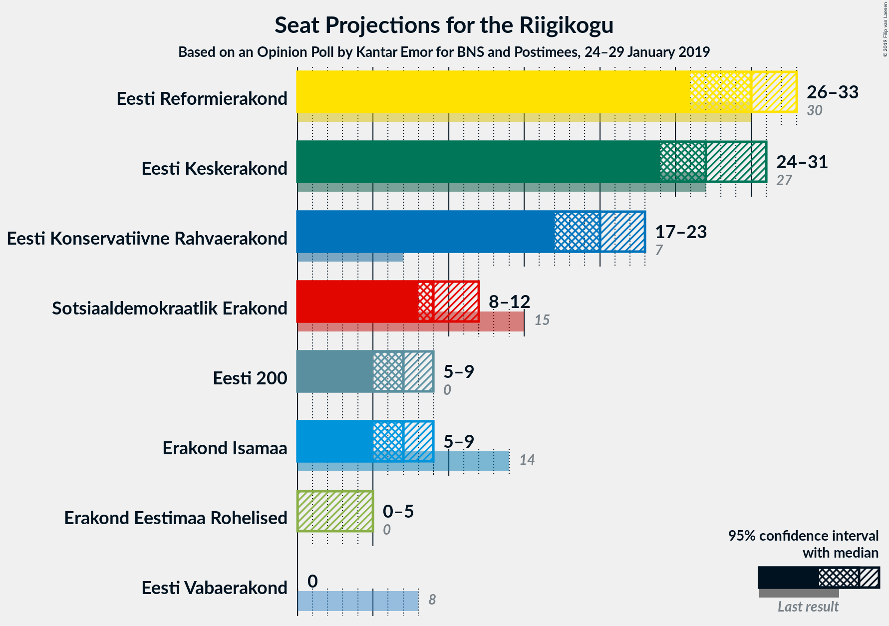

### Confidence Intervals

| Party | Last Result | Median | 80% Confidence Interval | 90% Confidence Interval | 95% Confidence Interval | 99% Confidence Interval |
|:-----:|:-----------:|:------:|:-----------------------:|:-----------------------:|:-----------------------:|:-----------------------:|
| <a href="#eesti-reformierakond">Eesti Reformierakond</a> | 30 | 30 | 27–32 |27–33 |26–33 |25–35 |
| <a href="#eesti-keskerakond">Eesti Keskerakond</a> | 27 | 27 | 25–30 |25–30 |24–31 |23–32 |
| <a href="#eesti-konservatiivne-rahvaerakond">Eesti Konservatiivne Rahvaerakond</a> | 7 | 20 | 18–22 |17–22 |17–23 |16–24 |
| <a href="#sotsiaaldemokraatlik-erakond">Sotsiaaldemokraatlik Erakond</a> | 15 | 9 | 8–11 |8–11 |8–12 |7–13 |
| <a href="#erakond-isamaa">Erakond Isamaa</a> | 14 | 7 | 6–8 |6–9 |5–9 |5–10 |
| <a href="#eesti-200">Eesti 200</a> | 0 | 7 | 6–8 |5–8 |5–9 |5–9 |
| <a href="#erakond-eestimaa-rohelised">Erakond Eestimaa Rohelised</a> | 0 | 0 | 0–4 |0–5 |0–5 |0–6 |
| <a href="#eesti-vabaerakond">Eesti Vabaerakond</a> | 8 | 0 | 0 |0 |0 |0 |

### Eesti Reformierakond

*For a full overview of the results for this party, see the [Eesti Reformierakond](party-eestireformierakond.html) page.*

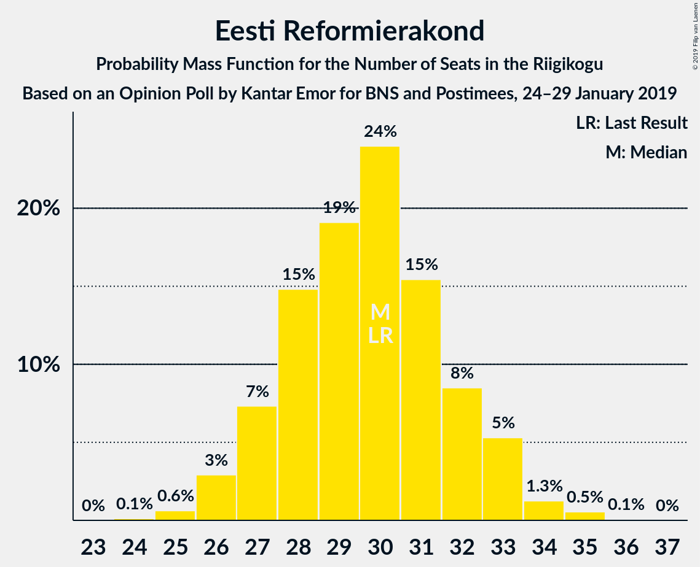

| Number of Seats | Probability | Accumulated | Special Marks |
|:---------------:|:-----------:|:-----------:|:-------------:|
| 24 | 0.1% | 100% |  |
| 25 | 0.6% | 99.9% |  |
| 26 | 3% | 99.2% |  |
| 27 | 7% | 96% |  |
| 28 | 15% | 89% |  |
| 29 | 19% | 74% |  |
| 30 | 24% | 55% | Last Result, Median |
| 31 | 15% | 31% |  |
| 32 | 8% | 16% |  |
| 33 | 5% | 7% |  |
| 34 | 1.3% | 2% |  |
| 35 | 0.5% | 0.6% |  |
| 36 | 0.1% | 0.1% |  |
| 37 | 0% | 0% |  |

### Eesti Keskerakond

*For a full overview of the results for this party, see the [Eesti Keskerakond](party-eestikeskerakond.html) page.*

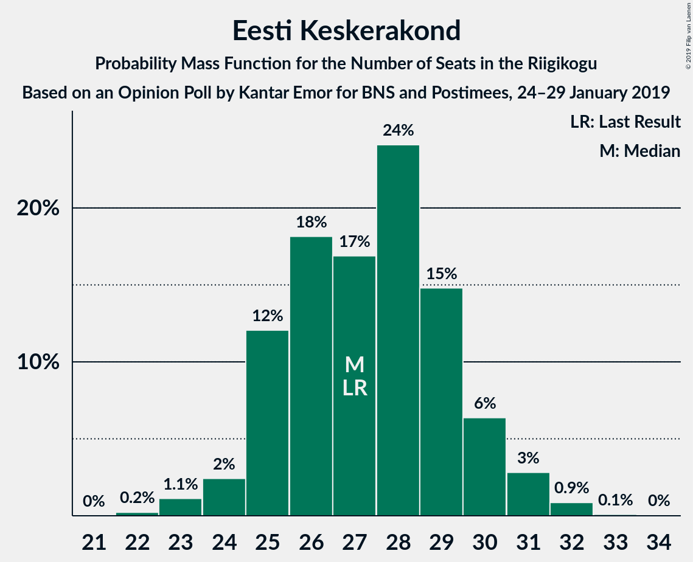

| Number of Seats | Probability | Accumulated | Special Marks |
|:---------------:|:-----------:|:-----------:|:-------------:|
| 22 | 0.2% | 100% |  |
| 23 | 1.1% | 99.7% |  |
| 24 | 2% | 98.6% |  |
| 25 | 12% | 96% |  |
| 26 | 18% | 84% |  |
| 27 | 17% | 66% | Last Result, Median |
| 28 | 24% | 49% |  |
| 29 | 15% | 25% |  |
| 30 | 6% | 10% |  |
| 31 | 3% | 4% |  |
| 32 | 0.9% | 1.0% |  |
| 33 | 0.1% | 0.1% |  |
| 34 | 0% | 0% |  |

### Eesti Konservatiivne Rahvaerakond

*For a full overview of the results for this party, see the [Eesti Konservatiivne Rahvaerakond](party-eestikonservatiivnerahvaerakond.html) page.*

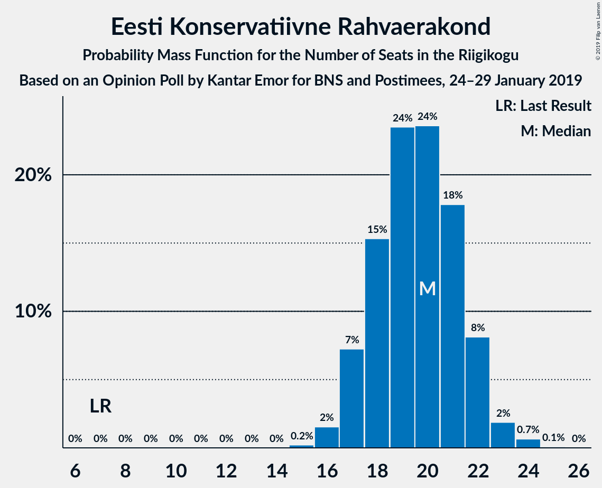

| Number of Seats | Probability | Accumulated | Special Marks |
|:---------------:|:-----------:|:-----------:|:-------------:|
| 7 | 0% | 100% | Last Result |
| 8 | 0% | 100% |  |
| 9 | 0% | 100% |  |
| 10 | 0% | 100% |  |
| 11 | 0% | 100% |  |
| 12 | 0% | 100% |  |
| 13 | 0% | 100% |  |
| 14 | 0% | 100% |  |
| 15 | 0.2% | 100% |  |
| 16 | 2% | 99.8% |  |
| 17 | 7% | 98% |  |
| 18 | 15% | 91% |  |
| 19 | 24% | 76% |  |
| 20 | 24% | 52% | Median |
| 21 | 18% | 29% |  |
| 22 | 8% | 11% |  |
| 23 | 2% | 3% |  |
| 24 | 0.7% | 0.7% |  |
| 25 | 0.1% | 0.1% |  |
| 26 | 0% | 0% |  |

### Sotsiaaldemokraatlik Erakond

*For a full overview of the results for this party, see the [Sotsiaaldemokraatlik Erakond](party-sotsiaaldemokraatlikerakond.html) page.*

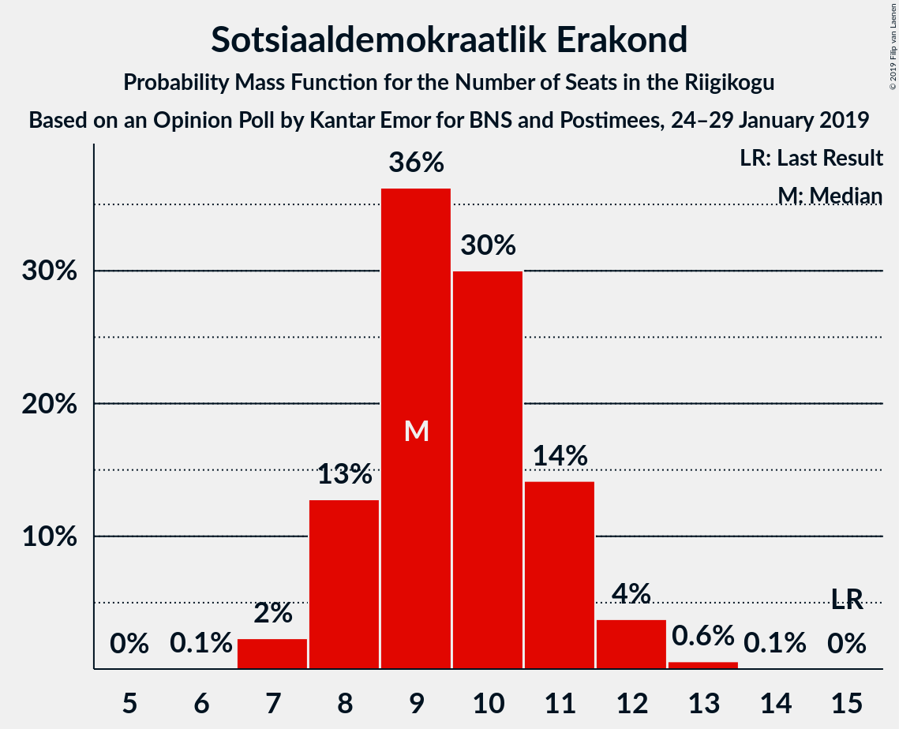

| Number of Seats | Probability | Accumulated | Special Marks |
|:---------------:|:-----------:|:-----------:|:-------------:|
| 6 | 0.1% | 100% |  |
| 7 | 2% | 99.9% |  |
| 8 | 13% | 98% |  |
| 9 | 36% | 85% | Median |
| 10 | 30% | 49% |  |
| 11 | 14% | 19% |  |
| 12 | 4% | 4% |  |
| 13 | 0.6% | 0.6% |  |
| 14 | 0.1% | 0.1% |  |
| 15 | 0% | 0% | Last Result |

### Erakond Isamaa

*For a full overview of the results for this party, see the [Erakond Isamaa](party-erakondisamaa.html) page.*

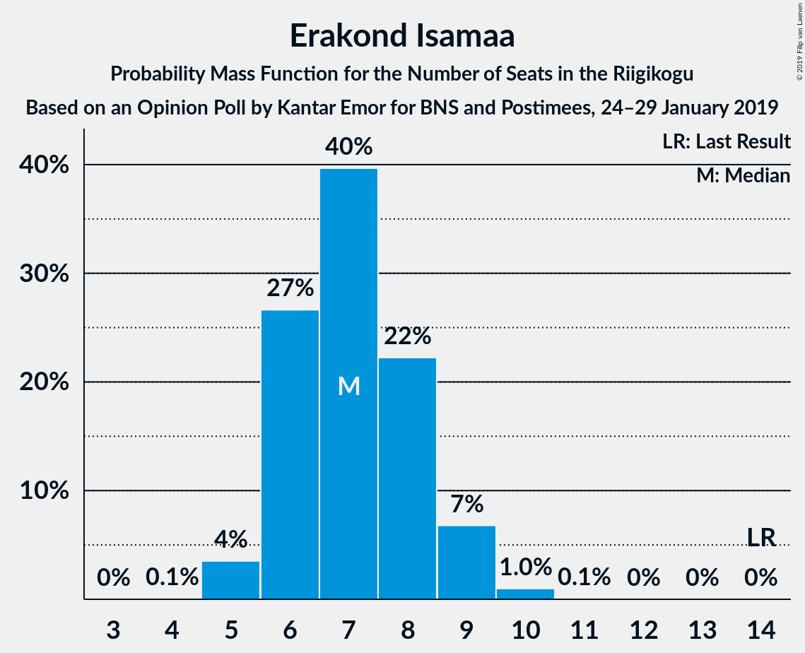

| Number of Seats | Probability | Accumulated | Special Marks |
|:---------------:|:-----------:|:-----------:|:-------------:|
| 4 | 0.1% | 100% |  |
| 5 | 4% | 99.9% |  |
| 6 | 27% | 96% |  |
| 7 | 40% | 70% | Median |
| 8 | 22% | 30% |  |
| 9 | 7% | 8% |  |
| 10 | 1.0% | 1.0% |  |
| 11 | 0.1% | 0.1% |  |
| 12 | 0% | 0% |  |
| 13 | 0% | 0% |  |
| 14 | 0% | 0% | Last Result |

### Eesti 200

*For a full overview of the results for this party, see the [Eesti 200](party-eesti200.html) page.*

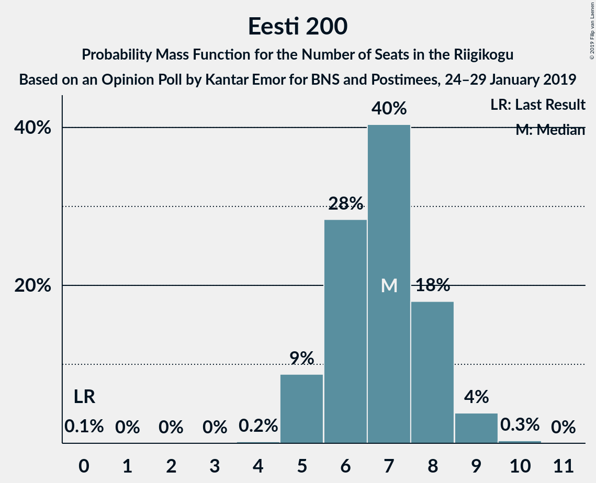

| Number of Seats | Probability | Accumulated | Special Marks |
|:---------------:|:-----------:|:-----------:|:-------------:|
| 0 | 0.1% | 100% | Last Result |
| 1 | 0% | 99.9% |  |
| 2 | 0% | 99.9% |  |
| 3 | 0% | 99.9% |  |
| 4 | 0.2% | 99.9% |  |
| 5 | 9% | 99.7% |  |
| 6 | 28% | 91% |  |
| 7 | 40% | 63% | Median |
| 8 | 18% | 22% |  |
| 9 | 4% | 4% |  |
| 10 | 0.3% | 0.3% |  |
| 11 | 0% | 0% |  |

### Erakond Eestimaa Rohelised

*For a full overview of the results for this party, see the [Erakond Eestimaa Rohelised](party-erakondeestimaarohelised.html) page.*

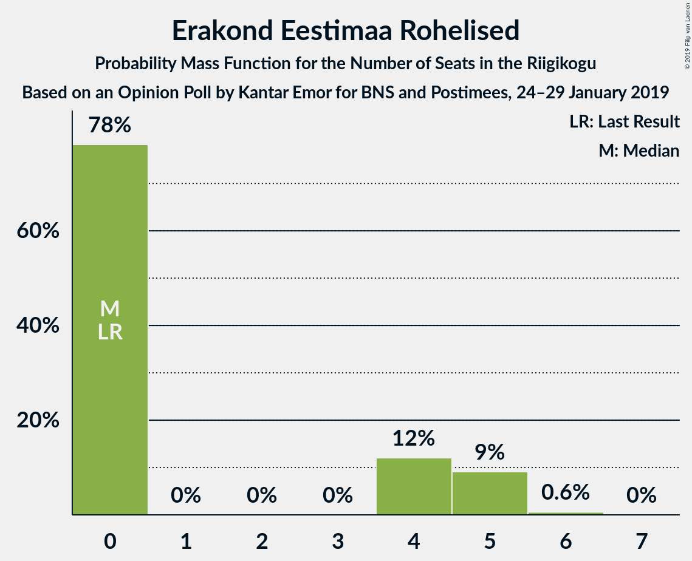

| Number of Seats | Probability | Accumulated | Special Marks |
|:---------------:|:-----------:|:-----------:|:-------------:|
| 0 | 78% | 100% | Last Result, Median |
| 1 | 0% | 22% |  |
| 2 | 0% | 22% |  |
| 3 | 0% | 22% |  |
| 4 | 12% | 22% |  |
| 5 | 9% | 10% |  |
| 6 | 0.6% | 0.6% |  |
| 7 | 0% | 0% |  |

### Eesti Vabaerakond

*For a full overview of the results for this party, see the [Eesti Vabaerakond](party-eestivabaerakond.html) page.*

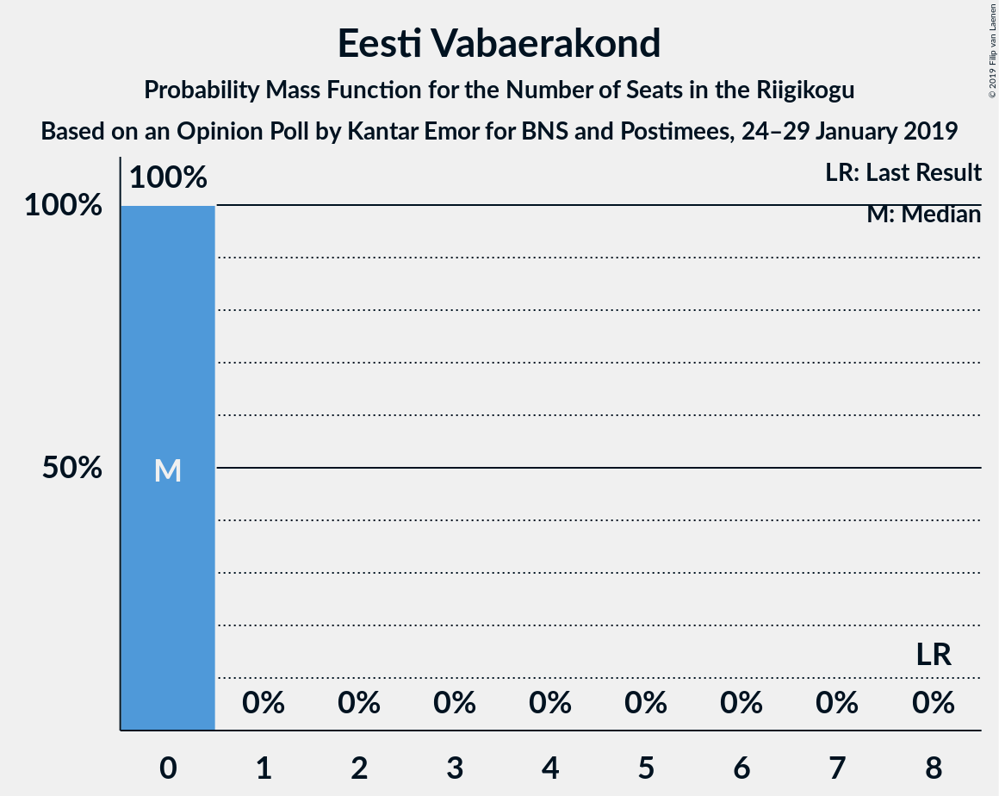

| Number of Seats | Probability | Accumulated | Special Marks |
|:---------------:|:-----------:|:-----------:|:-------------:|
| 0 | 100% | 100% | Median |
| 1 | 0% | 0% |  |
| 2 | 0% | 0% |  |
| 3 | 0% | 0% |  |
| 4 | 0% | 0% |  |
| 5 | 0% | 0% |  |
| 6 | 0% | 0% |  |
| 7 | 0% | 0% |  |
| 8 | 0% | 0% | Last Result |

## Coalitions

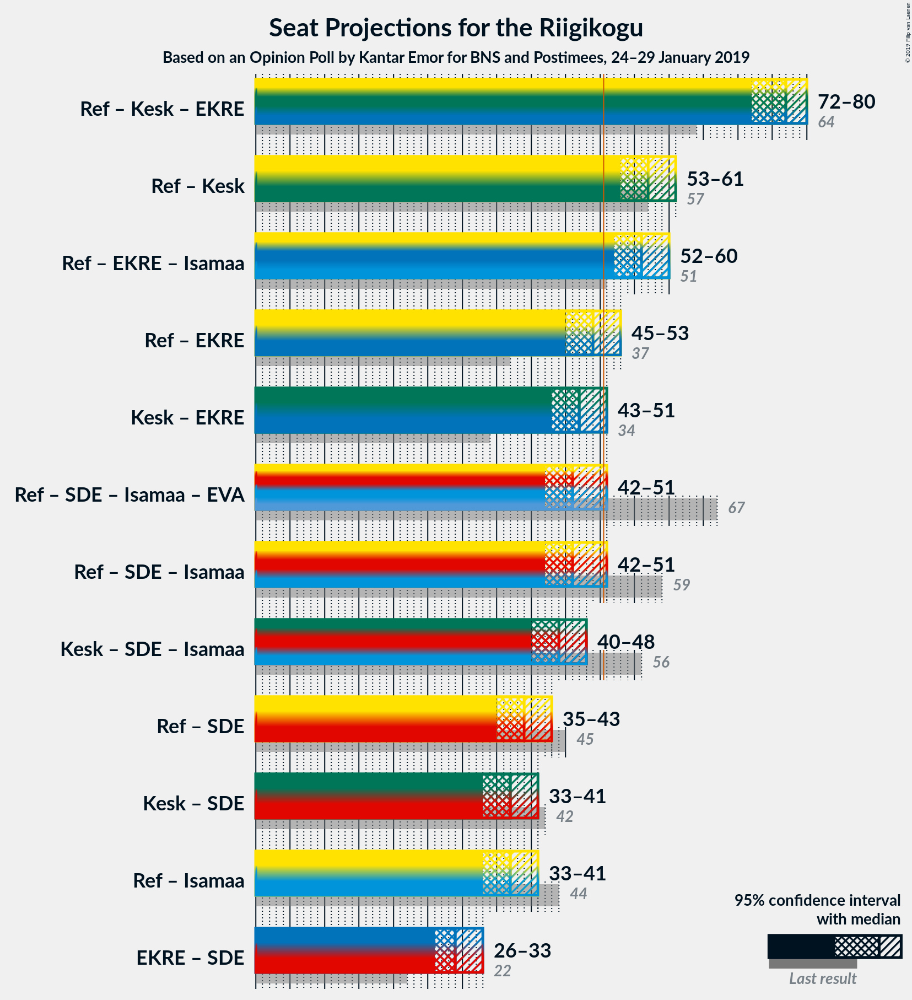

### Confidence Intervals

| Coalition | Last Result | Median | Majority? | 80% Confidence Interval | 90% Confidence Interval | 95% Confidence Interval | 99% Confidence Interval |
|:---------:|:-----------:|:------:|:---------:|:-----------------------:|:-----------------------:|:-----------------------:|:-----------------------:|
| Eesti Reformierakond – Eesti Keskerakond – Eesti Konservatiivne Rahvaerakond | 64 | 77 | 100% | 74–79 | 73–80 | 72–80 | 70–81 |
| Eesti Reformierakond – Eesti Keskerakond | 57 | 57 | 99.8% | 54–60 | 54–61 | 53–61 | 51–62 |
| Eesti Reformierakond – Eesti Konservatiivne Rahvaerakond – Erakond Isamaa | 51 | 56 | 99.6% | 53–59 | 53–60 | 52–60 | 51–62 |
| Eesti Reformierakond – Eesti Konservatiivne Rahvaerakond | 37 | 49 | 27% | 47–52 | 46–53 | 45–53 | 44–54 |
| Eesti Keskerakond – Eesti Konservatiivne Rahvaerakond | 34 | 47 | 4% | 44–49 | 44–50 | 43–51 | 42–52 |
| Eesti Reformierakond – Sotsiaaldemokraatlik Erakond – Erakond Isamaa – Eesti Vabaerakond | 67 | 46 | 3% | 44–49 | 43–50 | 42–51 | 41–52 |
| Eesti Reformierakond – Sotsiaaldemokraatlik Erakond – Erakond Isamaa | 59 | 46 | 3% | 44–49 | 43–50 | 42–51 | 41–52 |
| Eesti Keskerakond – Sotsiaaldemokraatlik Erakond – Erakond Isamaa | 56 | 44 | 0.1% | 41–47 | 41–47 | 40–48 | 39–49 |
| Eesti Reformierakond – Sotsiaaldemokraatlik Erakond | 45 | 39 | 0% | 37–42 | 36–43 | 35–43 | 34–44 |
| Eesti Keskerakond – Sotsiaaldemokraatlik Erakond | 42 | 37 | 0% | 34–39 | 34–40 | 33–41 | 32–42 |
| Eesti Reformierakond – Erakond Isamaa | 44 | 37 | 0% | 34–39 | 33–40 | 33–41 | 32–42 |
| Eesti Konservatiivne Rahvaerakond – Sotsiaaldemokraatlik Erakond | 22 | 29 | 0% | 27–32 | 26–32 | 26–33 | 25–34 |

### Eesti Reformierakond – Eesti Keskerakond – Eesti Konservatiivne Rahvaerakond

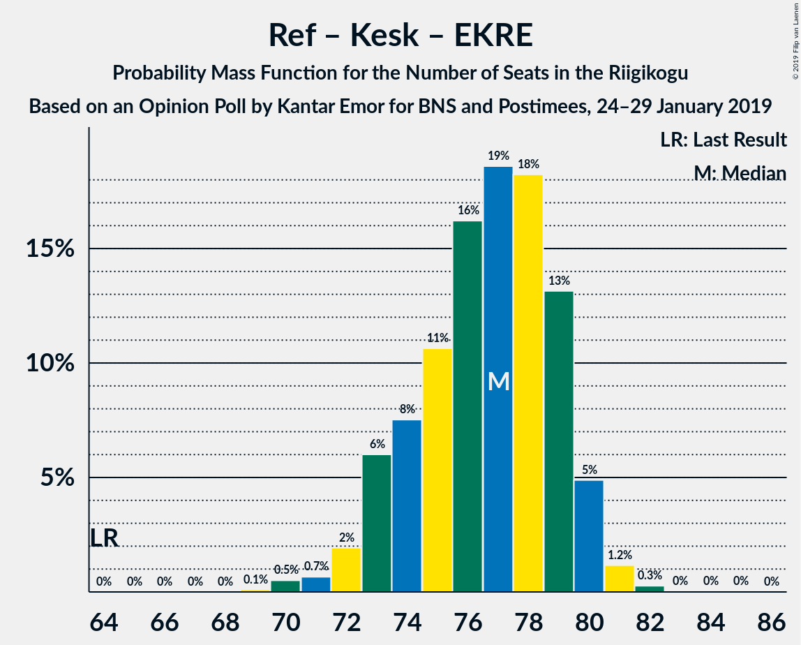

| Number of Seats | Probability | Accumulated | Special Marks |
|:---------------:|:-----------:|:-----------:|:-------------:|
| 64 | 0% | 100% | Last Result |
| 65 | 0% | 100% |  |
| 66 | 0% | 100% |  |
| 67 | 0% | 100% |  |
| 68 | 0% | 100% |  |
| 69 | 0.1% | 100% |  |
| 70 | 0.5% | 99.9% |  |
| 71 | 0.7% | 99.4% |  |
| 72 | 2% | 98.7% |  |
| 73 | 6% | 97% |  |
| 74 | 8% | 91% |  |
| 75 | 11% | 83% |  |
| 76 | 16% | 73% |  |
| 77 | 19% | 56% | Median |
| 78 | 18% | 38% |  |
| 79 | 13% | 20% |  |
| 80 | 5% | 6% |  |
| 81 | 1.2% | 2% |  |
| 82 | 0.3% | 0.4% |  |
| 83 | 0% | 0.1% |  |
| 84 | 0% | 0.1% |  |
| 85 | 0% | 0% |  |

### Eesti Reformierakond – Eesti Keskerakond

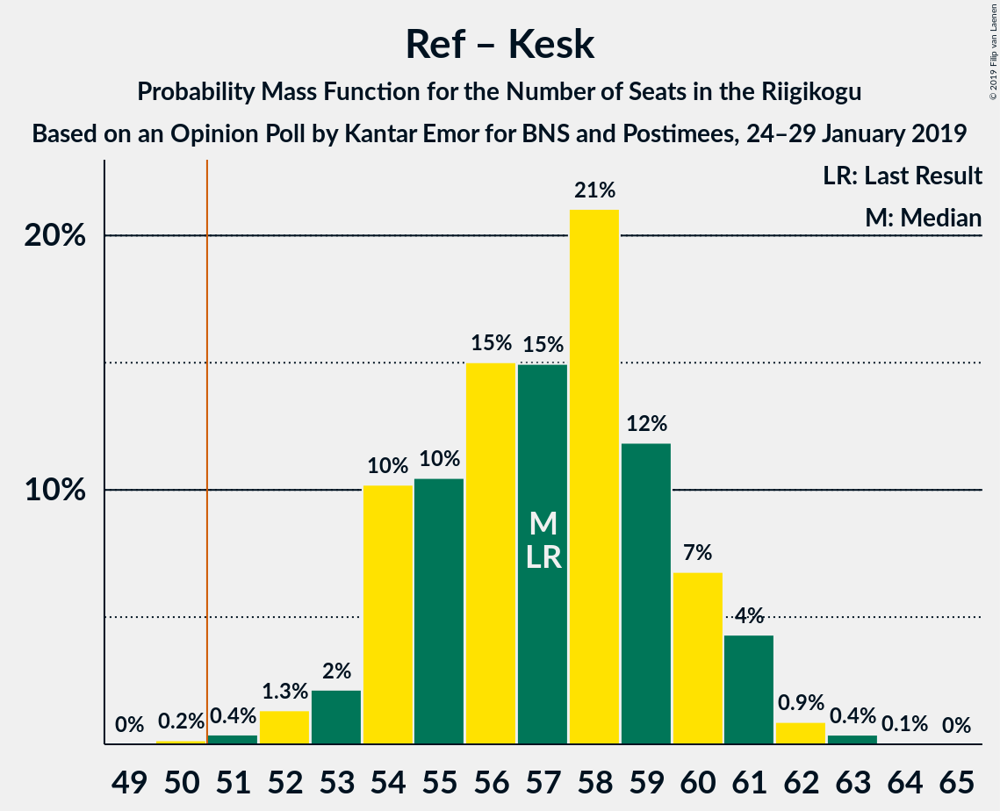

| Number of Seats | Probability | Accumulated | Special Marks |
|:---------------:|:-----------:|:-----------:|:-------------:|
| 50 | 0.2% | 100% |  |
| 51 | 0.4% | 99.8% | Majority |
| 52 | 1.3% | 99.4% |  |
| 53 | 2% | 98% |  |
| 54 | 10% | 96% |  |
| 55 | 10% | 86% |  |
| 56 | 15% | 75% |  |
| 57 | 15% | 60% | Last Result, Median |
| 58 | 21% | 45% |  |
| 59 | 12% | 24% |  |
| 60 | 7% | 12% |  |
| 61 | 4% | 6% |  |
| 62 | 0.9% | 1.3% |  |
| 63 | 0.4% | 0.5% |  |
| 64 | 0.1% | 0.1% |  |
| 65 | 0% | 0% |  |

### Eesti Reformierakond – Eesti Konservatiivne Rahvaerakond – Erakond Isamaa

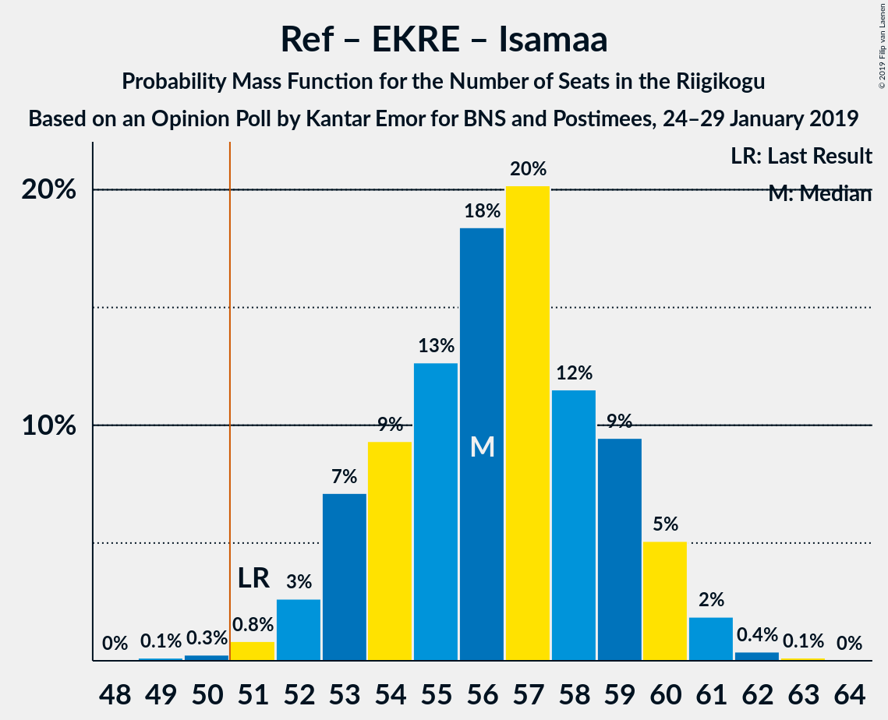

| Number of Seats | Probability | Accumulated | Special Marks |
|:---------------:|:-----------:|:-----------:|:-------------:|
| 49 | 0.1% | 100% |  |
| 50 | 0.3% | 99.9% |  |
| 51 | 0.8% | 99.6% | Last Result, Majority |
| 52 | 3% | 98.8% |  |
| 53 | 7% | 96% |  |
| 54 | 9% | 89% |  |
| 55 | 13% | 80% |  |
| 56 | 18% | 67% |  |
| 57 | 20% | 49% | Median |
| 58 | 12% | 28% |  |
| 59 | 9% | 17% |  |
| 60 | 5% | 7% |  |
| 61 | 2% | 2% |  |
| 62 | 0.4% | 0.5% |  |
| 63 | 0.1% | 0.2% |  |
| 64 | 0% | 0% |  |

### Eesti Reformierakond – Eesti Konservatiivne Rahvaerakond

| Number of Seats | Probability | Accumulated | Special Marks |
|:---------------:|:-----------:|:-----------:|:-------------:|
| 37 | 0% | 100% | Last Result |
| 38 | 0% | 100% |  |
| 39 | 0% | 100% |  |
| 40 | 0% | 100% |  |
| 41 | 0% | 100% |  |
| 42 | 0.1% | 100% |  |
| 43 | 0.2% | 99.9% |  |
| 44 | 0.8% | 99.7% |  |
| 45 | 2% | 98.9% |  |
| 46 | 5% | 97% |  |
| 47 | 15% | 92% |  |
| 48 | 10% | 77% |  |
| 49 | 22% | 67% |  |
| 50 | 19% | 46% | Median |
| 51 | 11% | 27% | Majority |
| 52 | 10% | 16% |  |
| 53 | 4% | 7% |  |
| 54 | 2% | 2% |  |
| 55 | 0.3% | 0.4% |  |
| 56 | 0.1% | 0.1% |  |
| 57 | 0% | 0.1% |  |
| 58 | 0% | 0% |  |

### Eesti Keskerakond – Eesti Konservatiivne Rahvaerakond

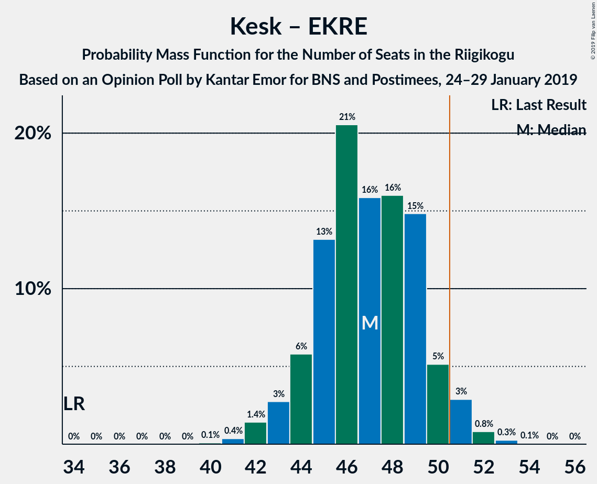

| Number of Seats | Probability | Accumulated | Special Marks |
|:---------------:|:-----------:|:-----------:|:-------------:|
| 34 | 0% | 100% | Last Result |
| 35 | 0% | 100% |  |
| 36 | 0% | 100% |  |
| 37 | 0% | 100% |  |
| 38 | 0% | 100% |  |
| 39 | 0% | 100% |  |
| 40 | 0.1% | 100% |  |
| 41 | 0.4% | 99.9% |  |
| 42 | 1.4% | 99.5% |  |
| 43 | 3% | 98% |  |
| 44 | 6% | 95% |  |
| 45 | 13% | 90% |  |
| 46 | 21% | 76% |  |
| 47 | 16% | 56% | Median |
| 48 | 16% | 40% |  |
| 49 | 15% | 24% |  |
| 50 | 5% | 9% |  |
| 51 | 3% | 4% | Majority |
| 52 | 0.8% | 1.1% |  |
| 53 | 0.3% | 0.3% |  |
| 54 | 0.1% | 0.1% |  |
| 55 | 0% | 0% |  |

### Eesti Reformierakond – Sotsiaaldemokraatlik Erakond – Erakond Isamaa – Eesti Vabaerakond

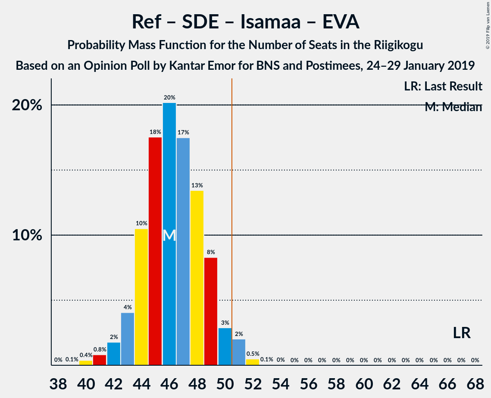

| Number of Seats | Probability | Accumulated | Special Marks |
|:---------------:|:-----------:|:-----------:|:-------------:|
| 39 | 0.1% | 100% |  |
| 40 | 0.4% | 99.9% |  |
| 41 | 0.8% | 99.6% |  |
| 42 | 2% | 98.7% |  |
| 43 | 4% | 97% |  |
| 44 | 10% | 93% |  |
| 45 | 18% | 82% |  |
| 46 | 20% | 65% | Median |
| 47 | 17% | 45% |  |
| 48 | 13% | 27% |  |
| 49 | 8% | 14% |  |
| 50 | 3% | 5% |  |
| 51 | 2% | 3% | Majority |
| 52 | 0.5% | 0.6% |  |
| 53 | 0.1% | 0.1% |  |
| 54 | 0% | 0% |  |
| 55 | 0% | 0% |  |
| 56 | 0% | 0% |  |
| 57 | 0% | 0% |  |
| 58 | 0% | 0% |  |
| 59 | 0% | 0% |  |
| 60 | 0% | 0% |  |
| 61 | 0% | 0% |  |
| 62 | 0% | 0% |  |
| 63 | 0% | 0% |  |
| 64 | 0% | 0% |  |
| 65 | 0% | 0% |  |
| 66 | 0% | 0% |  |
| 67 | 0% | 0% | Last Result |

### Eesti Reformierakond – Sotsiaaldemokraatlik Erakond – Erakond Isamaa

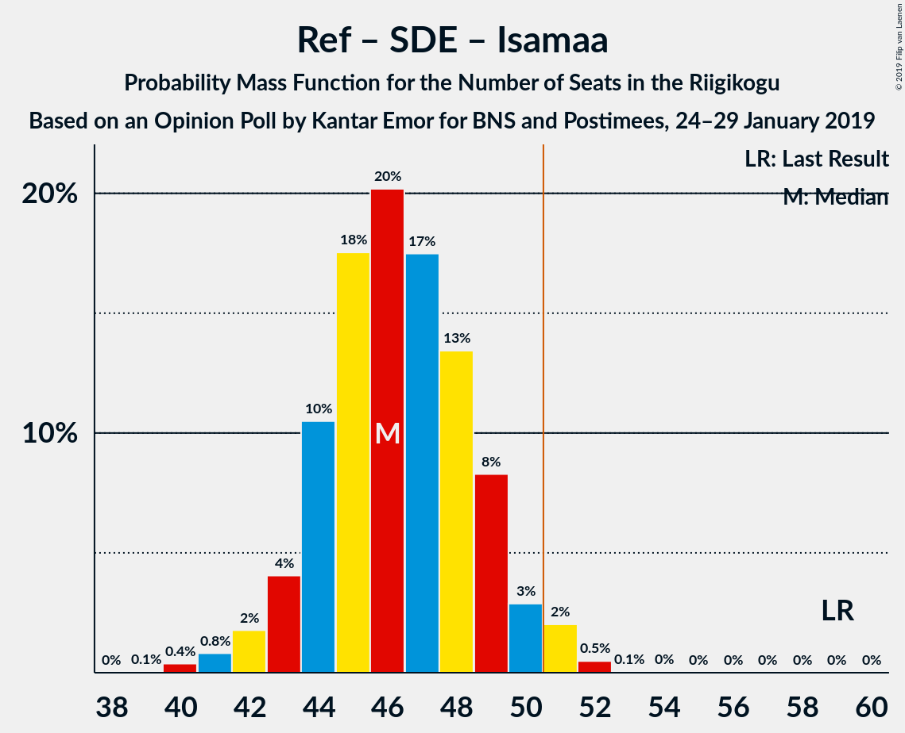

| Number of Seats | Probability | Accumulated | Special Marks |
|:---------------:|:-----------:|:-----------:|:-------------:|
| 39 | 0.1% | 100% |  |
| 40 | 0.4% | 99.9% |  |
| 41 | 0.8% | 99.6% |  |
| 42 | 2% | 98.7% |  |
| 43 | 4% | 97% |  |
| 44 | 10% | 93% |  |
| 45 | 18% | 82% |  |
| 46 | 20% | 65% | Median |
| 47 | 17% | 45% |  |
| 48 | 13% | 27% |  |
| 49 | 8% | 14% |  |
| 50 | 3% | 5% |  |
| 51 | 2% | 3% | Majority |
| 52 | 0.5% | 0.6% |  |
| 53 | 0.1% | 0.1% |  |
| 54 | 0% | 0% |  |
| 55 | 0% | 0% |  |
| 56 | 0% | 0% |  |
| 57 | 0% | 0% |  |
| 58 | 0% | 0% |  |
| 59 | 0% | 0% | Last Result |

### Eesti Keskerakond – Sotsiaaldemokraatlik Erakond – Erakond Isamaa

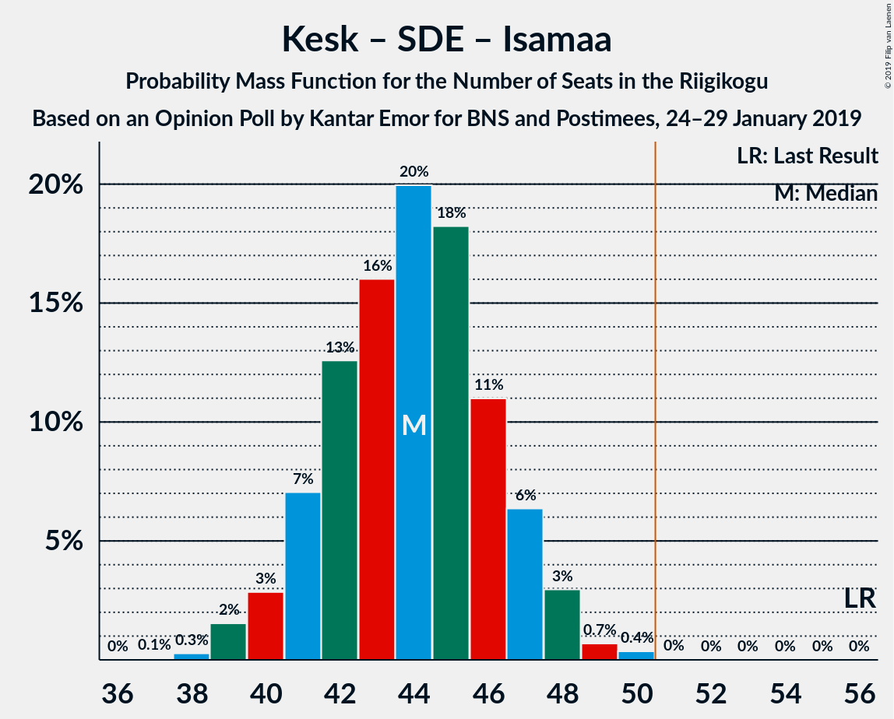

| Number of Seats | Probability | Accumulated | Special Marks |
|:---------------:|:-----------:|:-----------:|:-------------:|
| 37 | 0.1% | 100% |  |
| 38 | 0.3% | 99.9% |  |
| 39 | 2% | 99.6% |  |
| 40 | 3% | 98% |  |
| 41 | 7% | 95% |  |
| 42 | 13% | 88% |  |
| 43 | 16% | 76% | Median |
| 44 | 20% | 60% |  |
| 45 | 18% | 40% |  |
| 46 | 11% | 21% |  |
| 47 | 6% | 10% |  |
| 48 | 3% | 4% |  |
| 49 | 0.7% | 1.1% |  |
| 50 | 0.4% | 0.4% |  |
| 51 | 0% | 0.1% | Majority |
| 52 | 0% | 0% |  |
| 53 | 0% | 0% |  |
| 54 | 0% | 0% |  |
| 55 | 0% | 0% |  |
| 56 | 0% | 0% | Last Result |

### Eesti Reformierakond – Sotsiaaldemokraatlik Erakond

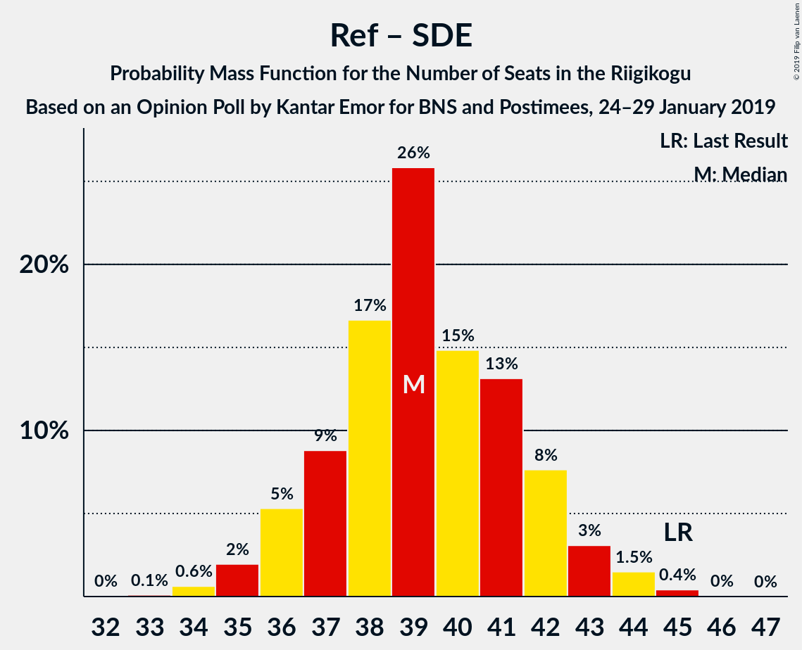

| Number of Seats | Probability | Accumulated | Special Marks |
|:---------------:|:-----------:|:-----------:|:-------------:|
| 33 | 0.1% | 100% |  |
| 34 | 0.6% | 99.9% |  |
| 35 | 2% | 99.2% |  |
| 36 | 5% | 97% |  |
| 37 | 9% | 92% |  |
| 38 | 17% | 83% |  |
| 39 | 26% | 67% | Median |
| 40 | 15% | 41% |  |
| 41 | 13% | 26% |  |
| 42 | 8% | 13% |  |
| 43 | 3% | 5% |  |
| 44 | 1.5% | 2% |  |
| 45 | 0.4% | 0.5% | Last Result |
| 46 | 0% | 0.1% |  |
| 47 | 0% | 0% |  |

### Eesti Keskerakond – Sotsiaaldemokraatlik Erakond

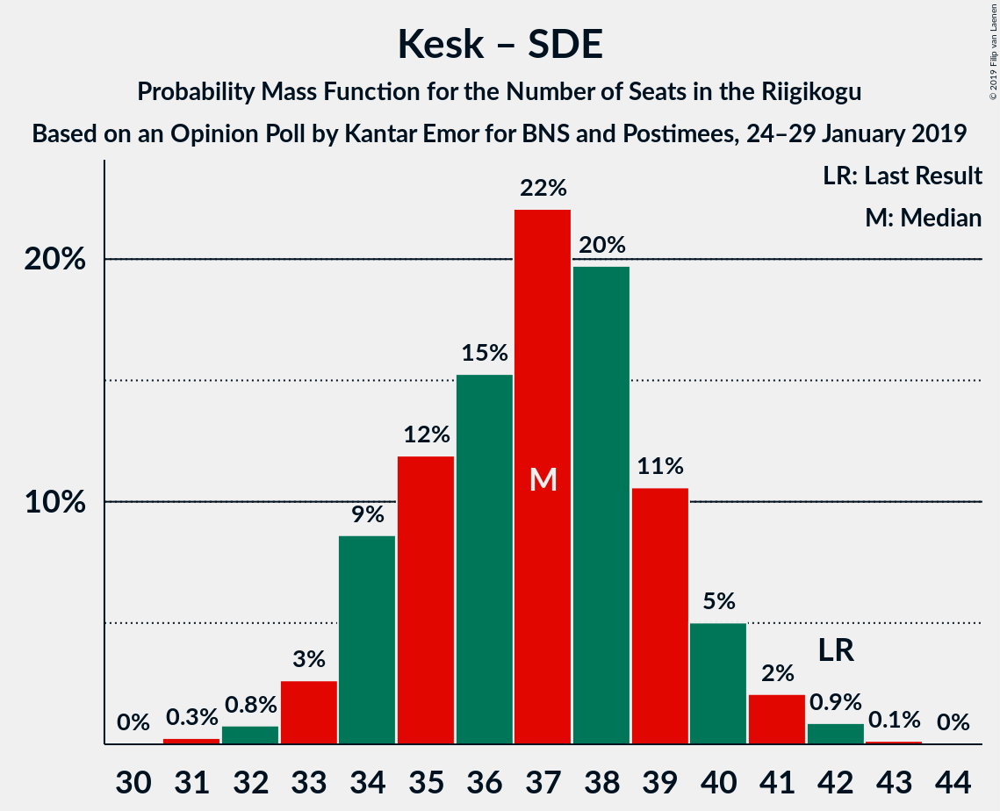

| Number of Seats | Probability | Accumulated | Special Marks |
|:---------------:|:-----------:|:-----------:|:-------------:|
| 31 | 0.3% | 100% |  |
| 32 | 0.8% | 99.7% |  |
| 33 | 3% | 98.9% |  |
| 34 | 9% | 96% |  |
| 35 | 12% | 88% |  |
| 36 | 15% | 76% | Median |
| 37 | 22% | 61% |  |
| 38 | 20% | 38% |  |
| 39 | 11% | 19% |  |
| 40 | 5% | 8% |  |
| 41 | 2% | 3% |  |
| 42 | 0.9% | 1.0% | Last Result |
| 43 | 0.1% | 0.2% |  |
| 44 | 0% | 0% |  |

### Eesti Reformierakond – Erakond Isamaa

| Number of Seats | Probability | Accumulated | Special Marks |
|:---------------:|:-----------:|:-----------:|:-------------:|
| 31 | 0.3% | 100% |  |
| 32 | 0.7% | 99.6% |  |
| 33 | 4% | 98.9% |  |
| 34 | 7% | 95% |  |
| 35 | 13% | 87% |  |
| 36 | 20% | 75% |  |
| 37 | 19% | 54% | Median |
| 38 | 18% | 36% |  |
| 39 | 10% | 17% |  |
| 40 | 4% | 8% |  |
| 41 | 3% | 4% |  |
| 42 | 0.8% | 1.0% |  |
| 43 | 0.1% | 0.1% |  |
| 44 | 0% | 0% | Last Result |

### Eesti Konservatiivne Rahvaerakond – Sotsiaaldemokraatlik Erakond

| Number of Seats | Probability | Accumulated | Special Marks |
|:---------------:|:-----------:|:-----------:|:-------------:|
| 22 | 0% | 100% | Last Result |
| 23 | 0.1% | 100% |  |
| 24 | 0.3% | 99.9% |  |
| 25 | 1.0% | 99.6% |  |
| 26 | 6% | 98.6% |  |
| 27 | 9% | 93% |  |
| 28 | 24% | 84% |  |
| 29 | 19% | 60% | Median |
| 30 | 17% | 41% |  |
| 31 | 12% | 24% |  |
| 32 | 9% | 12% |  |
| 33 | 2% | 3% |  |
| 34 | 0.8% | 0.9% |  |
| 35 | 0.1% | 0.2% |  |
| 36 | 0% | 0% |  |

## Technical Information

### Opinion Poll

+ **Polling firm:** Kantar Emor
+ **Commissioner(s):** BNS and Postimees
+ **Fieldwork period:** 24–29 January 2019

### Calculations

+ **Sample size:** 1001
+ **Simulations done:** 1,048,576
+ **Error estimate:** 1.45%

