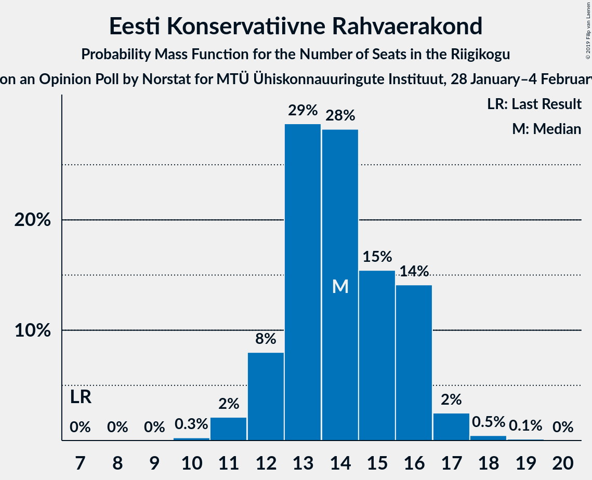
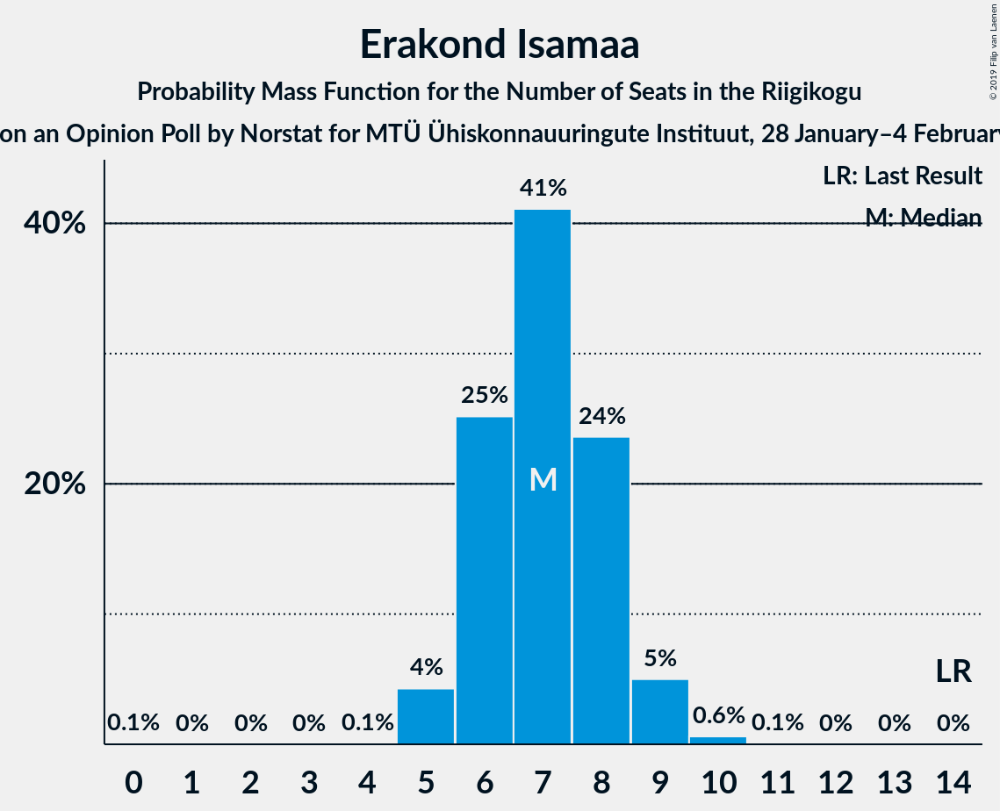
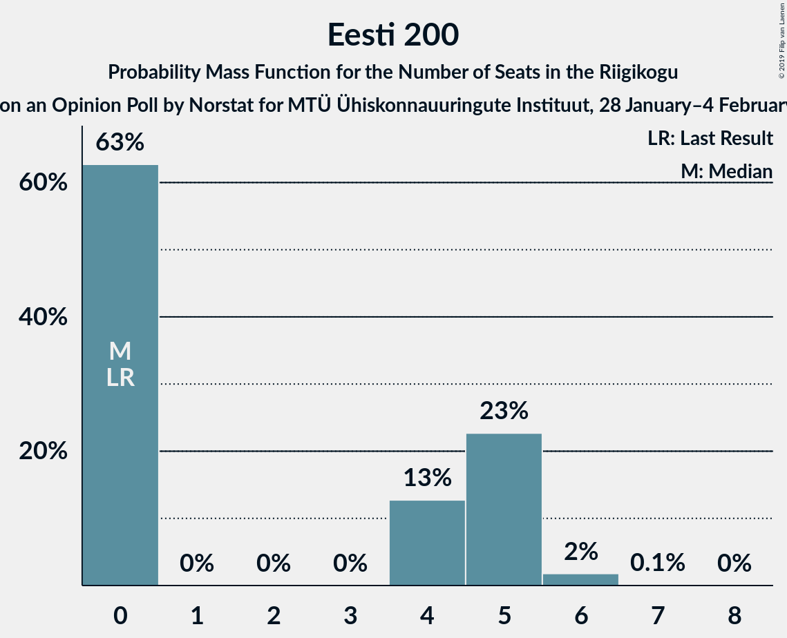
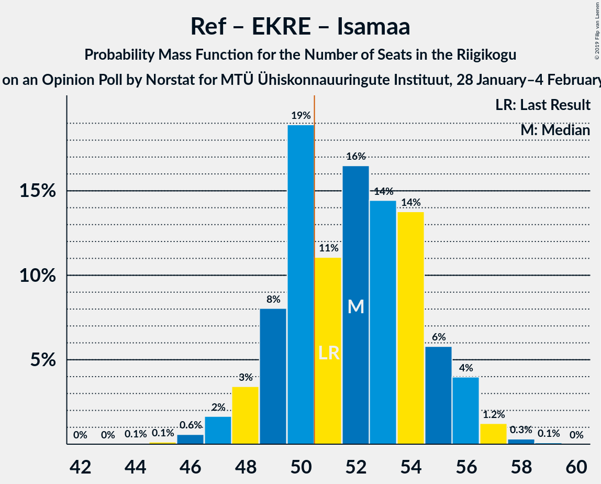

# Opinion Poll by Norstat, 28 January–4 February 2019

<a href="#voting-intentions">Voting Intentions</a> | <a href="#seats">Seats</a> | <a href="#coalitions">Coalitions</a> | <a href="#technical-information">Technical Information</a>

## Voting Intentions

### Confidence Intervals

| Party | Last Result | Poll Result | 80% Confidence Interval | 90% Confidence Interval | 95% Confidence Interval | 99% Confidence Interval |
|:-----:|:-----------:|:-----------:|:-----------------------:|:-----------------------:|:-----------------------:|:-----------------------:|
| Eesti Keskerakond | 24.8% | 30.5% | 28.7–32.4% |28.2–33.0% |27.7–33.4% |26.9–34.4% |
| Eesti Reformierakond | 27.7% | 26.6% | 24.9–28.5% |24.4–29.0% |23.9–29.4% |23.1–30.3% |
| Eesti Konservatiivne Rahvaerakond | 8.1% | 13.3% | 12.0–14.8% |11.6–15.2% |11.3–15.5% |10.7–16.3% |
| Sotsiaaldemokraatlik Erakond | 15.2% | 11.0% | 9.8–12.4% |9.5–12.8% |9.2–13.1% |8.7–13.8% |
| Erakond Isamaa | 13.7% | 7.3% | 6.3–8.5% |6.1–8.8% |5.8–9.1% |5.4–9.7% |
| Eesti 200 | 0.0% | 4.6% | 3.9–5.6% |3.6–5.8% |3.5–6.1% |3.1–6.6% |
| Erakond Eestimaa Rohelised | 0.9% | 4.0% | 3.3–4.9% |3.1–5.2% |2.9–5.4% |2.7–5.9% |

*Note:* The poll result column reflects the actual value used in the calculations. Published results may vary slightly, and in addition be rounded to fewer digits.

## Seats

### Confidence Intervals

| Party | Last Result | Median | 80% Confidence Interval | 90% Confidence Interval | 95% Confidence Interval | 99% Confidence Interval |
|:-----:|:-----------:|:------:|:-----------------------:|:-----------------------:|:-----------------------:|:-----------------------:|
| <a href="#eesti-keskerakond">Eesti Keskerakond</a> | 27 | 36 | 33–39 |33–39 |32–40 |31–41 |
| <a href="#eesti-reformierakond">Eesti Reformierakond</a> | 30 | 31 | 28–33 |28–34 |27–35 |26–36 |
| <a href="#eesti-konservatiivne-rahvaerakond">Eesti Konservatiivne Rahvaerakond</a> | 7 | 14 | 12–16 |12–16 |12–17 |11–18 |
| <a href="#sotsiaaldemokraatlik-erakond">Sotsiaaldemokraatlik Erakond</a> | 15 | 11 | 10–13 |9–13 |9–14 |8–15 |
| <a href="#erakond-isamaa">Erakond Isamaa</a> | 14 | 7 | 6–8 |6–9 |5–9 |5–10 |
| <a href="#eesti-200">Eesti 200</a> | 0 | 0 | 0–5 |0–5 |0–5 |0–6 |
| <a href="#erakond-eestimaa-rohelised">Erakond Eestimaa Rohelised</a> | 0 | 0 | 0 |0–4 |0–5 |0–5 |

### Eesti Keskerakond

*For a full overview of the results for this party, see the [Eesti Keskerakond](party-eestikeskerakond.html) page.*

| Number of Seats | Probability | Accumulated | Special Marks |
|:---------------:|:-----------:|:-----------:|:-------------:|
| 27 | 0% | 100% | Last Result |
| 28 | 0% | 100% |  |
| 29 | 0.1% | 100% |  |
| 30 | 0.3% | 99.9% |  |
| 31 | 1.0% | 99.6% |  |
| 32 | 3% | 98.6% |  |
| 33 | 7% | 96% |  |
| 34 | 12% | 89% |  |
| 35 | 16% | 76% |  |
| 36 | 21% | 61% | Median |
| 37 | 18% | 39% |  |
| 38 | 11% | 22% |  |
| 39 | 6% | 10% |  |
| 40 | 3% | 4% |  |
| 41 | 1.1% | 1.4% |  |
| 42 | 0.3% | 0.3% |  |
| 43 | 0.1% | 0.1% |  |
| 44 | 0% | 0% |  |

### Eesti Reformierakond

*For a full overview of the results for this party, see the [Eesti Reformierakond](party-eestireformierakond.html) page.*

| Number of Seats | Probability | Accumulated | Special Marks |
|:---------------:|:-----------:|:-----------:|:-------------:|
| 25 | 0.2% | 100% |  |
| 26 | 0.9% | 99.8% |  |
| 27 | 3% | 98.9% |  |
| 28 | 7% | 96% |  |
| 29 | 13% | 88% |  |
| 30 | 18% | 75% | Last Result |
| 31 | 21% | 57% | Median |
| 32 | 17% | 36% |  |
| 33 | 11% | 19% |  |
| 34 | 5% | 8% |  |
| 35 | 2% | 3% |  |
| 36 | 0.6% | 0.8% |  |
| 37 | 0.2% | 0.2% |  |
| 38 | 0% | 0% |  |

### Eesti Konservatiivne Rahvaerakond

*For a full overview of the results for this party, see the [Eesti Konservatiivne Rahvaerakond](party-eestikonservatiivnerahvaerakond.html) page.*

| Number of Seats | Probability | Accumulated | Special Marks |
|:---------------:|:-----------:|:-----------:|:-------------:|
| 7 | 0% | 100% | Last Result |
| 8 | 0% | 100% |  |
| 9 | 0% | 100% |  |
| 10 | 0.2% | 100% |  |
| 11 | 2% | 99.8% |  |
| 12 | 10% | 98% |  |
| 13 | 21% | 87% |  |
| 14 | 28% | 66% | Median |
| 15 | 24% | 38% |  |
| 16 | 10% | 14% |  |
| 17 | 4% | 5% |  |
| 18 | 0.6% | 0.7% |  |
| 19 | 0.1% | 0.1% |  |
| 20 | 0% | 0% |  |

### Sotsiaaldemokraatlik Erakond

*For a full overview of the results for this party, see the [Sotsiaaldemokraatlik Erakond](party-sotsiaaldemokraatlikerakond.html) page.*

| Number of Seats | Probability | Accumulated | Special Marks |
|:---------------:|:-----------:|:-----------:|:-------------:|
| 8 | 0.5% | 100% |  |
| 9 | 6% | 99.5% |  |
| 10 | 19% | 94% |  |
| 11 | 30% | 75% | Median |
| 12 | 29% | 44% |  |
| 13 | 11% | 16% |  |
| 14 | 4% | 4% |  |
| 15 | 0.6% | 0.7% | Last Result |
| 16 | 0.1% | 0.1% |  |
| 17 | 0% | 0% |  |

### Erakond Isamaa

*For a full overview of the results for this party, see the [Erakond Isamaa](party-erakondisamaa.html) page.*

| Number of Seats | Probability | Accumulated | Special Marks |
|:---------------:|:-----------:|:-----------:|:-------------:|
| 0 | 0.1% | 100% |  |
| 1 | 0% | 99.9% |  |
| 2 | 0% | 99.9% |  |
| 3 | 0% | 99.9% |  |
| 4 | 0.1% | 99.9% |  |
| 5 | 5% | 99.8% |  |
| 6 | 26% | 95% |  |
| 7 | 39% | 69% | Median |
| 8 | 24% | 31% |  |
| 9 | 6% | 7% |  |
| 10 | 0.8% | 0.9% |  |
| 11 | 0.1% | 0.1% |  |
| 12 | 0% | 0% |  |
| 13 | 0% | 0% |  |
| 14 | 0% | 0% | Last Result |

### Eesti 200

*For a full overview of the results for this party, see the [Eesti 200](party-eesti200.html) page.*

| Number of Seats | Probability | Accumulated | Special Marks |
|:---------------:|:-----------:|:-----------:|:-------------:|
| 0 | 71% | 100% | Last Result, Median |
| 1 | 0% | 29% |  |
| 2 | 0% | 29% |  |
| 3 | 0% | 29% |  |
| 4 | 7% | 29% |  |
| 5 | 20% | 22% |  |
| 6 | 2% | 2% |  |
| 7 | 0.1% | 0.1% |  |
| 8 | 0% | 0% |  |

### Erakond Eestimaa Rohelised

*For a full overview of the results for this party, see the [Erakond Eestimaa Rohelised](party-erakondeestimaarohelised.html) page.*

| Number of Seats | Probability | Accumulated | Special Marks |
|:---------------:|:-----------:|:-----------:|:-------------:|
| 0 | 93% | 100% | Last Result, Median |
| 1 | 0% | 7% |  |
| 2 | 0% | 7% |  |
| 3 | 0% | 7% |  |
| 4 | 3% | 7% |  |
| 5 | 4% | 4% |  |
| 6 | 0.2% | 0.2% |  |
| 7 | 0% | 0% |  |

## Coalitions

### Confidence Intervals

| Coalition | Last Result | Median | Majority? | 80% Confidence Interval | 90% Confidence Interval | 95% Confidence Interval | 99% Confidence Interval |
|:---------:|:-----------:|:------:|:---------:|:-----------------------:|:-----------------------:|:-----------------------:|:-----------------------:|
| Eesti Keskerakond – Eesti Reformierakond – Eesti Konservatiivne Rahvaerakond | 64 | 81 | 100% | 77–84 | 77–84 | 76–85 | 74–86 |
| Eesti Keskerakond – Eesti Reformierakond | 57 | 67 | 100% | 64–70 | 63–71 | 62–71 | 60–72 |
| Eesti Keskerakond – Sotsiaaldemokraatlik Erakond – Erakond Isamaa | 56 | 54 | 94% | 51–57 | 50–58 | 50–59 | 48–60 |
| Eesti Reformierakond – Eesti Konservatiivne Rahvaerakond – Erakond Isamaa | 51 | 52 | 73% | 49–55 | 48–56 | 47–56 | 46–58 |
| Eesti Keskerakond – Eesti Konservatiivne Rahvaerakond | 34 | 50 | 43% | 47–53 | 46–54 | 46–54 | 44–56 |
| Eesti Reformierakond – Sotsiaaldemokraatlik Erakond – Erakond Isamaa | 59 | 49 | 29% | 46–52 | 45–53 | 45–53 | 43–55 |
| Eesti Keskerakond – Sotsiaaldemokraatlik Erakond | 42 | 47 | 7% | 44–50 | 44–51 | 43–52 | 41–53 |
| Eesti Reformierakond – Eesti Konservatiivne Rahvaerakond | 37 | 45 | 0.4% | 42–48 | 41–49 | 41–49 | 39–50 |
| Eesti Reformierakond – Sotsiaaldemokraatlik Erakond | 45 | 42 | 0% | 39–45 | 39–46 | 38–46 | 37–48 |
| Eesti Reformierakond – Erakond Isamaa | 44 | 38 | 0% | 35–40 | 34–41 | 34–42 | 33–43 |
| Eesti Konservatiivne Rahvaerakond – Sotsiaaldemokraatlik Erakond | 22 | 26 | 0% | 23–28 | 22–28 | 22–29 | 21–30 |

### Eesti Keskerakond – Eesti Reformierakond – Eesti Konservatiivne Rahvaerakond

| Number of Seats | Probability | Accumulated | Special Marks |
|:---------------:|:-----------:|:-----------:|:-------------:|
| 64 | 0% | 100% | Last Result |
| 65 | 0% | 100% |  |
| 66 | 0% | 100% |  |
| 67 | 0% | 100% |  |
| 68 | 0% | 100% |  |
| 69 | 0% | 100% |  |
| 70 | 0% | 100% |  |
| 71 | 0% | 100% |  |
| 72 | 0.1% | 100% |  |
| 73 | 0.2% | 99.9% |  |
| 74 | 0.5% | 99.7% |  |
| 75 | 1.2% | 99.2% |  |
| 76 | 3% | 98% |  |
| 77 | 6% | 95% |  |
| 78 | 9% | 89% |  |
| 79 | 9% | 80% |  |
| 80 | 10% | 71% |  |
| 81 | 13% | 61% | Median |
| 82 | 18% | 48% |  |
| 83 | 17% | 30% |  |
| 84 | 9% | 13% |  |
| 85 | 3% | 4% |  |
| 86 | 0.4% | 0.5% |  |
| 87 | 0.1% | 0.1% |  |
| 88 | 0% | 0% |  |

### Eesti Keskerakond – Eesti Reformierakond

| Number of Seats | Probability | Accumulated | Special Marks |
|:---------------:|:-----------:|:-----------:|:-------------:|
| 57 | 0% | 100% | Last Result |
| 58 | 0% | 100% |  |
| 59 | 0.1% | 100% |  |
| 60 | 0.6% | 99.8% |  |
| 61 | 1.2% | 99.2% |  |
| 62 | 2% | 98% |  |
| 63 | 5% | 96% |  |
| 64 | 9% | 90% |  |
| 65 | 10% | 81% |  |
| 66 | 14% | 71% |  |
| 67 | 15% | 57% | Median |
| 68 | 18% | 42% |  |
| 69 | 11% | 25% |  |
| 70 | 8% | 13% |  |
| 71 | 4% | 5% |  |
| 72 | 1.0% | 1.4% |  |
| 73 | 0.3% | 0.4% |  |
| 74 | 0% | 0.1% |  |
| 75 | 0% | 0% |  |

### Eesti Keskerakond – Sotsiaaldemokraatlik Erakond – Erakond Isamaa

| Number of Seats | Probability | Accumulated | Special Marks |
|:---------------:|:-----------:|:-----------:|:-------------:|
| 46 | 0% | 100% |  |
| 47 | 0.2% | 99.9% |  |
| 48 | 0.5% | 99.8% |  |
| 49 | 1.3% | 99.3% |  |
| 50 | 4% | 98% |  |
| 51 | 6% | 94% | Majority |
| 52 | 10% | 88% |  |
| 53 | 13% | 78% |  |
| 54 | 17% | 66% | Median |
| 55 | 17% | 49% |  |
| 56 | 14% | 32% | Last Result |
| 57 | 11% | 18% |  |
| 58 | 4% | 7% |  |
| 59 | 2% | 3% |  |
| 60 | 0.8% | 1.0% |  |
| 61 | 0.2% | 0.2% |  |
| 62 | 0% | 0% |  |

### Eesti Reformierakond – Eesti Konservatiivne Rahvaerakond – Erakond Isamaa

| Number of Seats | Probability | Accumulated | Special Marks |
|:---------------:|:-----------:|:-----------:|:-------------:|
| 44 | 0% | 100% |  |
| 45 | 0.2% | 99.9% |  |
| 46 | 0.7% | 99.7% |  |
| 47 | 2% | 99.0% |  |
| 48 | 5% | 97% |  |
| 49 | 8% | 92% |  |
| 50 | 11% | 84% |  |
| 51 | 16% | 73% | Last Result, Majority |
| 52 | 13% | 58% | Median |
| 53 | 19% | 45% |  |
| 54 | 12% | 25% |  |
| 55 | 8% | 14% |  |
| 56 | 4% | 6% |  |
| 57 | 1.4% | 2% |  |
| 58 | 0.4% | 0.6% |  |
| 59 | 0.1% | 0.1% |  |
| 60 | 0% | 0% |  |

### Eesti Keskerakond – Eesti Konservatiivne Rahvaerakond

| Number of Seats | Probability | Accumulated | Special Marks |
|:---------------:|:-----------:|:-----------:|:-------------:|
| 34 | 0% | 100% | Last Result |
| 35 | 0% | 100% |  |
| 36 | 0% | 100% |  |
| 37 | 0% | 100% |  |
| 38 | 0% | 100% |  |
| 39 | 0% | 100% |  |
| 40 | 0% | 100% |  |
| 41 | 0% | 100% |  |
| 42 | 0% | 100% |  |
| 43 | 0.2% | 99.9% |  |
| 44 | 0.6% | 99.8% |  |
| 45 | 2% | 99.2% |  |
| 46 | 4% | 98% |  |
| 47 | 7% | 94% |  |
| 48 | 12% | 87% |  |
| 49 | 15% | 76% |  |
| 50 | 18% | 61% | Median |
| 51 | 16% | 43% | Majority |
| 52 | 13% | 27% |  |
| 53 | 8% | 14% |  |
| 54 | 4% | 6% |  |
| 55 | 2% | 2% |  |
| 56 | 0.4% | 0.6% |  |
| 57 | 0.1% | 0.2% |  |
| 58 | 0% | 0% |  |

### Eesti Reformierakond – Sotsiaaldemokraatlik Erakond – Erakond Isamaa

| Number of Seats | Probability | Accumulated | Special Marks |
|:---------------:|:-----------:|:-----------:|:-------------:|
| 42 | 0.1% | 100% |  |
| 43 | 0.5% | 99.8% |  |
| 44 | 2% | 99.3% |  |
| 45 | 4% | 98% |  |
| 46 | 6% | 94% |  |
| 47 | 12% | 88% |  |
| 48 | 13% | 76% |  |
| 49 | 17% | 63% | Median |
| 50 | 16% | 45% |  |
| 51 | 14% | 29% | Majority |
| 52 | 8% | 15% |  |
| 53 | 5% | 7% |  |
| 54 | 2% | 2% |  |
| 55 | 0.6% | 0.8% |  |
| 56 | 0.2% | 0.2% |  |
| 57 | 0% | 0% |  |
| 58 | 0% | 0% |  |
| 59 | 0% | 0% | Last Result |

### Eesti Keskerakond – Sotsiaaldemokraatlik Erakond

| Number of Seats | Probability | Accumulated | Special Marks |
|:---------------:|:-----------:|:-----------:|:-------------:|
| 40 | 0.1% | 100% |  |
| 41 | 0.4% | 99.9% |  |
| 42 | 1.1% | 99.5% | Last Result |
| 43 | 3% | 98% |  |
| 44 | 6% | 95% |  |
| 45 | 10% | 89% |  |
| 46 | 14% | 80% |  |
| 47 | 17% | 66% | Median |
| 48 | 21% | 49% |  |
| 49 | 10% | 27% |  |
| 50 | 10% | 17% |  |
| 51 | 4% | 7% | Majority |
| 52 | 2% | 3% |  |
| 53 | 0.8% | 0.9% |  |
| 54 | 0.1% | 0.2% |  |
| 55 | 0% | 0% |  |

### Eesti Reformierakond – Eesti Konservatiivne Rahvaerakond

| Number of Seats | Probability | Accumulated | Special Marks |
|:---------------:|:-----------:|:-----------:|:-------------:|
| 37 | 0% | 100% | Last Result |
| 38 | 0.1% | 100% |  |
| 39 | 0.5% | 99.8% |  |
| 40 | 2% | 99.3% |  |
| 41 | 5% | 98% |  |
| 42 | 7% | 93% |  |
| 43 | 11% | 86% |  |
| 44 | 17% | 75% |  |
| 45 | 17% | 58% | Median |
| 46 | 16% | 41% |  |
| 47 | 14% | 25% |  |
| 48 | 6% | 11% |  |
| 49 | 4% | 5% |  |
| 50 | 1.1% | 2% |  |
| 51 | 0.3% | 0.4% | Majority |
| 52 | 0.1% | 0.1% |  |
| 53 | 0% | 0% |  |

### Eesti Reformierakond – Sotsiaaldemokraatlik Erakond

| Number of Seats | Probability | Accumulated | Special Marks |
|:---------------:|:-----------:|:-----------:|:-------------:|
| 35 | 0.1% | 100% |  |
| 36 | 0.4% | 99.9% |  |
| 37 | 1.1% | 99.6% |  |
| 38 | 3% | 98% |  |
| 39 | 7% | 95% |  |
| 40 | 10% | 88% |  |
| 41 | 15% | 78% |  |
| 42 | 17% | 63% | Median |
| 43 | 21% | 46% |  |
| 44 | 10% | 25% |  |
| 45 | 9% | 15% | Last Result |
| 46 | 4% | 6% |  |
| 47 | 1.2% | 2% |  |
| 48 | 0.6% | 0.7% |  |
| 49 | 0.1% | 0.1% |  |
| 50 | 0% | 0% |  |

### Eesti Reformierakond – Erakond Isamaa

| Number of Seats | Probability | Accumulated | Special Marks |
|:---------------:|:-----------:|:-----------:|:-------------:|
| 31 | 0.1% | 100% |  |
| 32 | 0.3% | 99.9% |  |
| 33 | 1.3% | 99.6% |  |
| 34 | 4% | 98% |  |
| 35 | 9% | 94% |  |
| 36 | 13% | 86% |  |
| 37 | 16% | 73% |  |
| 38 | 18% | 57% | Median |
| 39 | 18% | 40% |  |
| 40 | 12% | 22% |  |
| 41 | 6% | 10% |  |
| 42 | 3% | 4% |  |
| 43 | 0.9% | 1.3% |  |
| 44 | 0.3% | 0.3% | Last Result |
| 45 | 0.1% | 0.1% |  |
| 46 | 0% | 0% |  |

### Eesti Konservatiivne Rahvaerakond – Sotsiaaldemokraatlik Erakond

| Number of Seats | Probability | Accumulated | Special Marks |
|:---------------:|:-----------:|:-----------:|:-------------:|
| 20 | 0.2% | 100% |  |
| 21 | 0.9% | 99.8% |  |
| 22 | 4% | 98.8% | Last Result |
| 23 | 11% | 95% |  |
| 24 | 14% | 84% |  |
| 25 | 20% | 70% | Median |
| 26 | 23% | 50% |  |
| 27 | 15% | 27% |  |
| 28 | 7% | 11% |  |
| 29 | 4% | 5% |  |
| 30 | 0.8% | 1.0% |  |
| 31 | 0.2% | 0.2% |  |
| 32 | 0% | 0% |  |

## Technical Information

### Opinion Poll

+ **Polling firm:** Norstat
+ **Commissioner(s):** —
+ **Fieldwork period:** 28 January–4 February 2019

### Calculations

+ **Sample size:** 1000
+ **Simulations done:** 1,048,576
+ **Error estimate:** 0.94%

