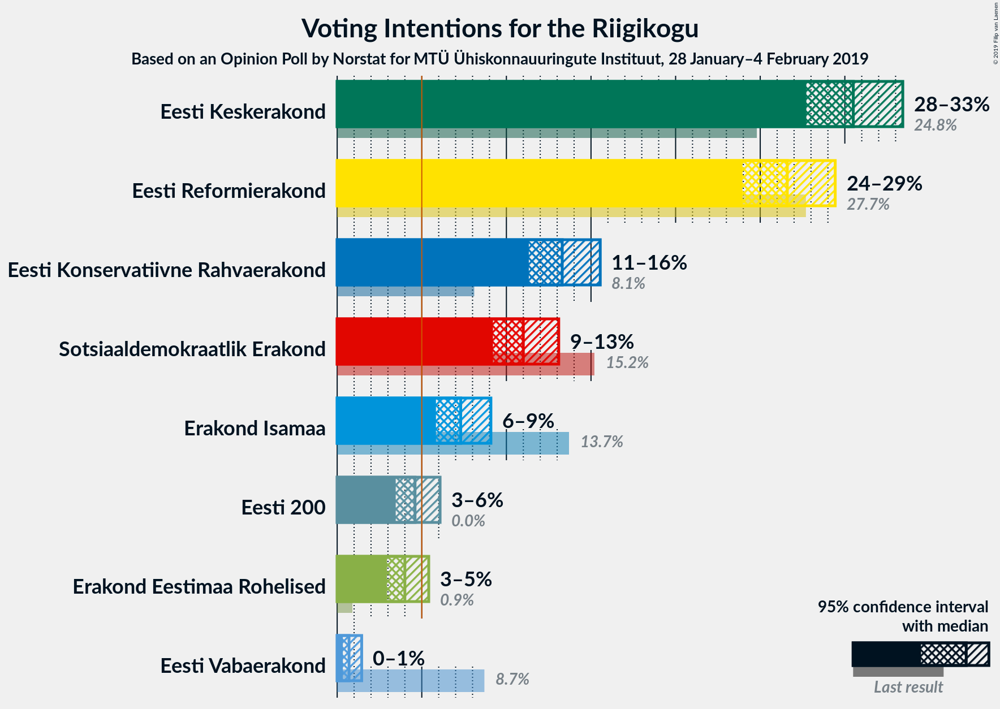
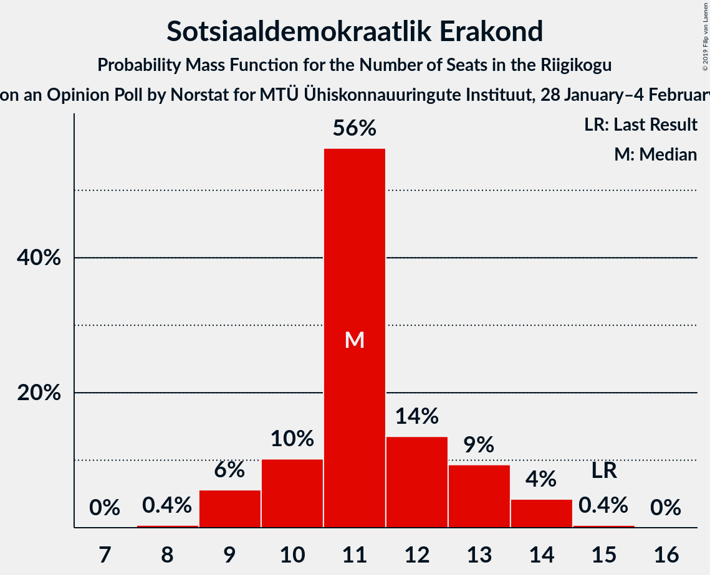
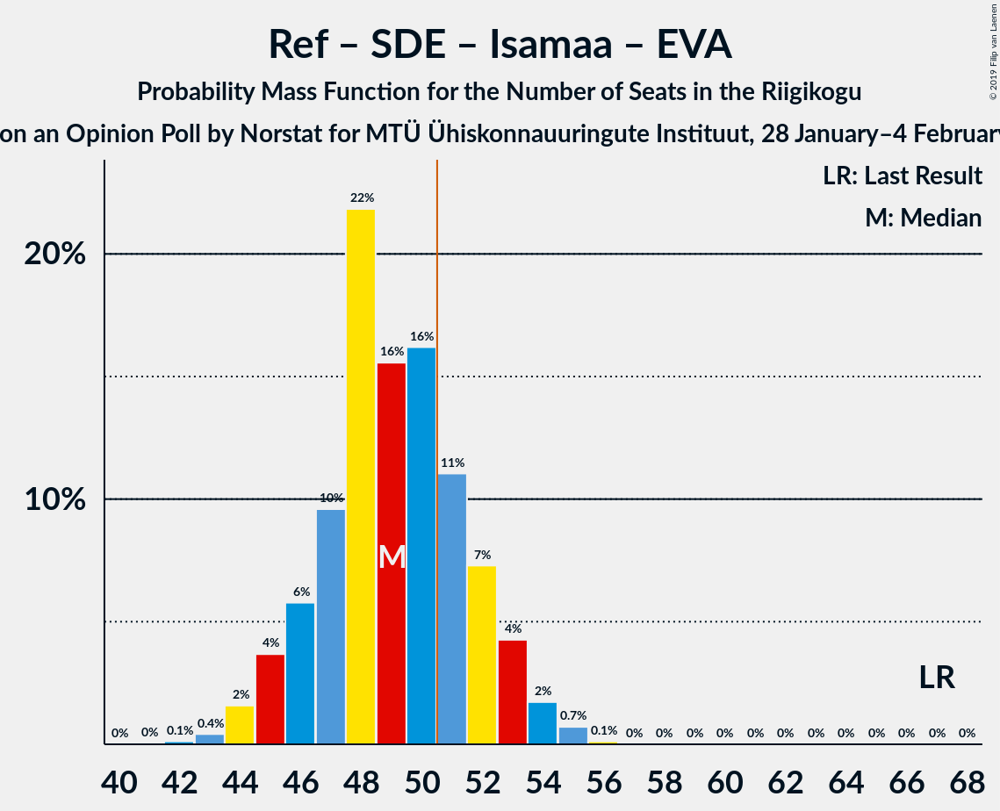

# Opinion Poll by Norstat for MTÜ Ühiskonnauuringute Instituut, 28 January–4 February 2019

<a href="#voting-intentions">Voting Intentions</a> | <a href="#seats">Seats</a> | <a href="#coalitions">Coalitions</a> | <a href="#technical-information">Technical Information</a>

## Voting Intentions

### Confidence Intervals

| Party | Last Result | Poll Result | 80% Confidence Interval | 90% Confidence Interval | 95% Confidence Interval | 99% Confidence Interval |
|:-----:|:-----------:|:-----------:|:-----------------------:|:-----------------------:|:-----------------------:|:-----------------------:|
| Eesti Keskerakond | 24.8% | 30.5% | 28.7–32.4% |28.2–33.0% |27.7–33.4% |26.9–34.4% |
| Eesti Reformierakond | 27.7% | 26.6% | 24.9–28.5% |24.4–29.0% |23.9–29.4% |23.1–30.3% |
| Eesti Konservatiivne Rahvaerakond | 8.1% | 13.3% | 12.0–14.8% |11.6–15.2% |11.3–15.5% |10.7–16.3% |
| Sotsiaaldemokraatlik Erakond | 15.2% | 11.0% | 9.8–12.4% |9.5–12.8% |9.2–13.1% |8.7–13.8% |
| Erakond Isamaa | 13.7% | 7.3% | 6.3–8.5% |6.1–8.8% |5.8–9.1% |5.4–9.7% |
| Eesti 200 | 0.0% | 4.6% | 3.9–5.6% |3.6–5.8% |3.5–6.1% |3.1–6.6% |
| Erakond Eestimaa Rohelised | 0.9% | 4.0% | 3.3–4.9% |3.1–5.2% |2.9–5.4% |2.7–5.9% |
| Eesti Vabaerakond | 8.7% | 0.7% | 0.5–1.2% |0.4–1.3% |0.3–1.4% |0.2–1.7% |

*Note:* The poll result column reflects the actual value used in the calculations. Published results may vary slightly, and in addition be rounded to fewer digits.

## Seats

### Confidence Intervals

| Party | Last Result | Median | 80% Confidence Interval | 90% Confidence Interval | 95% Confidence Interval | 99% Confidence Interval |
|:-----:|:-----------:|:------:|:-----------------------:|:-----------------------:|:-----------------------:|:-----------------------:|
| <a href="#eesti-keskerakond">Eesti Keskerakond</a> | 27 | 36 | 33–39 |33–39 |32–40 |31–41 |
| <a href="#eesti-reformierakond">Eesti Reformierakond</a> | 30 | 31 | 28–33 |28–34 |27–35 |26–36 |
| <a href="#eesti-konservatiivne-rahvaerakond">Eesti Konservatiivne Rahvaerakond</a> | 7 | 14 | 12–16 |12–16 |12–17 |11–18 |
| <a href="#sotsiaaldemokraatlik-erakond">Sotsiaaldemokraatlik Erakond</a> | 15 | 11 | 10–13 |9–13 |9–14 |9–14 |
| <a href="#erakond-isamaa">Erakond Isamaa</a> | 14 | 7 | 6–8 |6–9 |5–9 |5–10 |
| <a href="#eesti-200">Eesti 200</a> | 0 | 0 | 0–5 |0–5 |0–5 |0–6 |
| <a href="#erakond-eestimaa-rohelised">Erakond Eestimaa Rohelised</a> | 0 | 0 | 0 |0–4 |0–5 |0–5 |
| <a href="#eesti-vabaerakond">Eesti Vabaerakond</a> | 8 | 0 | 0 |0 |0 |0 |

### Eesti Keskerakond

*For a full overview of the results for this party, see the [Eesti Keskerakond](party-eestikeskerakond.html) page.*

| Number of Seats | Probability | Accumulated | Special Marks |
|:---------------:|:-----------:|:-----------:|:-------------:|
| 27 | 0% | 100% | Last Result |
| 28 | 0% | 100% |  |
| 29 | 0% | 100% |  |
| 30 | 0.3% | 99.9% |  |
| 31 | 1.0% | 99.7% |  |
| 32 | 3% | 98.7% |  |
| 33 | 7% | 96% |  |
| 34 | 14% | 88% |  |
| 35 | 16% | 75% |  |
| 36 | 23% | 59% | Median |
| 37 | 17% | 35% |  |
| 38 | 9% | 19% |  |
| 39 | 6% | 10% |  |
| 40 | 3% | 4% |  |
| 41 | 0.8% | 1.0% |  |
| 42 | 0.2% | 0.2% |  |
| 43 | 0% | 0% |  |

### Eesti Reformierakond

*For a full overview of the results for this party, see the [Eesti Reformierakond](party-eestireformierakond.html) page.*

| Number of Seats | Probability | Accumulated | Special Marks |
|:---------------:|:-----------:|:-----------:|:-------------:|
| 25 | 0.2% | 100% |  |
| 26 | 0.7% | 99.8% |  |
| 27 | 3% | 99.0% |  |
| 28 | 6% | 96% |  |
| 29 | 13% | 90% |  |
| 30 | 20% | 77% | Last Result |
| 31 | 22% | 57% | Median |
| 32 | 17% | 35% |  |
| 33 | 11% | 18% |  |
| 34 | 4% | 7% |  |
| 35 | 2% | 3% |  |
| 36 | 0.8% | 1.0% |  |
| 37 | 0.2% | 0.2% |  |
| 38 | 0% | 0% |  |

### Eesti Konservatiivne Rahvaerakond

*For a full overview of the results for this party, see the [Eesti Konservatiivne Rahvaerakond](party-eestikonservatiivnerahvaerakond.html) page.*

| Number of Seats | Probability | Accumulated | Special Marks |
|:---------------:|:-----------:|:-----------:|:-------------:|
| 7 | 0% | 100% | Last Result |
| 8 | 0% | 100% |  |
| 9 | 0% | 100% |  |
| 10 | 0.3% | 100% |  |
| 11 | 2% | 99.7% |  |
| 12 | 8% | 98% |  |
| 13 | 29% | 90% |  |
| 14 | 28% | 61% | Median |
| 15 | 15% | 33% |  |
| 16 | 14% | 17% |  |
| 17 | 2% | 3% |  |
| 18 | 0.5% | 0.6% |  |
| 19 | 0.1% | 0.1% |  |
| 20 | 0% | 0% |  |

### Sotsiaaldemokraatlik Erakond

*For a full overview of the results for this party, see the [Sotsiaaldemokraatlik Erakond](party-sotsiaaldemokraatlikerakond.html) page.*

| Number of Seats | Probability | Accumulated | Special Marks |
|:---------------:|:-----------:|:-----------:|:-------------:|
| 8 | 0.4% | 100% |  |
| 9 | 6% | 99.6% |  |
| 10 | 10% | 94% |  |
| 11 | 56% | 84% | Median |
| 12 | 14% | 28% |  |
| 13 | 9% | 14% |  |
| 14 | 4% | 5% |  |
| 15 | 0.4% | 0.4% | Last Result |
| 16 | 0% | 0% |  |

### Erakond Isamaa

*For a full overview of the results for this party, see the [Erakond Isamaa](party-erakondisamaa.html) page.*

| Number of Seats | Probability | Accumulated | Special Marks |
|:---------------:|:-----------:|:-----------:|:-------------:|
| 0 | 0.1% | 100% |  |
| 1 | 0% | 99.9% |  |
| 2 | 0% | 99.9% |  |
| 3 | 0% | 99.9% |  |
| 4 | 0.1% | 99.9% |  |
| 5 | 4% | 99.9% |  |
| 6 | 25% | 96% |  |
| 7 | 41% | 70% | Median |
| 8 | 24% | 29% |  |
| 9 | 5% | 6% |  |
| 10 | 0.6% | 0.7% |  |
| 11 | 0.1% | 0.1% |  |
| 12 | 0% | 0% |  |
| 13 | 0% | 0% |  |
| 14 | 0% | 0% | Last Result |

### Eesti 200

*For a full overview of the results for this party, see the [Eesti 200](party-eesti200.html) page.*

| Number of Seats | Probability | Accumulated | Special Marks |
|:---------------:|:-----------:|:-----------:|:-------------:|
| 0 | 63% | 100% | Last Result, Median |
| 1 | 0% | 37% |  |
| 2 | 0% | 37% |  |
| 3 | 0% | 37% |  |
| 4 | 13% | 37% |  |
| 5 | 23% | 25% |  |
| 6 | 2% | 2% |  |
| 7 | 0.1% | 0.1% |  |
| 8 | 0% | 0% |  |

### Erakond Eestimaa Rohelised

*For a full overview of the results for this party, see the [Erakond Eestimaa Rohelised](party-erakondeestimaarohelised.html) page.*

| Number of Seats | Probability | Accumulated | Special Marks |
|:---------------:|:-----------:|:-----------:|:-------------:|
| 0 | 93% | 100% | Last Result, Median |
| 1 | 0% | 7% |  |
| 2 | 0% | 7% |  |
| 3 | 0% | 7% |  |
| 4 | 2% | 7% |  |
| 5 | 4% | 5% |  |
| 6 | 0.2% | 0.2% |  |
| 7 | 0% | 0% |  |

### Eesti Vabaerakond

*For a full overview of the results for this party, see the [Eesti Vabaerakond](party-eestivabaerakond.html) page.*

| Number of Seats | Probability | Accumulated | Special Marks |
|:---------------:|:-----------:|:-----------:|:-------------:|
| 0 | 100% | 100% | Median |
| 1 | 0% | 0% |  |
| 2 | 0% | 0% |  |
| 3 | 0% | 0% |  |
| 4 | 0% | 0% |  |
| 5 | 0% | 0% |  |
| 6 | 0% | 0% |  |
| 7 | 0% | 0% |  |
| 8 | 0% | 0% | Last Result |

## Coalitions

### Confidence Intervals

| Coalition | Last Result | Median | Majority? | 80% Confidence Interval | 90% Confidence Interval | 95% Confidence Interval | 99% Confidence Interval |
|:---------:|:-----------:|:------:|:---------:|:-----------------------:|:-----------------------:|:-----------------------:|:-----------------------:|
| Eesti Keskerakond – Eesti Reformierakond – Eesti Konservatiivne Rahvaerakond | 64 | 81 | 100% | 78–83 | 77–84 | 76–85 | 74–86 |
| Eesti Keskerakond – Eesti Reformierakond | 57 | 67 | 100% | 64–69 | 63–70 | 62–71 | 61–73 |
| Eesti Keskerakond – Sotsiaaldemokraatlik Erakond – Erakond Isamaa | 56 | 54 | 95% | 51–57 | 50–58 | 50–59 | 48–60 |
| Eesti Reformierakond – Eesti Konservatiivne Rahvaerakond – Erakond Isamaa | 51 | 52 | 67% | 49–55 | 48–56 | 48–56 | 46–57 |
| Eesti Keskerakond – Eesti Konservatiivne Rahvaerakond | 34 | 50 | 39% | 47–53 | 46–53 | 46–54 | 44–55 |
| Eesti Reformierakond – Sotsiaaldemokraatlik Erakond – Erakond Isamaa – Eesti Vabaerakond | 67 | 49 | 25% | 46–52 | 45–53 | 45–54 | 43–55 |
| Eesti Reformierakond – Sotsiaaldemokraatlik Erakond – Erakond Isamaa | 59 | 49 | 25% | 46–52 | 45–53 | 45–54 | 43–55 |
| Eesti Keskerakond – Sotsiaaldemokraatlik Erakond | 42 | 47 | 7% | 44–50 | 44–51 | 43–51 | 42–53 |
| Eesti Reformierakond – Eesti Konservatiivne Rahvaerakond | 37 | 45 | 0.5% | 42–48 | 41–49 | 41–49 | 39–50 |
| Eesti Reformierakond – Sotsiaaldemokraatlik Erakond | 45 | 42 | 0% | 39–45 | 39–46 | 38–46 | 37–48 |
| Eesti Reformierakond – Erakond Isamaa | 44 | 38 | 0% | 35–40 | 34–41 | 34–42 | 33–43 |
| Eesti Konservatiivne Rahvaerakond – Sotsiaaldemokraatlik Erakond | 22 | 25 | 0% | 23–27 | 23–28 | 22–29 | 21–30 |

### Eesti Keskerakond – Eesti Reformierakond – Eesti Konservatiivne Rahvaerakond

| Number of Seats | Probability | Accumulated | Special Marks |
|:---------------:|:-----------:|:-----------:|:-------------:|
| 64 | 0% | 100% | Last Result |
| 65 | 0% | 100% |  |
| 66 | 0% | 100% |  |
| 67 | 0% | 100% |  |
| 68 | 0% | 100% |  |
| 69 | 0% | 100% |  |
| 70 | 0% | 100% |  |
| 71 | 0% | 100% |  |
| 72 | 0% | 100% |  |
| 73 | 0.2% | 99.9% |  |
| 74 | 0.4% | 99.8% |  |
| 75 | 1.3% | 99.3% |  |
| 76 | 3% | 98% |  |
| 77 | 2% | 95% |  |
| 78 | 10% | 93% |  |
| 79 | 21% | 83% |  |
| 80 | 11% | 62% |  |
| 81 | 6% | 51% | Median |
| 82 | 15% | 45% |  |
| 83 | 22% | 30% |  |
| 84 | 5% | 8% |  |
| 85 | 1.3% | 3% |  |
| 86 | 1.3% | 2% |  |
| 87 | 0.2% | 0.2% |  |
| 88 | 0% | 0% |  |

### Eesti Keskerakond – Eesti Reformierakond

| Number of Seats | Probability | Accumulated | Special Marks |
|:---------------:|:-----------:|:-----------:|:-------------:|
| 57 | 0% | 100% | Last Result |
| 58 | 0% | 100% |  |
| 59 | 0.1% | 100% |  |
| 60 | 0.3% | 99.9% |  |
| 61 | 1.2% | 99.5% |  |
| 62 | 2% | 98% |  |
| 63 | 4% | 96% |  |
| 64 | 9% | 92% |  |
| 65 | 11% | 82% |  |
| 66 | 21% | 71% |  |
| 67 | 12% | 50% | Median |
| 68 | 13% | 38% |  |
| 69 | 16% | 25% |  |
| 70 | 6% | 9% |  |
| 71 | 2% | 3% |  |
| 72 | 0.8% | 2% |  |
| 73 | 0.7% | 0.8% |  |
| 74 | 0.1% | 0.1% |  |
| 75 | 0% | 0% |  |

### Eesti Keskerakond – Sotsiaaldemokraatlik Erakond – Erakond Isamaa

| Number of Seats | Probability | Accumulated | Special Marks |
|:---------------:|:-----------:|:-----------:|:-------------:|
| 47 | 0.1% | 100% |  |
| 48 | 0.5% | 99.8% |  |
| 49 | 2% | 99.3% |  |
| 50 | 3% | 98% |  |
| 51 | 9% | 95% | Majority |
| 52 | 11% | 86% |  |
| 53 | 12% | 74% |  |
| 54 | 18% | 62% | Median |
| 55 | 19% | 44% |  |
| 56 | 10% | 25% | Last Result |
| 57 | 7% | 15% |  |
| 58 | 5% | 8% |  |
| 59 | 2% | 3% |  |
| 60 | 0.6% | 0.8% |  |
| 61 | 0.2% | 0.2% |  |
| 62 | 0% | 0% |  |

### Eesti Reformierakond – Eesti Konservatiivne Rahvaerakond – Erakond Isamaa

| Number of Seats | Probability | Accumulated | Special Marks |
|:---------------:|:-----------:|:-----------:|:-------------:|
| 44 | 0.1% | 100% |  |
| 45 | 0.1% | 99.9% |  |
| 46 | 0.6% | 99.8% |  |
| 47 | 2% | 99.2% |  |
| 48 | 3% | 98% |  |
| 49 | 8% | 94% |  |
| 50 | 19% | 86% |  |
| 51 | 11% | 67% | Last Result, Majority |
| 52 | 16% | 56% | Median |
| 53 | 14% | 40% |  |
| 54 | 14% | 25% |  |
| 55 | 6% | 11% |  |
| 56 | 4% | 6% |  |
| 57 | 1.2% | 2% |  |
| 58 | 0.3% | 0.4% |  |
| 59 | 0.1% | 0.1% |  |
| 60 | 0% | 0% |  |

### Eesti Keskerakond – Eesti Konservatiivne Rahvaerakond

| Number of Seats | Probability | Accumulated | Special Marks |
|:---------------:|:-----------:|:-----------:|:-------------:|
| 34 | 0% | 100% | Last Result |
| 35 | 0% | 100% |  |
| 36 | 0% | 100% |  |
| 37 | 0% | 100% |  |
| 38 | 0% | 100% |  |
| 39 | 0% | 100% |  |
| 40 | 0% | 100% |  |
| 41 | 0% | 100% |  |
| 42 | 0.1% | 100% |  |
| 43 | 0.2% | 99.9% |  |
| 44 | 0.4% | 99.8% |  |
| 45 | 1.4% | 99.4% |  |
| 46 | 4% | 98% |  |
| 47 | 9% | 94% |  |
| 48 | 9% | 84% |  |
| 49 | 22% | 75% |  |
| 50 | 14% | 53% | Median |
| 51 | 15% | 39% | Majority |
| 52 | 10% | 24% |  |
| 53 | 9% | 14% |  |
| 54 | 2% | 4% |  |
| 55 | 2% | 2% |  |
| 56 | 0.4% | 0.5% |  |
| 57 | 0.1% | 0.1% |  |
| 58 | 0% | 0% |  |

### Eesti Reformierakond – Sotsiaaldemokraatlik Erakond – Erakond Isamaa – Eesti Vabaerakond

| Number of Seats | Probability | Accumulated | Special Marks |
|:---------------:|:-----------:|:-----------:|:-------------:|
| 42 | 0.1% | 100% |  |
| 43 | 0.4% | 99.8% |  |
| 44 | 2% | 99.4% |  |
| 45 | 4% | 98% |  |
| 46 | 6% | 94% |  |
| 47 | 10% | 88% |  |
| 48 | 22% | 79% |  |
| 49 | 16% | 57% | Median |
| 50 | 16% | 41% |  |
| 51 | 11% | 25% | Majority |
| 52 | 7% | 14% |  |
| 53 | 4% | 7% |  |
| 54 | 2% | 3% |  |
| 55 | 0.7% | 0.9% |  |
| 56 | 0.1% | 0.1% |  |
| 57 | 0% | 0% |  |
| 58 | 0% | 0% |  |
| 59 | 0% | 0% |  |
| 60 | 0% | 0% |  |
| 61 | 0% | 0% |  |
| 62 | 0% | 0% |  |
| 63 | 0% | 0% |  |
| 64 | 0% | 0% |  |
| 65 | 0% | 0% |  |
| 66 | 0% | 0% |  |
| 67 | 0% | 0% | Last Result |

### Eesti Reformierakond – Sotsiaaldemokraatlik Erakond – Erakond Isamaa

| Number of Seats | Probability | Accumulated | Special Marks |
|:---------------:|:-----------:|:-----------:|:-------------:|
| 42 | 0.1% | 100% |  |
| 43 | 0.4% | 99.8% |  |
| 44 | 2% | 99.4% |  |
| 45 | 4% | 98% |  |
| 46 | 6% | 94% |  |
| 47 | 10% | 88% |  |
| 48 | 22% | 79% |  |
| 49 | 16% | 57% | Median |
| 50 | 16% | 41% |  |
| 51 | 11% | 25% | Majority |
| 52 | 7% | 14% |  |
| 53 | 4% | 7% |  |
| 54 | 2% | 3% |  |
| 55 | 0.7% | 0.9% |  |
| 56 | 0.1% | 0.1% |  |
| 57 | 0% | 0% |  |
| 58 | 0% | 0% |  |
| 59 | 0% | 0% | Last Result |

### Eesti Keskerakond – Sotsiaaldemokraatlik Erakond

| Number of Seats | Probability | Accumulated | Special Marks |
|:---------------:|:-----------:|:-----------:|:-------------:|
| 40 | 0.1% | 100% |  |
| 41 | 0.3% | 99.9% |  |
| 42 | 1.3% | 99.6% | Last Result |
| 43 | 2% | 98% |  |
| 44 | 7% | 96% |  |
| 45 | 11% | 89% |  |
| 46 | 15% | 78% |  |
| 47 | 24% | 63% | Median |
| 48 | 16% | 39% |  |
| 49 | 9% | 23% |  |
| 50 | 7% | 13% |  |
| 51 | 4% | 7% | Majority |
| 52 | 2% | 2% |  |
| 53 | 0.8% | 1.0% |  |
| 54 | 0.2% | 0.2% |  |
| 55 | 0% | 0% |  |

### Eesti Reformierakond – Eesti Konservatiivne Rahvaerakond

| Number of Seats | Probability | Accumulated | Special Marks |
|:---------------:|:-----------:|:-----------:|:-------------:|
| 37 | 0% | 100% | Last Result |
| 38 | 0.1% | 100% |  |
| 39 | 0.5% | 99.9% |  |
| 40 | 1.3% | 99.4% |  |
| 41 | 3% | 98% |  |
| 42 | 8% | 95% |  |
| 43 | 17% | 87% |  |
| 44 | 13% | 69% |  |
| 45 | 16% | 56% | Median |
| 46 | 20% | 40% |  |
| 47 | 9% | 20% |  |
| 48 | 6% | 11% |  |
| 49 | 4% | 6% |  |
| 50 | 0.9% | 1.4% |  |
| 51 | 0.4% | 0.5% | Majority |
| 52 | 0.1% | 0.1% |  |
| 53 | 0% | 0% |  |

### Eesti Reformierakond – Sotsiaaldemokraatlik Erakond

| Number of Seats | Probability | Accumulated | Special Marks |
|:---------------:|:-----------:|:-----------:|:-------------:|
| 35 | 0.1% | 100% |  |
| 36 | 0.3% | 99.9% |  |
| 37 | 1.0% | 99.6% |  |
| 38 | 3% | 98.7% |  |
| 39 | 6% | 96% |  |
| 40 | 12% | 89% |  |
| 41 | 17% | 78% |  |
| 42 | 20% | 61% | Median |
| 43 | 17% | 40% |  |
| 44 | 12% | 24% |  |
| 45 | 6% | 11% | Last Result |
| 46 | 3% | 5% |  |
| 47 | 2% | 2% |  |
| 48 | 0.4% | 0.5% |  |
| 49 | 0.1% | 0.1% |  |
| 50 | 0% | 0% |  |

### Eesti Reformierakond – Erakond Isamaa

| Number of Seats | Probability | Accumulated | Special Marks |
|:---------------:|:-----------:|:-----------:|:-------------:|
| 31 | 0.1% | 100% |  |
| 32 | 0.3% | 99.9% |  |
| 33 | 1.4% | 99.5% |  |
| 34 | 4% | 98% |  |
| 35 | 7% | 95% |  |
| 36 | 11% | 88% |  |
| 37 | 22% | 76% |  |
| 38 | 18% | 54% | Median |
| 39 | 16% | 36% |  |
| 40 | 10% | 20% |  |
| 41 | 6% | 10% |  |
| 42 | 3% | 4% |  |
| 43 | 1.2% | 1.5% |  |
| 44 | 0.2% | 0.3% | Last Result |
| 45 | 0% | 0.1% |  |
| 46 | 0% | 0% |  |

### Eesti Konservatiivne Rahvaerakond – Sotsiaaldemokraatlik Erakond

| Number of Seats | Probability | Accumulated | Special Marks |
|:---------------:|:-----------:|:-----------:|:-------------:|
| 20 | 0.1% | 100% |  |
| 21 | 0.9% | 99.8% |  |
| 22 | 4% | 98.9% | Last Result |
| 23 | 8% | 95% |  |
| 24 | 24% | 87% |  |
| 25 | 21% | 63% | Median |
| 26 | 16% | 42% |  |
| 27 | 17% | 26% |  |
| 28 | 6% | 9% |  |
| 29 | 2% | 3% |  |
| 30 | 1.0% | 1.2% |  |
| 31 | 0.2% | 0.2% |  |
| 32 | 0% | 0% |  |

## Technical Information

### Opinion Poll

+ **Polling firm:** Norstat
+ **Commissioner(s):** MTÜ Ühiskonnauuringute Instituut
+ **Fieldwork period:** 28 January–4 February 2019

### Calculations

+ **Sample size:** 1000
+ **Simulations done:** 1,048,576
+ **Error estimate:** 1.23%

