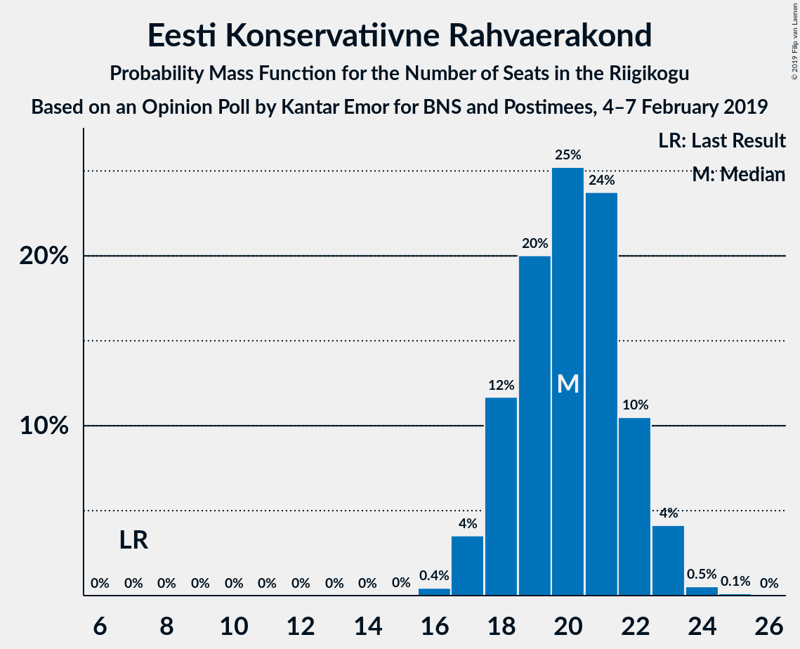
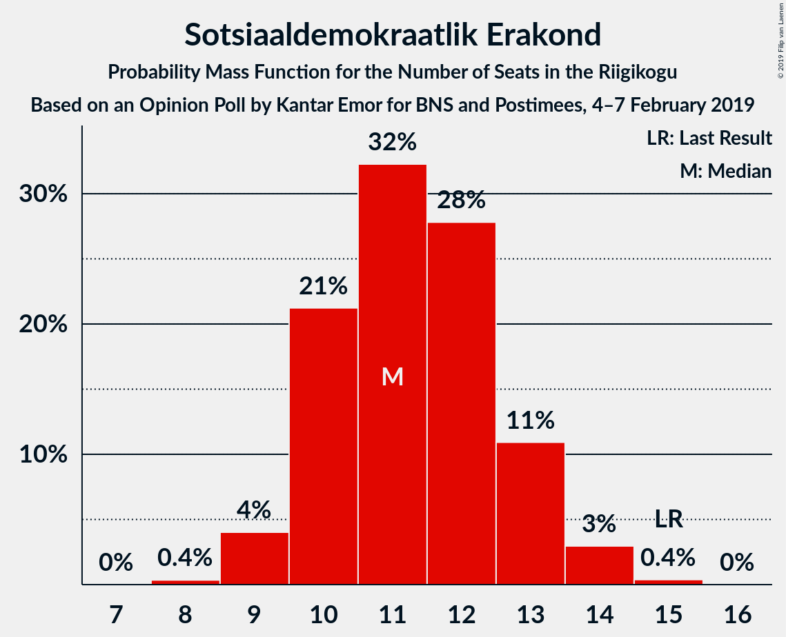
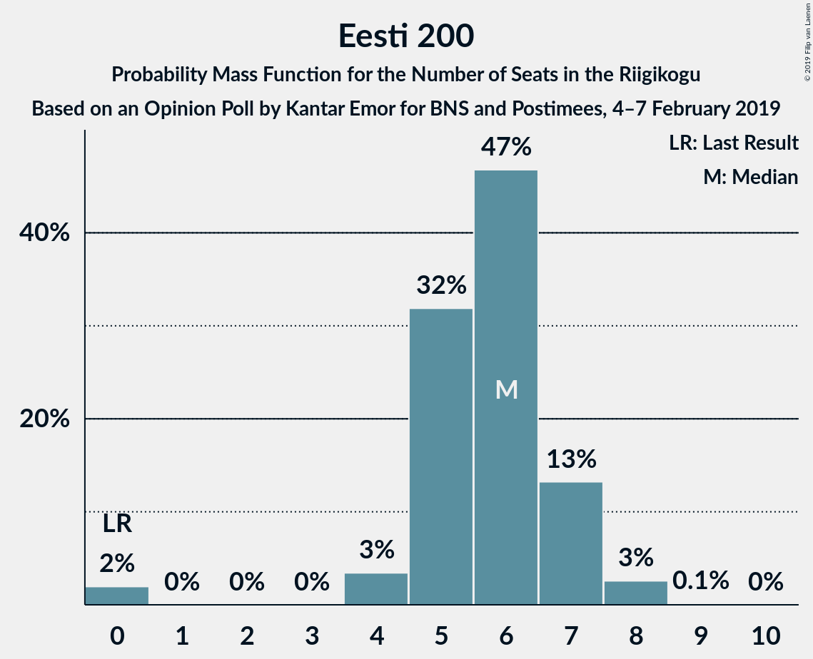
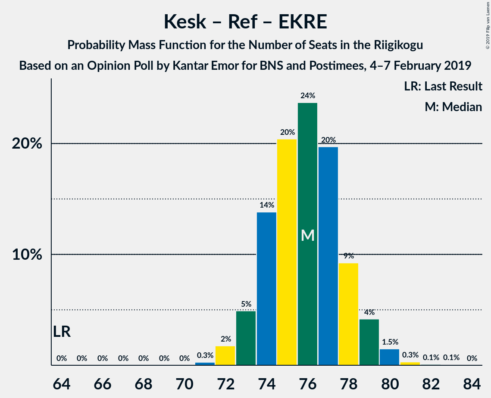
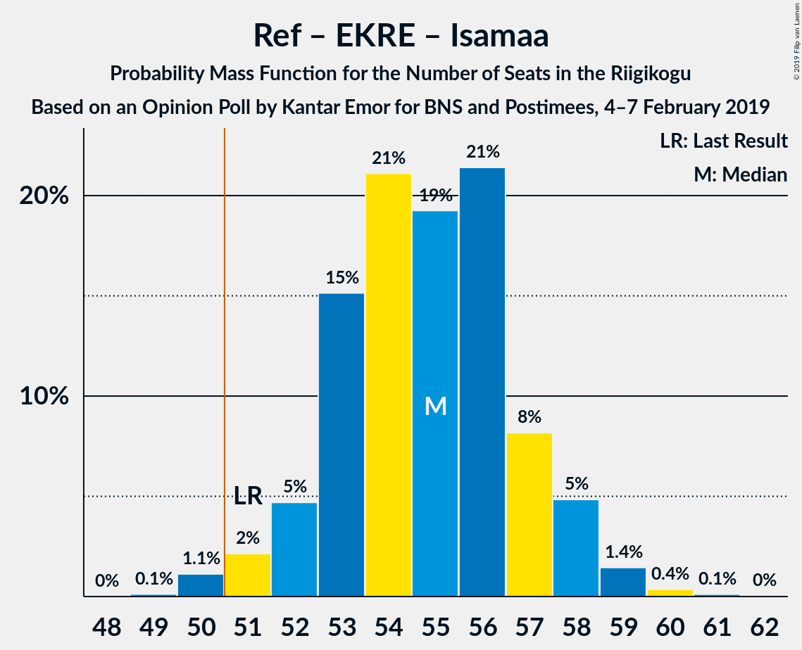
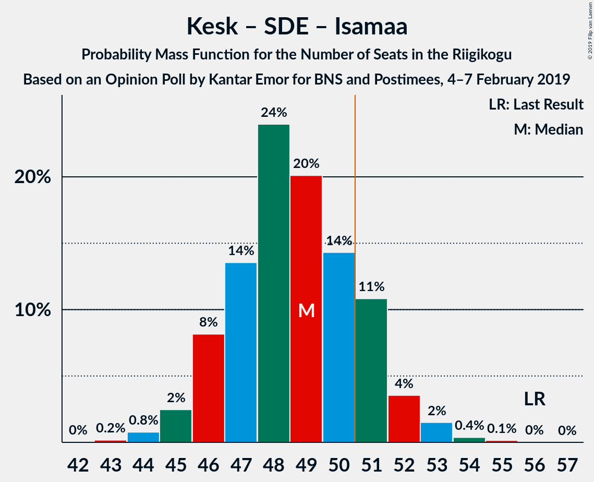
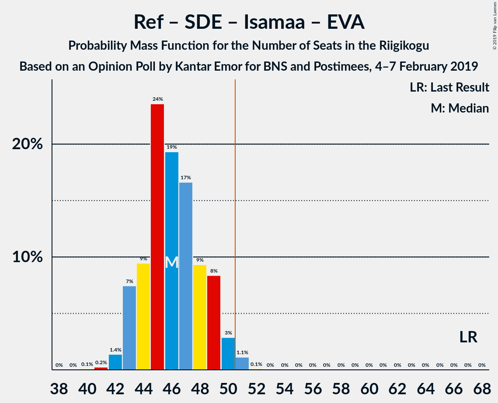
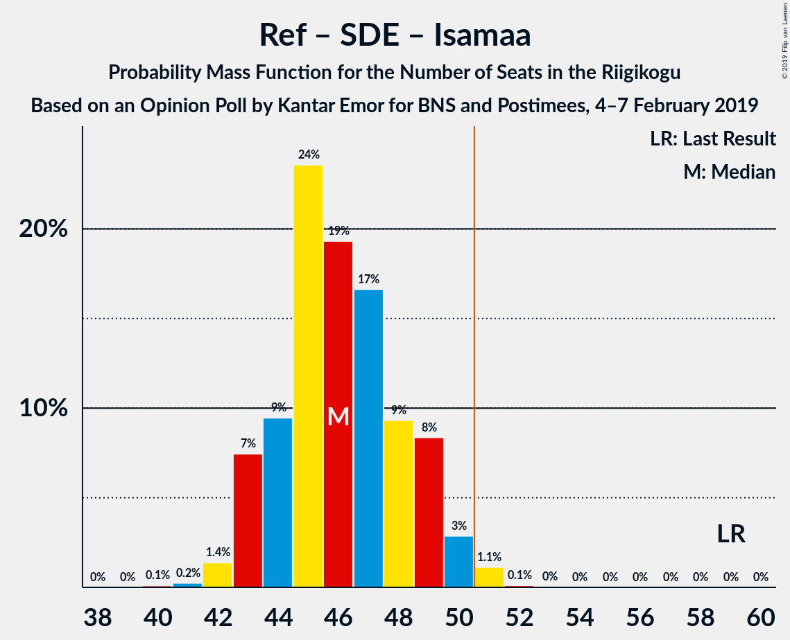

# Opinion Poll by Kantar Emor for BNS and Postimees, 4–7 February 2019

<a href="#voting-intentions">Voting Intentions</a> | <a href="#seats">Seats</a> | <a href="#coalitions">Coalitions</a> | <a href="#technical-information">Technical Information</a>

## Voting Intentions

### Confidence Intervals

| Party | Last Result | Poll Result | 80% Confidence Interval | 90% Confidence Interval | 95% Confidence Interval | 99% Confidence Interval |
|:-----:|:-----------:|:-----------:|:-----------------------:|:-----------------------:|:-----------------------:|:-----------------------:|
| Eesti Keskerakond | 24.8% | 26.5% | 24.9–28.2% |24.4–28.7% |24.0–29.1% |23.2–30.0% |
| Eesti Reformierakond | 27.7% | 24.5% | 22.9–26.2% |22.4–26.6% |22.1–27.1% |21.3–27.9% |
| Eesti Konservatiivne Rahvaerakond | 8.1% | 18.9% | 17.5–20.5% |17.1–20.9% |16.8–21.3% |16.1–22.1% |
| Sotsiaaldemokraatlik Erakond | 15.2% | 11.5% | 10.4–12.8% |10.1–13.2% |9.8–13.5% |9.3–14.2% |
| Erakond Isamaa | 13.7% | 8.6% | 7.6–9.8% |7.4–10.1% |7.1–10.4% |6.7–11.0% |
| Eesti 200 | 0.0% | 6.4% | 5.6–7.5% |5.3–7.8% |5.1–8.0% |4.8–8.5% |
| Erakond Eestimaa Rohelised | 0.9% | 2.2% | 1.7–2.9% |1.6–3.1% |1.5–3.2% |1.3–3.6% |
| Eesti Vabaerakond | 8.7% | 0.7% | 0.5–1.1% |0.4–1.3% |0.4–1.4% |0.3–1.6% |

*Note:* The poll result column reflects the actual value used in the calculations. Published results may vary slightly, and in addition be rounded to fewer digits.

## Seats

### Confidence Intervals

| Party | Last Result | Median | 80% Confidence Interval | 90% Confidence Interval | 95% Confidence Interval | 99% Confidence Interval |
|:-----:|:-----------:|:------:|:-----------------------:|:-----------------------:|:-----------------------:|:-----------------------:|
| <a href="#eesti-keskerakond">Eesti Keskerakond</a> | 27 | 29 | 27–31 |27–32 |26–33 |25–33 |
| <a href="#eesti-reformierakond">Eesti Reformierakond</a> | 30 | 26 | 25–29 |24–29 |24–30 |23–31 |
| <a href="#eesti-konservatiivne-rahvaerakond">Eesti Konservatiivne Rahvaerakond</a> | 7 | 20 | 18–22 |18–22 |17–23 |17–24 |
| <a href="#sotsiaaldemokraatlik-erakond">Sotsiaaldemokraatlik Erakond</a> | 15 | 11 | 10–13 |10–13 |9–14 |9–14 |
| <a href="#erakond-isamaa">Erakond Isamaa</a> | 14 | 8 | 7–9 |7–10 |6–10 |6–11 |
| <a href="#eesti-200">Eesti 200</a> | 0 | 6 | 5–7 |4–7 |4–8 |0–8 |
| <a href="#erakond-eestimaa-rohelised">Erakond Eestimaa Rohelised</a> | 0 | 0 | 0 |0 |0 |0 |
| <a href="#eesti-vabaerakond">Eesti Vabaerakond</a> | 8 | 0 | 0 |0 |0 |0 |

### Eesti Keskerakond

*For a full overview of the results for this party, see the [Eesti Keskerakond](party-eestikeskerakond.html) page.*

| Number of Seats | Probability | Accumulated | Special Marks |
|:---------------:|:-----------:|:-----------:|:-------------:|
| 24 | 0.1% | 100% |  |
| 25 | 0.9% | 99.9% |  |
| 26 | 3% | 98.9% |  |
| 27 | 10% | 95% | Last Result |
| 28 | 18% | 86% |  |
| 29 | 26% | 68% | Median |
| 30 | 21% | 42% |  |
| 31 | 13% | 21% |  |
| 32 | 5% | 8% |  |
| 33 | 2% | 3% |  |
| 34 | 0.3% | 0.4% |  |
| 35 | 0.1% | 0.1% |  |
| 36 | 0% | 0% |  |

### Eesti Reformierakond

*For a full overview of the results for this party, see the [Eesti Reformierakond](party-eestireformierakond.html) page.*

| Number of Seats | Probability | Accumulated | Special Marks |
|:---------------:|:-----------:|:-----------:|:-------------:|
| 22 | 0.3% | 100% |  |
| 23 | 1.3% | 99.7% |  |
| 24 | 7% | 98% |  |
| 25 | 14% | 91% |  |
| 26 | 27% | 77% | Median |
| 27 | 22% | 50% |  |
| 28 | 15% | 28% |  |
| 29 | 8% | 13% |  |
| 30 | 4% | 4% | Last Result |
| 31 | 0.7% | 0.9% |  |
| 32 | 0.1% | 0.1% |  |
| 33 | 0% | 0% |  |

### Eesti Konservatiivne Rahvaerakond

*For a full overview of the results for this party, see the [Eesti Konservatiivne Rahvaerakond](party-eestikonservatiivnerahvaerakond.html) page.*

| Number of Seats | Probability | Accumulated | Special Marks |
|:---------------:|:-----------:|:-----------:|:-------------:|
| 7 | 0% | 100% | Last Result |
| 8 | 0% | 100% |  |
| 9 | 0% | 100% |  |
| 10 | 0% | 100% |  |
| 11 | 0% | 100% |  |
| 12 | 0% | 100% |  |
| 13 | 0% | 100% |  |
| 14 | 0% | 100% |  |
| 15 | 0% | 100% |  |
| 16 | 0.4% | 100% |  |
| 17 | 4% | 99.5% |  |
| 18 | 12% | 96% |  |
| 19 | 20% | 84% |  |
| 20 | 25% | 64% | Median |
| 21 | 24% | 39% |  |
| 22 | 10% | 15% |  |
| 23 | 4% | 5% |  |
| 24 | 0.5% | 0.7% |  |
| 25 | 0.1% | 0.1% |  |
| 26 | 0% | 0% |  |

### Sotsiaaldemokraatlik Erakond

*For a full overview of the results for this party, see the [Sotsiaaldemokraatlik Erakond](party-sotsiaaldemokraatlikerakond.html) page.*

| Number of Seats | Probability | Accumulated | Special Marks |
|:---------------:|:-----------:|:-----------:|:-------------:|
| 8 | 0.4% | 100% |  |
| 9 | 4% | 99.6% |  |
| 10 | 21% | 96% |  |
| 11 | 32% | 74% | Median |
| 12 | 28% | 42% |  |
| 13 | 11% | 14% |  |
| 14 | 3% | 3% |  |
| 15 | 0.4% | 0.4% | Last Result |
| 16 | 0% | 0% |  |

### Erakond Isamaa

*For a full overview of the results for this party, see the [Erakond Isamaa](party-erakondisamaa.html) page.*

| Number of Seats | Probability | Accumulated | Special Marks |
|:---------------:|:-----------:|:-----------:|:-------------:|
| 5 | 0.1% | 100% |  |
| 6 | 4% | 99.9% |  |
| 7 | 28% | 96% |  |
| 8 | 27% | 68% | Median |
| 9 | 32% | 41% |  |
| 10 | 8% | 9% |  |
| 11 | 0.5% | 0.6% |  |
| 12 | 0.1% | 0.1% |  |
| 13 | 0% | 0% |  |
| 14 | 0% | 0% | Last Result |

### Eesti 200

*For a full overview of the results for this party, see the [Eesti 200](party-eesti200.html) page.*

| Number of Seats | Probability | Accumulated | Special Marks |
|:---------------:|:-----------:|:-----------:|:-------------:|
| 0 | 2% | 100% | Last Result |
| 1 | 0% | 98% |  |
| 2 | 0% | 98% |  |
| 3 | 0% | 98% |  |
| 4 | 3% | 98% |  |
| 5 | 32% | 95% |  |
| 6 | 47% | 63% | Median |
| 7 | 13% | 16% |  |
| 8 | 3% | 3% |  |
| 9 | 0.1% | 0.1% |  |
| 10 | 0% | 0% |  |

### Erakond Eestimaa Rohelised

*For a full overview of the results for this party, see the [Erakond Eestimaa Rohelised](party-erakondeestimaarohelised.html) page.*

| Number of Seats | Probability | Accumulated | Special Marks |
|:---------------:|:-----------:|:-----------:|:-------------:|
| 0 | 100% | 100% | Last Result, Median |

### Eesti Vabaerakond

*For a full overview of the results for this party, see the [Eesti Vabaerakond](party-eestivabaerakond.html) page.*

| Number of Seats | Probability | Accumulated | Special Marks |
|:---------------:|:-----------:|:-----------:|:-------------:|
| 0 | 100% | 100% | Median |
| 1 | 0% | 0% |  |
| 2 | 0% | 0% |  |
| 3 | 0% | 0% |  |
| 4 | 0% | 0% |  |
| 5 | 0% | 0% |  |
| 6 | 0% | 0% |  |
| 7 | 0% | 0% |  |
| 8 | 0% | 0% | Last Result |

## Coalitions

### Confidence Intervals

| Coalition | Last Result | Median | Majority? | 80% Confidence Interval | 90% Confidence Interval | 95% Confidence Interval | 99% Confidence Interval |
|:---------:|:-----------:|:------:|:---------:|:-----------------------:|:-----------------------:|:-----------------------:|:-----------------------:|
| Eesti Keskerakond – Eesti Reformierakond – Eesti Konservatiivne Rahvaerakond | 64 | 76 | 100% | 74–78 | 73–79 | 73–79 | 72–80 |
| Eesti Keskerakond – Eesti Reformierakond | 57 | 56 | 99.9% | 53–58 | 53–59 | 52–60 | 51–61 |
| Eesti Reformierakond – Eesti Konservatiivne Rahvaerakond – Erakond Isamaa | 51 | 55 | 98.7% | 53–57 | 52–58 | 51–58 | 50–60 |
| Eesti Keskerakond – Eesti Konservatiivne Rahvaerakond | 34 | 50 | 29% | 47–51 | 46–52 | 46–52 | 45–54 |
| Eesti Keskerakond – Sotsiaaldemokraatlik Erakond – Erakond Isamaa | 56 | 49 | 16% | 46–51 | 46–52 | 45–52 | 44–54 |
| Eesti Reformierakond – Eesti Konservatiivne Rahvaerakond | 37 | 47 | 1.3% | 44–49 | 44–50 | 43–50 | 42–51 |
| Eesti Reformierakond – Sotsiaaldemokraatlik Erakond – Erakond Isamaa – Eesti Vabaerakond | 67 | 46 | 1.3% | 44–49 | 43–49 | 43–50 | 42–51 |
| Eesti Reformierakond – Sotsiaaldemokraatlik Erakond – Erakond Isamaa | 59 | 46 | 1.3% | 44–49 | 43–49 | 43–50 | 42–51 |
| Eesti Keskerakond – Sotsiaaldemokraatlik Erakond | 42 | 40 | 0% | 38–43 | 38–43 | 37–44 | 36–45 |
| Eesti Reformierakond – Sotsiaaldemokraatlik Erakond | 45 | 38 | 0% | 36–40 | 35–41 | 35–42 | 34–43 |
| Eesti Reformierakond – Erakond Isamaa | 44 | 35 | 0% | 33–37 | 32–38 | 31–39 | 30–39 |
| Eesti Konservatiivne Rahvaerakond – Sotsiaaldemokraatlik Erakond | 22 | 31 | 0% | 29–34 | 29–34 | 28–35 | 27–36 |

### Eesti Keskerakond – Eesti Reformierakond – Eesti Konservatiivne Rahvaerakond

| Number of Seats | Probability | Accumulated | Special Marks |
|:---------------:|:-----------:|:-----------:|:-------------:|
| 64 | 0% | 100% | Last Result |
| 65 | 0% | 100% |  |
| 66 | 0% | 100% |  |
| 67 | 0% | 100% |  |
| 68 | 0% | 100% |  |
| 69 | 0% | 100% |  |
| 70 | 0% | 100% |  |
| 71 | 0.3% | 100% |  |
| 72 | 2% | 99.7% |  |
| 73 | 5% | 98% |  |
| 74 | 14% | 93% |  |
| 75 | 20% | 79% | Median |
| 76 | 24% | 59% |  |
| 77 | 20% | 35% |  |
| 78 | 9% | 15% |  |
| 79 | 4% | 6% |  |
| 80 | 1.5% | 2% |  |
| 81 | 0.3% | 0.5% |  |
| 82 | 0.1% | 0.2% |  |
| 83 | 0.1% | 0.1% |  |
| 84 | 0% | 0% |  |

### Eesti Keskerakond – Eesti Reformierakond

| Number of Seats | Probability | Accumulated | Special Marks |
|:---------------:|:-----------:|:-----------:|:-------------:|
| 50 | 0.1% | 100% |  |
| 51 | 0.6% | 99.9% | Majority |
| 52 | 2% | 99.3% |  |
| 53 | 7% | 97% |  |
| 54 | 10% | 90% |  |
| 55 | 25% | 80% | Median |
| 56 | 20% | 54% |  |
| 57 | 17% | 35% | Last Result |
| 58 | 11% | 18% |  |
| 59 | 5% | 7% |  |
| 60 | 2% | 3% |  |
| 61 | 0.6% | 0.7% |  |
| 62 | 0.1% | 0.2% |  |
| 63 | 0.1% | 0.1% |  |
| 64 | 0% | 0% |  |

### Eesti Reformierakond – Eesti Konservatiivne Rahvaerakond – Erakond Isamaa

| Number of Seats | Probability | Accumulated | Special Marks |
|:---------------:|:-----------:|:-----------:|:-------------:|
| 49 | 0.1% | 100% |  |
| 50 | 1.1% | 99.9% |  |
| 51 | 2% | 98.7% | Last Result, Majority |
| 52 | 5% | 97% |  |
| 53 | 15% | 92% |  |
| 54 | 21% | 77% | Median |
| 55 | 19% | 56% |  |
| 56 | 21% | 36% |  |
| 57 | 8% | 15% |  |
| 58 | 5% | 7% |  |
| 59 | 1.4% | 2% |  |
| 60 | 0.4% | 0.5% |  |
| 61 | 0.1% | 0.2% |  |
| 62 | 0% | 0% |  |

### Eesti Keskerakond – Eesti Konservatiivne Rahvaerakond

| Number of Seats | Probability | Accumulated | Special Marks |
|:---------------:|:-----------:|:-----------:|:-------------:|
| 34 | 0% | 100% | Last Result |
| 35 | 0% | 100% |  |
| 36 | 0% | 100% |  |
| 37 | 0% | 100% |  |
| 38 | 0% | 100% |  |
| 39 | 0% | 100% |  |
| 40 | 0% | 100% |  |
| 41 | 0% | 100% |  |
| 42 | 0% | 100% |  |
| 43 | 0.1% | 100% |  |
| 44 | 0.1% | 99.9% |  |
| 45 | 1.1% | 99.8% |  |
| 46 | 9% | 98.8% |  |
| 47 | 15% | 90% |  |
| 48 | 11% | 76% |  |
| 49 | 10% | 65% | Median |
| 50 | 26% | 55% |  |
| 51 | 20% | 29% | Majority |
| 52 | 8% | 9% |  |
| 53 | 0.5% | 1.3% |  |
| 54 | 0.5% | 0.8% |  |
| 55 | 0.2% | 0.3% |  |
| 56 | 0.1% | 0.1% |  |
| 57 | 0% | 0% |  |

### Eesti Keskerakond – Sotsiaaldemokraatlik Erakond – Erakond Isamaa

| Number of Seats | Probability | Accumulated | Special Marks |
|:---------------:|:-----------:|:-----------:|:-------------:|
| 43 | 0.2% | 100% |  |
| 44 | 0.8% | 99.8% |  |
| 45 | 2% | 99.0% |  |
| 46 | 8% | 97% |  |
| 47 | 14% | 88% |  |
| 48 | 24% | 75% | Median |
| 49 | 20% | 51% |  |
| 50 | 14% | 31% |  |
| 51 | 11% | 16% | Majority |
| 52 | 4% | 6% |  |
| 53 | 2% | 2% |  |
| 54 | 0.4% | 0.6% |  |
| 55 | 0.1% | 0.2% |  |
| 56 | 0% | 0.1% | Last Result |
| 57 | 0% | 0% |  |

### Eesti Reformierakond – Eesti Konservatiivne Rahvaerakond

| Number of Seats | Probability | Accumulated | Special Marks |
|:---------------:|:-----------:|:-----------:|:-------------:|
| 37 | 0% | 100% | Last Result |
| 38 | 0% | 100% |  |
| 39 | 0% | 100% |  |
| 40 | 0% | 100% |  |
| 41 | 0.1% | 100% |  |
| 42 | 0.8% | 99.8% |  |
| 43 | 3% | 99.0% |  |
| 44 | 8% | 96% |  |
| 45 | 14% | 88% |  |
| 46 | 18% | 74% | Median |
| 47 | 25% | 56% |  |
| 48 | 16% | 31% |  |
| 49 | 9% | 15% |  |
| 50 | 5% | 6% |  |
| 51 | 0.9% | 1.3% | Majority |
| 52 | 0.3% | 0.4% |  |
| 53 | 0.1% | 0.1% |  |
| 54 | 0% | 0% |  |

### Eesti Reformierakond – Sotsiaaldemokraatlik Erakond – Erakond Isamaa – Eesti Vabaerakond

| Number of Seats | Probability | Accumulated | Special Marks |
|:---------------:|:-----------:|:-----------:|:-------------:|
| 40 | 0.1% | 100% |  |
| 41 | 0.2% | 99.9% |  |
| 42 | 1.4% | 99.6% |  |
| 43 | 7% | 98% |  |
| 44 | 9% | 91% |  |
| 45 | 24% | 81% | Median |
| 46 | 19% | 58% |  |
| 47 | 17% | 38% |  |
| 48 | 9% | 22% |  |
| 49 | 8% | 13% |  |
| 50 | 3% | 4% |  |
| 51 | 1.1% | 1.3% | Majority |
| 52 | 0.1% | 0.1% |  |
| 53 | 0% | 0% |  |
| 54 | 0% | 0% |  |
| 55 | 0% | 0% |  |
| 56 | 0% | 0% |  |
| 57 | 0% | 0% |  |
| 58 | 0% | 0% |  |
| 59 | 0% | 0% |  |
| 60 | 0% | 0% |  |
| 61 | 0% | 0% |  |
| 62 | 0% | 0% |  |
| 63 | 0% | 0% |  |
| 64 | 0% | 0% |  |
| 65 | 0% | 0% |  |
| 66 | 0% | 0% |  |
| 67 | 0% | 0% | Last Result |

### Eesti Reformierakond – Sotsiaaldemokraatlik Erakond – Erakond Isamaa

| Number of Seats | Probability | Accumulated | Special Marks |
|:---------------:|:-----------:|:-----------:|:-------------:|
| 40 | 0.1% | 100% |  |
| 41 | 0.2% | 99.9% |  |
| 42 | 1.4% | 99.6% |  |
| 43 | 7% | 98% |  |
| 44 | 9% | 91% |  |
| 45 | 24% | 81% | Median |
| 46 | 19% | 58% |  |
| 47 | 17% | 38% |  |
| 48 | 9% | 22% |  |
| 49 | 8% | 13% |  |
| 50 | 3% | 4% |  |
| 51 | 1.1% | 1.3% | Majority |
| 52 | 0.1% | 0.1% |  |
| 53 | 0% | 0% |  |
| 54 | 0% | 0% |  |
| 55 | 0% | 0% |  |
| 56 | 0% | 0% |  |
| 57 | 0% | 0% |  |
| 58 | 0% | 0% |  |
| 59 | 0% | 0% | Last Result |

### Eesti Keskerakond – Sotsiaaldemokraatlik Erakond

| Number of Seats | Probability | Accumulated | Special Marks |
|:---------------:|:-----------:|:-----------:|:-------------:|
| 35 | 0.1% | 100% |  |
| 36 | 0.7% | 99.9% |  |
| 37 | 3% | 99.2% |  |
| 38 | 7% | 96% |  |
| 39 | 19% | 89% |  |
| 40 | 22% | 70% | Median |
| 41 | 18% | 48% |  |
| 42 | 19% | 30% | Last Result |
| 43 | 7% | 11% |  |
| 44 | 3% | 5% |  |
| 45 | 1.5% | 2% |  |
| 46 | 0.3% | 0.4% |  |
| 47 | 0.1% | 0.1% |  |
| 48 | 0% | 0% |  |

### Eesti Reformierakond – Sotsiaaldemokraatlik Erakond

| Number of Seats | Probability | Accumulated | Special Marks |
|:---------------:|:-----------:|:-----------:|:-------------:|
| 33 | 0.3% | 100% |  |
| 34 | 2% | 99.7% |  |
| 35 | 6% | 98% |  |
| 36 | 17% | 92% |  |
| 37 | 18% | 76% | Median |
| 38 | 24% | 58% |  |
| 39 | 13% | 34% |  |
| 40 | 12% | 21% |  |
| 41 | 5% | 9% |  |
| 42 | 3% | 4% |  |
| 43 | 0.5% | 0.7% |  |
| 44 | 0.1% | 0.1% |  |
| 45 | 0% | 0% | Last Result |

### Eesti Reformierakond – Erakond Isamaa

| Number of Seats | Probability | Accumulated | Special Marks |
|:---------------:|:-----------:|:-----------:|:-------------:|
| 29 | 0.1% | 100% |  |
| 30 | 0.4% | 99.9% |  |
| 31 | 2% | 99.5% |  |
| 32 | 7% | 97% |  |
| 33 | 13% | 90% |  |
| 34 | 20% | 77% | Median |
| 35 | 26% | 57% |  |
| 36 | 15% | 31% |  |
| 37 | 10% | 16% |  |
| 38 | 4% | 6% |  |
| 39 | 2% | 3% |  |
| 40 | 0.4% | 0.5% |  |
| 41 | 0% | 0.1% |  |
| 42 | 0% | 0% |  |
| 43 | 0% | 0% |  |
| 44 | 0% | 0% | Last Result |

### Eesti Konservatiivne Rahvaerakond – Sotsiaaldemokraatlik Erakond

| Number of Seats | Probability | Accumulated | Special Marks |
|:---------------:|:-----------:|:-----------:|:-------------:|
| 22 | 0% | 100% | Last Result |
| 23 | 0% | 100% |  |
| 24 | 0% | 100% |  |
| 25 | 0% | 100% |  |
| 26 | 0.1% | 100% |  |
| 27 | 0.8% | 99.9% |  |
| 28 | 3% | 99.1% |  |
| 29 | 9% | 96% |  |
| 30 | 19% | 87% |  |
| 31 | 25% | 68% | Median |
| 32 | 19% | 43% |  |
| 33 | 11% | 24% |  |
| 34 | 10% | 13% |  |
| 35 | 2% | 3% |  |
| 36 | 0.7% | 0.9% |  |
| 37 | 0.1% | 0.2% |  |
| 38 | 0% | 0% |  |

## Technical Information

### Opinion Poll

+ **Polling firm:** Kantar Emor
+ **Commissioner(s):** BNS and Postimees
+ **Fieldwork period:** 4–7 February 2019

### Calculations

+ **Sample size:** 1136
+ **Simulations done:** 1,048,576
+ **Error estimate:** 1.49%

