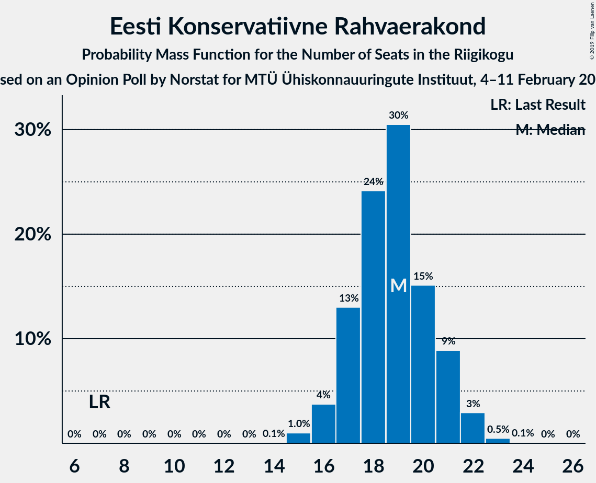
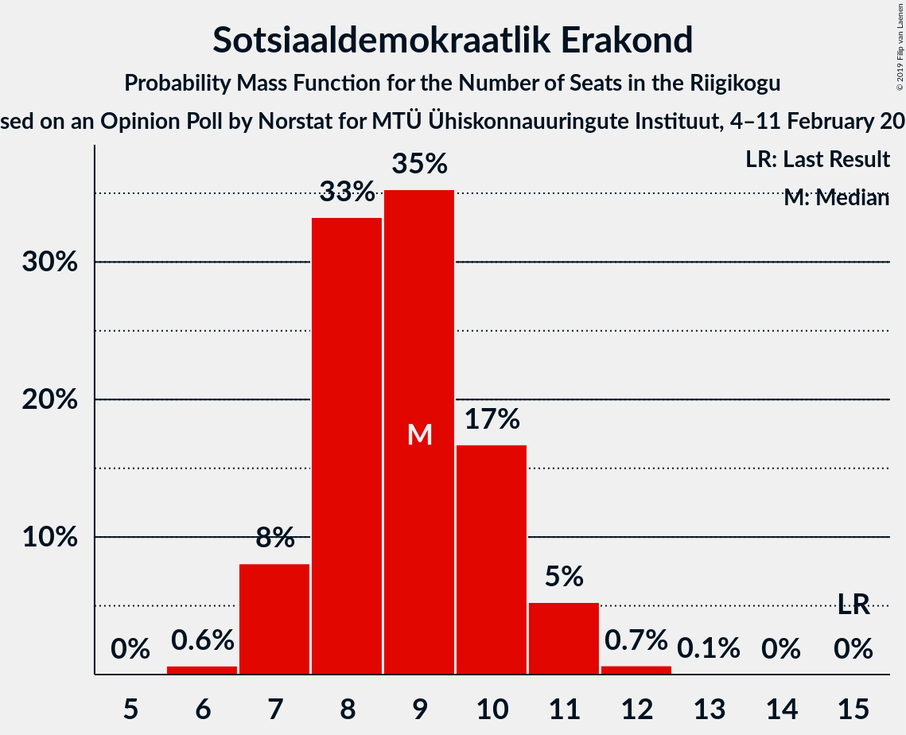
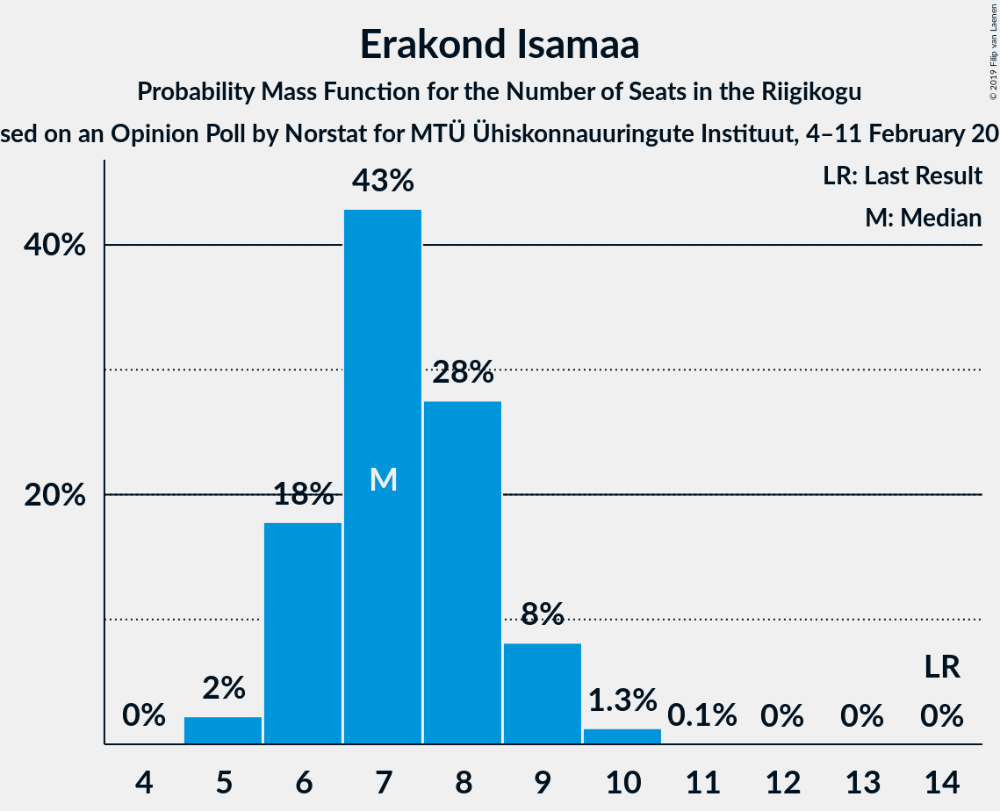

# Opinion Poll by Norstat, 4–11 February 2019

<a href="#voting-intentions">Voting Intentions</a> | <a href="#seats">Seats</a> | <a href="#coalitions">Coalitions</a> | <a href="#technical-information">Technical Information</a>

## Voting Intentions

### Confidence Intervals

| Party | Last Result | Poll Result | 80% Confidence Interval | 90% Confidence Interval | 95% Confidence Interval | 99% Confidence Interval |
|:-----:|:-----------:|:-----------:|:-----------------------:|:-----------------------:|:-----------------------:|:-----------------------:|
| Eesti Reformierakond | 27.7% | 31.0% | 29.2–32.9% |28.7–33.5% |28.2–33.9% |27.3–34.9% |
| Eesti Keskerakond | 24.8% | 27.0% | 25.3–28.9% |24.8–29.4% |24.3–29.8% |23.5–30.7% |
| Eesti Konservatiivne Rahvaerakond | 8.1% | 18.0% | 16.5–19.6% |16.1–20.1% |15.7–20.5% |15.1–21.3% |
| Sotsiaaldemokraatlik Erakond | 15.2% | 9.0% | 7.9–10.3% |7.6–10.6% |7.4–10.9% |6.9–11.6% |
| Erakond Isamaa | 13.7% | 8.0% | 7.0–9.2% |6.7–9.6% |6.5–9.9% |6.0–10.5% |
| Eesti 200 | 0.0% | 3.0% | 2.4–3.8% |2.2–4.1% |2.1–4.3% |1.9–4.7% |
| Erakond Eestimaa Rohelised | 0.9% | 2.0% | 1.5–2.7% |1.4–2.9% |1.3–3.1% |1.1–3.4% |

*Note:* The poll result column reflects the actual value used in the calculations. Published results may vary slightly, and in addition be rounded to fewer digits.

## Seats

### Confidence Intervals

| Party | Last Result | Median | 80% Confidence Interval | 90% Confidence Interval | 95% Confidence Interval | 99% Confidence Interval |
|:-----:|:-----------:|:------:|:-----------------------:|:-----------------------:|:-----------------------:|:-----------------------:|
| <a href="#eesti-reformierakond">Eesti Reformierakond</a> | 30 | 35 | 33–38 |32–38 |32–39 |31–40 |
| <a href="#eesti-keskerakond">Eesti Keskerakond</a> | 27 | 30 | 28–32 |27–33 |27–34 |26–35 |
| <a href="#eesti-konservatiivne-rahvaerakond">Eesti Konservatiivne Rahvaerakond</a> | 7 | 19 | 17–21 |17–22 |16–22 |16–23 |
| <a href="#sotsiaaldemokraatlik-erakond">Sotsiaaldemokraatlik Erakond</a> | 15 | 9 | 7–10 |7–10 |7–11 |6–11 |
| <a href="#erakond-isamaa">Erakond Isamaa</a> | 14 | 7 | 6–9 |6–9 |6–9 |5–10 |
| <a href="#eesti-200">Eesti 200</a> | 0 | 0 | 0 |0 |0 |0 |
| <a href="#erakond-eestimaa-rohelised">Erakond Eestimaa Rohelised</a> | 0 | 0 | 0 |0 |0 |0 |

### Eesti Reformierakond

*For a full overview of the results for this party, see the [Eesti Reformierakond](party-eestireformierakond.html) page.*

| Number of Seats | Probability | Accumulated | Special Marks |
|:---------------:|:-----------:|:-----------:|:-------------:|
| 30 | 0.2% | 100% | Last Result |
| 31 | 1.1% | 99.7% |  |
| 32 | 4% | 98.6% |  |
| 33 | 10% | 95% |  |
| 34 | 16% | 85% |  |
| 35 | 21% | 69% | Median |
| 36 | 22% | 48% |  |
| 37 | 13% | 26% |  |
| 38 | 9% | 13% |  |
| 39 | 3% | 5% |  |
| 40 | 1.1% | 1.3% |  |
| 41 | 0.2% | 0.2% |  |
| 42 | 0% | 0% |  |

### Eesti Keskerakond

*For a full overview of the results for this party, see the [Eesti Keskerakond](party-eestikeskerakond.html) page.*

| Number of Seats | Probability | Accumulated | Special Marks |
|:---------------:|:-----------:|:-----------:|:-------------:|
| 25 | 0.2% | 100% |  |
| 26 | 0.9% | 99.7% |  |
| 27 | 4% | 98.9% | Last Result |
| 28 | 13% | 95% |  |
| 29 | 17% | 82% |  |
| 30 | 18% | 65% | Median |
| 31 | 23% | 47% |  |
| 32 | 17% | 24% |  |
| 33 | 4% | 8% |  |
| 34 | 2% | 3% |  |
| 35 | 0.8% | 0.9% |  |
| 36 | 0.1% | 0.1% |  |
| 37 | 0% | 0% |  |

### Eesti Konservatiivne Rahvaerakond

*For a full overview of the results for this party, see the [Eesti Konservatiivne Rahvaerakond](party-eestikonservatiivnerahvaerakond.html) page.*

| Number of Seats | Probability | Accumulated | Special Marks |
|:---------------:|:-----------:|:-----------:|:-------------:|
| 7 | 0% | 100% | Last Result |
| 8 | 0% | 100% |  |
| 9 | 0% | 100% |  |
| 10 | 0% | 100% |  |
| 11 | 0% | 100% |  |
| 12 | 0% | 100% |  |
| 13 | 0% | 100% |  |
| 14 | 0% | 100% |  |
| 15 | 0.4% | 100% |  |
| 16 | 2% | 99.6% |  |
| 17 | 9% | 97% |  |
| 18 | 19% | 88% |  |
| 19 | 25% | 69% | Median |
| 20 | 24% | 43% |  |
| 21 | 14% | 20% |  |
| 22 | 4% | 6% |  |
| 23 | 1.1% | 1.3% |  |
| 24 | 0.2% | 0.2% |  |
| 25 | 0% | 0% |  |

### Sotsiaaldemokraatlik Erakond

*For a full overview of the results for this party, see the [Sotsiaaldemokraatlik Erakond](party-sotsiaaldemokraatlikerakond.html) page.*

| Number of Seats | Probability | Accumulated | Special Marks |
|:---------------:|:-----------:|:-----------:|:-------------:|
| 6 | 1.2% | 100% |  |
| 7 | 12% | 98.8% |  |
| 8 | 33% | 87% |  |
| 9 | 35% | 54% | Median |
| 10 | 16% | 20% |  |
| 11 | 3% | 4% |  |
| 12 | 0.5% | 0.5% |  |
| 13 | 0% | 0% |  |
| 14 | 0% | 0% |  |
| 15 | 0% | 0% | Last Result |

### Erakond Isamaa

*For a full overview of the results for this party, see the [Erakond Isamaa](party-erakondisamaa.html) page.*

| Number of Seats | Probability | Accumulated | Special Marks |
|:---------------:|:-----------:|:-----------:|:-------------:|
| 5 | 1.0% | 100% |  |
| 6 | 13% | 99.0% |  |
| 7 | 39% | 85% | Median |
| 8 | 32% | 47% |  |
| 9 | 12% | 15% |  |
| 10 | 2% | 2% |  |
| 11 | 0.2% | 0.2% |  |
| 12 | 0% | 0% |  |
| 13 | 0% | 0% |  |
| 14 | 0% | 0% | Last Result |

### Eesti 200

*For a full overview of the results for this party, see the [Eesti 200](party-eesti200.html) page.*

| Number of Seats | Probability | Accumulated | Special Marks |
|:---------------:|:-----------:|:-----------:|:-------------:|
| 0 | 99.9% | 100% | Last Result, Median |
| 1 | 0% | 0.1% |  |
| 2 | 0% | 0.1% |  |
| 3 | 0% | 0.1% |  |
| 4 | 0.1% | 0.1% |  |
| 5 | 0% | 0% |  |

### Erakond Eestimaa Rohelised

*For a full overview of the results for this party, see the [Erakond Eestimaa Rohelised](party-erakondeestimaarohelised.html) page.*

| Number of Seats | Probability | Accumulated | Special Marks |
|:---------------:|:-----------:|:-----------:|:-------------:|
| 0 | 100% | 100% | Last Result, Median |

## Coalitions

### Confidence Intervals

| Coalition | Last Result | Median | Majority? | 80% Confidence Interval | 90% Confidence Interval | 95% Confidence Interval | 99% Confidence Interval |
|:---------:|:-----------:|:------:|:---------:|:-----------------------:|:-----------------------:|:-----------------------:|:-----------------------:|
| Eesti Reformierakond – Eesti Keskerakond – Eesti Konservatiivne Rahvaerakond | 64 | 85 | 100% | 83–87 | 83–87 | 82–87 | 81–88 |
| Eesti Reformierakond – Eesti Keskerakond | 57 | 66 | 100% | 63–68 | 63–69 | 62–69 | 61–70 |
| Eesti Reformierakond – Eesti Konservatiivne Rahvaerakond – Erakond Isamaa | 51 | 62 | 100% | 60–65 | 59–65 | 58–66 | 57–67 |
| Eesti Reformierakond – Eesti Konservatiivne Rahvaerakond | 37 | 55 | 98% | 52–57 | 52–58 | 51–58 | 50–59 |
| Eesti Reformierakond – Sotsiaaldemokraatlik Erakond – Erakond Isamaa | 59 | 51 | 69% | 49–54 | 48–55 | 48–55 | 47–56 |
| Eesti Keskerakond – Eesti Konservatiivne Rahvaerakond | 34 | 50 | 31% | 47–52 | 46–53 | 46–53 | 45–54 |
| Eesti Keskerakond – Sotsiaaldemokraatlik Erakond – Erakond Isamaa | 56 | 46 | 2% | 44–49 | 43–49 | 43–50 | 42–51 |
| Eesti Reformierakond – Sotsiaaldemokraatlik Erakond | 45 | 44 | 0% | 42–46 | 41–47 | 40–48 | 39–49 |
| Eesti Reformierakond – Erakond Isamaa | 44 | 43 | 0% | 40–45 | 40–46 | 39–47 | 38–48 |
| Eesti Keskerakond – Sotsiaaldemokraatlik Erakond | 42 | 39 | 0% | 36–41 | 36–42 | 35–43 | 34–44 |
| Eesti Konservatiivne Rahvaerakond – Sotsiaaldemokraatlik Erakond | 22 | 28 | 0% | 26–30 | 25–31 | 25–31 | 24–32 |

### Eesti Reformierakond – Eesti Keskerakond – Eesti Konservatiivne Rahvaerakond

| Number of Seats | Probability | Accumulated | Special Marks |
|:---------------:|:-----------:|:-----------:|:-------------:|
| 64 | 0% | 100% | Last Result |
| 65 | 0% | 100% |  |
| 66 | 0% | 100% |  |
| 67 | 0% | 100% |  |
| 68 | 0% | 100% |  |
| 69 | 0% | 100% |  |
| 70 | 0% | 100% |  |
| 71 | 0% | 100% |  |
| 72 | 0% | 100% |  |
| 73 | 0% | 100% |  |
| 74 | 0% | 100% |  |
| 75 | 0% | 100% |  |
| 76 | 0% | 100% |  |
| 77 | 0% | 100% |  |
| 78 | 0% | 100% |  |
| 79 | 0% | 100% |  |
| 80 | 0.2% | 100% |  |
| 81 | 0.8% | 99.8% |  |
| 82 | 4% | 99.0% |  |
| 83 | 13% | 95% |  |
| 84 | 20% | 83% | Median |
| 85 | 28% | 62% |  |
| 86 | 24% | 35% |  |
| 87 | 9% | 11% |  |
| 88 | 2% | 2% |  |
| 89 | 0.2% | 0.2% |  |
| 90 | 0% | 0% |  |

### Eesti Reformierakond – Eesti Keskerakond

| Number of Seats | Probability | Accumulated | Special Marks |
|:---------------:|:-----------:|:-----------:|:-------------:|
| 57 | 0% | 100% | Last Result |
| 58 | 0% | 100% |  |
| 59 | 0% | 100% |  |
| 60 | 0.2% | 100% |  |
| 61 | 1.0% | 99.8% |  |
| 62 | 2% | 98.8% |  |
| 63 | 8% | 96% |  |
| 64 | 15% | 88% |  |
| 65 | 20% | 73% | Median |
| 66 | 21% | 53% |  |
| 67 | 16% | 32% |  |
| 68 | 10% | 15% |  |
| 69 | 4% | 5% |  |
| 70 | 1.2% | 1.5% |  |
| 71 | 0.2% | 0.3% |  |
| 72 | 0% | 0% |  |

### Eesti Reformierakond – Eesti Konservatiivne Rahvaerakond – Erakond Isamaa

| Number of Seats | Probability | Accumulated | Special Marks |
|:---------------:|:-----------:|:-----------:|:-------------:|
| 51 | 0% | 100% | Last Result, Majority |
| 52 | 0% | 100% |  |
| 53 | 0% | 100% |  |
| 54 | 0% | 100% |  |
| 55 | 0% | 100% |  |
| 56 | 0.1% | 100% |  |
| 57 | 0.7% | 99.9% |  |
| 58 | 2% | 99.2% |  |
| 59 | 4% | 97% |  |
| 60 | 11% | 94% |  |
| 61 | 21% | 82% | Median |
| 62 | 20% | 61% |  |
| 63 | 15% | 41% |  |
| 64 | 15% | 25% |  |
| 65 | 8% | 10% |  |
| 66 | 2% | 3% |  |
| 67 | 0.5% | 0.7% |  |
| 68 | 0.2% | 0.2% |  |
| 69 | 0% | 0% |  |

### Eesti Reformierakond – Eesti Konservatiivne Rahvaerakond

| Number of Seats | Probability | Accumulated | Special Marks |
|:---------------:|:-----------:|:-----------:|:-------------:|
| 37 | 0% | 100% | Last Result |
| 38 | 0% | 100% |  |
| 39 | 0% | 100% |  |
| 40 | 0% | 100% |  |
| 41 | 0% | 100% |  |
| 42 | 0% | 100% |  |
| 43 | 0% | 100% |  |
| 44 | 0% | 100% |  |
| 45 | 0% | 100% |  |
| 46 | 0% | 100% |  |
| 47 | 0% | 100% |  |
| 48 | 0.1% | 100% |  |
| 49 | 0.3% | 99.9% |  |
| 50 | 1.1% | 99.6% |  |
| 51 | 3% | 98% | Majority |
| 52 | 8% | 95% |  |
| 53 | 15% | 88% |  |
| 54 | 20% | 73% | Median |
| 55 | 20% | 53% |  |
| 56 | 17% | 33% |  |
| 57 | 10% | 16% |  |
| 58 | 4% | 6% |  |
| 59 | 1.3% | 2% |  |
| 60 | 0.3% | 0.3% |  |
| 61 | 0.1% | 0.1% |  |
| 62 | 0% | 0% |  |

### Eesti Reformierakond – Sotsiaaldemokraatlik Erakond – Erakond Isamaa

| Number of Seats | Probability | Accumulated | Special Marks |
|:---------------:|:-----------:|:-----------:|:-------------:|
| 45 | 0.1% | 100% |  |
| 46 | 0.3% | 99.9% |  |
| 47 | 1.4% | 99.6% |  |
| 48 | 3% | 98% |  |
| 49 | 9% | 95% |  |
| 50 | 16% | 85% |  |
| 51 | 20% | 69% | Median, Majority |
| 52 | 17% | 49% |  |
| 53 | 16% | 32% |  |
| 54 | 10% | 16% |  |
| 55 | 4% | 6% |  |
| 56 | 1.4% | 2% |  |
| 57 | 0.3% | 0.4% |  |
| 58 | 0.1% | 0.1% |  |
| 59 | 0% | 0% | Last Result |

### Eesti Keskerakond – Eesti Konservatiivne Rahvaerakond

| Number of Seats | Probability | Accumulated | Special Marks |
|:---------------:|:-----------:|:-----------:|:-------------:|
| 34 | 0% | 100% | Last Result |
| 35 | 0% | 100% |  |
| 36 | 0% | 100% |  |
| 37 | 0% | 100% |  |
| 38 | 0% | 100% |  |
| 39 | 0% | 100% |  |
| 40 | 0% | 100% |  |
| 41 | 0% | 100% |  |
| 42 | 0% | 100% |  |
| 43 | 0.1% | 100% |  |
| 44 | 0.3% | 99.9% |  |
| 45 | 1.4% | 99.6% |  |
| 46 | 4% | 98% |  |
| 47 | 10% | 94% |  |
| 48 | 16% | 84% |  |
| 49 | 17% | 67% | Median |
| 50 | 20% | 51% |  |
| 51 | 16% | 31% | Majority |
| 52 | 9% | 15% |  |
| 53 | 3% | 5% |  |
| 54 | 1.4% | 2% |  |
| 55 | 0.3% | 0.4% |  |
| 56 | 0.1% | 0.1% |  |
| 57 | 0% | 0% |  |

### Eesti Keskerakond – Sotsiaaldemokraatlik Erakond – Erakond Isamaa

| Number of Seats | Probability | Accumulated | Special Marks |
|:---------------:|:-----------:|:-----------:|:-------------:|
| 40 | 0.1% | 100% |  |
| 41 | 0.3% | 99.9% |  |
| 42 | 1.3% | 99.6% |  |
| 43 | 4% | 98% |  |
| 44 | 10% | 94% |  |
| 45 | 17% | 84% |  |
| 46 | 20% | 67% | Median |
| 47 | 20% | 47% |  |
| 48 | 15% | 27% |  |
| 49 | 8% | 12% |  |
| 50 | 3% | 5% |  |
| 51 | 1.1% | 2% | Majority |
| 52 | 0.3% | 0.4% |  |
| 53 | 0.1% | 0.1% |  |
| 54 | 0% | 0% |  |
| 55 | 0% | 0% |  |
| 56 | 0% | 0% | Last Result |

### Eesti Reformierakond – Sotsiaaldemokraatlik Erakond

| Number of Seats | Probability | Accumulated | Special Marks |
|:---------------:|:-----------:|:-----------:|:-------------:|
| 38 | 0.2% | 100% |  |
| 39 | 0.6% | 99.8% |  |
| 40 | 2% | 99.2% |  |
| 41 | 6% | 97% |  |
| 42 | 13% | 91% |  |
| 43 | 17% | 79% |  |
| 44 | 21% | 61% | Median |
| 45 | 18% | 41% | Last Result |
| 46 | 14% | 23% |  |
| 47 | 5% | 9% |  |
| 48 | 3% | 4% |  |
| 49 | 0.7% | 0.9% |  |
| 50 | 0.2% | 0.2% |  |
| 51 | 0% | 0% | Majority |

### Eesti Reformierakond – Erakond Isamaa

| Number of Seats | Probability | Accumulated | Special Marks |
|:---------------:|:-----------:|:-----------:|:-------------:|
| 37 | 0.1% | 100% |  |
| 38 | 0.8% | 99.8% |  |
| 39 | 3% | 99.0% |  |
| 40 | 7% | 96% |  |
| 41 | 12% | 89% |  |
| 42 | 18% | 77% | Median |
| 43 | 23% | 59% |  |
| 44 | 16% | 36% | Last Result |
| 45 | 10% | 20% |  |
| 46 | 6% | 9% |  |
| 47 | 3% | 3% |  |
| 48 | 0.5% | 0.6% |  |
| 49 | 0.1% | 0.1% |  |
| 50 | 0% | 0% |  |

### Eesti Keskerakond – Sotsiaaldemokraatlik Erakond

| Number of Seats | Probability | Accumulated | Special Marks |
|:---------------:|:-----------:|:-----------:|:-------------:|
| 33 | 0.2% | 100% |  |
| 34 | 0.5% | 99.8% |  |
| 35 | 2% | 99.3% |  |
| 36 | 8% | 97% |  |
| 37 | 15% | 89% |  |
| 38 | 15% | 75% |  |
| 39 | 20% | 59% | Median |
| 40 | 21% | 39% |  |
| 41 | 11% | 18% |  |
| 42 | 4% | 6% | Last Result |
| 43 | 2% | 3% |  |
| 44 | 0.7% | 0.8% |  |
| 45 | 0.1% | 0.1% |  |
| 46 | 0% | 0% |  |

### Eesti Konservatiivne Rahvaerakond – Sotsiaaldemokraatlik Erakond

| Number of Seats | Probability | Accumulated | Special Marks |
|:---------------:|:-----------:|:-----------:|:-------------:|
| 22 | 0% | 100% | Last Result |
| 23 | 0.3% | 100% |  |
| 24 | 2% | 99.7% |  |
| 25 | 6% | 98% |  |
| 26 | 14% | 92% |  |
| 27 | 19% | 79% |  |
| 28 | 23% | 60% | Median |
| 29 | 21% | 37% |  |
| 30 | 10% | 16% |  |
| 31 | 4% | 6% |  |
| 32 | 1.3% | 2% |  |
| 33 | 0.3% | 0.3% |  |
| 34 | 0% | 0.1% |  |
| 35 | 0% | 0% |  |

## Technical Information

### Opinion Poll

+ **Polling firm:** Norstat
+ **Commissioner(s):** —
+ **Fieldwork period:** 4–11 February 2019

### Calculations

+ **Sample size:** 1000
+ **Simulations done:** 1,048,576
+ **Error estimate:** 1.75%

