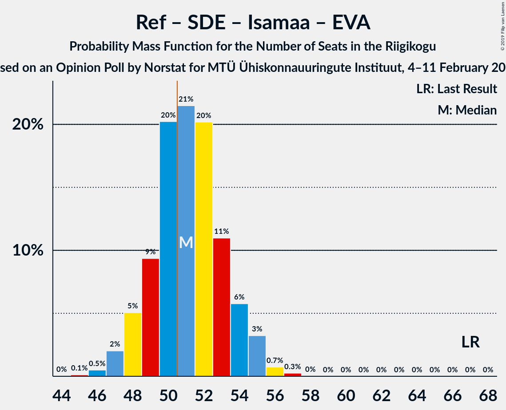

# Opinion Poll by Norstat for MTÜ Ühiskonnauuringute Instituut, 4–11 February 2019

<a href="#voting-intentions">Voting Intentions</a> | <a href="#seats">Seats</a> | <a href="#coalitions">Coalitions</a> | <a href="#technical-information">Technical Information</a>

## Voting Intentions

### Confidence Intervals

| Party | Last Result | Poll Result | 80% Confidence Interval | 90% Confidence Interval | 95% Confidence Interval | 99% Confidence Interval |
|:-----:|:-----------:|:-----------:|:-----------------------:|:-----------------------:|:-----------------------:|:-----------------------:|
| Eesti Reformierakond | 27.7% | 30.6% | 28.8–32.5% |28.3–33.1% |27.8–33.5% |27.0–34.5% |
| Eesti Keskerakond | 24.8% | 27.4% | 25.6–29.3% |25.1–29.8% |24.7–30.3% |23.9–31.2% |
| Eesti Konservatiivne Rahvaerakond | 8.1% | 17.6% | 16.1–19.2% |15.7–19.7% |15.4–20.1% |14.7–20.9% |
| Sotsiaaldemokraatlik Erakond | 15.2% | 9.1% | 8.0–10.4% |7.7–10.7% |7.5–11.1% |7.0–11.7% |
| Erakond Isamaa | 13.7% | 7.7% | 6.7–8.9% |6.4–9.2% |6.2–9.5% |5.8–10.1% |
| Eesti 200 | 0.0% | 2.6% | 2.1–3.4% |1.9–3.6% |1.8–3.8% |1.6–4.2% |
| Erakond Eestimaa Rohelised | 0.9% | 2.1% | 1.6–2.8% |1.5–3.0% |1.4–3.2% |1.2–3.6% |
| Eesti Vabaerakond | 8.7% | 1.3% | 0.9–1.9% |0.8–2.1% |0.8–2.2% |0.6–2.5% |

*Note:* The poll result column reflects the actual value used in the calculations. Published results may vary slightly, and in addition be rounded to fewer digits.

## Seats

### Confidence Intervals

| Party | Last Result | Median | 80% Confidence Interval | 90% Confidence Interval | 95% Confidence Interval | 99% Confidence Interval |
|:-----:|:-----------:|:------:|:-----------------------:|:-----------------------:|:-----------------------:|:-----------------------:|
| <a href="#eesti-reformierakond">Eesti Reformierakond</a> | 30 | 33 | 33–39 |33–39 |31–39 |31–39 |
| <a href="#eesti-keskerakond">Eesti Keskerakond</a> | 27 | 36 | 28–36 |28–36 |28–36 |28–36 |
| <a href="#eesti-konservatiivne-rahvaerakond">Eesti Konservatiivne Rahvaerakond</a> | 7 | 15 | 15–23 |15–23 |15–23 |15–23 |
| <a href="#sotsiaaldemokraatlik-erakond">Sotsiaaldemokraatlik Erakond</a> | 15 | 9 | 8–10 |8–10 |7–10 |7–12 |
| <a href="#erakond-isamaa">Erakond Isamaa</a> | 14 | 8 | 7–8 |6–8 |6–9 |5–10 |
| <a href="#eesti-200">Eesti 200</a> | 0 | 0 | 0 |0 |0 |0 |
| <a href="#erakond-eestimaa-rohelised">Erakond Eestimaa Rohelised</a> | 0 | 0 | 0 |0 |0 |0 |
| <a href="#eesti-vabaerakond">Eesti Vabaerakond</a> | 8 | 0 | 0 |0 |0 |0 |

### Eesti Reformierakond

*For a full overview of the results for this party, see the [Eesti Reformierakond](party-eestireformierakond.html) page.*

| Number of Seats | Probability | Accumulated | Special Marks |
|:---------------:|:-----------:|:-----------:|:-------------:|
| 28 | 0.2% | 100% |  |
| 29 | 0.3% | 99.8% |  |
| 30 | 0% | 99.6% | Last Result |
| 31 | 3% | 99.6% |  |
| 32 | 0.7% | 97% |  |
| 33 | 51% | 96% | Median |
| 34 | 19% | 45% |  |
| 35 | 5% | 26% |  |
| 36 | 2% | 21% |  |
| 37 | 1.1% | 19% |  |
| 38 | 1.0% | 18% |  |
| 39 | 17% | 17% |  |
| 40 | 0% | 0.1% |  |
| 41 | 0.1% | 0.1% |  |
| 42 | 0% | 0% |  |

### Eesti Keskerakond

*For a full overview of the results for this party, see the [Eesti Keskerakond](party-eestikeskerakond.html) page.*

| Number of Seats | Probability | Accumulated | Special Marks |
|:---------------:|:-----------:|:-----------:|:-------------:|
| 25 | 0.3% | 100% |  |
| 26 | 0% | 99.7% |  |
| 27 | 0% | 99.7% | Last Result |
| 28 | 34% | 99.7% |  |
| 29 | 2% | 66% |  |
| 30 | 0.2% | 64% |  |
| 31 | 2% | 64% |  |
| 32 | 5% | 62% |  |
| 33 | 0.6% | 56% |  |
| 34 | 0.2% | 56% |  |
| 35 | 0% | 56% |  |
| 36 | 56% | 56% | Median |
| 37 | 0% | 0.1% |  |
| 38 | 0.1% | 0.1% |  |
| 39 | 0% | 0% |  |

### Eesti Konservatiivne Rahvaerakond

*For a full overview of the results for this party, see the [Eesti Konservatiivne Rahvaerakond](party-eestikonservatiivnerahvaerakond.html) page.*

| Number of Seats | Probability | Accumulated | Special Marks |
|:---------------:|:-----------:|:-----------:|:-------------:|
| 7 | 0% | 100% | Last Result |
| 8 | 0% | 100% |  |
| 9 | 0% | 100% |  |
| 10 | 0% | 100% |  |
| 11 | 0% | 100% |  |
| 12 | 0% | 100% |  |
| 13 | 0% | 100% |  |
| 14 | 0.1% | 100% |  |
| 15 | 50% | 99.9% | Median |
| 16 | 6% | 49% |  |
| 17 | 17% | 43% |  |
| 18 | 2% | 26% |  |
| 19 | 2% | 24% |  |
| 20 | 2% | 22% |  |
| 21 | 0.7% | 20% |  |
| 22 | 3% | 19% |  |
| 23 | 16% | 17% |  |
| 24 | 0.4% | 0.4% |  |
| 25 | 0% | 0% |  |

### Sotsiaaldemokraatlik Erakond

*For a full overview of the results for this party, see the [Sotsiaaldemokraatlik Erakond](party-sotsiaaldemokraatlikerakond.html) page.*

| Number of Seats | Probability | Accumulated | Special Marks |
|:---------------:|:-----------:|:-----------:|:-------------:|
| 6 | 0.2% | 100% |  |
| 7 | 3% | 99.8% |  |
| 8 | 24% | 97% |  |
| 9 | 52% | 73% | Median |
| 10 | 19% | 22% |  |
| 11 | 1.1% | 2% |  |
| 12 | 0.7% | 1.0% |  |
| 13 | 0.2% | 0.3% |  |
| 14 | 0% | 0% |  |
| 15 | 0% | 0% | Last Result |

### Erakond Isamaa

*For a full overview of the results for this party, see the [Erakond Isamaa](party-erakondisamaa.html) page.*

| Number of Seats | Probability | Accumulated | Special Marks |
|:---------------:|:-----------:|:-----------:|:-------------:|
| 5 | 1.1% | 100% |  |
| 6 | 8% | 98.9% |  |
| 7 | 18% | 90% |  |
| 8 | 69% | 73% | Median |
| 9 | 2% | 3% |  |
| 10 | 0.9% | 1.1% |  |
| 11 | 0.2% | 0.2% |  |
| 12 | 0% | 0% |  |
| 13 | 0% | 0% |  |
| 14 | 0% | 0% | Last Result |

### Eesti 200

*For a full overview of the results for this party, see the [Eesti 200](party-eesti200.html) page.*

| Number of Seats | Probability | Accumulated | Special Marks |
|:---------------:|:-----------:|:-----------:|:-------------:|
| 0 | 100% | 100% | Last Result, Median |

### Erakond Eestimaa Rohelised

*For a full overview of the results for this party, see the [Erakond Eestimaa Rohelised](party-erakondeestimaarohelised.html) page.*

| Number of Seats | Probability | Accumulated | Special Marks |
|:---------------:|:-----------:|:-----------:|:-------------:|
| 0 | 100% | 100% | Last Result, Median |

### Eesti Vabaerakond

*For a full overview of the results for this party, see the [Eesti Vabaerakond](party-eestivabaerakond.html) page.*

| Number of Seats | Probability | Accumulated | Special Marks |
|:---------------:|:-----------:|:-----------:|:-------------:|
| 0 | 100% | 100% | Median |
| 1 | 0% | 0% |  |
| 2 | 0% | 0% |  |
| 3 | 0% | 0% |  |
| 4 | 0% | 0% |  |
| 5 | 0% | 0% |  |
| 6 | 0% | 0% |  |
| 7 | 0% | 0% |  |
| 8 | 0% | 0% | Last Result |

## Coalitions

### Confidence Intervals

| Coalition | Last Result | Median | Majority? | 80% Confidence Interval | 90% Confidence Interval | 95% Confidence Interval | 99% Confidence Interval |
|:---------:|:-----------:|:------:|:---------:|:-----------------------:|:-----------------------:|:-----------------------:|:-----------------------:|
| Eesti Reformierakond – Eesti Keskerakond – Eesti Konservatiivne Rahvaerakond | 64 | 84 | 100% | 84–85 | 84–87 | 83–87 | 81–88 |
| Eesti Reformierakond – Eesti Keskerakond | 57 | 69 | 100% | 62–69 | 62–71 | 62–71 | 61–71 |
| Eesti Reformierakond – Eesti Konservatiivne Rahvaerakond – Erakond Isamaa | 51 | 56 | 100% | 56–65 | 56–65 | 56–65 | 56–66 |
| Eesti Reformierakond – Eesti Konservatiivne Rahvaerakond | 37 | 48 | 48% | 48–57 | 48–57 | 48–57 | 48–59 |
| Eesti Reformierakond – Sotsiaaldemokraatlik Erakond – Erakond Isamaa – Eesti Vabaerakond | 67 | 50 | 21% | 50–56 | 49–56 | 47–56 | 47–56 |
| Eesti Reformierakond – Sotsiaaldemokraatlik Erakond – Erakond Isamaa | 59 | 50 | 21% | 50–56 | 49–56 | 47–56 | 47–56 |
| Eesti Keskerakond – Eesti Konservatiivne Rahvaerakond | 34 | 51 | 79% | 45–51 | 45–52 | 45–54 | 45–54 |
| Eesti Keskerakond – Sotsiaaldemokraatlik Erakond – Erakond Isamaa | 56 | 53 | 52% | 44–53 | 44–53 | 44–53 | 42–53 |
| Eesti Reformierakond – Sotsiaaldemokraatlik Erakond | 45 | 42 | 0% | 42–49 | 42–49 | 41–49 | 40–49 |
| Eesti Reformierakond – Erakond Isamaa | 44 | 41 | 0% | 41–46 | 41–46 | 37–46 | 37–47 |
| Eesti Keskerakond – Sotsiaaldemokraatlik Erakond | 42 | 45 | 0% | 36–45 | 36–45 | 36–45 | 35–45 |
| Eesti Konservatiivne Rahvaerakond – Sotsiaaldemokraatlik Erakond | 22 | 24 | 0% | 24–31 | 24–31 | 24–32 | 24–32 |

### Eesti Reformierakond – Eesti Keskerakond – Eesti Konservatiivne Rahvaerakond

| Number of Seats | Probability | Accumulated | Special Marks |
|:---------------:|:-----------:|:-----------:|:-------------:|
| 64 | 0% | 100% | Last Result |
| 65 | 0% | 100% |  |
| 66 | 0% | 100% |  |
| 67 | 0% | 100% |  |
| 68 | 0% | 100% |  |
| 69 | 0% | 100% |  |
| 70 | 0% | 100% |  |
| 71 | 0% | 100% |  |
| 72 | 0% | 100% |  |
| 73 | 0% | 100% |  |
| 74 | 0% | 100% |  |
| 75 | 0% | 100% |  |
| 76 | 0% | 100% |  |
| 77 | 0% | 100% |  |
| 78 | 0% | 100% |  |
| 79 | 0.4% | 100% |  |
| 80 | 0% | 99.6% |  |
| 81 | 0.4% | 99.6% |  |
| 82 | 2% | 99.2% |  |
| 83 | 0.4% | 98% |  |
| 84 | 68% | 97% | Median |
| 85 | 22% | 29% |  |
| 86 | 0.1% | 7% |  |
| 87 | 5% | 7% |  |
| 88 | 2% | 2% |  |
| 89 | 0% | 0% |  |

### Eesti Reformierakond – Eesti Keskerakond

| Number of Seats | Probability | Accumulated | Special Marks |
|:---------------:|:-----------:|:-----------:|:-------------:|
| 57 | 0% | 100% | Last Result |
| 58 | 0% | 100% |  |
| 59 | 0% | 100% |  |
| 60 | 0.2% | 100% |  |
| 61 | 0.7% | 99.8% |  |
| 62 | 17% | 99.1% |  |
| 63 | 2% | 82% |  |
| 64 | 0.8% | 80% |  |
| 65 | 0% | 79% |  |
| 66 | 3% | 79% |  |
| 67 | 19% | 76% |  |
| 68 | 1.4% | 57% |  |
| 69 | 51% | 56% | Median |
| 70 | 0% | 5% |  |
| 71 | 5% | 5% |  |
| 72 | 0% | 0% |  |

### Eesti Reformierakond – Eesti Konservatiivne Rahvaerakond – Erakond Isamaa

| Number of Seats | Probability | Accumulated | Special Marks |
|:---------------:|:-----------:|:-----------:|:-------------:|
| 51 | 0% | 100% | Last Result, Majority |
| 52 | 0% | 100% |  |
| 53 | 0% | 100% |  |
| 54 | 0% | 100% |  |
| 55 | 0% | 100% |  |
| 56 | 51% | 99.9% | Median |
| 57 | 6% | 49% |  |
| 58 | 0.5% | 44% |  |
| 59 | 3% | 43% |  |
| 60 | 0.6% | 41% |  |
| 61 | 3% | 40% |  |
| 62 | 1.2% | 37% |  |
| 63 | 19% | 36% |  |
| 64 | 0.3% | 17% |  |
| 65 | 16% | 17% |  |
| 66 | 0.4% | 0.7% |  |
| 67 | 0.3% | 0.3% |  |
| 68 | 0% | 0% |  |

### Eesti Reformierakond – Eesti Konservatiivne Rahvaerakond

| Number of Seats | Probability | Accumulated | Special Marks |
|:---------------:|:-----------:|:-----------:|:-------------:|
| 37 | 0% | 100% | Last Result |
| 38 | 0% | 100% |  |
| 39 | 0% | 100% |  |
| 40 | 0% | 100% |  |
| 41 | 0% | 100% |  |
| 42 | 0% | 100% |  |
| 43 | 0% | 100% |  |
| 44 | 0% | 100% |  |
| 45 | 0% | 100% |  |
| 46 | 0.1% | 100% |  |
| 47 | 0% | 99.9% |  |
| 48 | 50% | 99.9% | Median |
| 49 | 0.4% | 49% |  |
| 50 | 1.0% | 49% |  |
| 51 | 5% | 48% | Majority |
| 52 | 0.7% | 43% |  |
| 53 | 4% | 42% |  |
| 54 | 2% | 38% |  |
| 55 | 0.8% | 36% |  |
| 56 | 17% | 35% |  |
| 57 | 17% | 18% |  |
| 58 | 0% | 0.6% |  |
| 59 | 0.1% | 0.6% |  |
| 60 | 0.4% | 0.4% |  |
| 61 | 0% | 0% |  |

### Eesti Reformierakond – Sotsiaaldemokraatlik Erakond – Erakond Isamaa – Eesti Vabaerakond

| Number of Seats | Probability | Accumulated | Special Marks |
|:---------------:|:-----------:|:-----------:|:-------------:|
| 44 | 0.2% | 100% |  |
| 45 | 0% | 99.8% |  |
| 46 | 0.1% | 99.8% |  |
| 47 | 2% | 99.7% |  |
| 48 | 0.6% | 97% |  |
| 49 | 6% | 97% |  |
| 50 | 69% | 90% | Median |
| 51 | 0.5% | 21% | Majority |
| 52 | 2% | 21% |  |
| 53 | 0.4% | 19% |  |
| 54 | 0.6% | 19% |  |
| 55 | 0.8% | 18% |  |
| 56 | 17% | 17% |  |
| 57 | 0.5% | 0.5% |  |
| 58 | 0% | 0% |  |
| 59 | 0% | 0% |  |
| 60 | 0% | 0% |  |
| 61 | 0% | 0% |  |
| 62 | 0% | 0% |  |
| 63 | 0% | 0% |  |
| 64 | 0% | 0% |  |
| 65 | 0% | 0% |  |
| 66 | 0% | 0% |  |
| 67 | 0% | 0% | Last Result |

### Eesti Reformierakond – Sotsiaaldemokraatlik Erakond – Erakond Isamaa

| Number of Seats | Probability | Accumulated | Special Marks |
|:---------------:|:-----------:|:-----------:|:-------------:|
| 44 | 0.2% | 100% |  |
| 45 | 0% | 99.8% |  |
| 46 | 0.1% | 99.8% |  |
| 47 | 2% | 99.7% |  |
| 48 | 0.6% | 97% |  |
| 49 | 6% | 97% |  |
| 50 | 69% | 90% | Median |
| 51 | 0.5% | 21% | Majority |
| 52 | 2% | 21% |  |
| 53 | 0.4% | 19% |  |
| 54 | 0.6% | 19% |  |
| 55 | 0.8% | 18% |  |
| 56 | 17% | 17% |  |
| 57 | 0.5% | 0.5% |  |
| 58 | 0% | 0% |  |
| 59 | 0% | 0% | Last Result |

### Eesti Keskerakond – Eesti Konservatiivne Rahvaerakond

| Number of Seats | Probability | Accumulated | Special Marks |
|:---------------:|:-----------:|:-----------:|:-------------:|
| 34 | 0% | 100% | Last Result |
| 35 | 0% | 100% |  |
| 36 | 0% | 100% |  |
| 37 | 0% | 100% |  |
| 38 | 0% | 100% |  |
| 39 | 0% | 100% |  |
| 40 | 0% | 100% |  |
| 41 | 0% | 100% |  |
| 42 | 0% | 100% |  |
| 43 | 0% | 100% |  |
| 44 | 0.5% | 100% |  |
| 45 | 17% | 99.5% |  |
| 46 | 0.8% | 83% |  |
| 47 | 0.6% | 82% |  |
| 48 | 0.4% | 81% |  |
| 49 | 2% | 81% |  |
| 50 | 0.5% | 79% |  |
| 51 | 69% | 79% | Median, Majority |
| 52 | 6% | 10% |  |
| 53 | 0.6% | 3% |  |
| 54 | 2% | 3% |  |
| 55 | 0.1% | 0.3% |  |
| 56 | 0% | 0.2% |  |
| 57 | 0.2% | 0.2% |  |
| 58 | 0% | 0% |  |

### Eesti Keskerakond – Sotsiaaldemokraatlik Erakond – Erakond Isamaa

| Number of Seats | Probability | Accumulated | Special Marks |
|:---------------:|:-----------:|:-----------:|:-------------:|
| 41 | 0.4% | 100% |  |
| 42 | 0.1% | 99.6% |  |
| 43 | 0% | 99.4% |  |
| 44 | 17% | 99.4% |  |
| 45 | 17% | 82% |  |
| 46 | 0.8% | 65% |  |
| 47 | 2% | 64% |  |
| 48 | 4% | 62% |  |
| 49 | 0.7% | 58% |  |
| 50 | 5% | 57% |  |
| 51 | 1.0% | 52% | Majority |
| 52 | 0.4% | 51% |  |
| 53 | 50% | 51% | Median |
| 54 | 0% | 0.1% |  |
| 55 | 0.1% | 0.1% |  |
| 56 | 0% | 0% | Last Result |

### Eesti Reformierakond – Sotsiaaldemokraatlik Erakond

| Number of Seats | Probability | Accumulated | Special Marks |
|:---------------:|:-----------:|:-----------:|:-------------:|
| 35 | 0.2% | 100% |  |
| 36 | 0% | 99.8% |  |
| 37 | 0% | 99.8% |  |
| 38 | 0% | 99.8% |  |
| 39 | 0.3% | 99.8% |  |
| 40 | 0.8% | 99.6% |  |
| 41 | 3% | 98.8% |  |
| 42 | 68% | 96% | Median |
| 43 | 7% | 28% |  |
| 44 | 0.6% | 20% |  |
| 45 | 1.3% | 20% | Last Result |
| 46 | 0.6% | 19% |  |
| 47 | 0.7% | 18% |  |
| 48 | 0.6% | 17% |  |
| 49 | 17% | 17% |  |
| 50 | 0.2% | 0.2% |  |
| 51 | 0% | 0% | Majority |

### Eesti Reformierakond – Erakond Isamaa

| Number of Seats | Probability | Accumulated | Special Marks |
|:---------------:|:-----------:|:-----------:|:-------------:|
| 36 | 0.1% | 100% |  |
| 37 | 3% | 99.9% |  |
| 38 | 0.2% | 97% |  |
| 39 | 0% | 97% |  |
| 40 | 0.3% | 97% |  |
| 41 | 57% | 97% | Median |
| 42 | 21% | 40% |  |
| 43 | 0% | 19% |  |
| 44 | 0.1% | 19% | Last Result |
| 45 | 1.2% | 19% |  |
| 46 | 17% | 18% |  |
| 47 | 0.7% | 0.7% |  |
| 48 | 0% | 0% |  |

### Eesti Keskerakond – Sotsiaaldemokraatlik Erakond

| Number of Seats | Probability | Accumulated | Special Marks |
|:---------------:|:-----------:|:-----------:|:-------------:|
| 34 | 0.3% | 100% |  |
| 35 | 0.4% | 99.7% |  |
| 36 | 16% | 99.3% |  |
| 37 | 0.3% | 83% |  |
| 38 | 19% | 83% |  |
| 39 | 1.2% | 64% |  |
| 40 | 3% | 63% |  |
| 41 | 0.6% | 60% |  |
| 42 | 3% | 59% | Last Result |
| 43 | 0.5% | 57% |  |
| 44 | 6% | 56% |  |
| 45 | 51% | 51% | Median |
| 46 | 0% | 0.1% |  |
| 47 | 0% | 0% |  |

### Eesti Konservatiivne Rahvaerakond – Sotsiaaldemokraatlik Erakond

| Number of Seats | Probability | Accumulated | Special Marks |
|:---------------:|:-----------:|:-----------:|:-------------:|
| 22 | 0% | 100% | Last Result |
| 23 | 0.2% | 100% |  |
| 24 | 55% | 99.8% | Median |
| 25 | 1.3% | 45% |  |
| 26 | 1.1% | 43% |  |
| 27 | 20% | 42% |  |
| 28 | 1.5% | 23% |  |
| 29 | 0.3% | 21% |  |
| 30 | 1.1% | 21% |  |
| 31 | 17% | 20% |  |
| 32 | 3% | 3% |  |
| 33 | 0.1% | 0.1% |  |
| 34 | 0% | 0% |  |

## Technical Information

### Opinion Poll

+ **Polling firm:** Norstat
+ **Commissioner(s):** MTÜ Ühiskonnauuringute Instituut
+ **Fieldwork period:** 4–11 February 2019

### Calculations

+ **Sample size:** 1000
+ **Simulations done:** 1,024
+ **Error estimate:** 5.23%

