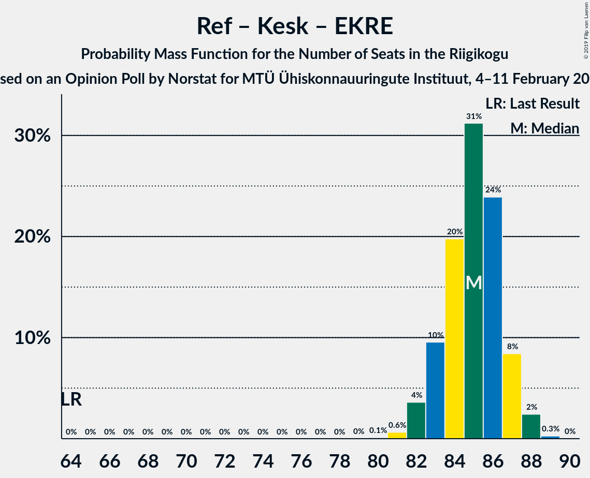

# Opinion Poll by Norstat, 4–11 February 2019

<a href="#voting-intentions">Voting Intentions</a> | <a href="#seats">Seats</a> | <a href="#coalitions">Coalitions</a> | <a href="#technical-information">Technical Information</a>

## Voting Intentions

### Confidence Intervals

| Party | Last Result | Poll Result | 80% Confidence Interval | 90% Confidence Interval | 95% Confidence Interval | 99% Confidence Interval |
|:-----:|:-----------:|:-----------:|:-----------------------:|:-----------------------:|:-----------------------:|:-----------------------:|
| Eesti Reformierakond | 27.7% | 30.6% | 28.8–32.5% |28.3–33.1% |27.8–33.5% |27.0–34.5% |
| Eesti Keskerakond | 24.8% | 27.4% | 25.6–29.3% |25.1–29.8% |24.7–30.3% |23.9–31.2% |
| Eesti Konservatiivne Rahvaerakond | 8.1% | 17.6% | 16.1–19.2% |15.7–19.7% |15.4–20.1% |14.7–20.9% |
| Sotsiaaldemokraatlik Erakond | 15.2% | 9.0% | 7.9–10.3% |7.6–10.6% |7.4–10.9% |6.9–11.6% |
| Erakond Isamaa | 13.7% | 8.0% | 7.0–9.2% |6.7–9.6% |6.5–9.9% |6.0–10.5% |
| Eesti 200 | 0.0% | 3.0% | 2.4–3.8% |2.2–4.1% |2.1–4.3% |1.9–4.7% |
| Erakond Eestimaa Rohelised | 0.9% | 2.0% | 1.5–2.7% |1.4–2.9% |1.3–3.1% |1.1–3.4% |

*Note:* The poll result column reflects the actual value used in the calculations. Published results may vary slightly, and in addition be rounded to fewer digits.

## Seats

### Confidence Intervals

| Party | Last Result | Median | 80% Confidence Interval | 90% Confidence Interval | 95% Confidence Interval | 99% Confidence Interval |
|:-----:|:-----------:|:------:|:-----------------------:|:-----------------------:|:-----------------------:|:-----------------------:|
| <a href="#eesti-reformierakond">Eesti Reformierakond</a> | 30 | 35 | 33–37 |32–38 |31–39 |30–40 |
| <a href="#eesti-keskerakond">Eesti Keskerakond</a> | 27 | 31 | 29–33 |28–34 |28–34 |27–36 |
| <a href="#eesti-konservatiivne-rahvaerakond">Eesti Konservatiivne Rahvaerakond</a> | 7 | 19 | 17–21 |16–21 |16–22 |15–23 |
| <a href="#sotsiaaldemokraatlik-erakond">Sotsiaaldemokraatlik Erakond</a> | 15 | 9 | 7–10 |7–10 |7–11 |6–11 |
| <a href="#erakond-isamaa">Erakond Isamaa</a> | 14 | 8 | 6–9 |6–9 |6–10 |5–10 |
| <a href="#eesti-200">Eesti 200</a> | 0 | 0 | 0 |0 |0 |0 |
| <a href="#erakond-eestimaa-rohelised">Erakond Eestimaa Rohelised</a> | 0 | 0 | 0 |0 |0 |0 |

### Eesti Reformierakond

*For a full overview of the results for this party, see the [Eesti Reformierakond](party-eestireformierakond.html) page.*

| Number of Seats | Probability | Accumulated | Special Marks |
|:---------------:|:-----------:|:-----------:|:-------------:|
| 29 | 0.1% | 100% |  |
| 30 | 0.5% | 99.9% | Last Result |
| 31 | 2% | 99.5% |  |
| 32 | 5% | 97% |  |
| 33 | 13% | 92% |  |
| 34 | 17% | 79% |  |
| 35 | 23% | 62% | Median |
| 36 | 19% | 39% |  |
| 37 | 12% | 20% |  |
| 38 | 5% | 8% |  |
| 39 | 2% | 3% |  |
| 40 | 0.5% | 0.7% |  |
| 41 | 0.1% | 0.2% |  |
| 42 | 0% | 0% |  |

### Eesti Keskerakond

*For a full overview of the results for this party, see the [Eesti Keskerakond](party-eestikeskerakond.html) page.*

| Number of Seats | Probability | Accumulated | Special Marks |
|:---------------:|:-----------:|:-----------:|:-------------:|
| 25 | 0.1% | 100% |  |
| 26 | 0.4% | 99.9% |  |
| 27 | 2% | 99.5% | Last Result |
| 28 | 6% | 98% |  |
| 29 | 13% | 92% |  |
| 30 | 20% | 79% |  |
| 31 | 24% | 59% | Median |
| 32 | 17% | 35% |  |
| 33 | 11% | 18% |  |
| 34 | 5% | 7% |  |
| 35 | 2% | 2% |  |
| 36 | 0.4% | 0.5% |  |
| 37 | 0.1% | 0.1% |  |
| 38 | 0% | 0% |  |

### Eesti Konservatiivne Rahvaerakond

*For a full overview of the results for this party, see the [Eesti Konservatiivne Rahvaerakond](party-eestikonservatiivnerahvaerakond.html) page.*

| Number of Seats | Probability | Accumulated | Special Marks |
|:---------------:|:-----------:|:-----------:|:-------------:|
| 7 | 0% | 100% | Last Result |
| 8 | 0% | 100% |  |
| 9 | 0% | 100% |  |
| 10 | 0% | 100% |  |
| 11 | 0% | 100% |  |
| 12 | 0% | 100% |  |
| 13 | 0% | 100% |  |
| 14 | 0.1% | 100% |  |
| 15 | 0.9% | 99.9% |  |
| 16 | 5% | 99.0% |  |
| 17 | 14% | 94% |  |
| 18 | 23% | 80% |  |
| 19 | 27% | 57% | Median |
| 20 | 17% | 30% |  |
| 21 | 9% | 12% |  |
| 22 | 3% | 3% |  |
| 23 | 0.6% | 0.8% |  |
| 24 | 0.1% | 0.1% |  |
| 25 | 0% | 0% |  |

### Sotsiaaldemokraatlik Erakond

*For a full overview of the results for this party, see the [Sotsiaaldemokraatlik Erakond](party-sotsiaaldemokraatlikerakond.html) page.*

| Number of Seats | Probability | Accumulated | Special Marks |
|:---------------:|:-----------:|:-----------:|:-------------:|
| 6 | 1.2% | 100% |  |
| 7 | 10% | 98.7% |  |
| 8 | 29% | 88% |  |
| 9 | 36% | 59% | Median |
| 10 | 19% | 23% |  |
| 11 | 4% | 4% |  |
| 12 | 0.4% | 0.5% |  |
| 13 | 0% | 0% |  |
| 14 | 0% | 0% |  |
| 15 | 0% | 0% | Last Result |

### Erakond Isamaa

*For a full overview of the results for this party, see the [Erakond Isamaa](party-erakondisamaa.html) page.*

| Number of Seats | Probability | Accumulated | Special Marks |
|:---------------:|:-----------:|:-----------:|:-------------:|
| 5 | 0.9% | 100% |  |
| 6 | 12% | 99.0% |  |
| 7 | 35% | 87% |  |
| 8 | 35% | 52% | Median |
| 9 | 15% | 17% |  |
| 10 | 2% | 3% |  |
| 11 | 0.3% | 0.3% |  |
| 12 | 0% | 0% |  |
| 13 | 0% | 0% |  |
| 14 | 0% | 0% | Last Result |

### Eesti 200

*For a full overview of the results for this party, see the [Eesti 200](party-eesti200.html) page.*

| Number of Seats | Probability | Accumulated | Special Marks |
|:---------------:|:-----------:|:-----------:|:-------------:|
| 0 | 99.9% | 100% | Last Result, Median |
| 1 | 0% | 0.1% |  |
| 2 | 0% | 0.1% |  |
| 3 | 0% | 0.1% |  |
| 4 | 0.1% | 0.1% |  |
| 5 | 0% | 0% |  |

### Erakond Eestimaa Rohelised

*For a full overview of the results for this party, see the [Erakond Eestimaa Rohelised](party-erakondeestimaarohelised.html) page.*

| Number of Seats | Probability | Accumulated | Special Marks |
|:---------------:|:-----------:|:-----------:|:-------------:|
| 0 | 100% | 100% | Last Result, Median |

## Coalitions

### Confidence Intervals

| Coalition | Last Result | Median | Majority? | 80% Confidence Interval | 90% Confidence Interval | 95% Confidence Interval | 99% Confidence Interval |
|:---------:|:-----------:|:------:|:---------:|:-----------------------:|:-----------------------:|:-----------------------:|:-----------------------:|
| Eesti Reformierakond – Eesti Keskerakond – Eesti Konservatiivne Rahvaerakond | 64 | 85 | 100% | 83–86 | 82–87 | 82–87 | 81–88 |
| Eesti Reformierakond – Eesti Keskerakond | 57 | 66 | 100% | 64–68 | 63–69 | 62–69 | 61–70 |
| Eesti Reformierakond – Eesti Konservatiivne Rahvaerakond – Erakond Isamaa | 51 | 61 | 100% | 59–64 | 58–64 | 58–65 | 57–66 |
| Eesti Reformierakond – Eesti Konservatiivne Rahvaerakond | 37 | 54 | 95% | 51–56 | 51–57 | 50–57 | 49–59 |
| Eesti Reformierakond – Sotsiaaldemokraatlik Erakond – Erakond Isamaa | 59 | 51 | 67% | 49–54 | 48–54 | 48–55 | 46–56 |
| Eesti Keskerakond – Eesti Konservatiivne Rahvaerakond | 34 | 50 | 33% | 47–52 | 47–53 | 46–53 | 45–55 |
| Eesti Keskerakond – Sotsiaaldemokraatlik Erakond – Erakond Isamaa | 56 | 47 | 5% | 45–50 | 44–50 | 44–51 | 42–52 |
| Eesti Reformierakond – Sotsiaaldemokraatlik Erakond | 45 | 44 | 0% | 41–46 | 41–47 | 40–47 | 39–49 |
| Eesti Reformierakond – Erakond Isamaa | 44 | 43 | 0% | 40–45 | 40–46 | 39–46 | 38–47 |
| Eesti Keskerakond – Sotsiaaldemokraatlik Erakond | 42 | 40 | 0% | 37–42 | 37–43 | 36–43 | 35–44 |
| Eesti Konservatiivne Rahvaerakond – Sotsiaaldemokraatlik Erakond | 22 | 28 | 0% | 25–30 | 25–30 | 24–31 | 23–32 |

### Eesti Reformierakond – Eesti Keskerakond – Eesti Konservatiivne Rahvaerakond

| Number of Seats | Probability | Accumulated | Special Marks |
|:---------------:|:-----------:|:-----------:|:-------------:|
| 64 | 0% | 100% | Last Result |
| 65 | 0% | 100% |  |
| 66 | 0% | 100% |  |
| 67 | 0% | 100% |  |
| 68 | 0% | 100% |  |
| 69 | 0% | 100% |  |
| 70 | 0% | 100% |  |
| 71 | 0% | 100% |  |
| 72 | 0% | 100% |  |
| 73 | 0% | 100% |  |
| 74 | 0% | 100% |  |
| 75 | 0% | 100% |  |
| 76 | 0% | 100% |  |
| 77 | 0% | 100% |  |
| 78 | 0% | 100% |  |
| 79 | 0% | 100% |  |
| 80 | 0.2% | 100% |  |
| 81 | 1.0% | 99.8% |  |
| 82 | 5% | 98.8% |  |
| 83 | 14% | 94% |  |
| 84 | 25% | 80% |  |
| 85 | 27% | 55% | Median |
| 86 | 19% | 28% |  |
| 87 | 7% | 9% |  |
| 88 | 2% | 2% |  |
| 89 | 0.2% | 0.2% |  |
| 90 | 0% | 0% |  |

### Eesti Reformierakond – Eesti Keskerakond

| Number of Seats | Probability | Accumulated | Special Marks |
|:---------------:|:-----------:|:-----------:|:-------------:|
| 57 | 0% | 100% | Last Result |
| 58 | 0% | 100% |  |
| 59 | 0% | 100% |  |
| 60 | 0.1% | 100% |  |
| 61 | 0.5% | 99.9% |  |
| 62 | 2% | 99.3% |  |
| 63 | 6% | 97% |  |
| 64 | 13% | 91% |  |
| 65 | 19% | 78% |  |
| 66 | 22% | 59% | Median |
| 67 | 20% | 37% |  |
| 68 | 10% | 17% |  |
| 69 | 5% | 8% |  |
| 70 | 2% | 2% |  |
| 71 | 0.4% | 0.5% |  |
| 72 | 0.1% | 0.1% |  |
| 73 | 0% | 0% |  |

### Eesti Reformierakond – Eesti Konservatiivne Rahvaerakond – Erakond Isamaa

| Number of Seats | Probability | Accumulated | Special Marks |
|:---------------:|:-----------:|:-----------:|:-------------:|
| 51 | 0% | 100% | Last Result, Majority |
| 52 | 0% | 100% |  |
| 53 | 0% | 100% |  |
| 54 | 0% | 100% |  |
| 55 | 0.1% | 100% |  |
| 56 | 0.4% | 99.9% |  |
| 57 | 2% | 99.5% |  |
| 58 | 5% | 98% |  |
| 59 | 10% | 93% |  |
| 60 | 15% | 83% |  |
| 61 | 20% | 68% |  |
| 62 | 20% | 48% | Median |
| 63 | 15% | 28% |  |
| 64 | 8% | 12% |  |
| 65 | 3% | 4% |  |
| 66 | 1.0% | 1.2% |  |
| 67 | 0.2% | 0.2% |  |
| 68 | 0% | 0% |  |

### Eesti Reformierakond – Eesti Konservatiivne Rahvaerakond

| Number of Seats | Probability | Accumulated | Special Marks |
|:---------------:|:-----------:|:-----------:|:-------------:|
| 37 | 0% | 100% | Last Result |
| 38 | 0% | 100% |  |
| 39 | 0% | 100% |  |
| 40 | 0% | 100% |  |
| 41 | 0% | 100% |  |
| 42 | 0% | 100% |  |
| 43 | 0% | 100% |  |
| 44 | 0% | 100% |  |
| 45 | 0% | 100% |  |
| 46 | 0% | 100% |  |
| 47 | 0% | 100% |  |
| 48 | 0.3% | 100% |  |
| 49 | 0.9% | 99.7% |  |
| 50 | 4% | 98.8% |  |
| 51 | 7% | 95% | Majority |
| 52 | 14% | 88% |  |
| 53 | 19% | 74% |  |
| 54 | 18% | 55% | Median |
| 55 | 21% | 37% |  |
| 56 | 9% | 17% |  |
| 57 | 6% | 8% |  |
| 58 | 2% | 2% |  |
| 59 | 0.5% | 0.6% |  |
| 60 | 0.1% | 0.1% |  |
| 61 | 0% | 0% |  |

### Eesti Reformierakond – Sotsiaaldemokraatlik Erakond – Erakond Isamaa

| Number of Seats | Probability | Accumulated | Special Marks |
|:---------------:|:-----------:|:-----------:|:-------------:|
| 45 | 0.1% | 100% |  |
| 46 | 0.5% | 99.9% |  |
| 47 | 2% | 99.5% |  |
| 48 | 5% | 98% |  |
| 49 | 11% | 93% |  |
| 50 | 15% | 83% |  |
| 51 | 21% | 67% | Majority |
| 52 | 18% | 46% | Median |
| 53 | 15% | 28% |  |
| 54 | 8% | 13% |  |
| 55 | 3% | 5% |  |
| 56 | 1.2% | 2% |  |
| 57 | 0.3% | 0.3% |  |
| 58 | 0% | 0% |  |
| 59 | 0% | 0% | Last Result |

### Eesti Keskerakond – Eesti Konservatiivne Rahvaerakond

| Number of Seats | Probability | Accumulated | Special Marks |
|:---------------:|:-----------:|:-----------:|:-------------:|
| 34 | 0% | 100% | Last Result |
| 35 | 0% | 100% |  |
| 36 | 0% | 100% |  |
| 37 | 0% | 100% |  |
| 38 | 0% | 100% |  |
| 39 | 0% | 100% |  |
| 40 | 0% | 100% |  |
| 41 | 0% | 100% |  |
| 42 | 0% | 100% |  |
| 43 | 0% | 100% |  |
| 44 | 0.3% | 100% |  |
| 45 | 1.2% | 99.7% |  |
| 46 | 3% | 98% |  |
| 47 | 8% | 95% |  |
| 48 | 15% | 87% |  |
| 49 | 18% | 72% |  |
| 50 | 21% | 54% | Median |
| 51 | 15% | 33% | Majority |
| 52 | 11% | 17% |  |
| 53 | 5% | 7% |  |
| 54 | 2% | 2% |  |
| 55 | 0.4% | 0.5% |  |
| 56 | 0.1% | 0.1% |  |
| 57 | 0% | 0% |  |

### Eesti Keskerakond – Sotsiaaldemokraatlik Erakond – Erakond Isamaa

| Number of Seats | Probability | Accumulated | Special Marks |
|:---------------:|:-----------:|:-----------:|:-------------:|
| 41 | 0.1% | 100% |  |
| 42 | 0.5% | 99.9% |  |
| 43 | 2% | 99.4% |  |
| 44 | 6% | 98% |  |
| 45 | 9% | 92% |  |
| 46 | 21% | 83% |  |
| 47 | 18% | 63% |  |
| 48 | 19% | 45% | Median |
| 49 | 14% | 26% |  |
| 50 | 7% | 12% |  |
| 51 | 4% | 5% | Majority |
| 52 | 0.9% | 1.2% |  |
| 53 | 0.3% | 0.3% |  |
| 54 | 0% | 0% |  |
| 55 | 0% | 0% |  |
| 56 | 0% | 0% | Last Result |

### Eesti Reformierakond – Sotsiaaldemokraatlik Erakond

| Number of Seats | Probability | Accumulated | Special Marks |
|:---------------:|:-----------:|:-----------:|:-------------:|
| 38 | 0.2% | 100% |  |
| 39 | 1.0% | 99.7% |  |
| 40 | 3% | 98.8% |  |
| 41 | 8% | 96% |  |
| 42 | 14% | 88% |  |
| 43 | 19% | 74% |  |
| 44 | 19% | 55% | Median |
| 45 | 20% | 36% | Last Result |
| 46 | 9% | 16% |  |
| 47 | 5% | 7% |  |
| 48 | 2% | 2% |  |
| 49 | 0.4% | 0.6% |  |
| 50 | 0.1% | 0.1% |  |
| 51 | 0% | 0% | Majority |

### Eesti Reformierakond – Erakond Isamaa

| Number of Seats | Probability | Accumulated | Special Marks |
|:---------------:|:-----------:|:-----------:|:-------------:|
| 37 | 0.2% | 100% |  |
| 38 | 1.1% | 99.7% |  |
| 39 | 4% | 98.6% |  |
| 40 | 9% | 95% |  |
| 41 | 15% | 86% |  |
| 42 | 19% | 71% |  |
| 43 | 21% | 53% | Median |
| 44 | 16% | 32% | Last Result |
| 45 | 9% | 15% |  |
| 46 | 4% | 6% |  |
| 47 | 1.5% | 2% |  |
| 48 | 0.4% | 0.5% |  |
| 49 | 0.1% | 0.1% |  |
| 50 | 0% | 0% |  |

### Eesti Keskerakond – Sotsiaaldemokraatlik Erakond

| Number of Seats | Probability | Accumulated | Special Marks |
|:---------------:|:-----------:|:-----------:|:-------------:|
| 34 | 0.2% | 100% |  |
| 35 | 1.0% | 99.8% |  |
| 36 | 3% | 98.8% |  |
| 37 | 8% | 96% |  |
| 38 | 15% | 88% |  |
| 39 | 20% | 72% |  |
| 40 | 20% | 52% | Median |
| 41 | 15% | 32% |  |
| 42 | 10% | 17% | Last Result |
| 43 | 5% | 7% |  |
| 44 | 1.5% | 2% |  |
| 45 | 0.4% | 0.5% |  |
| 46 | 0.1% | 0.1% |  |
| 47 | 0% | 0% |  |

### Eesti Konservatiivne Rahvaerakond – Sotsiaaldemokraatlik Erakond

| Number of Seats | Probability | Accumulated | Special Marks |
|:---------------:|:-----------:|:-----------:|:-------------:|
| 22 | 0.1% | 100% | Last Result |
| 23 | 0.8% | 99.9% |  |
| 24 | 3% | 99.1% |  |
| 25 | 7% | 96% |  |
| 26 | 18% | 89% |  |
| 27 | 21% | 72% |  |
| 28 | 23% | 50% | Median |
| 29 | 17% | 28% |  |
| 30 | 7% | 11% |  |
| 31 | 3% | 4% |  |
| 32 | 0.7% | 0.9% |  |
| 33 | 0.1% | 0.1% |  |
| 34 | 0% | 0% |  |

## Technical Information

### Opinion Poll

+ **Polling firm:** Norstat
+ **Commissioner(s):** —
+ **Fieldwork period:** 4–11 February 2019

### Calculations

+ **Sample size:** 1000
+ **Simulations done:** 1,048,576
+ **Error estimate:** 1.05%

