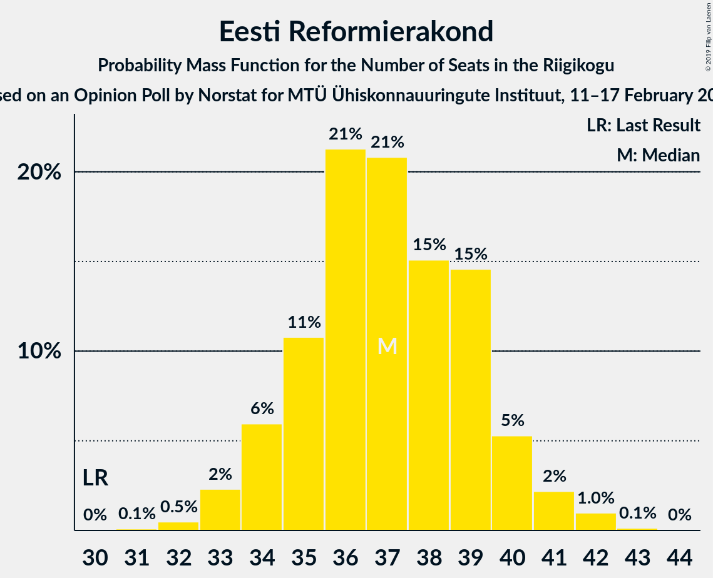
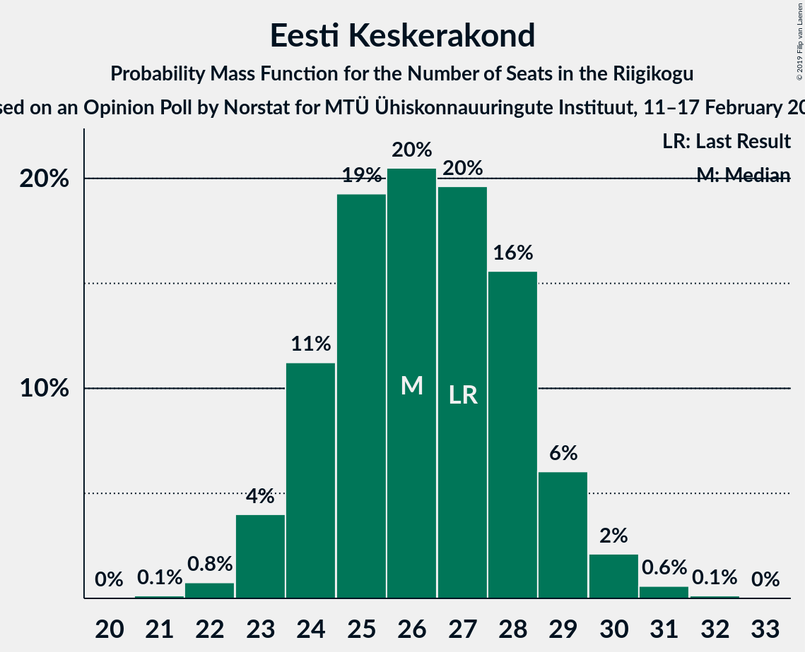
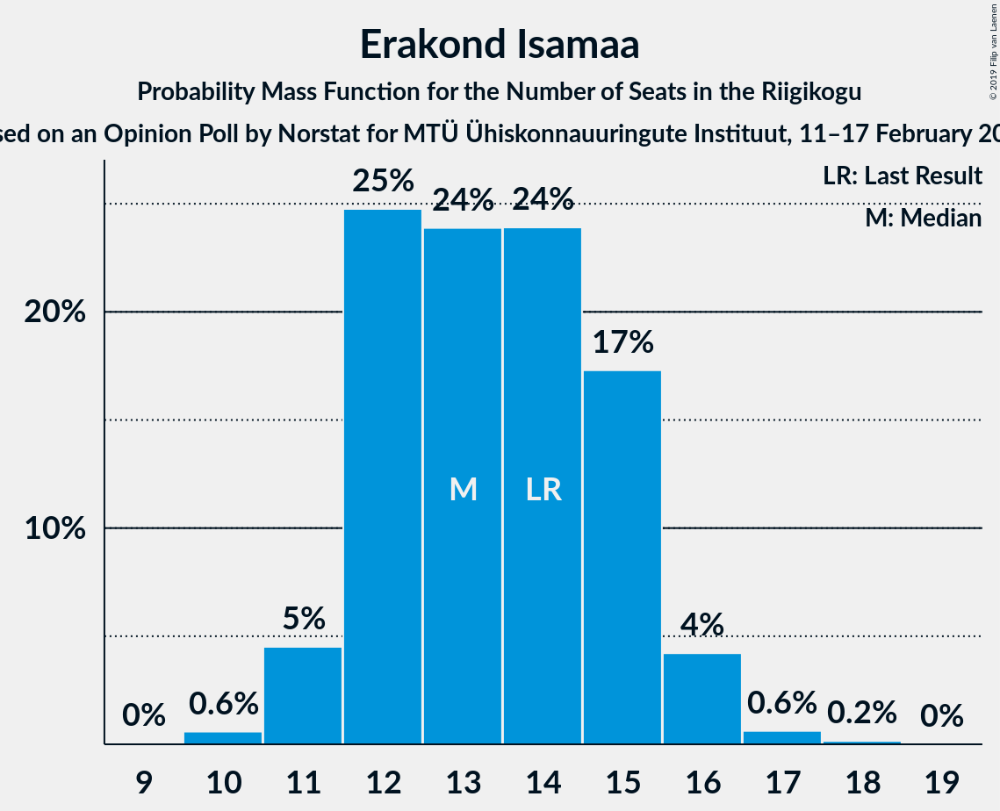
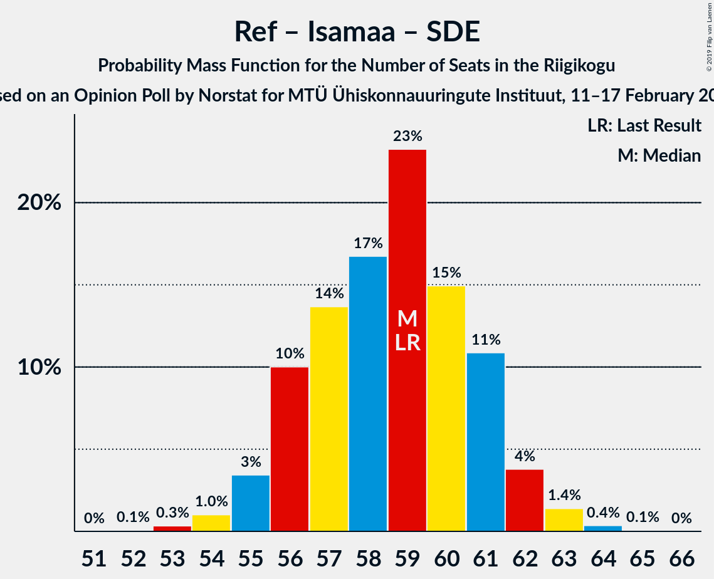

# Opinion Poll by Norstat for MTÜ Ühiskonnauuringute Instituut, 11–17 February 2019

<a href="#voting-intentions">Voting Intentions</a> | <a href="#seats">Seats</a> | <a href="#coalitions">Coalitions</a> | <a href="#technical-information">Technical Information</a>

## Voting Intentions

### Confidence Intervals

| Party | Last Result | Poll Result | 80% Confidence Interval | 90% Confidence Interval | 95% Confidence Interval | 99% Confidence Interval |
|:-----:|:-----------:|:-----------:|:-----------------------:|:-----------------------:|:-----------------------:|:-----------------------:|
| Eesti Reformierakond | 27.7% | 31.7% | 29.9–33.6% |29.3–34.2% |28.9–34.7% |28.0–35.6% |
| Eesti Keskerakond | 24.8% | 23.4% | 21.7–25.2% |21.3–25.7% |20.9–26.1% |20.1–27.0% |
| Eesti Konservatiivne Rahvaerakond | 8.1% | 15.2% | 13.8–16.8% |13.4–17.2% |13.1–17.6% |12.5–18.3% |
| Erakond Isamaa | 13.7% | 12.9% | 11.6–14.4% |11.3–14.8% |11.0–15.1% |10.4–15.9% |
| Sotsiaaldemokraatlik Erakond | 15.2% | 8.4% | 7.4–9.6% |7.1–10.0% |6.8–10.3% |6.4–10.9% |
| Erakond Eestimaa Rohelised | 0.9% | 2.8% | 2.2–3.6% |2.1–3.8% |1.9–4.0% |1.7–4.4% |
| Eesti 200 | 0.0% | 2.4% | 1.9–3.2% |1.7–3.4% |1.6–3.6% |1.4–3.9% |
| Eesti Vabaerakond | 8.7% | 1.0% | 0.7–1.5% |0.6–1.7% |0.5–1.8% |0.4–2.1% |

*Note:* The poll result column reflects the actual value used in the calculations. Published results may vary slightly, and in addition be rounded to fewer digits.

## Seats

### Confidence Intervals

| Party | Last Result | Median | 80% Confidence Interval | 90% Confidence Interval | 95% Confidence Interval | 99% Confidence Interval |
|:-----:|:-----------:|:------:|:-----------------------:|:-----------------------:|:-----------------------:|:-----------------------:|
| <a href="#eesti-reformierakond">Eesti Reformierakond</a> | 30 | 37 | 35–40 |34–40 |33–41 |32–42 |
| <a href="#eesti-keskerakond">Eesti Keskerakond</a> | 27 | 25 | 24–29 |24–29 |23–30 |23–31 |
| <a href="#eesti-konservatiivne-rahvaerakond">Eesti Konservatiivne Rahvaerakond</a> | 7 | 16 | 15–18 |14–18 |14–19 |13–20 |
| <a href="#erakond-isamaa">Erakond Isamaa</a> | 14 | 14 | 12–15 |11–15 |11–16 |11–17 |
| <a href="#sotsiaaldemokraatlik-erakond">Sotsiaaldemokraatlik Erakond</a> | 15 | 8 | 7–10 |7–10 |6–10 |6–11 |
| <a href="#erakond-eestimaa-rohelised">Erakond Eestimaa Rohelised</a> | 0 | 0 | 0 |0 |0 |0 |
| <a href="#eesti-200">Eesti 200</a> | 0 | 0 | 0 |0 |0 |0 |
| <a href="#eesti-vabaerakond">Eesti Vabaerakond</a> | 8 | 0 | 0 |0 |0 |0 |

### Eesti Reformierakond

*For a full overview of the results for this party, see the [Eesti Reformierakond](party-eestireformierakond.html) page.*

| Number of Seats | Probability | Accumulated | Special Marks |
|:---------------:|:-----------:|:-----------:|:-------------:|
| 30 | 0% | 100% | Last Result |
| 31 | 0.1% | 100% |  |
| 32 | 0.6% | 99.9% |  |
| 33 | 2% | 99.3% |  |
| 34 | 7% | 97% |  |
| 35 | 12% | 91% |  |
| 36 | 14% | 79% |  |
| 37 | 25% | 65% | Median |
| 38 | 14% | 39% |  |
| 39 | 15% | 25% |  |
| 40 | 6% | 11% |  |
| 41 | 4% | 5% |  |
| 42 | 0.6% | 0.8% |  |
| 43 | 0.1% | 0.1% |  |
| 44 | 0% | 0% |  |

### Eesti Keskerakond

*For a full overview of the results for this party, see the [Eesti Keskerakond](party-eestikeskerakond.html) page.*

| Number of Seats | Probability | Accumulated | Special Marks |
|:---------------:|:-----------:|:-----------:|:-------------:|
| 21 | 0.2% | 100% |  |
| 22 | 0.2% | 99.8% |  |
| 23 | 2% | 99.6% |  |
| 24 | 17% | 97% |  |
| 25 | 32% | 81% | Median |
| 26 | 17% | 49% |  |
| 27 | 14% | 32% | Last Result |
| 28 | 8% | 18% |  |
| 29 | 7% | 10% |  |
| 30 | 3% | 3% |  |
| 31 | 0.4% | 0.5% |  |
| 32 | 0.1% | 0.1% |  |
| 33 | 0% | 0% |  |

### Eesti Konservatiivne Rahvaerakond

*For a full overview of the results for this party, see the [Eesti Konservatiivne Rahvaerakond](party-eestikonservatiivnerahvaerakond.html) page.*

| Number of Seats | Probability | Accumulated | Special Marks |
|:---------------:|:-----------:|:-----------:|:-------------:|
| 7 | 0% | 100% | Last Result |
| 8 | 0% | 100% |  |
| 9 | 0% | 100% |  |
| 10 | 0% | 100% |  |
| 11 | 0% | 100% |  |
| 12 | 0.1% | 100% |  |
| 13 | 2% | 99.9% |  |
| 14 | 7% | 98% |  |
| 15 | 23% | 90% |  |
| 16 | 26% | 67% | Median |
| 17 | 23% | 41% |  |
| 18 | 15% | 18% |  |
| 19 | 2% | 3% |  |
| 20 | 0.7% | 0.8% |  |
| 21 | 0% | 0.1% |  |
| 22 | 0% | 0% |  |

### Erakond Isamaa

*For a full overview of the results for this party, see the [Erakond Isamaa](party-erakondisamaa.html) page.*

| Number of Seats | Probability | Accumulated | Special Marks |
|:---------------:|:-----------:|:-----------:|:-------------:|
| 10 | 0.4% | 100% |  |
| 11 | 5% | 99.6% |  |
| 12 | 18% | 94% |  |
| 13 | 20% | 76% |  |
| 14 | 26% | 57% | Last Result, Median |
| 15 | 26% | 30% |  |
| 16 | 3% | 4% |  |
| 17 | 0.7% | 0.9% |  |
| 18 | 0.2% | 0.2% |  |
| 19 | 0% | 0% |  |

### Sotsiaaldemokraatlik Erakond

*For a full overview of the results for this party, see the [Sotsiaaldemokraatlik Erakond](party-sotsiaaldemokraatlikerakond.html) page.*

| Number of Seats | Probability | Accumulated | Special Marks |
|:---------------:|:-----------:|:-----------:|:-------------:|
| 5 | 0.1% | 100% |  |
| 6 | 5% | 99.9% |  |
| 7 | 12% | 95% |  |
| 8 | 56% | 83% | Median |
| 9 | 16% | 27% |  |
| 10 | 9% | 11% |  |
| 11 | 1.4% | 1.5% |  |
| 12 | 0% | 0.1% |  |
| 13 | 0% | 0% |  |
| 14 | 0% | 0% |  |
| 15 | 0% | 0% | Last Result |

### Erakond Eestimaa Rohelised

*For a full overview of the results for this party, see the [Erakond Eestimaa Rohelised](party-erakondeestimaarohelised.html) page.*

| Number of Seats | Probability | Accumulated | Special Marks |
|:---------------:|:-----------:|:-----------:|:-------------:|
| 0 | 100% | 100% | Last Result, Median |

### Eesti 200

*For a full overview of the results for this party, see the [Eesti 200](party-eesti200.html) page.*

| Number of Seats | Probability | Accumulated | Special Marks |
|:---------------:|:-----------:|:-----------:|:-------------:|
| 0 | 100% | 100% | Last Result, Median |

### Eesti Vabaerakond

*For a full overview of the results for this party, see the [Eesti Vabaerakond](party-eestivabaerakond.html) page.*

| Number of Seats | Probability | Accumulated | Special Marks |
|:---------------:|:-----------:|:-----------:|:-------------:|
| 0 | 100% | 100% | Median |
| 1 | 0% | 0% |  |
| 2 | 0% | 0% |  |
| 3 | 0% | 0% |  |
| 4 | 0% | 0% |  |
| 5 | 0% | 0% |  |
| 6 | 0% | 0% |  |
| 7 | 0% | 0% |  |
| 8 | 0% | 0% | Last Result |

## Coalitions

### Confidence Intervals

| Coalition | Last Result | Median | Majority? | 80% Confidence Interval | 90% Confidence Interval | 95% Confidence Interval | 99% Confidence Interval |
|:---------:|:-----------:|:------:|:---------:|:-----------------------:|:-----------------------:|:-----------------------:|:-----------------------:|
| Eesti Reformierakond – Eesti Keskerakond – Eesti Konservatiivne Rahvaerakond | 64 | 79 | 100% | 78–81 | 77–82 | 76–82 | 75–83 |
| Eesti Reformierakond – Eesti Konservatiivne Rahvaerakond – Erakond Isamaa | 51 | 67 | 100% | 64–69 | 63–69 | 63–70 | 62–70 |
| Eesti Reformierakond – Eesti Keskerakond | 57 | 63 | 100% | 60–66 | 60–66 | 59–67 | 58–68 |
| Eesti Reformierakond – Erakond Isamaa – Sotsiaaldemokraatlik Erakond – Eesti Vabaerakond | 67 | 59 | 100% | 56–61 | 56–61 | 55–62 | 54–63 |
| Eesti Reformierakond – Erakond Isamaa – Sotsiaaldemokraatlik Erakond | 59 | 59 | 100% | 56–61 | 56–61 | 55–62 | 54–63 |
| Eesti Reformierakond – Eesti Konservatiivne Rahvaerakond | 37 | 53 | 93% | 51–55 | 50–56 | 49–57 | 48–58 |
| Eesti Reformierakond – Erakond Isamaa | 44 | 51 | 57% | 48–53 | 48–53 | 47–54 | 46–55 |
| Eesti Keskerakond – Erakond Isamaa – Sotsiaaldemokraatlik Erakond | 56 | 48 | 7% | 46–50 | 45–51 | 44–52 | 43–53 |
| Eesti Reformierakond – Sotsiaaldemokraatlik Erakond | 45 | 45 | 0.2% | 43–48 | 42–49 | 42–49 | 40–50 |
| Eesti Keskerakond – Eesti Konservatiivne Rahvaerakond | 34 | 42 | 0% | 40–44 | 40–45 | 39–46 | 38–47 |
| Eesti Keskerakond – Sotsiaaldemokraatlik Erakond | 42 | 34 | 0% | 32–37 | 32–38 | 31–38 | 31–39 |
| Eesti Konservatiivne Rahvaerakond – Sotsiaaldemokraatlik Erakond | 22 | 24 | 0% | 23–26 | 22–27 | 21–27 | 20–28 |

### Eesti Reformierakond – Eesti Keskerakond – Eesti Konservatiivne Rahvaerakond

| Number of Seats | Probability | Accumulated | Special Marks |
|:---------------:|:-----------:|:-----------:|:-------------:|
| 64 | 0% | 100% | Last Result |
| 65 | 0% | 100% |  |
| 66 | 0% | 100% |  |
| 67 | 0% | 100% |  |
| 68 | 0% | 100% |  |
| 69 | 0% | 100% |  |
| 70 | 0% | 100% |  |
| 71 | 0% | 100% |  |
| 72 | 0% | 100% |  |
| 73 | 0.1% | 100% |  |
| 74 | 0.1% | 99.9% |  |
| 75 | 0.9% | 99.8% |  |
| 76 | 3% | 98.9% |  |
| 77 | 4% | 96% |  |
| 78 | 32% | 92% | Median |
| 79 | 18% | 61% |  |
| 80 | 23% | 42% |  |
| 81 | 10% | 19% |  |
| 82 | 8% | 9% |  |
| 83 | 1.1% | 1.2% |  |
| 84 | 0.1% | 0.1% |  |
| 85 | 0% | 0% |  |

### Eesti Reformierakond – Eesti Konservatiivne Rahvaerakond – Erakond Isamaa

| Number of Seats | Probability | Accumulated | Special Marks |
|:---------------:|:-----------:|:-----------:|:-------------:|
| 51 | 0% | 100% | Last Result, Majority |
| 52 | 0% | 100% |  |
| 53 | 0% | 100% |  |
| 54 | 0% | 100% |  |
| 55 | 0% | 100% |  |
| 56 | 0% | 100% |  |
| 57 | 0% | 100% |  |
| 58 | 0% | 100% |  |
| 59 | 0% | 100% |  |
| 60 | 0.1% | 100% |  |
| 61 | 0.3% | 99.9% |  |
| 62 | 0.6% | 99.7% |  |
| 63 | 4% | 99.1% |  |
| 64 | 6% | 95% |  |
| 65 | 14% | 89% |  |
| 66 | 9% | 76% |  |
| 67 | 22% | 67% | Median |
| 68 | 26% | 45% |  |
| 69 | 16% | 19% |  |
| 70 | 3% | 3% |  |
| 71 | 0.3% | 0.5% |  |
| 72 | 0.2% | 0.2% |  |
| 73 | 0% | 0% |  |

### Eesti Reformierakond – Eesti Keskerakond

| Number of Seats | Probability | Accumulated | Special Marks |
|:---------------:|:-----------:|:-----------:|:-------------:|
| 57 | 0.2% | 100% | Last Result |
| 58 | 0.3% | 99.8% |  |
| 59 | 2% | 99.5% |  |
| 60 | 9% | 97% |  |
| 61 | 18% | 88% |  |
| 62 | 5% | 70% | Median |
| 63 | 21% | 65% |  |
| 64 | 23% | 44% |  |
| 65 | 11% | 21% |  |
| 66 | 7% | 10% |  |
| 67 | 2% | 4% |  |
| 68 | 1.2% | 1.4% |  |
| 69 | 0.2% | 0.2% |  |
| 70 | 0% | 0% |  |

### Eesti Reformierakond – Erakond Isamaa – Sotsiaaldemokraatlik Erakond – Eesti Vabaerakond

| Number of Seats | Probability | Accumulated | Special Marks |
|:---------------:|:-----------:|:-----------:|:-------------:|
| 52 | 0.1% | 100% |  |
| 53 | 0.1% | 99.9% |  |
| 54 | 1.1% | 99.8% |  |
| 55 | 3% | 98.7% |  |
| 56 | 6% | 96% |  |
| 57 | 9% | 90% |  |
| 58 | 24% | 81% |  |
| 59 | 13% | 57% | Median |
| 60 | 25% | 44% |  |
| 61 | 14% | 18% |  |
| 62 | 3% | 4% |  |
| 63 | 1.3% | 2% |  |
| 64 | 0.3% | 0.4% |  |
| 65 | 0.1% | 0.1% |  |
| 66 | 0% | 0% |  |
| 67 | 0% | 0% | Last Result |

### Eesti Reformierakond – Erakond Isamaa – Sotsiaaldemokraatlik Erakond

| Number of Seats | Probability | Accumulated | Special Marks |
|:---------------:|:-----------:|:-----------:|:-------------:|
| 52 | 0.1% | 100% |  |
| 53 | 0.1% | 99.9% |  |
| 54 | 1.1% | 99.8% |  |
| 55 | 3% | 98.7% |  |
| 56 | 6% | 96% |  |
| 57 | 9% | 90% |  |
| 58 | 24% | 81% |  |
| 59 | 13% | 57% | Last Result, Median |
| 60 | 25% | 44% |  |
| 61 | 14% | 18% |  |
| 62 | 3% | 4% |  |
| 63 | 1.3% | 2% |  |
| 64 | 0.3% | 0.4% |  |
| 65 | 0.1% | 0.1% |  |
| 66 | 0% | 0% |  |

### Eesti Reformierakond – Eesti Konservatiivne Rahvaerakond

| Number of Seats | Probability | Accumulated | Special Marks |
|:---------------:|:-----------:|:-----------:|:-------------:|
| 37 | 0% | 100% | Last Result |
| 38 | 0% | 100% |  |
| 39 | 0% | 100% |  |
| 40 | 0% | 100% |  |
| 41 | 0% | 100% |  |
| 42 | 0% | 100% |  |
| 43 | 0% | 100% |  |
| 44 | 0% | 100% |  |
| 45 | 0% | 100% |  |
| 46 | 0% | 100% |  |
| 47 | 0.2% | 100% |  |
| 48 | 0.7% | 99.8% |  |
| 49 | 3% | 99.1% |  |
| 50 | 3% | 96% |  |
| 51 | 10% | 93% | Majority |
| 52 | 12% | 83% |  |
| 53 | 24% | 71% | Median |
| 54 | 18% | 47% |  |
| 55 | 21% | 29% |  |
| 56 | 5% | 8% |  |
| 57 | 3% | 4% |  |
| 58 | 0.7% | 0.9% |  |
| 59 | 0.2% | 0.2% |  |
| 60 | 0% | 0% |  |

### Eesti Reformierakond – Erakond Isamaa

| Number of Seats | Probability | Accumulated | Special Marks |
|:---------------:|:-----------:|:-----------:|:-------------:|
| 44 | 0.1% | 100% | Last Result |
| 45 | 0.2% | 99.9% |  |
| 46 | 1.2% | 99.7% |  |
| 47 | 3% | 98% |  |
| 48 | 6% | 96% |  |
| 49 | 11% | 90% |  |
| 50 | 22% | 79% |  |
| 51 | 17% | 57% | Median, Majority |
| 52 | 29% | 39% |  |
| 53 | 7% | 11% |  |
| 54 | 2% | 4% |  |
| 55 | 1.2% | 2% |  |
| 56 | 0.3% | 0.3% |  |
| 57 | 0.1% | 0.1% |  |
| 58 | 0% | 0% |  |

### Eesti Keskerakond – Erakond Isamaa – Sotsiaaldemokraatlik Erakond

| Number of Seats | Probability | Accumulated | Special Marks |
|:---------------:|:-----------:|:-----------:|:-------------:|
| 42 | 0.2% | 100% |  |
| 43 | 0.7% | 99.8% |  |
| 44 | 3% | 99.1% |  |
| 45 | 5% | 96% |  |
| 46 | 21% | 92% |  |
| 47 | 18% | 71% | Median |
| 48 | 24% | 53% |  |
| 49 | 12% | 29% |  |
| 50 | 10% | 17% |  |
| 51 | 3% | 7% | Majority |
| 52 | 3% | 4% |  |
| 53 | 0.7% | 0.9% |  |
| 54 | 0.2% | 0.2% |  |
| 55 | 0% | 0% |  |
| 56 | 0% | 0% | Last Result |

### Eesti Reformierakond – Sotsiaaldemokraatlik Erakond

| Number of Seats | Probability | Accumulated | Special Marks |
|:---------------:|:-----------:|:-----------:|:-------------:|
| 39 | 0.1% | 100% |  |
| 40 | 0.5% | 99.9% |  |
| 41 | 1.5% | 99.5% |  |
| 42 | 7% | 98% |  |
| 43 | 14% | 91% |  |
| 44 | 14% | 77% |  |
| 45 | 18% | 63% | Last Result, Median |
| 46 | 14% | 46% |  |
| 47 | 19% | 32% |  |
| 48 | 3% | 12% |  |
| 49 | 8% | 9% |  |
| 50 | 0.5% | 0.8% |  |
| 51 | 0.2% | 0.2% | Majority |
| 52 | 0% | 0% |  |

### Eesti Keskerakond – Eesti Konservatiivne Rahvaerakond

| Number of Seats | Probability | Accumulated | Special Marks |
|:---------------:|:-----------:|:-----------:|:-------------:|
| 34 | 0% | 100% | Last Result |
| 35 | 0% | 100% |  |
| 36 | 0.1% | 100% |  |
| 37 | 0.3% | 99.9% |  |
| 38 | 1.3% | 99.6% |  |
| 39 | 3% | 98% |  |
| 40 | 14% | 96% |  |
| 41 | 25% | 82% | Median |
| 42 | 13% | 56% |  |
| 43 | 24% | 43% |  |
| 44 | 9% | 19% |  |
| 45 | 6% | 10% |  |
| 46 | 3% | 4% |  |
| 47 | 1.1% | 1.3% |  |
| 48 | 0.1% | 0.2% |  |
| 49 | 0.1% | 0.1% |  |
| 50 | 0% | 0% |  |

### Eesti Keskerakond – Sotsiaaldemokraatlik Erakond

| Number of Seats | Probability | Accumulated | Special Marks |
|:---------------:|:-----------:|:-----------:|:-------------:|
| 29 | 0.2% | 100% |  |
| 30 | 0.3% | 99.8% |  |
| 31 | 3% | 99.5% |  |
| 32 | 16% | 97% |  |
| 33 | 26% | 81% | Median |
| 34 | 22% | 55% |  |
| 35 | 9% | 33% |  |
| 36 | 14% | 24% |  |
| 37 | 6% | 11% |  |
| 38 | 4% | 5% |  |
| 39 | 0.6% | 0.9% |  |
| 40 | 0.3% | 0.3% |  |
| 41 | 0.1% | 0.1% |  |
| 42 | 0% | 0% | Last Result |

### Eesti Konservatiivne Rahvaerakond – Sotsiaaldemokraatlik Erakond

| Number of Seats | Probability | Accumulated | Special Marks |
|:---------------:|:-----------:|:-----------:|:-------------:|
| 19 | 0.2% | 100% |  |
| 20 | 0.7% | 99.8% |  |
| 21 | 2% | 99.1% |  |
| 22 | 7% | 97% | Last Result |
| 23 | 15% | 90% |  |
| 24 | 30% | 75% | Median |
| 25 | 24% | 45% |  |
| 26 | 15% | 21% |  |
| 27 | 4% | 6% |  |
| 28 | 1.4% | 2% |  |
| 29 | 0.2% | 0.3% |  |
| 30 | 0% | 0.1% |  |
| 31 | 0% | 0% |  |

## Technical Information

### Opinion Poll

+ **Polling firm:** Norstat
+ **Commissioner(s):** MTÜ Ühiskonnauuringute Instituut
+ **Fieldwork period:** 11–17 February 2019

### Calculations

+ **Sample size:** 1000
+ **Simulations done:** 131,072
+ **Error estimate:** 1.13%

