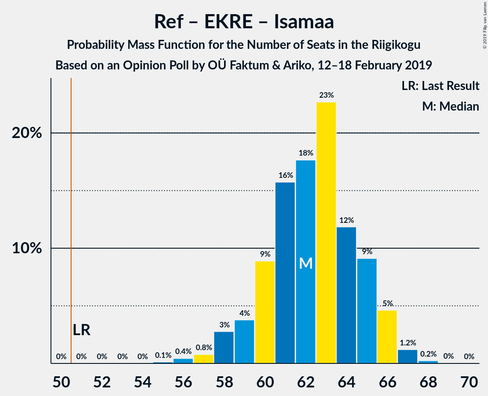

# Opinion Poll by OÜ Faktum & Ariko, 12–18 February 2019

<a href="#voting-intentions">Voting Intentions</a> | <a href="#seats">Seats</a> | <a href="#coalitions">Coalitions</a> | <a href="#technical-information">Technical Information</a>

## Voting Intentions

### Confidence Intervals

| Party | Last Result | Poll Result | 80% Confidence Interval | 90% Confidence Interval | 95% Confidence Interval | 99% Confidence Interval |
|:-----:|:-----------:|:-----------:|:-----------------------:|:-----------------------:|:-----------------------:|:-----------------------:|
| Eesti Reformierakond | 27.7% | 25.3% | 23.7–27.0% |23.2–27.5% |22.9–27.9% |22.1–28.7% |
| Eesti Keskerakond | 24.8% | 22.2% | 20.7–23.8% |20.3–24.3% |19.9–24.7% |19.2–25.5% |
| Eesti Konservatiivne Rahvaerakond | 8.1% | 18.1% | 16.8–19.7% |16.4–20.1% |16.0–20.5% |15.4–21.2% |
| Sotsiaaldemokraatlik Erakond | 15.2% | 11.1% | 10.0–12.4% |9.7–12.7% |9.4–13.0% |8.9–13.7% |
| Erakond Isamaa | 13.7% | 11.1% | 10.0–12.4% |9.7–12.7% |9.4–13.0% |8.9–13.7% |
| Eesti 200 | 0.0% | 4.0% | 3.4–4.9% |3.2–5.1% |3.0–5.3% |2.8–5.8% |
| Eesti Vabaerakond | 8.7% | 2.0% | 1.5–2.6% |1.4–2.8% |1.3–3.0% |1.1–3.3% |
| Erakond Eestimaa Rohelised | 0.9% | 2.0% | 1.5–2.6% |1.4–2.8% |1.3–3.0% |1.1–3.3% |

*Note:* The poll result column reflects the actual value used in the calculations. Published results may vary slightly, and in addition be rounded to fewer digits.

## Seats

### Confidence Intervals

| Party | Last Result | Median | 80% Confidence Interval | 90% Confidence Interval | 95% Confidence Interval | 99% Confidence Interval |
|:-----:|:-----------:|:------:|:-----------------------:|:-----------------------:|:-----------------------:|:-----------------------:|
| <a href="#eesti-reformierakond">Eesti Reformierakond</a> | 30 | 30 | 28–32 |27–33 |27–33 |26–35 |
| <a href="#eesti-keskerakond">Eesti Keskerakond</a> | 27 | 26 | 24–28 |23–28 |23–29 |22–30 |
| <a href="#eesti-konservatiivne-rahvaerakond">Eesti Konservatiivne Rahvaerakond</a> | 7 | 21 | 19–23 |18–23 |17–23 |17–25 |
| <a href="#sotsiaaldemokraatlik-erakond">Sotsiaaldemokraatlik Erakond</a> | 15 | 12 | 10–14 |10–14 |10–14 |9–15 |
| <a href="#erakond-isamaa">Erakond Isamaa</a> | 14 | 12 | 10–14 |10–14 |10–14 |9–15 |
| <a href="#eesti-200">Eesti 200</a> | 0 | 0 | 0 |0–5 |0–5 |0–5 |
| <a href="#eesti-vabaerakond">Eesti Vabaerakond</a> | 8 | 0 | 0 |0 |0 |0 |
| <a href="#erakond-eestimaa-rohelised">Erakond Eestimaa Rohelised</a> | 0 | 0 | 0 |0 |0 |0 |

### Eesti Reformierakond

*For a full overview of the results for this party, see the [Eesti Reformierakond](party-eestireformierakond.html) page.*

| Number of Seats | Probability | Accumulated | Special Marks |
|:---------------:|:-----------:|:-----------:|:-------------:|
| 24 | 0% | 100% |  |
| 25 | 0.3% | 99.9% |  |
| 26 | 2% | 99.6% |  |
| 27 | 4% | 98% |  |
| 28 | 16% | 94% |  |
| 29 | 23% | 78% |  |
| 30 | 25% | 55% | Last Result, Median |
| 31 | 15% | 30% |  |
| 32 | 8% | 15% |  |
| 33 | 5% | 8% |  |
| 34 | 1.4% | 2% |  |
| 35 | 0.7% | 0.8% |  |
| 36 | 0.1% | 0.1% |  |
| 37 | 0% | 0% |  |

### Eesti Keskerakond

*For a full overview of the results for this party, see the [Eesti Keskerakond](party-eestikeskerakond.html) page.*

| Number of Seats | Probability | Accumulated | Special Marks |
|:---------------:|:-----------:|:-----------:|:-------------:|
| 21 | 0.3% | 100% |  |
| 22 | 1.3% | 99.6% |  |
| 23 | 6% | 98% |  |
| 24 | 17% | 93% |  |
| 25 | 12% | 75% |  |
| 26 | 27% | 63% | Median |
| 27 | 19% | 36% | Last Result |
| 28 | 12% | 17% |  |
| 29 | 3% | 5% |  |
| 30 | 1.2% | 2% |  |
| 31 | 0.3% | 0.4% |  |
| 32 | 0.1% | 0.1% |  |
| 33 | 0% | 0% |  |

### Eesti Konservatiivne Rahvaerakond

*For a full overview of the results for this party, see the [Eesti Konservatiivne Rahvaerakond](party-eestikonservatiivnerahvaerakond.html) page.*

| Number of Seats | Probability | Accumulated | Special Marks |
|:---------------:|:-----------:|:-----------:|:-------------:|
| 7 | 0% | 100% | Last Result |
| 8 | 0% | 100% |  |
| 9 | 0% | 100% |  |
| 10 | 0% | 100% |  |
| 11 | 0% | 100% |  |
| 12 | 0% | 100% |  |
| 13 | 0% | 100% |  |
| 14 | 0% | 100% |  |
| 15 | 0% | 100% |  |
| 16 | 0.1% | 100% |  |
| 17 | 2% | 99.9% |  |
| 18 | 5% | 97% |  |
| 19 | 10% | 92% |  |
| 20 | 29% | 83% |  |
| 21 | 26% | 54% | Median |
| 22 | 14% | 27% |  |
| 23 | 12% | 14% |  |
| 24 | 1.5% | 2% |  |
| 25 | 0.6% | 0.6% |  |
| 26 | 0.1% | 0.1% |  |
| 27 | 0% | 0% |  |

### Sotsiaaldemokraatlik Erakond

*For a full overview of the results for this party, see the [Sotsiaaldemokraatlik Erakond](party-sotsiaaldemokraatlikerakond.html) page.*

| Number of Seats | Probability | Accumulated | Special Marks |
|:---------------:|:-----------:|:-----------:|:-------------:|
| 8 | 0.1% | 100% |  |
| 9 | 2% | 99.9% |  |
| 10 | 10% | 98% |  |
| 11 | 28% | 87% |  |
| 12 | 28% | 59% | Median |
| 13 | 20% | 31% |  |
| 14 | 10% | 11% |  |
| 15 | 0.8% | 1.0% | Last Result |
| 16 | 0.1% | 0.1% |  |
| 17 | 0% | 0% |  |

### Erakond Isamaa

*For a full overview of the results for this party, see the [Erakond Isamaa](party-erakondisamaa.html) page.*

| Number of Seats | Probability | Accumulated | Special Marks |
|:---------------:|:-----------:|:-----------:|:-------------:|
| 8 | 0.1% | 100% |  |
| 9 | 2% | 99.9% |  |
| 10 | 12% | 98% |  |
| 11 | 30% | 86% |  |
| 12 | 30% | 55% | Median |
| 13 | 12% | 25% |  |
| 14 | 11% | 12% | Last Result |
| 15 | 1.0% | 1.1% |  |
| 16 | 0.1% | 0.1% |  |
| 17 | 0% | 0% |  |

### Eesti 200

*For a full overview of the results for this party, see the [Eesti 200](party-eesti200.html) page.*

| Number of Seats | Probability | Accumulated | Special Marks |
|:---------------:|:-----------:|:-----------:|:-------------:|
| 0 | 93% | 100% | Last Result, Median |
| 1 | 0% | 7% |  |
| 2 | 0% | 7% |  |
| 3 | 0% | 7% |  |
| 4 | 1.4% | 7% |  |
| 5 | 5% | 6% |  |
| 6 | 0.3% | 0.3% |  |
| 7 | 0% | 0% |  |

### Eesti Vabaerakond

*For a full overview of the results for this party, see the [Eesti Vabaerakond](party-eestivabaerakond.html) page.*

| Number of Seats | Probability | Accumulated | Special Marks |
|:---------------:|:-----------:|:-----------:|:-------------:|
| 0 | 100% | 100% | Median |
| 1 | 0% | 0% |  |
| 2 | 0% | 0% |  |
| 3 | 0% | 0% |  |
| 4 | 0% | 0% |  |
| 5 | 0% | 0% |  |
| 6 | 0% | 0% |  |
| 7 | 0% | 0% |  |
| 8 | 0% | 0% | Last Result |

### Erakond Eestimaa Rohelised

*For a full overview of the results for this party, see the [Erakond Eestimaa Rohelised](party-erakondeestimaarohelised.html) page.*

| Number of Seats | Probability | Accumulated | Special Marks |
|:---------------:|:-----------:|:-----------:|:-------------:|
| 0 | 100% | 100% | Last Result, Median |

## Coalitions

### Confidence Intervals

| Coalition | Last Result | Median | Majority? | 80% Confidence Interval | 90% Confidence Interval | 95% Confidence Interval | 99% Confidence Interval |
|:---------:|:-----------:|:------:|:---------:|:-----------------------:|:-----------------------:|:-----------------------:|:-----------------------:|
| Eesti Reformierakond – Eesti Keskerakond – Eesti Konservatiivne Rahvaerakond | 64 | 77 | 100% | 74–79 | 73–79 | 72–80 | 70–81 |
| Eesti Reformierakond – Eesti Konservatiivne Rahvaerakond – Erakond Isamaa | 51 | 62 | 100% | 60–66 | 59–66 | 58–66 | 56–67 |
| Eesti Reformierakond – Eesti Keskerakond | 57 | 56 | 99.1% | 53–58 | 53–59 | 52–59 | 50–61 |
| Eesti Reformierakond – Erakond Isamaa – Sotsiaaldemokraatlik Erakond – Eesti Vabaerakond | 67 | 54 | 93% | 51–56 | 50–57 | 49–58 | 48–58 |
| Eesti Reformierakond – Erakond Isamaa – Sotsiaaldemokraatlik Erakond | 59 | 54 | 93% | 51–56 | 50–57 | 49–58 | 48–58 |
| Eesti Reformierakond – Eesti Konservatiivne Rahvaerakond | 37 | 50 | 49% | 48–53 | 47–54 | 46–55 | 45–56 |
| Eesti Keskerakond – Erakond Isamaa – Sotsiaaldemokraatlik Erakond | 56 | 50 | 38% | 46–52 | 46–53 | 45–53 | 44–55 |
| Eesti Keskerakond – Eesti Konservatiivne Rahvaerakond | 34 | 47 | 1.5% | 44–49 | 43–50 | 43–50 | 41–52 |
| Eesti Reformierakond – Erakond Isamaa | 44 | 41 | 0% | 40–44 | 39–45 | 38–46 | 37–47 |
| Eesti Reformierakond – Sotsiaaldemokraatlik Erakond | 45 | 41 | 0% | 40–44 | 39–45 | 38–46 | 37–47 |
| Eesti Keskerakond – Sotsiaaldemokraatlik Erakond | 42 | 38 | 0% | 35–40 | 35–41 | 34–41 | 33–42 |
| Eesti Konservatiivne Rahvaerakond – Sotsiaaldemokraatlik Erakond | 22 | 33 | 0% | 30–35 | 29–35 | 29–36 | 28–37 |

### Eesti Reformierakond – Eesti Keskerakond – Eesti Konservatiivne Rahvaerakond

| Number of Seats | Probability | Accumulated | Special Marks |
|:---------------:|:-----------:|:-----------:|:-------------:|
| 64 | 0% | 100% | Last Result |
| 65 | 0% | 100% |  |
| 66 | 0% | 100% |  |
| 67 | 0% | 100% |  |
| 68 | 0.1% | 100% |  |
| 69 | 0.2% | 99.9% |  |
| 70 | 0.5% | 99.7% |  |
| 71 | 1.4% | 99.3% |  |
| 72 | 2% | 98% |  |
| 73 | 5% | 96% |  |
| 74 | 8% | 90% |  |
| 75 | 9% | 83% |  |
| 76 | 21% | 73% |  |
| 77 | 20% | 53% | Median |
| 78 | 21% | 33% |  |
| 79 | 7% | 12% |  |
| 80 | 3% | 4% |  |
| 81 | 0.9% | 1.0% |  |
| 82 | 0.1% | 0.1% |  |
| 83 | 0% | 0% |  |

### Eesti Reformierakond – Eesti Konservatiivne Rahvaerakond – Erakond Isamaa

| Number of Seats | Probability | Accumulated | Special Marks |
|:---------------:|:-----------:|:-----------:|:-------------:|
| 51 | 0% | 100% | Last Result, Majority |
| 52 | 0% | 100% |  |
| 53 | 0% | 100% |  |
| 54 | 0% | 100% |  |
| 55 | 0.1% | 100% |  |
| 56 | 0.7% | 99.9% |  |
| 57 | 0.9% | 99.2% |  |
| 58 | 3% | 98% |  |
| 59 | 3% | 95% |  |
| 60 | 11% | 92% |  |
| 61 | 20% | 82% |  |
| 62 | 13% | 62% |  |
| 63 | 26% | 48% | Median |
| 64 | 7% | 22% |  |
| 65 | 5% | 16% |  |
| 66 | 9% | 11% |  |
| 67 | 1.4% | 2% |  |
| 68 | 0.4% | 0.4% |  |
| 69 | 0.1% | 0.1% |  |
| 70 | 0% | 0% |  |

### Eesti Reformierakond – Eesti Keskerakond

| Number of Seats | Probability | Accumulated | Special Marks |
|:---------------:|:-----------:|:-----------:|:-------------:|
| 49 | 0.3% | 100% |  |
| 50 | 0.6% | 99.6% |  |
| 51 | 1.0% | 99.1% | Majority |
| 52 | 3% | 98% |  |
| 53 | 6% | 96% |  |
| 54 | 16% | 89% |  |
| 55 | 19% | 73% |  |
| 56 | 18% | 54% | Median |
| 57 | 18% | 36% | Last Result |
| 58 | 11% | 18% |  |
| 59 | 4% | 7% |  |
| 60 | 2% | 2% |  |
| 61 | 0.6% | 0.8% |  |
| 62 | 0.2% | 0.2% |  |
| 63 | 0% | 0% |  |

### Eesti Reformierakond – Erakond Isamaa – Sotsiaaldemokraatlik Erakond – Eesti Vabaerakond

| Number of Seats | Probability | Accumulated | Special Marks |
|:---------------:|:-----------:|:-----------:|:-------------:|
| 46 | 0% | 100% |  |
| 47 | 0.2% | 99.9% |  |
| 48 | 0.5% | 99.8% |  |
| 49 | 2% | 99.3% |  |
| 50 | 4% | 97% |  |
| 51 | 7% | 93% | Majority |
| 52 | 22% | 85% |  |
| 53 | 10% | 64% |  |
| 54 | 21% | 53% | Median |
| 55 | 21% | 32% |  |
| 56 | 5% | 12% |  |
| 57 | 3% | 7% |  |
| 58 | 4% | 4% |  |
| 59 | 0.1% | 0.2% |  |
| 60 | 0.1% | 0.1% |  |
| 61 | 0% | 0% |  |
| 62 | 0% | 0% |  |
| 63 | 0% | 0% |  |
| 64 | 0% | 0% |  |
| 65 | 0% | 0% |  |
| 66 | 0% | 0% |  |
| 67 | 0% | 0% | Last Result |

### Eesti Reformierakond – Erakond Isamaa – Sotsiaaldemokraatlik Erakond

| Number of Seats | Probability | Accumulated | Special Marks |
|:---------------:|:-----------:|:-----------:|:-------------:|
| 46 | 0% | 100% |  |
| 47 | 0.2% | 99.9% |  |
| 48 | 0.5% | 99.8% |  |
| 49 | 2% | 99.3% |  |
| 50 | 4% | 97% |  |
| 51 | 7% | 93% | Majority |
| 52 | 22% | 85% |  |
| 53 | 10% | 64% |  |
| 54 | 21% | 53% | Median |
| 55 | 21% | 32% |  |
| 56 | 5% | 12% |  |
| 57 | 3% | 7% |  |
| 58 | 4% | 4% |  |
| 59 | 0.1% | 0.2% | Last Result |
| 60 | 0.1% | 0.1% |  |
| 61 | 0% | 0% |  |

### Eesti Reformierakond – Eesti Konservatiivne Rahvaerakond

| Number of Seats | Probability | Accumulated | Special Marks |
|:---------------:|:-----------:|:-----------:|:-------------:|
| 37 | 0% | 100% | Last Result |
| 38 | 0% | 100% |  |
| 39 | 0% | 100% |  |
| 40 | 0% | 100% |  |
| 41 | 0% | 100% |  |
| 42 | 0% | 100% |  |
| 43 | 0.1% | 100% |  |
| 44 | 0.1% | 99.9% |  |
| 45 | 0.6% | 99.8% |  |
| 46 | 3% | 99.2% |  |
| 47 | 3% | 97% |  |
| 48 | 11% | 94% |  |
| 49 | 8% | 83% |  |
| 50 | 26% | 74% |  |
| 51 | 17% | 49% | Median, Majority |
| 52 | 18% | 31% |  |
| 53 | 5% | 13% |  |
| 54 | 5% | 8% |  |
| 55 | 3% | 3% |  |
| 56 | 0.4% | 0.5% |  |
| 57 | 0.1% | 0.1% |  |
| 58 | 0% | 0% |  |

### Eesti Keskerakond – Erakond Isamaa – Sotsiaaldemokraatlik Erakond

| Number of Seats | Probability | Accumulated | Special Marks |
|:---------------:|:-----------:|:-----------:|:-------------:|
| 42 | 0.1% | 100% |  |
| 43 | 0.2% | 99.9% |  |
| 44 | 0.5% | 99.7% |  |
| 45 | 3% | 99.2% |  |
| 46 | 7% | 96% |  |
| 47 | 9% | 89% |  |
| 48 | 7% | 80% |  |
| 49 | 20% | 73% |  |
| 50 | 15% | 53% | Median |
| 51 | 23% | 38% | Majority |
| 52 | 5% | 15% |  |
| 53 | 8% | 10% |  |
| 54 | 1.3% | 2% |  |
| 55 | 0.4% | 0.5% |  |
| 56 | 0.1% | 0.1% | Last Result |
| 57 | 0% | 0% |  |

### Eesti Keskerakond – Eesti Konservatiivne Rahvaerakond

| Number of Seats | Probability | Accumulated | Special Marks |
|:---------------:|:-----------:|:-----------:|:-------------:|
| 34 | 0% | 100% | Last Result |
| 35 | 0% | 100% |  |
| 36 | 0% | 100% |  |
| 37 | 0% | 100% |  |
| 38 | 0% | 100% |  |
| 39 | 0.1% | 100% |  |
| 40 | 0.1% | 99.9% |  |
| 41 | 1.3% | 99.9% |  |
| 42 | 1.0% | 98.5% |  |
| 43 | 6% | 98% |  |
| 44 | 9% | 91% |  |
| 45 | 7% | 82% |  |
| 46 | 20% | 75% |  |
| 47 | 25% | 55% | Median |
| 48 | 8% | 30% |  |
| 49 | 17% | 22% |  |
| 50 | 4% | 5% |  |
| 51 | 0.7% | 1.5% | Majority |
| 52 | 0.7% | 0.8% |  |
| 53 | 0.1% | 0.1% |  |
| 54 | 0% | 0% |  |

### Eesti Reformierakond – Erakond Isamaa

| Number of Seats | Probability | Accumulated | Special Marks |
|:---------------:|:-----------:|:-----------:|:-------------:|
| 35 | 0.1% | 100% |  |
| 36 | 0.1% | 99.9% |  |
| 37 | 1.2% | 99.8% |  |
| 38 | 3% | 98.6% |  |
| 39 | 4% | 96% |  |
| 40 | 27% | 92% |  |
| 41 | 14% | 64% |  |
| 42 | 18% | 50% | Median |
| 43 | 15% | 32% |  |
| 44 | 9% | 16% | Last Result |
| 45 | 5% | 8% |  |
| 46 | 2% | 3% |  |
| 47 | 1.0% | 1.1% |  |
| 48 | 0% | 0.1% |  |
| 49 | 0.1% | 0.1% |  |
| 50 | 0% | 0% |  |

### Eesti Reformierakond – Sotsiaaldemokraatlik Erakond

| Number of Seats | Probability | Accumulated | Special Marks |
|:---------------:|:-----------:|:-----------:|:-------------:|
| 35 | 0% | 100% |  |
| 36 | 0.3% | 99.9% |  |
| 37 | 1.2% | 99.6% |  |
| 38 | 3% | 98% |  |
| 39 | 4% | 95% |  |
| 40 | 16% | 91% |  |
| 41 | 25% | 75% |  |
| 42 | 21% | 50% | Median |
| 43 | 11% | 29% |  |
| 44 | 9% | 18% |  |
| 45 | 6% | 9% | Last Result |
| 46 | 3% | 4% |  |
| 47 | 0.5% | 0.6% |  |
| 48 | 0.1% | 0.1% |  |
| 49 | 0% | 0% |  |

### Eesti Keskerakond – Sotsiaaldemokraatlik Erakond

| Number of Seats | Probability | Accumulated | Special Marks |
|:---------------:|:-----------:|:-----------:|:-------------:|
| 32 | 0.4% | 100% |  |
| 33 | 1.4% | 99.6% |  |
| 34 | 2% | 98% |  |
| 35 | 14% | 96% |  |
| 36 | 10% | 82% |  |
| 37 | 9% | 72% |  |
| 38 | 28% | 63% | Median |
| 39 | 12% | 35% |  |
| 40 | 15% | 23% |  |
| 41 | 5% | 7% |  |
| 42 | 1.4% | 2% | Last Result |
| 43 | 0.3% | 0.5% |  |
| 44 | 0.2% | 0.2% |  |
| 45 | 0% | 0% |  |

### Eesti Konservatiivne Rahvaerakond – Sotsiaaldemokraatlik Erakond

| Number of Seats | Probability | Accumulated | Special Marks |
|:---------------:|:-----------:|:-----------:|:-------------:|
| 22 | 0% | 100% | Last Result |
| 23 | 0% | 100% |  |
| 24 | 0% | 100% |  |
| 25 | 0% | 100% |  |
| 26 | 0% | 100% |  |
| 27 | 0.2% | 100% |  |
| 28 | 2% | 99.8% |  |
| 29 | 4% | 98% |  |
| 30 | 6% | 94% |  |
| 31 | 19% | 88% |  |
| 32 | 14% | 69% |  |
| 33 | 22% | 55% | Median |
| 34 | 19% | 33% |  |
| 35 | 10% | 14% |  |
| 36 | 2% | 4% |  |
| 37 | 2% | 2% |  |
| 38 | 0.2% | 0.3% |  |
| 39 | 0% | 0% |  |

## Technical Information

### Opinion Poll

+ **Polling firm:** OÜ Faktum & Ariko
+ **Commissioner(s):** —
+ **Fieldwork period:** 12–18 February 2019

### Calculations

+ **Sample size:** 1163
+ **Simulations done:** 262,144
+ **Error estimate:** 2.13%

