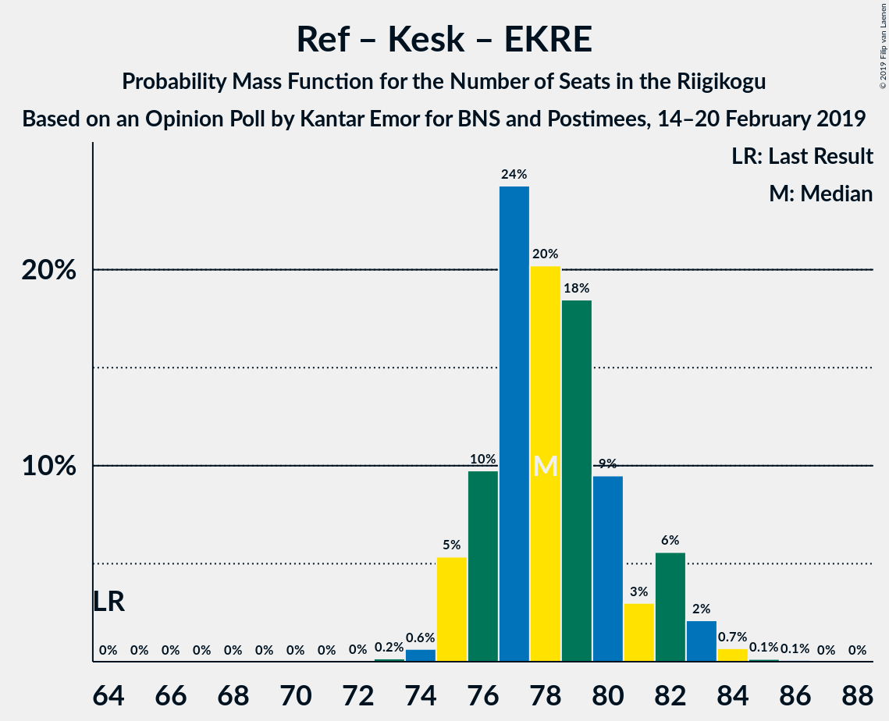

# Opinion Poll by Kantar Emor for BNS and Postimees, 14–20 February 2019

<a href="#voting-intentions">Voting Intentions</a> | <a href="#seats">Seats</a> | <a href="#coalitions">Coalitions</a> | <a href="#technical-information">Technical Information</a>

## Voting Intentions

### Confidence Intervals

| Party | Last Result | Poll Result | 80% Confidence Interval | 90% Confidence Interval | 95% Confidence Interval | 99% Confidence Interval |
|:-----:|:-----------:|:-----------:|:-----------------------:|:-----------------------:|:-----------------------:|:-----------------------:|
| Eesti Reformierakond | 27.7% | 25.7% | 24.2–27.4% |23.7–27.9% |23.3–28.3% |22.6–29.1% |
| Eesti Keskerakond | 24.8% | 24.7% | 23.2–26.4% |22.7–26.9% |22.3–27.3% |21.6–28.1% |
| Eesti Konservatiivne Rahvaerakond | 8.1% | 21.3% | 19.9–22.9% |19.4–23.4% |19.1–23.8% |18.4–24.6% |
| Sotsiaaldemokraatlik Erakond | 15.2% | 10.1% | 9.0–11.3% |8.7–11.6% |8.5–11.9% |8.0–12.5% |
| Erakond Isamaa | 13.7% | 9.2% | 8.2–10.4% |7.9–10.7% |7.7–11.0% |7.3–11.6% |
| Eesti 200 | 0.0% | 5.6% | 4.8–6.5% |4.6–6.8% |4.4–7.1% |4.1–7.5% |
| Erakond Eestimaa Rohelised | 0.9% | 2.0% | 1.6–2.7% |1.5–2.9% |1.4–3.0% |1.2–3.4% |
| Eesti Vabaerakond | 8.7% | 0.9% | 0.7–1.4% |0.6–1.5% |0.5–1.7% |0.4–1.9% |

*Note:* The poll result column reflects the actual value used in the calculations. Published results may vary slightly, and in addition be rounded to fewer digits.

## Seats

### Confidence Intervals

| Party | Last Result | Median | 80% Confidence Interval | 90% Confidence Interval | 95% Confidence Interval | 99% Confidence Interval |
|:-----:|:-----------:|:------:|:-----------------------:|:-----------------------:|:-----------------------:|:-----------------------:|
| <a href="#eesti-reformierakond">Eesti Reformierakond</a> | 30 | 28 | 26–30 |26–31 |25–32 |25–33 |
| <a href="#eesti-keskerakond">Eesti Keskerakond</a> | 27 | 27 | 25–29 |25–29 |24–30 |24–31 |
| <a href="#eesti-konservatiivne-rahvaerakond">Eesti Konservatiivne Rahvaerakond</a> | 7 | 23 | 21–25 |20–25 |20–26 |20–27 |
| <a href="#sotsiaaldemokraatlik-erakond">Sotsiaaldemokraatlik Erakond</a> | 15 | 10 | 9–11 |8–11 |8–12 |8–12 |
| <a href="#erakond-isamaa">Erakond Isamaa</a> | 14 | 8 | 8–10 |7–11 |7–11 |7–11 |
| <a href="#eesti-200">Eesti 200</a> | 0 | 5 | 0–6 |0–6 |0–6 |0–6 |
| <a href="#erakond-eestimaa-rohelised">Erakond Eestimaa Rohelised</a> | 0 | 0 | 0 |0 |0 |0 |
| <a href="#eesti-vabaerakond">Eesti Vabaerakond</a> | 8 | 0 | 0 |0 |0 |0 |

### Eesti Reformierakond

*For a full overview of the results for this party, see the [Eesti Reformierakond](party-eestireformierakond.html) page.*

| Number of Seats | Probability | Accumulated | Special Marks |
|:---------------:|:-----------:|:-----------:|:-------------:|
| 24 | 0.3% | 100% |  |
| 25 | 2% | 99.6% |  |
| 26 | 8% | 97% |  |
| 27 | 23% | 89% |  |
| 28 | 26% | 66% | Median |
| 29 | 19% | 40% |  |
| 30 | 14% | 21% | Last Result |
| 31 | 4% | 7% |  |
| 32 | 3% | 4% |  |
| 33 | 0.7% | 0.8% |  |
| 34 | 0.1% | 0.1% |  |
| 35 | 0% | 0% |  |

### Eesti Keskerakond

*For a full overview of the results for this party, see the [Eesti Keskerakond](party-eestikeskerakond.html) page.*

| Number of Seats | Probability | Accumulated | Special Marks |
|:---------------:|:-----------:|:-----------:|:-------------:|
| 22 | 0.1% | 100% |  |
| 23 | 0.4% | 99.9% |  |
| 24 | 4% | 99.6% |  |
| 25 | 8% | 96% |  |
| 26 | 27% | 88% |  |
| 27 | 20% | 60% | Last Result, Median |
| 28 | 24% | 41% |  |
| 29 | 12% | 17% |  |
| 30 | 4% | 4% |  |
| 31 | 0.7% | 0.9% |  |
| 32 | 0.1% | 0.1% |  |
| 33 | 0% | 0% |  |

### Eesti Konservatiivne Rahvaerakond

*For a full overview of the results for this party, see the [Eesti Konservatiivne Rahvaerakond](party-eestikonservatiivnerahvaerakond.html) page.*

| Number of Seats | Probability | Accumulated | Special Marks |
|:---------------:|:-----------:|:-----------:|:-------------:|
| 7 | 0% | 100% | Last Result |
| 8 | 0% | 100% |  |
| 9 | 0% | 100% |  |
| 10 | 0% | 100% |  |
| 11 | 0% | 100% |  |
| 12 | 0% | 100% |  |
| 13 | 0% | 100% |  |
| 14 | 0% | 100% |  |
| 15 | 0% | 100% |  |
| 16 | 0% | 100% |  |
| 17 | 0% | 100% |  |
| 18 | 0.1% | 100% |  |
| 19 | 0.4% | 99.9% |  |
| 20 | 5% | 99.5% |  |
| 21 | 11% | 95% |  |
| 22 | 23% | 84% |  |
| 23 | 27% | 61% | Median |
| 24 | 23% | 35% |  |
| 25 | 9% | 12% |  |
| 26 | 2% | 3% |  |
| 27 | 0.8% | 0.9% |  |
| 28 | 0.1% | 0.1% |  |
| 29 | 0% | 0% |  |

### Sotsiaaldemokraatlik Erakond

*For a full overview of the results for this party, see the [Sotsiaaldemokraatlik Erakond](party-sotsiaaldemokraatlikerakond.html) page.*

| Number of Seats | Probability | Accumulated | Special Marks |
|:---------------:|:-----------:|:-----------:|:-------------:|
| 7 | 0.4% | 100% |  |
| 8 | 9% | 99.6% |  |
| 9 | 33% | 90% |  |
| 10 | 32% | 57% | Median |
| 11 | 22% | 25% |  |
| 12 | 3% | 3% |  |
| 13 | 0.2% | 0.2% |  |
| 14 | 0% | 0% |  |
| 15 | 0% | 0% | Last Result |

### Erakond Isamaa

*For a full overview of the results for this party, see the [Erakond Isamaa](party-erakondisamaa.html) page.*

| Number of Seats | Probability | Accumulated | Special Marks |
|:---------------:|:-----------:|:-----------:|:-------------:|
| 6 | 0.4% | 100% |  |
| 7 | 6% | 99.6% |  |
| 8 | 45% | 94% | Median |
| 9 | 31% | 49% |  |
| 10 | 13% | 18% |  |
| 11 | 5% | 5% |  |
| 12 | 0.3% | 0.3% |  |
| 13 | 0% | 0% |  |
| 14 | 0% | 0% | Last Result |

### Eesti 200

*For a full overview of the results for this party, see the [Eesti 200](party-eesti200.html) page.*

| Number of Seats | Probability | Accumulated | Special Marks |
|:---------------:|:-----------:|:-----------:|:-------------:|
| 0 | 12% | 100% | Last Result |
| 1 | 0% | 88% |  |
| 2 | 0% | 88% |  |
| 3 | 0% | 88% |  |
| 4 | 14% | 88% |  |
| 5 | 63% | 74% | Median |
| 6 | 11% | 11% |  |
| 7 | 0.4% | 0.5% |  |
| 8 | 0% | 0% |  |

### Erakond Eestimaa Rohelised

*For a full overview of the results for this party, see the [Erakond Eestimaa Rohelised](party-erakondeestimaarohelised.html) page.*

| Number of Seats | Probability | Accumulated | Special Marks |
|:---------------:|:-----------:|:-----------:|:-------------:|
| 0 | 100% | 100% | Last Result, Median |

### Eesti Vabaerakond

*For a full overview of the results for this party, see the [Eesti Vabaerakond](party-eestivabaerakond.html) page.*

| Number of Seats | Probability | Accumulated | Special Marks |
|:---------------:|:-----------:|:-----------:|:-------------:|
| 0 | 100% | 100% | Median |
| 1 | 0% | 0% |  |
| 2 | 0% | 0% |  |
| 3 | 0% | 0% |  |
| 4 | 0% | 0% |  |
| 5 | 0% | 0% |  |
| 6 | 0% | 0% |  |
| 7 | 0% | 0% |  |
| 8 | 0% | 0% | Last Result |

## Coalitions

### Confidence Intervals

| Coalition | Last Result | Median | Majority? | 80% Confidence Interval | 90% Confidence Interval | 95% Confidence Interval | 99% Confidence Interval |
|:---------:|:-----------:|:------:|:---------:|:-----------------------:|:-----------------------:|:-----------------------:|:-----------------------:|
| Eesti Reformierakond – Eesti Keskerakond – Eesti Konservatiivne Rahvaerakond | 64 | 78 | 100% | 76–81 | 75–82 | 75–83 | 74–84 |
| Eesti Reformierakond – Eesti Konservatiivne Rahvaerakond – Erakond Isamaa | 51 | 60 | 100% | 57–63 | 57–63 | 57–65 | 55–66 |
| Eesti Reformierakond – Eesti Keskerakond | 57 | 55 | 99.6% | 53–58 | 52–59 | 52–60 | 51–61 |
| Eesti Reformierakond – Eesti Konservatiivne Rahvaerakond | 37 | 51 | 61% | 49–54 | 48–55 | 48–56 | 47–57 |
| Eesti Keskerakond – Eesti Konservatiivne Rahvaerakond | 34 | 50 | 42% | 48–52 | 47–52 | 47–53 | 46–54 |
| Eesti Reformierakond – Sotsiaaldemokraatlik Erakond – Erakond Isamaa – Eesti Vabaerakond | 67 | 47 | 4% | 44–49 | 44–50 | 43–51 | 42–52 |
| Eesti Reformierakond – Sotsiaaldemokraatlik Erakond – Erakond Isamaa | 59 | 47 | 4% | 44–49 | 44–50 | 43–51 | 42–52 |
| Eesti Keskerakond – Sotsiaaldemokraatlik Erakond – Erakond Isamaa | 56 | 46 | 0.3% | 43–47 | 43–48 | 43–49 | 41–50 |
| Eesti Reformierakond – Sotsiaaldemokraatlik Erakond | 45 | 38 | 0% | 36–40 | 35–41 | 35–42 | 34–43 |
| Eesti Reformierakond – Erakond Isamaa | 44 | 37 | 0% | 35–40 | 34–40 | 34–41 | 33–42 |
| Eesti Keskerakond – Sotsiaaldemokraatlik Erakond | 42 | 37 | 0% | 35–39 | 34–39 | 34–39 | 33–40 |
| Eesti Konservatiivne Rahvaerakond – Sotsiaaldemokraatlik Erakond | 22 | 33 | 0% | 31–35 | 30–35 | 30–36 | 29–37 |

### Eesti Reformierakond – Eesti Keskerakond – Eesti Konservatiivne Rahvaerakond

| Number of Seats | Probability | Accumulated | Special Marks |
|:---------------:|:-----------:|:-----------:|:-------------:|
| 64 | 0% | 100% | Last Result |
| 65 | 0% | 100% |  |
| 66 | 0% | 100% |  |
| 67 | 0% | 100% |  |
| 68 | 0% | 100% |  |
| 69 | 0% | 100% |  |
| 70 | 0% | 100% |  |
| 71 | 0% | 100% |  |
| 72 | 0% | 100% |  |
| 73 | 0.2% | 100% |  |
| 74 | 0.6% | 99.8% |  |
| 75 | 5% | 99.2% |  |
| 76 | 10% | 94% |  |
| 77 | 24% | 84% |  |
| 78 | 20% | 60% | Median |
| 79 | 18% | 40% |  |
| 80 | 9% | 21% |  |
| 81 | 3% | 12% |  |
| 82 | 6% | 9% |  |
| 83 | 2% | 3% |  |
| 84 | 0.7% | 0.9% |  |
| 85 | 0.1% | 0.2% |  |
| 86 | 0.1% | 0.1% |  |
| 87 | 0% | 0% |  |

### Eesti Reformierakond – Eesti Konservatiivne Rahvaerakond – Erakond Isamaa

| Number of Seats | Probability | Accumulated | Special Marks |
|:---------------:|:-----------:|:-----------:|:-------------:|
| 51 | 0% | 100% | Last Result, Majority |
| 52 | 0% | 100% |  |
| 53 | 0% | 100% |  |
| 54 | 0.1% | 100% |  |
| 55 | 0.6% | 99.9% |  |
| 56 | 1.2% | 99.3% |  |
| 57 | 10% | 98% |  |
| 58 | 16% | 88% |  |
| 59 | 19% | 72% | Median |
| 60 | 23% | 53% |  |
| 61 | 10% | 31% |  |
| 62 | 10% | 20% |  |
| 63 | 6% | 10% |  |
| 64 | 2% | 4% |  |
| 65 | 1.1% | 3% |  |
| 66 | 1.3% | 2% |  |
| 67 | 0.3% | 0.3% |  |
| 68 | 0% | 0% |  |

### Eesti Reformierakond – Eesti Keskerakond

| Number of Seats | Probability | Accumulated | Special Marks |
|:---------------:|:-----------:|:-----------:|:-------------:|
| 49 | 0% | 100% |  |
| 50 | 0.3% | 99.9% |  |
| 51 | 1.1% | 99.6% | Majority |
| 52 | 5% | 98.5% |  |
| 53 | 12% | 94% |  |
| 54 | 18% | 82% |  |
| 55 | 19% | 63% | Median |
| 56 | 20% | 45% |  |
| 57 | 11% | 25% | Last Result |
| 58 | 9% | 15% |  |
| 59 | 3% | 6% |  |
| 60 | 2% | 3% |  |
| 61 | 0.6% | 0.8% |  |
| 62 | 0.2% | 0.2% |  |
| 63 | 0% | 0% |  |

### Eesti Reformierakond – Eesti Konservatiivne Rahvaerakond

| Number of Seats | Probability | Accumulated | Special Marks |
|:---------------:|:-----------:|:-----------:|:-------------:|
| 37 | 0% | 100% | Last Result |
| 38 | 0% | 100% |  |
| 39 | 0% | 100% |  |
| 40 | 0% | 100% |  |
| 41 | 0% | 100% |  |
| 42 | 0% | 100% |  |
| 43 | 0% | 100% |  |
| 44 | 0% | 100% |  |
| 45 | 0.1% | 100% |  |
| 46 | 0.3% | 99.9% |  |
| 47 | 2% | 99.7% |  |
| 48 | 4% | 98% |  |
| 49 | 15% | 94% |  |
| 50 | 18% | 79% |  |
| 51 | 22% | 61% | Median, Majority |
| 52 | 16% | 39% |  |
| 53 | 11% | 23% |  |
| 54 | 7% | 12% |  |
| 55 | 3% | 6% |  |
| 56 | 2% | 3% |  |
| 57 | 0.9% | 1.1% |  |
| 58 | 0.1% | 0.2% |  |
| 59 | 0% | 0% |  |

### Eesti Keskerakond – Eesti Konservatiivne Rahvaerakond

| Number of Seats | Probability | Accumulated | Special Marks |
|:---------------:|:-----------:|:-----------:|:-------------:|
| 34 | 0% | 100% | Last Result |
| 35 | 0% | 100% |  |
| 36 | 0% | 100% |  |
| 37 | 0% | 100% |  |
| 38 | 0% | 100% |  |
| 39 | 0% | 100% |  |
| 40 | 0% | 100% |  |
| 41 | 0% | 100% |  |
| 42 | 0% | 100% |  |
| 43 | 0% | 100% |  |
| 44 | 0.1% | 100% |  |
| 45 | 0.3% | 99.9% |  |
| 46 | 1.1% | 99.6% |  |
| 47 | 4% | 98.5% |  |
| 48 | 14% | 95% |  |
| 49 | 24% | 81% |  |
| 50 | 16% | 57% | Median |
| 51 | 23% | 42% | Majority |
| 52 | 15% | 18% |  |
| 53 | 2% | 4% |  |
| 54 | 0.9% | 1.3% |  |
| 55 | 0.3% | 0.4% |  |
| 56 | 0.1% | 0.1% |  |
| 57 | 0% | 0.1% |  |
| 58 | 0% | 0% |  |

### Eesti Reformierakond – Sotsiaaldemokraatlik Erakond – Erakond Isamaa – Eesti Vabaerakond

| Number of Seats | Probability | Accumulated | Special Marks |
|:---------------:|:-----------:|:-----------:|:-------------:|
| 41 | 0.1% | 100% |  |
| 42 | 0.8% | 99.9% |  |
| 43 | 2% | 99.1% |  |
| 44 | 10% | 97% |  |
| 45 | 19% | 87% |  |
| 46 | 12% | 68% | Median |
| 47 | 26% | 56% |  |
| 48 | 12% | 30% |  |
| 49 | 9% | 17% |  |
| 50 | 4% | 8% |  |
| 51 | 2% | 4% | Majority |
| 52 | 1.2% | 2% |  |
| 53 | 0.3% | 0.4% |  |
| 54 | 0.1% | 0.1% |  |
| 55 | 0% | 0% |  |
| 56 | 0% | 0% |  |
| 57 | 0% | 0% |  |
| 58 | 0% | 0% |  |
| 59 | 0% | 0% |  |
| 60 | 0% | 0% |  |
| 61 | 0% | 0% |  |
| 62 | 0% | 0% |  |
| 63 | 0% | 0% |  |
| 64 | 0% | 0% |  |
| 65 | 0% | 0% |  |
| 66 | 0% | 0% |  |
| 67 | 0% | 0% | Last Result |

### Eesti Reformierakond – Sotsiaaldemokraatlik Erakond – Erakond Isamaa

| Number of Seats | Probability | Accumulated | Special Marks |
|:---------------:|:-----------:|:-----------:|:-------------:|
| 41 | 0.1% | 100% |  |
| 42 | 0.8% | 99.9% |  |
| 43 | 2% | 99.1% |  |
| 44 | 10% | 97% |  |
| 45 | 19% | 87% |  |
| 46 | 12% | 68% | Median |
| 47 | 26% | 56% |  |
| 48 | 12% | 30% |  |
| 49 | 9% | 17% |  |
| 50 | 4% | 8% |  |
| 51 | 2% | 4% | Majority |
| 52 | 1.2% | 2% |  |
| 53 | 0.3% | 0.4% |  |
| 54 | 0.1% | 0.1% |  |
| 55 | 0% | 0% |  |
| 56 | 0% | 0% |  |
| 57 | 0% | 0% |  |
| 58 | 0% | 0% |  |
| 59 | 0% | 0% | Last Result |

### Eesti Keskerakond – Sotsiaaldemokraatlik Erakond – Erakond Isamaa

| Number of Seats | Probability | Accumulated | Special Marks |
|:---------------:|:-----------:|:-----------:|:-------------:|
| 40 | 0.1% | 100% |  |
| 41 | 0.4% | 99.9% |  |
| 42 | 2% | 99.4% |  |
| 43 | 10% | 98% |  |
| 44 | 15% | 88% |  |
| 45 | 22% | 73% | Median |
| 46 | 25% | 51% |  |
| 47 | 17% | 26% |  |
| 48 | 6% | 9% |  |
| 49 | 2% | 3% |  |
| 50 | 0.3% | 0.6% |  |
| 51 | 0.2% | 0.3% | Majority |
| 52 | 0.1% | 0.1% |  |
| 53 | 0% | 0% |  |
| 54 | 0% | 0% |  |
| 55 | 0% | 0% |  |
| 56 | 0% | 0% | Last Result |

### Eesti Reformierakond – Sotsiaaldemokraatlik Erakond

| Number of Seats | Probability | Accumulated | Special Marks |
|:---------------:|:-----------:|:-----------:|:-------------:|
| 32 | 0.1% | 100% |  |
| 33 | 0.4% | 99.9% |  |
| 34 | 1.2% | 99.6% |  |
| 35 | 6% | 98% |  |
| 36 | 18% | 92% |  |
| 37 | 14% | 74% |  |
| 38 | 19% | 60% | Median |
| 39 | 20% | 41% |  |
| 40 | 11% | 21% |  |
| 41 | 6% | 10% |  |
| 42 | 2% | 3% |  |
| 43 | 0.6% | 1.1% |  |
| 44 | 0.4% | 0.4% |  |
| 45 | 0% | 0% | Last Result |

### Eesti Reformierakond – Erakond Isamaa

| Number of Seats | Probability | Accumulated | Special Marks |
|:---------------:|:-----------:|:-----------:|:-------------:|
| 32 | 0.2% | 100% |  |
| 33 | 0.6% | 99.8% |  |
| 34 | 6% | 99.2% |  |
| 35 | 8% | 93% |  |
| 36 | 33% | 85% | Median |
| 37 | 23% | 52% |  |
| 38 | 14% | 29% |  |
| 39 | 5% | 15% |  |
| 40 | 6% | 10% |  |
| 41 | 2% | 4% |  |
| 42 | 2% | 2% |  |
| 43 | 0.1% | 0.1% |  |
| 44 | 0% | 0% | Last Result |

### Eesti Keskerakond – Sotsiaaldemokraatlik Erakond

| Number of Seats | Probability | Accumulated | Special Marks |
|:---------------:|:-----------:|:-----------:|:-------------:|
| 32 | 0.2% | 100% |  |
| 33 | 0.7% | 99.8% |  |
| 34 | 5% | 99.1% |  |
| 35 | 14% | 94% |  |
| 36 | 23% | 80% |  |
| 37 | 21% | 57% | Median |
| 38 | 23% | 36% |  |
| 39 | 11% | 13% |  |
| 40 | 1.5% | 2% |  |
| 41 | 0.3% | 0.5% |  |
| 42 | 0.1% | 0.2% | Last Result |
| 43 | 0.1% | 0.1% |  |
| 44 | 0% | 0% |  |

### Eesti Konservatiivne Rahvaerakond – Sotsiaaldemokraatlik Erakond

| Number of Seats | Probability | Accumulated | Special Marks |
|:---------------:|:-----------:|:-----------:|:-------------:|
| 22 | 0% | 100% | Last Result |
| 23 | 0% | 100% |  |
| 24 | 0% | 100% |  |
| 25 | 0% | 100% |  |
| 26 | 0% | 100% |  |
| 27 | 0% | 100% |  |
| 28 | 0.3% | 100% |  |
| 29 | 1.0% | 99.6% |  |
| 30 | 7% | 98.6% |  |
| 31 | 15% | 92% |  |
| 32 | 19% | 76% |  |
| 33 | 31% | 57% | Median |
| 34 | 14% | 26% |  |
| 35 | 9% | 12% |  |
| 36 | 2% | 3% |  |
| 37 | 0.7% | 0.8% |  |
| 38 | 0.1% | 0.1% |  |
| 39 | 0% | 0% |  |

## Technical Information

### Opinion Poll

+ **Polling firm:** Kantar Emor
+ **Commissioner(s):** BNS and Postimees
+ **Fieldwork period:** 14–20 February 2019

### Calculations

+ **Sample size:** 1181
+ **Simulations done:** 1,048,576
+ **Error estimate:** 1.72%

