# Opinion Poll by Kantar Emor for BNS and Postimees, 26–28 February 2019

<a href="#voting-intentions">Voting Intentions</a> | <a href="#seats">Seats</a> | <a href="#coalitions">Coalitions</a> | <a href="#technical-information">Technical Information</a>

## Voting Intentions

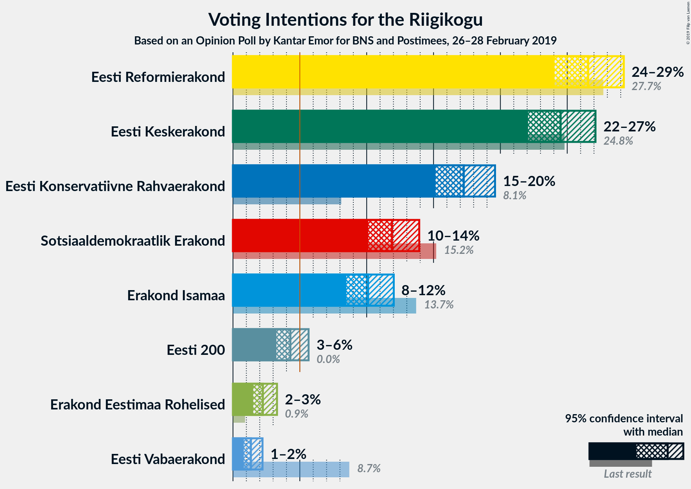

### Confidence Intervals

| Party | Last Result | Poll Result | 80% Confidence Interval | 90% Confidence Interval | 95% Confidence Interval | 99% Confidence Interval |
|:-----:|:-----------:|:-----------:|:-----------------------:|:-----------------------:|:-----------------------:|:-----------------------:|
| Eesti Reformierakond | 27.7% | 26.6% | 24.9–28.3% |24.4–28.8% |24.1–29.2% |23.3–30.1% |
| Eesti Keskerakond | 24.8% | 24.5% | 22.9–26.2% |22.5–26.7% |22.1–27.1% |21.3–28.0% |
| Eesti Konservatiivne Rahvaerakond | 8.1% | 17.3% | 15.9–18.8% |15.5–19.2% |15.2–19.6% |14.5–20.3% |
| Sotsiaaldemokraatlik Erakond | 15.2% | 11.9% | 10.7–13.2% |10.4–13.6% |10.1–13.9% |9.6–14.6% |
| Erakond Isamaa | 13.7% | 10.1% | 9.0–11.4% |8.7–11.7% |8.5–12.0% |8.0–12.6% |
| Eesti 200 | 0.0% | 4.3% | 3.6–5.2% |3.4–5.4% |3.2–5.7% |2.9–6.1% |
| Erakond Eestimaa Rohelised | 0.9% | 2.2% | 1.8–2.9% |1.6–3.1% |1.5–3.3% |1.3–3.6% |
| Eesti Vabaerakond | 8.7% | 1.3% | 1.0–1.9% |0.9–2.1% |0.8–2.2% |0.7–2.5% |

*Note:* The poll result column reflects the actual value used in the calculations. Published results may vary slightly, and in addition be rounded to fewer digits.

## Seats

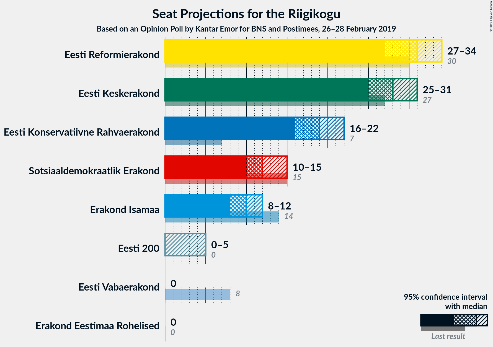

### Confidence Intervals

| Party | Last Result | Median | 80% Confidence Interval | 90% Confidence Interval | 95% Confidence Interval | 99% Confidence Interval |
|:-----:|:-----------:|:------:|:-----------------------:|:-----------------------:|:-----------------------:|:-----------------------:|
| <a href="#eesti-reformierakond">Eesti Reformierakond</a> | 30 | 31 | 29–33 |28–34 |27–34 |26–35 |
| <a href="#eesti-keskerakond">Eesti Keskerakond</a> | 27 | 28 | 26–30 |25–31 |25–31 |24–32 |
| <a href="#eesti-konservatiivne-rahvaerakond">Eesti Konservatiivne Rahvaerakond</a> | 7 | 19 | 17–21 |16–22 |16–22 |15–23 |
| <a href="#sotsiaaldemokraatlik-erakond">Sotsiaaldemokraatlik Erakond</a> | 15 | 12 | 11–14 |10–14 |10–15 |10–15 |
| <a href="#erakond-isamaa">Erakond Isamaa</a> | 14 | 10 | 9–12 |9–12 |8–12 |8–13 |
| <a href="#eesti-200">Eesti 200</a> | 0 | 0 | 0–4 |0–5 |0–5 |0–5 |
| <a href="#erakond-eestimaa-rohelised">Erakond Eestimaa Rohelised</a> | 0 | 0 | 0 |0 |0 |0 |
| <a href="#eesti-vabaerakond">Eesti Vabaerakond</a> | 8 | 0 | 0 |0 |0 |0 |

### Eesti Reformierakond

*For a full overview of the results for this party, see the [Eesti Reformierakond](party-eestireformierakond.html) page.*

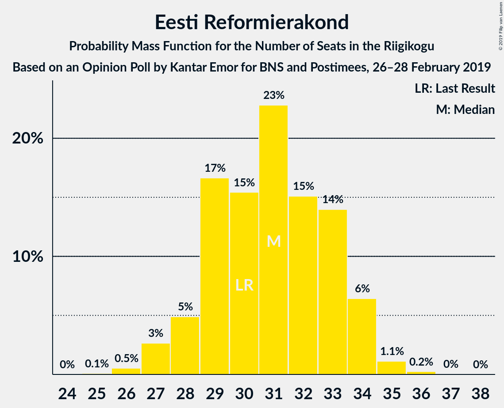

| Number of Seats | Probability | Accumulated | Special Marks |
|:---------------:|:-----------:|:-----------:|:-------------:|
| 25 | 0.1% | 100% |  |
| 26 | 0.5% | 99.9% |  |
| 27 | 3% | 99.4% |  |
| 28 | 5% | 97% |  |
| 29 | 17% | 92% |  |
| 30 | 15% | 75% | Last Result |
| 31 | 23% | 60% | Median |
| 32 | 15% | 37% |  |
| 33 | 14% | 22% |  |
| 34 | 6% | 8% |  |
| 35 | 1.1% | 1.4% |  |
| 36 | 0.2% | 0.3% |  |
| 37 | 0% | 0.1% |  |
| 38 | 0% | 0% |  |

### Eesti Keskerakond

*For a full overview of the results for this party, see the [Eesti Keskerakond](party-eestikeskerakond.html) page.*

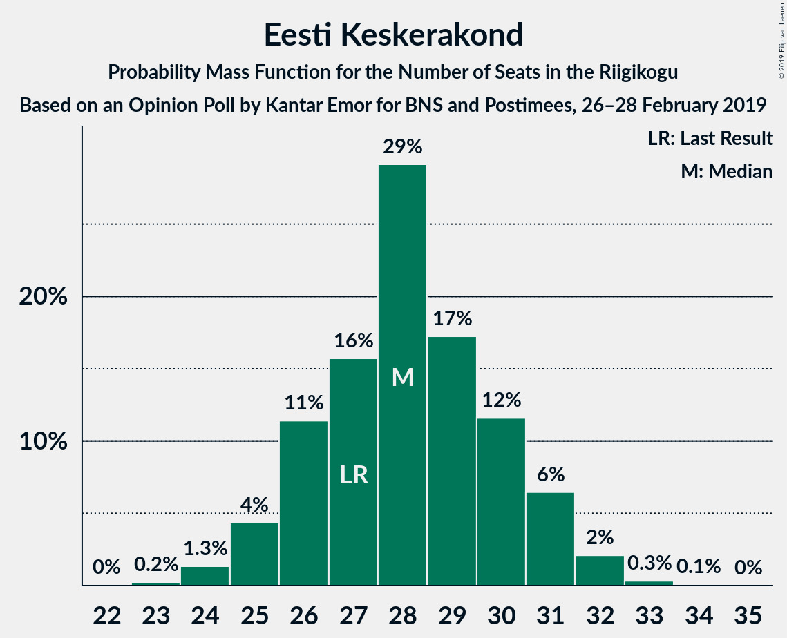

| Number of Seats | Probability | Accumulated | Special Marks |
|:---------------:|:-----------:|:-----------:|:-------------:|
| 23 | 0.2% | 100% |  |
| 24 | 1.0% | 99.8% |  |
| 25 | 4% | 98.8% |  |
| 26 | 11% | 94% |  |
| 27 | 15% | 83% | Last Result |
| 28 | 33% | 68% | Median |
| 29 | 16% | 35% |  |
| 30 | 12% | 19% |  |
| 31 | 5% | 8% |  |
| 32 | 2% | 2% |  |
| 33 | 0.3% | 0.4% |  |
| 34 | 0.1% | 0.1% |  |
| 35 | 0% | 0% |  |

### Eesti Konservatiivne Rahvaerakond

*For a full overview of the results for this party, see the [Eesti Konservatiivne Rahvaerakond](party-eestikonservatiivnerahvaerakond.html) page.*

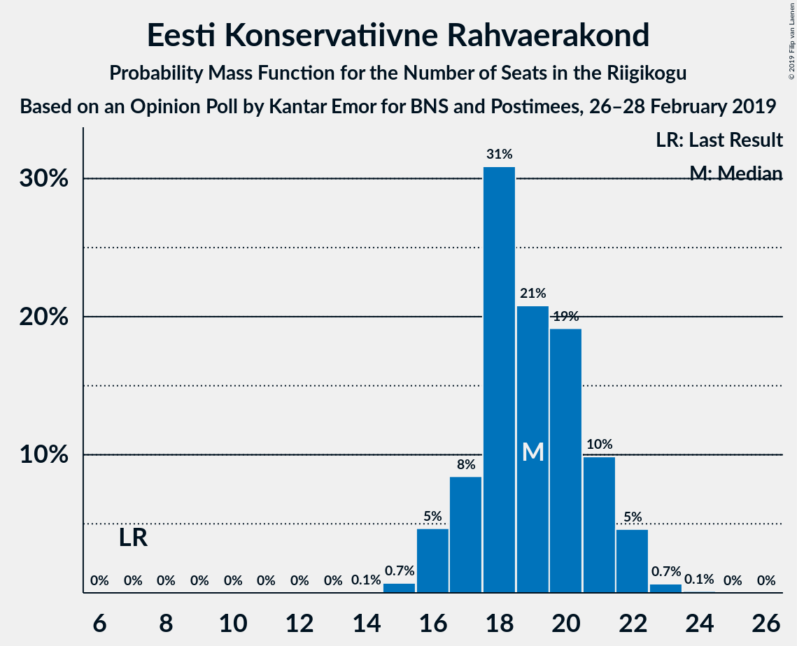

| Number of Seats | Probability | Accumulated | Special Marks |
|:---------------:|:-----------:|:-----------:|:-------------:|
| 7 | 0% | 100% | Last Result |
| 8 | 0% | 100% |  |
| 9 | 0% | 100% |  |
| 10 | 0% | 100% |  |
| 11 | 0% | 100% |  |
| 12 | 0% | 100% |  |
| 13 | 0% | 100% |  |
| 14 | 0.1% | 100% |  |
| 15 | 0.7% | 99.9% |  |
| 16 | 5% | 99.2% |  |
| 17 | 8% | 95% |  |
| 18 | 31% | 86% |  |
| 19 | 21% | 55% | Median |
| 20 | 19% | 34% |  |
| 21 | 10% | 15% |  |
| 22 | 5% | 5% |  |
| 23 | 0.7% | 0.8% |  |
| 24 | 0.1% | 0.1% |  |
| 25 | 0% | 0% |  |

### Sotsiaaldemokraatlik Erakond

*For a full overview of the results for this party, see the [Sotsiaaldemokraatlik Erakond](party-sotsiaaldemokraatlikerakond.html) page.*

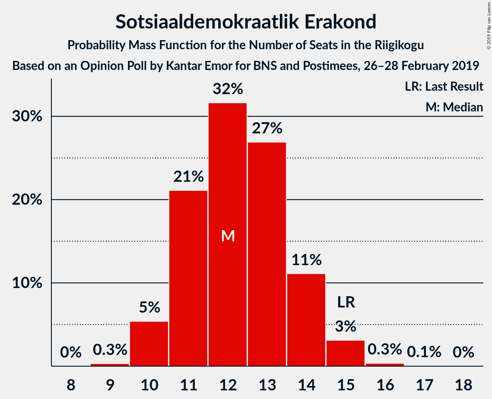

| Number of Seats | Probability | Accumulated | Special Marks |
|:---------------:|:-----------:|:-----------:|:-------------:|
| 9 | 0.3% | 100% |  |
| 10 | 5% | 99.7% |  |
| 11 | 21% | 94% |  |
| 12 | 32% | 73% | Median |
| 13 | 27% | 42% |  |
| 14 | 11% | 15% |  |
| 15 | 3% | 4% | Last Result |
| 16 | 0.3% | 0.4% |  |
| 17 | 0.1% | 0.1% |  |
| 18 | 0% | 0% |  |

### Erakond Isamaa

*For a full overview of the results for this party, see the [Erakond Isamaa](party-erakondisamaa.html) page.*

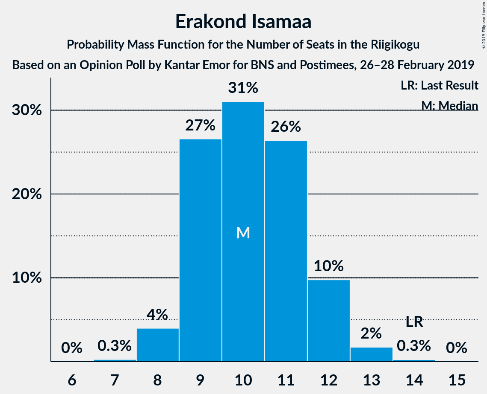

| Number of Seats | Probability | Accumulated | Special Marks |
|:---------------:|:-----------:|:-----------:|:-------------:|
| 7 | 0.3% | 100% |  |
| 8 | 4% | 99.7% |  |
| 9 | 27% | 96% |  |
| 10 | 31% | 69% | Median |
| 11 | 26% | 38% |  |
| 12 | 10% | 12% |  |
| 13 | 2% | 2% |  |
| 14 | 0.3% | 0.3% | Last Result |
| 15 | 0% | 0% |  |

### Eesti 200

*For a full overview of the results for this party, see the [Eesti 200](party-eesti200.html) page.*

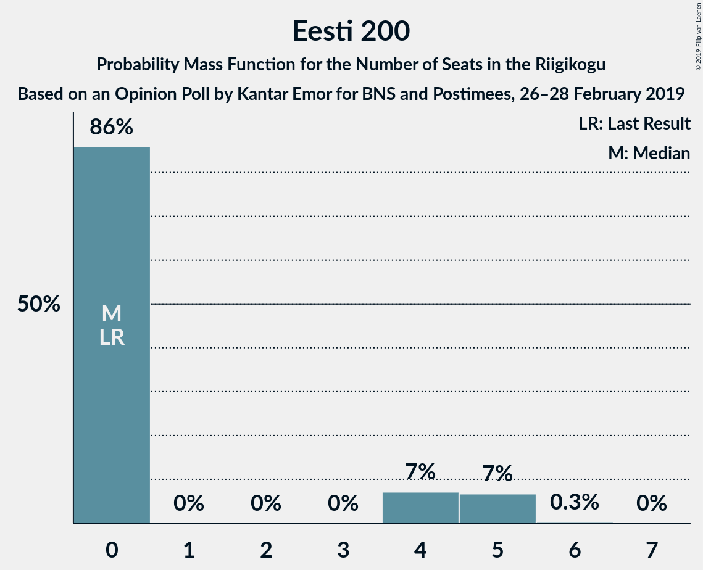

| Number of Seats | Probability | Accumulated | Special Marks |
|:---------------:|:-----------:|:-----------:|:-------------:|
| 0 | 86% | 100% | Last Result, Median |
| 1 | 0% | 14% |  |
| 2 | 0% | 14% |  |
| 3 | 0% | 14% |  |
| 4 | 7% | 14% |  |
| 5 | 7% | 7% |  |
| 6 | 0.3% | 0.3% |  |
| 7 | 0% | 0% |  |

### Erakond Eestimaa Rohelised

*For a full overview of the results for this party, see the [Erakond Eestimaa Rohelised](party-erakondeestimaarohelised.html) page.*

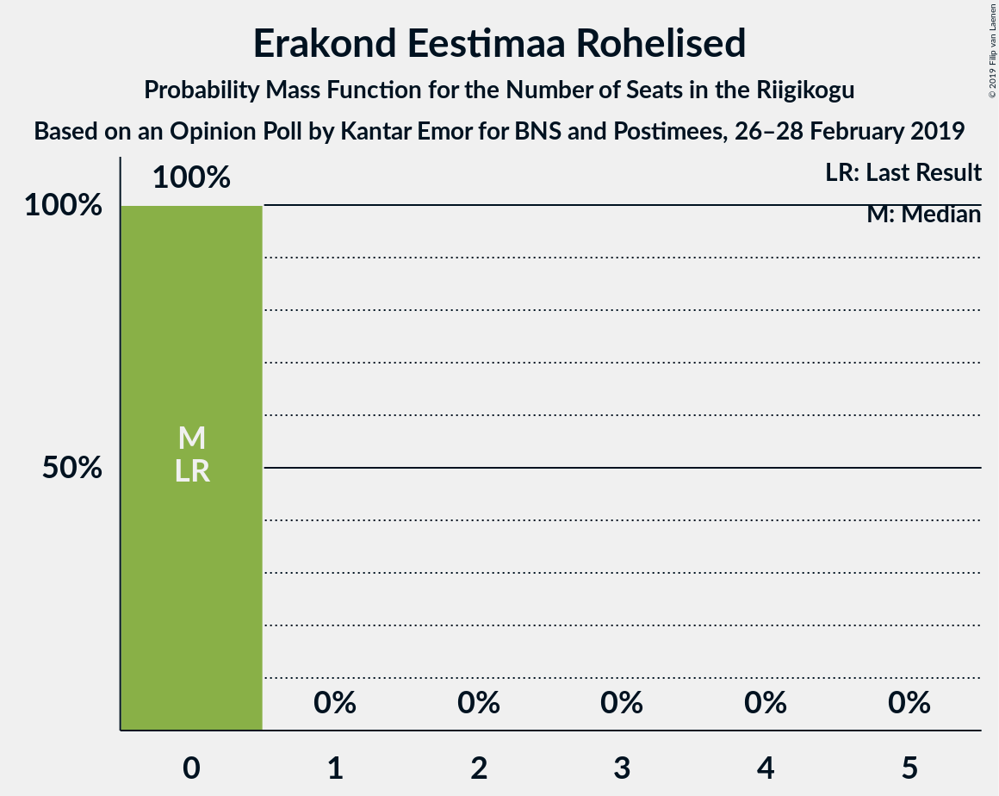

| Number of Seats | Probability | Accumulated | Special Marks |
|:---------------:|:-----------:|:-----------:|:-------------:|
| 0 | 100% | 100% | Last Result, Median |

### Eesti Vabaerakond

*For a full overview of the results for this party, see the [Eesti Vabaerakond](party-eestivabaerakond.html) page.*

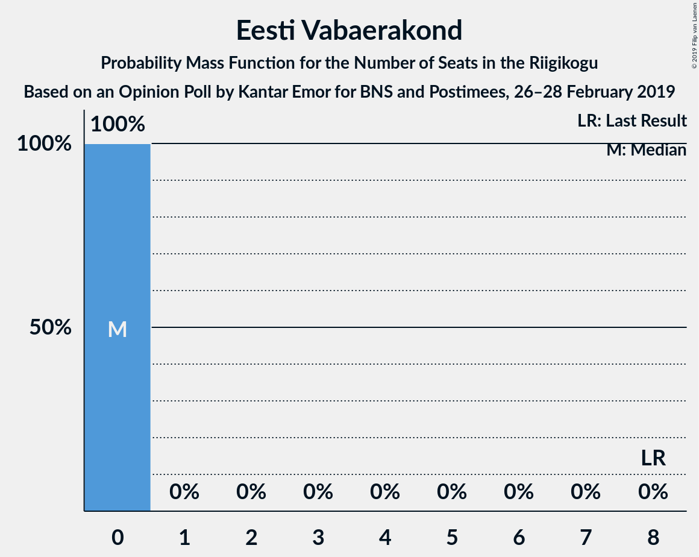

| Number of Seats | Probability | Accumulated | Special Marks |
|:---------------:|:-----------:|:-----------:|:-------------:|
| 0 | 100% | 100% | Median |
| 1 | 0% | 0% |  |
| 2 | 0% | 0% |  |
| 3 | 0% | 0% |  |
| 4 | 0% | 0% |  |
| 5 | 0% | 0% |  |
| 6 | 0% | 0% |  |
| 7 | 0% | 0% |  |
| 8 | 0% | 0% | Last Result |

## Coalitions

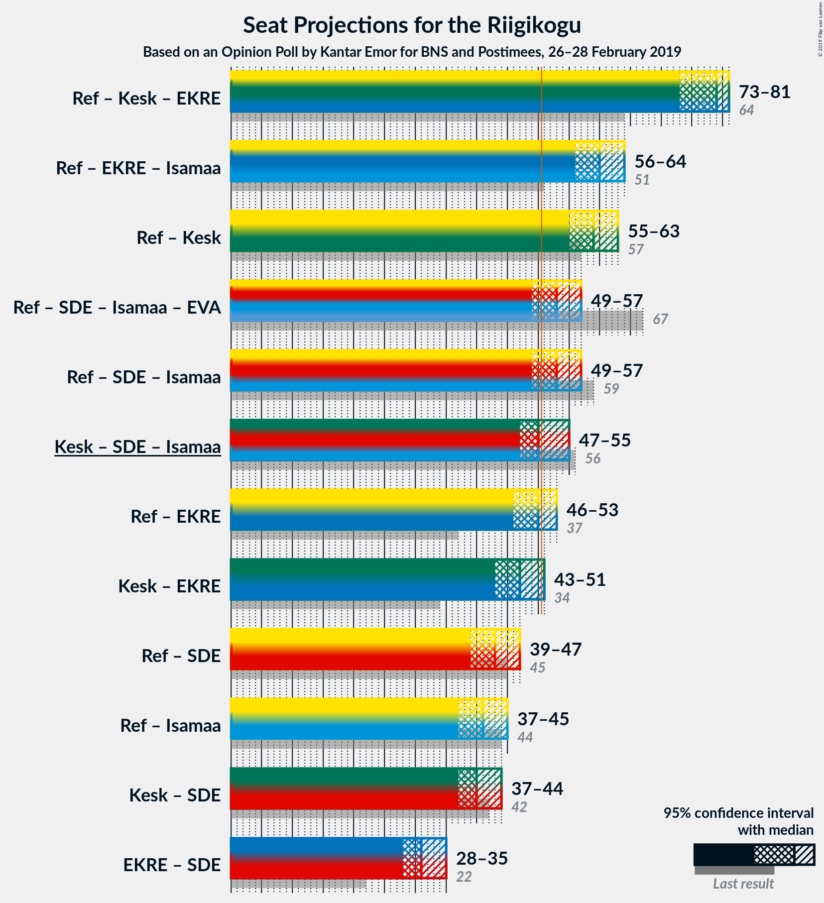

### Confidence Intervals

| Coalition | Last Result | Median | Majority? | 80% Confidence Interval | 90% Confidence Interval | 95% Confidence Interval | 99% Confidence Interval |
|:---------:|:-----------:|:------:|:---------:|:-----------------------:|:-----------------------:|:-----------------------:|:-----------------------:|
| Eesti Reformierakond – Eesti Keskerakond – Eesti Konservatiivne Rahvaerakond | 64 | 79 | 100% | 75–80 | 74–81 | 73–81 | 72–82 |
| Eesti Reformierakond – Eesti Konservatiivne Rahvaerakond – Erakond Isamaa | 51 | 60 | 100% | 57–63 | 56–63 | 56–64 | 54–65 |
| Eesti Reformierakond – Eesti Keskerakond | 57 | 59 | 100% | 56–62 | 55–62 | 55–63 | 54–64 |
| Eesti Reformierakond – Sotsiaaldemokraatlik Erakond – Erakond Isamaa – Eesti Vabaerakond | 67 | 53 | 92% | 51–56 | 50–56 | 49–57 | 48–58 |
| Eesti Reformierakond – Sotsiaaldemokraatlik Erakond – Erakond Isamaa | 59 | 53 | 92% | 51–56 | 50–56 | 49–57 | 48–58 |
| Eesti Keskerakond – Sotsiaaldemokraatlik Erakond – Erakond Isamaa | 56 | 50 | 43% | 48–53 | 48–54 | 47–55 | 45–56 |
| Eesti Reformierakond – Eesti Konservatiivne Rahvaerakond | 37 | 50 | 45% | 47–52 | 46–53 | 46–53 | 44–55 |
| Eesti Keskerakond – Eesti Konservatiivne Rahvaerakond | 34 | 47 | 3% | 44–50 | 43–50 | 43–51 | 42–52 |
| Eesti Reformierakond – Sotsiaaldemokraatlik Erakond | 45 | 43 | 0% | 41–46 | 40–46 | 39–47 | 38–48 |
| Eesti Reformierakond – Erakond Isamaa | 44 | 41 | 0% | 39–44 | 38–44 | 37–45 | 36–46 |
| Eesti Keskerakond – Sotsiaaldemokraatlik Erakond | 42 | 40 | 0% | 38–43 | 37–43 | 37–44 | 36–45 |
| Eesti Konservatiivne Rahvaerakond – Sotsiaaldemokraatlik Erakond | 22 | 31 | 0% | 29–34 | 28–34 | 28–35 | 27–36 |

### Eesti Reformierakond – Eesti Keskerakond – Eesti Konservatiivne Rahvaerakond

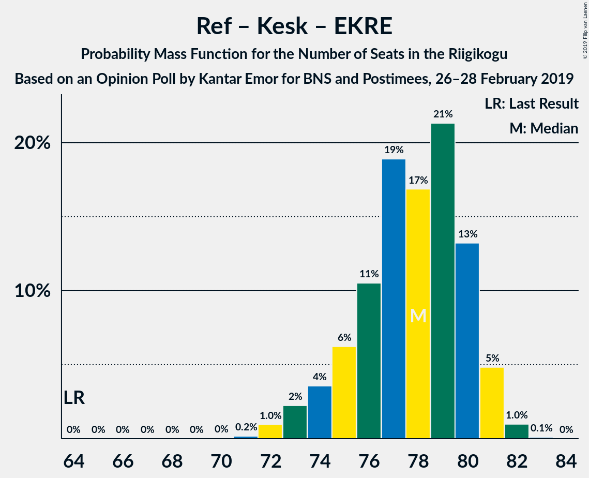

| Number of Seats | Probability | Accumulated | Special Marks |
|:---------------:|:-----------:|:-----------:|:-------------:|
| 64 | 0% | 100% | Last Result |
| 65 | 0% | 100% |  |
| 66 | 0% | 100% |  |
| 67 | 0% | 100% |  |
| 68 | 0% | 100% |  |
| 69 | 0% | 100% |  |
| 70 | 0% | 100% |  |
| 71 | 0.2% | 100% |  |
| 72 | 1.0% | 99.7% |  |
| 73 | 3% | 98.7% |  |
| 74 | 3% | 96% |  |
| 75 | 6% | 92% |  |
| 76 | 10% | 87% |  |
| 77 | 15% | 77% |  |
| 78 | 12% | 62% | Median |
| 79 | 27% | 50% |  |
| 80 | 18% | 23% |  |
| 81 | 4% | 5% |  |
| 82 | 1.0% | 1.1% |  |
| 83 | 0.1% | 0.1% |  |
| 84 | 0% | 0% |  |

### Eesti Reformierakond – Eesti Konservatiivne Rahvaerakond – Erakond Isamaa

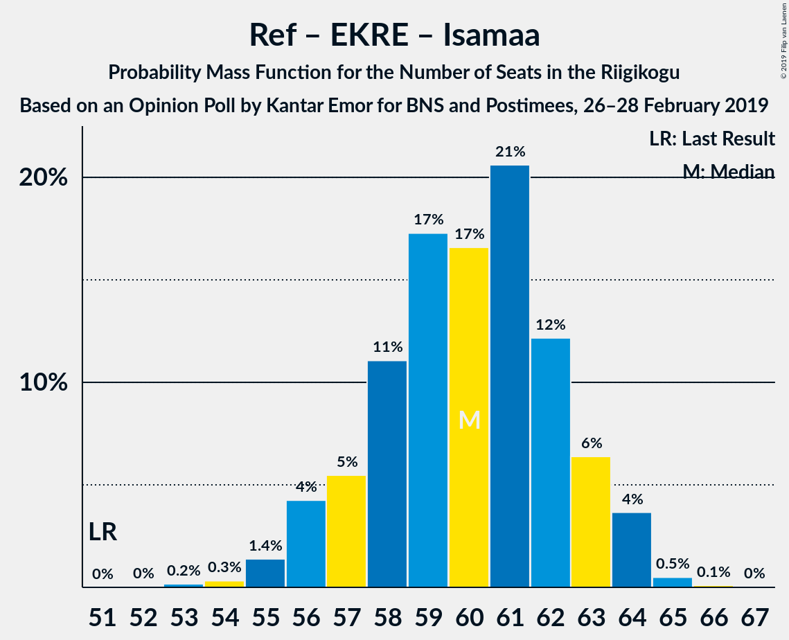

| Number of Seats | Probability | Accumulated | Special Marks |
|:---------------:|:-----------:|:-----------:|:-------------:|
| 51 | 0% | 100% | Last Result, Majority |
| 52 | 0% | 100% |  |
| 53 | 0.2% | 100% |  |
| 54 | 0.3% | 99.8% |  |
| 55 | 1.4% | 99.5% |  |
| 56 | 4% | 98% |  |
| 57 | 5% | 94% |  |
| 58 | 11% | 88% |  |
| 59 | 17% | 77% |  |
| 60 | 17% | 60% | Median |
| 61 | 21% | 43% |  |
| 62 | 12% | 23% |  |
| 63 | 6% | 11% |  |
| 64 | 4% | 4% |  |
| 65 | 0.5% | 0.6% |  |
| 66 | 0.1% | 0.1% |  |
| 67 | 0% | 0% |  |

### Eesti Reformierakond – Eesti Keskerakond

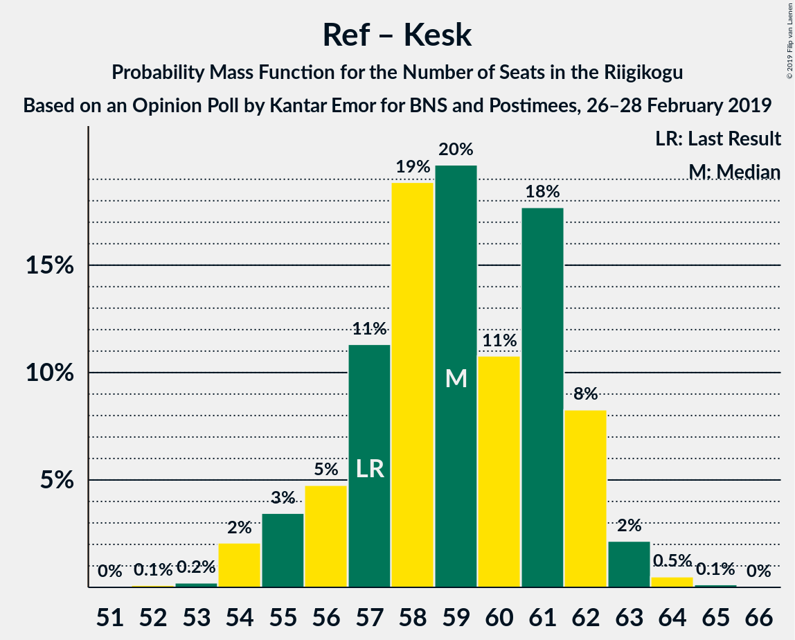

| Number of Seats | Probability | Accumulated | Special Marks |
|:---------------:|:-----------:|:-----------:|:-------------:|
| 52 | 0.1% | 100% |  |
| 53 | 0.2% | 99.9% |  |
| 54 | 2% | 99.7% |  |
| 55 | 3% | 98% |  |
| 56 | 5% | 94% |  |
| 57 | 11% | 89% | Last Result |
| 58 | 19% | 78% |  |
| 59 | 20% | 59% | Median |
| 60 | 11% | 40% |  |
| 61 | 18% | 29% |  |
| 62 | 8% | 11% |  |
| 63 | 2% | 3% |  |
| 64 | 0.5% | 0.6% |  |
| 65 | 0.1% | 0.1% |  |
| 66 | 0% | 0% |  |

### Eesti Reformierakond – Sotsiaaldemokraatlik Erakond – Erakond Isamaa – Eesti Vabaerakond

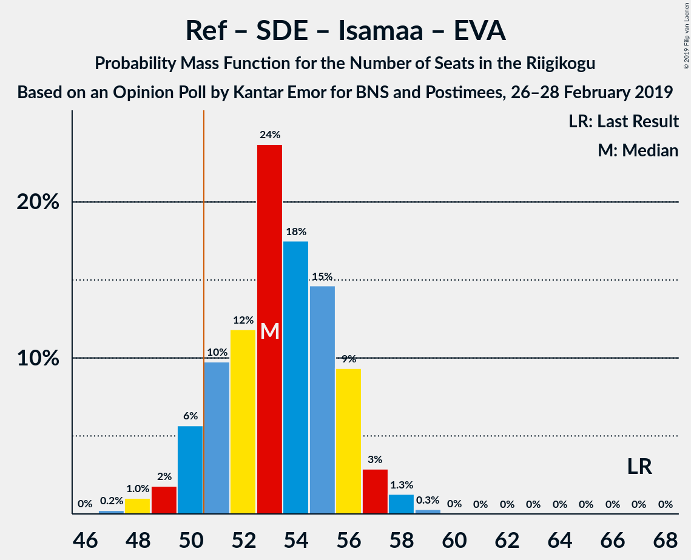

| Number of Seats | Probability | Accumulated | Special Marks |
|:---------------:|:-----------:|:-----------:|:-------------:|
| 47 | 0.2% | 100% |  |
| 48 | 1.3% | 99.8% |  |
| 49 | 2% | 98% |  |
| 50 | 5% | 96% |  |
| 51 | 11% | 92% | Majority |
| 52 | 10% | 81% |  |
| 53 | 21% | 71% | Median |
| 54 | 20% | 49% |  |
| 55 | 18% | 30% |  |
| 56 | 7% | 11% |  |
| 57 | 3% | 5% |  |
| 58 | 1.4% | 2% |  |
| 59 | 0.3% | 0.4% |  |
| 60 | 0.1% | 0.1% |  |
| 61 | 0% | 0% |  |
| 62 | 0% | 0% |  |
| 63 | 0% | 0% |  |
| 64 | 0% | 0% |  |
| 65 | 0% | 0% |  |
| 66 | 0% | 0% |  |
| 67 | 0% | 0% | Last Result |

### Eesti Reformierakond – Sotsiaaldemokraatlik Erakond – Erakond Isamaa

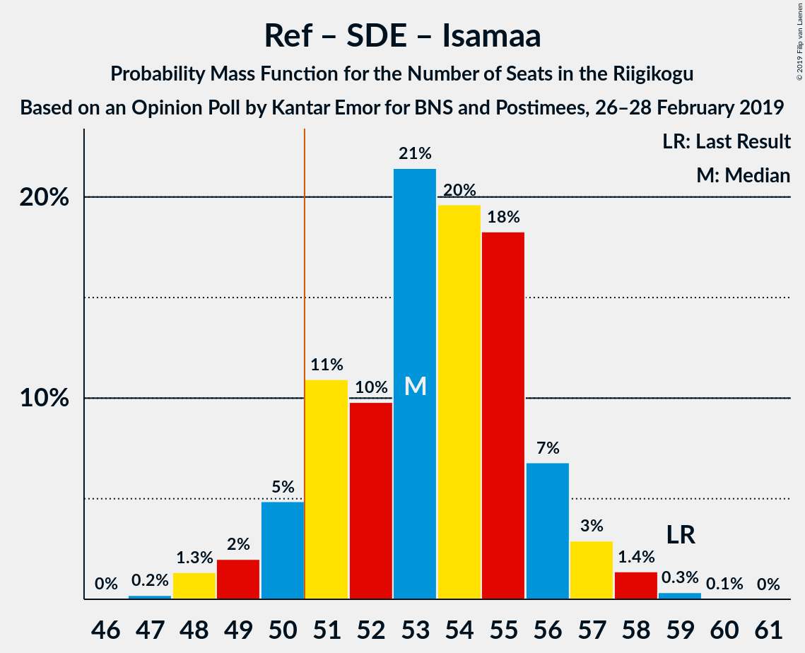

| Number of Seats | Probability | Accumulated | Special Marks |
|:---------------:|:-----------:|:-----------:|:-------------:|
| 47 | 0.2% | 100% |  |
| 48 | 1.3% | 99.8% |  |
| 49 | 2% | 98% |  |
| 50 | 5% | 96% |  |
| 51 | 11% | 92% | Majority |
| 52 | 10% | 81% |  |
| 53 | 21% | 71% | Median |
| 54 | 20% | 49% |  |
| 55 | 18% | 30% |  |
| 56 | 7% | 11% |  |
| 57 | 3% | 5% |  |
| 58 | 1.4% | 2% |  |
| 59 | 0.3% | 0.4% | Last Result |
| 60 | 0.1% | 0.1% |  |
| 61 | 0% | 0% |  |

### Eesti Keskerakond – Sotsiaaldemokraatlik Erakond – Erakond Isamaa

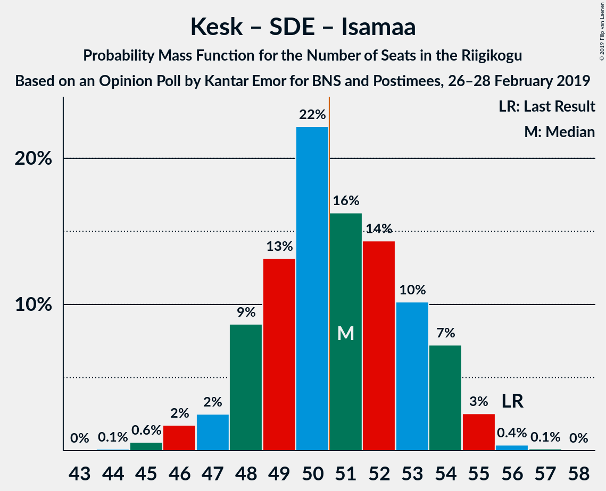

| Number of Seats | Probability | Accumulated | Special Marks |
|:---------------:|:-----------:|:-----------:|:-------------:|
| 44 | 0.2% | 100% |  |
| 45 | 0.4% | 99.8% |  |
| 46 | 1.2% | 99.5% |  |
| 47 | 2% | 98% |  |
| 48 | 9% | 96% |  |
| 49 | 16% | 87% |  |
| 50 | 28% | 71% | Median |
| 51 | 14% | 43% | Majority |
| 52 | 13% | 29% |  |
| 53 | 7% | 16% |  |
| 54 | 7% | 9% |  |
| 55 | 2% | 3% |  |
| 56 | 0.5% | 0.7% | Last Result |
| 57 | 0.2% | 0.2% |  |
| 58 | 0% | 0% |  |

### Eesti Reformierakond – Eesti Konservatiivne Rahvaerakond

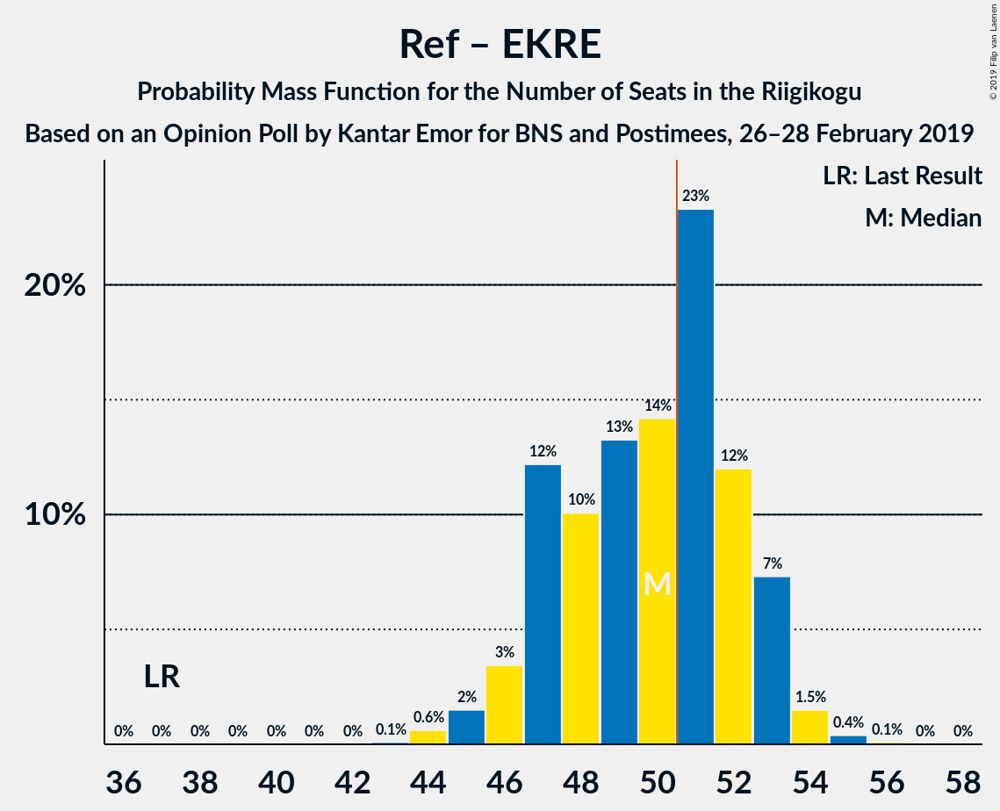

| Number of Seats | Probability | Accumulated | Special Marks |
|:---------------:|:-----------:|:-----------:|:-------------:|
| 37 | 0% | 100% | Last Result |
| 38 | 0% | 100% |  |
| 39 | 0% | 100% |  |
| 40 | 0% | 100% |  |
| 41 | 0% | 100% |  |
| 42 | 0% | 100% |  |
| 43 | 0.1% | 100% |  |
| 44 | 0.6% | 99.9% |  |
| 45 | 2% | 99.3% |  |
| 46 | 3% | 98% |  |
| 47 | 12% | 94% |  |
| 48 | 10% | 82% |  |
| 49 | 13% | 72% |  |
| 50 | 14% | 59% | Median |
| 51 | 23% | 45% | Majority |
| 52 | 12% | 21% |  |
| 53 | 7% | 9% |  |
| 54 | 1.5% | 2% |  |
| 55 | 0.4% | 0.5% |  |
| 56 | 0.1% | 0.1% |  |
| 57 | 0% | 0% |  |

### Eesti Keskerakond – Eesti Konservatiivne Rahvaerakond

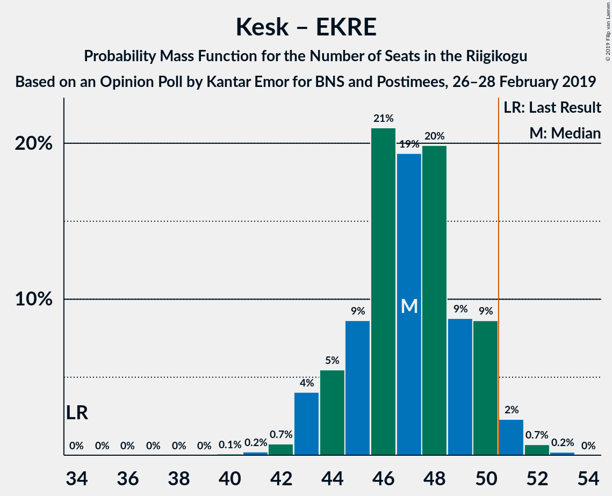

| Number of Seats | Probability | Accumulated | Special Marks |
|:---------------:|:-----------:|:-----------:|:-------------:|
| 34 | 0% | 100% | Last Result |
| 35 | 0% | 100% |  |
| 36 | 0% | 100% |  |
| 37 | 0% | 100% |  |
| 38 | 0% | 100% |  |
| 39 | 0% | 100% |  |
| 40 | 0.1% | 100% |  |
| 41 | 0.2% | 99.9% |  |
| 42 | 0.7% | 99.7% |  |
| 43 | 4% | 99.0% |  |
| 44 | 5% | 95% |  |
| 45 | 9% | 89% |  |
| 46 | 21% | 81% |  |
| 47 | 19% | 60% | Median |
| 48 | 20% | 40% |  |
| 49 | 9% | 21% |  |
| 50 | 9% | 12% |  |
| 51 | 2% | 3% | Majority |
| 52 | 0.7% | 0.9% |  |
| 53 | 0.2% | 0.2% |  |
| 54 | 0% | 0% |  |

### Eesti Reformierakond – Sotsiaaldemokraatlik Erakond

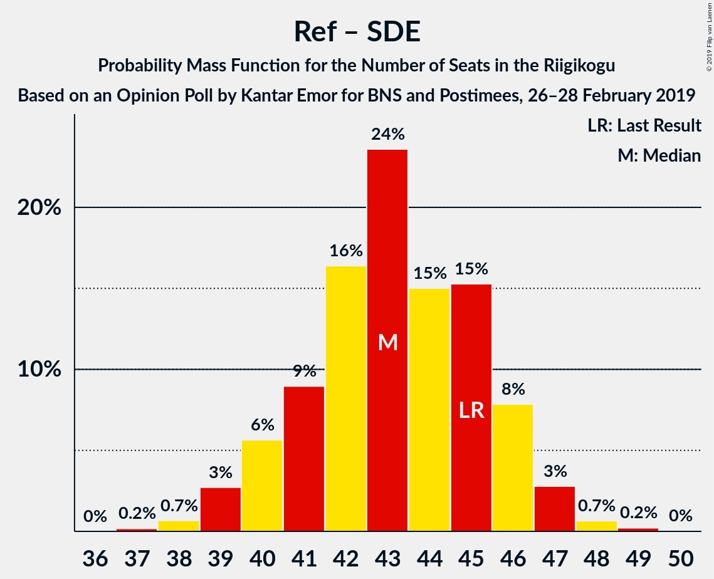

| Number of Seats | Probability | Accumulated | Special Marks |
|:---------------:|:-----------:|:-----------:|:-------------:|
| 37 | 0.2% | 100% |  |
| 38 | 0.7% | 99.8% |  |
| 39 | 3% | 99.1% |  |
| 40 | 6% | 96% |  |
| 41 | 9% | 91% |  |
| 42 | 16% | 82% |  |
| 43 | 24% | 65% | Median |
| 44 | 15% | 42% |  |
| 45 | 15% | 27% | Last Result |
| 46 | 8% | 12% |  |
| 47 | 3% | 4% |  |
| 48 | 0.7% | 0.9% |  |
| 49 | 0.2% | 0.2% |  |
| 50 | 0% | 0% |  |

### Eesti Reformierakond – Erakond Isamaa

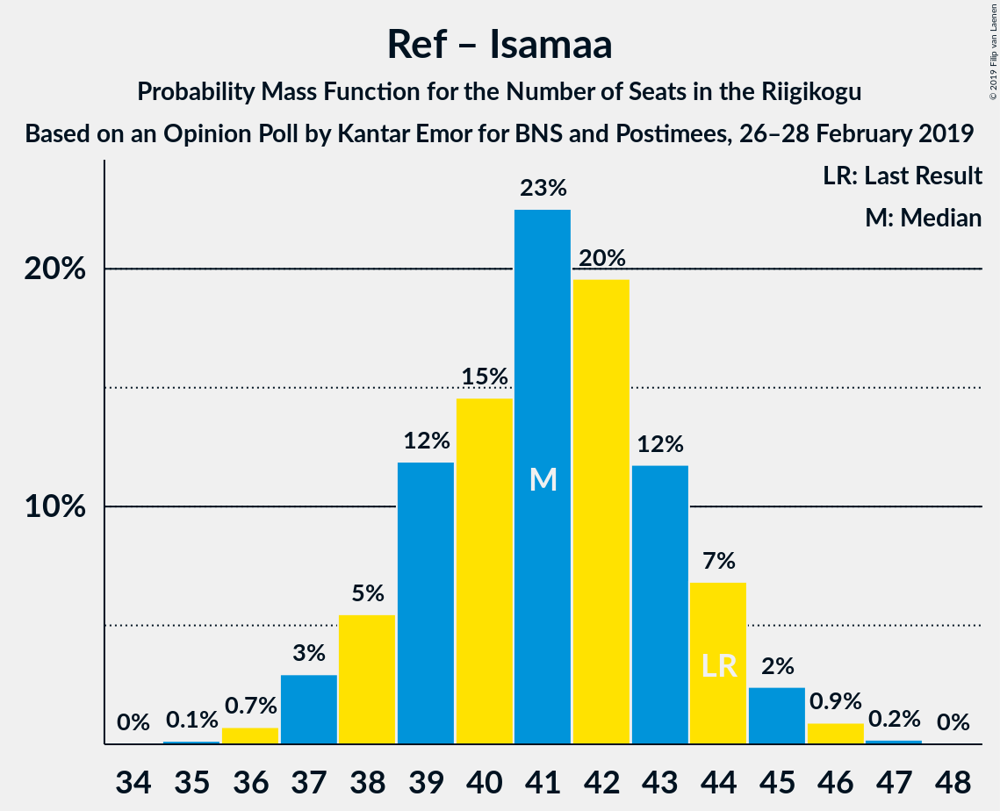

| Number of Seats | Probability | Accumulated | Special Marks |
|:---------------:|:-----------:|:-----------:|:-------------:|
| 35 | 0.1% | 100% |  |
| 36 | 0.7% | 99.8% |  |
| 37 | 3% | 99.1% |  |
| 38 | 5% | 96% |  |
| 39 | 12% | 91% |  |
| 40 | 15% | 79% |  |
| 41 | 23% | 64% | Median |
| 42 | 20% | 42% |  |
| 43 | 12% | 22% |  |
| 44 | 7% | 10% | Last Result |
| 45 | 2% | 4% |  |
| 46 | 0.9% | 1.1% |  |
| 47 | 0.2% | 0.2% |  |
| 48 | 0% | 0% |  |

### Eesti Keskerakond – Sotsiaaldemokraatlik Erakond

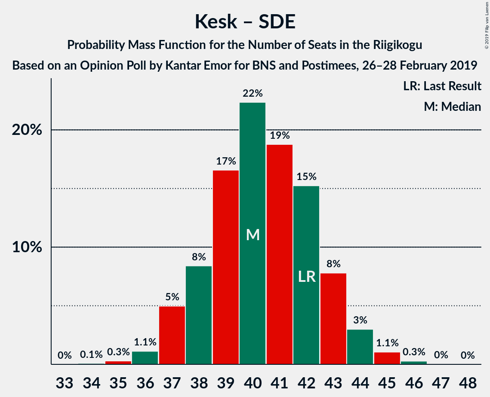

| Number of Seats | Probability | Accumulated | Special Marks |
|:---------------:|:-----------:|:-----------:|:-------------:|
| 34 | 0.1% | 100% |  |
| 35 | 0.3% | 99.9% |  |
| 36 | 1.1% | 99.6% |  |
| 37 | 5% | 98% |  |
| 38 | 8% | 94% |  |
| 39 | 17% | 85% |  |
| 40 | 22% | 69% | Median |
| 41 | 19% | 46% |  |
| 42 | 15% | 27% | Last Result |
| 43 | 8% | 12% |  |
| 44 | 3% | 4% |  |
| 45 | 1.1% | 1.4% |  |
| 46 | 0.3% | 0.3% |  |
| 47 | 0% | 0.1% |  |
| 48 | 0% | 0% |  |

### Eesti Konservatiivne Rahvaerakond – Sotsiaaldemokraatlik Erakond

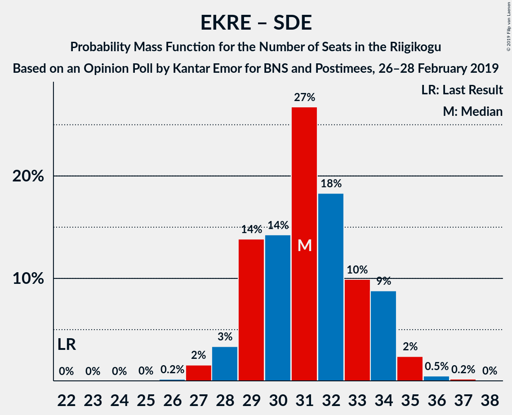

| Number of Seats | Probability | Accumulated | Special Marks |
|:---------------:|:-----------:|:-----------:|:-------------:|
| 22 | 0% | 100% | Last Result |
| 23 | 0% | 100% |  |
| 24 | 0% | 100% |  |
| 25 | 0% | 100% |  |
| 26 | 0.2% | 100% |  |
| 27 | 2% | 99.8% |  |
| 28 | 3% | 98% |  |
| 29 | 14% | 95% |  |
| 30 | 14% | 81% |  |
| 31 | 27% | 67% | Median |
| 32 | 18% | 40% |  |
| 33 | 10% | 22% |  |
| 34 | 9% | 12% |  |
| 35 | 2% | 3% |  |
| 36 | 0.5% | 0.7% |  |
| 37 | 0.2% | 0.2% |  |
| 38 | 0% | 0% |  |

## Technical Information

### Opinion Poll

+ **Polling firm:** Kantar Emor
+ **Commissioner(s):** BNS and Postimees
+ **Fieldwork period:** 26–28 February 2019

### Calculations

+ **Sample size:** 1118
+ **Simulations done:** 524,288
+ **Error estimate:** 2.15%

